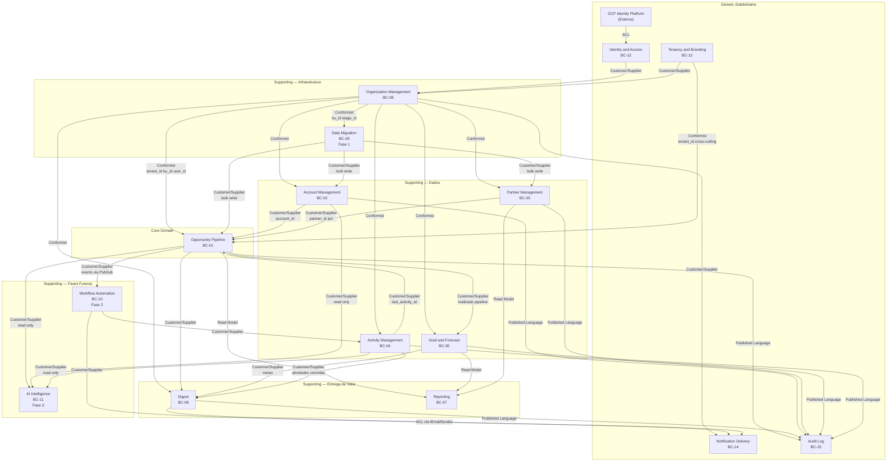

# Diagrama do Context Map — Azim CRM

---

## Legenda

| Cor / Estilo | Significado |
|---|---|
| Core Domain | Opportunity Pipeline — diferencial competitivo central |
| Supporting — Dados | Account, Partner, Activity, Goal: fornecem dados ao Core |
| Supporting — Entrega | Digest, Reporting: consomem e distribuem dados do Core |
| Supporting — Infraestrutura | Organization, Data Migration: habilitam a operação |
| Supporting — Futuro | Workflow Automation (Fase 2), AI Intelligence (Fase 3) |
| Generic | Identity, Tenancy, Notification, Audit: commodities e infraestrutura |

## Notas sobre o Diagrama

1. **ACL (Anti-Corruption Layer):** representado nas arestas GCP Identity Platform → Identity & Access e Digest → Notification Delivery. A ACL protege o modelo interno de mudanças no contrato externo.

2. **Conformist:** Organization Management é Conformist para todos os contextos que consomem tenant_id, bu_id e user_id. Simplificado no diagrama (mostrado apenas para o Core e contextos chave).

3. **tenant_id cross-cutting:** Tenancy & Branding define o tenant_id que é usado por RLS em todos os contextos — representado como "Conformist cross-cutting" no diagrama, pois todos os BCs aceitam o tenant_id sem tradução (Conformist). Não há contrato publicado como Published Language — apenas o UUID de isolamento.

4. **Fases futuras:** Workflow Automation e AI Intelligence são indicados explicitamente como Fase 2 e Fase 3 para deixar claro que são candidatos e não contratos confirmados.
