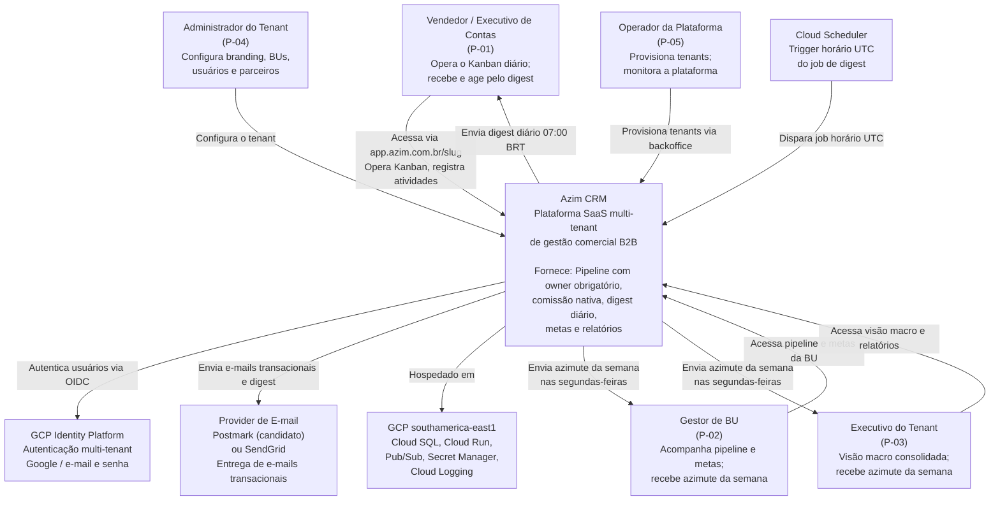

# C4 Level 1 — System Context: Azim CRM

## Diagrama

## Descrição

O **Azim CRM** é a plataforma central que substitui a operação em planilha Excel da Vellus. Cinco tipos de atores humanos interagem com o sistema, três sistemas externos são consumidos e dois sistemas de infraestrutura GCP são utilizados.

### Atores

| Ator | Interação Principal |
|---|---|
| Vendedor (P-01) | Kanban diário, registro de atividades, ação pelo digest |
| Gestor de BU (P-02) | Acompanhamento de pipeline, metas, redistribuição de oportunidades |
| Executivo do Tenant (P-03) | Visão macro, relatórios, azimute da semana |
| Administrador do Tenant (P-04) | Configuração de branding, BUs, usuários, parceiros e metas |
| Operador da Plataforma (P-05) | Provisionamento de tenants, monitoramento da plataforma |

### Sistemas Externos

| Sistema | Finalidade |
|---|---|
| GCP Identity Platform | Autenticação multi-tenant por e-mail/senha e Google OAuth |
| Provider de E-mail (Postmark/SendGrid) | Entrega de digest diário e e-mails transacionais (convites, recuperação de senha) |
| Cloud Scheduler | Disparo do job horário UTC do serviço de digest |
| GCP (Cloud SQL, Cloud Run, Pub/Sub, etc.) | Infraestrutura de hospedagem e execução |
