# C4 Level 3 — Component Diagram: azim-api (Core + Supporting Fase 1)

## Foco: azim-api — Componentes do Monólito Modular

```mermaid
flowchart TB
    WebApp["azim-web\nReact SPA"]
    DigestWorker["azim-digest-worker"]

    subgraph AzimApi["azim-api — ASP.NET Core / .NET 10"]

        subgraph Middleware["Middleware Pipeline"]
            SlugResolver["SlugResolver\nResolve slug para tenant_id\nDefine app.current_tenant"]
            AuthMiddleware["AuthMiddleware\nValida token do GCP Identity Platform\nCarrega papéis do cache"]
            RateLimiter["RateLimiter\nPor tenant_id via Redis"]
        end

        subgraph OpportunityModule["Módulo: Opportunity Pipeline\n(BC-01 — Core Domain)"]
            OppController["OpportunityController\nREST endpoints"]
            KanbanController["KanbanController\nGET /kanban por BU"]
            OppAppService["OpportunityApplicationService\nOrquestra casos de uso"]
            OppDomainService["OpportunityDomainService\nRegras RN-001..RN-028\nCálculo valor_total e forecast"]
            CommissionService["CommissionService\nCálculo e snapshot de comissão\nRN-007, RN-022, RN-026"]
            OppRepo["OpportunityRepository\nEF Core + RLS"]
        end

        subgraph AccountModule["Módulo: Account Management\n(BC-02)"]
            AccountController["AccountController"]
            AccountService["AccountService\nDedupe por nome normalizado\nVisão 360° da conta"]
            AccountRepo["AccountRepository"]
        end

        subgraph PartnerModule["Módulo: Partner Management\n(BC-03)"]
            PartnerController["PartnerController"]
            PartnerService["PartnerService\nPercentuais default\nVisão de comissão"]
            PartnerRepo["PartnerRepository"]
        end

        subgraph ActivityModule["Módulo: Activity Management\n(BC-04)"]
            ActivityController["ActivityController"]
            ActivityService["ActivityService\nTo-do diário\nDetecção de estagnação RN-028"]
            ActivityRepo["ActivityRepository"]
        end

        subgraph GoalModule["Módulo: Goal and Forecast\n(BC-05)"]
            GoalController["GoalController\nForecast endpoint"]
            GoalService["GoalService\nGraceful degradation RN-017\nAgregação derivada RN-027"]
            GoalRepo["GoalRepository"]
        end

        subgraph OrgModule["Módulo: Organization Management\n(BC-08)"]
            OrgController["OrgController\nBUs, usuários, papéis"]
            OrgService["OrgService\nConvite, desativação RN-013\nRBAC"]
            OrgRepo["OrgRepository"]
        end

        subgraph TenancyModule["Módulo: Tenancy and Branding\n(BC-13)"]
            TenancyController["TenancyController\nBranding, slug, fuso"]
            TenancyService["TenancyService\nRN-019: slug imutável\nRN-020: WCAG AA"]
            TenancyRepo["TenancyRepository"]
        end

        subgraph MigrationModule["Módulo: Data Migration\n(BC-09 — Fase 1)"]
            MigrationController["MigrationController\nUpload e dry-run"]
            MigrationService["MigrationService\nDry-run, triagem\nImport transacional RN-023"]
        end

        subgraph ReportingModule["Módulo: Reporting\n(BC-07)"]
            ReportController["ReportController\nFunil, forecast, ranking\ncomissões, export CSV"]
            ReportService["ReportService\nRead models / queries"]
        end

        subgraph InfraModules["Infraestrutura Transversal"]
            AuditService["AuditService\nBC-15 — Append-only\nRN-024, mascaramento PII RN-025"]
            IEmailSender["IEmailSender\nACL para Postmark/SendGrid"]
            TenantContext["TenantContext\nHolder de tenant_id por requisição"]
            EventPublisher["DomainEventPublisher\nPublica para Cloud Pub/Sub"]
        end
    end

    CloudSQL[("Cloud SQL\nPostgreSQL + RLS")]
    Redis[("Memorystore\nRedis")]
    PubSub["Cloud Pub/Sub"]
    GCPIdP["GCP Identity Platform"]
    Postmark["Postmark"]

    WebApp -->|REST / JSON| SlugResolver
    DigestWorker -->|REST / JSON| SlugResolver
    SlugResolver --> AuthMiddleware
    AuthMiddleware --> RateLimiter

    RateLimiter --> OppController
    RateLimiter --> AccountController
    RateLimiter --> PartnerController
    RateLimiter --> ActivityController
    RateLimiter --> GoalController
    RateLimiter --> OrgController
    RateLimiter --> TenancyController
    RateLimiter --> MigrationController
    RateLimiter --> ReportController

    OppController --> OppAppService
    OppAppService --> OppDomainService
    OppAppService --> CommissionService
    OppDomainService --> OppRepo
    CommissionService --> OppRepo

    AccountController --> AccountService
    AccountService --> AccountRepo

    PartnerController --> PartnerService
    PartnerService --> PartnerRepo

    ActivityController --> ActivityService
    ActivityService --> ActivityRepo

    GoalController --> GoalService
    GoalService --> GoalRepo

    OrgController --> OrgService
    OrgService --> OrgRepo

    TenancyController --> TenancyService
    TenancyService --> TenancyRepo

    MigrationController --> MigrationService
    MigrationService --> OppRepo
    MigrationService --> AccountRepo
    MigrationService --> PartnerRepo

    ReportController --> ReportService
    ReportService --> OppRepo
    ReportService --> PartnerRepo
    ReportService --> GoalRepo

    OppAppService --> AuditService
    AccountService --> AuditService
    PartnerService --> AuditService
    ActivityService --> AuditService
    GoalService --> AuditService
    OrgService --> AuditService

    OppAppService --> EventPublisher
    EventPublisher --> PubSub

    AuthMiddleware --> Redis
    AuthMiddleware --> GCPIdP
    TenantContext --> SlugResolver

    OrgService --> IEmailSender
    IEmailSender --> Postmark

    OppRepo --> CloudSQL
    AccountRepo --> CloudSQL
    PartnerRepo --> CloudSQL
    ActivityRepo --> CloudSQL
    GoalRepo --> CloudSQL
    OrgRepo --> CloudSQL
    TenancyRepo --> CloudSQL
    AuditService --> CloudSQL
```

## Descrição dos Componentes Principais

### Core Domain — Opportunity Pipeline

| Componente | Responsabilidade |
|---|---|
| OpportunityController | Endpoints REST de CRUD e transição de estágio |
| KanbanController | Endpoint especializado para visão Kanban com colunas e somas por estágio |
| OpportunityApplicationService | Orquestra casos de uso; coordena validações, regras, auditoria e eventos |
| OpportunityDomainService | Implementa regras de domínio: RN-001 a RN-028; cálculo de valor_total e forecast_ponderado |
| CommissionService | Cálculo de comissão (RN-026); geração e proteção do snapshot imutável (RN-007, RN-022) |
| OpportunityRepository | Persistência via EF Core com Global Query Filter de tenant_id |

### Infraestrutura Transversal

| Componente | Responsabilidade |
|---|---|
| SlugResolver | Middleware que resolve slug → tenant_id antes de qualquer lógica de negócio |
| AuthMiddleware | Valida token do GCP Identity Platform; carrega papéis e BUs do cache Redis |
| AuditService | Append-only; mascaramento de PII antes de persistir (RN-025); campos obrigatórios (RN-024) |
| IEmailSender | Abstração ACL para Postmark/SendGrid; implementação swappable (LAC-03) |
| DomainEventPublisher | Publica eventos de domínio para o Cloud Pub/Sub |
| TenantContext | Holder thread-local/request-scoped do tenant_id corrente |

## Notas

- **RLS dupla garantia:** O TenantContext passa o tenant_id para o EF Core Global Query Filter (C# layer) E para o comando `SET app.current_tenant` (PostgreSQL layer) a cada requisição — qualquer query que "escape" do EF Core ainda está protegida pelo RLS.
- **Módulo de Reporting:** Usa os mesmos repositories dos módulos de origem via read-only queries otimizadas. Fase 2: evoluir para read models via events com o ReportingWorker.
- **Separação física futura:** Cada módulo tem namespace e projeto próprio. Para extrair em microsserviço: extrair o módulo, criar API própria, substituir chamadas diretas por REST/gRPC ou eventos via Pub/Sub.
