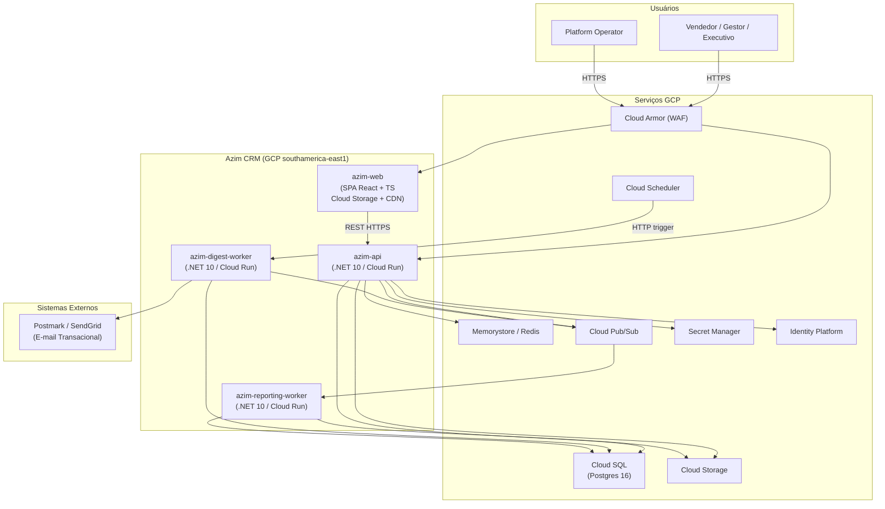
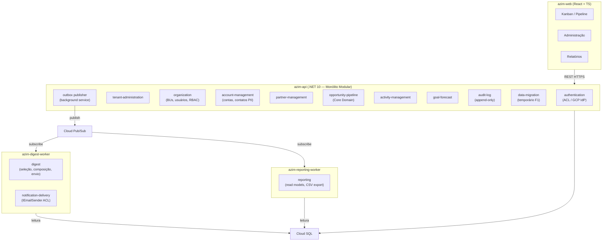
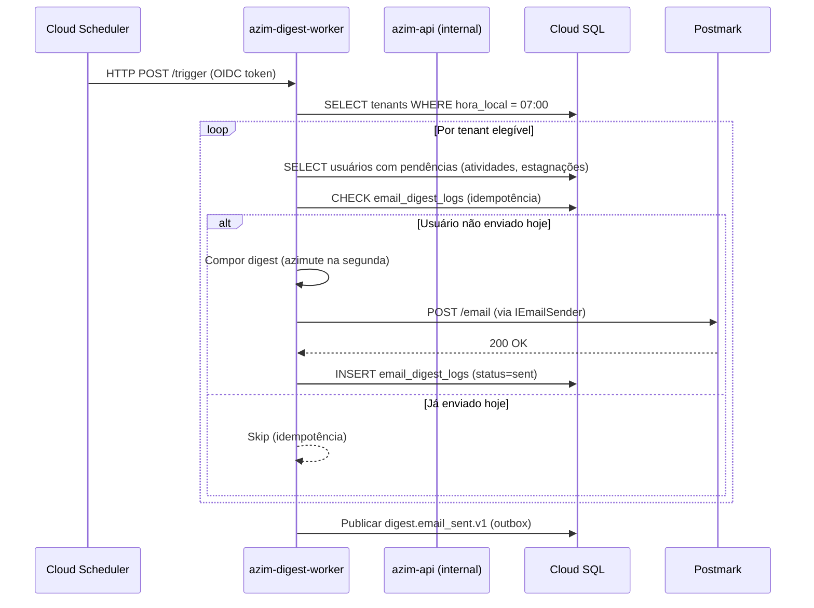
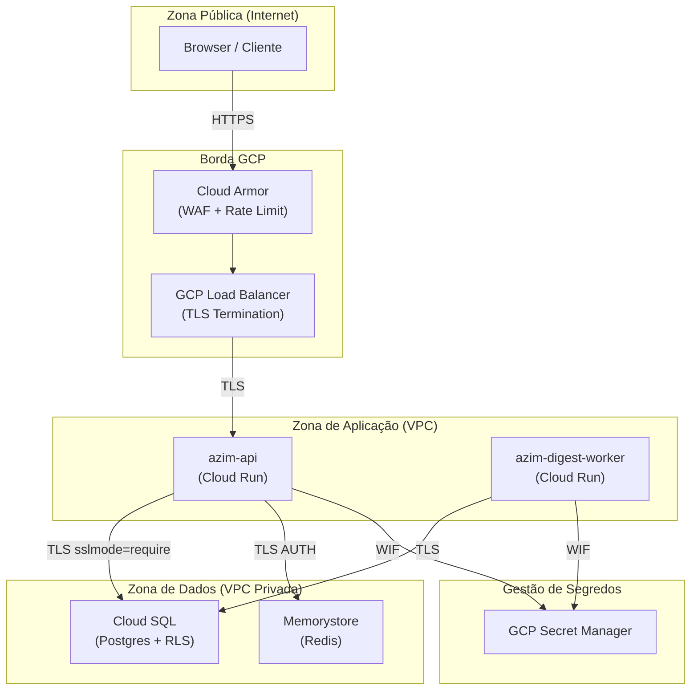
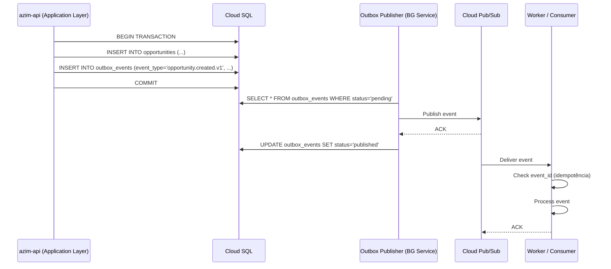

# TRD — Azim CRM

**Produto:** Azim CRM
**Versão:** v1.0
**Data:** 2026-06-11
**Status:** Rascunho para revisão
**Fontes Principais:** PRD v0.1, FRD v0.1, NFRD v0.1, DDD Segmentation v0.1, Data Model v1.0, Modules README v0.1

---

## Controle de Versão

| Versão | Data | Descrição |
|---|---|---|
| v1.0 | 2026-06-11 | Criação inicial do TRD — consolidação de PRD, FRD, NFRD, DDD, Data Model e Modules |
| v1.1 | 2026-06-11 | Ajustes aplicados pelo TRD Validator: adição de commission.calculated.v1/commission.snapshot_created.v1 ao catálogo de eventos (§7.2 e §9.3); endpoint LGPD de anonimização de contato (§8.4); RF-10 na matriz de rastreabilidade (§20); VAL-TRD-13 em pontos a validar (§23) |

---

## Sumário

1. [Introdução](#1-introdução)
2. [Objetivo do Documento](#2-objetivo-do-documento)
3. [Referências](#3-referências)
4. [Consolidação Técnica dos Insumos](#4-consolidação-técnica-dos-insumos)
5. [Visão Técnica da Solução](#5-visão-técnica-da-solução)
6. [Estilo Arquitetural](#6-estilo-arquitetural)
7. [Módulos e Deployables](#7-módulos-e-deployables)
8. [Arquitetura de APIs](#8-arquitetura-de-apis)
9. [Arquitetura de Eventos e Mensageria](#9-arquitetura-de-eventos-e-mensageria)
10. [Arquitetura de Dados](#10-arquitetura-de-dados)
11. [Arquitetura de Integração](#11-arquitetura-de-integração)
12. [Segurança Técnica](#12-segurança-técnica)
13. [Compliance e Privacidade](#13-compliance-e-privacidade)
14. [Observabilidade](#14-observabilidade)
15. [Resiliência, Performance e Escalabilidade](#15-resiliência-performance-e-escalabilidade)
16. [Ambientes, Deploy e Configuração](#16-ambientes-deploy-e-configuração)
17. [CI/CD e Qualidade Técnica](#17-cicd-e-qualidade-técnica)
18. [Operação e Suporte](#18-operação-e-suporte)
19. [Diagramas Técnicos](#19-diagramas-técnicos)
20. [Matriz de Rastreabilidade](#20-matriz-de-rastreabilidade)
21. [Riscos Técnicos](#21-riscos-técnicos)
22. [ADRs a Formalizar](#22-adrs-a-formalizar)
23. [Pontos a Validar](#23-pontos-a-validar)

---

## 1. Introdução

O **Azim CRM** é uma plataforma SaaS de gestão comercial multi-tenant para empresas B2B. O primeiro tenant e operador é a **Vellus**, que opera 108 oportunidades ativas em planilha Excel sem controle de acesso, auditoria, owners obrigatórios ou metas cadastradas — representando R$ 9.013.250 em forecast ponderado sem rastreabilidade.

Este TRD traduz os requisitos de produto (PRD), requisitos funcionais (FRD), requisitos não funcionais (NFRD), decisões arquiteturais (DEC-001 a DEC-013) e modelagem DDD em especificação técnica implementável, cobrindo arquitetura, módulos, contratos de API e eventos, persistência, segurança, observabilidade, deploy e operação.

A arquitetura é orientada por GCP como plataforma-alvo (100% Terraform, região `southamerica-east1`), monólito modular .NET 10 como estratégia de backend na Fase 1, e separação física de workers de carga independente (digest, reporting) como fronteira arquitetural imediata.

---

## 2. Objetivo do Documento

Este TRD responde às seguintes questões técnicas:

- Como a solução será estruturada em módulos, deployables e fronteiras de responsabilidade?
- Quais contratos de API REST e eventos AsyncAPI são necessários por módulo?
- Como os dados são persistidos, isolados por tenant e protegidos?
- Como segurança, LGPD, RBAC e RLS são implementados em profundidade?
- Como a solução será implantada, observada e operada?
- Quais decisões arquiteturais precisam ser formalizadas como ADRs?
- Quais pontos técnicos permanecem em aberto?

---

## 3. Referências

| Documento | Caminho | Observação |
|---|---|---|
| PRD | `docs/product/prd/prd.md` | Visão, escopo, jornadas, KPIs, DEC-001 a DEC-013 |
| FRD | `docs/product/frd-nfrd/frd.md` | Requisitos funcionais RF-01 a RF-13 |
| NFRD | `docs/product/frd-nfrd/nfrd.md` | 59 NFRs; SLOs; segurança; compliance; observabilidade |
| DDD Segmentation | `docs/product/ddd/ddd-segmentation.md` | 15 bounded contexts, 6 deployables candidatos |
| Context Map | `docs/product/ddd/context-map/relations.md` | Relações e padrões entre BCs |
| Data Model | `docs/product/data-model/data-model.md` | Schemas, ownership e fronteiras de persistência |
| Modules README | `docs/product/modules/README.md` | 16 módulos, deployables e integrações |
| Diagramas | `docs/product/modules/diagrams/` | Arquitetura, dependências, integração, compliance LGPD |
| C4 Containers | `docs/product/ddd/diagrams/c4-level-2-containers.md` | Visão de containers C4 |

---

## 4. Consolidação Técnica dos Insumos

### 4.1 Objetivos Técnicos Derivados

| Código | Objetivo Técnico | Origem | Impacto |
|---|---|---|---|
| TOBJ-01 | Monólito modular .NET 10 com fronteiras de módulo alinhadas aos bounded contexts | DDD §7, DEC-006 | Define estrutura de `azim-api` e isolamento futuro |
| TOBJ-02 | Multi-tenancy pooled + RLS como defesa em profundidade com 3 camadas independentes | DEC-006, NFR-SEG-01 | Isolamento obrigatório; testes em CI como gate |
| TOBJ-03 | GCP 100% Terraform, região `southamerica-east1` para todos os ambientes | PRD §5.1 Fase 0 | Infraestrutura reproduzível; sem ponto de config manual |
| TOBJ-04 | Digest diário via Cloud Scheduler + Cloud Pub/Sub + worker separado | DEC-009, NFR-RES-01 | Isolamento de carga; processamento antes das 07:00 BRT |
| TOBJ-05 | Snapshot imutável de comissão de parceiro ao mover oportunidade para Ganho | DEC-002, RN-007, RN-022 | Core diferencial; auditabilidade financeira |
| TOBJ-06 | Numeração sequencial e atômica de oportunidades por tenant (AZ-NNNN) | DEC-001, RN-001 | Substituição da fórmula LARGE da planilha |
| TOBJ-07 | IEmailSender como Anti-Corruption Layer para provider de e-mail | DEC-008, BC-14 | Postmark/SendGrid intercambiáveis sem impacto no domínio |
| TOBJ-08 | CI/CD GitHub Actions + Workload Identity Federation (sem chave de service account) | PRD §5.1 Fase 0 | Segurança de pipeline; sem segredo em repositório |
| TOBJ-09 | Observabilidade via Cloud Logging/Monitoring/Trace com `tenant_id` como label obrigatório | NFR-OBS-01..05, PRD §8.6 | Rastreabilidade multi-tenant; alerta por tenant |
| TOBJ-10 | Outbox pattern para publicação confiável de eventos de domínio com idempotência de consumers | NFR-RES-01/02, DEC-009 | Consistência eventual sem perda de evento |
| TOBJ-11 | Migrations de banco via EF Core executadas como job pré-tráfego no release | NFR-DISP-04 | Janela de manutenção fora das 06:30–09:00 BRT |
| TOBJ-12 | Serviço de IA `azim-ai-service` Python/FastAPI/LangGraph isolado na Fase 3 | PRD RF-13, BC-11 | Stack diferente; rate-limit por tenant via Redis |

### 4.2 Fluxos Críticos

| Código | Fluxo | Criticidade | Requisitos Relacionados |
|---|---|---|---|
| FLOW-01 | Criação e movimentação de oportunidade no Kanban | Alta | RF-06, RN-001..008, NFR-PERF-02/03 |
| FLOW-02 | Snapshot de comissão ao fechar oportunidade como Ganha | Alta | RF-06, DEC-002, RN-007, RN-022 |
| FLOW-03 | Processamento e envio do digest diário às 07:00 BRT | Alta | RF-09, DEC-009, NFR-PERF-05, NFR-RES-02 |
| FLOW-04 | Ação em 1 clique via link autenticado do digest | Alta | RF-09, J-02, NFR-RES-02 |
| FLOW-05 | Autenticação e resolução de tenant por slug | Alta | RF-01, DEC-005, NFR-SEG-01/02 |
| FLOW-06 | Import transacional da planilha com rollback total | Média | RF (migração), RN-023, NFR-PERF-06 |
| FLOW-07 | Cálculo de forecast ponderado e exibição no Kanban | Alta | RF-06, RN-005/006, NFR-PERF-02 |
| FLOW-08 | Relatório de comissões por parceiro (projetado e consolidado) | Média | RF-11, RF-05 |
| FLOW-09 | Isolamento de tenant: requisição de tenant A não acessa dados do tenant B | Alta | NFR-SEG-01, DEC-006, KPI-06 |

### 4.3 Requisitos Funcionais com Impacto Técnico Relevante

| Código | Requisito FRD | Impacto Técnico |
|---|---|---|
| RF-01 | Autenticação via GCP Identity Platform | ACL no módulo `authentication`; JWT validado em cada request; resolução de tenant por slug |
| RF-02 | Administração do tenant / white-label estrito | Módulo `tenant-administration`; CSS variables no frontend; validação WCAG no upload |
| RF-03 | BUs, usuários e papéis com RBAC por BU | Módulo `organization`; middleware de RBAC + RLS; cache de memberships no Memorystore |
| RF-06 | Pipeline Kanban com comissão nativa e owner obrigatório | Módulo `opportunity-pipeline`; snapshot imutável; numeração sequencial atômica; índices compostos |
| RF-09 | Digest diário por e-mail | `azim-digest-worker`; Cloud Scheduler; Pub/Sub; outbox; idempotência por `EmailDigestLog` |
| RF-11 | Relatórios enxutos com export CSV | `azim-reporting-worker`; read models derivados; Cloud Storage para CSV |
| RF-12 | Automações visuais (Fase 2) | `azim-workflow-worker`; React Flow no frontend; execução assíncrona obrigatória via Pub/Sub |
| RF-13 | Agentes de IA (Fase 3) | `azim-ai-service`; Python/FastAPI/LangGraph; Langfuse; Redis rate-limit por tenant |

### 4.4 Requisitos Não Funcionais com Impacto Técnico Relevante

| Código | Requisito NFRD | Impacto Técnico |
|---|---|---|
| NFR-PERF-01 | p95 ≤ 300 ms API geral | Autoscaling Cloud Run; pool de conexões Cloud SQL; índices corretos |
| NFR-PERF-02 | Kanban p95 ≤ 2 s | Índice `(tenant_id, bu_id, stage_id)`; paginação desde MVP |
| NFR-PERF-05 | Digest processado em ≤ 5 min | Worker dedicado Cloud Run; Pub/Sub para paralelização por tenant |
| NFR-DISP-01 | Tier 1 ≥ 99,5% mensal | Cloud Run autoscaling; Cloud SQL HA; health checks configurados |
| NFR-SEG-01 | Zero vazamentos entre tenants | EF Core global query filter + RLS + testes CI como gate obrigatório |
| NFR-SEG-05 | Segredos apenas via GCP Secret Manager | Injeção em Cloud Run via Secret Manager data source no Terraform |
| NFR-SEG-06 | WAF + rate limit via Cloud Armor | Cloud Armor configurado antes do go-live |
| NFR-RES-01 | Execução assíncrona obrigatória | Nenhuma operação pesada bloqueando a API síncrona |
| NFR-RES-02 | Idempotência de eventos | Outbox pattern; `EmailDigestLog` por (user, date); `Idempotency-Key` em APIs |
| NFR-OBS-01 | Logs estruturados com tenant_id | Serilog + Cloud Logging; label `tenant_id` em todo evento |
| NFR-PRIV-01 | PII ausente de logs | Destructuring configurado no Serilog; PII mascarada antes de logar |
| NFR-MAN-01 | Cobertura de testes por camada | Domain ≥ 95%, Application ≥ 85%, Infrastructure ≥ 70%, Frontend ≥ 80% |

### 4.5 Decisões Arquiteturais Existentes (DEC-001 a DEC-013)

| DEC | Decisão | Impacto no TRD |
|---|---|---|
| DEC-001 | Estágios configuráveis por BU; seed derivado da Vellus | Tabela `stages` com probabilidade e categoria (open/won/lost) por BU |
| DEC-002 | Snapshot imutável de comissão ao mover para Ganho | `opportunity_partner_commissions.is_snapshot=true`; trigger de imutabilidade |
| DEC-003 | Metas mensais granulares; agregações trimestrais/anuais derivadas | Tabela `goals` com `(year, month)` + cálculo na query |
| DEC-004 | White-label estrito: logo, favicon, slug, cor primária e cor secundária | CSS variables no frontend; sem CSS por tenant; validação WCAG no upload |
| DEC-005 | GCP Identity Platform multi-tenant; secrets via Secret Manager | ACL `authentication`; Terraform para IdP; nunca senha no banco |
| DEC-006 | Multi-tenancy pooled + RLS Postgres | EF Core global query filter + `SET app.current_tenant`; testes de isolamento em CI |
| DEC-007 | Lead como estágio do funil, não entidade separada | Sem tabela `leads` no MVP; Lead é estágio configurável de `stages` |
| DEC-008 | IEmailSender como ACL para provider de e-mail (Postmark primário) | Interface `IEmailSender`; Postmark via HTTP; SPF/DKIM/DMARC na Fase 0 |
| DEC-009 | Cloud Scheduler em UTC; seleção de tenants por fuso IANA | Worker consulta `tenants.iana_timezone` para determinar elegibilidade |
| DEC-010 | Migração da planilha: dry-run → triagem → import transacional | Módulo `data-migration`; rollback total (RN-023); relatório auditado |
| DEC-011 | Valores monetários como centavos inteiros (integer cents) | `BIGINT` para todos os campos de valor; sem `DECIMAL` para money |
| DEC-012 | Parceiro sem login no MVP | Sem entrada no Identity Platform para parceiro; `Partner` é dado do tenant |
| DEC-013 | Billing SaaS fora do escopo do MVP | Sem módulo de cobrança; estrutura preparada para diferenciação futura |

### 4.6 Bounded Contexts e Módulos

| Bounded Context | Módulo | Deployable | Fase |
|---|---|---|---|
| Opportunity Pipeline (BC-01) | opportunity-pipeline | azim-api | Fase 1 |
| Account Management (BC-02) | account-management | azim-api | Fase 1 |
| Partner Management (BC-03) | partner-management | azim-api | Fase 1 |
| Activity Management (BC-04) | activity-management | azim-api | Fase 1 |
| Goal & Forecast (BC-05) | goal-forecast | azim-api | Fase 1 |
| Digest (BC-06) | digest | azim-digest-worker | Fase 1 |
| Reporting (BC-07) | reporting | azim-reporting-worker | Fase 1/2 |
| Organization Management (BC-08) | organization | azim-api | Fase 1 |
| Data Migration (BC-09) | data-migration | azim-api | Fase 1 (temporário) |
| Workflow Automation (BC-10) | workflow-automation | azim-workflow-worker | Fase 2 |
| AI Intelligence (BC-11) | ai-intelligence | azim-ai-service | Fase 3 |
| Identity & Access (BC-12) | authentication | azim-api | Fase 1 |
| Tenancy & Branding (BC-13) | tenant-administration | azim-api | Fase 1 |
| Notification Delivery (BC-14) | notification-delivery | azim-digest-worker / azim-api | Fase 1 |
| Audit Log (BC-15) | audit-log | azim-api | Fase 1 |

### 4.7 Integrações Externas

| Código | Sistema Externo | Tipo | Direção | Impacto Técnico |
|---|---|---|---|---|
| INT-01 | GCP Identity Platform | OAuth2/OIDC | Entrada | ACL no módulo `authentication`; JWT validado em todo request |
| INT-02 | Postmark (primário) / SendGrid (alternativa) | HTTP API | Saída | IEmailSender como ACL; SPF/DKIM/DMARC no domínio `mail.azim.com.br` |
| INT-03 | Cloud Scheduler | HTTP trigger | Entrada | Trigger do digest worker; endpoint protegido |
| INT-04 | Cloud Pub/Sub | Mensageria | Bidirecional | Eventos de domínio; digest; automações Fase 2 |
| INT-05 | Cloud Storage (GCS) | Object Storage | Saída | Export CSV de relatórios; assets de branding (logo, favicon) |
| INT-06 | Vertex AI + Langfuse | HTTP API | Saída | Fase 3 apenas; isolado no `azim-ai-service` |

### 4.8 Dados Críticos

| Código | Dado | Categoria | Módulo Dono | Impacto Técnico |
|---|---|---|---|---|
| DATA-01 | Oportunidades (owner, valor, comissão, estágio) | Operacional | opportunity-pipeline | Core; índices compostos; RLS |
| DATA-02 | Contatos (nome, e-mail, celular) | PII / LGPD | account-management | PII mascarada em logs; retenção controlada |
| DATA-03 | Usuários (e-mail, display_name) | PII / LGPD | organization | Email visível apenas por tenant; sem senha no banco |
| DATA-04 | Snapshot de comissão | Financeiro / Imutável | opportunity-pipeline | Append-only com trigger; auditabilidade |
| DATA-05 | AuditLog (toda escrita de negócio) | Auditoria / LGPD | audit-log | delta_json com PII mascarada; append-only |
| DATA-06 | EmailDigestLog (user_id, date, status) | Operacional | digest | Idempotência de envio; KPI-03/04 |
| DATA-07 | Metas mensais (valor_meta em centavos) | Operacional / Financeiro | goal-forecast | DEC-011: BIGINT; graceful degradation |
| DATA-08 | Tenant / TenantBranding (slug, cores, fuso) | Configuração | tenant-administration | Cross-cutting RLS; imutabilidade de slug |

### 4.9 Pontos a Validar (oriundos dos insumos)

| Código | Ponto | Origem | Impacto |
|---|---|---|---|
| VAL-TRD-01 | Confirmar provider de e-mail (Postmark vs SendGrid) via spike de entregabilidade | LAC-03, DEC-008 | Contrato de integração INT-02 |
| VAL-TRD-02 | Decisão sobre reporting como worker assíncrono desde Fase 1 ou módulo síncrono do azim-api | DDD-VAL-02, VAL-MOD-03 | Deployable azim-reporting-worker |
| VAL-TRD-03 | Retenção de audit_logs e contacts (PII) sob LGPD — confirmar com jurídico antes do go-live | VAL-08, LAC-07 | Política de expurgo e evidência de compliance |
| VAL-TRD-04 | Threshold de rate limit no Cloud Armor (requisições por IP por minuto) | NFR-SEG-06 | Configuração Terraform do Cloud Armor |
| VAL-TRD-05 | Política de expiração do token de link autenticado do digest (ex.: 24h ou 48h) | J-02, BC-06 | `digest_action_tokens.expires_at`; usabilidade |
| VAL-TRD-06 | Pool de conexões Cloud SQL: tamanho máximo por ambiente e estratégia de conexão (pgBouncer vs Cloud SQL Proxy) | NFR-ESC-01 | Dimensionamento para 50 tenants |
| VAL-TRD-07 | Confirmar ADR sobre stack de observabilidade GCP vs referências Prometheus/Grafana/Jaeger nas regras .forge | PTV-08, NFRD §3 | ADR-0007 a formalizar |
| VAL-TRD-08 | Suporte a multimoeda antes do schema freeze — campo `currency` em opportunities e commissions | LAC-05 | Decisão urgente antes de migrar a planilha |

---

## 5. Visão Técnica da Solução

O Azim CRM é uma plataforma SaaS multi-tenant construída sobre GCP como plataforma exclusiva, com infraestrutura 100% declarada em Terraform. O backend adota a estratégia de **monólito modular** na Fase 1 — um único deployable `azim-api` com módulos internos bem definidos e alinhados aos bounded contexts do DDD — com workers separados para cargas de ciclo independente (digest, reporting) e expansão planejada para serviço de IA em Python na Fase 3.

O isolamento de tenants é a prioridade de segurança número um, implementado em três camadas independentes: EF Core global query filter, RLS Postgres via `SET app.current_tenant`, e suite de testes automatizados em CI como gate de merge obrigatório.

O diferencial competitivo central — digest diário às 07:00 BRT que leva o CRM ao vendedor — é implementado como worker assíncrono separado da API de negócio, acionado por Cloud Scheduler via Pub/Sub, com idempotência garantida por `EmailDigestLog`.

### 5.1 Decisões Técnicas Norteadoras

| Decisão | Origem | Justificativa |
|---|---|---|
| Monólito modular .NET 10 na Fase 1 | DDD §10, DEC-006 | Um único tenant em prd na Fase 1; separação prematura aumentaria complexidade sem ganho; fronteiras de módulo preservam separação física futura |
| GCP como única plataforma de infraestrutura | PRD §5.1 Fase 0, DEC-005 | Identity Platform, Cloud SQL, Cloud Run, Pub/Sub, Cloud Armor, Secret Manager — stack integrado sem dependências externas ao GCP |
| Pool + RLS como estratégia de multi-tenancy | DEC-006, REST-05 | Suporta centenas de tenants sem retrabalho arquitetural; pesquisa adversarial validou a abordagem (research multi-tenant CRM) |
| Outbox pattern para eventos de domínio | NFR-RES-01/02, DEC-009 | Garante publicação confiável de eventos mesmo com falha transiente do Pub/Sub; idempotência no consumer via `event_id` |
| Cloud Run como runtime de todos os serviços | PRD §5.1 | Serverless; autoscaling nativo; sem gestão de VMs; custo proporcional ao uso |
| React + TypeScript como frontend único | DDD §7, Modules README | SPA com theming por tenant via CSS variables; Kanban com drag-and-drop; React Flow para automações (Fase 2) |

---

## 6. Estilo Arquitetural

**Estilo primário:** Monólito Modular orientado a eventos com workers especializados

A solução combina:
- **Monólito modular** (`azim-api`): todos os módulos de negócio da Fase 1 residem em um único processo .NET 10, com separação interna por projeto/namespace alinhada aos bounded contexts. Módulos se comunicam por interfaces de aplicação internas, nunca por chamadas HTTP entre eles na Fase 1.
- **Workers assíncronos**: `azim-digest-worker` e `azim-reporting-worker` são deployables independentes que consomem eventos do Pub/Sub ou são acionados por Cloud Scheduler. Têm ciclo de release independente da API.
- **Orientado a eventos via Outbox**: eventos de domínio são persistidos na tabela de outbox dentro da mesma transação que altera o estado de negócio, garantindo consistência eventual sem two-phase commit.
- **Anti-Corruption Layers**: `authentication` (GCP Identity Platform) e `notification-delivery` (Postmark/SendGrid) são módulos ACL que isolam o modelo de domínio de contratos externos voláteis.
- **Frontend SPA**: `azim-web` (React + TypeScript) é stateless e consome exclusivamente a API REST do `azim-api` via HTTPS.
- **Microservice isolado na Fase 3**: `azim-ai-service` (Python/FastAPI) é fisicamente separado por stack tecnológica, isolamento de custo por tenant e modelo de implantação distinto.

**Camadas internas do `azim-api`:**

```
azim-api
├── Domain/          (entidades, objetos de valor, regras de negócio — DDD puro)
├── Application/     (use cases, comandos, eventos de aplicação, interfaces)
├── Infrastructure/  (EF Core, Pub/Sub publisher, Identity ACL, email ACL)
└── Api/             (controllers, middleware, DTOs, mapeamento)
```

---

## 7. Módulos e Deployables

### 7.1 Visão Geral

| Deployable | Tipo | Bounded Contexts | Runtime | Fase | Criticidade |
|---|---|---|---|---|---|
| `azim-api` | Monólito Modular | BC-01..05, BC-08/09/12/13/15 | .NET 10, Cloud Run | Fase 1 | Tier 1/2 |
| `azim-digest-worker` | Worker / CronJob | BC-06, BC-14 | .NET 10, Cloud Run | Fase 1 | Tier 1 |
| `azim-reporting-worker` | Worker | BC-07 | .NET 10, Cloud Run | Fase 1/2 | Tier 2 |
| `azim-web` | Frontend SPA | Cross-cutting | React + TS, Cloud Storage + CDN | Fase 1 | Tier 1 |
| `azim-workflow-worker` | Worker | BC-10 | .NET 10, Cloud Run | Fase 2 | Tier 3 |
| `azim-ai-service` | Microservice | BC-11 | Python 3.12, FastAPI, Cloud Run | Fase 3 | Tier 3 |

---

### 7.2 Deployable — `azim-api`

**Objetivo:** API REST principal da plataforma. Serve como ponto de entrada para todos os clientes (SPA, digest worker, integrações futuras). Implementa o ciclo de vida de negócio completo da Fase 1.

**Responsabilidades:** autenticação e resolução de tenant; CRUD de oportunidades, contas, contatos, parceiros, atividades, metas; cálculo de comissão e forecast; pipeline Kanban; relatórios síncronos da Fase 1; import transacional da planilha; auditoria cross-cutting; exposição de configurações de branding para o frontend.

**Módulos Internos:**

| Módulo | Responsabilidade |
|---|---|
| authentication | ACL do GCP Identity Platform; validação de JWT; resolução de tenant por slug |
| tenant-administration | Provisionamento de tenant; slug imutável; fuso IANA; branding (logo/favicon/cores) |
| organization | BUs; usuários; papéis; RBAC; convites; memberships por BU |
| account-management | Contas e contatos (PII); dedupe por nome normalizado; visão 360° |
| partner-management | Parceiros; percentuais default de comissão; visão de comissão projetada/consolidada |
| opportunity-pipeline | Ciclo de vida de oportunidades; Kanban; snapshot imutável de comissão; numeração atômica |
| activity-management | Atividades e follow-ups; detecção de estagnação (> 14 dias sem atividade) |
| goal-forecast | Metas mensais; painel realizado vs meta; graceful degradation |
| audit-log | Registro imutável de toda escrita de entidade de negócio (cross-cutting) |
| data-migration | Import transacional da planilha Vellus.xlsx (temporário; Fase 1) |

**APIs Expostas:** ver Seção 8.

**Eventos Publicados** (via outbox → Pub/Sub):

| Evento | Consumidores |
|---|---|
| `opportunity.created.v1` | audit-log, reporting, workflow-automation (Fase 2) |
| `opportunity.stage_changed.v1` | audit-log, digest (estagnação), reporting, workflow-automation (Fase 2) |
| `opportunity.won.v1` | audit-log, reporting, digest (azimute) |
| `opportunity.lost.v1` | audit-log, reporting |
| `opportunity.stale.v1` | digest, workflow-automation (Fase 2) |
| `opportunity.reopened.v1` | audit-log, reporting |
| `commission.calculated.v1` | reporting |
| `commission.snapshot_created.v1` | audit-log, reporting |
| `activity.created.v1` | digest, audit-log |
| `activity.completed.v1` | digest, audit-log, reporting |
| `activity.overdue.v1` | digest |
| `goal.updated.v1` | digest (bloco de metas), reporting |
| `tenant.branding_changed.v1` | azim-web (CDN invalidation) |

**Dados Próprios:**

| Tabela / Entidade | Persistência |
|---|---|
| `tenants`, `tenant_brandings` | Cloud SQL / Postgres |
| `business_units`, `users`, `user_memberships`, `user_invitations` | Cloud SQL / Postgres |
| `stages`, `origin_channels`, `loss_reasons` | Cloud SQL / Postgres |
| `accounts`, `contacts` (PII) | Cloud SQL / Postgres |
| `partners` | Cloud SQL / Postgres |
| `opportunities`, `opportunity_stage_transitions`, `opportunity_partner_commissions` | Cloud SQL / Postgres |
| `activities` | Cloud SQL / Postgres |
| `goals` | Cloud SQL / Postgres |
| `audit_logs` (append-only) | Cloud SQL / Postgres |
| `outbox_events` | Cloud SQL / Postgres (transacional com escrita de negócio) |
| `migration_jobs`, `migration_logs` (temporário) | Cloud SQL / Postgres |

**Dependências:**

| Dependência | Tipo | Obrigatória? |
|---|---|---|
| Cloud SQL / Postgres | Banco de dados principal | Sim |
| Memorystore / Redis | Cache de memberships; rate-limit | Sim |
| GCP Identity Platform | Autenticação OAuth2/OIDC | Sim |
| Cloud Pub/Sub | Publicação de eventos de domínio | Sim |
| GCP Secret Manager | Injeção de segredos | Sim |
| Cloud Storage | Upload de logo e favicon | Sim |

---

### 7.3 Deployable — `azim-digest-worker`

**Objetivo:** Worker de processamento do digest diário. Acionado pelo Cloud Scheduler (trigger HTTP) às horas configuradas. Seleciona tenants e usuários elegíveis por fuso IANA, compõe o conteúdo do digest e envia via IEmailSender. Isolado da API para garantir que falha no digest não afeta a operação transacional.

**Módulos Internos:** `digest`, `notification-delivery`

**Eventos Consumidos:**

| Evento | Produtor |
|---|---|
| `opportunity.stale.v1` | azim-api |
| `activity.overdue.v1` | azim-api |

**Dados Próprios:** `email_digest_logs`, `digest_action_tokens`

**Dependências:** Cloud SQL (leitura de oportunidades, atividades, metas, tenants); Pub/Sub; IEmailSender (Postmark/SendGrid); Secret Manager.

---

### 7.4 Deployable — `azim-reporting-worker`

**Objetivo:** Worker de geração de read models assíncronos para relatórios de longa duração. Na Fase 1, pode operar como módulo síncrono do `azim-api` (ver VAL-TRD-02). Na Fase 2, torna-se worker dedicado para relatórios pesados e export CSV via Cloud Storage.

**Módulos Internos:** `reporting`

**Dados Próprios:** nenhum (apenas leitura de read models)

**Dependências:** Cloud SQL (leitura); Cloud Storage (escrita de CSV exportado).

---

### 7.5 Deployable — `azim-web`

**Objetivo:** SPA React + TypeScript. Interface única da plataforma. Theming por tenant via CSS variables. Inclui Kanban com drag-and-drop, pipeline, formulários, relatórios, digest action pages e backoffice de tenant admin.

**Tecnologia:** React 18+, TypeScript, Vite; servido via Cloud Storage + Google Cloud CDN.

**Dependências:** `azim-api` (REST via HTTPS); GCP Identity Platform (redirect OAuth).

---

### 7.6 Deployable — `azim-workflow-worker` (Fase 2)

**Objetivo:** Worker de execução assíncrona de automações visuais por BU. Consome eventos de domínio do Pub/Sub e executa nós de workflow (criar atividade, atualizar campo, notificar, enviar e-mail, webhook). Nunca síncrono.

**Módulos Internos:** `workflow-automation`

**Dados Próprios:** `workflow_definitions`, `workflow_executions`

---

### 7.7 Deployable — `azim-ai-service` (Fase 3)

**Objetivo:** Microservice de inteligência artificial para scoring de oportunidades, resumo 360° de conta (briefing), próxima melhor ação e copilot conversacional. Stack Python 3.12 / FastAPI / LangGraph. Observabilidade total via Langfuse. Rate-limit por tenant via Redis.

**Módulos Internos:** `ai-intelligence`

**APIs Expostas:** ver Seção 8 (endpoints `/api/v1/ai/*`).

**Dados Próprios:** `scoring_results`, `briefings` (Fase 3)

**Dependências:** Cloud SQL (leitura de oportunidades e contas); Vertex AI; Langfuse; Redis (rate-limit por tenant).

---

## 8. Arquitetura de APIs

### 8.1 Princípios

| Princípio | Aplicação |
|---|---|
| Versionamento | Prefixo `/api/v1/` em todas as rotas; breaking changes exigem nova versão |
| Autenticação | JWT Bearer em todo endpoint autenticado; validado via GCP Identity Platform |
| Tenant-scoping | `X-Tenant-Slug` ou resolução via domínio do slug; middleware de tenant obrigatório antes de qualquer acesso a dados |
| Idempotência | Header `Idempotency-Key` em operações de escrita críticas (criação de oportunidade, digest action) |
| Paginação | Cursor-based ou offset/limit; padrão: `?page=1&limit=50`; máximo 200 por página |
| Filtros | Query params em camelCase (ex.: `?ownerId=`, `?stageId=`, `?isStale=true`) |
| Erros padronizados | Envelope `{ "error_code", "message", "details", "correlation_id" }` |
| Rate limiting | Cloud Armor na borda; rate limit por tenant via Redis no middleware (Fase 2+) |
| Correlação | Header `X-Correlation-Id` propagado em todos os serviços; gerado no gateway se ausente |
| Resources | kebab-case nas rotas (ex.: `/api/v1/business-units`); IDs como UUID |

### 8.2 Padrão de Erro

```json
{
  "error_code": "OPPORTUNITY_OWNER_REQUIRED",
  "message": "O responsável pela oportunidade é obrigatório.",
  "details": [
    { "field": "owner_id", "issue": "required" }
  ],
  "correlation_id": "01JXXXXXXXXXXXXXXXXXXXXXX"
}
```

### 8.3 Padrão de Headers

| Header | Obrigatório | Finalidade |
|---|---|---|
| `Authorization: Bearer <jwt>` | Sim | Autenticação via Identity Platform |
| `X-Correlation-Id` | Sim (gerado se ausente) | Correlação fim a fim entre serviços |
| `Idempotency-Key` | Em escritas críticas | Prevenção de duplicidade em retentativas |
| `X-Tenant-Slug` | Alternativa ao slug no path | Resolução de tenant em chamadas internas |

### 8.4 Catálogo de APIs por Módulo

#### Módulo: authentication

| Operação | Método | Rota | Autenticação | Descrição |
|---|---|---|---|---|
| Login e-mail/senha | POST | `/api/v1/auth/login` | Pública | Troca credenciais por JWT via Identity Platform |
| Login Google OAuth | GET | `/api/v1/auth/google` | Pública | Redirect para OAuth do Identity Platform |
| Refresh de token | POST | `/api/v1/auth/refresh` | Bearer (refresh token) | Renova access token |
| Logout | POST | `/api/v1/auth/logout` | Bearer | Invalida sessão |
| Ação via token de digest | GET | `/api/v1/digest/actions/{token}` | Pública (token signed) | Conclusão ou reagendamento de atividade em 1 clique |

#### Módulo: tenant-administration

| Operação | Método | Rota | Papel Mínimo | Descrição |
|---|---|---|---|---|
| Obter tenant | GET | `/api/v1/tenant` | Viewer | Dados do tenant corrente |
| Atualizar configurações | PATCH | `/api/v1/tenant` | TenantAdmin | Fuso, digest_time, display_name |
| Obter branding | GET | `/api/v1/tenant/branding` | Viewer | Logo URL, favicon, cores |
| Atualizar branding | PUT | `/api/v1/tenant/branding` | TenantAdmin | Upload de logo/favicon; validação WCAG |
| Provisionar tenant (backoffice) | POST | `/api/v1/platform/tenants` | PlatformOperator | Criar novo tenant com slug e admin |

#### Módulo: organization

| Operação | Método | Rota | Papel Mínimo | Descrição |
|---|---|---|---|---|
| Listar BUs | GET | `/api/v1/business-units` | Viewer | BUs visíveis ao usuário |
| Criar BU | POST | `/api/v1/business-units` | TenantAdmin | Nova BU com nome e configurações |
| Listar usuários | GET | `/api/v1/users` | GestorBU | Usuários do tenant |
| Convidar usuário | POST | `/api/v1/invitations` | TenantAdmin | Envia convite por e-mail com papel e BU |
| Desativar usuário | PATCH | `/api/v1/users/{id}/deactivate` | TenantAdmin | Soft-delete preserva histórico |
| Listar memberships | GET | `/api/v1/users/{id}/memberships` | TenantAdmin | Papéis do usuário por BU |
| Configurar estágios | PUT | `/api/v1/business-units/{id}/stages` | TenantAdmin | Estágios configuráveis por BU |
| Configurar canais | PUT | `/api/v1/business-units/{id}/origin-channels` | TenantAdmin | Canais de origem por BU |
| Configurar motivos de perda | PUT | `/api/v1/business-units/{id}/loss-reasons` | TenantAdmin | Motivos configuráveis por BU |

#### Módulo: account-management

| Operação | Método | Rota | Papel Mínimo | Descrição |
|---|---|---|---|---|
| Listar contas | GET | `/api/v1/accounts` | Viewer | Com busca e filtros |
| Buscar conta por nome | GET | `/api/v1/accounts?search={nome}` | Viewer | Dedupe: retorna sugestão se nome similar existe |
| Criar conta | POST | `/api/v1/accounts` | Vendedor | Com alerta de conta similar |
| Obter conta | GET | `/api/v1/accounts/{id}` | Viewer | Visão 360°: oportunidades, contatos, atividades |
| Atualizar conta | PATCH | `/api/v1/accounts/{id}` | Vendedor | |
| Listar contatos da conta | GET | `/api/v1/accounts/{id}/contacts` | Viewer | PII restrita ao escopo RBAC |
| Criar contato | POST | `/api/v1/accounts/{id}/contacts` | Vendedor | Campos PII: nome, e-mail, celular, cargo |
| Atualizar contato | PATCH | `/api/v1/accounts/{accountId}/contacts/{id}` | Vendedor | |
| Anonimizar / excluir contato (LGPD art. 18) | DELETE | `/api/v1/accounts/{accountId}/contacts/{id}` | TenantAdmin | Direito ao esquecimento; anonimiza PII ou exclui fisicamente conforme decisão jurídica (VAL-TRD-10) |

#### Módulo: partner-management

| Operação | Método | Rota | Papel Mínimo | Descrição |
|---|---|---|---|---|
| Listar parceiros | GET | `/api/v1/partners` | Viewer | |
| Criar parceiro | POST | `/api/v1/partners` | TenantAdmin | Com pct_setup e pct_recorrente default |
| Atualizar parceiro | PATCH | `/api/v1/partners/{id}` | TenantAdmin | |
| Visão de comissão do parceiro | GET | `/api/v1/partners/{id}/commissions` | GestorBU | Projetado (pipeline aberto) e consolidado (Ganho) |

#### Módulo: opportunity-pipeline

| Operação | Método | Rota | Papel Mínimo | Descrição |
|---|---|---|---|---|
| Kanban por BU | GET | `/api/v1/kanban?buId={id}` | Viewer | Colunas com oportunidades, soma e forecast por estágio |
| Listar oportunidades | GET | `/api/v1/opportunities` | Viewer | Filtros: owner, canal, parceiro, estágio, estagnadas |
| Criar oportunidade | POST | `/api/v1/opportunities` | Vendedor | owner_id obrigatório |
| Obter oportunidade | GET | `/api/v1/opportunities/{id}` | Viewer | Linha do tempo inclusa |
| Atualizar oportunidade | PATCH | `/api/v1/opportunities/{id}` | Vendedor | |
| Mover estágio | PATCH | `/api/v1/opportunities/{id}/stage` | Vendedor | Valida regras de estágio (RN-003/004) |
| Definir comissão de parceiro | PUT | `/api/v1/opportunities/{id}/partner-commission` | Vendedor | pct_setup, pct_recorrente, valor_fixo, meses |
| Reabrir oportunidade | PATCH | `/api/v1/opportunities/{id}/reopen` | TenantAdmin / GestorBU | Oportunidades Ganhas ou Perdidas |

#### Módulo: activity-management

| Operação | Método | Rota | Papel Mínimo | Descrição |
|---|---|---|---|---|
| Listar atividades | GET | `/api/v1/activities` | Viewer | Filtros: owner, tipo, status, vencidas, hoje |
| Criar atividade | POST | `/api/v1/activities` | Vendedor | Vinculada a oportunidade ou conta |
| Concluir atividade | PATCH | `/api/v1/activities/{id}/complete` | Vendedor | Idempotente; sugere próxima |
| Reagendar atividade | PATCH | `/api/v1/activities/{id}/reschedule` | Vendedor | Nova data e hora |

#### Módulo: goal-forecast

| Operação | Método | Rota | Papel Mínimo | Descrição |
|---|---|---|---|---|
| Listar metas | GET | `/api/v1/goals` | Viewer | Por BU e/ou responsável, período |
| Criar/atualizar meta | PUT | `/api/v1/goals` | GestorBU | Por BU e/ou owner; mês e ano |
| Painel de forecast | GET | `/api/v1/forecast?buId={}&period={}` | Viewer | Realizado vs meta vs pipeline disponível |

#### Módulo: reporting

| Operação | Método | Rota | Papel Mínimo | Descrição |
|---|---|---|---|---|
| Funil por estágio | GET | `/api/v1/reports/funnel` | GestorBU | Oportunidades e valor por estágio |
| Forecast por BU/mês | GET | `/api/v1/reports/forecast` | GestorBU | Breakdown mensal |
| Ranking por responsável | GET | `/api/v1/reports/ranking` | GestorBU | Valor total e ganhos no período |
| Oportunidades por canal | GET | `/api/v1/reports/channels` | GestorBU | Distribuição por canal de origem |
| Comissões por parceiro | GET | `/api/v1/reports/commissions` | GestorBU | Projetado e consolidado |
| Export CSV | GET | `/api/v1/reports/{type}/export` | GestorBU | Retorna URL assinada do GCS |

#### Módulo: audit-log

| Operação | Método | Rota | Papel Mínimo | Descrição |
|---|---|---|---|---|
| Listar trilha de auditoria | GET | `/api/v1/audit-logs` | TenantAdmin | Filtros: entity_type, entity_id, user_id, período |

#### Módulo: data-migration (Fase 1 — temporário)

| Operação | Método | Rota | Papel Mínimo | Descrição |
|---|---|---|---|---|
| Dry-run de import | POST | `/api/v1/migrations/dry-run` | TenantAdmin | Upload do XLSX; retorna relatório de validação |
| Executar import | POST | `/api/v1/migrations/import` | TenantAdmin | Import transacional com rollback total |
| Status do job | GET | `/api/v1/migrations/{jobId}` | TenantAdmin | Progresso e resultado do import |

#### Módulo: ai-intelligence (Fase 3)

| Operação | Método | Rota | Autenticação | Descrição |
|---|---|---|---|---|
| Scoring de oportunidades | POST | `/api/v1/ai/scoring` | Bearer (interno) | Batch: scores via LangGraph |
| Resumo 360° de conta | POST | `/api/v1/ai/account-brief` | Bearer | Briefing sob demanda |
| Próxima melhor ação | POST | `/api/v1/ai/next-action` | Bearer | Sugestão com justificativa |
| Copilot conversacional | POST | `/api/v1/ai/copilot` | Bearer | Chat síncrono sobre dados do tenant |

---

## 9. Arquitetura de Eventos e Mensageria

### 9.1 Princípios

| Princípio | Aplicação |
|---|---|
| Eventos no passado | Nomes no passado: `opportunity.won.v1`, `activity.completed.v1` |
| Versionamento | Sufixo `.v1` em todos os eventos; breaking changes em nova versão `.v2` |
| Outbox Pattern | Evento persistido na tabela `outbox_events` na mesma transação do estado de negócio; publicador background publica no Pub/Sub com at-least-once |
| Idempotência de consumer | Consumer verifica `event_id` antes de processar; operações duplicadas descartadas |
| DLQ | Mensagens não processáveis após N tentativas vão para Dead Letter Topic |
| Correlação | Campo `correlation_id` obrigatório no envelope de todo evento |
| Tenant isolation | Campo `tenant_id` obrigatório em todo evento; consumers filtram por tenant |

### 9.2 Contrato de Evento (Envelope Padrão)

```json
{
  "event_id": "01JXXXXXXXXXXXXXXXXXXXXXX",
  "event_type": "opportunity.won.v1",
  "event_version": "v1",
  "occurred_at": "2026-06-11T07:00:00Z",
  "correlation_id": "01JXXXXXXXXXXXXXXXXXXXXXX",
  "tenant_id": "550e8400-e29b-41d4-a716-446655440000",
  "aggregate_type": "Opportunity",
  "aggregate_id": "550e8400-e29b-41d4-a716-446655440001",
  "producer": "azim-api",
  "payload": {}
}
```

### 9.3 Event Catalog

| Evento | Produtor | Consumidores | Tópico Pub/Sub | Retenção | Criticidade |
|---|---|---|---|---|---|
| `opportunity.created.v1` | azim-api | audit-log, reporting, workflow-automation (F2) | `azim-opportunities` | 7 dias | Alta |
| `opportunity.stage_changed.v1` | azim-api | audit-log, digest, reporting, workflow-automation (F2) | `azim-opportunities` | 7 dias | Alta |
| `opportunity.won.v1` | azim-api | audit-log, reporting, digest | `azim-opportunities` | 7 dias | Alta |
| `opportunity.lost.v1` | azim-api | audit-log, reporting | `azim-opportunities` | 7 dias | Alta |
| `opportunity.stale.v1` | azim-api (scheduler) | digest, workflow-automation (F2) | `azim-opportunities` | 7 dias | Alta |
| `opportunity.reopened.v1` | azim-api | audit-log, reporting | `azim-opportunities` | 7 dias | Média |
| `commission.calculated.v1` | azim-api | reporting | `azim-opportunities` | 7 dias | Média |
| `commission.snapshot_created.v1` | azim-api | audit-log, reporting | `azim-opportunities` | 7 dias | Alta |
| `activity.created.v1` | azim-api | digest, audit-log | `azim-activities` | 7 dias | Alta |
| `activity.completed.v1` | azim-api | digest, audit-log, reporting | `azim-activities` | 7 dias | Alta |
| `activity.overdue.v1` | azim-api (scheduler) | digest | `azim-activities` | 7 dias | Alta |
| `goal.updated.v1` | azim-api | digest, reporting | `azim-goals` | 7 dias | Média |
| `tenant.branding_changed.v1` | azim-api | azim-web (CDN invalidation) | `azim-tenants` | 7 dias | Baixa |
| `digest.email_sent.v1` | azim-digest-worker | KPI dashboard (leitura via EmailDigestLog) | `azim-digest` | 90 dias | Alta |

### 9.4 Políticas de Consumer

| Política | Descrição |
|---|---|
| Idempotência | Consumers verificam `event_id` em tabela de processados antes de executar |
| DLQ | Mensagens com mais de 5 tentativas vão para `azim-{topic}-dlq`; alerta operacional imediato |
| Retry | Backoff exponencial: 1s, 5s, 30s, 2min, 10min; máximo 5 tentativas |
| Ack | Consumer faz ack apenas após processamento bem-sucedido |
| Tenant filter | Consumer valida que `tenant_id` do evento corresponde ao contexto antes de processar |

### 9.5 Outbox Pattern — Tabela

```sql
outbox_events (
  id              UUID PRIMARY KEY DEFAULT gen_random_uuid(),
  tenant_id       UUID NOT NULL,
  event_type      TEXT NOT NULL,
  aggregate_type  TEXT NOT NULL,
  aggregate_id    UUID NOT NULL,
  payload         JSONB NOT NULL,
  correlation_id  TEXT NOT NULL,
  occurred_at     TIMESTAMPTZ NOT NULL DEFAULT now(),
  published_at    TIMESTAMPTZ,
  retry_count     SMALLINT NOT NULL DEFAULT 0,
  status          VARCHAR(20) NOT NULL DEFAULT 'pending'  -- pending, published, failed
)
```

O publisher background (hosted service .NET) consulta `WHERE status = 'pending'` a cada 5 segundos, publica no Pub/Sub e marca `status = 'published'`.

### 9.6 Cloud Scheduler — Topologia

| Job | Frequência | Trigger | Ação |
|---|---|---|---|
| `digest-trigger` | A cada hora (UTC) | HTTP POST `azim-digest-worker/trigger` | Worker seleciona tenants cujo `iana_timezone` indica 07:00 local |
| `stale-detection` | Diária (ex.: 00:00 UTC) | HTTP POST `azim-api/internal/stale-scan` | Detecta oportunidades > 14 dias sem atividade; publica `opportunity.stale.v1` |
| `activity-overdue` | Diária (ex.: 00:00 UTC) | HTTP POST `azim-api/internal/overdue-scan` | Detecta atividades com `due_at < now()` não concluídas; publica `activity.overdue.v1` |

---

## 10. Arquitetura de Dados

### 10.1 Princípios

- Multi-tenancy pooled: todos os tenants compartilham o mesmo banco Postgres. `tenant_id UUID NOT NULL` é obrigatório em toda tabela de entidade de negócio.
- RLS ativa via `SET app.current_tenant = '<tenant_id>'` no início de cada conexão. EF Core global query filter filtra por `tenant_id` como segunda camada independente.
- Apenas o módulo dono escreve em suas tabelas. Outros módulos consomem via API ou eventos.
- Joins diretos entre tabelas de contextos diferentes são evitados; usar read models ou views projetadas.
- Valores monetários: `BIGINT` em centavos inteiros BRL (DEC-011). Exemplo: R$ 1.000,00 = `100000`.
- Dados imutáveis (snapshot de comissão, audit_log): sem `UPDATE`, sem `DELETE`; imutabilidade garantida por policy/trigger.
- Índices obrigatórios: `(tenant_id, bu_id, stage_id)` em `opportunities`; `(tenant_id, opportunity_id, completed_at)` em `activities`; `(tenant_id, entity_type, entity_id)` em `audit_logs`.

### 10.2 Data Ownership Matrix

| Módulo | Tabela/Entidade | Banco | Dono da Escrita | Consumidores | Forma de Consumo |
|---|---|---|---|---|---|
| tenant-administration | `tenants`, `tenant_brandings` | Cloud SQL | tenant-administration | Todos (RLS cross-cutting) | RLS / API |
| organization | `business_units`, `users`, `user_memberships`, `user_invitations`, `stages`, `origin_channels`, `loss_reasons` | Cloud SQL | organization | Todos os módulos | API / Cache |
| authentication | — (GCP IdP externo) | GCP Identity Platform | GCP IdP | organization | OAuth/OIDC |
| account-management | `accounts`, `contacts` (PII) | Cloud SQL | account-management | opportunity-pipeline, activity-management, reporting | API (restrito) |
| partner-management | `partners` | Cloud SQL | partner-management | opportunity-pipeline, reporting | API |
| opportunity-pipeline | `opportunities`, `opportunity_stage_transitions`, `opportunity_partner_commissions` | Cloud SQL | opportunity-pipeline | digest, reporting, goal-forecast | API / Read Model / Evento |
| activity-management | `activities` | Cloud SQL | activity-management | digest, reporting | API / Evento |
| goal-forecast | `goals` | Cloud SQL | goal-forecast | digest, reporting | API |
| digest | `email_digest_logs`, `digest_action_tokens` | Cloud SQL | digest | KPI dashboard | API (somente leitura) |
| audit-log | `audit_logs` (append-only) | Cloud SQL | audit-log | TenantAdmin, GestorBU | API (somente leitura) |
| data-migration | `migration_jobs`, `migration_logs` | Cloud SQL | data-migration | — | Interno |
| azim-api (outbox) | `outbox_events` | Cloud SQL | azim-api | Pub/Sub publisher | Interno |

### 10.3 Persistências e Bancos

| Persistência | Produto GCP | Uso | Módulos Principais | Observações |
|---|---|---|---|---|
| Relational DB | Cloud SQL / Postgres 16 | Dados de negócio e configuração | Todos | HA com failover; PITR ativo (RPO ≤ 5 min); encryption at rest gerenciado GCP |
| Cache | Memorystore / Redis | Sessão, memberships RBAC, rate-limit IA | organization, authentication, ai-intelligence | TTL configurável; sem PII |
| Object Storage | Cloud Storage | Ativos de branding (logo, favicon), CSV de export | tenant-administration, reporting | Buckets por ambiente; signed URLs para download |
| Mensageria | Cloud Pub/Sub | Eventos de domínio assíncronos | azim-api, azim-digest-worker, azim-reporting-worker | Retenção 7 dias; DLQ por tópico |

### 10.4 Read Models

| Read Model | Fontes | Consumidor | Atualização |
|---|---|---|---|
| `KanbanView` | `opportunities`, `stages` | azim-web (Kanban) | Síncrona na query (índice composto) |
| `FunnelReport` | `opportunities`, `stages` | reporting | Síncrona Fase 1; assíncrona via worker Fase 2 |
| `CommissionReport` | `opportunity_partner_commissions`, `partners` | reporting | Síncrona Fase 1 |
| `ForecastView` | `opportunities`, `goals` | goal-forecast, digest | Síncrona na query |
| `StagnationView` | `opportunities`, `activities` | digest, Kanban | Calculada em tempo real (índice em `activities.due_at`) |
| `Account360View` | `accounts`, `opportunities`, `activities`, `contacts` | azim-web | Síncrona na query |

### 10.5 Retenção de Dados

| Dado | Retenção | Motivo | Expurgo |
|---|---|---|---|
| `audit_logs` | A definir com jurídico (VAL-TRD-03) | Obrigação legal LGPD + auditoria interna | Expurgo automatizado após prazo |
| `contacts` (PII) | A definir com jurídico (VAL-TRD-03) | LGPD art. 16 — mínimo necessário | Anonimização ou exclusão a pedido |
| `email_digest_logs` | 90 dias | KPI-03/04; análise de entregabilidade | Purge batch mensal |
| `digest_action_tokens` | 48 horas após criação (VAL-TRD-05 define prazo exato) | Segurança de token de 1 clique | Purge automático após `expires_at` |
| `outbox_events` (published) | 7 dias | Resiliência e debug de publicação | Purge batch diário |
| `migration_jobs/logs` | 30 dias pós-import | Auditoria da migração Vellus | Expurgo manual pós-Fase 1 |

---

## 11. Arquitetura de Integração

### 11.1 Integrações Externas

| Sistema | Finalidade | Protocolo | Autenticação | Direção | Criticidade |
|---|---|---|---|---|---|
| GCP Identity Platform | Autenticação OAuth2/OIDC multi-tenant | REST / OIDC | Service Account (WIF) | Bidirecional | Alta |
| Postmark (primário) | Envio de digest e e-mails transacionais | REST (HTTP API) | API Key (Secret Manager) | Saída | Alta |
| SendGrid (alternativa) | Backup de provider de e-mail | REST | API Key (Secret Manager) | Saída | Alta |
| Cloud Scheduler | Trigger do digest e jobs de detecção | HTTP | OIDC token (WIF) | Entrada | Alta |
| Cloud Pub/Sub | Eventos de domínio assíncronos | gRPC / HTTP | Service Account (WIF) | Bidirecional | Alta |
| Cloud Storage | Ativos de branding; export CSV | REST (GCS API) | Service Account (WIF) | Saída | Média |
| Vertex AI | Inferência de LLM (Fase 3) | REST | Service Account (WIF) | Saída | Baixa (F3) |
| Langfuse | Observabilidade de IA — tracing (Fase 3) | REST | API Key (Secret Manager) | Saída | Baixa (F3) |

### 11.2 Integrações Internas

| Origem | Destino | Protocolo | Contrato | Observações |
|---|---|---|---|---|
| azim-web | azim-api | HTTPS REST | OpenAPI por módulo | SPA → API; sem acesso direto ao banco |
| azim-digest-worker | azim-api | HTTPS REST (interno) | Endpoints `/internal/*` | Leitura de oportunidades/atividades/metas para composição do digest |
| azim-digest-worker | Cloud Pub/Sub | gRPC | Eventos `digest.*` | Publicação de `digest.email_sent.v1` |
| azim-reporting-worker | Cloud SQL | TCP / Postgres | Queries read-only | Leitura de read models; sem escrita |
| azim-reporting-worker | Cloud Storage | REST | GCS signed URL | Upload de CSV exportado |
| azim-workflow-worker (F2) | azim-api | HTTPS REST (interno) | Endpoints de ação | Execução de ações de automação sobre o domínio |
| azim-ai-service (F3) | Cloud SQL | TCP / Postgres | Views read-only | Snapshots de dados por tenant para scoring |
| azim-api (outbox publisher) | Cloud Pub/Sub | gRPC | Envelope de evento padrão | Publicação assíncrona de eventos de domínio |

### 11.3 Padrões de Integração Aplicados

| Padrão | Aplicação |
|---|---|
| Anti-Corruption Layer (ACL) | `authentication` (GCP IdP); `notification-delivery` (Postmark/SendGrid) |
| Outbox Pattern | Publicação confiável de eventos de domínio com consistência transacional |
| Retry com backoff exponencial | Chamadas ao provider de e-mail; falhas transientes do Pub/Sub |
| Circuit Breaker | Proteção do digest worker contra indisponibilidade do provider de e-mail |
| Published Language | Contratos de eventos de domínio versionados (`.v1`) como linguagem publicada |
| Read Model | Relatórios consomem projeções otimizadas sem acesso ao modelo transacional |

---

## 12. Segurança Técnica

### 12.1 Princípios

- Menor privilégio: Cloud Run services com service accounts dedicadas e permissões mínimas.
- Defesa em profundidade: 3 camadas de isolamento de tenant independentes.
- Zero trust na borda: Cloud Armor (WAF) antes de qualquer tráfego chegar ao Cloud Run.
- Nenhuma senha no sistema Azim: autenticação 100% delegada ao GCP Identity Platform.
- Zero segredo em código/imagem/repositório: Secret Manager como única fonte de segredos.
- PII proibida em logs: mascaramento no Serilog antes de qualquer gravação no Cloud Logging.

### 12.2 Autenticação

| Canal | Mecanismo |
|---|---|
| Usuário humano (browser) | GCP Identity Platform; OAuth2/OIDC; JWT Bearer em todo request |
| Login Google | Google OAuth via Identity Platform; redirect flow |
| Serviço interno (Cloud Scheduler → worker) | OIDC token via Workload Identity Federation |
| Serviço interno (worker → azim-api) | OIDC token de service account dedicada |
| CI/CD (GitHub Actions → GCP) | Workload Identity Federation; sem chave de service account |

### 12.3 Autorização — RBAC

| Papel | Permissões Técnicas |
|---|---|
| Platform Operator | Acesso ao backoffice de plataforma (`/api/v1/platform/*`); sem acesso a dados de negócio dos tenants |
| Tenant Admin | Todos os endpoints do tenant; CRUD de usuários, BUs, estágios, parceiros; reabrir oportunidades |
| Gestor de BU | CRUD de oportunidades e atividades da sua BU; relatórios; redistribuição de oportunidades |
| Vendedor | CRUD de oportunidades e atividades próprias; visão do Kanban da BU |
| Viewer | Somente leitura em oportunidades, contas e relatórios da BU |

**Verificação em camadas:**
1. Middleware ASP.NET Core: verifica papel do usuário antes do controller.
2. Service layer: verifica ownership de BU e recurso.
3. RLS Postgres: bloqueia acesso a rows de outros tenants independentemente da camada de aplicação.

### 12.4 Multi-Tenancy — Três Camadas Independentes

| Camada | Implementação | Falha independente? |
|---|---|---|
| EF Core Global Query Filter | `WHERE tenant_id = @currentTenant` adicionado automaticamente em toda query | Sim |
| RLS Postgres | `SET app.current_tenant = '<id>'` no início da conexão; policy `USING (tenant_id = current_setting('app.current_tenant')::uuid)` | Sim |
| Testes de isolamento em CI | Suite automatizada: tenant A tenta acessar dados do tenant B via API e SQL; ambos devem ser bloqueados | Gate obrigatório de merge |

### 12.5 Criptografia

| Dado / Canal | Em Trânsito | Em Repouso | Observação |
|---|---|---|---|
| Tráfego externo (browser → Cloud Run) | TLS 1.2+ (GCP Load Balancer) | N/A | SSL Policy configurado via Terraform |
| Tráfego interno (Cloud Run → Cloud SQL) | TLS (sslmode=require) | Encryption at rest GCP (AES-256) | Cloud SQL managed encryption |
| Tráfego interno (Cloud Run → Memorystore) | TLS (AUTH habilitado) | Encryption at rest GCP | Memorystore Redis com in-transit encryption |
| Dados de contatos (PII) | TLS em trânsito | Encryption at rest GCP | Sem criptografia em nível de campo no MVP (VAL-TRD-09) |
| Snapshot de comissão | TLS em trânsito | Encryption at rest GCP | Imutabilidade por trigger, não por criptografia |
| Assets de branding (GCS) | TLS em trânsito | Encryption at rest GCP | Buckets não públicos; signed URLs temporárias |

### 12.6 Gestão de Segredos

| Segredo | Armazenamento | Injeção | Rotação |
|---|---|---|---|
| Connection string Cloud SQL | Secret Manager | Cloud Run env via Terraform data source | Manual com downtime zero (rolling update) |
| API Key Postmark / SendGrid | Secret Manager | Cloud Run env | Manual; alternância de key sem deploy |
| GCP Identity Platform config | Secret Manager | Cloud Run env | Automática via Identity Platform |
| JWT signing key | Gerenciado pelo Identity Platform | N/A — delegado ao IdP | Automática pelo IdP |
| Redis AUTH password | Secret Manager | Cloud Run env | Manual |
| Langfuse API Key (Fase 3) | Secret Manager | azim-ai-service env | Manual |

### 12.7 Segurança de APIs

| Controle | Aplicação |
|---|---|
| Rate limit de borda | Cloud Armor: threshold por IP (VAL-TRD-04); regras OWASP CRS |
| Rate limit por tenant (IA) | Redis: bucket por `tenant_id`; limite configurável por plano (Fase 3) |
| Input validation | FluentValidation em todos os endpoints; rejeita requests malformados com HTTP 422 |
| Idempotency key | Header `Idempotency-Key` em criação de oportunidade e digest action |
| WAF / API Gateway | Cloud Armor + GCP Load Balancer; sem API Gateway adicional no MVP |
| CSP no frontend | `Content-Security-Policy` sem `unsafe-inline` e sem `unsafe-eval` para scripts |
| Scan de CVE em imagens | Trivy no CI; Critical/High com fix bloqueiam o build |
| Secret scan | Gitleaks no CI como gate bloqueante |

---

## 13. Compliance e Privacidade

### 13.1 Compliance Aplicável

| Compliance | Aplicável? | Motivo | Impacto Técnico |
|---|---|---|---|
| LGPD (Lei 13.709/2018) | Sim | Contatos (nome, e-mail, celular) são PII de titulares pessoas físicas | PII fora de logs; retenção controlada; direito ao esquecimento; acesso restrito por RBAC+RLS |
| PCI DSS | Não aplicável | Azim CRM não processa, transmite nem armazena dados de cartão de crédito | Nenhum controle PCI necessário |
| WCAG 2.1 nível AA | Sim | Cores customizadas por tenant; interface pública acessível | Validação de contraste WCAG no upload de cores; componentes acessíveis no frontend |

### 13.2 Dados Sensíveis (PII)

| Dado | Categoria | Módulo Dono | Proteção |
|---|---|---|---|
| `contacts.name` | PII | account-management | Mascarado em logs; acesso por RBAC+RLS |
| `contacts.email` | PII | account-management | Mascarado em logs; acesso por RBAC+RLS |
| `contacts.phone` | PII | account-management | Mascarado em logs; acesso por RBAC+RLS |
| `users.email` | PII | organization | Visível apenas dentro do tenant; mascarado em logs de plataforma |
| `users.display_name` | PII | organization | Visível apenas dentro do tenant |
| `audit_logs.delta_json` | Pode conter PII | audit-log | PII mascarada antes de gravar no delta (RN-025) |

### 13.3 Fluxo de PII

| Dado Pessoal | Coleta | Processamento | Armazenamento | Retenção | Descarte |
|---|---|---|---|---|---|
| Nome do contato | Formulário de cadastro | Normalizado para dedupe; exibido na UI | `contacts.name` — Cloud SQL | A definir com jurídico (VAL-TRD-03) | Anonimização ou exclusão a pedido (LGPD art. 18) |
| E-mail do contato | Formulário de cadastro | Exibido na UI; jamais em logs | `contacts.email` — Cloud SQL | A definir com jurídico | Exclusão física a pedido |
| Celular do contato | Formulário de cadastro | Exibido na UI; jamais em logs | `contacts.phone` — Cloud SQL | A definir com jurídico | Exclusão física a pedido |
| E-mail do usuário | Convite via Identity Platform | Usado para login e digest; mascarado em logs de plataforma | `users.email` — Cloud SQL | Enquanto usuário ativo; desativação preserva histórico | Anonimização após desativação |

### 13.4 Controles Técnicos de Compliance

| Controle | Aplicação | Evidência Esperada |
|---|---|---|
| PII ausente de logs | Serilog destructuring configurado para mascarar campos PII antes de gravar | Scan de logs em CI; ausência de e-mail/celular/nome no Cloud Logging |
| Acesso restrito a PII | RBAC + RLS; contatos visíveis apenas por usuários com acesso à conta | Testes de isolamento incluem verificação de acesso a contatos de outro tenant |
| `AuditLog` imutável | Tabela `audit_logs` sem `UPDATE/DELETE`; trigger de imutabilidade; `delta_json` com PII mascarada | Teste de tentativa de update na tabela deve retornar erro |
| Direito ao esquecimento | Endpoint de anonimização de contato (a implementar — VAL-TRD-03) | A definir após validação com jurídico |
| Base legal documentada | Contrato de tratamento de dados com o tenant (LAC-07) | Aceite no onboarding do tenant |
| Acesso de Platform Operator | Bloqueado por RBAC a dados comerciais; acesso autorizado e auditado apenas para suporte | Teste de isolamento de papel; log de acesso excepcional |

---

## 14. Observabilidade

### 14.1 Princípios

- Logs estruturados JSON via Serilog + Cloud Logging; sem PII.
- `correlation_id` e `tenant_id` obrigatórios em todo evento de log.
- Métricas técnicas e de negócio via Cloud Monitoring.
- Tracing distribuído via Cloud Trace; `correlation_id` propagado entre azim-api e workers.
- Alertas acionáveis configurados via Cloud Monitoring Alerting Policies.
- `EmailDigestLog` como trilha de idempotência e evidência de entrega de digest.

> **Ponto a Validar (PTV-08 / VAL-TRD-07):** as regras `.forge/rules/architecture/observability.md` referenciam Prometheus/Loki/Jaeger. A stack aprovada no PRD é Cloud Logging/Monitoring/Trace (DEC-005). Os **princípios** (correlationId, logs sem PII, auditoria imutável) são adotados integralmente; a implementação segue a stack GCP. Divergência registrada em VAL-TRD-07 para formalização via ADR-0007.

### 14.2 Logging — Campos Obrigatórios

| Campo | Obrigatório | Descrição |
|---|---|---|
| `timestamp` | Sim | ISO 8601 UTC |
| `level` | Sim | Information, Warning, Error, Critical |
| `service_name` | Sim | Nome do deployable: `azim-api`, `azim-digest-worker`, etc. |
| `correlation_id` | Sim | Propagado via header `X-Correlation-Id` |
| `tenant_id` | Sim (em contexto de tenant) | Label obrigatório no Cloud Logging |
| `user_id` | Quando aplicável | Mascarado; nunca e-mail ou nome |
| `event_type` | Em eventos de domínio | Tipo do evento publicado |
| `error_code` | Em erros | Código estruturado; sem stack trace com PII |

### 14.3 Métricas

| Métrica | Módulo | Tipo | SLO Associado |
|---|---|---|---|
| `http_request_duration_seconds` | azim-api | Histogram | NFR-PERF-01: p95 ≤ 300 ms |
| `kanban_load_duration_seconds` | azim-api | Histogram | NFR-PERF-02: p95 ≤ 2 s |
| `http_error_rate_5xx` | azim-api | Counter | NFR-DISP-01: ≤ 1% |
| `digest_processing_duration_seconds` | azim-digest-worker | Histogram | NFR-PERF-05: ≤ 5 min |
| `digest_delivery_rate` | azim-digest-worker | Gauge | KPI-03: ≥ 98% |
| `outbox_pending_events` | azim-api | Gauge | Alerta se > 100 por mais de 5 min |
| `pubsub_topic_subscription_num_undelivered_messages` | Cloud Pub/Sub | Gauge | Alerta de acúmulo de fila |
| `tenant_rls_violation_count` | azim-api | Counter | Zero em produção; alerta imediato se > 0 |
| `ai_tokens_used_by_tenant` | azim-ai-service | Counter | Custo de IA por tenant (Fase 3) |

### 14.4 Tracing

| Fluxo | Trace Obrigatório? | Observação |
|---|---|---|
| Criação/movimentação de oportunidade | Sim | Inclui validação de RBAC + RLS + gravação de auditoria |
| Processamento do digest (end-to-end) | Sim | Cloud Trace entre Cloud Scheduler → worker → Postmark |
| Ação via link autenticado do digest | Sim | Correlaciona `digest_action_token` com `activity_id` |
| Export de relatório CSV | Sim | Inclui tempo de geração e upload no GCS |
| Scoring de IA (Fase 3) | Sim | Langfuse para tracing de LLM; Cloud Trace para infraestrutura |

### 14.5 Health Checks

| Deployable | Liveness | Readiness | Dependências Verificadas |
|---|---|---|---|
| azim-api | `GET /health/live` | `GET /health/ready` | Cloud SQL, Memorystore, Pub/Sub, Identity Platform |
| azim-digest-worker | `GET /health/live` | `GET /health/ready` | Cloud SQL, Pub/Sub, IEmailSender (ping) |
| azim-reporting-worker | `GET /health/live` | `GET /health/ready` | Cloud SQL, Cloud Storage |
| azim-web | N/A (estático) | N/A | CDN uptime check |

### 14.6 Alertas

| Alerta | Condição | Severidade | Ação Esperada |
|---|---|---|---|
| Alta taxa de erros 5xx | `http_error_rate_5xx > 1%` por > 5 min | Crítico | Verificar logs; rollback se deploy recente |
| Latência do Kanban | `kanban_load_duration_seconds p95 > 2 s` por > 5 min | Alto | Verificar índices; analisar query plan |
| Falha de digest | `digest_delivery_rate < 95%` por > 1 hora | Crítico | Verificar provider de e-mail; checar bounce rate |
| Fila Pub/Sub acumulando | `pubsub undelivered > 500` por > 10 min | Alto | Verificar consumer (worker); checar DLQ |
| Violação de RLS | `tenant_rls_violation_count > 0` | Crítico (sev-1) | Incidente imediato; análise de impacto |
| Error budget < 20% (SLO Tier 1) | Baseado nos SLOs de disponibilidade | Alto | Revisão de mudanças recentes; congelar deploys |
| Outbox acumulando | `outbox_pending_events > 100` por > 5 min | Alto | Verificar publisher background; checar conectividade Pub/Sub |

---

## 15. Resiliência, Performance e Escalabilidade

### 15.1 Performance

| Fluxo / Módulo | Métrica | Meta | Origem |
|---|---|---|---|
| API REST geral | p95 latência | ≤ 300 ms | NFR-PERF-01 |
| Kanban por BU | p95 latência | ≤ 2 s (2.000 opps) | NFR-PERF-02, KPI-05 |
| Criação/edição de oportunidade | p95 latência | ≤ 500 ms | NFR-PERF-03 |
| Autenticação (login, refresh) | p95 latência | ≤ 1 s | NFR-PERF-04 |
| Processamento do digest | Duração total | ≤ 5 min para 1.000 destinatários | NFR-PERF-05 |
| Import transacional (planilha) | Duração total | ≤ 5 min para 500 oportunidades | NFR-PERF-06 |
| Relatórios enxutos (12 meses) | p95 latência | ≤ 3 s | NFR-PERF-07 |

### 15.2 Escalabilidade

| Módulo | Estratégia | Métrica de Escala | Meta |
|---|---|---|---|
| azim-api | Horizontal (Cloud Run autoscaling) | RPS; latência p95 | 200 RPS de pico sem degradação |
| azim-digest-worker | Horizontal (Cloud Run autoscaling) | Nº de destinatários | 1.000 destinatários em ≤ 5 min |
| Cloud SQL | Vertical + read replica (Fase 2) | Conexões ativas; CPU; IOPS | 50 tenants sem mudança arquitetural |
| Memorystore Redis | Vertical | Memória; hit rate | Cache de memberships de 100 usuários/tenant |
| Cloud Pub/Sub | Gerenciado pelo GCP | Throughput de mensagens | Sem limite prático no MVP |

### 15.3 Disponibilidade por Tier

| Tier | Módulos | Meta Mensal | Downtime Tolerado |
|---|---|---|---|
| Tier 1 | Pipeline/Kanban, Digest, Autenticação | ≥ 99,5% | ≤ 3h 39min / mês |
| Tier 2 | Contas, Atividades, Relatórios, Metas, BUs/Usuários | ≥ 99,0% | ≤ 7h 18min / mês |
| Tier 3 | Backoffice, Migração, Automações (F2), IA (F3) | ≥ 98,0% | ≤ 14h 36min / mês |

RPO: ≤ 5 min (Cloud SQL PITR ativo). RTO: ≤ 4 h.

### 15.4 Resiliência

| Cenário de Falha | Tratamento | Módulos Impactados |
|---|---|---|
| Provider de e-mail indisponível | Retry com backoff exponencial (1s/5s/30s/2min/10min); após 5 falhas → DLQ + alerta | azim-digest-worker |
| Cloud SQL temporariamente indisponível | Cloud Run para; healthcheck readiness falha; tráfego desviado; Cloud SQL HA faz failover | azim-api, azim-digest-worker |
| Pub/Sub consumer falhando | Mensagem fica na fila; retry automático pelo Pub/Sub; após N tentativas → DLQ | azim-digest-worker, azim-reporting-worker |
| Pico de tráfego (200 RPS) | Cloud Run escala horizontalmente; sem ação manual | azim-api |
| Deploy com breaking change no schema | Migration EF Core executada como job pré-tráfego; rollback de migration pré-testado | azim-api |
| Tenant sem metas cadastradas | Graceful degradation: painel exibe realizado sem erro; bloco de metas omitido no digest | goal-forecast, digest |

### 15.5 Idempotência

| Operação | Chave de Idempotência | Retenção |
|---|---|---|
| Envio de digest por usuário | `(tenant_id, user_id, digest_date)` em `email_digest_logs` | 90 dias |
| Ação via link do digest | `digest_action_tokens.used_at` — token marcado após uso | 48 h |
| Publicação de evento de domínio | `outbox_events.id` + consumer verifica `event_id` já processado | 7 dias |
| Criação de oportunidade (API) | Header `Idempotency-Key` com TTL 24 h no Redis | 24 h |

### 15.6 Timeouts, Retries e Circuit Breakers

| Integração | Timeout | Retry | Circuit Breaker |
|---|---|---|---|
| azim-api → Cloud SQL | 30 s | Pool de conexões (sem retry de app) | N/A (gerenciado pelo pool) |
| azim-digest-worker → Postmark | 10 s | 5 tentativas (backoff exp.) | Sim: após 5 falhas consecutivas, alerta operacional |
| azim-api → Pub/Sub | 5 s | 3 tentativas (backoff exp.) | Não (evento no outbox garante consistência) |
| azim-api → Memorystore | 2 s | 2 tentativas | Sim: fallback para DB se Redis indisponível |
| azim-ai-service → Vertex AI | 30 s | 2 tentativas | Sim: rate-limit por tenant; resposta 503 com retry-after |

---

## 16. Ambientes, Deploy e Configuração

### 16.1 Ambientes

| Ambiente | Finalidade | Região GCP | Observações |
|---|---|---|---|
| `dev` | Desenvolvimento e integração | `southamerica-east1` | Cloud Run mín. 0 instâncias; Cloud SQL menor tier; sem HA |
| `stg` | Homologação e testes de carga | `southamerica-east1` | Espelho de prd com HA; load tests antes de cada release |
| `prd` | Produção | `southamerica-east1` | Cloud SQL HA; Cloud Run mín. 1 instância; Cloud Armor ativo |

### 16.2 Topologia GCP por Ambiente

```
Internet → Cloud Armor (WAF) → GCP Load Balancer (HTTPS) → Cloud Run (azim-api)
                                                           → Cloud Run (azim-digest-worker) ← Cloud Scheduler
                                                           → Cloud Run (azim-reporting-worker) ← Pub/Sub
Cloud Run → Cloud SQL (VPC privada)
Cloud Run → Memorystore / Redis (VPC privada)
Cloud Run → Cloud Pub/Sub
Cloud Run → Cloud Storage (GCS)
Cloud Run → GCP Secret Manager
Cloud Run → GCP Identity Platform
```

### 16.3 Estratégia de Deploy

| Deployable | Estratégia | Observação |
|---|---|---|
| azim-api | Rolling update (Cloud Run) | Zero downtime; mín. 1 instância em prd |
| azim-digest-worker | Recreate (Cloud Run job) | Job acionado por Cloud Scheduler; sem estado persistente |
| azim-reporting-worker | Rolling update (Cloud Run) | Acionado por Pub/Sub |
| azim-web | Atomic (Cloud Storage replace + CDN invalidation) | Deploy atômico; rollback via versão anterior |
| azim-workflow-worker (F2) | Rolling update (Cloud Run) | |
| azim-ai-service (F3) | Rolling update (Cloud Run) | |

**Migrations de banco:** executadas como Cloud Run Job pré-tráfego no pipeline de release; aguardam conclusão antes de escalar a nova versão da API.

### 16.4 Configuração por Ambiente

| Configuração | Módulo | Fonte | Sensível? |
|---|---|---|---|
| `DATABASE_URL` | azim-api | Secret Manager | Sim |
| `REDIS_URL` | azim-api, azim-digest-worker | Secret Manager | Sim |
| `IDENTITY_PLATFORM_PROJECT` | azim-api | Env var (Terraform) | Não |
| `POSTMARK_API_KEY` | azim-digest-worker | Secret Manager | Sim |
| `GCS_BUCKET_NAME` | azim-api, azim-reporting-worker | Env var (Terraform) | Não |
| `PUBSUB_PROJECT_ID` | azim-api, workers | Env var (Terraform) | Não |
| `LOG_LEVEL` | Todos | Env var (Terraform) | Não |
| `CLOUD_ARMOR_RATE_LIMIT` | Cloud Armor (Terraform) | Terraform var | Não |
| `LANGFUSE_API_KEY` (F3) | azim-ai-service | Secret Manager | Sim |

### 16.5 Feature Flags

| Feature Flag | Finalidade | Módulo |
|---|---|---|
| `digest.enabled` | Habilita/desabilita o digest para todos os tenants | azim-digest-worker |
| `digest.azimute_enabled` | Habilita bloco de azimute da semana nas segundas | azim-digest-worker |
| `reporting.async_worker` | Alterna reporting entre síncrono (azim-api) e assíncrono (worker) | azim-reporting-worker |
| `ai.scoring_enabled` (F3) | Habilita scoring batch por tenant | azim-ai-service |
| `migration.import_enabled` | Habilita endpoint de import transacional | azim-api |

> **Inferência Técnica:** implementação de feature flags via env var ou tabela `feature_flags` no banco. Mecanismo específico (LaunchDarkly, Unleash, env vars simples) a definir; env vars são suficientes para a Fase 1.

---

## 17. CI/CD e Qualidade Técnica

### 17.1 Pipeline GitHub Actions

| Etapa | Objetivo | Gate? |
|---|---|---|
| Build | Compilar .NET 10 / Vite / Python 3.12 | Sim |
| Secret scan (gitleaks) | Detectar segredos em código | Sim (bloqueante) |
| Unit Tests | Domain ≥ 95% coverage, Application ≥ 85% | Sim |
| Integration Tests | Testcontainers (Postgres + Redis + Pub/Sub emulado) | Sim |
| Tenant isolation tests | Verifica isolamento entre tenants A e B via API e SQL | Sim (gate KPI-06) |
| Contract Tests | Validar contratos de API e eventos | Sim |
| SAST (CodeQL) | Análise estática de segurança | Sim |
| RBAC test suite | Toda combinação papel × endpoint coberta | Sim |
| Container Build | Docker multi-arch (`linux/amd64` + `linux/arm64`); sem tag `latest` | Sim |
| Trivy scan | CVE Critical/High com fix bloqueiam o build | Sim (bloqueante) |
| Push to Artifact Registry | Imagem tagueada com SHA do commit | — |
| Terraform plan | Preview de mudanças de infra | Em PRs de infra |
| Deploy to dev/stg | Cloud Run deploy + migration job | Automático (dev/stg) |
| Terraform apply + Deploy prd | Cloud Run deploy + migration job | Manual (prd) |

### 17.2 Gates de Qualidade

| Gate | Critério |
|---|---|
| Domain coverage | ≥ 95% branch coverage |
| Application coverage | ≥ 85% branch coverage |
| Infrastructure coverage | ≥ 70% |
| Frontend coverage | ≥ 80% |
| Tenant isolation | 100% de aprovação (KPI-06); falha bloqueia merge |
| CVE scan | Zero Critical/High com fix disponível |
| Secret scan | Zero segredos detectados |
| RBAC matrix | 100% das combinações papel × endpoint cobertas |
| Contract tests | Zero breaking changes sem versão nova |

### 17.3 Imagens Docker

- Multi-arch obrigatória: `linux/amd64` + `linux/arm64`.
- Sem tag `latest` em nenhum ambiente; usar SHA do commit ou semver.
- Base images: `mcr.microsoft.com/dotnet/aspnet:10.0-alpine` (azim-api/workers); `python:3.12-slim` (azim-ai-service); node oficial para build do azim-web.
- Distroless ou Alpine para minimizar superfície de ataque.
- Trivy scan obrigatório antes do push para Artifact Registry.

---

## 18. Operação e Suporte

### 18.1 Runbooks Iniciais

| Cenário | Ação Operacional | Responsável |
|---|---|---|
| Digest não enviado às 07:00 BRT | Verificar Cloud Scheduler (último disparo); verificar azim-digest-worker (logs, erros); checar IEmailSender (status Postmark/SendGrid); re-disparar manualmente via endpoint interno | Engenharia |
| Fila Pub/Sub acumulando | Verificar consumer (Cloud Run instâncias, logs); verificar DLQ; escalar worker manualmente se necessário | Engenharia |
| Erro de autenticação em massa (401) | Verificar Identity Platform; verificar expiração de certificados; verificar configuração de tenant no Identity Platform | Engenharia |
| Alta latência no Kanban (p95 > 2 s) | Cloud Trace para identificar query lenta; verificar índices `(tenant_id, bu_id, stage_id)`; analisar query plan no Cloud SQL | Engenharia |
| Violação de RLS detectada (alerta sev-1) | Isolar instância afetada; analisar logs de acesso; verificar middleware de tenant; notificar responsável pelo tenant | Engenharia Sênior |
| Deploy com regressão | Rollback via Cloud Run revision anterior (reverter traffic split); verificar se migration precisa de rollback manual | Engenharia |
| Tenant admin bloqueado (sem acesso) | Verificar `users.active` e `user_memberships.papel`; checar Identity Platform para o tenant; reativar via backoffice PlatformOperator | Suporte N2 |

### 18.2 Suporte

| Nível | Responsabilidade |
|---|---|
| N1 | Platform Operator (Vellus): primeira resposta, triagem, verificação de configurações do tenant |
| N2 | Engenharia Azim: análise de logs, banco de dados, integração com providers externos |
| N3 | Engenharia Sênior Azim: incidentes de sev-1 (vazamento de dados, falha de isolamento), análise de segurança |

### 18.3 Auditoria Operacional

| Evidência | Origem | Retenção |
|---|---|---|
| Logs estruturados de todos os serviços | Cloud Logging | 30 dias (padrão GCP) + exportação para GCS se necessário |
| Trilha de auditoria de negócio | `audit_logs` (Cloud SQL) | A definir com jurídico (VAL-TRD-03) |
| Logs de deploy e CI/CD | GitHub Actions | 90 dias |
| Logs de acesso ao Cloud SQL | Cloud SQL audit logs | 30 dias |
| `EmailDigestLog` | Cloud SQL | 90 dias |
| Terraform state | GCS bucket versionado | Indefinido |

---

## 19. Diagramas Técnicos

### 19.1 Architecture Overview (C4 — Nível 1: System Context)



### 19.2 Container Diagram (C4 — Nível 2)



### 19.3 Event Flow — Digest Diário



### 19.4 Security Boundary



### 19.5 Outbox Pattern — Fluxo de Eventos



---

## 20. Matriz de Rastreabilidade

| Origem | Item | TRD Seção | Status |
|---|---|---|---|
| PRD OBJ-01 | Eliminar planilha; migrar 108 oportunidades | §7.2 (data-migration), §8 (API migração) | Coberto |
| PRD OBJ-02 | Comissão de parceiro rastreável e auditável | §7.2 (opportunity-pipeline), §9.3 (evento commission) | Coberto |
| PRD OBJ-03 | Digest diário às 07:00 BRT automatizado | §7.3 (azim-digest-worker), §9.3/9.4 (eventos), §15 | Coberto |
| PRD OBJ-04 | Visibilidade de forecast e metas | §7.2 (goal-forecast), §8.4 (API forecast) | Coberto |
| PRD OBJ-05 | Multi-tenant verificado em CI | §12.4 (RLS), §17.1 (CI gate KPI-06) | Coberto |
| PRD DEC-001 | Estágios configuráveis por BU | §10.2 (tabela stages), §8.4 (API stages) | Coberto |
| PRD DEC-002 | Snapshot imutável de comissão | §7.2 (opportunity-pipeline), §10.2 (commissions) | Coberto |
| PRD DEC-005 | GCP Identity Platform; Secret Manager | §12.2 (auth), §12.6 (segredos), §16.4 | Coberto |
| PRD DEC-006 | Multi-tenancy pooled + RLS | §6 (arquitetural), §12.4, §10.1 | Coberto |
| PRD DEC-008 | IEmailSender / Postmark | §7.3 (notification-delivery), §11.1 | Coberto |
| PRD DEC-009 | Cloud Scheduler UTC + fuso IANA | §9.6 (Scheduler), §7.3 (digest worker) | Coberto |
| PRD DEC-011 | Valores em centavos inteiros (BIGINT) | §10.1 (princípios), schemas SQL | Coberto |
| FRD RF-01 | Autenticação GCP IdP | §7.2 (authentication), §8.4, §12.2 | Coberto |
| FRD RF-02 | White-label estrito | §7.2 (tenant-administration), §8.4, §12 | Coberto |
| FRD RF-03 | BUs, usuários, RBAC por BU | §7.2 (organization), §8.4, §12.3 | Coberto |
| FRD RF-04 | Contas e contatos com dedupe e 360° | §7.2 (account-management), §8.4, §13 | Coberto |
| FRD RF-05 | Parceiros com percentuais e comissão | §7.2 (partner-management), §8.4 | Coberto |
| FRD RF-06 | Pipeline Kanban; comissão nativa; owner obrigatório | §7.2 (opportunity-pipeline), §8.4, §10.2 | Coberto |
| FRD RF-07 | Atividades e follow-ups; to-do diário | §7.2 (activity-management), §8.4, §9.3 | Coberto |
| FRD RF-08 | Metas e forecast; graceful degradation | §7.2 (goal-forecast), §8.4, §15.4 | Coberto |
| FRD RF-09 | Digest diário por e-mail | §7.3, §9.3/9.6, §14.3, §15.5 | Coberto |
| FRD RF-10 | Notificações in-app (central de notificações) | §7.6 (azim-workflow-worker); VAL-MOD-01 | Coberto (Fase 2) |
| FRD RF-11 | Relatórios enxutos com export CSV | §7.4 (reporting-worker), §8.4, §10.4 | Coberto |
| FRD RF-12 | Automações visuais (Fase 2) | §7.6 (workflow-worker), §9.3 | Coberto (Fase 2) |
| FRD RF-13 | Agentes de IA (Fase 3) | §7.7 (azim-ai-service), §8.4 (AI APIs) | Coberto (Fase 3) |
| NFRD NFR-SEG-01 | Multi-tenancy defesa em profundidade | §12.4, §17.1 (CI gate) | Coberto |
| NFRD NFR-SEG-05 | Segredos apenas via Secret Manager | §12.6, §16.4 | Coberto |
| NFRD NFR-SEG-06 | Cloud Armor + rate limit | §12.7, §16.2 | Coberto |
| NFRD NFR-RES-01 | Execução assíncrona obrigatória | §7.3 (digest worker), §9.1, §15.4 | Coberto |
| NFRD NFR-RES-02 | Idempotência de eventos | §9.5 (outbox), §15.5 | Coberto |
| NFRD NFR-OBS-01..05 | Observabilidade Cloud Logging/Monitoring/Trace | §14 | Coberto |
| NFRD NFR-PRIV-01 | PII ausente de logs | §13.2, §13.4, §14.2 | Coberto |
| DDD BC-01 | Opportunity Pipeline (Core Domain) | §7.2, §8.4, §9.3, §10.2 | Coberto |
| DDD BC-06 | Digest (worker separado) | §7.3, §9.3/9.6 | Coberto |
| DDD BC-14 | Notification Delivery (ACL) | §7.3, §11.3 | Coberto |
| DDD BC-15 | Audit Log (append-only cross-cutting) | §7.2, §10.2, §13.4 | Coberto |

---

## 21. Riscos Técnicos

| Código | Risco | Impacto | Probabilidade | Mitigação |
|---|---|---|---|---|
| RISK-TRD-01 | Vazamento de dados entre tenants (falha de RLS ou EF Core global filter) | Crítico (sev-1: violação LGPD e confidencialidade) | Baixa | Testes de isolamento em CI como gate KPI-06; alerta de violação de RLS em produção |
| RISK-TRD-02 | Falha de entrega do digest (spam, bounce, má configuração SPF/DKIM/DMARC) | Alto (principal diferencial comprometido) | Média | Validação de SPF/DKIM/DMARC na Fase 0; spike de provider (VAL-TRD-01); alerta se taxa < 95% |
| RISK-TRD-03 | Performance degradada do Kanban com crescimento de oportunidades | Médio (experiência degradada) | Baixa | Índices compostos obrigatórios; load test com 2.000 oportunidades antes do go-live |
| RISK-TRD-04 | Migration de banco EF Core em produção causa downtime ou rollback parcial | Alto (indisponibilidade; perda de dados) | Baixa | Migration como job pré-tráfego; fora da janela 06:30–09:00 BRT; rollback testado em stg |
| RISK-TRD-05 | Outbox publisher acumula eventos não publicados (falha do background service) | Alto (perda de eventos de domínio) | Baixa | Alerta de `outbox_pending_events > 100`; DLQ; monitoramento do publisher |
| RISK-TRD-06 | Provider de e-mail Postmark recusado por spam (spike VAL-TRD-01 não validado antes do go-live) | Alto (digest não entregue no lançamento) | Média | Spike obrigatório antes da Fase 0 concluir; SendGrid como alternativa pronta |
| RISK-TRD-07 | Suporte a multimoeda exigido antes do schema freeze (LAC-05) | Médio (retrabalho de schema e migrations) | Média | Decisão urgente antes do freeze (VAL-TRD-08); adicionar campo `currency CHAR(3)` como medida preventiva |
| RISK-TRD-08 | Segredo vazado em repositório ou imagem Docker | Crítico (comprometimento de credenciais de produção) | Baixa | Gitleaks no CI bloqueante; Trivy scan de imagem; Secret Manager como única fonte |

---

## 22. ADRs a Formalizar

Os documentos de produto (PRD, NFRD, DDD) identificam as seguintes decisões que devem ser formalizadas como ADRs antes do início de cada fase. Nenhum ADR formal existe ainda no repositório (`docs/product/adr/` — diretório ausente).

| Código Sugerido | Título | Decisão Central | Fase | Urgência |
|---|---|---|---|---|
| ADR-0001 | Multi-tenancy: pooled DB + RLS como estratégia de isolamento | Pool + RLS (não schema separado por tenant); DEC-006 | Fase 0 | Crítica |
| ADR-0002 | Snapshot imutável de comissão de parceiro ao fechar oportunidade | `is_snapshot=true`; trigger de imutabilidade; sem UPDATE | Fase 1 | Alta |
| ADR-0003 | Numeração sequencial e atômica de oportunidade por tenant | Sequência Postgres por `(tenant_id)` para garantir atomicidade; formato `AZ-NNNN` | Fase 1 | Alta |
| ADR-0004 | Outbox pattern + idempotência de consumers para eventos de domínio | Tabela `outbox_events` transacional; publisher background; consumer verifica `event_id` | Fase 1 | Alta |
| ADR-0005 | Provider de e-mail transacional: Postmark vs SendGrid via IEmailSender | Escolha do provider primário após spike de entregabilidade (LAC-03) | Fase 0 | Alta |
| ADR-0006 | Token de link autenticado do digest: modelo e expiração | `digest_action_tokens`; prazo de expiração (VAL-TRD-05); invalidação após uso | Fase 1 | Média |
| ADR-0007 | Stack de observabilidade: Cloud Logging/Monitoring/Trace vs Prometheus/Loki/Jaeger | Resolução da divergência PTV-08; adoção da stack GCP vs regras .forge | Fase 0 | Alta |
| ADR-0008 | Scheduling do digest: Cloud Scheduler UTC + seleção por fuso IANA do tenant | DEC-009; job horário em UTC; worker seleciona tenants cujo horário local = `digest_time` | Fase 1 | Alta |

---

## 23. Pontos a Validar

| Código | Ponto | Origem | Impacto | Recomendação |
|---|---|---|---|---|
| VAL-TRD-01 | Confirmar provider de e-mail (Postmark vs SendGrid) via spike de entregabilidade, SPF/DKIM/DMARC e custo | LAC-03, DEC-008 | Contrato INT-02; entregabilidade do digest | Executar spike na Fase 0; produzir ADR-0005 |
| VAL-TRD-02 | Reporting como worker assíncrono desde Fase 1 ou módulo síncrono do azim-api | DDD-VAL-02, VAL-MOD-03 | Define deployable azim-reporting-worker | Manter síncrono no azim-api na Fase 1; promover a worker na Fase 2 |
| VAL-TRD-03 | Retenção de audit_logs e contacts (PII) sob LGPD — confirmar com jurídico antes do go-live | VAL-08, LAC-07 | Política de expurgo; compliance LGPD | Envolver equipe jurídica da Vellus antes do schema freeze |
| VAL-TRD-04 | Threshold de rate limit no Cloud Armor (requisições por IP por minuto; por tenant) | NFR-SEG-06 | Configuração Terraform; proteção contra abuso | Definir thresholds no TRD após load test em stg |
| VAL-TRD-05 | Prazo de expiração do token de link autenticado do digest (24 h ou 48 h) | J-02, BC-06 | UX do digest; segurança do token | Recomendar 48 h para cobrir 2 dias de não abertura; confirmar com produto |
| VAL-TRD-06 | Pool de conexões Cloud SQL: tamanho e estratégia (Cloud SQL Proxy vs pgBouncer) | NFR-ESC-01 | Dimensionamento para 50 tenants | Cloud SQL Proxy como padrão GCP; pgBouncer se pool saturar |
| VAL-TRD-07 | Divergência de stack de observabilidade: GCP vs Prometheus/Loki/Jaeger nas regras .forge | PTV-08, NFRD §3 | ADR-0007; coerência das regras de projeto | Produzir ADR-0007 ratificando stack GCP; atualizar .forge/rules/architecture/observability.md |
| VAL-TRD-08 | Suporte a multimoeda antes do schema freeze | LAC-05 | Campo `currency` em opportunities e commissions | Decisão urgente; adicionar `currency CHAR(3) DEFAULT 'BRL'` preventivamente |
| VAL-TRD-09 | Criptografia em nível de campo para PII de contatos (nome, e-mail, celular) | NFR-PRIV-01, LGPD | Proteção adicional além da encryption at rest | Avaliar necessidade com jurídico; encryption at rest GCP pode ser suficiente no MVP |
| VAL-TRD-10 | Endpoint de anonimização / exclusão de contato (direito ao esquecimento LGPD art. 18) | VAL-TRD-03, LGPD | Compliance LGPD; processo operacional | Definir fluxo de anonimização antes do go-live |
| VAL-TRD-11 | Confirmar se data-migration deve ser removido como módulo pós-Fase 1 | DDD-VAL-03, VAL-MOD-04 | Limpeza arquitetural; redução de surface de ataque | Desabilitar endpoint de import via feature flag após migração concluída; remover na Fase 2 |
| VAL-TRD-12 | Mecanismo concreto de feature flags (env vars simples vs Unleash/LaunchDarkly) | §16.5 | Operabilidade; rollout gradual | Env vars são suficientes para Fase 1; avaliar ferramenta dedicada na Fase 2 |
| VAL-TRD-13 | Padrão de acesso do digest worker a itens estagnados/vencidos: consumo de Pub/Sub (`opportunity.stale.v1`, `activity.overdue.v1`) conforme §7.3 e §9.3 vs. consulta direta ao DB conforme fluxo §19.3 — ambos aparecem no TRD sem resolução explícita | §7.3, §9.3, §19.3 | Impacto na topologia de assinaturas Pub/Sub e na arquitetura do digest worker; deve ser definido antes da implementação do azim-digest-worker | Confirmar com equipe de engenharia se o worker mantém assinatura em `azim-opportunities` e `azim-activities` ou se usa exclusivamente DB polling; atualizar §7.3, §9.3 e §19.3 conforme decisão |

