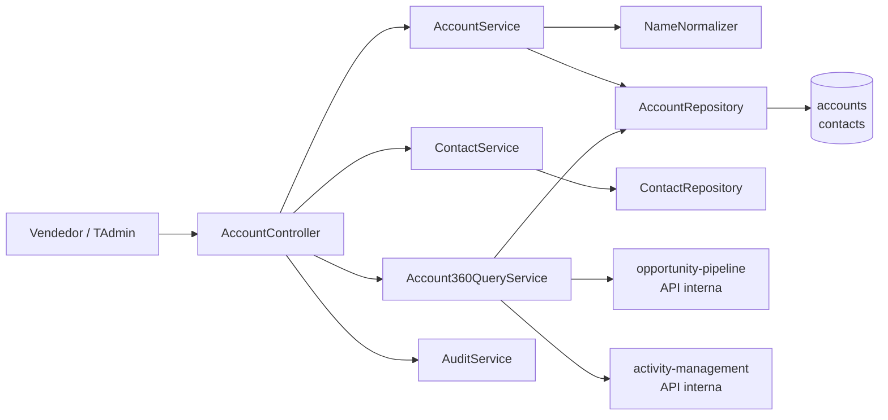
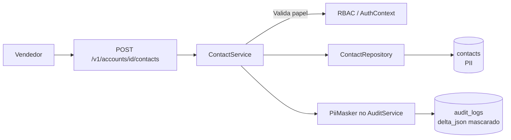

# Module — Account Management

**Status:** Rascunho para revisão
**Fase:** Fase 1 MVP

---

## 1. Visão Geral

Módulo responsável pela gestão de contas (empresas clientes) e contatos (pessoas físicas). Mantém o registro de dedupe por nome normalizado e serve como upstream do Opportunity Pipeline. Contém dados pessoais (PII) de contatos — nome, e-mail e telefone — com obrigações específicas de LGPD.

---

## 2. Classificação

| Item | Valor |
|---|---|
| Tipo de Módulo | Application Module |
| Deployable Candidato | azim-api |
| Bounded Context Relacionado | Account Management (BC-02) |
| Subdomínio DDD | Supporting Subdomain |
| Tier / Criticidade | Tier 2 — suporte ao pipeline; conta é pré-requisito para criar oportunidade |
| Status | Rascunho para revisão |

---

## 3. Objetivo

Prover o cadastro de contas de empresas clientes com dedupe por nome normalizado e visão 360° (conta + oportunidades + atividades + contatos). Gerenciar contatos com controle de acesso restrito por tratar de PII (LGPD — RN-025).

---

## 4. Responsabilidades

- CRUD de contas com dedupe por `normalized_name` (RN-014).
- CRUD de contatos vinculados à conta com campos PII (nome, e-mail, telefone).
- Mascarar PII em logs e exportações não autorizadas (RN-025).
- Expor API de visão 360° da conta (Account360View: conta + oportunidades + atividades + contatos).
- Expor pesquisa de contas por nome para o pipeline usar na criação de oportunidades.
- Publicar AuditEvent em toda escrita via audit-log.
- Contas são visíveis em todo o tenant (não restrita por BU — §6 do data model).

---

## 5. Fora de Escopo

- Gestão de oportunidades vinculadas à conta (pertence ao opportunity-pipeline).
- Gestão de atividades vinculadas à conta (pertence ao activity-management).
- Dedupe avançada com IA ou fuzzy matching (Fase 3 / ai-intelligence).
- Importação de contas via planilha (pertence ao data-migration na Fase 1).

---

## 6. Capacidades Atendidas

| Código | Capability | Descrição |
|---|---|---|
| CAP-04 | Gestão de Contas e Contatos | CRUD de contas com dedupe; visão 360° da conta |

---

## 7. Bounded Context e Linguagem Ubíqua

| Termo | Definição |
|---|---|
| Account | Empresa cliente com ciclo de vida independente do pipeline |
| Contact | Pessoa física vinculada a uma conta; contém PII (nome, e-mail, telefone) |
| normalized_name | Nome da conta normalizado (minúsculas, sem acentos, sem pontuação) para detecção de duplicatas (RN-014) |
| Account360View | Visão consolidada de uma conta: dados da empresa + oportunidades + atividades + contatos |
| PII | Dados pessoais identificáveis presentes em contatos; sujeitos à LGPD |

---

## 8. Componentes Internos Candidatos

| Componente | Tipo | Responsabilidade |
|---|---|---|
| AccountService | Domain Service | CRUD de contas; validação de dedupe; normalização de nome |
| ContactService | Domain Service | CRUD de contatos com controle de acesso a PII |
| Account360QueryService | Application Service | Compõe a visão 360° consultando pipeline e activities via API interna |
| AccountRepository | Repository | Escrita e leitura em accounts |
| ContactRepository | Repository | Escrita e leitura em contacts (acesso restrito) |
| AccountController | API Controller | Endpoints de contas e contatos |
| NameNormalizer | Domain Service | Normalização de nome para dedupe |

---

## 9. APIs Principais

| Método | Endpoint | Finalidade | Consumidores |
|---|---|---|---|
| GET | /v1/accounts | Pesquisar contas por nome (para pipeline) | azim-web, opportunity-pipeline |
| POST | /v1/accounts | Criar conta com validação de dedupe | azim-web, data-migration |
| GET | /v1/accounts/{id} | Detalhes da conta | azim-web |
| PUT | /v1/accounts/{id} | Atualizar conta | azim-web |
| GET | /v1/accounts/{id}/360 | Visão 360° da conta | azim-web |
| GET | /v1/accounts/{id}/contacts | Lista contatos da conta (restrito) | azim-web (Vendedor+ na BU relacionada) |
| POST | /v1/accounts/{id}/contacts | Criar contato | azim-web |
| PUT | /v1/accounts/{id}/contacts/{contactId} | Atualizar contato | azim-web |

---

## 10. Eventos Publicados

| Evento | Quando é publicado | Consumidores |
|---|---|---|
| AccountCreated | Após criação de conta | audit-log |
| ContactLinked | Após criação ou atualização de contato | audit-log |

---

## 11. Eventos Consumidos

Este módulo não consome eventos diretamente.

---

## 12. Dados Próprios

| Entidade/Tabela | Tipo | Banco/Persistência | Observações |
|---|---|---|---|
| accounts | Transacional | Cloud SQL / Postgres | normalized_name para dedupe; visível por todo o tenant |
| contacts | Transacional (PII) | Cloud SQL / Postgres | nome, email, phone são PII; acesso restrito; mascarar em logs (RN-025) |

---

## 13. Integrações

| Sistema/Módulo | Tipo de Integração | Direção | Observações |
|---|---|---|---|
| opportunity-pipeline | API HTTP | Entrada | Pipeline consome account_id; pesquisa de contas para criar oportunidade |
| activity-management | API HTTP | Entrada | Atividades podem ser vinculadas a uma conta |
| reporting | Read Model (query) | Entrada | Relatórios lêem dados de contas via view controlada |
| data-migration | API HTTP | Entrada | Import transacional cria contas via API interna |
| audit-log | Package (AuditService) | Saída | Toda escrita gera AuditEvent |
| ai-intelligence | API HTTP (Fase 3) | Entrada | IA lê account_360_data para briefing |

---

## 14. Dependências

### 14.1 Dependências de Domínio

- organization: tenant_id e bu_id para validação de escopo.

### 14.2 Dependências Técnicas

- Cloud SQL / Postgres (tabelas accounts, contacts)
- Índice em normalized_name para dedupe eficiente

### 14.3 Dependências Operacionais

- Política de mascaramento de PII (nome, e-mail, telefone) em logs
- Política de retenção de contacts sob LGPD (VAL-MOD-05)

---

## 15. Requisitos Não Funcionais Relevantes

| Categoria | Requisito / Observação |
|---|---|
| Privacidade | contacts contém PII; mascarar nome, email e telefone em logs e audit_logs delta_json (RN-025, LGPD) |
| Segurança | Acesso a contatos restrito por papel (mínimo Vendedor na BU relacionada) |
| Performance | Pesquisa de contas por nome deve ser rápida (índice em normalized_name) |
| Auditabilidade | Toda criação e atualização de conta e contato deve gerar AuditEvent |

---

## 16. Compliance Aplicável

| Compliance / Norma / Lei | Aplicável? | Motivo | Impacto no Módulo |
|---|---|---|---|
| LGPD | Sim | contacts.name, contacts.email e contacts.phone são dados pessoais (PII) | Mascarar PII em logs; política de retenção obrigatória; acesso restrito por papel; direitos do titular a implementar |
| PCI DSS | Não aplicável | Não processa dados de cartão | — |

---

## 17. Observabilidade

| Item | Recomendação Inicial |
|---|---|
| Logs | Log estruturado; correlation_id, tenant_id, account_id; sem nome/email/telefone em texto claro |
| Métricas | accounts_created_total, contacts_created_total, dedupe_blocked_total |
| Alertas | Alerta se taxa de erro em criação de conta > 5% (possível problema de dedupe) |
| Auditoria | Toda escrita em accounts e contacts gera entrada em audit-log com delta_json mascarado |

---

## 18. Diagramas do Módulo

### 18.1 Diagrama de Componentes Internos

### 18.2 Diagrama de Fluxo — LGPD (PII)

---

## 19. Riscos

| Código | Risco | Impacto | Mitigação |
|---|---|---|---|
| RISK-ACC-01 | PII de contatos vazada em logs sem mascaramento | Violação de LGPD e RN-025 | PiiMasker obrigatório no AuditService; teste de regressão de mascaramento |
| RISK-ACC-02 | Dedupe falha por variações de nome (acentuação, capitalização) | Contas duplicadas no sistema | Normalização robusta em NameNormalizer; alerta de dedupe_blocked_total |
| RISK-ACC-03 | Ausência de política de retenção de contacts (LGPD) | Risco regulatório | Definir com jurídico antes do go-live (VAL-MOD-05) |

---

## 20. Pontos a Validar

| Código | Ponto | Impacto | Recomendação |
|---|---|---|---|
| VAL-ACC-01 | Política de retenção e descarte de contacts (PII) sob LGPD | Define obrigação de descarte | Definir com jurídico antes do go-live (VAL-MOD-05) |
| VAL-ACC-02 | Implementar endpoint de direitos do titular (acesso, correção, exclusão) | Obrigação LGPD Art. 18 | Planejar para Fase 1 ou Fase 2 — definir antes do go-live |
| VAL-ACC-03 | Conta vinculada por tenant (não por BU) — confirmar regra de visibilidade (§4 Fronteiras de Persistência) | Define quem vê qual conta | Confirmado no data model; validar com produto |

---

## 21. Backlog Inicial Sugerido

| Tipo | Item | Descrição |
|---|---|---|
| Epic | Gestão de Contas e Contatos com LGPD | CRUD de contas com dedupe e contatos com mascaramento de PII |
| Story Técnica | Dedupe de contas por normalized_name | NameNormalizer + índice único em normalized_name |
| Story Técnica | CRUD de contatos com controle de acesso por papel | ContactService + ContactRepository com RBAC |
| Story Técnica | Visão 360° da conta | Account360QueryService compondo pipeline e atividades |
| Task | Mascaramento de PII em logs e audit_logs | Configurar PiiMasker para entity_type = Contact |
| Task | Política de retenção de contacts (LGPD) | Definir e implementar após decisão jurídica |

---

## 22. Referências

| Documento | Seção |
|---|---|
| DDD Segmentation | §4.1 BC-02 Account Management |
| DDD Segmentation | §6 Data Ownership — Account Management |
| Data Model | §3 Account Management (BC-02) |
| Data Model | §7 Pontos a Validar — VAL-08 (retenção LGPD) |
| Context Map | relations.md — Account Management → Organization Management |
| NFRD | Privacidade / LGPD — atributo de qualidade prioridade 3 |
