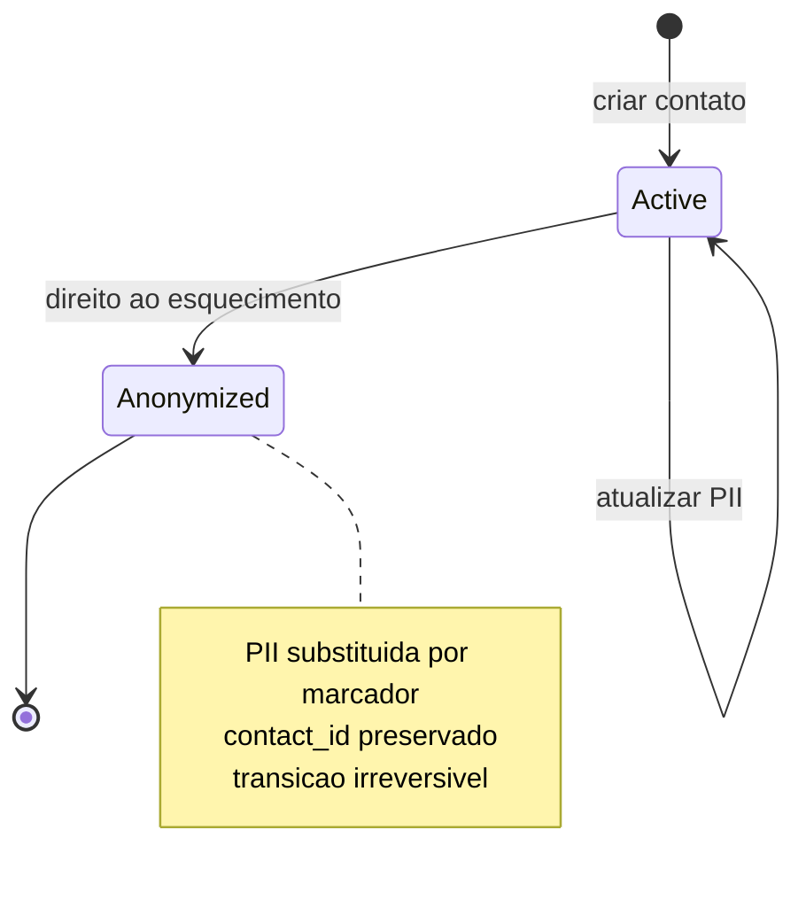
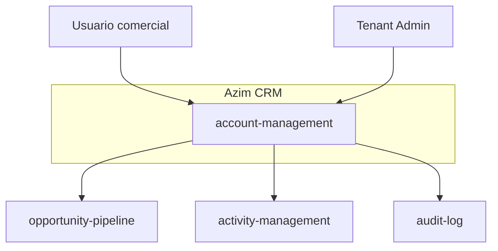
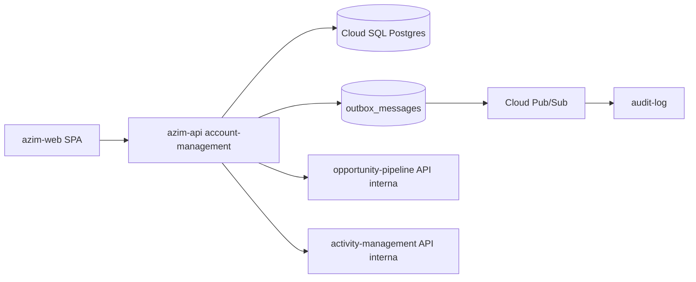
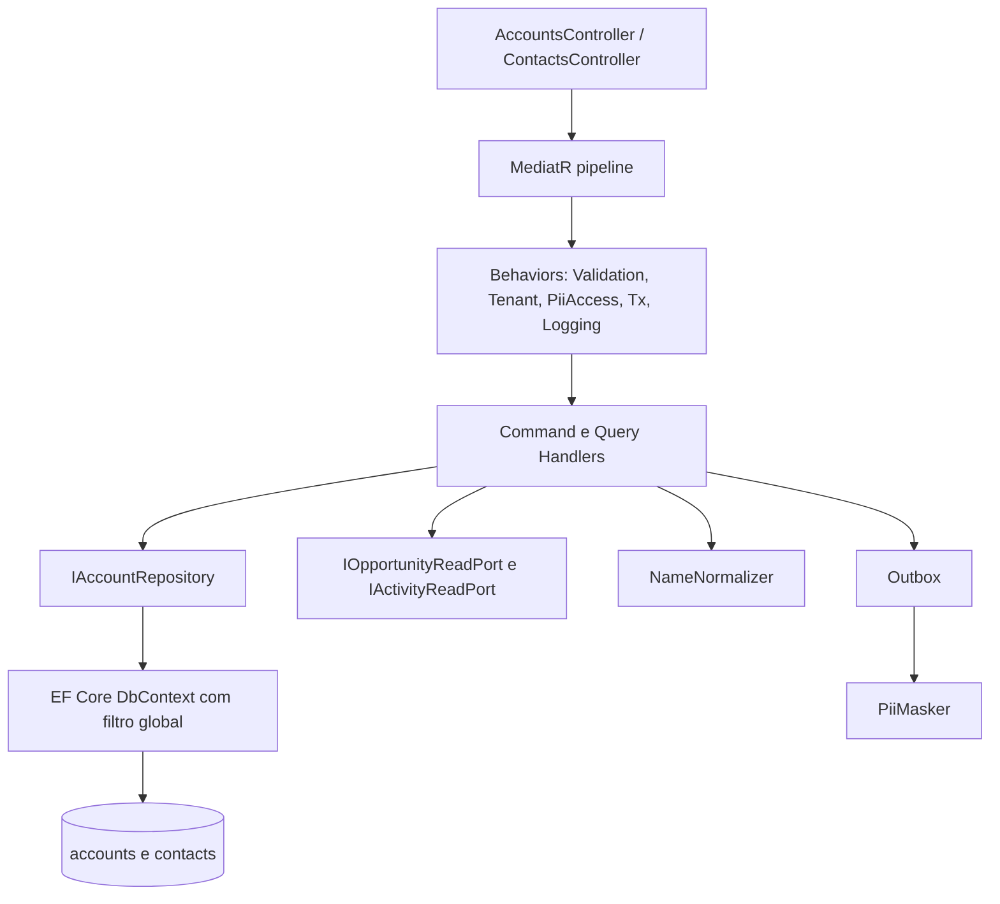
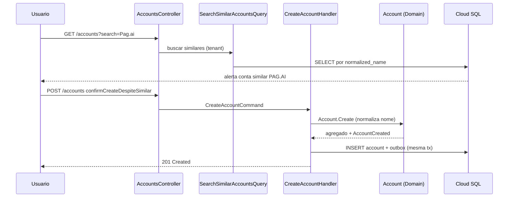
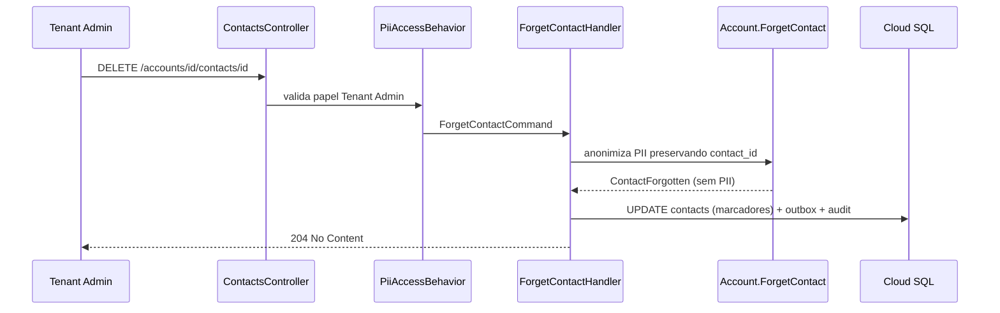

# BC-02 — Account Management (Gestão de Contas e Contatos)
**Design Técnico**

- Versão: 0.1.0
- Data: 2026-06-11
- Status: Rascunho para revisão
- Referência base: docs/product/modules/account-management/requirements.md v0.1.0
- ADRs aplicáveis: nenhum ADR formal no catálogo atual (`docs/product/adr/` ausente); decisões transversais referenciadas como DEC-005 (residência de dados) e DEC-006 (multi-tenant) no requirements; lacunas registradas como DD nesta seção 17
- Rules aplicáveis: `.forge/rules/architecture/clean-architecture.md`, `.forge/rules/architecture/api-and-contracts.md`, `.forge/rules/architecture/observability.md`, `.forge/rules/architecture/security-and-compliance.md`, `.forge/rules/architecture/ddd.md`, `.forge/rules/conventions/database-naming.md`, `.forge/rules/domain/audit-immutability.md`

## Histórico de Versões

| Versão | Data | Status | Descrição da alteração |
|--------|------|--------|------------------------|
| 0.1.0 | 2026-06-11 | Rascunho para revisão | Criação inicial do design técnico derivado do requirements.md v0.1.0 |

## 1. Visão Geral

Este documento especifica o **como** do módulo **account-management** (BC-02, Subdomínio de Suporte, deployable `azim-api`), derivado do `requirements.md` v0.1.0 aprovado para revisão.

O módulo gere **contas** (empresas clientes, compartilhadas por todo o tenant) e **contatos** (pessoas físicas vinculadas a uma conta, portadoras de PII). Entrega quatro capacidades técnicas centrais:

1. **CRUD de contas com dedupe não-bloqueante** por nome normalizado (Req 1, Req 3, Req 4).
2. **CRUD de contatos com PII protegida** por RBAC e mascaramento em logs/auditoria (Req 5, Req 9, RNF 1, RNF 6).
3. **Visão 360°** da conta, compondo dados próprios com leituras restritas de opportunity-pipeline e activity-management (Req 6).
4. **Direito ao esquecimento** de contato sob LGPD, preservando integridade referencial (Req 7).

Tudo sob isolamento multi-tenant em profundidade (Req 10, RNF 5) e residência de dados no Brasil (RNF 10).

O módulo é organizado em Clean Architecture (.NET, 5 projetos), com DDD tático no agregado `Account`. A persistência é Cloud SQL/PostgreSQL em `southamerica-east1`; eventos de auditoria são publicados via padrão Outbox + Cloud Pub/Sub para o módulo audit-log.

### 1.1 Rastreabilidade requisito → design (mapa-mestre)

| Requisito | Elementos de design |
|-----------|---------------------|
| Req 1 — Criar conta com dedupe | `CreateAccountCommand`/Handler, `NameNormalizer` (objeto de valor `NormalizedName`), `SearchSimilarAccountsQuery`, evento `AccountCreated`, índice `idx_accounts_tenant_normalized_name`, erros ACC-ERR-001/002 (§5.1, §4.3, §7, §8) |
| Req 2 — Conta única por tenant entre BUs | Agregado `Account` com `bu_id` (ADR-0009); filtro global por `tenant_id` + BU scope; visibilidade controlada por BU (§4.1, §6.1, §14) |
| Req 3 — Buscar contas | `SearchAccountsQuery`/Handler, índice de nome normalizado, contrato `GET /accounts` (§5.2, §8) |
| Req 4 — Editar conta | `UpdateAccountCommand`/Handler, recálculo de `NormalizedName`, evento `AccountUpdated` (§5.1, §4.3) |
| Req 5 — Contatos (PII) | Entidade `Contact`, objetos de valor `ContactInfo`/`Email`/`Phone`, `CreateContactCommand`/`UpdateContactCommand`, evento `ContactLinked`, erro ACC-ERR-004 (§4.2, §4.3, §5.1, §8) |
| Req 6 — Visão 360° | `GetAccount360Query`/Handler, `IOpportunityReadPort`/`IActivityReadPort`, contrato `GET /accounts/{id}/360` (§5.2, §6.4, §8) |
| Req 7 — Direito ao esquecimento | `ForgetContactCommand`/Handler, state machine `ContactPrivacyState`, DD-001, contrato `DELETE /contacts/{id}` (§4.5, §5.1, §8, §17) |
| Req 8 — Auditoria imutável | `IAuditPublisher`, Outbox, tabela `audit_logs` append-only, `PiiMasker` (§6.6, §7, §11) |
| Req 9 — RBAC sobre PII | `PiiAccessBehavior`/policy `contacts:read`, checagem de papel mínimo Vendedor na BU (§5.4, §10) |
| Req 10 — Isolamento por tenant | Filtro global `tenant_id`, `TenantContext`, DD-002 (§6.1, §14, §17) |
| RNF 1 — PII fora de logs | `PiiMasker`, logging estruturado sem PII, teste de scan de logs (§11, §13) |
| RNF 2 — Minimização | Esquema fixo de PII; sem campos adicionais sem base legal (§7, §10) |
| RNF 3 — Base legal (pendência) | Registrada como risco RISK-ACC-04 e VAL-ACC-02 (§18) |
| RNF 4 — Retenção/descarte (pendência) | DD-001 + risco RISK-ACC-03; VAL-ACC-01 (§17, §18) |
| RNF 5 — Isolamento em profundidade | Filtro global + checagem de aplicação + teste de gate (§14, §13) |
| RNF 6 — PII por RBAC | `PiiAccessBehavior` em todos os endpoints de contato (§5.4, §10) |
| RNF 7 — Performance de busca | Índice de nome normalizado, sem table scan (§7, §15) |
| RNF 8 — Imutabilidade de auditoria | Trigger + REVOKE em `audit_logs` (§7, §6.6) |
| RNF 9 — Observabilidade | Métricas `accounts_created_total` etc., logs/traces com `correlation_id` (§11) |
| RNF 10 — Residência Brasil | Cloud SQL `southamerica-east1`; sem replicação cross-region sem ADR (§6.1, §14) |
| PBT-01 — Idempotência da normalização | Teste de propriedade sobre `NameNormalizer` (§13) |
| PBT-02 — Equivalência por forma normalizada | Teste de propriedade `NameNormalizer` + dedupe (§13) |
| PBT-03 — Irreversibilidade da anonimização | Teste de propriedade sobre state machine de contato (§13) |
| PBT-04 — Anti-cross-tenant | Teste de propriedade de isolamento (gate CI) (§13) |
| PBT-05 — Visão 360° respeita escopo de BUs | Teste de propriedade sobre `GetAccount360Query` (§13) |

## 2. Princípios e Decisões Macro

| # | Princípio | Decisão de design |
|---|-----------|-------------------|
| P1 | Clean Architecture estrita | 5 projetos .NET (`AccountManagement.Domain/Application/Infrastructure/Api/Contracts`); regra de dependência enforçada por `Architecture.Tests` |
| P2 | Domínio rico | Invariantes de conta/contato e normalização vivem no `Domain`; handlers apenas orquestram |
| P3 | Dedupe alerta, não bloqueia | Sem unique constraint sobre `normalized_name`; verificação de similaridade é consulta indexada que retorna candidatos (DD-006) |
| P4 | LGPD by design | PII minimizada, mascarada em logs e auditoria, protegida por RBAC, anonimizável (DD-001, DD-003) |
| P5 | Isolamento em profundidade | `tenant_id` em coluna + filtro global EF Core + RLS no PostgreSQL (defesa em profundidade obrigatória, DD-002 / ADR-0001) |
| P6 | Auditoria imutável | `audit_logs` append-only (trigger + REVOKE); publicação via Outbox + Pub/Sub |
| P7 | Composição síncrona da 360° | A 360° lê opportunity-pipeline e activity-management por portas de leitura restritas no momento da query (DD-004) |
| P8 | Residência de dados | Toda persistência em `southamerica-east1`; replicação cross-region exige ADR (RNF 10) |
| P9 | API-first/contract-first | Contratos OpenAPI versionados em `/api/v1`; erros padronizados com `correlationId` |

## 3. Estrutura da Solução

```text
AccountManagement.Domain
  Accounts/
    Account.cs                      (Aggregate Root)
    Contact.cs                      (Entidade dentro do agregado)
    ValueObjects/
      NormalizedName.cs
      AccountName.cs
      ContactInfo.cs
      Email.cs
      Phone.cs
      ContactPrivacyState.cs
    Events/
      AccountCreated.cs
      AccountUpdated.cs
      ContactLinked.cs
      ContactForgotten.cs
    Services/
      NameNormalizer.cs             (Domain Service puro)
    Repositories/
      IAccountRepository.cs
    Exceptions/
      AccountNameRequiredException.cs
      InvalidEmailException.cs
      ContactAlreadyForgottenException.cs

AccountManagement.Application
  Accounts/Commands/                (CreateAccount, UpdateAccount, ...)
  Accounts/Queries/                 (SearchAccounts, GetAccount360, ...)
  Contacts/Commands/                (CreateContact, UpdateContact, ForgetContact)
  Contacts/Queries/                 (ListContacts)
  Behaviors/                        (Validation, PiiAccess, Tenant, Logging, Tx)
  Ports/                            (IOpportunityReadPort, IActivityReadPort, IAuditPublisher, IClock)
  Validators/

AccountManagement.Infrastructure
  Persistence/                      (DbContext, configs, repositórios, migrations)
  Outbox/                           (OutboxMessage, OutboxPublisher)
  Audit/                            (PiiMasker, AuditPublisher)
  ReadPorts/                        (OpportunityReadAdapter, ActivityReadAdapter — HTTP/gRPC interno)
  Tenancy/                          (TenantContext, global query filter)

AccountManagement.Api
  Controllers/                      (AccountsController, ContactsController)
  Middleware/                       (CorrelationId, exception handling)
  DependencyInjection/

AccountManagement.Contracts
  Accounts/                         (DTOs request/response)
  Contacts/
  Events/                           (AccountCreated.v1, ContactLinked.v1, ContactForgotten.v1)

Testes:
  AccountManagement.Domain.Tests
  AccountManagement.Application.Tests
  AccountManagement.Infrastructure.Tests
  AccountManagement.Api.Tests
  AccountManagement.Architecture.Tests
```

Dependências entre projetos (validadas por `Architecture.Tests`): `Api → Application, Infrastructure`; `Application → Domain, Contracts`; `Infrastructure → Application, Domain`; `Domain → ∅`; `Contracts → ∅`.

## 4. Modelo de Domínio

### 4.1 Aggregates

**Account (Aggregate Root)**

- Identidade: `AccountId` (UUID).
- Pertence a um `tenant_id` e a uma `bu_id` (ADR-0009); a segmentação por BU é aplicada na camada de persistência via EF Global Query Filter e RLS PostgreSQL.
- Atributos: `AccountName name`, `NormalizedName normalizedName`, `website`, `notes`, auditoria temporal.
- Contém a coleção de `Contact` (fronteira transacional do agregado: criar/editar/anonimizar contato passa pelo root).
- Invariantes protegidas pelo root:
  - I1: nome não vazio (Req 1.5) → `AccountName` válido.
  - I2: `normalizedName` é sempre derivado de `name` via `NameNormalizer` e recalculado a cada alteração de nome (Req 1.1, Req 4.2).
  - I3: todo `Contact` adicionado carrega o mesmo `tenant_id` e o `account_id` do root (Req 5.1).
  - I4: `bu_id` não pode ser `Guid.Empty`; é imutável após criação (ADR-0009).
- Factories: `Account.Create(tenantId, buId, name, website, notes, normalizer)` e `Account.Reconstitute(...)`.
- Métodos de comportamento: `Rename(newName, normalizer)`, `AddContact(...)`, `UpdateContact(...)`, `ForgetContact(contactId, requestedBy, clock)`.

A fronteira do agregado mantém `Contact` sob o root porque a anonimização e o vínculo de contato são invariantes de consistência da conta (um contato não existe sem conta — Req 5.1). Repositório único: `IAccountRepository` (carrega o agregado com seus contatos sob demanda).

### 4.2 Entidades

**Contact (Entidade dentro do agregado Account)**

- Identidade: `ContactId` (UUID), estável e preservada mesmo após anonimização (Req 7.3, PBT-03).
- Atributos: `ContactInfo info` (objeto de valor com PII), `role` (cargo, opcional), `ContactPrivacyState privacyState`, auditoria temporal.
- Comportamento:
  - `UpdateInfo(newInfo)` — valida e substitui PII (Req 5).
  - `Forget(requestedBy, clock)` — transição para `Anonymized`, substituindo PII por marcadores (Req 7, DD-001).
- Regra: operações de leitura/escrita de PII só são expostas após checagem RBAC na borda de aplicação (Req 9, RNF 6).

### 4.3 Objetos de valor

| Objeto de valor | Atributos | Regras / Invariantes | Requisitos |
|-----------------|-----------|----------------------|------------|
| `AccountName` | `value: string` | Não vazio após trim; comprimento máximo definido; igualdade por valor | Req 1.5 |
| `NormalizedName` | `value: string` | Resultado determinístico de `NameNormalizer`; imutável; igualdade por valor; base de dedupe e busca | Req 1.1, Req 3.2, PBT-01, PBT-02 |
| `ContactInfo` | `name: string`, `email: Email?`, `phone: Phone?`, encapsula PII | Nome obrigatório; e-mail/telefone opcionais; expõe representação mascarada `ToMasked()` para auditoria/log | Req 5.2, RNF 1 |
| `Email` | `value: string` | Formato válido (regex RFC simplificada); normalização para minúsculas; igualdade por valor; lança `InvalidEmailException` se inválido | Req 5.4 |
| `Phone` | `value: string` | Apenas dígitos significativos retidos; opcional; igualdade por valor | Req 5.2 |
| `ContactPrivacyState` | enum `Active`/`Anonymized` | Transição monotônica (sem retorno) | Req 7.5, PBT-03 |

Todos os objetos de valor são imutáveis e implementam igualdade por valor (rule `clean-architecture.md` §6; rule `ddd.md`). Não se usa a abreviação VO.

**Algoritmo de normalização (`NameNormalizer`, Domain Service puro determinístico):**

1. Normalizar Unicode para forma NFD e remover marcas diacríticas (acentos) — `"PAG.AI "` e `"Pag.ai"` convergem.
2. Converter para minúsculas (invariante de cultura).
3. Remover pontuação e símbolos não alfanuméricos (mantém letras, dígitos e espaço).
4. Colapsar espaços múltiplos em um único e aplicar trim.

Propriedades garantidas: idempotência `normalize(normalize(x)) == normalize(x)` (PBT-01) e equivalência por forma normalizada para nomes que diferem só por acento/caixa/espaço (PBT-02). É deduplicação **exata sobre a forma normalizada**, não fuzzy matching (DD-005; fuzzy é Fase 3, fora de escopo).

### 4.4 Domain Events

| Evento (passado) | Disparado quando | Carga (sem PII) | Consumidor | Requisito |
|------------------|------------------|-----------------|------------|-----------|
| `AccountCreated` | Conta criada | `accountId`, `tenantId`, `normalizedName`, `occurredAt` | audit-log | Req 1.7, Req 8.1 |
| `AccountUpdated` | Conta atualizada | `accountId`, `tenantId`, `changedFields`, `occurredAt` | audit-log | Req 4.4, Req 8 |
| `ContactLinked` | Contato criado ou atualizado | `contactId`, `accountId`, `tenantId`, `action`, `maskedDelta`, `occurredAt` | audit-log | Req 5.7, Req 8.2 |
| `ContactForgotten` | Contato anonimizado (esquecimento) | `contactId`, `accountId`, `tenantId`, `requestedBy`, `occurredAt` (sem PII) | audit-log | Req 7.4 |

Eventos de domínio são acumulados no agregado e despachados após commit via Outbox (§6.6). A carga jamais inclui PII em texto claro (RNF 1.2): `ContactLinked` carrega `maskedDelta` produzido por `PiiMasker` (DD-003).

### 4.5 State Machines

**Ciclo de privacidade do contato (`ContactPrivacyState`)**



A transição `Active → Anonymized` é monotônica e irreversível do ponto de vista de recuperação de PII (Req 7.5, PBT-03). Não há estado `Deleted` físico no MVP — ver DD-001.

### 4.6 Policies / Specifications

| Policy / Specification | Responsabilidade | Requisito |
|------------------------|------------------|-----------|
| `SimilarAccountSpecification` | Define candidato a duplicata: mesmo `tenant_id` e `normalized_name` igual ao informado | Req 1.2, PBT-02 |
| `ForgetContactPolicy` | Apenas papel Tenant Admin pode acionar o esquecimento; valida estado `Active` | Req 7.1, Req 9.3 |
| `PiiAccessPolicy` | Papel mínimo Vendedor na BU relacionada à conta para retornar PII de contato | Req 9.1, RNF 6 |
| `TenantScopeSpecification` | Toda leitura/escrita restrita ao `tenant_id` do contexto | Req 10, RNF 5 |

## 5. Application Layer

Casos de uso seguem CQRS leve: Commands para escrita, Queries para leitura, um handler por caso de uso. Mediação via MediatR (rule `clean-architecture.md` §10); validação de input com FluentValidation antes do handler (§11).

### 5.1 Commands

| Command | Caso de uso | Invariantes delegadas ao domínio | Evento | Erros |
|---------|-------------|----------------------------------|--------|-------|
| `CreateAccountCommand` | Criar conta (Req 1) | `Account.Create` calcula `NormalizedName`, valida nome | `AccountCreated` | ACC-ERR-001 |
| `UpdateAccountCommand` | Editar conta (Req 4) | `Account.Rename` recalcula `NormalizedName` | `AccountUpdated` | ACC-ERR-001, ACC-ERR-003 |
| `CreateContactCommand` | Criar contato (Req 5) | `Account.AddContact`, validação de `Email`/`Phone` | `ContactLinked` | ACC-ERR-004, ACC-ERR-005 |
| `UpdateContactCommand` | Atualizar contato (Req 5) | `Contact.UpdateInfo` | `ContactLinked` | ACC-ERR-004, ACC-ERR-005, ACC-ERR-006 |
| `ForgetContactCommand` | Direito ao esquecimento (Req 7) | `Account.ForgetContact` (state machine, DD-001) | `ContactForgotten` | ACC-ERR-006, ACC-ERR-007 |

Notas:
- `CreateAccountCommand` aceita flag `confirmCreateDespiteSimilar` (Req 1.3): a presença de contas similares não bloqueia; o cliente confirma a criação explicitamente. O dedupe roda como query auxiliar (`SearchSimilarAccountsQuery`) na borda de UI antes do POST; o POST em si não impede a criação.
- `ForgetContactCommand` exige papel Tenant Admin (`ForgetContactPolicy`); a fronteira transacional cobre a anonimização + emissão do evento + auditoria (Req 7.4).

### 5.2 Queries

| Query | Caso de uso | Saída | Requisito |
|-------|-------------|-------|-----------|
| `SearchAccountsQuery(search, page)` | Buscar contas por nome (também consumida pelo pipeline) | Página de contas do tenant | Req 3, RNF 7 |
| `SearchSimilarAccountsQuery(name)` | Candidatos de duplicata para alerta de dedupe | Lista de contas similares (`SimilarAccountSpecification`) | Req 1.2 |
| `GetAccountByIdQuery(id)` | Detalhe de conta | Conta (sem 360°) | Req 3 |
| `GetAccount360Query(id)` | Visão consolidada da conta | Conta + contatos + oportunidades (escopo BU) + atividades + histórico | Req 6, PBT-05 |
| `ListContactsQuery(accountId)` | Listar contatos (PII restrita) | Contatos do tenant/conta, sujeito a `PiiAccessPolicy` | Req 5, Req 9 |

`GetAccount360Query` compõe dados próprios com `IOpportunityReadPort` e `IActivityReadPort` (DD-004). As oportunidades retornadas são filtradas pelo escopo de BUs do usuário (Req 6.2/6.3, PBT-05): a porta de leitura recebe o conjunto de `bu_id` autorizados e nunca retorna oportunidades fora desse escopo.

### 5.3 Handlers

- Um handler por Command/Query. Handlers orquestram: carregam o agregado via `IAccountRepository`, invocam comportamento de domínio, persistem, e deixam o despacho de eventos para o pipeline transacional + Outbox.
- Handlers **não** contêm regra de negócio (rule `clean-architecture.md` §9): normalização, validação de e-mail e transição de privacidade vivem no domínio.
- `GetAccount360Handler` agrega resultados das portas de leitura; se uma porta downstream falhar, aplica timeout + degradação parcial (§15) retornando a seção disponível e sinalizando indisponibilidade da seção ausente, sem quebrar a 360° inteira.

### 5.4 Pipeline Behaviors

Ordem de execução do pipeline MediatR:

1. `CorrelationLoggingBehavior` — injeta `correlation_id`, `tenant_id`, `account_id` no escopo de log; nunca loga PII (RNF 1, RNF 9).
2. `TenantScopeBehavior` — resolve `TenantContext` do token e garante que o filtro global será aplicado (Req 10, RNF 5).
3. `ValidationBehavior` — FluentValidation; requests inválidos não produzem efeito colateral (rule `api-and-contracts.md`).
4. `PiiAccessBehavior` — em operações de contato, exige papel mínimo Vendedor na BU relacionada; nega antes de tocar PII (Req 9, RNF 6).
5. `TransactionBehavior` — abre transação para Commands, coleta domain events no Outbox e faz commit atômico (escrita + outbox na mesma transação).

### 5.5 Validações de Aplicação

| Validação | Camada | Mensagem |
|-----------|--------|----------|
| Nome de conta obrigatório | `CreateAccountValidator`/`UpdateAccountValidator` (sintática) + `AccountName` (domínio) | ACC-ERR-001 (MSG-019) |
| E-mail de contato em formato válido | `ContactValidator` (sintática) + `Email` (domínio) | ACC-ERR-004 (MSG-020) |
| Nome de contato obrigatório | `ContactValidator` + `ContactInfo` | ACC-ERR-005 |
| `account_id` existente e do tenant | Handler + repositório com filtro global | ACC-ERR-003 |
| Papel suficiente para PII / esquecimento | `PiiAccessBehavior` / `ForgetContactPolicy` | ACC-ERR-008 |

## 6. Infrastructure Layer

### 6.1 Persistência

- **Banco:** Cloud SQL for PostgreSQL, região `southamerica-east1` (RNF 10.1). Sem réplica de leitura cross-region sem ADR (RNF 10.2).
- **ORM:** EF Core; mapeamento via `IEntityTypeConfiguration<T>`; nomes físicos em `snake_case` (rule `database-naming.md`).
- **Isolamento multi-tenant:** `tenant_id` em coluna obrigatória + filtro global de query no `DbContext` (`HasQueryFilter`), resolvido a partir do `TenantContext` (rule `clean-architecture.md` §15/16). `tenant_id` é transparente, nunca parâmetro explícito de repositório. Ver DD-002 para a posição sobre RLS.
- **Repositório:** `IAccountRepository` (definido no Domain) implementado no Infrastructure; carrega o agregado `Account` com seus `Contact`. Não vaza `IQueryable`/`DbSet` para fora da infraestrutura.

### 6.2 Cache

Não aplicável nesta versão como cache de domínio. A busca por nome é servida por índice (RNF 7), sem necessidade de cache no MVP. Caso a 360° pressione downstream, avaliar cache de curta duração por tenant em iteração futura (registrar como melhoria; sem decisão agora).

### 6.3 Mensageria

- **Transporte:** Cloud Pub/Sub (TRD §integrações). Publica eventos de domínio para o audit-log de forma assíncrona e desacoplada.
- **Padrão:** Outbox transacional (§6.6) — eventos persistidos na mesma transação da escrita e relayados ao Pub/Sub por um publisher.
- Este módulo **não consome** eventos (README §11).

### 6.4 Integrações Externas

| Integração | Direção | Mecanismo | Resiliência |
|------------|---------|-----------|-------------|
| opportunity-pipeline | Saída (leitura) via `IOpportunityReadPort` | API HTTP/gRPC interna (mTLS interno) | timeout, retry com backoff, circuit breaker, degradação parcial |
| activity-management | Saída (leitura) via `IActivityReadPort` | API HTTP/gRPC interna (mTLS interno) | timeout, retry com backoff, circuit breaker, degradação parcial |
| audit-log | Saída (eventos) | Pub/Sub via Outbox | retry do relay; DLQ no Pub/Sub |

As portas de leitura são adaptadores no Infrastructure, implementando interfaces declaradas na Application (`Ports/`). Toda chamada propaga `correlation_id` e `tenant_id` e respeita o escopo de BUs do usuário (Req 6.2).

### 6.5 Idempotência

- **Escrita de contas/contatos:** operações de criação aceitam `Idempotency-Key` opcional (header); chave + `tenant_id` deduplica reentregas (importante para o consumo pelo data-migration, README §13). Persistida em tabela `idempotency_keys` com TTL operacional.
- **Esquecimento:** `ForgetContactCommand` é naturalmente idempotente — repetir sobre contato já `Anonymized` retorna sucesso sem novo efeito (state machine, Req 7.5).
- **Publicação de eventos:** o relay do Outbox é at-least-once; consumidores (audit-log) deduplicam por `event_id`.

### 6.6 Outbox / Inbox

- **Outbox:** tabela `outbox_messages` gravada na mesma transação da escrita de domínio (`TransactionBehavior`). Um relay (background worker) lê pendentes e publica no Pub/Sub, marcando como enviado. Garante atomicidade entre estado e evento e entrega at-least-once.
- **Inbox:** não aplicável nesta versão (módulo não consome eventos).

## 7. Schema / Modelo de Persistência

Convenções: `snake_case`, `tenant_id` obrigatório, timestamps `created_at`/`updated_at` (rule `database-naming.md`). Sem valores monetários neste módulo.

```sql
-- Contas — ADR-0009: bu_id NOT NULL; segmentação por BU via RLS e EF Global Query Filter
accounts (
  id              UUID PRIMARY KEY DEFAULT gen_random_uuid(),
  tenant_id       UUID NOT NULL,
  bu_id           UUID NOT NULL,                 -- ADR-0009: segmentação por Business Unit
  name            TEXT NOT NULL,
  normalized_name TEXT NOT NULL,                 -- RN-014: dedupe e busca
  website         TEXT,
  notes           TEXT,
  created_at      TIMESTAMPTZ NOT NULL DEFAULT now(),
  updated_at      TIMESTAMPTZ NOT NULL DEFAULT now(),
  CONSTRAINT chk_accounts_name_not_blank CHECK (length(btrim(name)) > 0)
);
-- Índice de dedupe/busca por nome normalizado (RNF 7.1/7.2) — NÃO unique (DD-006)
CREATE INDEX idx_accounts_tenant_normalized_name ON accounts (tenant_id, normalized_name);

-- Contatos (PII) — entidade do agregado Account
contacts (
  id              UUID PRIMARY KEY DEFAULT gen_random_uuid(),
  tenant_id       UUID NOT NULL,
  account_id      UUID NOT NULL REFERENCES accounts(id),
  name            TEXT NOT NULL,                 -- PII (Req 5.2); mascarar em logs (RN-025)
  email           TEXT,                          -- PII
  phone           TEXT,                          -- PII
  role            TEXT,                          -- cargo (não PII sensível)
  privacy_state   VARCHAR(16) NOT NULL DEFAULT 'active',  -- active | anonymized
  forgotten_at    TIMESTAMPTZ,                   -- preenchido na anonimização (Req 7)
  forgotten_by    UUID,                          -- user_id solicitante (auditoria)
  created_at      TIMESTAMPTZ NOT NULL DEFAULT now(),
  updated_at      TIMESTAMPTZ NOT NULL DEFAULT now(),
  CONSTRAINT chk_contacts_privacy_state CHECK (privacy_state IN ('active','anonymized'))
);
CREATE INDEX idx_contacts_tenant_account ON contacts (tenant_id, account_id);

-- Outbox transacional
outbox_messages (
  id              UUID PRIMARY KEY DEFAULT gen_random_uuid(),
  tenant_id       UUID NOT NULL,
  event_type      TEXT NOT NULL,
  payload_json    JSONB NOT NULL,               -- sem PII em claro (RNF 1.2)
  occurred_at     TIMESTAMPTZ NOT NULL DEFAULT now(),
  published_at    TIMESTAMPTZ,
  CONSTRAINT chk_outbox_no_pii CHECK (true)     -- garantido por PiiMasker na escrita
);
CREATE INDEX idx_outbox_unpublished ON outbox_messages (published_at) WHERE published_at IS NULL;

-- Auditoria imutável (append-only) — RNF 8 e rule audit-immutability
audit_logs (
  id              UUID PRIMARY KEY DEFAULT gen_random_uuid(),
  tenant_id       UUID NOT NULL,
  user_id         UUID NOT NULL,
  entity_type     TEXT NOT NULL,                -- 'Account' | 'Contact'
  entity_id       UUID NOT NULL,
  action          TEXT NOT NULL,                -- created | updated | forgotten
  delta_json      JSONB NOT NULL,               -- PII de contato MASCARADA (Req 8.4)
  created_at      TIMESTAMPTZ NOT NULL DEFAULT now()
);
CREATE INDEX idx_audit_logs_tenant_entity ON audit_logs (tenant_id, entity_type, entity_id);
-- Imutabilidade: trigger BEFORE UPDATE/DELETE/TRUNCATE + REVOKE no role app
CREATE TRIGGER trg_audit_logs_immutable
  BEFORE UPDATE OR DELETE OR TRUNCATE ON audit_logs
  FOR EACH STATEMENT EXECUTE FUNCTION prevent_immutable_table_modification();
REVOKE UPDATE, DELETE, TRUNCATE ON audit_logs FROM app;

-- Idempotência de escrita
idempotency_keys (
  tenant_id       UUID NOT NULL,
  idempotency_key TEXT NOT NULL,
  request_hash    TEXT NOT NULL,
  response_ref    UUID,
  created_at      TIMESTAMPTZ NOT NULL DEFAULT now(),
  PRIMARY KEY (tenant_id, idempotency_key)
);
```

Notas de schema:
- **Anonimização (DD-001):** no esquecimento, `name`/`email`/`phone` recebem marcador (`[anonimizado]` / NULL), `privacy_state='anonymized'`, `forgotten_at`/`forgotten_by` preenchidos; `id` (e portanto referências externas) preservado (Req 7.2/7.3, PBT-03). Não há exclusão física no MVP.
- **`audit_logs` não tem `updated_at`** — é append-only por definição (RNF 8.1, sem TTL RNF 8.2).
- **Migração:** EF Core migrations versionadas; migration da `audit_logs` segue convenção imutável (trigger + REVOKE no mesmo arquivo).
- **Retenção/descarte de `contacts`:** pendência VAL-ACC-01 (RNF 4); decisão de produto refletida em DD-001.

## 8. API Contracts

Base: `/api/v1`. Autenticação: Bearer JWT (GCP Identity Platform), com claim `permissions` carregada (rule `jwt-permissions.md`). Erros no formato padrão `{ "error", "code", "correlationId" }` (rule `api-and-contracts.md`).

| Método | Path | Papel mínimo | Descrição | Erros |
|--------|------|--------------|-----------|-------|
| GET | `/api/v1/accounts?search={nome}&page={n}&pageSize={n}` | Viewer | Buscar/listar contas do tenant (também consumida pelo pipeline) | ACC-ERR-002 |
| POST | `/api/v1/accounts` | Vendedor | Criar conta; dedupe não-bloqueante; `Idempotency-Key` opcional | ACC-ERR-001, ACC-ERR-009 |
| GET | `/api/v1/accounts/{id}` | Viewer | Detalhe da conta | ACC-ERR-003 |
| PATCH | `/api/v1/accounts/{id}` | Vendedor | Atualizar conta; recalcula `normalized_name` | ACC-ERR-001, ACC-ERR-003 |
| GET | `/api/v1/accounts/{id}/360` | Viewer | Visão 360° (oportunidades filtradas por escopo de BUs) | ACC-ERR-003 |
| GET | `/api/v1/accounts/{id}/contacts` | Vendedor (na BU) | Listar contatos (PII restrita por RBAC) | ACC-ERR-003, ACC-ERR-008 |
| POST | `/api/v1/accounts/{id}/contacts` | Vendedor (na BU) | Criar contato | ACC-ERR-004, ACC-ERR-005, ACC-ERR-008 |
| PATCH | `/api/v1/accounts/{accountId}/contacts/{id}` | Vendedor (na BU) | Atualizar contato | ACC-ERR-004, ACC-ERR-006, ACC-ERR-008 |
| DELETE | `/api/v1/accounts/{accountId}/contacts/{id}` | Tenant Admin | Direito ao esquecimento (anonimiza PII; preserva referência) | ACC-ERR-006, ACC-ERR-007, ACC-ERR-008 |

Notas de contrato:
- **Dedupe (Req 1.2/1.3):** `GET /accounts?search=` retorna candidatos similares; o cliente exibe alerta e, ao confirmar, envia `POST /accounts` com `confirmCreateDespiteSimilar=true`. O POST nunca bloqueia por similaridade (não-bloqueante).
- **Paginação:** `page`/`pageSize` (camelCase em query, kebab-case em resources — rule `api-and-contracts.md`). Ordenação por nome.
- **Visão 360° (response):** `{ account, contacts[], opportunities[] (escopo BU), activities[], history[] (cronológico decrescente) }` (Req 6.1/6.4).
- **DELETE de contato** é semanticamente "anonimizar" (DD-001): responde 200/204 e a referência `contactId` segue válida; PII não mais recuperável (Req 7.2/7.5).
- **PII na resposta:** endpoints de contato só retornam PII após `PiiAccessBehavior`; do contrário 403 sem vazar existência específica além do necessário (ACC-ERR-008).

## 9. AsyncAPI / Eventos Publicados e Consumidos

**Publicados** (Pub/Sub, via Outbox). Todos com envelope: `event_id`, `event_type`, `event_version`, `tenant_id`, `correlation_id`, `causation_id`, `occurred_at`. Eventos são fatos no passado (rule `api-and-contracts.md`); sem PII em claro (RNF 1.2).

| Evento | Versão | Channel/topic conceitual | Payload (sem PII) | Idempotência | Consumidor |
|--------|--------|--------------------------|-------------------|--------------|------------|
| `account.created.v1` (`AccountCreated`) | v1 | `account-management.account.created` | `accountId`, `tenantId`, `normalizedName` | dedupe por `event_id` | audit-log |
| `account.updated.v1` (`AccountUpdated`) | v1 | `account-management.account.updated` | `accountId`, `tenantId`, `changedFields` | dedupe por `event_id` | audit-log |
| `account.contact_linked.v1` (`ContactLinked`) | v1 | `account-management.contact.linked` | `contactId`, `accountId`, `tenantId`, `action`, `maskedDelta` | dedupe por `event_id` | audit-log |
| `account.contact_forgotten.v1` (`ContactForgotten`) | v1 | `account-management.contact.forgotten` | `contactId`, `accountId`, `tenantId`, `requestedBy` | dedupe por `event_id` | audit-log |

- **Eventos de domínio vs integração:** os quatro acima são eventos de domínio do BC, expostos como contratos de integração para o audit-log. `account.duplicate_detected` (DDD §5) **não** é publicado no MVP — o dedupe é alerta síncrono de UI, não evento (DD-006); pode ser promovido a evento futuro.
- **Versionamento:** sufixo `.vN`; mudança incompatível cria `.v2` mantendo `.v1` (retrocompatibilidade).
- **Retries/DLQ:** Pub/Sub com retry e dead-letter topic; relay do Outbox reprocessa pendentes.
- **Ordering:** ordenação por `accountId` quando habilitada; consumidores idempotentes não dependem de ordem estrita.

**Consumidos:** nenhum nesta versão (README §11).

## 10. Segurança

| Controle | Mecanismo técnico | Requisito |
|----------|-------------------|-----------|
| Autenticação | Bearer JWT (OIDC, GCP Identity Platform), validação de assinatura e audiência em todo endpoint | Req 9 |
| Autorização RBAC | Claim `permissions` no JWT (rule `jwt-permissions.md`); `PiiAccessBehavior` exige papel mínimo Vendedor na BU da conta para PII; `ForgetContactPolicy` exige Tenant Admin | Req 7.1, Req 9, RNF 6 |
| Isolamento multi-tenant | `tenant_id` em coluna + filtro global EF Core + `TenantScopeBehavior`; defesa em profundidade (DD-002) | Req 10, RNF 5 |
| Proteção contra enumeração | Erros de autorização/404 não distinguem "não existe" de "sem acesso" além do necessário; respostas de PII negadas sem revelar conteúdo (ACC-ERR-008) | Req 9, PBT-04 |
| Minimização de PII | Esquema fixo (nome, e-mail, telefone, cargo); novo campo de PII exige base legal documentada (RNF 2) | RNF 2 |
| Mascaramento de PII | `PiiMasker` aplica máscara em `delta_json`, logs, traces e payloads de evento (DD-003) | RNF 1 |
| Criptografia em trânsito | TLS para clientes; mTLS nas chamadas internas a opportunity-pipeline/activity-management (rule `mtls-internal-services.md`) | RNF 1, Req 6 |
| Criptografia em repouso | Encryption at rest nativo do Cloud SQL (`southamerica-east1`); criptografia em nível de campo é pendência VAL-TRD-09 (avaliar com jurídico) | RNF 10 |
| Secrets | Sem segredo em repositório; Workload Identity Federation / Service Accounts (TRD) | — |
| Direito ao esquecimento | Anonimização irreversível preservando integridade referencial (DD-001) | Req 7 |
| Trilha de auditoria | `audit_logs` append-only com trigger + REVOKE (RNF 8) | Req 8 |
| Menor privilégio | Role `app` sem UPDATE/DELETE em `audit_logs`; purge legal só via `app_admin` com aprovação dupla (rule `audit-immutability.md`) | RNF 8.3 |
| Residência de dados | Persistência exclusiva em `southamerica-east1`; replicação cross-region exige ADR | RNF 10 |

Frases genéricas evitadas: cada controle aponta o mecanismo concreto.

## 11. Observabilidade

Três pilares obrigatórios (rule `observability.md`): métricas, logs, traces.

- **Logs estruturados (JSON):** campos `correlation_id`, `tenant_id`, `account_id`, `service`, `level`, `timestamp`. **Nunca** contêm `name`/`email`/`phone` de contato em claro (RNF 1.1, RNF 9.1); `PiiMasker` aplicado antes de qualquer registro. Mensagens de erro não expõem PII (RNF 1.3).
- **Métricas (Prometheus):** obrigatórias `accounts_created_total`, `contacts_created_total`, `dedupe_blocked_total` (RNF 9.2), além de `http_requests_total`, `http_request_duration_seconds` (p50/p95/p99), `domain_events_published_total`.
- **Traces (OpenTelemetry):** spans para handlers de Command/Query, chamadas às portas de leitura (360°) e operações de banco; `correlation_id` como atributo do trace root.
- **Alertas:** taxa de erro de criação de conta > 5% (RNF 9.3); falha de relay do Outbox; latência p95 da 360° acima do SLO.
- **Health/readiness/liveness:** endpoints de saúde no `azim-api`; readiness verifica Cloud SQL e dependências de leitura.
- **Auditoria operacional:** toda escrita em `accounts`/`contacts` gera `audit_logs` com `delta_json` mascarado.
- **Verificação anti-PII:** teste automatizado de scan de logs falha se PII de contato for detectada (RNF 1.4).

## 12. Catálogo de Erros

| Código | Mensagem | HTTP | Quando ocorre | Ação recomendada |
|--------|----------|------|---------------|------------------|
| `ACC-ERR-001` | Nome da conta é obrigatório | 400 | Nome em branco ao criar/editar conta (MSG-019) | Informar um nome não vazio |
| `ACC-ERR-002` | Parâmetros de busca inválidos | 400 | Paginação fora de faixa em `GET /accounts` | Corrigir `page`/`pageSize` |
| `ACC-ERR-003` | Conta não encontrada | 404 | `account_id` inexistente ou fora do tenant | Verificar o identificador |
| `ACC-ERR-004` | E-mail do contato é inválido | 400 | E-mail malformado (MSG-020) | Corrigir o e-mail |
| `ACC-ERR-005` | Nome do contato é obrigatório | 400 | Nome de contato em branco | Informar o nome do contato |
| `ACC-ERR-006` | Contato não encontrado | 404 | `contact_id` inexistente ou fora do tenant/conta | Verificar o identificador |
| `ACC-ERR-007` | Contato já anonimizado | 409 | Esquecimento sobre contato já `anonymized` | Operação já efetivada; nenhuma ação |
| `ACC-ERR-008` | Acesso negado | 403 | Papel insuficiente para PII ou esquecimento | Solicitar papel adequado (Vendedor na BU / Tenant Admin) |
| `ACC-ERR-009` | Requisição duplicada | 409 | `Idempotency-Key` reutilizada com payload divergente | Usar nova chave ou reenviar payload idêntico |

Regras: todo endpoint (§8) referencia erros deste catálogo; mensagens não expõem PII; erros de autorização não permitem enumeração (Req 9, PBT-04); códigos estáveis com prefixo `ACC-ERR`.

## 13. Testes

| Camada | Foco | Rastreabilidade |
|--------|------|-----------------|
| `Domain.Tests` | Invariantes de `Account`/`Contact`, objetos de valor, normalização, state machine | Req 1, Req 4, Req 5, Req 7 |
| `Application.Tests` | Handlers, behaviors (validação, PII, tenant), dedupe, composição 360° | Req 1, Req 3, Req 6, Req 9 |
| `Infrastructure.Tests` | Repositório, filtro global de tenant, Outbox, trigger de imutabilidade (Testcontainers + Postgres real) | Req 8, Req 10, RNF 8 |
| `Api.Tests` | Contratos, códigos HTTP, RBAC nos endpoints, formato de erro | §8, §12 |
| `Architecture.Tests` | Regra de dependência entre projetos Clean Architecture | §3 |
| Contrato (Pact) | Provider para opportunity-pipeline/reporting (busca de contas) e contratos de evento | Req 3, §9 |
| Segurança | Scan de logs anti-PII; negação de PII por papel | RNF 1.4, RNF 6 |
| Resiliência | Timeout/retry/circuit breaker das portas de leitura da 360° | Req 6, §15 |

**Property-Based Testing (derivados do requirements):**

| PBT | Propriedade testada | Onde |
|-----|---------------------|------|
| PBT-01 | `normalize(normalize(x)) == normalize(x)` (idempotência) | `Domain.Tests` sobre `NameNormalizer`; geradores de nomes arbitrários (acentos, caixa, espaços, pontuação) |
| PBT-02 | Nomes diferindo só por acento/caixa/espaço têm forma normalizada idêntica e são detectados pelo dedupe no mesmo tenant | `Domain.Tests` + `Application.Tests` (dedupe) |
| PBT-03 | Após esquecimento, nenhum endpoint retorna PII original e `contact_id` permanece válido; transição irreversível | `Domain.Tests` (state machine) + `Api.Tests` |
| PBT-04 | Nenhuma busca/dedupe/leitura cruza fronteira de tenant | `Infrastructure.Tests` (gate CI obrigatório — RNF 5.2) |
| PBT-05 | Oportunidades da 360° são subconjunto das BUs no escopo do usuário | `Application.Tests` sobre `GetAccount360Query` com geradores de escopo de BU |

Cada requisito crítico (Req 1, 5, 7, 10 e RNF 1, 5, 8) tem cobertura indicada acima.

## 14. Multi-tenancy

- **Modelo de isolamento:** isolamento por coluna `tenant_id` (rule `database-naming.md` — isolamento via coluna). Defesa em profundidade: filtro global EF Core + `TenantScopeBehavior` + checagem de aplicação.
- **`tenant_id`:** obrigatório em `accounts`, `contacts`, `audit_logs`, `outbox_messages`, `idempotency_keys` (Req 10.1).
- **Escopo de operações:** busca, dedupe e 360° operam exclusivamente no tenant autenticado (Req 10.2, RNF 5.3). A conta é compartilhada **dentro** do tenant entre BUs (Req 2), mas nunca entre tenants.
- **Segregação de eventos:** envelope de evento carrega `tenant_id`; consumidores preservam o isolamento.
- **Risco de vazamento:** tratado como incidente sev-1 (Req 10.4); teste anti-cross-tenant é gate de CI (PBT-04, RNF 5.2).
- **Posição sobre RLS:** ver DD-002 — RLS obrigatória em defesa em profundidade (decisão aprovada, ADR-0001).

## 15. Performance e Escalabilidade

- **Busca/dedupe (RNF 7):** servidos por `idx_accounts_tenant_normalized_name`; sem table scan. Dedupe usa a mesma via indexada (RNF 7.2).
- **SLO sugerido:** busca de contas p95 < 300 ms; criação de conta p95 < 500 ms; 360° p95 < 800 ms (sujeito a downstream).
- **Visão 360°:** chamadas paralelas às portas de leitura com timeout individual; degradação parcial em caso de indisponibilidade (não derruba a 360° inteira). Limite de payload e paginação de oportunidades/atividades.
- **Concorrência/escala:** `azim-api` stateless em Cloud Run, escala horizontal; banco Cloud SQL com pool de conexões.
- **Resiliência das portas de leitura:** timeout + retry com backoff + circuit breaker (§6.4).
- **Backpressure:** relay do Outbox processa em lotes; Pub/Sub absorve picos de publicação de auditoria.

## 16. Diagramas

### 16.1 C4 Level 1 - System Context



O módulo é central no cadastro de contas e fornece busca para o pipeline, compõe a 360° lendo pipeline e atividades, e publica eventos para o audit-log.

### 16.2 C4 Level 2 - Container



O `azim-api` hospeda o módulo; escrita e leitura em Cloud SQL; eventos via Outbox e Pub/Sub; leituras internas via mTLS.

### 16.3 C4 Level 3 - Component



Os behaviors aplicam validação, tenant e RBAC antes do handler; o handler orquestra domínio, repositório, portas de leitura e Outbox.

### 16.4 Sequence Diagrams

**Criar conta com dedupe (Req 1):**



**Direito ao esquecimento (Req 7):**



### 16.5 State Diagrams

Ver §4.5 (ciclo de privacidade do contato `Active → Anonymized`).

## 17. Decisões Inline

### DD-001 - Direito ao esquecimento por anonimização in-place (resolve VAL-ACC-01)

**Contexto:** Req 7 e RNF 4 exigem direito ao esquecimento (LGPD Art. 18) preservando o histórico comercial; oportunidades e atividades referenciam `contact_id`. A escolha entre anonimizar e excluir fisicamente era pendência jurídica (VAL-ACC-01, VAL-TRD-10).

**Decisão:** adotar **anonimização in-place** como comportamento do MVP: na operação de esquecimento, os campos de PII (`name`, `email`, `phone`) são substituídos por marcador/NULL, `privacy_state` passa a `anonymized`, `forgotten_at`/`forgotten_by` são preenchidos, e o `id` do contato é preservado. Não há exclusão física da linha no MVP.

**Justificativa:** preserva integridade referencial em opportunity-pipeline e activity-management (Req 7.3, PBT-03), satisfaz o efeito legal (PII não recuperável por nenhum endpoint — Req 7.2/7.5) e é compatível com a regra de imutabilidade de auditoria. Exclusão física quebraria FKs e o histórico comercial.

**Alternativas:** (a) exclusão física da linha — rejeitada por quebrar referências e histórico; (b) soft-delete com flag — rejeitada por não remover PII (apenas ocultar), insuficiente para LGPD.

**Impacto:** a operação é irreversível quanto à PII; a tabela `contacts` mantém a linha anonimizada. Caso o jurídico (VAL-ACC-01/VAL-ACC-02) exija expurgo físico futuro, ele segue o processo administrativo de purge legal via `app_admin` com aprovação dupla (rule `audit-immutability.md` §Exceção). Esta DD reflete a Req 7 e deve ser confirmada formalmente no `approvals.yaml` antes do go-live.

### DD-002 - Isolamento multi-tenant em defesa em profundidade: tenant_id + filtro global EF Core + RLS (obrigatórios)

**Contexto:** requirements (RNF 5, README) e TRD citam **RLS**; a versão anterior da rule `database-naming.md` prescrevia "isolamento via coluna, não via RLS". O conflito foi **resolvido por decisão humana aprovada (11/06/2026, Milton)** e a rule foi corrigida.

**Decisão (aprovada — ADR-0001):** isolamento em **defesa em profundidade**, obrigatório para todas as tabelas multi-tenant de domínio deste módulo (`accounts`, `contacts`):
1. coluna `tenant_id` obrigatória (eixo estrutural);
2. **EF Core Global Query Filter** por `tenant_id` (proteção de aplicação);
3. **RLS no PostgreSQL** ativa, políticas comparando `tenant_id = current_setting('app.current_tenant')::uuid` (proteção de banco).
RLS só pode ser dispensada por exceção formal documentada — não é o caso aqui.

**Justificativa:** mantém `tenant_id` como eixo estrutural; soma proteção de aplicação e de banco; reduz risco de bypass; padroniza todos os bounded contexts; melhora postura de segurança e auditoria.

**Alternativas:** (a) isolamento só por coluna (rejeitada — não oferece proteção de banco); (b) RLS opcional (rejeitada — bypass de aplicação ficaria sem rede de segurança).

**Impacto:** alinha este módulo a `organization` (DD-001) e ao restante dos BCs. RISK-ACC-05 resolvido. Formalizado em ADR-0001 (multi-tenancy pooled + RLS).

### DD-003 - Mascaramento de PII centralizado no PiiMasker

**Contexto:** PII de contato não pode aparecer em logs, traces, `delta_json` nem payload de evento (RNF 1, Req 8.4).

**Decisão:** centralizar o mascaramento em um componente `PiiMasker` (Infrastructure) aplicado em três pontos: serialização de `delta_json` de auditoria, construção de payload de evento (`ContactLinked.maskedDelta`) e enriquecimento de logs/traces. Objetos de valor `ContactInfo` expõem `ToMasked()` no domínio para reforço.

**Justificativa:** ponto único de controle reduz risco de vazamento e facilita o teste de regressão anti-PII (RNF 1.4); evita espalhar lógica de mascaramento.

**Alternativas:** mascarar ad hoc em cada ponto — rejeitada por risco de esquecimento e duplicação.

**Impacto:** dependência obrigatória nos caminhos de auditoria/log/evento; teste de scan de logs como gate.

### DD-004 - Composição síncrona da visão 360° via portas de leitura

**Contexto:** a 360° (Req 6) precisa de oportunidades (opportunity-pipeline) e atividades (activity-management), que pertencem a outros BCs; o módulo apenas compõe (Req 6.5).

**Decisão:** compor a 360° **sincronamente no momento da query**, via `IOpportunityReadPort` e `IActivityReadPort` (interfaces na Application, adaptadores HTTP/gRPC internos mTLS na Infrastructure), passando o escopo de BUs do usuário. Não manter read model materializado próprio no MVP.

**Justificativa:** evita duplicação de dados e problemas de consistência; respeita a propriedade de BC; o escopo de BU é aplicado na chamada (PBT-05). Simplicidade adequada ao MVP.

**Alternativas:** (a) read model materializado via eventos — rejeitada por complexidade e consistência eventual desnecessária no MVP; (b) join direto no banco de outro BC — rejeitada por violar fronteira de BC.

**Impacto:** acoplamento de runtime com downstream; mitigado por timeout/retry/circuit breaker e degradação parcial (§15). Reavaliar read model se a latência da 360° pressionar o SLO.

### DD-005 - Normalização determinística exata, sem fuzzy matching

**Contexto:** dedupe por nome (RN-014); fuzzy/IA é Fase 3 (fora de escopo).

**Decisão:** `NameNormalizer` é determinístico (NFD sem acento, minúsculas, sem pontuação, espaços colapsados); dedupe é igualdade exata sobre a forma normalizada.

**Justificativa:** atende PBT-01/PBT-02, é indexável (RNF 7) e previsível; fuzzy fica para ai-intelligence.

**Alternativas:** trigram/similaridade aproximada — adiada para Fase 3.

**Impacto:** variações além de acento/caixa/espaço/pontuação não são detectadas no MVP — aceitável (alerta, não bloqueio).

### DD-006 - Dedupe não-bloqueante: índice não-unique

**Contexto:** Req 1.3 — alerta de conta similar não bloqueia a criação.

**Decisão:** `idx_accounts_tenant_normalized_name` é índice **comum (não-unique)**; a verificação de similaridade é consulta, não constraint. O usuário pode criar conta nova mesmo com similar existente.

**Justificativa:** unique constraint bloquearia a criação, contrariando Req 1.3. O alerta é informativo.

**Alternativas:** unique constraint — rejeitada por violar o requisito de não-bloqueio.

**Impacto:** podem coexistir contas com mesma forma normalizada por escolha explícita do usuário; resolução de duplicatas é tema de data-migration (fora de escopo).

### DD-007 - Publicação de eventos via Outbox transacional + Pub/Sub

**Contexto:** Req 8 exige auditoria de toda escrita; eventos vão ao audit-log por Pub/Sub; é preciso atomicidade entre estado e evento.

**Decisão:** gravar eventos em `outbox_messages` na **mesma transação** da escrita de domínio; um relay publica no Pub/Sub com entrega at-least-once; consumidores deduplicam por `event_id`.

**Justificativa:** evita perda de evento ou evento sem estado (dual-write); padrão consolidado.

**Alternativas:** publicar direto no Pub/Sub dentro do handler — rejeitada por risco de inconsistência se a publicação falhar após o commit.

**Impacto:** introduz relay e tabela outbox; latência de auditoria eventual (aceitável para audit-log).

## 18. Riscos

| Código | Risco | Impacto | Probabilidade | Mitigação |
|--------|-------|---------|---------------|-----------|
| RISK-ACC-01 | PII de contato vazada em logs/traces/eventos sem mascaramento | Violação LGPD (RN-025) | Média | `PiiMasker` centralizado (DD-003); teste de scan anti-PII como gate (RNF 1.4) |
| RISK-ACC-02 | Dedupe falha por variações de nome além de acento/caixa/espaço | Contas duplicadas | Média | Normalização robusta (DD-005); métrica `dedupe_blocked_total`; fuzzy na Fase 3 |
| RISK-ACC-03 | Ausência de política de retenção/descarte de contatos (LGPD) | Risco regulatório | Alta | DD-001 + definição jurídica antes do go-live (VAL-ACC-01, RNF 4) |
| RISK-ACC-04 | Base legal LGPD não confirmada para tratamento de PII | Não conformidade | Alta | RAT aprovado pelo jurídico antes do go-live (RNF 3, VAL-ACC-02) |
| RISK-ACC-05 | (Resolvido) Conflito RLS vs coluna | Resolvido por decisão aprovada | — | DD-002 / ADR-0001: RLS obrigatória em defesa em profundidade |
| RISK-ACC-06 | Indisponibilidade de downstream degrada a visão 360° | Experiência parcial | Média | Timeout/retry/circuit breaker + degradação parcial (DD-004, §15) |
| RISK-ACC-07 | Vazamento cross-tenant por falha de filtro global | Incidente sev-1 (LGPD) | Baixa | Defesa em profundidade (DD-002); PBT-04 como gate CI (RNF 5.2) |

## 19. Definition of Done

- [ ] 5 projetos Clean Architecture criados; `Architecture.Tests` validando a regra de dependência (§3).
- [ ] Agregado `Account` com `Contact`, objetos de valor e `NameNormalizer` implementados com invariantes (§4).
- [ ] Commands/Queries/Handlers e behaviors (validação, tenant, PII, tx, logging) implementados (§5).
- [ ] Schema migrado: `accounts`, `contacts`, `outbox_messages`, `audit_logs` (com trigger + REVOKE), `idempotency_keys`; índice de nome normalizado (§7).
- [ ] Endpoints `/api/v1` implementados e documentados em OpenAPI; erros do catálogo padronizados (§8, §12).
- [ ] Eventos `account.created.v1`, `account.updated.v1`, `account.contact_linked.v1`, `account.contact_forgotten.v1` publicados via Outbox + Pub/Sub, sem PII (§9).
- [ ] `PiiMasker` aplicado em logs, traces, `delta_json` e eventos; teste anti-PII verde (RNF 1.4).
- [ ] RBAC: PII restrita a Vendedor na BU; esquecimento restrito a Tenant Admin (§10).
- [ ] Observabilidade: métricas obrigatórias, logs com `correlation_id`/`tenant_id` sem PII, traces, alerta de erro > 5% (§11).
- [ ] Isolamento multi-tenant com filtro global; PBT-04 como gate de CI verde (§14).
- [ ] PBT-01..05 implementados e verdes (§13).
- [ ] Pendências jurídicas VAL-ACC-01/02 registradas no `approvals.yaml`; DD-001 confirmada antes do go-live.
- [ ] Persistência confirmada em `southamerica-east1` (RNF 10).

## 20. Referências

| Referência | Origem |
|------------|--------|
| Requisitos do módulo | docs/product/modules/account-management/requirements.md v0.1.0 |
| README do módulo | docs/product/modules/account-management/README.md |
| Subdomínio de suporte | docs/product/ddd/subdomains/supporting/account-management/README.md |
| Modelo de dados (accounts, contacts, Account360View) | docs/product/data-model/data-model.md §BC-02 |
| Endpoints e LGPD (DELETE de contato) | docs/product/trd/trd.md §account-management (§8.4) |
| Clean Architecture | `.forge/rules/architecture/clean-architecture.md` |
| DDD tático | `.forge/rules/architecture/ddd.md` |
| APIs e contratos | `.forge/rules/architecture/api-and-contracts.md` |
| Observabilidade | `.forge/rules/architecture/observability.md` |
| Segurança e conformidade (LGPD) | `.forge/rules/architecture/security-and-compliance.md` |
| Imutabilidade de auditoria | `.forge/rules/domain/audit-immutability.md` |
| Nomenclatura de banco / multi-tenancy | `.forge/rules/conventions/database-naming.md` |
| Permissões JWT (RBAC) | `.forge/rules/architecture/jwt-permissions.md` |
| mTLS interno | `.forge/rules/architecture/mtls-internal-services.md` |
| Pendências LGPD (retenção/base legal) | VAL-ACC-01/02, VAL-TRD-03/09/10 |
