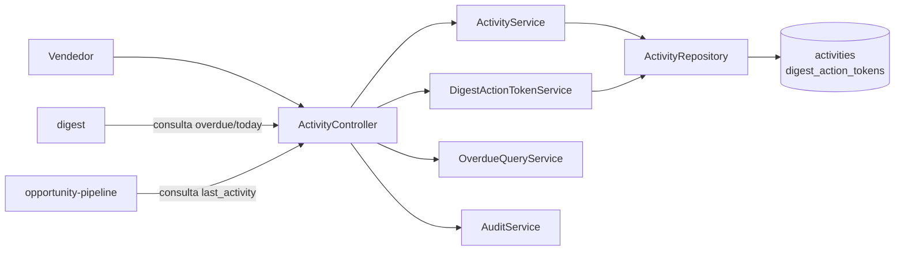
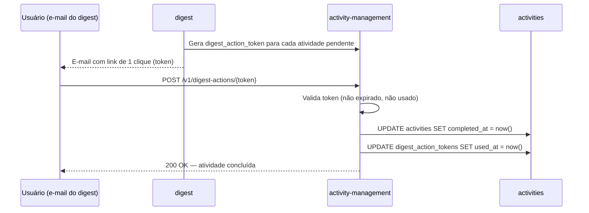

# Module — Activity Management

**Status:** Rascunho para revisão
**Fase:** Fase 1 MVP

---

## 1. Visão Geral

Módulo responsável pelo ciclo de vida de atividades comerciais (calls, reuniões, e-mails, tarefas) vinculadas a oportunidades ou contas. Alimenta o Digest com atividades vencidas e do dia, e serve de base para a detecção de estagnação de oportunidades (RN-028: 14 dias sem atividade).

---

## 2. Classificação

| Item | Valor |
|---|---|
| Tipo de Módulo | Application Module |
| Deployable Candidato | azim-api |
| Bounded Context Relacionado | Activity Management (BC-04) |
| Subdomínio DDD | Supporting Subdomain |
| Tier / Criticidade | Tier 2 — suporte ao pipeline e ao digest; detecção de estagnação é diferencial de produto |
| Status | Rascunho para revisão |

---

## 3. Objetivo

Registrar, acompanhar e completar atividades comerciais. Detectar estagnação em oportunidades sem atividade há mais de 14 dias. Fornecer dados ao Digest (atividades vencidas e do dia por usuário) e ao Pipeline (última atividade por oportunidade).

---

## 4. Responsabilidades

- CRUD de atividades: criar, atualizar, completar e reagendar.
- Vincular atividade a oportunidade e/ou conta.
- Detectar atividades vencidas (due_at < now() e não concluídas) para o Digest.
- Expor última atividade por oportunidade para detecção de estagnação (RN-028).
- Suportar conclusão de atividade via link de 1 clique no Digest (digest_action_tokens).
- Publicar AuditEvent em toda escrita via audit-log.

---

## 5. Fora de Escopo

- Detecção de estagnação na oportunidade em si (regra pertence ao opportunity-pipeline — RN-028).
- Composição e envio do Digest (pertence ao digest).
- Automação de criação de atividades por workflow (pertence ao workflow-automation — Fase 2).

---

## 6. Capacidades Atendidas

| Código | Capability | Descrição |
|---|---|---|
| CAP-06 | Atividades e Follow-ups | CRUD de atividades; detecção de estagnação; follow-ups |

---

## 7. Bounded Context e Linguagem Ubíqua

| Termo | Definição |
|---|---|
| Activity | Ação comercial com tipo, data de vencimento, responsável e status |
| activity_type | Tipo de atividade: call, meeting, email, task |
| due_at | Data e hora de vencimento da atividade |
| overdue | Atividade com due_at no passado e não concluída |
| stagnation | Oportunidade sem atividade concluída há mais de 14 dias (RN-028) |
| digest_action_token | Token de 1 clique no e-mail do digest para concluir ou reagendar uma atividade |

---

## 8. Componentes Internos Candidatos

| Componente | Tipo | Responsabilidade |
|---|---|---|
| ActivityService | Domain Service | CRUD de atividades; validação de vínculo com oportunidade/conta |
| StagnationQueryService | Application Service | Consulta last_activity_at por opportunity_id para o pipeline |
| OverdueQueryService | Application Service | Consulta atividades vencidas por user_id para o digest |
| DigestActionTokenService | Domain Service | Valida e processa digest_action_tokens (conclusão via 1 clique) |
| ActivityRepository | Repository | Escrita e leitura em activities |
| ActivityController | API Controller | Endpoints de atividades e conclusão via token |

---

## 9. APIs Principais

| Método | Endpoint | Finalidade | Consumidores |
|---|---|---|---|
| GET | /v1/activities | Lista atividades por BU/usuário/oportunidade | azim-web |
| POST | /v1/activities | Criar atividade | azim-web |
| PUT | /v1/activities/{id} | Atualizar atividade | azim-web |
| POST | /v1/activities/{id}/complete | Concluir atividade | azim-web, digest (via token) |
| POST | /v1/activities/{id}/reschedule | Reagendar atividade | azim-web |
| GET | /v1/activities/overdue | Atividades vencidas do usuário (para Digest) | digest |
| GET | /v1/activities/today | Atividades do dia do usuário (para Digest) | digest |
| GET | /v1/opportunities/{oppId}/last-activity | Última atividade concluída (para detecção de estagnação) | opportunity-pipeline |
| POST | /v1/digest-actions/{token} | Processar ação de 1 clique do digest | digest (link no e-mail) |

---

## 10. Eventos Publicados

| Evento | Quando é publicado | Consumidores |
|---|---|---|
| ActivityCreated | Após criação de atividade | audit-log |
| ActivityCompleted | Após conclusão de atividade | audit-log; opportunity-pipeline (atualiza last_activity_at) |
| ActivityOverdue | Detectada no processamento do digest | digest |

---

## 11. Eventos Consumidos

Este módulo não consome eventos diretamente.

---

## 12. Dados Próprios

| Entidade/Tabela | Tipo | Banco/Persistência | Observações |
|---|---|---|---|
| activities | Transacional | Cloud SQL / Postgres | Índice obrigatório: (tenant_id, opportunity_id, completed_at) para stagnation query |
| digest_action_tokens | Temporário | Cloud SQL / Postgres | Token com expires_at; usado uma vez (used_at); vinculado a activities |

---

## 13. Integrações

| Sistema/Módulo | Tipo de Integração | Direção | Observações |
|---|---|---|---|
| opportunity-pipeline | API HTTP | Entrada | Pipeline consulta last_activity_at para detecção de estagnação (RN-028) |
| digest | API HTTP | Entrada | Digest consulta atividades vencidas e do dia para composição |
| account-management | API HTTP | Entrada | Atividades podem ser vinculadas a contas |
| audit-log | Package (AuditService) | Saída | Toda escrita gera AuditEvent |
| workflow-automation | API HTTP (Fase 2) | Entrada | Workflow cria atividades como ação |

---

## 14. Dependências

### 14.1 Dependências de Domínio

- organization: bu_id, owner_id para validação de escopo e RBAC.
- opportunity-pipeline: opportunity_id (FK) para vincular atividade — FK sem dependência de BC upstream.
- account-management: account_id (FK) opcional para vincular atividade a conta.

### 14.2 Dependências Técnicas

- Cloud SQL / Postgres (tabelas activities, digest_action_tokens)
- Índice em (tenant_id, opportunity_id, completed_at) para stagnation query eficiente

### 14.3 Dependências Operacionais

- TTL dos digest_action_tokens (configurável; sugestão: 24h após envio do digest)

---

## 15. Requisitos Não Funcionais Relevantes

| Categoria | Requisito / Observação |
|---|---|
| Performance | Consulta de last_activity_at deve ser eficiente (índice em completed_at por oportunidade) |
| Resiliência | Conclusão via digest_action_token deve ser idempotente (token usado uma vez) |
| Observabilidade | Log de expiração e uso de digest_action_tokens |

---

## 16. Compliance Aplicável

| Compliance / Norma / Lei | Aplicável? | Motivo | Impacto no Módulo |
|---|---|---|---|
| LGPD | Marginal | activities.title/description podem conter dados de contatos por referência | Não armazenar PII diretamente em campos de texto livre sem necessidade |
| PCI DSS | Não aplicável | Não processa dados de cartão | — |

---

## 17. Observabilidade

| Item | Recomendação Inicial |
|---|---|
| Logs | Log estruturado: correlation_id, tenant_id, activity_id, opportunity_id, ação |
| Métricas | activities_created_total, activities_completed_total, activities_overdue_total |
| Alertas | Alerta se activities_overdue_total crescer muito acima do baseline (pode indicar problema de digest) |
| Auditoria | Toda escrita gera entrada em audit-log |

---

## 18. Diagramas do Módulo

### 18.1 Diagrama de Componentes Internos

### 18.2 Diagrama de Fluxo — Conclusão via Digest

---

## 19. Riscos

| Código | Risco | Impacto | Mitigação |
|---|---|---|---|
| RISK-ACT-01 | Token de 1 clique expirado antes de o usuário clicar | Usuário não consegue concluir atividade pelo digest | TTL de 24h; link de fallback para o CRM na interface web |
| RISK-ACT-02 | Consulta de stagnation lenta sem índice | Digest demora mais que o SLA de 07:00 BRT | Índice obrigatório em (tenant_id, opportunity_id, completed_at) |

---

## 20. Pontos a Validar

| Código | Ponto | Impacto | Recomendação |
|---|---|---|---|
| VAL-ACT-01 | Activity Management como BC separado vs módulo dentro do Opportunity Pipeline (DDD-VAL-01) | Define fronteira de ownership de atividades | Manter separado na Fase 1; reavaliar se lifecycle se mostrar dependente |
| VAL-ACT-02 | TTL dos digest_action_tokens | Define experiência do usuário no digest | Confirmar com produto (sugestão: 24h ou até o próximo digest) |

---

## 21. Backlog Inicial Sugerido

| Tipo | Item | Descrição |
|---|---|---|
| Epic | Atividades e Follow-ups | CRUD de atividades com conclusão via digest e detecção de estagnação |
| Story Técnica | CRUD de atividades com vínculo a oportunidade e conta | POST/PUT/GET /v1/activities com filtros por BU/usuário/oportunidade |
| Story Técnica | Conclusão de atividade via digest_action_token | POST /v1/digest-actions/{token} com idempotência |
| Story Técnica | API de atividades vencidas e do dia para o Digest | GET /v1/activities/overdue e /v1/activities/today |
| Task | Índice (tenant_id, opportunity_id, completed_at) | Performance de stagnation query |

---

## 22. Referências

| Documento | Seção |
|---|---|
| DDD Segmentation | §4.1 BC-04 Activity Management |
| DDD Segmentation | §6 Data Ownership — Activity Management |
| Data Model | §3 Activity Management (BC-04) |
| Data Model | §3 Digest (digest_action_tokens) |
| Context Map | relations.md — Digest → Activity Management |
