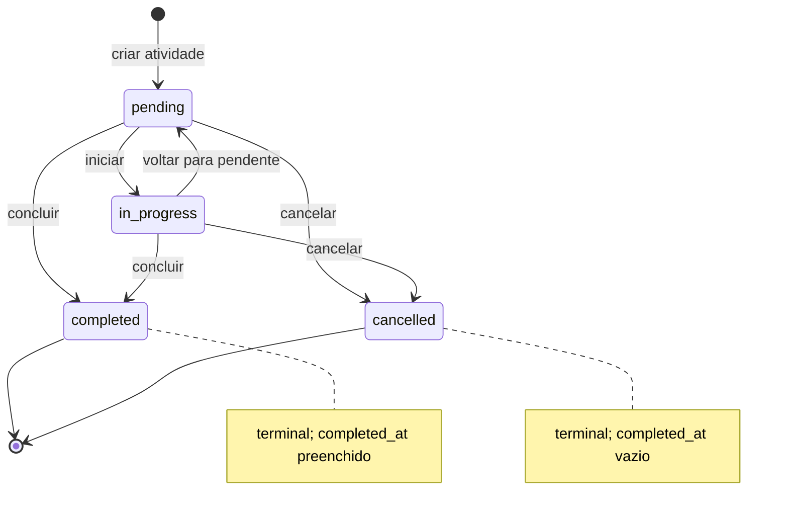
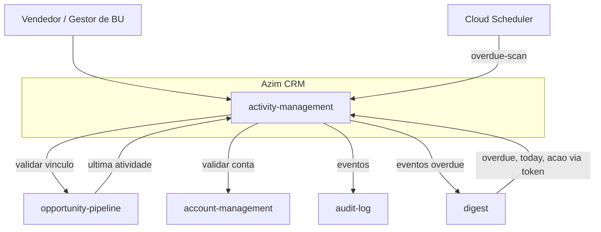
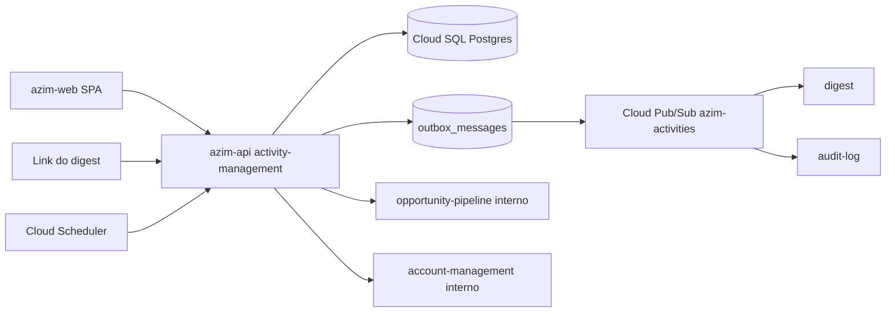
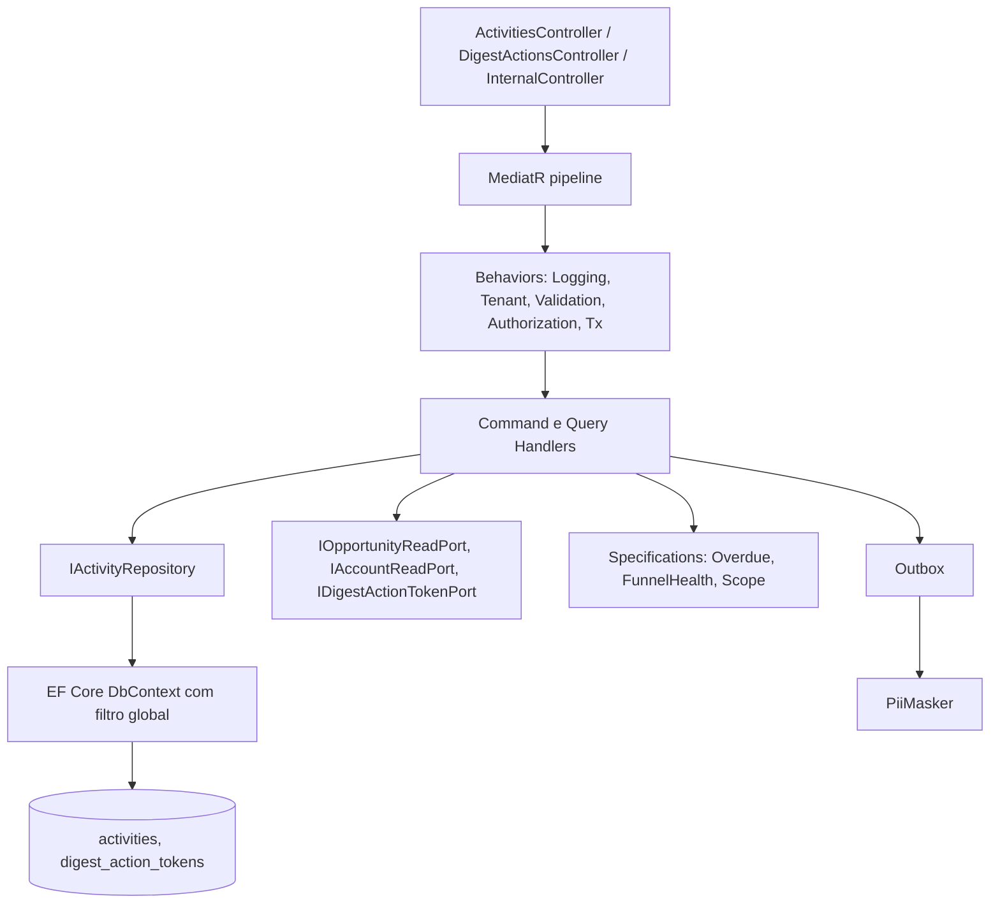
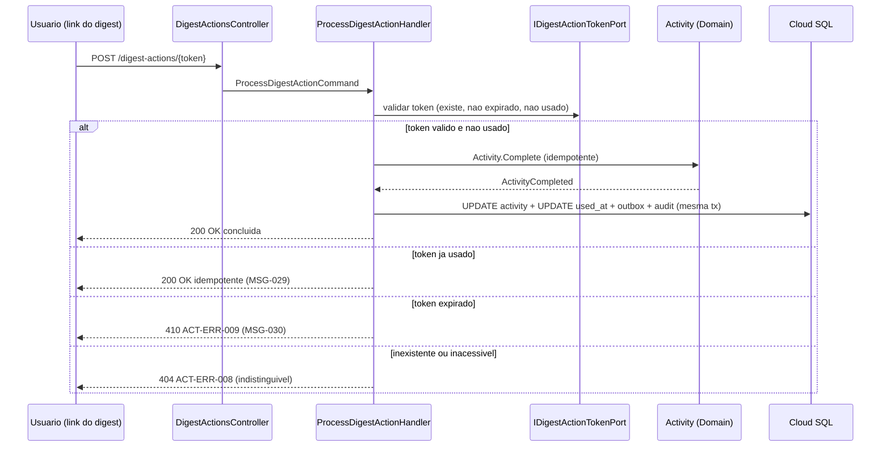
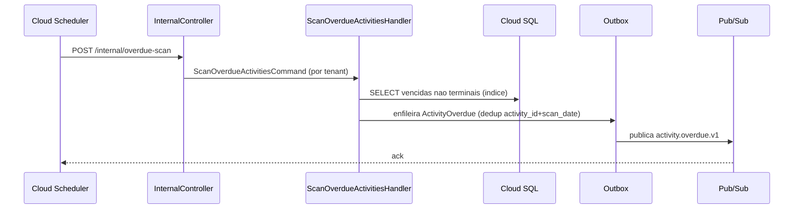

# BC-04 — Activity Management (Gestão de Atividades Comerciais)
**Design Técnico**

- Versão: 0.1.0
- Data: 2026-06-11
- Status: Rascunho para revisão
- Referência base: docs/product/modules/activity-management/requirements.md v0.1.0
- ADRs aplicáveis: ADR-0001 (isolamento multi-tenant em defesa em profundidade — Aceito); ADR-0003, ADR-0004, ADR-0006 referenciados pelo requirements como a criar/confirmar (lacunas registradas como DD nesta §17)
- Rules aplicáveis: `.forge/rules/architecture/clean-architecture.md`, `.forge/rules/architecture/ddd.md`, `.forge/rules/architecture/api-and-contracts.md`, `.forge/rules/architecture/observability.md`, `.forge/rules/architecture/security-and-compliance.md`, `.forge/rules/architecture/jwt-permissions.md`, `.forge/rules/conventions/database-naming.md`, `.forge/rules/domain/audit-immutability.md`

## Histórico de Versões

| Versão | Data | Status | Descrição da alteração |
|--------|------|--------|------------------------|
| 0.1.0 | 2026-06-11 | Rascunho para revisão | Criação inicial do design técnico derivado do requirements.md v0.1.0 |

## 1. Visão Geral

Este documento especifica o **como** do módulo **activity-management** (BC-04, Subdomínio de Suporte, deployable `azim-api`), derivado do `requirements.md` v0.1.0 aprovado para revisão.

O módulo gere o ciclo de vida das **atividades comerciais** (`activities`): criação, atualização, conclusão, reagendamento e cancelamento, sob uma máquina de estados explícita. Entrega valor a três consumidores:

1. **Vendedor / Gestor de BU** (`azim-web`): CRUD, visão "Meu dia / Minha semana" e conclusão em um clique (Req 1–6, Req 8, Req 13).
2. **digest (BC-06)**: consulta de atividades vencidas e do dia por usuário; conclusão/reagendamento via link autenticado de um clique, processando o `digest_action_token` emitido pelo digest (Req 5, Req 7, Req 8, Req 11).
3. **opportunity-pipeline (BC-01)**: consulta da última atividade concluída por oportunidade, insumo da detecção de estagnação RN-028 (Req 12).

O módulo publica os eventos de domínio `ActivityCreated`, `ActivityCompleted` e `ActivityOverdue` (Req 14), registra auditoria imutável de toda escrita (RNF 2) e opera sob isolamento multi-tenant em defesa em profundidade (RNF 1, ADR-0001).

Organização em Clean Architecture (.NET, 5 projetos) com DDD tático no agregado `Activity`. Persistência em Cloud SQL/PostgreSQL; eventos publicados via padrão Outbox + Cloud Pub/Sub (tópico `azim-activities`).

> **Decisão de schema relevante:** a tabela `activities` do data-model atual (§BC-04) **não** possui coluna de status — o estado era inferível apenas de `completed_at`. Este design **adiciona a coluna `status`** para suportar a máquina de estados de quatro estados (Req 4). A mudança de schema é registrada na **DD-001**.

### 1.1 Rastreabilidade requisito → design (mapa-mestre)

| Requisito | Elementos de design |
|-----------|---------------------|
| Req 1 — Criar atividade | `CreateActivityCommand`/Handler, `Activity.Create`, objetos de valor `ActivityType`/`Priority`/`ActivityStatus`, default `priority=medium` e `status=pending`, evento `ActivityCreated`, erros ACT-ERR-001/002/010 (§4, §5.1, §8, §12) |
| Req 2 — Atualizar e excluir | `UpdateActivityCommand`/`DeleteActivityCommand`/Handlers, guarda de atividade terminal, RBAC, auditoria, erro ACT-ERR-003/011 (§5.1, §10, §12) |
| Req 3 — Vincular a oportunidade/conta | Objetos de valor `OpportunityLink`/`AccountLink` (FK reais), `IOpportunityReadPort`/`IAccountReadPort`, erros ACT-ERR-005/006 (§4.3, §6.4, §7) |
| Req 4 — Máquina de estados | `ActivityStatus` (objeto de valor + state machine), `Activity.ChangeStatus`, erro ACT-ERR-004, PBT-01 (§4.5, §5.1) |
| Req 5 — Meu dia / Minha semana | `GetMyDayQuery`/`GetMyWeekQuery`/Handlers, `OverdueSpecification`, cálculo de faixas no fuso IANA do tenant (DD-008) (§5.2, §4.6, §8) |
| Req 6 — Concluir pela lista | `CompleteActivityCommand`/Handler, `Activity.Complete` (idempotente), evento `ActivityCompleted`, sugestão (Req 9), PBT-02 (§5.1, §4.4) |
| Req 7 — Concluir via link do digest | `ProcessDigestActionCommand`/Handler, `IDigestActionTokenPort`, validação de token (DD-003), idempotência (DD-004), erros ACT-ERR-008/009, PBT-02/PBT-03 (§5.1, §6.4, §10) |
| Req 8 — Reagendar | `RescheduleActivityCommand`/Handler, `Activity.Reschedule`, ação `reschedule` do token (§5.1, §8) |
| Req 9 — Sugerir próxima atividade | `SuggestNextActivityQuery`/Handler (não cria; UI-driven, DD-006), PBT-05 (§5.2) |
| Req 10 — Saúde do funil | `FunnelHealthSpecification`, `GetOpportunitiesWithoutFollowupQuery` (não-bloqueante), PBT-05 (§4.6, §5.2) |
| Req 11 — Detectar vencidas | `ScanOverdueActivitiesCommand`/Handler acionado pelo scheduler `activity-overdue`, evento `ActivityOverdue`, `GetOverdueByUserQuery`/`GetTodayByUserQuery`, PBT-04 (§5.1, §5.2, §6.3) |
| Req 12 — Última atividade por oportunidade | `GetLastCompletedActivityQuery`/Handler, índice `idx_activities_tenant_opportunity_completed`, contrato `GET /opportunities/{id}/last-activity` (§5.2, §7, §8) |
| Req 13 — Visibilidade por papel/BU | `ScopeSpecification`, `AuthorizationBehavior`, RBAC por papel mínimo, erro ACT-ERR-007 (§5.4, §10) |
| Req 14 — Publicar eventos | Outbox transacional + Pub/Sub, envelope com `tenant_id`/`correlation_id`, dedup por `event_id` (DD-007) (§6.6, §9) |
| RNF 1 — Isolamento por tenant | `tenant_id` + filtro global EF Core + RLS (DD-002/ADR-0001), erro indistinguível de 404, PBT-03/gate CI (§6.1, §14, §13) |
| RNF 2 — Auditoria imutável | `IAuditPublisher`, Outbox, `audit_logs` append-only (trigger + REVOKE) (§6.6, §7, §11) |
| RNF 3 — Idempotência da conclusão via token | `Activity.Complete` idempotente + `used_at` do token + dedup de evento (DD-004), PBT-02 (§5.1, §6.5) |
| RNF 4 — Performance da última atividade | Índice `(tenant_id, opportunity_id, completed_at)`; consulta em lote sem table scan (§7, §15) |
| RNF 5 — Token de uso único e expirável | Validação de token (existência/expiração/uso), anti-enumeração, TTL configurável (DD-003), PBT-03 (§5.1, §10) |
| RNF 6 — Observabilidade | Logs estruturados com `correlation_id`, métricas `activities_*_total`, alerta de overdue (§11) |
| RNF 7 — Privacidade em texto livre | `PiiMasker` em logs/erros; título/descrição não logados integralmente (DD-009) (§10, §11) |
| PBT-01 — Integridade da máquina de estados | Teste de propriedade sobre `ActivityStatus`/`Activity.ChangeStatus` (§13) |
| PBT-02 — Idempotência da conclusão | Teste de propriedade sobre `Activity.Complete` e `ProcessDigestAction` (§13) |
| PBT-03 — Uso único e anti-enumeração do token | Teste de propriedade sobre validação de token (forma e tempo) (§13) |
| PBT-04 — Invariante de atividade vencida | Teste de propriedade sobre `OverdueSpecification` (§13) |
| PBT-05 — Saúde do funil após sugestão | Teste de propriedade sobre `FunnelHealthSpecification` (§13) |

## 2. Princípios e Decisões Macro

| # | Princípio | Decisão de design |
|---|-----------|-------------------|
| P1 | Clean Architecture estrita | 5 projetos .NET (`ActivityManagement.Domain/Application/Infrastructure/Api/Contracts`); regra de dependência enforçada por `Architecture.Tests` |
| P2 | Domínio rico | Máquina de estados, invariantes e regra de vencida vivem no `Domain`; handlers apenas orquestram |
| P3 | Status explícito | Coluna `status` adicionada a `activities`; estado não é mais inferido só de `completed_at` (DD-001) |
| P4 | Conclusão idempotente | Concluir atividade já concluída é no-op que retorna sucesso, sem novo `completed_at` nem novo evento (DD-004) |
| P5 | Isolamento em profundidade | `tenant_id` + filtro global EF Core + RLS no PostgreSQL obrigatórios (DD-002 / ADR-0001) |
| P6 | Auditoria imutável | `audit_logs` append-only (trigger + REVOKE); publicação via Outbox + Pub/Sub |
| P7 | Token validado, não emitido | A emissão do `digest_action_token` pertence ao digest; este módulo apenas valida e consome (uso único + expiração + anti-enumeração) (DD-003) |
| P8 | Detecção de vencidas é leitura + scan | `ActivityOverdue` é derivado de consulta indexada disparada pelo scheduler, não de uma transição de estado da atividade (DD-005) |
| P9 | Saúde do funil é sinalização | Métrica de follow-up futuro não bloqueia conclusão; sugestão de próxima atividade é UI-driven (DD-006) |
| P10 | API-first/contract-first | Contratos OpenAPI versionados em `/api/v1`; erros padronizados com `correlationId` |

## 3. Estrutura da Solução

```text
ActivityManagement.Domain
  Activities/
    Activity.cs                       (Aggregate Root)
    ValueObjects/
      ActivityType.cs
      Priority.cs
      ActivityStatus.cs               (state machine)
      OpportunityLink.cs
      AccountLink.cs
      DueDate.cs
    Events/
      ActivityCreated.cs
      ActivityCompleted.cs
      ActivityOverdue.cs
    Specifications/
      OverdueSpecification.cs
      FunnelHealthSpecification.cs
      ScopeSpecification.cs
    Repositories/
      IActivityRepository.cs
    Exceptions/
      TitleRequiredException.cs
      InvalidActivityTypeException.cs
      InvalidStatusTransitionException.cs
      ActivityTerminalException.cs

ActivityManagement.Application
  Activities/Commands/                (CreateActivity, UpdateActivity, DeleteActivity,
                                       CompleteActivity, RescheduleActivity,
                                       ProcessDigestAction, ScanOverdueActivities)
  Activities/Queries/                 (GetMyDay, GetMyWeek, GetOverdueByUser, GetTodayByUser,
                                       GetLastCompletedActivity, SuggestNextActivity,
                                       GetOpportunitiesWithoutFollowup, ListActivities)
  Behaviors/                          (Validation, Tenant, Authorization, Logging, Transaction)
  Ports/                              (IOpportunityReadPort, IAccountReadPort,
                                       IDigestActionTokenPort, IAuditPublisher, IClock, ITenantClock)
  Validators/

ActivityManagement.Infrastructure
  Persistence/                        (DbContext, IEntityTypeConfiguration, repositórios, migrations)
  Outbox/                             (OutboxMessage, OutboxPublisher)
  Audit/                              (PiiMasker, AuditPublisher)
  Tokens/                             (DigestActionTokenAdapter)
  ReadPorts/                          (OpportunityReadAdapter, AccountReadAdapter — HTTP/gRPC interno)
  Tenancy/                            (TenantContext, TenantConnectionInterceptor, global query filter)
  Scheduling/                         (OverdueScanEndpoint handler)

ActivityManagement.Api
  Controllers/                        (ActivitiesController, DigestActionsController, InternalController)
  Middleware/                         (CorrelationId, exception handling)
  DependencyInjection/

ActivityManagement.Contracts
  Activities/                         (DTOs request/response)
  Events/                             (ActivityCreated.v1, ActivityCompleted.v1, ActivityOverdue.v1)

Testes:
  ActivityManagement.Domain.Tests
  ActivityManagement.Application.Tests
  ActivityManagement.Infrastructure.Tests
  ActivityManagement.Api.Tests
  ActivityManagement.Architecture.Tests
```

Dependências entre projetos (validadas por `Architecture.Tests`): `Api → Application, Infrastructure`; `Application → Domain, Contracts`; `Infrastructure → Application, Domain`; `Domain → ∅`; `Contracts → ∅`.

## 4. Modelo de Domínio

### 4.1 Aggregates

**Activity (Aggregate Root)**

- Identidade: `ActivityId` (UUID).
- Pertence a um `tenant_id` e a uma `bu_id` (Req 1.7); responsável por `owner_id` (Req 1.1).
- Atributos: `ActivityType type`, `title` (texto), `description` (opcional), `DueDate dueAt`, `Priority priority`, `ActivityStatus status`, `OpportunityLink? opportunityLink`, `AccountLink? accountLink`, `completedAt` (opcional), auditoria temporal.
- Invariantes protegidas pelo root:
  - I1: `title` não vazio após trim (Req 1.5) → exceção `TitleRequiredException`.
  - I2: `type` ∈ lista canônica §4.2 do requirements (Req 1.6) → `ActivityType` valida na construção.
  - I3: toda atividade nasce com `status=pending` e `priority=medium` quando não informada (Req 1.3, Req 1.4).
  - I4: transições de `status` só ocorrem conforme a máquina de estados (Req 4) — encapsulado em `ActivityStatus`.
  - I5: `completedAt` está preenchido **se e somente se** `status=completed` (Req 4.4, Req 4.5, PBT-01).
  - I6: atividade em estado terminal (`completed`/`cancelled`) rejeita atualização de atributos, reagendamento e nova transição (Req 2.1, Req 4.3, Req 8.1) → `ActivityTerminalException`.
- Factories: `Activity.Create(tenantId, buId, ownerId, type, title, dueAt, priority?, description?, opportunityLink?, accountLink?, clock)` e `Activity.Reconstitute(...)`.
- Métodos de comportamento: `ChangeStatus(target, clock)`, `Complete(clock)`, `Cancel(clock)`, `Reschedule(newDueAt)`, `UpdateDetails(...)`.

A fronteira transacional do agregado é a própria atividade: cada escrita carrega/persiste um único `Activity` e acumula seus domain events para despacho pós-commit via Outbox (§6.6). Repositório: `IActivityRepository`.

### 4.2 Entidades

Não há entidades adicionais dentro do agregado `Activity` nesta versão. O `digest_action_token` **não** é entidade deste agregado — é dado de fronteira pertencente ao digest (BC-06), acessado por porta (`IDigestActionTokenPort`, §6.4, DD-003).

### 4.3 Objetos de valor

| Objeto de valor | Atributos | Regras / Invariantes | Requisitos |
|-----------------|-----------|----------------------|------------|
| `ActivityType` | `value` ∈ {`meeting`,`follow_up`,`call`,`email`,`task`} | Imutável; igualdade por valor; rejeita valor fora da lista canônica | Req 1.6 |
| `Priority` | `value` ∈ {`low`,`medium`,`high`} | Imutável; default `medium`; igualdade por valor | Req 1.3 |
| `ActivityStatus` | `value` ∈ {`pending`,`in_progress`,`completed`,`cancelled`} | Imutável; conhece transições válidas (§4.5); expõe `CanTransitionTo(target)`, `IsTerminal` | Req 4, PBT-01 |
| `DueDate` | `value: DateTimeOffset` | Instante de vencimento (TIMESTAMPTZ); base do cálculo de vencida e de faixas | Req 1.1, Req 5, Req 11 |
| `OpportunityLink` | `opportunityId: UUID` | Imutável; referencia oportunidade do mesmo tenant (validada por porta); opcional | Req 3.1, Req 3.2 |
| `AccountLink` | `accountId: UUID` | Imutável; referencia conta do mesmo tenant (validada por porta); opcional | Req 3.1, Req 3.3 |

Todos os objetos de valor são imutáveis e implementam igualdade por valor (rule `clean-architecture.md` §6, rule `ddd.md`). Não se usa a abreviação VO; o termo é **objeto de valor**.

### 4.4 Domain Events

| Evento (passado) | Disparado quando | Carga (sem PII) | Consumidor | Requisito |
|------------------|------------------|-----------------|------------|-----------|
| `ActivityCreated` | Atividade criada | `activityId`, `tenantId`, `buId`, `ownerId`, `type`, `dueAt`, `opportunityId?`, `accountId?`, `occurredAt` | audit-log | Req 14.1 |
| `ActivityCompleted` | Conclusão efetiva (primeira transição para `completed`) | `activityId`, `tenantId`, `ownerId`, `opportunityId?`, `completedAt`, `occurredAt` | audit-log, opportunity-pipeline, reporting | Req 14.2 |
| `ActivityOverdue` | Scan detecta atividade vencida não terminal | `activityId`, `tenantId`, `ownerId`, `dueAt`, `opportunityId?`, `scanDate`, `occurredAt` | digest | Req 14.3 |

Eventos são fatos no passado (rule `api-and-contracts.md`) e **não carregam título/descrição** (texto livre potencialmente com PII — RNF 7.2, DD-009). `ActivityCompleted` é emitido **exatamente uma vez por conclusão efetiva** (Req 14.2/14.4, PBT-02): a idempotência de `Activity.Complete` garante que reconclusões não acumulam eventos, e o consumidor deduplica por `event_id` (§6.5).

### 4.5 State Machines

**Ciclo de status da atividade (`ActivityStatus`)** — Req 4, §4.1 do requirements.



- Transições válidas exatamente as listadas; qualquer outra é rejeitada com `InvalidStatusTransitionException` → ACT-ERR-004 (Req 4.2, PBT-01).
- `completed` e `cancelled` são terminais: nenhuma transição de saída no MVP (Req 4.3). Reabertura está fora de escopo (requirements §9).
- `completed` preenche `completedAt` (Req 4.4); `cancelled` não (Req 4.5).
- Toda transição gera registro de auditoria (Req 4.6, §6.6).

### 4.6 Policies / Specifications

| Specification | Responsabilidade | Requisito |
|---------------|------------------|-----------|
| `OverdueSpecification` | Atividade é vencida ⇔ `dueAt < referenceInstant` **e** `status` não terminal. Atividades terminais nunca são vencidas | Req 11.1, Req 5.1, PBT-04 |
| `TodaySpecification` | `dueAt` no dia corrente no fuso IANA do tenant e `status` não terminal | Req 5.1, Req 11.4 |
| `UpcomingSpecification` | `dueAt` posterior ao dia corrente no fuso do tenant e `status` não terminal | Req 5.1 |
| `FunnelHealthSpecification` | Oportunidade aberta tem follow-up futuro ⇔ existe ≥1 atividade não terminal com `dueAt` no futuro vinculada a ela | Req 10.1, PBT-05 |
| `ScopeSpecification` | Vendedor vê apenas as próprias atividades; Gestor de BU vê as da sua BU; sempre dentro do tenant | Req 13, RNF 1 |

As faixas "vencidas / hoje / próximas" (Req 5) são calculadas no **fuso horário IANA configurado no tenant** (Req 5.2, DD-008); o limite de "vencida" para fins do evento `ActivityOverdue` usa o instante atual (`dueAt < now()`), conforme Req 11.1.

## 5. Application Layer

Casos de uso seguem CQRS leve: Commands para escrita, Queries para leitura, um handler por caso de uso. Mediação via MediatR (rule `clean-architecture.md` §10); validação sintática de input com FluentValidation antes do handler (§11). Regra de negócio (máquina de estados, vencida, saúde do funil) permanece no domínio (rule §9).

### 5.1 Commands

| Command | Caso de uso | Invariantes delegadas ao domínio | Evento | Erros |
|---------|-------------|----------------------------------|--------|-------|
| `CreateActivityCommand` | Criar atividade (Req 1) | `Activity.Create` (título, tipo, default status/priority) | `ActivityCreated` | ACT-ERR-001/002/005/006/010 |
| `UpdateActivityCommand` | Atualizar atributos (Req 2) | `Activity.UpdateDetails` (guarda terminal) | — (auditoria) | ACT-ERR-001/002/003/005/006/011 |
| `DeleteActivityCommand` | Excluir atividade (Req 2.3) | — (remoção + auditoria) | — (auditoria) | ACT-ERR-003/007 |
| `CompleteActivityCommand` | Concluir pela lista (Req 6) | `Activity.Complete` (transição + `completedAt`, idempotente) | `ActivityCompleted` | ACT-ERR-003/004 |
| `RescheduleActivityCommand` | Reagendar (Req 8) | `Activity.Reschedule` (nova `dueAt`, guarda terminal) | — (auditoria) | ACT-ERR-003/011 |
| `ProcessDigestActionCommand` | Conclusão/reagendamento via token (Req 7, Req 8.5) | `Activity.Complete`/`Activity.Reschedule` após validação de token | `ActivityCompleted` (quando complete) | ACT-ERR-008/009 |
| `ScanOverdueActivitiesCommand` | Scan agendado de vencidas (Req 11) | `OverdueSpecification`; emite evento por atividade | `ActivityOverdue` | — |

Notas:
- `CreateActivityCommand` valida `opportunity_id`/`account_id` informados via `IOpportunityReadPort`/`IAccountReadPort` (mesmo tenant — Req 3.2/3.3). FK reais no banco reforçam a integridade (§7).
- `CompleteActivityCommand` é **idempotente** (Req 6.4, RNF 3, DD-004): se `status` já é `completed`, retorna sucesso sem alterar `completedAt` e sem novo evento.
- `ProcessDigestActionCommand` valida o token **antes de qualquer escrita** (Req 7.2): existência, não expirado, não usado; em sucesso conclui (ou reagenda) e marca `used_at` (Req 7.3); token já usado retorna sucesso idempotente (Req 7.5, MSG-029); expirado retorna ACT-ERR-009 (MSG-030); inexistente/malformado/inacessível retorna ACT-ERR-008 indistinguível (Req 7.6, anti-enumeração, PBT-03). Ver DD-003/DD-004.
- `ScanOverdueActivitiesCommand` é acionado pelo endpoint interno `/internal/overdue-scan` pelo Cloud Scheduler (TRD §scheduler `activity-overdue`); não altera o estado da atividade (DD-005).

### 5.2 Queries

| Query | Caso de uso | Saída | Requisito |
|-------|-------------|-------|-----------|
| `ListActivitiesQuery(filters, page)` | Listar atividades por owner/tipo/status/oportunidade | Página de atividades do escopo (BU/usuário) | Req 13, README §9 |
| `GetMyDayQuery(userId)` | Visão "Meu dia" (vencidas, hoje, próximas) | Atividades agrupadas em três faixas (fuso do tenant) | Req 5 |
| `GetMyWeekQuery(userId)` | Visão "Minha semana" | Atividades não terminais da semana corrente | Req 5 |
| `GetOverdueByUserQuery(userId)` | Vencidas do usuário (para digest) | Atividades não terminais com `dueAt < now()` | Req 11.3, Req 5.6 |
| `GetTodayByUserQuery(userId)` | Atividades do dia do usuário (para digest) | Atividades não terminais com `dueAt` hoje | Req 11.4, Req 5.6 |
| `GetLastCompletedActivityQuery(opportunityId)` | Última atividade concluída por oportunidade | `completedAt` mais recente ou ausência | Req 12, RNF 4 |
| `SuggestNextActivityQuery(activityId)` | Sugestão de próxima atividade ao concluir | Pré-preenchimento de vínculo (não cria) | Req 9, PBT-05 |
| `GetOpportunitiesWithoutFollowupQuery(buId)` | Saúde do funil | Oportunidades abertas sem follow-up futuro | Req 10 |

- `GetLastCompletedActivityQuery` suporta consulta em lote (`opportunityIds[]`) servida pelo índice `(tenant_id, opportunity_id, completed_at)` sem table scan (RNF 4.3).
- `SuggestNextActivityQuery` apenas **sugere** vínculo (oportunidade/conta) ao concluir atividade vinculada a oportunidade aberta (Req 9.1/9.2); **não cria** atividade (Req 9.4, DD-006). Para oportunidade já fechada ou sem vínculo, a sugestão é omitida (Req 9.5).

### 5.3 Handlers

- Um handler por Command/Query. Handlers orquestram: carregam o agregado via `IActivityRepository`, invocam o comportamento de domínio, persistem e delegam o despacho de eventos ao pipeline transacional + Outbox.
- Handlers **não** contêm regra de negócio (rule `clean-architecture.md` §9): máquina de estados, regra de vencida e saúde do funil vivem no domínio (`ActivityStatus`, specifications).
- `ScanOverdueActivitiesHandler` itera as atividades vencidas do tenant em lotes paginados e enfileira um `ActivityOverdue` por atividade no Outbox (com chave de deduplicação por `(activityId, scanDate)` — §6.5).

### 5.4 Pipeline Behaviors

Ordem de execução do pipeline MediatR:

1. `CorrelationLoggingBehavior` — injeta `correlation_id`, `tenant_id`, `activity_id`, `opportunity_id` (quando houver) no escopo de log; nunca loga título/descrição em claro (RNF 6.1, RNF 7.2).
2. `TenantScopeBehavior` — resolve `TenantContext` do token e garante o filtro global + `SET app.current_tenant` na conexão (Req 13.5, RNF 1, DD-002).
3. `ValidationBehavior` — FluentValidation; requests inválidos não produzem efeito colateral.
4. `AuthorizationBehavior` — RBAC por papel e escopo de BU (`ScopeSpecification`): Vendedor sobre as próprias, Gestor de BU sobre a BU; nega com ACT-ERR-007 (Req 13). Para `ProcessDigestActionCommand` a autorização provém do token (sem JWT de usuário, §10).
5. `TransactionBehavior` — abre transação para Commands, coleta domain events no Outbox e faz commit atômico (escrita de negócio + outbox + auditoria na mesma transação).

### 5.5 Validações de Aplicação

| Validação | Camada | Erro |
|-----------|--------|------|
| Título obrigatório / não em branco | `CreateActivityValidator`/`UpdateActivityValidator` (sintática) + `Activity` (domínio) | ACT-ERR-001 |
| Tipo dentro da lista canônica | Validator (sintática) + `ActivityType` (domínio) | ACT-ERR-002 |
| `due_at` informada e válida | `CreateActivityValidator` | ACT-ERR-010 |
| `opportunity_id` existente e do tenant | Handler + `IOpportunityReadPort` + FK | ACT-ERR-005 |
| `account_id` existente e do tenant | Handler + `IAccountReadPort` + FK | ACT-ERR-006 |
| Transição de status permitida | `ActivityStatus.CanTransitionTo` (domínio) | ACT-ERR-004 |
| Operação em atividade terminal | `Activity` (guarda I6) | ACT-ERR-011 |
| Papel/escopo de BU suficiente | `AuthorizationBehavior` / `ScopeSpecification` | ACT-ERR-007 |
| Token válido (existe/não expirado/não usado) | `ProcessDigestActionHandler` + `IDigestActionTokenPort` | ACT-ERR-008/009 |

## 6. Infrastructure Layer

### 6.1 Persistência

- **Banco:** Cloud SQL for PostgreSQL (TRD §dados próprios). Região conforme política de residência do produto (`southamerica-east1`).
- **ORM:** EF Core; mapeamento via `IEntityTypeConfiguration<T>`; nomes físicos em `snake_case` (rule `database-naming.md`).
- **Isolamento multi-tenant (defesa em profundidade — obrigatório, ADR-0001, DD-002):**
  1. `tenant_id UUID NOT NULL` em `activities` e em `digest_action_tokens` (eixo estrutural);
  2. **EF Core Global Query Filter** por `tenant_id` em todas as entidades multi-tenant;
  3. **RLS no PostgreSQL** habilitada nas tabelas multi-tenant, políticas comparando `tenant_id = current_setting('app.current_tenant')::uuid`, com comportamento **falha-fechada**. O `TenantConnectionInterceptor` executa `SET app.current_tenant = @tenant_id` ao alugar a conexão, antes de qualquer comando.
- **Repositório:** `IActivityRepository` (definido no Domain) implementado no Infrastructure; nunca vaza `IQueryable`/`DbSet` para fora da infraestrutura.

### 6.2 Cache

Não aplicável como cache de domínio nesta versão. A resolução `tenant slug → id` usa cache Redis na borda de plataforma (ADR-0001), fora do escopo deste módulo. As consultas críticas (última atividade, vencidas) são servidas por índice (§7, RNF 4), sem necessidade de cache no MVP.

### 6.3 Mensageria

- **Transporte:** Cloud Pub/Sub, tópico `azim-activities` (TRD §eventos), retenção 7 dias.
- **Padrão:** Outbox transacional (§6.6) — eventos persistidos na mesma transação da escrita e relayados ao Pub/Sub.
- **Scheduler:** o Cloud Scheduler aciona `POST /internal/overdue-scan` diariamente (TRD §scheduler `activity-overdue`), que executa `ScanOverdueActivitiesCommand`.
- Este módulo **não consome** eventos de outros BCs (README §11).

### 6.4 Integrações Externas

| Integração | Direção | Mecanismo | Resiliência |
|------------|---------|-----------|-------------|
| opportunity-pipeline | Saída (leitura) via `IOpportunityReadPort` (validar vínculo, verificar oportunidade aberta) | API HTTP/gRPC interna (mTLS) | timeout, retry com backoff, circuit breaker |
| account-management | Saída (leitura) via `IAccountReadPort` (validar `account_id`) | API HTTP/gRPC interna (mTLS) | timeout, retry com backoff, circuit breaker |
| digest (`digest_action_tokens`) | Leitura/consumo via `IDigestActionTokenPort` | Acesso ao mesmo banco no `azim-api` (DD-003) | validação síncrona; falha-fechada |
| audit-log | Saída (eventos) | Pub/Sub via Outbox | retry do relay; DLQ no Pub/Sub |

Toda chamada propaga `correlation_id` e `tenant_id` e respeita o escopo de tenant/BU.

### 6.5 Idempotência

- **Conclusão pela lista (Req 6.4):** `Activity.Complete` é idempotente no domínio — se já `completed`, no-op sem novo `completedAt` nem novo evento (PBT-02).
- **Conclusão via token (Req 7.5, RNF 3):** o `used_at` do `digest_action_token` garante uso único; múltiplos cliques retornam sucesso (MSG-029) sem nova escrita. A escrita de `used_at` + conclusão ocorre na mesma transação (atomicidade).
- **Publicação de eventos (Req 14.4):** o relay do Outbox é at-least-once; consumidores deduplicam por `event_id`. `ActivityCompleted` decorre de uma única conclusão efetiva; `ActivityOverdue` usa chave `(activity_id, scan_date)` para evitar duplicação dentro do mesmo scan.

### 6.6 Outbox / Inbox

- **Outbox:** tabela `outbox_messages` gravada na mesma transação da escrita de domínio (`TransactionBehavior`). Um relay (background worker) lê pendentes e publica no Pub/Sub, marcando como enviado — atomicidade entre estado e evento, entrega at-least-once.
- **Inbox:** não aplicável nesta versão (módulo não consome eventos).

## 7. Schema / Modelo de Persistência

Convenções: `snake_case`, `tenant_id` obrigatório, timestamps `created_at`/`updated_at` (rule `database-naming.md`). Não há valores monetários neste módulo.

```sql
-- Atividades — agregado Activity
-- Mudança vs data-model §BC-04: adição da coluna status e do completed_at já existente (DD-001)
activities (
  id              UUID PRIMARY KEY DEFAULT gen_random_uuid(),
  tenant_id       UUID NOT NULL,
  bu_id           UUID NOT NULL REFERENCES business_units(id),
  owner_id        UUID NOT NULL REFERENCES users(id),
  opportunity_id  UUID REFERENCES opportunities(id),    -- nullable (Req 3.1)
  account_id      UUID REFERENCES accounts(id),         -- nullable (Req 3.1)
  activity_type   VARCHAR(20) NOT NULL,                 -- meeting|follow_up|call|email|task
  title           TEXT NOT NULL,
  description     TEXT,
  due_at          TIMESTAMPTZ NOT NULL,
  status          VARCHAR(20) NOT NULL DEFAULT 'pending', -- NOVO (DD-001): pending|in_progress|completed|cancelled
  priority        VARCHAR(10) NOT NULL DEFAULT 'medium', -- low|medium|high
  completed_at    TIMESTAMPTZ,                           -- preenchido sse status=completed
  created_at      TIMESTAMPTZ NOT NULL DEFAULT now(),
  updated_at      TIMESTAMPTZ NOT NULL DEFAULT now(),
  CONSTRAINT chk_activities_title_not_blank CHECK (length(btrim(title)) > 0),
  CONSTRAINT chk_activities_type CHECK (activity_type IN ('meeting','follow_up','call','email','task')),
  CONSTRAINT chk_activities_status CHECK (status IN ('pending','in_progress','completed','cancelled')),
  CONSTRAINT chk_activities_priority CHECK (priority IN ('low','medium','high')),
  -- I5/PBT-01: completed_at preenchido sse status=completed
  CONSTRAINT chk_activities_completed_consistency
    CHECK ((status = 'completed') = (completed_at IS NOT NULL))
);
-- RNF 4: última atividade concluída por oportunidade (obrigatório — data-model §422)
CREATE INDEX idx_activities_tenant_opportunity_completed
  ON activities (tenant_id, opportunity_id, completed_at);
-- Req 5/11: visão "meu dia" e detecção de vencidas por usuário
CREATE INDEX idx_activities_tenant_owner_due
  ON activities (tenant_id, owner_id, due_at) WHERE status IN ('pending','in_progress');
-- RLS obrigatória (ADR-0001 / DD-002)
ALTER TABLE activities ENABLE ROW LEVEL SECURITY;
ALTER TABLE activities FORCE ROW LEVEL SECURITY;
CREATE POLICY rls_activities_tenant ON activities
  USING (tenant_id = current_setting('app.current_tenant')::uuid)
  WITH CHECK (tenant_id = current_setting('app.current_tenant')::uuid);

-- Token de ação do digest — owned por digest (BC-06); validado/consumido aqui (DD-003)
-- Definição alinhada ao data-model §BC-06; RLS obrigatória
digest_action_tokens (
  id              UUID PRIMARY KEY DEFAULT gen_random_uuid(),
  tenant_id       UUID NOT NULL,
  user_id         UUID NOT NULL,
  activity_id     UUID REFERENCES activities(id),
  action          VARCHAR(20) NOT NULL,                 -- complete|reschedule
  token_hash      TEXT NOT NULL,                        -- hash do token opaco (DD-003)
  expires_at      TIMESTAMPTZ NOT NULL,
  used_at         TIMESTAMPTZ,
  created_at      TIMESTAMPTZ NOT NULL DEFAULT now(),
  CONSTRAINT chk_digest_action_type CHECK (action IN ('complete','reschedule'))
);
CREATE UNIQUE INDEX uq_digest_action_tokens_hash ON digest_action_tokens (token_hash);
ALTER TABLE digest_action_tokens ENABLE ROW LEVEL SECURITY;
ALTER TABLE digest_action_tokens FORCE ROW LEVEL SECURITY;
CREATE POLICY rls_digest_action_tokens_tenant ON digest_action_tokens
  USING (tenant_id = current_setting('app.current_tenant')::uuid)
  WITH CHECK (tenant_id = current_setting('app.current_tenant')::uuid);

-- Outbox transacional
outbox_messages (
  id              UUID PRIMARY KEY DEFAULT gen_random_uuid(),
  tenant_id       UUID NOT NULL,
  event_type      TEXT NOT NULL,
  dedup_key       TEXT,                                 -- (activity_id, scan_date) p/ ActivityOverdue
  payload_json    JSONB NOT NULL,                       -- sem título/descrição (RNF 7.2)
  occurred_at     TIMESTAMPTZ NOT NULL DEFAULT now(),
  published_at    TIMESTAMPTZ
);
CREATE INDEX idx_outbox_unpublished ON outbox_messages (published_at) WHERE published_at IS NULL;
CREATE UNIQUE INDEX uq_outbox_dedup ON outbox_messages (event_type, dedup_key) WHERE dedup_key IS NOT NULL;

-- Auditoria imutável (append-only) — RNF 2 e rule audit-immutability
audit_logs (
  id              UUID PRIMARY KEY DEFAULT gen_random_uuid(),
  tenant_id       UUID NOT NULL,
  user_id         UUID,                                 -- autor; nulo quando ação via token do digest
  entity_type     TEXT NOT NULL,                        -- 'Activity'
  entity_id       UUID NOT NULL,
  action          TEXT NOT NULL,                        -- created|updated|completed|cancelled|rescheduled|deleted
  delta_json      JSONB NOT NULL,                       -- título/descrição mascarados (RNF 7.2)
  correlation_id  UUID,                                 -- correlaciona token↔atividade (RNF 2.4, Req 7.8)
  created_at      TIMESTAMPTZ NOT NULL DEFAULT now()
);
CREATE INDEX idx_audit_logs_tenant_entity ON audit_logs (tenant_id, entity_type, entity_id);
CREATE TRIGGER trg_audit_logs_immutable
  BEFORE UPDATE OR DELETE OR TRUNCATE ON audit_logs
  FOR EACH STATEMENT EXECUTE FUNCTION prevent_immutable_table_modification();
REVOKE UPDATE, DELETE, TRUNCATE ON audit_logs FROM app;
```

Notas de schema:
- **DD-001 (adição de `status`):** o data-model §BC-04 não define `status` nem `priority`. Ambas são adicionadas via migration; `status` é necessário para `in_progress`/`cancelled` (Req 4), que não são representáveis só por `completed_at`. A constraint `chk_activities_completed_consistency` formaliza o invariante I5/PBT-01 no banco.
- **`digest_action_tokens`:** owned por digest (emissão); este módulo lê e marca `used_at`. Coluna `token_hash` armazena o hash do token opaco (o token em claro só transita no link; não é persistido em claro — DD-003).
- **Migração:** EF Core migrations versionadas; migration de `activities` faz backfill de `status` a partir de `completed_at` (linhas com `completed_at` → `completed`; demais → `pending`).
- **`audit_logs` é append-only** (sem `updated_at`); RLS pode ser dispensada apenas por exceção formal — aqui mantida com `tenant_id` e RLS conforme demais tabelas.

## 8. API Contracts

Base: `/api/v1`. Autenticação: Bearer JWT (GCP Identity Platform) com claim `permissions` (rule `jwt-permissions.md`), exceto o endpoint de ação do digest, autenticado por token (§10). Erros no formato `{ "error", "code", "correlationId" }` (rule `api-and-contracts.md`).

| Método | Path | Autenticação / Papel mínimo | Descrição | Erros |
|--------|------|-----------------------------|-----------|-------|
| GET | `/api/v1/activities?owner={id}&type={t}&status={s}&overdue={bool}&page={n}` | JWT — Viewer | Listar atividades do escopo (BU/usuário) | ACT-ERR-007 |
| POST | `/api/v1/activities` | JWT — Vendedor | Criar atividade | ACT-ERR-001/002/005/006/010 |
| GET | `/api/v1/activities/{id}` | JWT — Viewer | Detalhe da atividade | ACT-ERR-003/007 |
| PUT | `/api/v1/activities/{id}` | JWT — Vendedor (escopo) | Atualizar atributos | ACT-ERR-001/002/003/005/006/011 |
| DELETE | `/api/v1/activities/{id}` | JWT — Vendedor (escopo) | Excluir atividade (auditada) | ACT-ERR-003/007 |
| PATCH | `/api/v1/activities/{id}/complete` | JWT — Vendedor (escopo) | Concluir (idempotente; sugere próxima) | ACT-ERR-003/004 |
| PATCH | `/api/v1/activities/{id}/reschedule` | JWT — Vendedor (escopo) | Reagendar (`dueAt` nova) | ACT-ERR-003/011 |
| GET | `/api/v1/activities/me/day` | JWT — Vendedor | Visão "Meu dia" (vencidas/hoje/próximas) | — |
| GET | `/api/v1/activities/me/week` | JWT — Vendedor | Visão "Minha semana" | — |
| GET | `/api/v1/activities/overdue?owner={id}` | JWT — Viewer / interno (digest) | Vencidas do usuário (digest) | ACT-ERR-007 |
| GET | `/api/v1/activities/today?owner={id}` | JWT — Viewer / interno (digest) | Atividades do dia do usuário (digest) | ACT-ERR-007 |
| GET | `/api/v1/opportunities/{oppId}/last-activity` | JWT / interno (pipeline) | Última atividade concluída (estagnação) | ACT-ERR-007 |
| POST | `/api/v1/digest-actions/{token}` | Token do digest (sem JWT) | Processar ação de 1 clique (complete/reschedule) | ACT-ERR-008/009 |
| POST | `/internal/overdue-scan` | Interno (Scheduler, mTLS/OIDC) | Disparar scan de vencidas e publicar `ActivityOverdue` | — |

Notas de contrato:
- **Conclusão (Req 6):** `PATCH .../complete` retorna 200 com o estado final e, quando aplicável, o bloco de sugestão de próxima atividade (Req 6.5/Req 9). Reconcluir retorna 200 sem alterar `completedAt` (Req 6.4).
- **Ação do digest (Req 7):** `POST /digest-actions/{token}` valida o token e processa conforme `action` (`complete`/`reschedule`). Token usado → 200 idempotente (MSG-029); expirado → 410 ACT-ERR-009 (MSG-030, orienta acessar o portal); inexistente/malformado/inacessível → resposta indistinguível ACT-ERR-008 (anti-enumeração, PBT-03). Reagendamento via token informa a nova `dueAt` no corpo (Req 8.5).
- **Paginação/filtros:** `page`/`pageSize`; filtros por owner/tipo/status/oportunidade/`overdue` (README §9, rule `api-and-contracts.md`).
- **Consultas do digest** (`/overdue`, `/today`) podem ser invocadas pelo worker do digest por caminho interno (mTLS) restrito a um usuário (Req 5.6, Req 11.3/11.4).

## 9. AsyncAPI / Eventos Publicados e Consumidos

**Publicados** (Pub/Sub, tópico `azim-activities`, via Outbox). Envelope: `event_id`, `event_type`, `event_version`, `tenant_id`, `correlation_id`, `causation_id`, `occurred_at`. Eventos são fatos no passado; **sem título/descrição** (RNF 7.2).

| Evento | Versão | Channel/topic conceitual | Payload | Idempotência | Consumidor |
|--------|--------|--------------------------|---------|--------------|------------|
| `activity.created.v1` (`ActivityCreated`) | v1 | `azim-activities` | `activityId`, `tenantId`, `buId`, `ownerId`, `type`, `dueAt`, `opportunityId?`, `accountId?` | dedup por `event_id` | digest, audit-log |
| `activity.completed.v1` (`ActivityCompleted`) | v1 | `azim-activities` | `activityId`, `tenantId`, `ownerId`, `opportunityId?`, `completedAt` | dedup por `event_id`; ≤1 por conclusão efetiva | digest, audit-log, reporting, opportunity-pipeline |
| `activity.overdue.v1` (`ActivityOverdue`) | v1 | `azim-activities` | `activityId`, `tenantId`, `ownerId`, `dueAt`, `opportunityId?`, `scanDate` | dedup por `(activityId, scanDate)` | digest |

- **Eventos de domínio vs integração:** os três acima são eventos de domínio do BC expostos como contratos de integração. `opportunity.stale` **não** é publicado por este módulo — a regra de estagnação pertence ao opportunity-pipeline (Req 12.4; ownership DDD-VAL-01 mantido no pipeline).
- **Versionamento:** sufixo `.vN`; mudança incompatível cria `.v2` mantendo `.v1` (retrocompatibilidade — Req 14, NFR-RES-02).
- **Retries/DLQ:** Pub/Sub com retry e dead-letter topic; relay do Outbox reprocessa pendentes.
- **Correlação:** todo evento carrega `tenant_id` e `correlation_id` (Req 14.5, RNF 6.1); conclusão via token correlaciona token↔atividade (Req 7.8, RNF 2.4).

**Consumidos:** nenhum nesta versão (README §11).

## 10. Segurança

| Controle | Mecanismo técnico | Requisito |
|----------|-------------------|-----------|
| Autenticação (usuário) | Bearer JWT (OIDC, GCP Identity Platform); validação de assinatura/audiência em todo endpoint de usuário | Req 13.4 |
| Autenticação (ação do digest) | Token de ação opaco no path; **não** usa JWT; autoridade derivada da validação do token (existência, expiração, uso) | Req 7, RNF 5 |
| Autorização RBAC | Claim `permissions` (rule `jwt-permissions.md`); `AuthorizationBehavior` + `ScopeSpecification`: Vendedor sobre as próprias atividades, Gestor de BU sobre a BU, Viewer somente leitura | Req 13 |
| Isolamento multi-tenant | `tenant_id` + filtro global EF Core + RLS no PostgreSQL (falha-fechada); `SET app.current_tenant` por conexão (DD-002 / ADR-0001) | Req 13.5, RNF 1 |
| Token de uso único e expirável | `used_at` (uso único, Req 7.5), `expires_at` (TTL configurável 24–48h, RNF 5.4); `token_hash` único; comparação por hash | RNF 5 |
| Anti-enumeração | Token inexistente/malformado/inacessível e atividade inacessível retornam resposta indistinguível em forma e em tempo (comparação de tempo constante; ACT-ERR-008); 404 não distingue "não existe" de "sem acesso" | Req 2.5, Req 7.6, RNF 1.2, PBT-03 |
| Proteção contra replay | Token de uso único (`used_at`); reuso é idempotente, sem nova escrita (Req 7.5) | RNF 3, RNF 5.2 |
| Auditoria imutável | `audit_logs` append-only (trigger + REVOKE); toda escrita registrada com autor/entidade/ação/delta/`tenant_id` | RNF 2 |
| Correlação token↔atividade | `correlation_id` em `audit_logs` na conclusão via token | Req 7.8, RNF 2.4 |
| Privacidade (PII em texto livre) | `PiiMasker` mascara título/descrição em logs, `delta_json` e payloads de evento; texto livre não exigido para PII (RNF 7.1) | RNF 7 |
| Criptografia em trânsito | TLS para clientes; mTLS nas chamadas internas a pipeline/account-management e ao scheduler | RNF 1 |
| Criptografia em repouso | Encryption at rest nativo do Cloud SQL | RNF 1 |
| Secrets | Sem segredo em repositório; Workload Identity / Secret Manager (TRD) | — |
| Menor privilégio | Role `app` sem UPDATE/DELETE em `audit_logs`; scheduler acessa apenas `/internal/*` | RNF 2.2 |

Frases genéricas evitadas: cada controle aponta o mecanismo concreto.

## 11. Observabilidade

Três pilares (rule `observability.md`): métricas, logs, traces.

- **Logs estruturados (JSON):** campos `correlation_id`, `tenant_id`, `activity_id`, `opportunity_id` (quando houver), `owner_id`, `action`, `service`, `level`, `timestamp` (RNF 6.1). **Nunca** contêm `title`/`description` em claro; `PiiMasker` aplicado antes do registro (RNF 7.2). Expiração e uso de `digest_action_tokens` são registrados (RNF 6.3). Mensagens de erro não expõem conteúdo de atividade de outro usuário/tenant (RNF 7.3).
- **Métricas (Prometheus):** obrigatórias `activities_created_total`, `activities_completed_total`, `activities_overdue_total` (RNF 6.2), além de `digest_action_tokens_used_total`, `digest_action_tokens_expired_total`, `http_requests_total`, `http_request_duration_seconds` (p50/p95/p99) e `domain_events_published_total`.
- **Traces (OpenTelemetry):** spans para handlers de Command/Query, chamadas às portas de leitura (validação de vínculo) e operações de banco; `correlation_id` como atributo do trace root.
- **Alertas:** `activities_overdue_total` crescendo muito acima da linha de base (RNF 6.4 — pode indicar falha do digest); falha de relay do Outbox; latência p95 da última-atividade acima do SLO; taxa de erro de criação > 5%.
- **Health/readiness/liveness:** endpoints de saúde no `azim-api`; readiness verifica Cloud SQL e dependências internas; o scheduler de scan tem alerta de execução ausente (dead man's switch).
- **Auditoria operacional:** toda escrita em `activities` gera `audit_logs` com `delta_json` mascarado.

## 12. Catálogo de Erros

| Código | Mensagem | HTTP | Quando ocorre | Ação recomendada |
|--------|----------|------|---------------|------------------|
| `ACT-ERR-001` | Título da atividade é obrigatório | 400 | Título em branco ao criar/atualizar | Informar um título não vazio |
| `ACT-ERR-002` | Tipo de atividade inválido | 400 | `activity_type` fora da lista canônica | Usar meeting/follow_up/call/email/task |
| `ACT-ERR-003` | Atividade não encontrada | 404 | `activity_id` inexistente ou fora do tenant/escopo | Verificar o identificador |
| `ACT-ERR-004` | Transição de status inválida | 409 | Transição não permitida pela máquina de estados | Conferir o estado atual e transições válidas |
| `ACT-ERR-005` | Oportunidade vinculada não encontrada | 422 | `opportunity_id` inexistente ou de outro tenant | Verificar a oportunidade |
| `ACT-ERR-006` | Conta vinculada não encontrada | 422 | `account_id` inexistente ou de outro tenant | Verificar a conta |
| `ACT-ERR-007` | Acesso negado | 403 | Papel insuficiente ou fora do escopo de BU | Solicitar papel/escopo adequado |
| `ACT-ERR-008` | Link inválido | 404 | Token inexistente, malformado ou inacessível (anti-enumeração) | Acessar a atividade pelo portal |
| `ACT-ERR-009` | Link expirado | 410 | `expires_at` no passado (MSG-030) | Acessar a atividade pelo portal |
| `ACT-ERR-010` | Data de vencimento é obrigatória | 400 | `due_at` ausente ou inválida ao criar | Informar uma data de vencimento válida |
| `ACT-ERR-011` | Operação inválida em atividade encerrada | 409 | Atualizar/reagendar atividade `completed`/`cancelled` | Atividade terminal; nenhuma ação |

Regras: todo endpoint (§8) referencia erros deste catálogo; mensagens não expõem conteúdo/PII de atividade; ACT-ERR-008 não distingue inexistente de inacessível (Req 7.6, PBT-03); token já usado **não** é erro — retorna 200 idempotente (MSG-029, Req 7.5). Códigos estáveis com prefixo `ACT-ERR`.

## 13. Testes

| Camada | Foco | Rastreabilidade |
|--------|------|-----------------|
| `Domain.Tests` | Máquina de estados, invariantes de `Activity`, objetos de valor, `OverdueSpecification`, `FunnelHealthSpecification` | Req 1, Req 4, Req 5, Req 10, Req 11 |
| `Application.Tests` | Handlers, behaviors (validação/tenant/autorização), idempotência de conclusão, validação de token | Req 2, Req 6, Req 7, Req 13 |
| `Infrastructure.Tests` | Repositório, filtro global + RLS (Testcontainers + Postgres real), Outbox, trigger de imutabilidade, índice de última atividade | Req 12, RNF 1, RNF 2, RNF 4 |
| `Api.Tests` | Contratos, códigos HTTP, RBAC nos endpoints, formato de erro, ação do digest | §8, §12 |
| `Architecture.Tests` | Regra de dependência entre projetos Clean Architecture | §3 |
| Contrato (Pact) | Provider para digest (overdue/today, ação do token), opportunity-pipeline (última atividade) e contratos de evento | Req 7, Req 11, Req 12, §9 |
| Segurança | Anti-enumeração (forma + tempo) do token; scan de logs anti-PII; isolamento cross-tenant | Req 7.6, RNF 1, RNF 7, PBT-03 |
| Resiliência | Timeout/retry/circuit breaker das portas de leitura; reentrega idempotente de evento | Req 3, Req 14, §15 |

**Property-Based Testing (derivados do requirements):**

| PBT | Propriedade testada | Onde |
|-----|---------------------|------|
| PBT-01 | Status final só alcançável por cadeia de transições válidas; transição inválida não altera estado; `completed_at` preenchido sse `completed` | `Domain.Tests` sobre `ActivityStatus`/`Activity.ChangeStatus`; geradores de sequências arbitrárias de transição |
| PBT-02 | N≥1 conclusões (lista ou mesmo link) → exatamente 1 atividade concluída, 1 `completed_at` (da 1ª efetiva), ≤1 `ActivityCompleted` processado | `Application.Tests` sobre `CompleteActivity`/`ProcessDigestAction` |
| PBT-03 | Token (válido/expirado/usado/inexistente) executa escrita ≤1 vez (só válido+não usado); resposta a inexistente indistinguível (forma e tempo) de atividade inacessível | `Application.Tests` + `Api.Tests` com medição de tempo |
| PBT-04 | Atividade é vencida sse `due_at < referência` e status não terminal; terminais nunca vencidas | `Domain.Tests` sobre `OverdueSpecification`; geradores de `due_at`/status arbitrários |
| PBT-05 | Sugestão aceita ao concluir a última atividade futura → permanece ≥1 atividade não terminal com `due_at` futuro na oportunidade | `Application.Tests`/`Domain.Tests` sobre `FunnelHealthSpecification` |

O teste de isolamento cross-tenant (RNF 1.3) é **gate de CI** (ADR-0001 / KPI-06), cobrindo API e acesso direto a dados, incluindo o caminho "sem tenant setado" (RLS falha-fechada).

## 14. Multi-tenancy

- **Modelo de isolamento:** defesa em profundidade obrigatória (ADR-0001, DD-002): coluna `tenant_id` + filtro global EF Core + RLS no PostgreSQL (`tenant_id = current_setting('app.current_tenant')::uuid`, falha-fechada). Pooled multi-tenancy (banco/schema compartilhado).
- **`tenant_id`:** obrigatório em `activities`, `digest_action_tokens`, `outbox_messages`, `audit_logs` (RNF 1.1).
- **Escopo de operações:** toda leitura/escrita opera no tenant autenticado; o `digest_action_token` carrega `tenant_id` e o interceptor seta `app.current_tenant` antes da validação (Req 7).
- **Segregação de eventos:** envelope de evento carrega `tenant_id`; consumidores preservam o isolamento.
- **Segregação de cache:** resolução `slug→id` por tenant na borda de plataforma (ADR-0001); este módulo não mantém cache de domínio.
- **Risco de vazamento:** incidente sev-1; teste anti-cross-tenant é gate de CI (RNF 1.3/1.4, PBT-03 para anti-enumeração).
- **Operações cross-tenant** (scheduler de scan): o scan roda por tenant, setando `app.current_tenant` a cada iteração; não há caminho que atravesse tenants sem `SET` explícito.

## 15. Performance e Escalabilidade

- **Última atividade por oportunidade (RNF 4):** servida por `idx_activities_tenant_opportunity_completed`; consulta individual e em lote (`opportunityIds[]`) sem table scan (RNF 4.1/4.3). Crítica para o SLA de envio do digest às 07:00 no fuso do tenant (RNF 4.2).
- **Visão "Meu dia" / vencidas (Req 5, Req 11):** servidas pelo índice parcial `idx_activities_tenant_owner_due` (apenas não terminais), reduzindo o conjunto varrido.
- **SLO sugerido:** última-atividade p95 < 200 ms; criação/conclusão p95 < 500 ms; "Meu dia" p95 < 400 ms.
- **Scan de vencidas:** processado em lotes paginados por tenant; o relay do Outbox publica `ActivityOverdue` de forma assíncrona, sem bloquear o scan; deduplicação por `(activity_id, scan_date)`.
- **Concorrência/escala:** `azim-api` stateless em Cloud Run, escala horizontal; Cloud SQL com pool de conexões; o `SET app.current_tenant` é aplicado por conexão alugada.
- **Resiliência das portas de leitura:** timeout + retry com backoff + circuit breaker (§6.4); falha na validação de vínculo falha-fechada (não cria atividade com vínculo inválido).
- **Backpressure:** relay do Outbox em lotes; Pub/Sub absorve picos de publicação.

## 16. Diagramas

### 16.1 C4 Level 1 - System Context



O módulo gere atividades para o vendedor, alimenta o digest (vencidas/dia e ação de 1 clique), fornece a última atividade ao pipeline e publica eventos para o audit-log.

### 16.2 C4 Level 2 - Container



O `azim-api` hospeda o módulo; escrita/leitura em Cloud SQL com RLS; eventos via Outbox e Pub/Sub; validações de vínculo por chamadas internas mTLS.

### 16.3 C4 Level 3 - Component



Os behaviors aplicam tenant, validação e RBAC antes do handler; o handler orquestra domínio, repositório, portas e Outbox.

### 16.4 Sequence Diagrams

**Conclusão via link autenticado do digest (Req 7):**



**Scan de vencidas e publicação (Req 11):**



### 16.5 State Diagrams

Ver §4.5 (ciclo de status `pending → in_progress → completed/cancelled`).

## 17. Decisões Inline

### DD-001 - Adicionar coluna `status` (e `priority`) à tabela `activities`

**Contexto:** o data-model §BC-04 define `activities` sem coluna de status — o estado seria inferido apenas de `completed_at`. A Req 4 exige uma máquina de quatro estados (`pending`, `in_progress`, `completed`, `cancelled`), e `in_progress`/`cancelled` não são representáveis por `completed_at`.

**Decisão:** adicionar `status VARCHAR(20) NOT NULL DEFAULT 'pending'` e `priority VARCHAR(10) NOT NULL DEFAULT 'medium'` a `activities`, com `CHECK` de domínio e a constraint `chk_activities_completed_consistency` (`completed_at` preenchido sse `status='completed'`). Migration faz backfill: linhas com `completed_at` → `completed`, demais → `pending`.

**Justificativa:** torna o estado explícito e auditável, formaliza o invariante I5/PBT-01 no banco e habilita transições de cancelamento e andamento. Inferir status de `completed_at` não distingue `pending` de `cancelled`.

**Alternativas:** (a) inferir status de `completed_at` — rejeitada por não representar `cancelled`/`in_progress`; (b) tabela de histórico de status separada — adiada (auditoria já cobre o histórico via `audit_logs`).

**Impacto:** alteração de schema vs data-model atual; recomenda-se atualizar o data-model §BC-04 para refletir as colunas. Sem impacto em consumidores (colunas novas, default seguro).

### DD-002 - Isolamento multi-tenant em defesa em profundidade (tenant_id + filtro global EF Core + RLS)

**Contexto:** RNF 1 e ADR-0001 exigem isolamento estrutural; `activities` e `digest_action_tokens` são dados multi-tenant.

**Decisão (aprovada — ADR-0001):** isolamento em defesa em profundidade obrigatório: (1) coluna `tenant_id`; (2) EF Core Global Query Filter; (3) RLS no PostgreSQL com política `tenant_id = current_setting('app.current_tenant')::uuid`, falha-fechada, com `SET app.current_tenant` aplicado pelo interceptor de conexão. RLS não é opcional e só pode ser dispensada por exceção formal — não é o caso.

**Justificativa:** soma proteção de aplicação e de banco; cobre acessos fora do EF (scan, queries ad-hoc); padroniza com os demais BCs; habilita gate de CI (KPI-06).

**Alternativas:** (a) só coluna + filtro EF — rejeitada (ponto único de falha); (b) RLS opcional — rejeitada (bypass por omissão). Ambas vetadas pela ADR-0001.

**Impacto:** todas as tabelas multi-tenant do módulo recebem RLS; teste de isolamento é gate de merge.

### DD-003 - Validação e consumo do `digest_action_token` por porta, com token opaco e hash persistido

**Contexto:** a emissão do token pertence ao digest (BC-06, requirements §2.2); este módulo apenas valida e processa (Req 7.7). O TRD descreve o link como "token signed". A tabela `digest_action_tokens` é owned por digest.

**Decisão:** o token transita **opaco** no link; o módulo valida via `IDigestActionTokenPort` consultando `digest_action_tokens` pelo `token_hash` (hash do token apresentado), verificando existência, `expires_at` futuro e `used_at` vazio, e então conclui/reagenda e marca `used_at` na mesma transação. Como digest e activity-management coabitam o `azim-api` e o mesmo Cloud SQL, o acesso é por repositório dedicado sob RLS; a fronteira de ownership (emissão) permanece no digest.

**Justificativa:** uso único + expiração + anti-enumeração (RNF 5, PBT-03) exigem estado persistido (`used_at`); o hash evita armazenar o token em claro. Validar por porta isola o detalhe e mantém a regra de não emitir tokens.

**Alternativas:** (a) token autocontido assinado (JWT) sem estado — rejeitada por não garantir uso único sem armazenamento de revogação; (b) chamar uma API do digest para validar — adiada (overhead desnecessário coabitando o mesmo deployable/banco). Caso o digest passe a deployable separado, promover para chamada via porta HTTP.

**Impacto:** dependência de leitura/escrita em `digest_action_tokens`; a coluna `token_hash` é adição vs data-model §BC-06 (registrar no data-model do digest).

### DD-004 - Conclusão idempotente por estado + dedup de evento

**Contexto:** Req 6.4, Req 7.5 e RNF 3 exigem idempotência: múltiplos cliques (lista ou mesmo link) não duplicam conclusão nem evento (PBT-02).

**Decisão:** `Activity.Complete` é idempotente no domínio — se `status` já é `completed`, é no-op que não altera `completedAt` nem emite novo `ActivityCompleted`. Via token, o `used_at` impede segunda escrita. O relay do Outbox é at-least-once e os consumidores deduplicam por `event_id`.

**Justificativa:** garante "exatamente uma conclusão efetiva" e "≤1 evento processado" (Req 14.4) sem coordenação distribuída complexa.

**Alternativas:** lock distribuído por atividade — rejeitada (complexidade desnecessária; o estado já é a chave de idempotência).

**Impacto:** consumidores precisam ser idempotentes por `event_id` (contrato de evento, §9).

### DD-005 - `ActivityOverdue` derivado de scan/consulta, não de transição de estado

**Contexto:** Req 11 e o scheduler `activity-overdue` (TRD) detectam vencidas; "vencida" é uma condição temporal (`due_at < now()` e não terminal), não um estado da máquina (Req 4 não inclui `overdue`).

**Decisão:** "vencida" **não** é um valor de `status`; é uma classificação calculada por `OverdueSpecification`. O evento `ActivityOverdue` é produzido pelo `ScanOverdueActivitiesCommand` acionado diariamente pelo Cloud Scheduler, com deduplicação por `(activity_id, scan_date)`.

**Justificativa:** mantém a máquina de estados enxuta e fiel à Req 4; evita escrita em massa de status; o digest é diário, então reemitir por dia de scan é coerente.

**Alternativas:** (a) status `overdue` — rejeitada (contraria a lista canônica de status, Req 4.1); (b) evento na hora exata do vencimento — rejeitada (exigiria timers por atividade; o digest é batch diário).

**Impacto:** consumidor (digest) recebe `ActivityOverdue` por ciclo de scan; dedup evita duplicatas no mesmo ciclo.

### DD-006 - Sugestão de próxima atividade e saúde do funil são não-bloqueantes (UI-driven)

**Contexto:** Req 9 sugere próxima atividade ao concluir; Req 10 mede follow-up futuro por oportunidade aberta, sem bloquear (Req 10.4).

**Decisão:** `SuggestNextActivityQuery` apenas retorna pré-preenchimento de vínculo (não cria atividade — Req 9.4); a criação depende de confirmação do usuário. A saúde do funil é exposta por `FunnelHealthSpecification`/`GetOpportunitiesWithoutFollowupQuery` como sinalização, sem impedir conclusões.

**Justificativa:** respeita Req 9.3/9.4 e Req 10.4; mantém o domínio livre de efeitos colaterais automáticos.

**Alternativas:** criar automaticamente a próxima atividade — rejeitada (viola Req 9.4); bloquear conclusão sem follow-up futuro — rejeitada (viola Req 10.4).

**Impacto:** o invariante "≥1 follow-up futuro por oportunidade aberta" (PBT-05) é preservado pela aceitação da sugestão, não imposto pelo sistema.

### DD-007 - Publicação de eventos via Outbox transacional + Pub/Sub

**Contexto:** Req 14 exige publicar eventos de domínio de forma confiável e correlacionada, com auditoria de toda escrita (RNF 2).

**Decisão:** gravar eventos em `outbox_messages` na **mesma transação** da escrita de domínio; um relay publica no Pub/Sub (`azim-activities`) com entrega at-least-once; consumidores deduplicam por `event_id`.

**Justificativa:** evita dual-write (perda de evento ou evento sem estado); padrão consolidado e já adotado em account-management.

**Alternativas:** publicar direto no Pub/Sub dentro do handler — rejeitada (inconsistência se a publicação falhar após o commit).

**Impacto:** introduz relay e tabela outbox; latência de propagação eventual (aceitável para digest/audit/reporting).

### DD-008 - Faixas de data no fuso horário IANA do tenant

**Contexto:** Req 5.2 exige que "vencidas/hoje/próximas" sejam calculadas no fuso IANA configurado no tenant; `due_at` é `TIMESTAMPTZ`.

**Decisão:** o cálculo das faixas usa o fuso IANA do tenant (provido por `ITenantClock`, resolvido a partir de organization-management); os limites de dia são derivados nesse fuso. O critério de `ActivityOverdue` (Req 11.1) usa o instante absoluto (`due_at < now()`), independente de fuso.

**Justificativa:** "hoje" é um conceito local ao tenant; "vencida" no sentido absoluto é independente de fuso.

**Alternativas:** usar UTC para as faixas — rejeitada (distorce "hoje" para tenants fora de UTC).

**Impacto:** dependência do fuso do tenant na camada de aplicação; sem impacto no schema (`due_at` permanece `TIMESTAMPTZ`).

### DD-009 - Texto livre (título/descrição) tratado como PII potencial

**Contexto:** RNF 7 — título/descrição podem conter referências a dados pessoais.

**Decisão:** `title`/`description` nunca são logados integralmente nem incluídos em payload de evento; o `delta_json` de auditoria os mascara via `PiiMasker`; mensagens de erro não os expõem.

**Justificativa:** LGPD by design (RNF 7.1/7.2/7.3) sem custo de modelagem adicional.

**Alternativas:** logar conteúdo para depuração — rejeitada (risco LGPD).

**Impacto:** testes de scan de logs anti-PII; eventos carregam apenas identificadores.

## 18. Riscos

| Código | Risco | Impacto | Probabilidade | Mitigação |
|--------|-------|---------|---------------|-----------|
| RISK-ACT-01 | Token de 1 clique expirado antes do clique | Usuário não conclui pelo digest | Média | TTL configurável 24–48h (RNF 5.4, VAL-ACT-02); fallback para o portal (MSG-030) |
| RISK-ACT-02 | Consulta de última atividade lenta sem índice | Digest excede SLA de 07:00 | Média | Índice obrigatório `(tenant_id, opportunity_id, completed_at)` (RNF 4) |
| RISK-ACT-03 | Enumeração de atividades via token | Vazamento de existência | Baixa | Resposta indistinguível em forma e tempo (ACT-ERR-008, PBT-03) |
| RISK-ACT-04 | Vazamento cross-tenant por falha de filtro | Incidente sev-1 | Baixa | Defesa em profundidade RLS (DD-002/ADR-0001); gate de CI (RNF 1.3) |
| RISK-ACT-05 | Evento `ActivityCompleted` duplicado em retentativa | Estagnação/reporting incorretos | Baixa | Idempotência por estado + dedup por `event_id` (DD-004, PBT-02) |
| RISK-ACT-06 | PII em texto livre vazada em logs/eventos | Não conformidade LGPD | Média | `PiiMasker`; eventos sem texto livre; scan anti-PII (DD-009, RNF 7) |
| RISK-ACT-07 | Acesso a `digest_action_tokens` (owned por digest) acopla BCs | Acoplamento de schema | Média | Acesso por porta sob RLS; promover a chamada HTTP se digest virar deployable separado (DD-003) |
| RISK-ACT-08 | TTL do token e fronteira do BC ainda em validação | Retrabalho | Média | VAL-ACT-01/VAL-ACT-02/VAL-TRD-05 resolvidos antes do go-live |

## 19. Definition of Done

- [ ] 5 projetos Clean Architecture criados; `Architecture.Tests` validando a regra de dependência (§3).
- [ ] Agregado `Activity`, objetos de valor e máquina de estados implementados com invariantes I1–I6 (§4).
- [ ] Commands/Queries/Handlers e behaviors (logging, tenant, validação, autorização, tx) implementados (§5).
- [ ] Migration de `activities` com `status`/`priority`, constraints e backfill (DD-001); `digest_action_tokens` com `token_hash` (§7).
- [ ] RLS habilitada e falha-fechada em `activities` e `digest_action_tokens`; `SET app.current_tenant` no interceptor (DD-002).
- [ ] Índices `idx_activities_tenant_opportunity_completed` e `idx_activities_tenant_owner_due` criados (§7, RNF 4).
- [ ] Endpoints `/api/v1` e `/internal/overdue-scan` implementados e documentados em OpenAPI; erros do catálogo padronizados (§8, §12).
- [ ] Validação do `digest_action_token` (existência/expiração/uso) com anti-enumeração e idempotência (§5.1, DD-003/DD-004).
- [ ] Eventos `activity.created.v1`, `activity.completed.v1`, `activity.overdue.v1` publicados via Outbox + Pub/Sub, sem texto livre (§9).
- [ ] Auditoria imutável (`audit_logs` trigger + REVOKE) em toda escrita, com correlação token↔atividade (RNF 2).
- [ ] Observabilidade: métricas `activities_*_total` e de tokens, logs com `correlation_id`/`tenant_id` sem PII, alerta de overdue (§11).
- [ ] PBT-01..05 implementados e verdes; teste de isolamento cross-tenant como gate de CI (§13).
- [ ] Pendências VAL-ACT-01/02 e TTL do token (VAL-TRD-05) registradas no `approvals.yaml`.
- [ ] Data-model §BC-04 e §BC-06 atualizados para refletir `status`/`priority` e `token_hash` (DD-001/DD-003).

## 20. Referências

| Referência | Origem |
|------------|--------|
| Requisitos do módulo | docs/product/modules/activity-management/requirements.md v0.1.0 |
| README do módulo | docs/product/modules/activity-management/README.md |
| Subdomínio de suporte | docs/product/ddd/subdomains/supporting/activity-management/README.md |
| Modelo de dados (activities, digest_action_tokens, índices) | docs/product/data-model/data-model.md §BC-04, §BC-06 |
| Endpoints, eventos e scheduler | docs/product/trd/trd.md §activity-management; §eventos; §scheduler `activity-overdue` |
| Isolamento multi-tenant (RLS) | docs/product/adr/0001-isolamento-multi-tenant-defesa-em-profundidade.md |
| Clean Architecture | `.forge/rules/architecture/clean-architecture.md` |
| DDD tático | `.forge/rules/architecture/ddd.md` |
| APIs e contratos | `.forge/rules/architecture/api-and-contracts.md` |
| Observabilidade | `.forge/rules/architecture/observability.md` |
| Segurança e conformidade (LGPD) | `.forge/rules/architecture/security-and-compliance.md` |
| Imutabilidade de auditoria | `.forge/rules/domain/audit-immutability.md` |
| Nomenclatura de banco / multi-tenancy | `.forge/rules/conventions/database-naming.md` |
| Permissões JWT (RBAC) | `.forge/rules/architecture/jwt-permissions.md` |
| Pendências (fronteira do BC, TTL do token) | VAL-ACT-01, VAL-ACT-02, VAL-TRD-05 |
