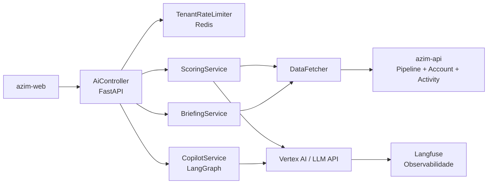

# Module — AI Intelligence

**Status:** Rascunho para revisão
**Fase:** Fase 3

---

## 1. Visão Geral

Microservice de Fase 3 em Python/FastAPI/LangGraph responsável por scoring de oportunidades, resumo 360° de contas, sugestão de próxima ação (next best action) e copilot conversacional. Isolado por tenant para rate-limit e controle de custo. Monitora execuções de LLM via Langfuse.

---

## 2. Classificação

| Item | Valor |
|---|---|
| Tipo de Módulo | Microservice |
| Deployable Candidato | azim-ai-service (Python / FastAPI, Cloud Run) |
| Bounded Context Relacionado | AI Intelligence (BC-11) |
| Subdomínio DDD | Supporting Subdomain |
| Tier / Criticidade | Tier 3 (Fase 3) — não crítico no MVP; diferencial futuro |
| Status | Rascunho para revisão |

---

## 3. Objetivo

Adicionar inteligência artificial ao CRM: scoring de probabilidade de fechamento, resumo executivo de conta (360°), sugestão de próxima ação para oportunidades paradas e copilot conversacional para gestores. Isolamento por tenant para controle de custo e rate-limit.

---

## 4. Responsabilidades

- Calcular scoring de oportunidades com base em dados do pipeline e histórico de atividades.
- Gerar resumo 360° de conta combinando dados do pipeline e atividades.
- Sugerir próxima ação para oportunidades estagnadas.
- Prover copilot conversacional para gestores (interface via azim-web).
- Aplicar rate-limit por tenant via Redis para controle de custo.
- Monitorar execuções de LLM via Langfuse.
- Isolar dados por tenant para não cruzar informações entre tenants.

---

## 5. Fora de Escopo

- Escrita em entidades de negócio do CRM (somente leitura).
- Substituição de funcionalidades do pipeline pelo scoring (scoring é sugestivo, não definitivo).
- Treinamento de modelos próprios (MVP usa LLM via Vertex AI ou API de terceiro).
- Fase 1 e Fase 2 — módulo exclusivo da Fase 3.

---

## 6. Capacidades Atendidas

| Código | Capability | Descrição |
|---|---|---|
| CAP-12 | Inteligência Artificial | Scoring, resumo 360°, próxima ação, copilot (Fase 3) |

---

## 7. Bounded Context e Linguagem Ubíqua

| Termo | Definição |
|---|---|
| scoring | Probabilidade de fechamento calculada por IA para uma oportunidade |
| briefing | Resumo executivo de uma conta gerado por IA com base em pipeline e atividades |
| next best action | Sugestão de próxima ação para oportunidade estagnada ou em risco |
| copilot | Interface conversacional para gestores fazerem perguntas ao CRM |
| Langfuse | Ferramenta de observabilidade e monitoramento de execuções de LLM |
| rate-limit por tenant | Limite de chamadas de IA por tenant para controle de custo |

---

## 8. Componentes Internos Candidatos

| Componente | Tipo | Responsabilidade |
|---|---|---|
| ScoringService | Domain Service | Calcula scoring de oportunidade via LLM |
| BriefingService | Domain Service | Gera resumo 360° de conta via LLM |
| NextActionService | Domain Service | Sugere próxima ação via LLM |
| CopilotService | Domain Service | Processa perguntas conversacionais via LangGraph |
| TenantRateLimiter | Adapter | Rate-limit por tenant via Redis |
| LangfuseObserver | Adapter | Registra execuções de LLM no Langfuse |
| AiController | API Controller | Endpoints de scoring, briefing, next action e copilot |
| DataFetcher | Adapter | Lê dados de oportunidades, contas e atividades do azim-api |

---

## 9. APIs Principais

| Método | Endpoint | Finalidade | Consumidores |
|---|---|---|---|
| POST | /v1/ai/opportunities/{id}/scoring | Calcular scoring de oportunidade | azim-web |
| POST | /v1/ai/accounts/{id}/briefing | Gerar resumo 360° de conta | azim-web |
| POST | /v1/ai/opportunities/{id}/next-action | Sugerir próxima ação | azim-web |
| POST | /v1/ai/copilot | Processar pergunta conversacional | azim-web |

---

## 10. Eventos Publicados

| Evento | Quando é publicado | Consumidores |
|---|---|---|
| ScoringCompleted | Após cálculo de scoring | audit-log |

---

## 11. Eventos Consumidos

Este módulo não consome eventos diretamente. Lê dados sob demanda via API do azim-api.

---

## 12. Dados Próprios

| Entidade/Tabela | Tipo | Banco/Persistência | Observações |
|---|---|---|---|
| scoring_results | Cache/Log | A definir (Fase 3) | Cache de scoring por oportunidade com TTL |
| briefings | Cache/Log | A definir (Fase 3) | Cache de briefings por conta com TTL |

---

## 13. Integrações

| Sistema/Módulo | Tipo de Integração | Direção | Observações |
|---|---|---|---|
| opportunity-pipeline | API HTTP | Entrada | Lê dados de oportunidades para scoring (sem escrita) |
| account-management | API HTTP | Entrada | Lê account_360_data para briefing |
| activity-management | API HTTP | Entrada | Lê histórico de atividades |
| Vertex AI / LLM API | API HTTP | Saída | Execuções de LLM para scoring, briefing e copilot |
| Langfuse | API HTTP | Saída | Monitoramento de execuções de LLM |
| Redis / Memorystore | Cache | Saída | Rate-limit por tenant e cache de resultados |

---

## 14. Dependências

### 14.1 Dependências de Domínio

- opportunity-pipeline: dados de oportunidades para scoring.
- account-management: dados de conta para briefing.
- activity-management: histórico de atividades.

### 14.2 Dependências Técnicas

- Python 3.12+ / FastAPI / LangGraph
- Vertex AI ou API de LLM (GPT, Claude — a definir)
- Langfuse (observabilidade de LLM)
- Redis / Memorystore (rate-limit e cache)
- Cloud Run (azim-ai-service)

### 14.3 Dependências Operacionais

- API Key do provedor de LLM via GCP Secret Manager
- Configuração de rate-limit por tenant (tokens/minuto ou chamadas/dia)
- Langfuse self-hosted ou cloud (a definir)

---

## 15. Requisitos Não Funcionais Relevantes

| Categoria | Requisito / Observação |
|---|---|
| Custo | Rate-limit por tenant obrigatório para controle de custo de LLM |
| Segurança | Isolamento de dados por tenant — dados de um tenant não devem vazar para prompt de outro |
| Observabilidade | Langfuse para monitoramento de execuções, latência e custo por tenant |
| Privacidade | Dados de contatos (PII) não devem ser enviados ao LLM sem consentimento explícito |

---

## 16. Compliance Aplicável

| Compliance / Norma / Lei | Aplicável? | Motivo | Impacto no Módulo |
|---|---|---|---|
| LGPD | Sim (relevante) | Dados de oportunidades e contas (incluindo referências a contatos) enviados ao LLM | Minimizar dados enviados ao LLM; não enviar PII direta sem base legal; avaliar DPA com provedor de LLM |
| PCI DSS | Não aplicável | Não processa dados de cartão | — |

---

## 17. Observabilidade

| Item | Recomendação Inicial |
|---|---|
| Logs | Log por execução de LLM: correlation_id, tenant_id, tipo (scoring/briefing/copilot), latência, tokens usados |
| Métricas | ai_requests_total, ai_tokens_used_total por tenant, ai_latency_seconds |
| Traces | Trace LangGraph por execução de pipeline de LLM via Langfuse |
| Alertas | Alerta se custo estimado de tokens exceder limite por tenant |

---

## 18. Diagramas do Módulo

### 18.1 Diagrama de Componentes

---

## 19. Riscos

| Código | Risco | Impacto | Mitigação |
|---|---|---|---|
| RISK-AI-01 | Custo de LLM não controlado | Custo elevado sem rate-limit | TenantRateLimiter obrigatório; alerta de custo |
| RISK-AI-02 | PII de contatos enviada ao LLM sem controle | Risco LGPD e de privacidade | Minimizar dados enviados; não enviar nome/email direto; avaliar DPA |
| RISK-AI-03 | Vazamento de dados entre tenants via prompt injection | Risco de confidencialidade | Isolamento rigoroso de contexto por tenant em todo o pipeline LangGraph |

---

## 20. Pontos a Validar

| Código | Ponto | Impacto | Recomendação |
|---|---|---|---|
| VAL-AI-01 | Provedor de LLM: Vertex AI (Gemini) vs OpenAI vs Anthropic | Define custo, latência e DPA | Avaliar na Fase 3 com base em custo e contrato de dados |
| VAL-AI-02 | DPA com provedor de LLM para dados de clientes (LGPD) | Obrigação regulatória | Definir com jurídico antes de enviar qualquer dado ao LLM |
| VAL-AI-03 | Langfuse self-hosted vs cloud | Define custo operacional e controle de dados | Avaliar na Fase 3 |

---

## 21. Backlog Inicial Sugerido (Fase 3)

| Tipo | Item | Descrição |
|---|---|---|
| Epic | Inteligência Artificial no CRM | Scoring, briefing, next action e copilot |
| Story Técnica | Scoring de oportunidade via LLM | ScoringService com dados do pipeline |
| Story Técnica | Briefing 360° de conta via LLM | BriefingService com dados de conta e atividades |
| Story Técnica | TenantRateLimiter via Redis | Rate-limit por tenant em tokens/minuto |
| Story Técnica | CopilotService com LangGraph | Pipeline conversacional com isolamento por tenant |
| Task | Configurar Langfuse para observabilidade de LLM | Monitoramento de execuções, latência e custo |

---

## 22. Referências

| Documento | Seção |
|---|---|
| DDD Segmentation | §4.1 BC-11 AI Intelligence |
| DDD Segmentation | §7 Deployables — azim-ai-service |
| DDD Segmentation | §9 Módulos — MOD-13 |
| Context Map | relations.md — AI Intelligence → Pipeline, Account, Activity |
