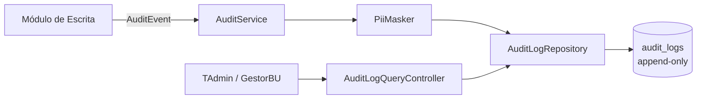
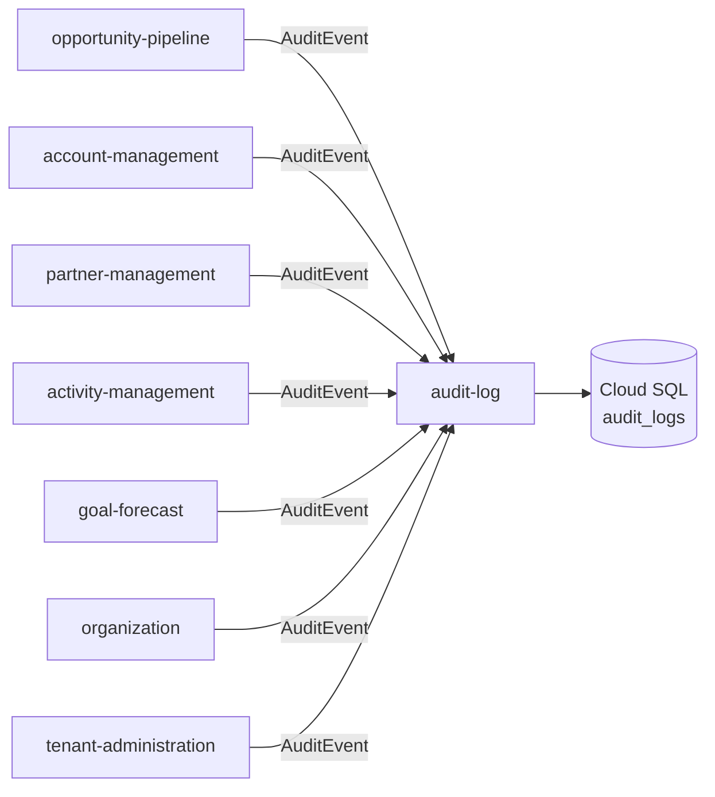
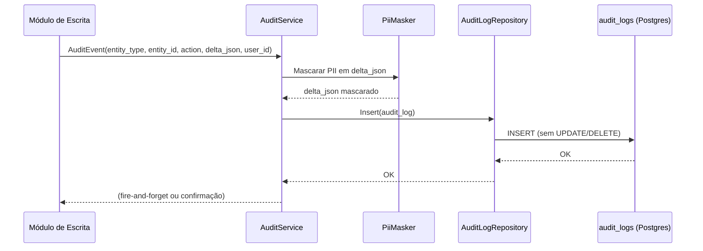

# Module — Audit Log

**Status:** Implementado
**Fase:** Fase 1 MVP
**Versão requirements.md:** 0.1.0
**Versão design.md:** 0.1.0
**Versão tasks.md:** 0.2.0
**Ondas concluídas:** 6 de 6 (Onda 1 Bootstrap · Onda 2 Domínio · Onda 3 Application · Onda 4 Infrastructure · Onda 5 API + Contratos · Onda 6 Hardening)
**TASKs:** 20 de 20 concluídas (TASK-01..TASK-20)
**PBTs cobertos:** 6 de 6 (PBT-01..PBT-06)
**Testes:** 308 verdes (Domain 95 · Application 117 · Architecture 12 · Infrastructure 36 · Api 51) — excluindo Infrastructure.Tests dependentes de Testcontainers em CI sem Docker
**Commit final Onda 6:** `96425b6` (feat: PII scan em CI e testes de segurança)

---

## 1. Visão Geral

Módulo cross-cutting responsável por registrar de forma imutável (append-only) toda escrita em entidade de negócio ocorrida em qualquer bounded context do Azim CRM. Não possui lógica de domínio própria; atua como receptor passivo de AuditEvents publicados pelos módulos de escrita.

---

## 2. Classificação

| Item | Valor |
|---|---|
| Tipo de Módulo | Application Module (cross-cutting) |
| Deployable Candidato | azim-api |
| Bounded Context Relacionado | Audit Log (BC-15) |
| Subdomínio DDD | Generic Subdomain |
| Tier / Criticidade | Tier 1 — imutabilidade é requisito de produto (RN-024) e de compliance LGPD |
| Status | Implementado |

---

## 3. Objetivo

Prover uma trilha de auditoria imutável e consultável por Tenant Admin e Gestor de BU. Garantir que toda alteração em entidade de negócio seja rastreável com: quem fez, o quê, quando e qual foi o delta — sem que dados pessoais (PII) apareçam em texto claro no log (RN-025).

---

## 4. Responsabilidades

- Receber e persistir AuditEvents de todos os módulos de escrita via AuditService centralizado.
- Garantir append-only: sem UPDATE, sem DELETE na tabela `audit_logs`.
- Mascarar PII no campo `delta_json` antes da persistência (RN-025).
- Expor API de consulta de trilha de auditoria com filtros por `entity_type`, `entity_id`, `user_id` e período — restrita a papéis TAdmin e GestorBU.
- Garantir isolamento por `tenant_id` via RLS.

---

## 5. Fora de Escopo

- Lógica de domínio própria (regras de negócio do CRM).
- Escrita por outros módulos diretamente na tabela `audit_logs` (somente via AuditService).
- Relatórios analíticos derivados de audit_logs (pertencem ao módulo reporting).
- Política de retenção de dados (a ser definida com jurídico — VAL-MOD-05).

---

## 6. Capacidades Atendidas

| Código | Capability | Descrição |
|---|---|---|
| CAP-17 | Trilha de Auditoria | Registro imutável de toda escrita em entidade de negócio |

---

## 7. Bounded Context e Linguagem Ubíqua

| Termo | Definição |
|---|---|
| AuditLog | Registro imutável de uma operação de escrita em entidade de negócio |
| AuditEvent | Evento publicado por um módulo de escrita para o AuditService |
| delta_json | JSONB com o diff da entidade antes e depois da operação; PII mascarada |
| entity_type | Nome da entidade auditada (ex: Opportunity, Account, Contact) |
| append-only | Política de inserção sem UPDATE nem DELETE garantida por constraint ou policy |

---

## 8. Componentes Internos Candidatos

| Componente | Tipo | Responsabilidade |
|---|---|---|
| AuditService | Domain Service | Recebe AuditEvent, mascara PII e persiste em audit_logs |
| AuditLogRepository | Repository | INSERT append-only na tabela audit_logs; sem UPDATE/DELETE |
| PiiMasker | Domain Service | Mascara campos PII (nome, e-mail, telefone) no delta_json |
| AuditLogQueryController | API Controller | Expõe endpoint de consulta de trilha — restrito a TAdmin/GestorBU |

---

## 9. APIs Principais

| Método | Endpoint | Finalidade | Consumidores |
|---|---|---|---|
| GET | /v1/audit-logs | Lista eventos de auditoria com filtros de período, entidade e usuário | Tenant Admin, Gestor de BU |
| GET | /v1/audit-logs/{entityType}/{entityId} | Histórico de auditoria de uma entidade específica | Tenant Admin, Gestor de BU |

---

## 10. Eventos Publicados

Este módulo não publica eventos de domínio próprios.

---

## 11. Eventos Consumidos

| Evento | Produtor | Finalidade |
|---|---|---|
| AuditEvent (toda escrita) | Todos os módulos de escrita (opportunity-pipeline, account-management, partner-management, activity-management, goal-forecast, organization, tenant-administration) | Persistência imutável na tabela audit_logs |

---

## 12. Dados Próprios

| Entidade/Tabela | Tipo | Banco/Persistência | Observações |
|---|---|---|---|
| audit_logs | Imutável (append-only) | Cloud SQL / Postgres | Sem UPDATE/DELETE; RLS por tenant_id; delta_json com PII mascarada (RN-025) |

---

## 13. Integrações

| Sistema/Módulo | Tipo de Integração | Direção | Observações |
|---|---|---|---|
| Todos os módulos de escrita | Package (AuditService injetado) | Entrada | AuditService é injetado como dependência nos casos de uso de escrita |

---

## 14. Dependências

### 14.1 Dependências de Domínio

- Nenhum bounded context de domínio — é consumidor passivo.

### 14.2 Dependências Técnicas

- Cloud SQL / Postgres (append-only via policy ou constraint de aplicação)
- RLS por tenant_id (configurado na camada de banco)

### 14.3 Dependências Operacionais

- Política de retenção de audit_logs a ser definida com jurídico (VAL-MOD-05 / VAL-08 do data model)
- Permissões de banco: somente INSERT para o role de aplicação na tabela audit_logs

---

## 15. Requisitos Não Funcionais Relevantes

| Categoria | Requisito / Observação |
|---|---|
| Segurança | Append-only garantido por design; sem UPDATE/DELETE no role da aplicação |
| Privacidade | PII mascarada em delta_json antes da persistência (RN-025, LGPD) |
| Auditabilidade | Toda escrita em entidade de negócio deve gerar entrada em audit_logs (RN-024) |
| Performance | INSERT de auditoria não deve bloquear o caso de uso principal — considerar INSERT assíncrono em background |
| Observabilidade | Logs de falha de auditoria devem gerar alerta — perda silenciosa é inaceitável |
| Compliance | LGPD: delta_json não pode conter PII em texto claro; política de retenção a definir |

---

## 16. Compliance Aplicável

| Compliance / Norma / Lei | Aplicável? | Motivo | Impacto no Módulo |
|---|---|---|---|
| LGPD | Sim | audit_logs armazena delta_json de entidades que contêm PII (contacts, users) | Mascaramento obrigatório de PII antes da persistência; política de retenção obrigatória |
| PCI DSS | Não aplicável | Azim CRM não processa dados de cartão | — |
| SOX / Auditoria Financeira | Ponto a Validar | Dados de comissão imutáveis podem ser relevantes em auditoria financeira futura | Avaliar com jurídico se comissão_snapshot exige retenção SOX |

---

## 17. Observabilidade

| Item | Implementado |
|---|---|
| Logs | Logs estruturados com correlation_id, entity_type, entity_id, action; sem PII, sem delta_json |
| Métricas (5) | `audit_events_received_total` · `audit_insert_failures_total` · `audit_query_without_tenant_context_total` · `audit_insert_latency_seconds` (histogram) · `audit_pii_masking_applied_total` |
| Traces | `ActivitySource("AuditLog.AuditService")` com span `AuditService.Record`; tags `audit.entity_type` e `audit.action` (sem PII) |
| Alertas (3) | `audit-insert-failure` (CRITICAL) · `audit-query-without-tenant` (HIGH) · `audit-insert-latency-slo` (WARNING); definições em `observability/alerts.yaml` |
| Health Check | `AuditInsertCapabilityHealthCheck`: Healthy (banco + INSERT ok) · Unhealthy (banco inacessível) · Degraded (banco ok, sem permissão de INSERT); endpoint `/health` |
| PII scan | `scripts/pii-scan.sh` detecta e-mail (RFC 5322) e telefone BR; gate no CI (`audit-log-pii-scan` em staging.yml) |

---

## 18. Diagramas do Módulo

### 18.1 Diagrama de Componentes Internos

### 18.2 Diagrama de Dependências

### 18.3 Diagrama de Fluxo Principal

---

## 19. Riscos

| Código | Risco | Impacto | Mitigação |
|---|---|---|---|
| RISK-AUDIT-01 | Falha silenciosa no INSERT de auditoria | Perda de trilha de auditoria — violação de RN-024 e LGPD | Alerta em audit_insert_failures_total; retry com dead-letter |
| RISK-AUDIT-02 | PII vazada em delta_json sem mascaramento | Violação de LGPD e RN-025 | PiiMasker obrigatório no AuditService antes do INSERT; teste de regressão |
| RISK-AUDIT-03 | Crescimento não controlado da tabela audit_logs | Custo e performance | Política de retenção e arquivamento a definir (VAL-MOD-05) |

---

## 20. Pontos a Validar

| Código | Ponto | Impacto | Recomendação |
|---|---|---|---|
| VAL-AUDIT-01 | Política de retenção de audit_logs sob LGPD (VAL-08 do data model) | Define obrigação de descarte e arquivamento | Definir com jurídico antes do go-live |
| VAL-AUDIT-02 | INSERT de auditoria síncrono vs assíncrono (impacto em latência) | Performance dos casos de uso principais | Preferir INSERT em background com garantia de entrega; avaliar Outbox Pattern |
| VAL-AUDIT-03 | Confirmar se comissão_snapshot requer retenção SOX | Define obrigação regulatória adicional | Avaliar com jurídico |

---

## 21. Backlog Inicial Sugerido

| Tipo | Item | Descrição |
|---|---|---|
| Epic | Trilha de Auditoria Imutável | Implementar AuditService, PiiMasker e tabela audit_logs append-only |
| Story Técnica | AuditService com injeção de dependência | Implementar AuditService injetável nos casos de uso de escrita |
| Story Técnica | PiiMasker configurável por entity_type | Campos PII mascaráveis configurados por entidade |
| Story Técnica | API de consulta de trilha de auditoria | GET /v1/audit-logs com filtros e paginação — restrita a TAdmin/GestorBU |
| Task | Constraint de banco: apenas INSERT em audit_logs | Revogar UPDATE/DELETE para o role da aplicação |
| Task | Alerta Cloud Monitoring para audit_insert_failures | Configurar alerta com threshold zero de falhas |

---

## 22. Referências

| Documento | Seção |
|---|---|
| DDD Segmentation | §6 Data Ownership Summary — Audit Log |
| DDD Segmentation | §9 Módulos Funcionais — (cross-cutting) |
| Data Model | §3 Audit Log (BC-15) |
| NFRD | §8 Auditabilidade (NFR-AUD) |
| DDD Segmentation | §8 Context Map — Published Language para todos os BCs |
