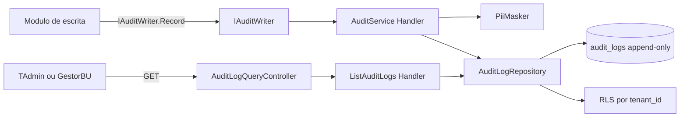
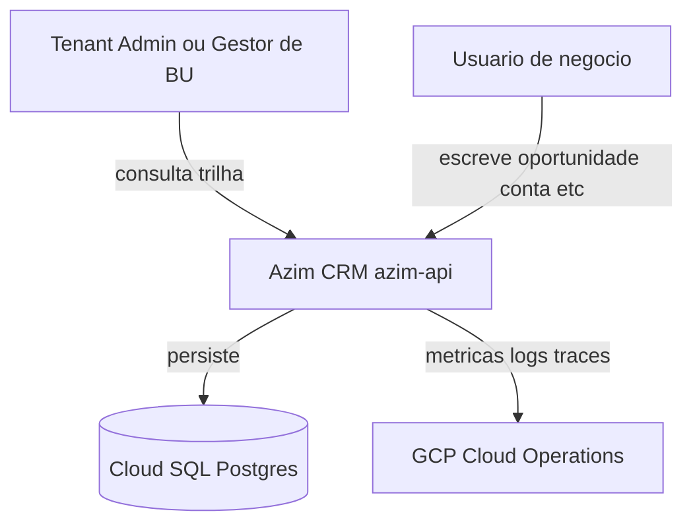
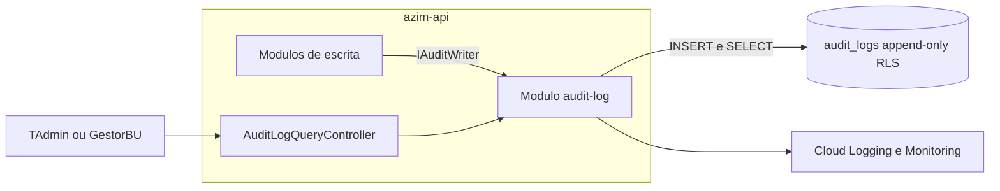
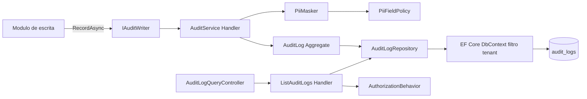
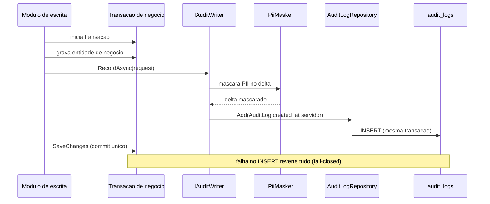
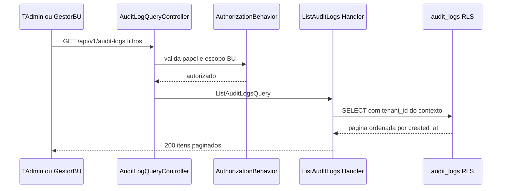
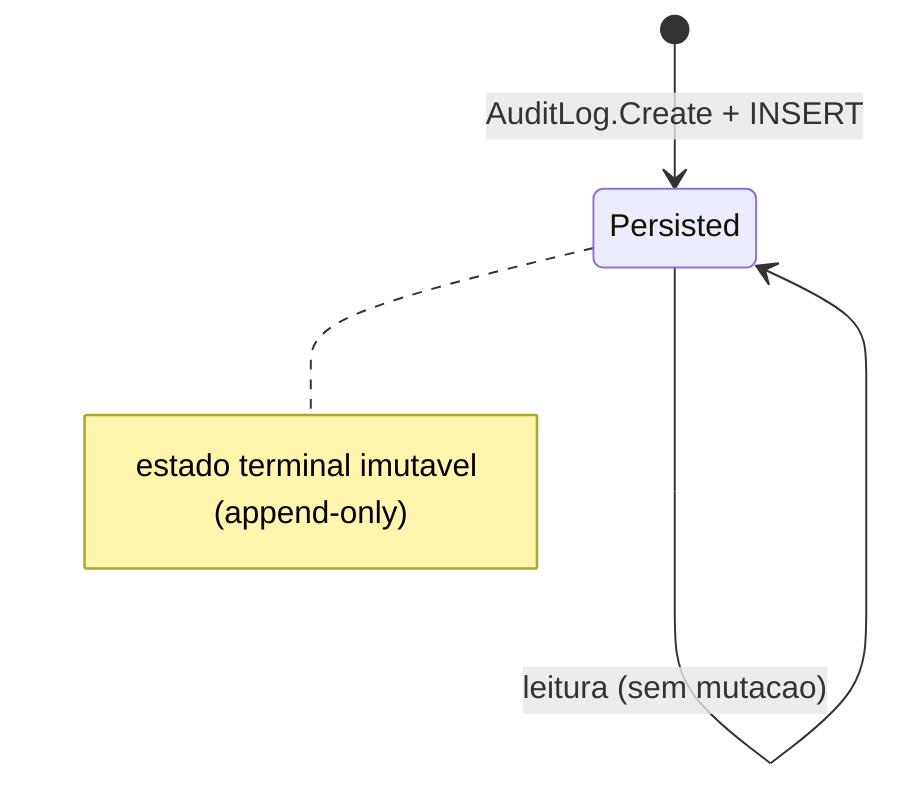

# AUD — Audit Log
**Design Técnico**

- Versão: 0.1.0
- Data: 2026-06-11
- Status: Rascunho para revisão
- Referência base: docs/product/modules/audit-log/requirements.md v0.1.0
- ADRs aplicáveis: ADR-0003 (política de retenção de logs e auditoria, a definir); ADR-0007 (stack de observabilidade GCP, a formalizar — VAL-TRD-07)
- Rules aplicáveis: `.forge/rules/domain/audit-immutability.md`, `.forge/rules/domain/money-as-cents.md`, `.forge/rules/architecture/clean-architecture.md`, `.forge/rules/architecture/security-and-compliance.md`, `.forge/rules/architecture/observability.md`, `.forge/rules/architecture/ddd.md`, `.forge/rules/conventions/database-naming.md`, `.forge/rules/conventions/document-versioning.md`

## Histórico de Versões

| Versão | Data | Status | Descrição da alteração |
|--------|------|--------|------------------------|
| 0.1.0 | 2026-06-11 | Rascunho para revisão | Criação inicial do design a partir do requirements.md v0.1.0 (REQ-001..008, RNF-001..006, PBT-01..06), TRD (§7.2, §9, §10, §13, §14), data model (BC-15) e rules de domínio/arquitetura. Resolve VAL-AUDIT-02 (síncrono vs assíncrono) via DD-001. |

## 1. Visão Geral

O módulo **Audit Log** (BC-15, subdomínio Genérico, deployable `azim-api`) é responsável por registrar de forma **imutável** e **append-only** toda operação de escrita (`create`, `update`, `delete`) em entidade de negócio do Azim CRM, sem expor PII em texto claro, e por expor uma API **somente-leitura** de consulta da trilha, restrita a papéis administrativos.

O módulo não possui regra de negócio do CRM. Atua como **componente cross-cutting** consumido pelos demais módulos de escrita por meio de uma porta de aplicação (`IAuditWriter`), que internamente aplica mascaramento de PII e persiste o registro de auditoria na mesma transação da escrita de negócio (DD-001).

Este design traduz os requisitos do `requirements.md` v0.1.0 nas seguintes garantias técnicas:

- Cobertura de 100% (REQ-001) por meio de persistência **síncrona transacional fail-closed** (DD-001), eliminando janelas de perda silenciosa.
- Imutabilidade garantida no banco (RNF-001) por **REVOKE + trigger BEFORE UPDATE/DELETE/TRUNCATE** (DD-002), conforme `.forge/rules/domain/audit-immutability.md`.
- Isolamento por tenant (REQ-005) via **Row-Level Security** (DD-003).
- Mascaramento de PII (REQ-004) centralizado no `PiiMasker`, configurável por `entity_type` (DD-004).
- Observabilidade sem perda silenciosa (RNF-004) com contadores e alerta de falha, mais alerta de consulta sem contexto de tenant (DD-007).

### 1.1 Rastreabilidade requisito → design

| Requisito | Elemento de design | Seções |
|---|---|---|
| REQ-001 Registrar toda escrita | `IAuditWriter` + `RecordAuditEntryCommand` + INSERT transacional fail-closed | 5.1, 6.1, DD-001 |
| REQ-002 Conteúdo mínimo | Entidade `AuditLog` + objetos de valor + schema `audit_logs` | 4.1, 4.3, 7 |
| REQ-003 Delta antes/depois | Objeto de valor `AuditDelta` + serialização `delta_json` | 4.3, 7, DD-005 |
| REQ-004 Mascaramento de PII | Serviço de domínio `PiiMasker` + `PiiFieldPolicy` | 4.6, 6.4, DD-004 |
| REQ-005 Isolamento por tenant | RLS + filtro global + `tenant_id` NOT NULL | 7, 10, 14, DD-003 |
| REQ-006 Recepção centralizada | `IAuditWriter` (porta) + `AuditService` (handler) | 3, 5.1, 5.3, DD-006 |
| REQ-007 Consulta somente-leitura | `ListAuditLogsQuery` + `GetEntityAuditHistoryQuery` + API GET | 5.2, 8 |
| REQ-008 Restrição por papel/escopo | Authorization behavior + RBAC + RLS por BU | 5.4, 8, 10, DD-008 |
| RNF-001 Append-only no banco | REVOKE + trigger | 7, 13, DD-002 |
| RNF-002 Sem PII em logs | Serilog destructuring + política de logging | 11, DD-004 |
| RNF-003 Não bloqueio | INSERT transacional leve; SLO p95 ≤ 500 ms | 15, DD-001 |
| RNF-004 Alerta de falha | Contadores + alerta + dead-letter degradado | 11, 12, DD-001 |
| RNF-005 Retenção sem purge | Sem job de purge; sem DELETE no role `app` | 7, 13, DD-002 |
| RNF-006 Health check | `AuditInsertCapabilityHealthCheck` | 11 |
| PBT-01..06 | Testes de propriedade | 13 |

## 2. Princípios e Decisões Macro

1. **Append-only enforced no banco, não na aplicação** — o banco é a última linha de defesa (DD-002).
2. **Persistência síncrona transacional, não fire-and-forget** — a auditoria participa da transação da escrita de negócio; falha de auditoria aborta a operação de negócio (fail-closed), garantindo REQ-001 sem janela de perda (DD-001). Esta decisão **substitui** a recomendação preliminar de fire-and-forget do README do módulo.
3. **Centralização obrigatória** — nenhuma escrita direta em `audit_logs`; toda inserção passa por `IAuditWriter` → `AuditService` (REQ-006, DD-006).
4. **PII nunca em texto claro** — mascaramento aplicado antes da serialização do `delta_json` e antes de qualquer log/trace (REQ-004, RNF-002).
5. **Isolamento por tenant defense-in-depth** — RLS no banco + filtro global no `DbContext` + validação de escopo de aplicação (REQ-005, RNF de segurança).
6. **Money como centavos inteiros** — valores monetários no `delta_json` são `BIGINT`/inteiro em centavos; proibido ponto flutuante (DD-005, `.forge/rules/domain/money-as-cents.md`).
7. **Clean Architecture com 5 projetos .NET** — a regra de dependência é enforçada pelo compilador (seção 3).
8. **Sem eventos de domínio próprios** — o módulo é consumidor passivo; não publica eventos (escopo do `requirements.md` § 2.2).

## 3. Estrutura da Solução

O módulo segue Clean Architecture com 5 projetos .NET, conforme `.forge/rules/architecture/clean-architecture.md`.

```text
AuditLog.Domain          -> entidade AuditLog, objetos de valor, IAuditLogRepository, PiiMasker, exceções de domínio
AuditLog.Application     -> RecordAuditEntryCommand/Handler, queries de consulta, behaviors, validadores
AuditLog.Infrastructure  -> EF Core, AuditLogRepository (INSERT-only), RLS context, configuração de PiiFieldPolicy
AuditLog.Api             -> AuditLogQueryController (GET somente-leitura), DI, health checks
AuditLog.Contracts       -> IAuditWriter, AuditEntryRequest, AuditLogResponse, AuditAction (contrato público consumido por outros módulos)
```

Projetos de teste:

```text
AuditLog.Domain.Tests
AuditLog.Application.Tests
AuditLog.Infrastructure.Tests   -> Testcontainers (PostgreSQL real) para trigger/RLS/append-only
AuditLog.Api.Tests
AuditLog.Architecture.Tests     -> valida regra de dependência (NetArchTest)
```

Regra de dependência (inviolável):

```text
Api -> Application, Infrastructure (apenas DI)
Application -> Domain, Contracts
Infrastructure -> Application, Domain
Domain -> nenhum projeto interno
Contracts -> nenhum projeto interno
```

### 3.1 Visão de componentes



O `IAuditWriter` vive em `AuditLog.Contracts` e é a única superfície que os módulos de escrita conhecem (DD-006). A implementação concreta (`AuditService` como handler) e o repositório vivem dentro do módulo audit-log.

## 4. Modelo de Domínio

O subdomínio é Genérico e anêmico por natureza (sem regra de negócio do CRM). As invariantes do domínio são de **integridade de registro de auditoria**, não de negócio.

### 4.1 Aggregates

| Aggregate Root | Invariantes protegidas |
|---|---|
| `AuditLog` | `tenant_id`, `user_id`, `entity_type`, `entity_id`, `action`, `delta` e `created_at` obrigatórios e não vazios; `created_at` definido pelo servidor; sem mutação após criação; PII já mascarada no delta. |

`AuditLog` é o único aggregate. É criado via factory e nunca modificado (append-only no nível do domínio também).

```text
AuditLog.Create(tenantId, userId, entityType, entityId, action, maskedDelta, clock) : AuditLog
AuditLog.Reconstitute(...) : AuditLog   // somente leitura, a partir do banco
```

Não há método de mutação pública. Não existe `Update`, `Delete`, setter público nem `updated_at` (REQ-002.5).

### 4.2 Entidades

| Entidade | Identidade | Observação |
|---|---|---|
| `AuditLog` | `AuditLogId` (UUID) | Aggregate root; imutável após criação. |

Não há entidades-filhas. O delta é um objeto de valor embutido.

### 4.3 Objetos de valor

| Objeto de valor | Atributos | Regras |
|---|---|---|
| `AuditLogId` | `Guid value` | Identidade; igualdade por valor. |
| `TenantId` | `Guid value` | Não vazio; chave de RLS. |
| `ActorId` (`user_id`) | `Guid value` | Não vazio; autor humano ou de sistema (REQ-002.2). |
| `EntityReference` | `entity_type` (string ≤ 50), `entity_id` (Guid) | `entity_type` não vazio; extensível sem mudança estrutural. |
| `AuditAction` | enum lógico: `Create`, `Update`, `Delete` | Apenas valores canônicos (REQ-002.3); serializado como `create`/`update`/`delete`. |
| `AuditDelta` | documento estruturado antes/depois | Imutável; já mascarado; money em centavos inteiros (DD-005); serializa para `delta_json`. |

Todos os objetos de valor são imutáveis e implementam igualdade por valor (`.forge/rules/architecture/ddd.md`). Valores monetários dentro de `AuditDelta` são inteiros em centavos; proibido `float`/`double` (DD-005).

Estrutura conceitual de `AuditDelta`:

```text
create -> { "after": { campo: valor, ... } }                  // sem "before"
update -> { campo: { "before": v1, "after": v2 }, ... }        // só campos alterados
delete -> { "before": { campo: valor, ... } }                  // sem "after"
```

Campos de PII aparecem com marcador de mascaramento preservando a presença da alteração (REQ-004.4), por exemplo `{ "before": "[MASKED]", "after": "[MASKED]" }`.

### 4.4 Domain Events

Não aplicável nesta versão. O módulo não publica eventos de domínio (requirements § 2.2). Ele é **consumidor** lógico de AuditEvent, transportado de forma in-process via `IAuditWriter` (DD-006), não via barramento.

### 4.5 State Machines

Não aplicável nesta versão. `AuditLog` tem um único estado terminal (`Persisted`); não há transições. A imutabilidade torna a máquina de estados trivial.

### 4.6 Policies / Specifications

| Elemento | Tipo | Responsabilidade |
|---|---|---|
| `PiiMasker` | Serviço de domínio | Mascara campos PII no `AuditDelta` antes da construção do `AuditLog` (REQ-004). |
| `PiiFieldPolicy` | Specification/configuração | Define, por `entity_type`, quais campos são PII (ex.: `Contact` → `name`, `email`, `phone`). |
| `AppendOnlyInvariant` | Invariante | Garante ausência de operação de mutação no aggregate; reforçada no banco (DD-002). |

`PiiMasker` é serviço de domínio (sem dependência de infraestrutura); a fonte da `PiiFieldPolicy` é injetada pela infraestrutura (configuração), mantendo o domínio puro.

## 5. Application Layer

### 5.1 Commands

| Command | Origem | Descrição |
|---|---|---|
| `RecordAuditEntryCommand` | REQ-001, REQ-006 | Recebe os dados brutos do AuditEvent (entity_type, entity_id, action, delta bruto, user_id, tenant context), aplica `PiiMasker` e persiste `AuditLog` na transação corrente. Comando interno disparado pela implementação de `IAuditWriter`. |

`RecordAuditEntryCommand` é o único command de escrita. Não há command de update/delete (append-only, REQ-007.1).

Contrato de entrada (campos mínimos, REQ-006.4):

```text
RecordAuditEntryCommand {
  TenantId      (do contexto autenticado, não do chamador — REQ-005.3)
  ActorId       (user_id, não vazio)
  EntityType    (string)
  EntityId      (Guid)
  Action        (Create | Update | Delete)
  RawDelta      (delta bruto, antes do mascaramento)
}
```

### 5.2 Queries

| Query | Origem | Descrição |
|---|---|---|
| `ListAuditLogsQuery` | REQ-007 | Lista registros com filtros `entity_type`, `entity_id`, `user_id`, intervalo de `created_at`; paginada e ordenada por `created_at` desc. |
| `GetEntityAuditHistoryQuery` | REQ-007.3 | Histórico de uma entidade específica via `entity_type` + `entity_id`. |

Ambas são read-only e não alteram estado (REQ-007.5, PBT-06). O `tenant_id` nunca é parâmetro do chamador: vem do contexto autenticado e é aplicado por RLS (REQ-005.2).

### 5.3 Handlers

| Handler | Tipo | Caso de uso |
|---|---|---|
| `AuditService` (`RecordAuditEntryHandler`) | Command handler | Implementa a recepção centralizada: mascara PII (REQ-004), constrói `AuditLog` com `created_at` do servidor (REQ-002.4), persiste via repositório dentro da transação ambiente (DD-001). |
| `ListAuditLogsHandler` | Query handler | Consulta paginada com filtros; aplica escopo de BU para Gestor de BU (DD-008). |
| `GetEntityAuditHistoryHandler` | Query handler | Consulta por entidade. |

Um handler por caso de uso. Handlers orquestram; o mascaramento e as invariantes vivem no domínio.

### 5.4 Pipeline Behaviors

| Behavior | Aplica a | Responsabilidade |
|---|---|---|
| `ValidationBehavior` | Command/Queries | FluentValidation na borda (validação sintática). |
| `AuthorizationBehavior` | Queries | Verifica papel (TAdmin/GestorBU) e escopo de BU antes do handler (REQ-008). |
| `TenantContextBehavior` | Queries e Command | Garante presença de `tenant_id` no contexto; **bloqueia consulta sem contexto de tenant** e emite sinal de observabilidade (DD-007). |
| `LoggingBehavior` | Todos | Log estruturado sem PII (RNF-002), com `correlation_id`, `tenant_id`, `entity_type`, `entity_id`. |

O `RecordAuditEntryCommand` **não** passa por `AuthorizationBehavior` de consulta: é uma porta interna confiável invocada dentro de um caso de uso de escrita já autorizado pelo módulo de origem.

### 5.5 Validações de Aplicação

| Validação | Requisito | Onde |
|---|---|---|
| `action` ∈ {create, update, delete} | REQ-002.3 | `RecordAuditEntryCommandValidator` |
| `user_id` não vazio | REQ-002.2 | Validator + invariante de domínio |
| `entity_type` não vazio, ≤ 50 chars | REQ-002.1 | Validator |
| `created_at` não fornecido pelo chamador | REQ-002.4 | Comando não expõe o campo; setado pelo `IClock` |
| `tenant_id` derivado do contexto | REQ-005.3 | `TenantContextBehavior`; chamador não define |
| Filtros de período válidos (início ≤ fim) | REQ-007.2 | `ListAuditLogsQueryValidator` |
| Paginação (limite máximo de page size) | REQ-007.4 | `ListAuditLogsQueryValidator` |

## 6. Infrastructure Layer

### 6.1 Persistência

- **Banco:** Cloud SQL / PostgreSQL (TRD §7.2, §10), schema do módulo audit-log, tabela `audit_logs`.
- **ORM:** EF Core com `IEntityTypeConfiguration<AuditLog>`; mapeamento na infraestrutura (não no domínio).
- **Repositório:** `AuditLogRepository : IAuditLogRepository` expõe apenas `Add` (INSERT) e métodos de consulta. **Não** expõe `Update`/`Remove` (append-only no código). O `DbContext` marca a entidade sem operações de deleção (override em `OnModelCreating`).
- **Transação (DD-001):** o `Add` participa da **mesma transação/`DbContext`** da escrita de negócio do módulo de origem. Como `azim-api` é um deployable único com um banco Postgres, a auditoria e a entidade de negócio compartilham a unidade de trabalho. `SaveChanges` único → atomicidade real (REQ-001.2). Falha no INSERT de auditoria → rollback da escrita de negócio (fail-closed).
- **`created_at`:** `DEFAULT now()` no banco e/ou `IClock` do servidor; nunca recebido do chamador (REQ-002.4).

### 6.2 Cache

Não aplicável nesta versão. A trilha é append-only e consultada por papéis administrativos com baixa frequência; cache introduziria risco de inconsistência sem ganho relevante. Paginação e índices cobrem a performance de leitura (seção 15).

### 6.3 Mensageria

Não aplicável como caminho primário. A recepção do AuditEvent é **in-process** via `IAuditWriter` (DD-001/DD-006), não via Pub/Sub. Os tópicos Pub/Sub do TRD (`opportunity.*`, `activity.*`) existem para outros consumidores (reporting, digest); o audit-log **não** depende deles para cobertura, evitando dupla contabilização e janelas de perda. Ver DD-001 para a justificativa de não adotar consumo assíncrono de eventos.

### 6.4 Integrações Externas

Não há integração com sistema externo. A única "integração" é a `PiiFieldPolicy`, carregada de configuração versionada (por `entity_type`). A configuração é injetada na infraestrutura e consumida pelo `PiiMasker` do domínio (REQ-004.3).

### 6.5 Idempotência

No caminho síncrono transacional, cada escrita de negócio gera exatamente um `RecordAuditEntryCommand` na mesma transação (PBT-02). A idempotência é garantida pela **atomicidade**: se a transação reverte, nem a escrita de negócio nem o registro de auditoria persistem. Não há reprocessamento de mensagem (não há mensageria no caminho primário), logo não há risco de duplicidade por re-entrega.

Para o caminho degradado de dead-letter (RNF-004.3), cada item carrega uma `audit_idempotency_key` derivada de `(tenant_id, entity_type, entity_id, action, business_tx_id)` para deduplicação no reprocessamento.

### 6.6 Outbox / Inbox

Não aplicável ao caminho primário (a auditoria é gravada na própria transação de negócio, dispensando outbox para garantir entrega — DD-001). O `outbox_events` do TRD pertence à publicação de eventos de domínio de outros módulos e não é usado pela auditoria.

**Caminho degradado (resiliência, RNF-004.3):** caso uma futura evolução exija desacoplar a auditoria da transação de negócio, o padrão recomendado é **Transactional Outbox** reutilizando a infraestrutura existente, registrado aqui como evolução possível (ver Riscos). No MVP, o caminho primário é síncrono transacional.

## 7. Schema / Modelo de Persistência

Tabela `audit_logs` (BC-15), conforme data model § 3 e TRD §10.

| Coluna | Tipo | Nulo | Descrição |
|---|---|---|---|
| `id` | `UUID` PK `DEFAULT gen_random_uuid()` | não | Identidade do registro. |
| `tenant_id` | `UUID` | não | Chave de RLS; do contexto da operação (REQ-005.1). |
| `user_id` | `UUID` | não | Autor humano ou de sistema (REQ-002.2). |
| `entity_type` | `VARCHAR(50)` | não | Entidade auditada (ex.: `Opportunity`). |
| `entity_id` | `UUID` | não | Identidade da entidade auditada. |
| `action` | `VARCHAR(20)` | não | `create` \| `update` \| `delete` (REQ-002.3). |
| `delta_json` | `JSONB` | não | Diff antes/depois com PII mascarada (REQ-003, REQ-004). |
| `created_at` | `TIMESTAMPTZ` `DEFAULT now()` | não | Timestamp do servidor (REQ-002.4). |

Observações:

- **Sem `updated_at`** (REQ-002.5). **Sem coluna de soft-delete** (anti-pattern proibido pela rule).
- Constraint `CHECK (action IN ('create','update','delete'))`.
- Constraint `CHECK (char_length(entity_type) > 0)`.

### 7.1 Índices

| Índice | Colunas | Origem |
|---|---|---|
| PK | `(id)` | — |
| `ix_audit_logs_tenant_entity` | `(tenant_id, entity_type, entity_id)` | TRD §10.1 (obrigatório); REQ-007.3 |
| `ix_audit_logs_tenant_created` | `(tenant_id, created_at DESC)` | REQ-007.4 (ordenação/paginação por período) |
| `ix_audit_logs_tenant_user` | `(tenant_id, user_id)` | REQ-007.2 (filtro por autor) |

### 7.2 Imutabilidade e RLS (migration)

Conforme `.forge/rules/domain/audit-immutability.md`, a migration `migration_NNNN_create_immutable_audit_logs.sql` inclui obrigatoriamente:

```sql
-- 1. Função compartilhada (uma vez por banco)
CREATE OR REPLACE FUNCTION prevent_immutable_table_modification()
RETURNS TRIGGER AS $$
BEGIN
    RAISE EXCEPTION 'Tabela imutavel: operacao % proibida em %.%',
        TG_OP, TG_TABLE_SCHEMA, TG_TABLE_NAME;
END;
$$ LANGUAGE plpgsql;

-- 2. Trigger de imutabilidade
CREATE TRIGGER trg_audit_logs_immutable
BEFORE UPDATE OR DELETE OR TRUNCATE ON audit_logs
FOR EACH STATEMENT EXECUTE FUNCTION prevent_immutable_table_modification();

-- 3. REVOKE no role de aplicacao (sem UPDATE/DELETE/TRUNCATE) — RNF-001, RNF-005
REVOKE UPDATE, DELETE, TRUNCATE ON audit_logs FROM app;

-- 4. RLS por tenant_id — REQ-005, DD-003
ALTER TABLE audit_logs ENABLE ROW LEVEL SECURITY;
ALTER TABLE audit_logs FORCE ROW LEVEL SECURITY;
CREATE POLICY rls_audit_logs_tenant ON audit_logs
    USING (tenant_id = current_setting('app.tenant_id')::uuid);
```

O role `app` recebe apenas `INSERT, SELECT`. O DELETE para purge legal (futuro) fica restrito a `app_admin` separado, com aprovação dupla (RNF-005.3; fora do escopo do MVP).

### 7.3 Migrations e retenção

- **Migration:** padrão `migration_NNNN_create_immutable_audit_logs.sql` (numeração acima da última do schema).
- **Retenção:** indefinida no MVP; **sem job de purge** (RNF-005.1). Política sob LGPD pendente (ADR-0003 / VAL-AUDIT-01 / VAL-TRD-03), a definir com jurídico antes do go-live.
- **Particionamento:** não no MVP; avaliar particionamento por range de `created_at` quando o volume justificar (ver Riscos / seção 15).

## 8. API Contracts

API REST somente-leitura (REQ-007), exposta em `azim-api`. Autenticação JWT; autorização RBAC (REQ-008).

### 8.1 GET /api/v1/audit-logs

Lista a trilha com filtros.

- **Auth:** JWT obrigatório. Papéis: `TenantAdmin` (todo o tenant), `GestorBU` (apenas suas BUs).
- **Query params:** `entityType?`, `entityId?`, `userId?`, `from?` (ISO-8601), `to?` (ISO-8601), `page?` (default 1), `pageSize?` (default 50, máx 200).
- **Ordenação:** `created_at` desc.
- **200 OK:**

```json
{
  "items": [
    {
      "id": "uuid",
      "userId": "uuid",
      "entityType": "Opportunity",
      "entityId": "uuid",
      "action": "update",
      "delta": { "stage_id": { "before": "uuid-a", "after": "uuid-b" } },
      "createdAt": "2026-06-11T12:00:00Z"
    }
  ],
  "page": 1,
  "pageSize": 50,
  "total": 1
}
```

- **Erros:** `AUD-ERR-001` (400 filtro inválido), `AUD-ERR-002` (403 papel sem permissão), `AUD-ERR-003` (401 não autenticado), `AUD-ERR-006` (400 período inválido).

### 8.2 GET /api/v1/audit-logs/{entityType}/{entityId}

Histórico de auditoria de uma entidade específica (REQ-007.3).

- **Auth:** idêntica a 8.1.
- **Path params:** `entityType`, `entityId`.
- **Query params:** `from?`, `to?`, `page?`, `pageSize?`.
- **200 OK:** mesmo envelope de 8.1, filtrado pela entidade.
- **Erros:** `AUD-ERR-001`, `AUD-ERR-002`, `AUD-ERR-003`, `AUD-ERR-004` (404 entidade sem registros — opcional, ver catálogo).

Nenhum endpoint de escrita é exposto (REQ-007.1). Tentativas de `POST/PUT/PATCH/DELETE` retornam `405 Method Not Allowed`.

### 8.3 Porta interna de escrita (IAuditWriter)

Contrato in-process consumido pelos módulos de escrita (não é endpoint HTTP), em `AuditLog.Contracts` (DD-006):

```csharp
public interface IAuditWriter
{
    Task RecordAsync(AuditEntryRequest request, CancellationToken ct);
}

public sealed record AuditEntryRequest(
    Guid ActorId,
    string EntityType,
    Guid EntityId,
    AuditAction Action,
    IReadOnlyDictionary<string, object?> RawBefore,
    IReadOnlyDictionary<string, object?> RawAfter);
```

`TenantId` e `correlation_id` são resolvidos do contexto de execução, não passados pelo chamador (REQ-005.3).

## 9. AsyncAPI / Eventos Publicados e Consumidos

### 9.1 Eventos publicados

Não aplicável nesta versão. O módulo não publica eventos de domínio (requirements § 2.2).

### 9.2 Eventos consumidos

No caminho primário, o "AuditEvent" é um **comando in-process** (`IAuditWriter.RecordAsync`), não uma mensagem de barramento (DD-001). Por isso não há contrato AsyncAPI de consumo no MVP.

Para rastreabilidade, o AuditEntryRequest transporta logicamente: `entity_type`, `entity_id`, `action`, delta bruto (`RawBefore`/`RawAfter`), `actor_id` e — via contexto — `tenant_id` e `correlation_id` (REQ-006.4). `correlation_id` e `causation_id` (id da transação de negócio) acompanham o caso de uso para fins de trace.

## 10. Segurança

| Aspecto | Mecanismo | Requisito |
|---|---|---|
| Autenticação | JWT (Identity Platform / BC-12) obrigatório em todos os endpoints. | REQ-008 |
| Autorização (RBAC) | `AuthorizationBehavior` valida papel `TenantAdmin` ou `GestorBU`; demais papéis recebem `AUD-ERR-002` (403). | REQ-008.1, 008.4 |
| Escopo por BU | Gestor de BU: a consulta cruza `entity_id`/`tenant_id` com as BUs das quais é membro; registros fora do escopo de BU não são retornados (DD-008). | REQ-008.3 |
| Isolamento por tenant | RLS no banco (`current_setting('app.tenant_id')`) + filtro global no `DbContext` + `TenantContextBehavior`. Defense-in-depth de 3 camadas (TOBJ-02). | REQ-005, RNF |
| Anti-enumeração | `tenant_id` nunca aceito do chamador; erros de autorização não diferenciam "não existe" de "sem acesso" (resposta uniforme). | REQ-005.3, PBT-05 |
| Mascaramento de PII | `PiiMasker` antes da serialização do `delta_json`; PII irrecuperável após persistência. | REQ-004 |
| PII fora de logs/traces | Serilog destructuring configurado; logs só com `correlation_id`, `tenant_id`, `entity_type`, `entity_id`. | RNF-002 |
| Criptografia em trânsito | TLS em todos os endpoints; mTLS entre serviços internos quando aplicável (`.forge/rules/architecture/mtls-internal-services.md`). | NFR-SEG |
| Criptografia em repouso | Cloud SQL com encryption-at-rest gerenciada (GCP). | NFR-SEG |
| Privilégio mínimo no banco | Role `app`: apenas `INSERT, SELECT` em `audit_logs`; sem `UPDATE/DELETE/TRUNCATE`. | RNF-001, RNF-005 |
| Auditoria do acesso de suporte | Acesso autorizado de Platform Operator é, ele próprio, evento auditável (gera `AuditLog`). | REQ-008.5 |
| LGPD by design | Mascaramento obrigatório + retenção controlada (ADR-0003) + base legal documentada. | REQ-004, RNF-005 |

## 11. Observabilidade

Stack GCP (Cloud Logging/Monitoring/Trace, DEC-005), princípios de `.forge/rules/architecture/observability.md` (divergência de stack formalizada em VAL-TRD-07 / ADR-0007).

### 11.1 Logs

- Estruturados, sem PII (RNF-002.1): `correlation_id`, `tenant_id`, `entity_type`, `entity_id`, `action`, `outcome`.
- Serilog destructuring mascara qualquer campo PII (RNF-002.2). Scan de logs em CI detecta padrões de e-mail/telefone BR (gate).
- Mensagens de erro nunca expõem `delta_json` nem valores PII (RNF-002.3).
- Falhas de persistência de auditoria vão para sink/log separado (RNF-004.3).

### 11.2 Métricas

| Métrica | Tipo | Origem |
|---|---|---|
| `audit_events_received_total` | Counter | RNF-004.1 |
| `audit_insert_failures_total` | Counter | RNF-004.1 |
| `audit_insert_latency_seconds` | Histogram | RNF-003 (SLO) |
| `audit_query_without_tenant_context_total` | Counter | DD-007 (alerta de consulta sem contexto de tenant) |
| `audit_pii_masking_applied_total` | Counter | REQ-004 (evidência de mascaramento) |

### 11.3 Traces

- Span no `AuditService.Record` cobrindo mascaramento + INSERT (TRD §14), correlacionado por `correlation_id` ao caso de uso de negócio (TRD §14: trace obrigatório em criação/movimentação de oportunidade inclui gravação de auditoria).

### 11.4 Alertas

| Alerta | Condição | Origem |
|---|---|---|
| Falha de auditoria | `audit_insert_failures_total` > 0 em janela de 5 min | RNF-004.2 |
| Consulta sem contexto de tenant | `audit_query_without_tenant_context_total` > 0 | DD-007 |
| Latência de auditoria | p95 de `audit_insert_latency_seconds` acima do orçamento | RNF-003 |

### 11.5 Health checks

| Check | Verifica | Origem |
|---|---|---|
| `AuditInsertCapabilityHealthCheck` | Conectividade com Cloud SQL e permissão de `INSERT` em `audit_logs` (ex.: `INSERT` em transação revertida ou checagem de grant). | RNF-006.1, RNF-006.2 |

Ausência de qualquer condição → estado degradado/indisponível reportado (RNF-006.3), liveness/readiness expostos pelo `azim-api`.

## 12. Catálogo de Erros

| Código | Mensagem | HTTP Status | Quando ocorre | Ação recomendada |
|---|---|---|---|---|
| `AUD-ERR-001` | Filtro de consulta inválido | 400 | Parâmetro de filtro mal formado (ex.: `entityId` não-UUID). | Corrigir o parâmetro informado. |
| `AUD-ERR-002` | Acesso negado à trilha de auditoria | 403 | Papel sem permissão (Vendedor, Viewer, Platform Operator por padrão) ou fora do escopo de BU. | Solicitar acesso ao papel adequado. |
| `AUD-ERR-003` | Autenticação necessária | 401 | Requisição sem JWT válido. | Autenticar-se. |
| `AUD-ERR-004` | Nenhum registro de auditoria encontrado | 404 | Consulta por entidade sem registros (resposta opcional; padrão é 200 com lista vazia). | Verificar `entityType`/`entityId`. |
| `AUD-ERR-005` | Falha ao persistir registro de auditoria | 500 | INSERT em `audit_logs` falhou; transação de negócio é revertida (fail-closed, DD-001). | Reexecutar a operação; alerta operacional disparado. Não expõe conteúdo de delta (RNF-002.3). |
| `AUD-ERR-006` | Período de consulta inválido | 400 | `from` > `to` ou intervalo fora dos limites. | Ajustar o intervalo. |
| `AUD-ERR-007` | Operação não permitida na trilha | 405 | Tentativa de escrita/edição/exclusão via API (POST/PUT/PATCH/DELETE). | A trilha é somente-leitura. |
| `AUD-ERR-008` | Contexto de tenant ausente | 403 | Consulta sem `tenant_id` no contexto autenticado (DD-007). | Falha de configuração; alerta operacional disparado. |

Regras: todo endpoint referencia erros deste catálogo; mensagens não expõem PII nem `delta_json`; erros de autorização não permitem enumeração (resposta uniforme).

## 13. Testes

| Camada | Foco | Rastreabilidade |
|---|---|---|
| `AuditLog.Domain.Tests` | Invariantes de `AuditLog` (campos obrigatórios, sem mutação, `created_at` do servidor); igualdade de objetos de valor; `PiiMasker`. | REQ-002, REQ-004 |
| `AuditLog.Application.Tests` | Handlers: mascaramento aplicado antes de persistir; `created_at` não vem do chamador; behaviors de autorização/tenant. | REQ-004, REQ-005, REQ-008 |
| `AuditLog.Infrastructure.Tests` | **Testcontainers (PostgreSQL real)**: trigger de imutabilidade rejeita UPDATE/DELETE/TRUNCATE; RLS isola por tenant; INSERT transacional fail-closed. | RNF-001, REQ-005, DD-001 |
| `AuditLog.Api.Tests` | Contratos REST, RBAC, paginação, 405 em escrita. | REQ-007, REQ-008 |
| `AuditLog.Architecture.Tests` | Regra de dependência (NetArchTest): Domain sem infraestrutura; Application sem EF Core. | seção 3 |
| Testes de contrato | `IAuditWriter`/`AuditEntryRequest` estáveis para os módulos consumidores. | REQ-006 |
| Testes de segurança | Scan de logs sem PII (CI gate); isolamento entre tenants. | RNF-002, REQ-005 |

### 13.1 Property-Based Testing

| PBT | Propriedade | Onde | Geradores |
|---|---|---|---|
| PBT-01 | Append-only: qualquer sequência de UPDATE/DELETE/TRUNCATE pelo role `app` é rejeitada; registro permanece byte-a-byte idêntico. | Infrastructure.Tests (Testcontainers) | Sequências aleatórias de mutação; registros arbitrários. |
| PBT-02 | Conservação: nº de registros = nº de escritas; cada registro com `user_id` não vazio e `delta_json` coerente. | Application + Infrastructure | Sequências de operações de escrita. |
| PBT-03 | Round-trip do delta: aplicar o "depois" sobre o "antes" reproduz o estado posterior; create/delete reconstroem estados. | Domain.Tests | Pares (estado anterior, estado posterior) arbitrários. |
| PBT-04 | Mascaramento: nenhum valor PII original aparece em texto claro no `delta_json`, preservando presença da alteração. | Domain.Tests | Entidades com PII (nome, e-mail, celular) de valores arbitrários. |
| PBT-05 | Isolamento por tenant: consulta no contexto de um `tenant_id` retorna só registros desse tenant, qualquer filtro. | Infrastructure.Tests (RLS) | Conjuntos multi-tenant; filtros variados. |
| PBT-06 | Idempotência de leitura: consultar N vezes não altera conjunto/ordem/conteúdo persistido. | Infrastructure/Api | Estados de trilha e combinações de filtros. |

## 14. Multi-tenancy

| Aspecto | Decisão |
|---|---|
| Modelo de isolamento | Pooled multi-tenant + RLS (DEC-006, TOBJ-02). |
| `tenant_id` | Coluna NOT NULL em `audit_logs`; chave de RLS (REQ-005.1). |
| Validação de escopo | `TenantContextBehavior` garante contexto; chamador não define `tenant_id` (REQ-005.3). |
| Filtro global | `DbContext` aplica filtro de `tenant_id` transparentemente (Clean Architecture rule §15-16). |
| Segregação de cache | Não aplicável (sem cache, seção 6.2). |
| Segregação de eventos | Não aplicável (sem mensageria primária). |
| Risco de vazamento | Mitigado por defense-in-depth de 3 camadas; alerta de consulta sem tenant (DD-007). |
| Auditoria por tenant | A própria trilha é particionada logicamente por `tenant_id`. |

## 15. Performance e Escalabilidade

| Item | Decisão |
|---|---|
| SLO | Criação/edição de oportunidade incluindo auditoria: p95 ≤ 500 ms a 50 RPS (NFR-PERF-02, RNF-003.1). |
| Custo da auditoria | Um INSERT leve na transação existente; sem round-trip extra de rede (mesmo `DbContext`). DD-001 preserva o orçamento de latência. |
| Throughput | Limitado pelo throughput de escrita do `azim-api`; INSERT em `audit_logs` é O(1) com índices de leitura. |
| Índices de leitura | `(tenant_id, entity_type, entity_id)`, `(tenant_id, created_at DESC)`, `(tenant_id, user_id)` (seção 7.1). |
| Paginação | Obrigatória; page size máx 200 (limita payload). |
| Limites de payload | `delta_json` deve conter apenas atributos alterados (update) — evita documentos grandes. |
| Escalabilidade de escrita | Horizontal via réplicas do `azim-api`; INSERT não introduz contenção (sem locks de leitura na escrita append-only). |
| Crescimento da tabela | Risco RISK-AUDIT-03; mitigação por particionamento por range de `created_at` quando o volume exigir (avaliar pós-MVP). |
| Backpressure / timeouts | Timeout do `DbContext` herdado do caso de uso de negócio; falha → fail-closed + alerta. |

## 16. Diagramas

### 16.1 C4 Level 1 - System Context



A auditoria é um recurso interno do `azim-api`; não há sistema externo no contexto.

### 16.2 C4 Level 2 - Container



### 16.3 C4 Level 3 - Component



### 16.4 Sequence Diagrams

Fluxo de escrita com auditoria síncrona transacional (DD-001):



Fluxo de consulta (REQ-007/008):



### 16.5 State Diagrams



O ciclo de vida é trivial por design: um único estado terminal imutável.

## 17. Decisões Inline

### DD-001 - Persistência síncrona transacional (resolve VAL-AUDIT-02)

**Contexto:** o `requirements.md` (RNF-003) e o README do módulo deixam em aberto se a auditoria deve ser síncrona ou assíncrona (Outbox/fire-and-forget). O README sugere preliminarmente INSERT em background. REQ-001.2 exige cobertura de 100% sem perda; RNF-003.1 exige p95 ≤ 500 ms.

**Decisão:** persistir o `AuditLog` **de forma síncrona, dentro da mesma transação/`DbContext` da escrita de negócio** do módulo de origem, com comportamento **fail-closed** (falha de auditoria reverte a escrita de negócio).

**Justificativa:** como `azim-api` é deployable único sobre um único Postgres, auditoria e entidade de negócio compartilham a unidade de trabalho. Um `SaveChanges` único garante atomicidade real (REQ-001.2, PBT-02) sem janela de perda. O custo é um INSERT leve, compatível com o SLO de 500 ms (RNF-003). Elimina a complexidade de eventual consistency, dupla contabilização e reconciliação de outbox no MVP.

**Alternativas:**
- *Fire-and-forget assíncrono* (README): rejeitado — janela de perda silenciosa viola REQ-001.2.
- *Transactional Outbox + consumo Pub/Sub*: rejeitado para o MVP — garante entrega, mas adiciona latência, complexidade operacional e reconciliação sem ganho frente ao INSERT in-transaction; mantido como evolução futura se a auditoria precisar ser desacoplada.

**Impacto:** auditoria torna-se parte do contrato transacional de escrita; falha de auditoria bloqueia a operação de negócio (trade-off aceito — Tier 1, perda de trilha é inaceitável). Dead-letter/retry (RNF-004.3) aplica-se apenas a um caminho degradado futuro.

### DD-002 - Imutabilidade enforçada no banco (REVOKE + trigger)

**Contexto:** RNF-001 exige append-only garantido na persistência, não só na aplicação.

**Decisão:** `REVOKE UPDATE, DELETE, TRUNCATE` no role `app` + trigger `BEFORE UPDATE/DELETE/TRUNCATE` que lança exceção, conforme `.forge/rules/domain/audit-immutability.md`.

**Justificativa:** o banco é a última linha de defesa; mesmo conexão direta ou bug de aplicação não corrompe a trilha (RNF-001.1, PBT-01).

**Alternativas:** apenas disciplina de aplicação (rejeitado — não atende RNF-001); soft-delete (proibido pela rule).

**Impacto:** purge legal futuro exige role `app_admin` separado com aprovação dupla (RNF-005.3).

### DD-003 - Isolamento por tenant via RLS + filtro global

**Contexto:** REQ-005 exige isolamento estrito multi-tenant.

**Decisão:** RLS no Postgres (`current_setting('app.tenant_id')`) + filtro global no `DbContext` + `TenantContextBehavior` na aplicação (defense-in-depth, TOBJ-02).

**Justificativa:** três camadas independentes reduzem risco de vazamento (PBT-05); `tenant_id` nunca vem do chamador (REQ-005.3).

**Alternativas:** filtro só na aplicação (rejeitado — uma falha de query vazaria dados).

**Impacto:** toda conexão deve setar `app.tenant_id`; consultas sem contexto são bloqueadas (DD-007).

### DD-004 - Mascaramento de PII configurável por entity_type

**Contexto:** REQ-004/RNF-002 exigem PII mascarada no delta e ausente de logs.

**Decisão:** `PiiMasker` (serviço de domínio) aplica `PiiFieldPolicy` por `entity_type` antes de serializar `delta_json`; marcador `[MASKED]` preserva presença da alteração sem revelar conteúdo (REQ-004.4). Serilog destructuring espelha as mesmas regras nos logs.

**Justificativa:** centralização garante mascaramento uniforme independentemente do módulo de origem (REQ-004.5); configuração por entidade evita hardcode (REQ-004.3).

**Alternativas:** mascaramento por módulo de origem (rejeitado — risco de inconsistência e bypass).

**Impacto:** nova `entity_type` com PII exige atualização da política; coberto por teste de regressão (PBT-04).

### DD-005 - Valores monetários em centavos inteiros no delta

**Contexto:** REQ-003.5 e `.forge/rules/domain/money-as-cents.md` (DEC-011) proíbem ponto flutuante para money.

**Decisão:** todo valor monetário no `delta_json` é inteiro em centavos (`BIGINT`); o `AuditDelta` nunca usa `float`/`double`/`decimal` para money.

**Justificativa:** consistência com o domínio do CRM e prevenção de erro de arredondamento na trilha.

**Alternativas:** `decimal`/`float` (rejeitados pela rule).

**Impacto:** consumidores da trilha interpretam money como centavos.

### DD-006 - IAuditWriter como contrato público em AuditLog.Contracts

**Contexto:** REQ-006 exige recepção centralizada; outros módulos não podem escrever direto na tabela.

**Decisão:** a porta `IAuditWriter` (+ `AuditEntryRequest`, `AuditAction`) reside em `AuditLog.Contracts`, referenciado pelas camadas Application dos módulos de escrita; a implementação concreta vive no audit-log.

**Justificativa:** acoplamento mínimo e estável; única via de inserção (REQ-006.3); respeita a regra de dependência (Contracts não referencia projetos internos).

**Alternativas:** repositório compartilhado (rejeitado — vaza persistência); chamada HTTP interna (rejeitado — quebra atomicidade transacional do DD-001).

**Impacto:** evolução do contrato exige versionamento e teste de contrato (seção 13).

### DD-007 - Alerta de consulta sem contexto de tenant

**Contexto:** RNF-004/REQ-005 exigem que ausência de isolamento seja observável, não silenciosa.

**Decisão:** `TenantContextBehavior` bloqueia consultas sem `tenant_id` no contexto (retorna `AUD-ERR-008`), incrementa `audit_query_without_tenant_context_total` e dispara alerta imediato.

**Justificativa:** consulta sem tenant é falha de configuração potencialmente vazante; deve ser detectada na hora (PBT-05).

**Alternativas:** retornar lista vazia (rejeitado — mascara o defeito).

**Impacto:** ambientes mal configurados falham ruidosamente.

### DD-008 - Escopo de consulta do Gestor de BU restrito às suas BUs

**Contexto:** REQ-008.3 limita o Gestor de BU às BUs das quais é membro; TAdmin vê todo o tenant.

**Decisão:** o `ListAuditLogsHandler` aplica, para `GestorBU`, filtro adicional por BU resolvido da entidade auditada (via `entity_id` → BU de origem); `TenantAdmin` consulta todo o tenant.

**Justificativa:** atende a matriz RBAC (Ver AuditLog: Tenant para TAdmin, sua BU para GestorBU).

**Alternativas:** RLS por BU no banco (avaliado; preterido no MVP por exigir BU na própria `audit_logs` — registrado como risco/evolução).

**Impacto:** a resolução de BU depende de read model das entidades auditadas; ver Riscos.

## 18. Riscos

| Código | Risco | Impacto | Mitigação |
|---|---|---|---|
| RISK-AUDIT-01 | Falha silenciosa no INSERT de auditoria | Perda de trilha (viola RN-024/LGPD) | DD-001 fail-closed + `audit_insert_failures_total` + alerta (RNF-004) |
| RISK-AUDIT-02 | PII vazada em `delta_json` sem mascaramento | Violação LGPD/RN-025 | `PiiMasker` obrigatório + PBT-04 + scan de logs em CI |
| RISK-AUDIT-03 | Crescimento não controlado de `audit_logs` | Custo e performance | Particionamento por `created_at` quando o volume exigir; política de retenção (ADR-0003) |
| RISK-AUDIT-04 | Fail-closed bloqueia escrita de negócio em incidente de banco | Indisponibilidade de escrita | Health check (RNF-006) sinaliza antes; runbook de incidente; avaliar Outbox como fallback futuro |
| RISK-AUDIT-05 | Escopo de BU do GestorBU depende de read model externo | Consulta incorreta de escopo | DD-008 + testes de escopo; avaliar denormalizar `bu_id` em `audit_logs` na evolução |
| RISK-AUDIT-06 | Política de retenção LGPD indefinida (VAL-AUDIT-01) | Bloqueio de go-live | Definir com jurídico antes do go-live; ADR-0003 |

## 19. Definition of Done

- [ ] 5 projetos .NET criados com regra de dependência validada por `AuditLog.Architecture.Tests`.
- [ ] Entidade `AuditLog` e objetos de valor imutáveis implementados (REQ-002, REQ-003).
- [ ] `IAuditWriter` publicado em `AuditLog.Contracts` e integrado a pelo menos um módulo de escrita (REQ-006).
- [ ] `RecordAuditEntryCommand`/`AuditService` com mascaramento de PII antes da persistência (REQ-004).
- [ ] Migration `migration_NNNN_create_immutable_audit_logs.sql` com trigger + REVOKE + RLS (RNF-001, RNF-005, REQ-005).
- [ ] Índices de leitura criados (seção 7.1).
- [ ] API GET somente-leitura com RBAC e paginação (REQ-007, REQ-008).
- [ ] Catálogo de erros implementado e referenciado por endpoint (seção 12).
- [ ] Métricas, alertas e health check ativos (RNF-004, RNF-006, DD-007).
- [ ] PBT-01..06 implementados; testes de imutabilidade/RLS com Testcontainers verdes.
- [ ] Scan de logs sem PII como gate de CI (RNF-002).
- [ ] DD-001 (síncrono transacional) revisado e aceito por Arquitetura.
- [ ] VAL-AUDIT-01/02/03 endereçados ou explicitamente diferidos com registro.

## 20. Referências

| Referência | Origem |
|---|---|
| requirements.md v0.1.0 (REQ-001..008, RNF-001..006, PBT-01..06) | docs/product/modules/audit-log/requirements.md |
| README do módulo Audit Log | docs/product/modules/audit-log/README.md |
| Subdomínio Audit Log (SD-15) | docs/product/ddd/subdomains/generic/audit-log/README.md |
| TRD §7.2, §9, §10, §13, §14 | docs/product/trd/trd.md |
| Tabela `audit_logs` (BC-15) | docs/product/data-model/data-model.md § 3 e § 4 |
| RN-024 / RN-025 | docs/product/frd-nfrd/frd.md |
| NFR-AUD-01/03, NFR-PRIV-01, NFR-PERF-02, REST-NF-06 | docs/product/frd-nfrd/nfrd.md |
| Audit Immutability (REVOKE + trigger) | `.forge/rules/domain/audit-immutability.md` |
| Money como centavos | `.forge/rules/domain/money-as-cents.md` |
| Clean Architecture | `.forge/rules/architecture/clean-architecture.md` |
| Segurança e compliance | `.forge/rules/architecture/security-and-compliance.md` |
| Observabilidade | `.forge/rules/architecture/observability.md` |
| DEC-006 (RLS), DEC-011 (centavos), DEC-005 (GCP) | docs/product/trd/trd.md §5 |
| ADR-0003 (retenção, a definir); ADR-0007 (observabilidade GCP, VAL-TRD-07) | docs/product/adr/ (sugerido) |
