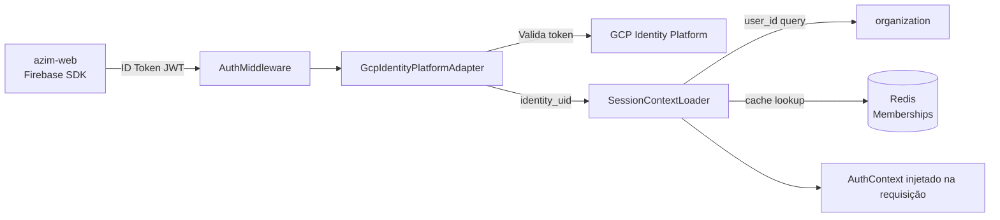
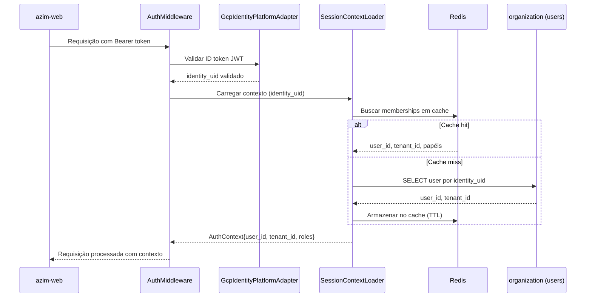

# Module — Authentication

**Status:** Rascunho para revisão
**Fase:** Fase 1 MVP

---

## 1. Visão Geral

Módulo responsável pela autenticação de usuários e gerenciamento de sessão por tenant. Atua como Anti-Corruption Layer (ACL) entre o modelo interno do Azim CRM e o GCP Identity Platform (Firebase Auth multi-tenant). Garante que mudanças no contrato do IdP externo não impactem o modelo de domínio interno.

---

## 2. Classificação

| Item | Valor |
|---|---|
| Tipo de Módulo | Application Module (ACL) |
| Deployable Candidato | azim-api |
| Bounded Context Relacionado | Identity & Access (BC-12) |
| Subdomínio DDD | Generic Subdomain |
| Tier / Criticidade | Tier 1 — sem autenticação, nenhuma funcionalidade do CRM é acessível |
| Status | Rascunho para revisão |

---

## 3. Objetivo

Prover autenticação segura por tenant via GCP Identity Platform. Validar tokens de sessão (ID tokens JWT), carregar o contexto de usuário e tenant para a requisição, e proteger o modelo interno do CRM de qualquer mudança no contrato do GCP IdP.

---

## 4. Responsabilidades

- Validar ID tokens JWT emitidos pelo GCP Identity Platform por tenant.
- Extrair `user_id` e `tenant_id` do token e injetar no contexto da requisição.
- Implementar middleware de autenticação aplicado a todos os endpoints protegidos.
- Expor endpoint de callback/redirect para fluxo OAuth2 do GCP.
- Coordenar com o módulo organization o carregamento de `UserMembership` e papéis após autenticação bem-sucedida.
- Implementar ACL: isolar o modelo interno do contrato do GCP Identity Platform.

---

## 5. Fora de Escopo

- Cadastro de usuários (pertence ao módulo organization via convite).
- Gestão de papéis e permissões (pertence ao módulo organization / RBAC).
- Provisionamento de tenant de identidade no GCP (pertence ao módulo tenant-administration).
- Autorização por recurso (RBAC aplicado nos próprios módulos de negócio).
- Autenticação de máquina a máquina entre workers (Ponto a Validar).

---

## 6. Capacidades Atendidas

| Código | Capability | Descrição |
|---|---|---|
| CAP-14 | Autenticação e Identidade | Login, sessão por tenant, validação de token, convite |

---

## 7. Bounded Context e Linguagem Ubíqua

| Termo | Definição |
|---|---|
| identity_uid | Identificador único do usuário no GCP Identity Platform (não o user_id interno) |
| session_token | ID token JWT emitido pelo GCP Identity Platform; válido por tenant |
| AuthContext | Objeto interno com user_id (UUID interno), tenant_id, email — isolado do modelo do GCP |
| ACL (Anti-Corruption Layer) | Camada que traduz o modelo do GCP (identity_uid) para o modelo interno (user_id) |

---

## 8. Componentes Internos Candidatos

| Componente | Tipo | Responsabilidade |
|---|---|---|
| AuthMiddleware | Adapter | Intercepta requisições, valida token JWT, injeta AuthContext |
| GcpIdentityPlatformAdapter | Adapter | Valida token com GCP SDK; traduz identity_uid → user_id interno |
| SessionContextLoader | Application Service | Carrega user_memberships e papéis do usuário após autenticação |
| AuthController | API Controller | Endpoint de logout e renovação de token |

---

## 9. APIs Principais

| Método | Endpoint | Finalidade | Consumidores |
|---|---|---|---|
| POST | /v1/auth/logout | Invalida sessão do usuário corrente | azim-web |
| GET | /v1/auth/me | Retorna perfil e papéis do usuário autenticado | azim-web |

> O login é realizado diretamente no GCP Identity Platform pelo frontend (Firebase SDK) — o backend valida o token resultante via middleware, não via endpoint de login próprio.

---

## 10. Eventos Publicados

Este módulo não publica eventos de domínio próprios.

---

## 11. Eventos Consumidos

Este módulo não consome eventos diretamente.

---

## 12. Dados Próprios

Este módulo é stateless e não possui dados próprios. O mapeamento de `identity_uid` → `user_id` é resolvido via consulta ao módulo organization (tabela `users`).

---

## 13. Integrações

| Sistema/Módulo | Tipo de Integração | Direção | Observações |
|---|---|---|---|
| GCP Identity Platform | OAuth2/OIDC | Entrada | Validação de ID token JWT por tenant |
| organization | Package (consulta interna) | Saída | Carrega user_memberships e papéis para composição do AuthContext |
| Memorystore / Redis | Cache | Saída | Cache de memberships por user_id para reduzir latência (TTL configurável) |

---

## 14. Dependências

### 14.1 Dependências de Domínio

- organization: necessário para resolver `identity_uid` → `user_id` e carregar papéis.

### 14.2 Dependências Técnicas

- GCP Identity Platform SDK (Firebase Admin SDK for .NET)
- Memorystore / Redis: cache de sessão e memberships
- GCP Secret Manager: credenciais do Firebase Admin SDK

### 14.3 Dependências Operacionais

- Secret: Firebase Admin SDK service account key via GCP Secret Manager
- Configuração de tenant de identidade no GCP (provisionado por tenant-administration)
- Renovação de certificados de validação de token (gerenciado automaticamente pelo GCP)

---

## 15. Requisitos Não Funcionais Relevantes

| Categoria | Requisito / Observação |
|---|---|
| Segurança | Validação de JWT em toda requisição; sem bypass; sem segredo no repositório |
| Performance | Cache de memberships em Redis para evitar consulta ao banco a cada requisição |
| Disponibilidade | Indisponibilidade do GCP Identity Platform bloqueia todo acesso — monitorar SLA do GCP |
| Observabilidade | Log de autenticação com correlation_id e tenant_id; falhas de validação de token devem gerar alerta |

---

## 16. Compliance Aplicável

| Compliance / Norma / Lei | Aplicável? | Motivo | Impacto no Módulo |
|---|---|---|---|
| LGPD | Sim | user_id e email trafegam no contexto de sessão | Não logar email em texto claro; sessão com expiração definida |
| PCI DSS | Não aplicável | Não processa dados de cartão | — |

---

## 17. Observabilidade

| Item | Recomendação Inicial |
|---|---|
| Logs | Log estruturado por requisição: correlation_id, tenant_id, user_id, endpoint; sem email em texto claro |
| Métricas | auth_token_validation_success_total, auth_token_validation_failure_total |
| Alertas | Alerta se auth_token_validation_failure_total cresce acima do baseline (possível ataque) |
| Health Checks | Verificar conexão com GCP Identity Platform e Redis na inicialização |

---

## 18. Diagramas do Módulo

### 18.1 Diagrama de Componentes Internos

### 18.2 Diagrama de Fluxo Principal

---

## 19. Riscos

| Código | Risco | Impacto | Mitigação |
|---|---|---|---|
| RISK-AUTH-01 | Indisponibilidade do GCP Identity Platform | Nenhum usuário consegue autenticar | Monitorar SLA do GCP; circuit breaker na validação de token |
| RISK-AUTH-02 | Cache de memberships desatualizado após mudança de papel | Usuário opera com papel antigo | TTL curto (5 min); invalidação explícita ao mudar papel |
| RISK-AUTH-03 | Vazamento de identity_uid no modelo interno | Acoplamento ao GCP — viola o ACL | Garantir que identity_uid não apareça fora do GcpIdentityPlatformAdapter |

---

## 20. Pontos a Validar

| Código | Ponto | Impacto | Recomendação |
|---|---|---|---|
| VAL-AUTH-01 | Autenticação M2M entre workers (digest-worker → api) | Define mecanismo de autenticação interna | Avaliar Service Account GCP + IAM para comunicação interna |
| VAL-AUTH-02 | Duração da sessão e política de refresh token | Experiência do usuário e segurança | Definir TTL do ID token e política de renovação antes do go-live |

---

## 21. Backlog Inicial Sugerido

| Tipo | Item | Descrição |
|---|---|---|
| Epic | Autenticação e Sessão por Tenant | Implementar AuthMiddleware, ACL do GCP IdP e cache de contexto |
| Story Técnica | AuthMiddleware com validação de JWT | Validar token em toda requisição; injetar AuthContext |
| Story Técnica | GcpIdentityPlatformAdapter | Traduzir identity_uid → user_id interno via consulta ao organization |
| Story Técnica | Cache de memberships em Redis | TTL configurável; invalidação explícita ao mudar papel |
| Task | Endpoint GET /v1/auth/me | Retornar perfil e papéis do usuário autenticado |

---

## 22. Referências

| Documento | Seção |
|---|---|
| DDD Segmentation | §4.1 BC-12 Identity & Access |
| DDD Segmentation | §8 Context Map — ACL Identity → Organization |
| Context Map | relations.md — Organization Management → Identity & Access |
| NFRD | NFR-SEG (segurança e autenticação) |
