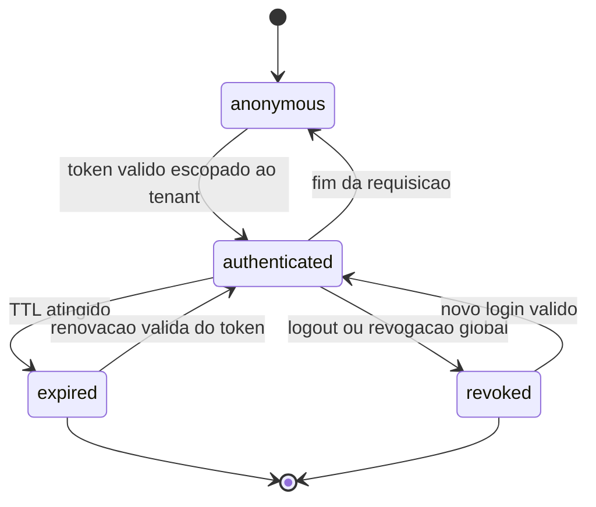
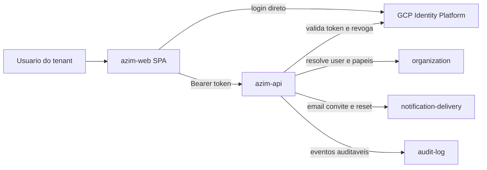
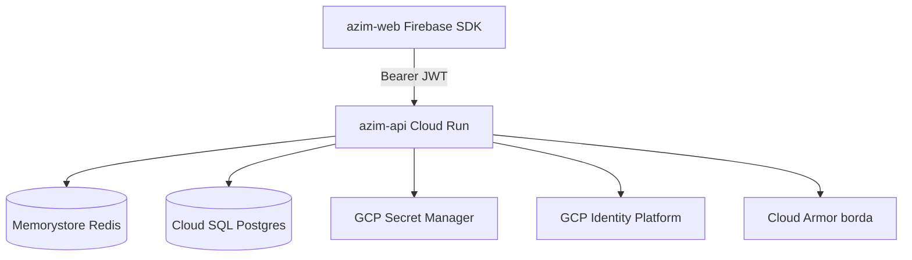
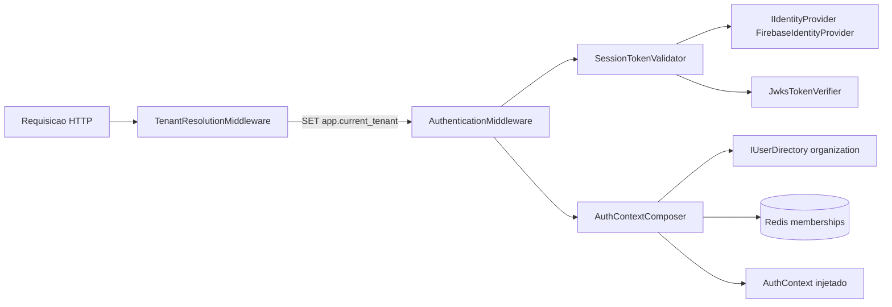
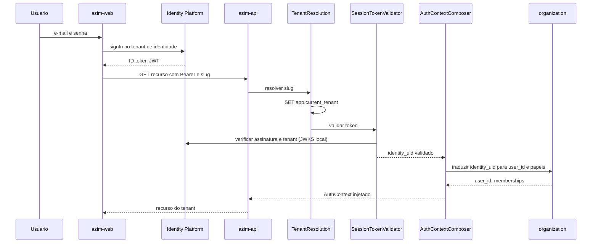
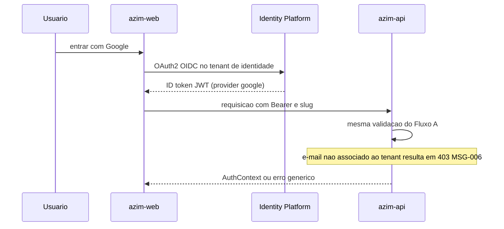
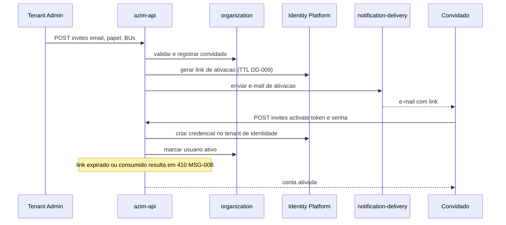
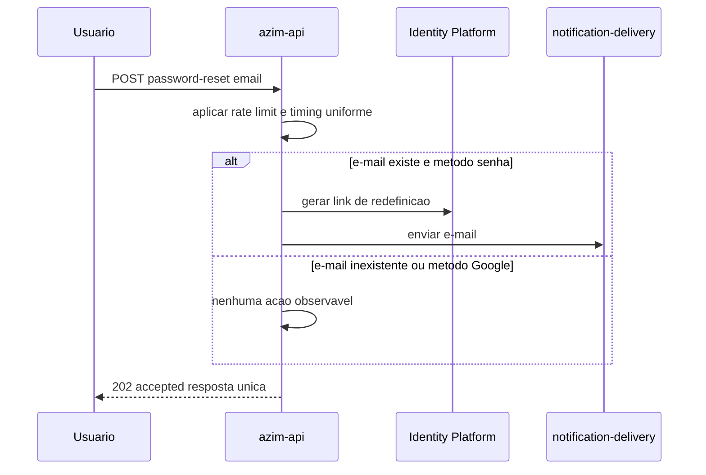
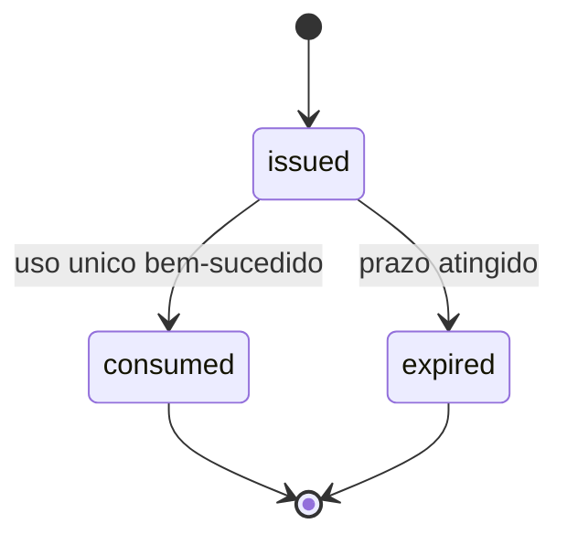

# BC-12 — Authentication
**Design Técnico**

- Versão: 0.1.0
- Data: 2026-06-11
- Status: Rascunho para revisão
- Referência base: docs/product/modules/authentication/requirements.md v0.1.0 (Req 1..11, RNF 1..10, PBT-01..05)
- ADRs aplicáveis: ADR-0005 (provider de e-mail transacional via `IEmailSender`, consumido nos fluxos de convite e recuperação — a formalizar); ADR-0007 (stack de observabilidade GCP Cloud Logging/Monitoring/Trace — a formalizar, VAL-TRD-07). Decisões arquiteturais de origem: DEC-005 (Identity Platform multi-tenant; secrets via Secret Manager), DEC-006 (multi-tenancy pooled + RLS via `SET app.current_tenant`).
- Rules aplicáveis: `.forge/rules/architecture/clean-architecture.md`, `.forge/rules/architecture/ddd.md`, `.forge/rules/architecture/jwt-authentication.md`, `.forge/rules/architecture/jwt-permissions.md`, `.forge/rules/architecture/api-and-contracts.md`, `.forge/rules/architecture/security-and-compliance.md`, `.forge/rules/architecture/security-and-secrets.md`, `.forge/rules/architecture/observability.md`, `.forge/rules/domain/audit-immutability.md`, `.forge/rules/conventions/language-policy.md`, `.forge/rules/conventions/naming.md`, `.forge/rules/conventions/document-versioning.md`, `.forge/rules/testing/tdd.md`, `.forge/rules/testing/quality-gates.md`

## Histórico de Versões

| Versão | Data | Status | Descrição da alteração |
|--------|------|--------|------------------------|
| 0.1.0 | 2026-06-11 | Rascunho para revisão | Criação inicial do design a partir do requirements.md v0.1.0 (Req 1..11, RNF 1..10, PBT-01..05), TRD (§7.2 FLOW-05, §8.4 ACL, §12.2 DEC-005/DEC-006, §14 segurança, §17 observabilidade) e rules de arquitetura/segurança/observabilidade. Resolve provisoriamente VAL-AUTH-02 (duração/refresh de sessão) via DD-008 e VAL-09 (prazo de convite RN-030) via DD-009, ambos sujeitos a confirmação antes do go-live. |

## 1. Visão Geral

O módulo **authentication** (BC-12, subdomínio **Genérico** SD-12) é um **Application Module** do tipo **Anti-Corruption Layer (ACL)** que isola o modelo de domínio interno do Azim CRM do contrato do **GCP Identity Platform** (Firebase Authentication multi-tenant). É a fronteira onde o identificador externo (`identity_uid`), as claims do token e o SDK do IdP são traduzidos para o modelo interno e confinados, nunca vazando para os módulos de negócio.

O Azim **não armazena nem processa senhas** (DEC-005, NFR-SEG-02, RNF 1). A autenticação é delegada integralmente ao Identity Platform: o frontend `azim-web` (Firebase SDK) faz o login diretamente no IdP, obtém o **session token** (ID token JWT) e o envia ao `azim-api` em cada requisição via `Authorization: Bearer <jwt>`. O backend não expõe endpoint de login que receba senha; ele apenas **valida** o token e compõe a sessão.

O módulo é **stateless**: não possui agregado de domínio próprio, não possui tabela própria e não publica eventos de domínio. Os artefatos centrais do módulo são dois **objetos de valor** imutáveis — `Session` (estado e validade do token) e `AuthContext` (identidade interna escopada ao tenant) — produzidos a cada requisição. A tradução `identity_uid → user_id` é resolvida por consulta ao módulo `organization`, com cache de memberships (Memorystore/Redis).

Cada **tenant** Azim corresponde a exatamente **um tenant de identidade** isolado no Identity Platform. A resolução do tenant ocorre pelo **slug** da URL canônica (`app.azim.com.br/{slug}`) ou do header `X-Tenant-Slug`, antes de qualquer acesso a dados. Resolvido o `tenant_id`, o módulo executa `SET app.current_tenant` na conexão (DEC-006, RLS) e a sessão é **sempre** escopada a um único tenant, nunca cruzando fronteiras (PBT-01, PBT-02).

A criticidade é **Tier 1**: sem autenticação, nenhuma funcionalidade do CRM é acessível; a indisponibilidade do IdP bloqueia todo o acesso (RISK-AUTH-01, RNF 3, RNF 9).

### 1.1 Rastreabilidade requisito → design

| Requisito | Elemento de design | Seções |
|---|---|---|
| Req 1 Resolução de tenant pelo slug | `TenantResolutionMiddleware` → `ITenantDirectory` + `SET app.current_tenant`; ordem de middlewares | 5.4, 6.1, 6.7, 16.4 |
| Req 2 Login e-mail/senha | Fluxo frontend→IdP; `SessionTokenValidator` (backend); MSG-001/MSG-004 | 4.6, 5.1, 8, 16.4 |
| Req 3 Login Google (OIDC) | Fluxo OAuth2/OIDC do IdP por tenant; mesmo `AuthContext`; MSG-006 | 4.6, 8, 16.4 |
| Req 4 Validação de token em toda requisição | `AuthenticationMiddleware` → `IIdentityProvider.VerifyToken`; verificação de tenant | 4.5, 5.4, 6.4, 16.4 |
| Req 5 Composição do AuthContext (tradução `identity_uid`) | `AuthContextComposer` + `IUserDirectory` (organization) + cache | 4.3, 5.3, 6.2, 16.4 |
| Req 6 Isolamento/reversibilidade do ACL | Porta `IIdentityProvider`; `IdentityProviderException` interna; Architecture.Tests | 3, 6.4, 13, DD-001 |
| Req 7 Convite com ativação | `InviteActivationService` + `IIdentityProvider` + `organization` + `IEmailSender`; uso único e expiração | 5.1, 6.4, 7, 16.4 |
| Req 8 Recuperação de senha | `PasswordResetService` (delegação ao IdP) + anti-enumeração | 5.1, 6.4, 8, 16.4 |
| Req 9 Logout / expiração / revogação | `SessionRevocationService` → `IIdentityProvider.RevokeRefreshTokens`; `revocation_checked` no validator | 4.4, 5.1, 6.4, 16.5 |
| Req 10 Anti-enumeração de e-mail | Respostas e timing uniformes; rate limiting; catálogo de erros sem PII | 8, 10, 12, 13 |
| Req 11 Perfil do usuário autenticado | `GET /v1/auth/me` projetando o `AuthContext` | 8, 11 |
| RNF 1 Zero senhas no Azim | Delegação total ao IdP; ausência de hash no schema (organization) | 2, 7, 10 |
| RNF 2 Latência de autenticação | Cache de memberships; validação local de assinatura por JWKS | 6.2, 6.4, 15 |
| RNF 3 Disponibilidade Tier 1 | Health/readiness do IdP e Redis; alerta de 401 em massa | 11, RNF 9 |
| RNF 4 Observabilidade sem PII | Serilog estruturado; mascaramento de PII; `identity_uid` fora de log | 11, DD-006 |
| RNF 5 Métricas/alerta de falha de validação | `auth_token_validation_*`; rótulo por tenant e por causa | 11 |
| RNF 6 TLS no tráfego com IdP/Redis | HTTPS para IdP; TLS para Memorystore; JWKS por canal cifrado | 6.4, 6.2, 10 |
| RNF 7 Segredos via Secret Manager | `ISecretProvider` → GCP Secret Manager; service account do Firebase Admin | 6.6, 10, DD-005 |
| RNF 8 Rate limiting e anti-abuso | Cloud Armor na borda + limitador por IP/tenant na aplicação; HTTP 429 | 6.4, 8, 10, 15 |
| RNF 9 Resiliência à indisponibilidade do IdP | Circuit breaker + timeout no adapter; HTTP 503 controlado | 6.4, 6.5, 15, 18 |
| RNF 10 Auditoria de eventos de autenticação | Eventos de aplicação append-only para `audit-log` (login, logout, convite, reset) | 4.4, 6.4, 11 |
| PBT-01 Sessão sempre escopada a um tenant | Invariante de `AuthContext`; teste de propriedade | 4.3, 13 |
| PBT-02 Isolamento cross-tenant do token | Verificação de `firebase.tenant` vs tenant resolvido; teste de propriedade | 4.5, 6.4, 13 |
| PBT-03 Resposta indistinguível (anti-enumeração) | Respostas e timing uniformes; teste de propriedade | 8, 10, 13 |
| PBT-04 Idempotência do logout | `SessionRevocationService` idempotente; teste de propriedade | 5.1, 6.4, 13 |
| PBT-05 Link expirado/consumido nunca concede acesso | Máquina de estados do convite/reset; teste de propriedade | 4.5, 7, 13 |

## 2. Princípios e Decisões Macro

1. **ACL stateless, sem agregado de domínio próprio** — identidade é externa (Generic Subdomain). O módulo não modela regra de negócio do CRM; expõe os objetos de valor `Session` e `AuthContext` (DD-001). A estrutura Clean Architecture é adaptada a um adapter: o papel de `Domain` (objetos de valor imutáveis + máquina de estados de sessão) é cumprido por `Contracts` e `Domain` leve, sem persistência.
2. **`identity_uid` confinado ao adapter** — nenhum identificador, claim ou tipo do Identity Platform aparece em entidades de domínio, eventos, contratos de API de negócio, logs ou erros (Req 6, RNF 4, RISK-AUTH-03). Verificado por `Architecture.Tests` (DD-001).
3. **Único ponto de acoplamento é `IIdentityProvider`** — toda chamada ao IdP passa por essa porta; o SDK (Firebase Admin) só aparece na implementação concreta em `Infrastructure`. A substituição do provedor impacta apenas o adapter (Req 6.4).
4. **Tenant antes de dados** — `TenantResolutionMiddleware` resolve o slug e executa `SET app.current_tenant` antes do middleware de autenticação e de qualquer acesso a dados (Req 1.5, DEC-006).
5. **Sessão sempre monotenant** — o `AuthContext` carrega exatamente um `tenant_id`, igual ao tenant resolvido pelo slug; divergência entre o `firebase.tenant` do token e o tenant resolvido resulta em 401 (PBT-01, PBT-02).
6. **Anti-enumeração por construção** — fluxos públicos retornam respostas e tempos de resposta indistinguíveis entre e-mail existente e inexistente; mensagens não contêm PII nem sinalização de existência de conta (Req 10, PBT-03).
7. **Toda falha do IdP vira erro interno controlado** — exceções do SDK são capturadas e mapeadas para `IdentityProviderException` e códigos do catálogo, sem propagar stack trace ou tipo do provedor (Req 6.5, RNF 9).
8. **Segredos exclusivamente no Secret Manager** — a service account key do Firebase Admin é lida em runtime via `ISecretProvider`; nunca em repositório, imagem, env em texto claro, log ou erro (RNF 7, DD-005).
9. **Sem valores monetários** — o módulo não processa money; a regra `money-as-cents` não se aplica a este escopo.
10. **Conformidade com `jwt-authentication.md` por delegação** — no Azim, o papel de emissor único de tokens descrito na rule é cumprido pelo **GCP Identity Platform**, não por um `auth-service` interno (DEC-005). A validação no `azim-api` segue os princípios da rule (validar issuer, audience, lifetime, assinatura; nunca embutir segredo), com as adaptações registradas em DD-002.

## 3. Estrutura da Solução

O módulo segue Clean Architecture, com a regra de dependência enforçada pelo compilador, **adaptada à natureza de ACL stateless** (DD-001): não há agregado de negócio nem persistência própria; o "domínio" do módulo são objetos de valor imutáveis e a máquina de estados de sessão.

```text
Authentication.Contracts        -> AuthContext, Session, SessionState, IdentityRef (interno),
                                    DTOs de API (MeResponse, LogoutResponse, InviteRequest...),
                                    códigos de erro do catálogo
Authentication.Domain           -> objetos de valor (Session, AuthContext), regras de transição
                                    de SessionState, Specifications (TokenValiditySpec,
                                    TenantMatchSpec), sem dependência externa
Authentication.Application       -> IIdentityProvider (porta), IUserDirectory (porta p/ organization),
                                    ITenantDirectory (porta), IEmailSender (porta p/ notification),
                                    AuthContextComposer, SessionTokenValidator, InviteActivationService,
                                    PasswordResetService, SessionRevocationService, validações de borda
Authentication.Infrastructure   -> FirebaseIdentityProvider (adapter ACL), JwksTokenVerifier,
                                    MembershipCacheRepository (Redis), SecretManagerProvider,
                                    OrganizationUserDirectory, TenantDirectory (Cloud SQL),
                                    RateLimiter, IdentityProviderHealthCheck, DI extensions
Authentication.Api              -> AuthenticationMiddleware, TenantResolutionMiddleware,
                                    AuthController (/v1/auth/me, /v1/auth/logout),
                                    InviteController, PasswordResetController
```

Projetos de teste:

```text
Authentication.Domain.Tests           -> imutabilidade/igualdade dos objetos de valor; transições de SessionState
Authentication.Application.Tests      -> composição do AuthContext, validação de token, idempotência de logout
Authentication.Infrastructure.Tests   -> adapter Firebase (emulador/WireMock), cache, JWKS, rate limiter
Authentication.Api.Tests              -> middlewares, /me, /logout, anti-enumeração (resposta e timing)
Authentication.Architecture.Tests     -> regra de dependência + proibição de SDK/identity_uid fora do adapter
```

Regra de dependência (inviolável):

```text
Api            -> Application, Contracts
Application    -> Domain, Contracts
Infrastructure -> Application, Domain, Contracts
Domain         -> Contracts (apenas tipos primitivos e objetos de valor)
Contracts      -> nenhum projeto interno
```

O símbolo `identity_uid` e qualquer tipo do Firebase Admin SDK só podem aparecer dentro de `Authentication.Infrastructure`. `Architecture.Tests` falha o build se vazarem para `Domain`, `Application`, `Contracts` ou `Api` (Req 6.2, 6.3, RISK-AUTH-03, DD-001).

## 4. Modelo de Domínio

> O módulo é um ACL técnico sem agregado de negócio (seção 2, DD-001). As subseções descrevem os objetos de valor de sessão/identidade e a máquina de estados de sessão, que constituem o "modelo" deste módulo.

### 4.1 Aggregates

Não aplicável nesta versão. O módulo não possui agregado de negócio próprio; identidade é externa (Identity Platform) e o cadastro de usuário/membership pertence ao `organization`.

### 4.2 Entidades

Não aplicável nesta versão. Não há entidade com identidade e ciclo de vida persistido neste módulo. O convite e a recuperação de senha são artefatos cujo estado vive no Identity Platform e/ou no `organization` (seção 7); este módulo coordena, não persiste.

### 4.3 Objetos de valor

Todos imutáveis, com igualdade por valor, definidos em `Authentication.Domain` e expostos via `Authentication.Contracts`.

| Objeto de valor | Campos | Invariantes |
|---|---|---|
| `AuthContext` | `user_id` (UUID), `tenant_id` (UUID), `email`, `roles` (lista), `memberships` (BU → papel) | Exatamente um `tenant_id`; `user_id` e `tenant_id` obrigatórios; **não** contém `identity_uid` nem qualquer claim do IdP (Req 5.2, 5.3, PBT-01). Imutável após composição. |
| `Session` | `state` (`SessionState`), `tenant_id`, `expires_at`, `issued_at`, `revocation_checked` (bool) | `state` coerente com `expires_at` (se `now ≥ expires_at` ⇒ `expired`); um `tenant_id`; só transita conforme seção 4.5. |
| `IdentityRef` | `identity_uid`, `firebase_tenant`, `email`, `sign_in_provider` | **Interno ao adapter** (`Infrastructure`); nunca cruza para `AuthContext` nem para a API (Req 6.2, 6.3). Produzido por `IIdentityProvider.VerifyToken`. |
| `TenantSlug` | `value` | Não vazio; normalizado (lowercase, trim); formato validado na borda (Req 1). |
| `MembershipSet` | `entries` (BU `bu_id` → `role`) | Conjunto sem duplicidade por `bu_id`; serializável para cache; carimbado com `cached_at` para TTL (Req 5.5). |

> `IdentityRef` é o único objeto que carrega `identity_uid`; ele é o limite do ACL. `AuthContextComposer` consome um `IdentityRef` e produz um `AuthContext` que **não** o referencia.

### 4.4 Domain Events

Não aplicável nesta versão. O módulo **não publica eventos de domínio** (README §10). Para auditoria (RNF 10), o módulo emite **eventos de aplicação auditáveis** consumidos pelo módulo `audit-log` (append-only): `user_authenticated`, `session_revoked` (logout/revogação global), `invite_activated`, `password_reset_requested`, `password_reset_completed`. Esses registros gravam `user_id`, `tenant_id`, tipo e timestamp; nunca `identity_uid`, senha ou token completo (RNF 10.1, 10.2; seção 11).

### 4.5 State Machines

Máquina de estados de **sessão** (seção 4 do requirements). O módulo é stateless quanto à persistência; a validação do token reflete deterministicamente o estado.



Invariante (regra invariável da seção 4 do requirements): a partir de `expired` ou `revoked`, o acesso a dados protegidos é negado (HTTP 401) até nova autenticação válida. Não há transição direta de `expired`/`revoked` para acesso autorizado sem novo token válido (Req 9.4).

Máquina de estados de **link de convite / recuperação de senha** (PBT-05): um link nasce `issued`, pode tornar-se `consumed` (uso único) ou `expired` (prazo atingido); ambos são terminais e negam qualquer uso posterior. Detalhada na seção 7.

### 4.6 Policies / Specifications

| Specification | Regra | Origem |
|---|---|---|
| `TokenValiditySpec` | Token presente, bem-formado, assinatura válida (JWKS), não expirado, não revogado | Req 4.2 |
| `TenantMatchSpec` | `firebase.tenant` do token == tenant de identidade do tenant resolvido pelo slug | Req 4.3, PBT-02 |
| `ActiveUserSpec` | `identity_uid` validado possui `user_id` ativo no tenant (organization) | Req 5.4 |
| `InviteUsableSpec` | Link `issued`, não `consumed`, não `expired` | Req 7.4, 7.5, PBT-05 |
| `EmailMethodSpec` | Usuário de método Google não recebe opção de recuperação de senha | Req 8.4 |

`AuthContext` é composto **somente** quando `TokenValiditySpec ∧ TenantMatchSpec ∧ ActiveUserSpec` são verdadeiras; caso contrário 401 (token/tenant) ou 403 (usuário sem `user_id` ativo — Req 5.4).

## 5. Application Layer

O módulo não usa um barramento CQRS clássico para o caminho quente (validação de token a cada requisição é executada por middleware, por desempenho — RNF 2). Os fluxos de coordenação (convite, recuperação, logout) são modelados como serviços de aplicação (use cases) com um handler por caso de uso. Caso o projeto padronize MediatR, os serviços abaixo são expostos como handlers de comando equivalentes (DD-003).

### 5.1 Commands

| Command | Caso de uso | Handler/Serviço | Origem |
|---|---|---|---|
| `LogoutCommand` | Revogar sessão global do usuário corrente | `SessionRevocationService` | Req 9 |
| `CreateInviteCommand` | Gerar convite (token de ativação) + disparar e-mail | `InviteActivationService.Create` | Req 7 |
| `ActivateInviteCommand` | Consumir link de convite e ativar conta no IdP | `InviteActivationService.Activate` | Req 7 |
| `RequestPasswordResetCommand` | Gerar link de reset (delegado ao IdP) + disparar e-mail | `PasswordResetService.Request` | Req 8 |

> Não há `LoginCommand`: o login ocorre no frontend contra o IdP (README §9). A "entrada" da sessão no backend é a validação do token no middleware (seção 5.4).

### 5.2 Queries

| Query | Caso de uso | Handler/Serviço | Origem |
|---|---|---|---|
| `GetMeQuery` | Projetar o `AuthContext` da requisição corrente | `AuthController.Me` (lê o `AuthContext` injetado) | Req 11 |

### 5.3 Handlers

- `AuthContextComposer` — coração do ACL na aplicação: recebe um `IdentityRef` (do adapter), resolve `user_id`/memberships via `IUserDirectory` (com cache), e produz o `AuthContext`. Aplica `ActiveUserSpec`; falha → 403 (Req 5.4).
- `SessionTokenValidator` — orquestra `IIdentityProvider.VerifyToken` (assinatura/lifetime via JWKS) + `TenantMatchSpec` + checagem de revogação. Produz `Session` e `IdentityRef`.
- `SessionRevocationService` — invoca `IIdentityProvider.RevokeRefreshTokens(identity_uid)`; **idempotente** (PBT-04): repetições retornam o mesmo estado final sem erro (Req 9.5).
- `InviteActivationService` — coordena criação/ativação do convite com `IIdentityProvider`, `IUserDirectory` (organization) e `IEmailSender`; aplica `InviteUsableSpec` (uso único + expiração, PBT-05).
- `PasswordResetService` — delega ao IdP a geração do link de redefinição; aplica `EmailMethodSpec`; resposta anti-enumeração uniforme (Req 8, Req 10).

### 5.4 Pipeline Behaviors

Implementados como **middlewares ASP.NET Core** no caminho de requisição (ordem obrigatória, Req 1.5):

1. `CorrelationMiddleware` — garante `correlationId` por requisição (RNF 4).
2. `TenantResolutionMiddleware` — resolve `tenant_id` a partir do slug (path ou `X-Tenant-Slug`) via `ITenantDirectory`; executa `SET app.current_tenant = '<tenant_id>'` na conexão (DEC-006, RLS). Slug inexistente/inativo → 404 MSG-002 (Req 1.2).
3. `AuthenticationMiddleware` — invoca `SessionTokenValidator`; em sucesso compõe o `AuthContext` via `AuthContextComposer` e o injeta na requisição. Falha → 401 (token/tenant) ou 403 (usuário), sem detalhe interno (Req 4.2).
4. `RateLimitingMiddleware` — aplicado aos fluxos públicos (login proxy de erro, reset, ativação) por IP e por tenant; excesso → 429 (RNF 8). Atua antes da lógica para evitar oráculo de timing/enumeração (Req 10.5).

Para o behavior CQRS (quando MediatR) dos comandos de coordenação: `ValidationBehavior` (borda), `AuthorizationBehavior` (exige `AuthContext` com papel adequado, ex. Tenant Admin para `CreateInviteCommand`), `AuditBehavior` (emite evento auditável, RNF 10).

### 5.5 Validações de Aplicação

| Validação | Camada | Regra |
|---|---|---|
| Slug presente e bem-formado | borda (middleware) | path ou header obrigatório; normalização (Req 1) |
| `Authorization: Bearer` presente em rota protegida | borda (middleware) | ausência → 401 (estado `anonymous`) |
| E-mail de convite bem-formado | borda (`CreateInviteCommand`) | formato; demais regras (já cadastrado) no `organization` (Req 7.6) |
| Papel/BU do convite válidos | aplicação | consulta ao `organization`; autoria por Tenant Admin (Req 7) |
| Assinatura/lifetime/issuer/audience do token | aplicação (`SessionTokenValidator`) | regras `jwt-authentication.md` adaptadas (DD-002) |
| Correspondência de tenant | aplicação (`TenantMatchSpec`) | `firebase.tenant` == tenant resolvido (PBT-02) |

Validações sintáticas ficam na borda; regras de negócio de cadastro/papéis pertencem ao `organization`. Este módulo não duplica RBAC de recurso (NFR-SEG-03, fora de escopo).

## 6. Infrastructure Layer

### 6.1 Persistência

O módulo **não possui tabela própria** (stateless, README §12). Acessa em leitura:

- `ITenantDirectory` → tabela `tenants` (módulo `tenant-administration`): resolve `slug → tenant_id` e o identificador do **tenant de identidade** correspondente. Leitura cacheável (slug imutável, RN-019).
- `IUserDirectory` → tabela `users`/`user_memberships` (módulo `organization`): resolve `identity_uid → user_id`, papéis e memberships. **Sem coluna de hash de senha** (RNF 1.1).

Toda leitura via Cloud SQL ocorre após `SET app.current_tenant` (DEC-006), exceto a resolução de slug, que é cross-tenant por natureza (executa em conexão de catálogo de tenants — seção 6.7).

### 6.2 Cache

- **Memorystore/Redis** (TLS, RNF 6) para `MembershipSet` por `user_id`, reduzindo consulta ao banco a cada requisição (RNF 2.3).
- Chave: `auth:membership:{tenant_id}:{user_id}`. TTL configurável (referência 5 min, RISK-AUTH-02). **Invalidação explícita** ao mudar papel: o `organization` publica `user.role_changed` / `user.deactivated`, consumido para `DEL` da chave (Req 5.5). Sem invalidação, o TTL curto limita a janela de papel desatualizado.
- Cache opcional de JWKS (chaves públicas do IdP) com TTL respeitando o `Cache-Control` do endpoint do IdP (RNF 2, RNF 6.2).
- Isolamento por tenant: a chave inclui `tenant_id`; nenhuma entrada é compartilhada entre tenants (seção 14).

### 6.3 Mensageria

Não aplicável como produtor de eventos de domínio. O módulo **consome** (no `azim-api`) os eventos `user.role_changed` e `user.deactivated` do `organization` apenas para invalidar cache (seção 6.2). Não há tópico próprio publicado por este módulo.

### 6.4 Integrações Externas

| Integração | Porta | Adapter | Resiliência |
|---|---|---|---|
| GCP Identity Platform (verificação de token, revogação, geração de link de convite/reset, criação de usuário na ativação) | `IIdentityProvider` | `FirebaseIdentityProvider` (Firebase Admin SDK for .NET) | timeout por chamada, retry idempotente limitado, **circuit breaker** (RNF 9); exceções do SDK mapeadas para `IdentityProviderException` (Req 6.5) |
| JWKS / chaves públicas do IdP | `ITokenVerifier` | `JwksTokenVerifier` | verificação **local** de assinatura (sem round-trip por requisição); cache de chaves (RNF 2) |
| `organization` (user directory) | `IUserDirectory` | `OrganizationUserDirectory` | consulta in-process (monólito modular); cache (6.2) |
| `notification-delivery` | `IEmailSender` | injeção do módulo `notification-delivery` | falha de envio → MSG-009; não bloqueia o caller além do esperado |
| Rate limiting | `IRateLimiter` | `RedisRateLimiter` + Cloud Armor (borda) | janelas por IP/tenant; 429 (RNF 8) |

`IIdentityProvider` (porta estável — Req 6):

```text
VerifyToken(rawJwt, expectedFirebaseTenant) -> IdentityRef        // assinatura, lifetime, tenant, revogação
RevokeRefreshTokens(identityUid) -> void                          // logout global (Req 9.1)
GenerateInviteActivation(email, firebaseTenant) -> ActivationLink // convite (Req 7)
GeneratePasswordResetLink(email, firebaseTenant) -> ResetLink     // recuperação (Req 8)
HealthCheck() -> HealthStatus                                     // readiness (RNF 3.2)
```

### 6.5 Idempotência

- **Logout/revogação** (Req 9.5, PBT-04): `RevokeRefreshTokens` é naturalmente idempotente — revogar uma sessão já revogada produz o mesmo estado final; o serviço captura "já revogado" como sucesso.
- **Convite e reset**: o estado de uso único vive no IdP/`organization`; reprocessar a ativação de um link já consumido falha de forma determinística (MSG-008), sem efeito colateral (PBT-05).
- **Composição do AuthContext**: pura e determinística para o mesmo `identity_uid` + estado de membership (cacheável).

### 6.6 Outbox / Inbox

Não aplicável nesta versão para eventos de domínio (o módulo não os publica). Os **eventos auditáveis** (RNF 10) são gravados via o mecanismo append-only do `audit-log`; quando esse módulo adotar outbox transacional, este módulo o reutiliza, sem outbox próprio.

### 6.7 Resolução de tenant e SET app.current_tenant

`TenantResolutionMiddleware` resolve o slug em uma conexão de catálogo (sem `app.current_tenant` ainda definido, pois a busca por slug é cross-tenant). Resolvido o `tenant_id`, **antes de qualquer acesso a dados de negócio**, executa na conexão da requisição:

```sql
SET app.current_tenant = '<tenant_id>';
```

A partir daí, RLS (`USING (tenant_id = current_setting('app.current_tenant')::uuid)`) e o EF Core global query filter atuam como camadas independentes (DEC-006, TRD §13). O middleware de tenant é **obrigatório** e precede o de autenticação e o de negócio (Req 1.5).

### 6.8 Segredos

`ISecretProvider` → `SecretManagerProvider` (GCP Secret Manager) carrega em runtime a **service account key do Firebase Admin SDK** (RNF 7.2, DD-005). Nenhum segredo em repositório, imagem ou env em texto claro; `gitleaks` no CI bloqueia build na presença de segredo versionado (RNF 7.3). As chaves **públicas** de validação (JWKS) não são segredo e são obtidas por canal cifrado do IdP (RNF 6.2).

## 7. Schema / Modelo de Persistência

O módulo **não cria nem possui tabelas** (stateless). Não há migration própria de schema de negócio (RNF 1.1: ausência de coluna de hash de senha é responsabilidade do schema do `organization`, que este módulo apenas consome).

Tabelas **consumidas** (propriedade de outros módulos, citadas para rastreabilidade):

| Tabela | Módulo dono | Uso por authentication | Campos relevantes |
|---|---|---|---|
| `tenants` | tenant-administration | resolver `slug → tenant_id` e tenant de identidade | `id` (tenant_id), `slug` (único, imutável), `identity_tenant_id`, `status` |
| `users` | organization | resolver `identity_uid → user_id`; e-mail; método de login | `id` (user_id), `tenant_id`, `identity_uid`, `email`, `auth_method`, `status` |
| `user_memberships` | organization | papéis e BUs para o `AuthContext` | `tenant_id`, `user_id`, `bu_id`, `role` |
| `audit_logs` | audit-log | gravação append-only dos eventos auditáveis (RNF 10) | `tenant_id`, `user_id`, `event_type`, `occurred_at` |

Observações de schema (recomendações ao `organization`/`tenant-administration`, não criadas aqui):

- `users.identity_uid` deve ter índice único por tenant: `UNIQUE (tenant_id, identity_uid)` — suporta a tradução em O(1) e impede colisão cross-tenant.
- `tenants.slug` deve ser `UNIQUE` global e imutável (RN-019); `tenants.identity_tenant_id` mapeia 1:1 ao tenant de identidade (Req 6.1).
- **Nenhuma** coluna de senha/hash em `users` (RNF 1.1).

**Estado de convite/reset:** este módulo não persiste; o uso único e a expiração são garantidos pelo Identity Platform (links de ação Firebase, com expiração nativa) e/ou pelo registro de convite mantido no `organization`. O prazo do convite é configurado em DD-009 (referência 72h, VAL-09).

## 8. API Contracts

Convenções: todas as rotas exigem resolução de tenant por slug (path `/{slug}/...` ou header `X-Tenant-Slug`); rotas protegidas exigem `Authorization: Bearer <jwt>`. Respostas de erro seguem o formato `{ code, message }` do catálogo (seção 12), sem PII nem detalhe interno (Req 10.4).

### 8.1 GET /v1/auth/me — perfil do usuário autenticado (Req 11)

| Item | Valor |
|---|---|
| Auth | Bearer obrigatório; tenant resolvido por slug |
| Request | sem corpo |
| 200 | `{ user_id, email, roles[], memberships[{ bu_id, role }], tenant_id }` (projeção do `AuthContext`) |
| Erros | 401 (`AUTH-ERR-001`/`002`/`003`/`004`), 403 (`AUTH-ERR-005`), 404 slug (`AUTH-ERR-010`), 503 (`AUTH-ERR-020`) |

Nunca expõe `identity_uid` nem claim do IdP (Req 11.4); retorna apenas o usuário corrente do tenant da sessão (Req 11.2).

### 8.2 POST /v1/auth/logout — encerramento global (Req 9)

| Item | Valor |
|---|---|
| Auth | Bearer obrigatório |
| Request | sem corpo |
| 200 | `{ status: "revoked" }` — revoga refresh tokens no IdP (invalidação global, Req 9.1) |
| Idempotência | repetições retornam 200 com mesmo estado (Req 9.5, PBT-04) |
| Erros | 401 (`AUTH-ERR-001..004`), 503 (`AUTH-ERR-020`) |

### 8.3 POST /v1/auth/invites — criar convite (Req 7) — **Tenant Admin**

| Item | Valor |
|---|---|
| Auth | Bearer + papel Tenant Admin |
| Request | `{ email, role, bu_ids[] }` |
| 202 | `{ status: "invited" }` — gera token de ativação (TTL DD-009) e dispara e-mail via `notification-delivery` |
| Erros | 409 já cadastrado/ativo (`AUTH-ERR-030`, MSG-007), 422 papel/BU inválidos (`AUTH-ERR-031`), 502 falha de e-mail (`AUTH-ERR-032`, MSG-009), 429 (`AUTH-ERR-040`) |

### 8.4 POST /v1/auth/invites/activate — ativar conta por convite (Req 7) — **pública**

| Item | Valor |
|---|---|
| Auth | token de ativação (no corpo); sem Bearer |
| Request | `{ activation_token, password? }` — senha ou vínculo Google concluído no IdP |
| 200 | `{ status: "activated" }` |
| Erros | 410 expirado/consumido (`AUTH-ERR-033`, MSG-008, PBT-05), 429 (`AUTH-ERR-040`) |

### 8.5 POST /v1/auth/password-reset — solicitar recuperação (Req 8) — **pública**

| Item | Valor |
|---|---|
| Auth | nenhuma |
| Request | `{ email }` |
| 202 | `{ status: "accepted" }` — **resposta única**, idêntica para e-mail existente e inexistente, com timing uniforme (Req 8.3, Req 10.2, PBT-03) |
| Erros | apenas 429 (`AUTH-ERR-040`) com mensagem genérica que não revela existência de conta (RNF 8.2). Nunca 404/409 por inexistência de e-mail. |

### 8.6 Fluxos de login (sem endpoint backend)

Login e-mail/senha e login Google **não têm endpoint próprio no `azim-api`** (README §9): o `azim-web` autentica diretamente no Identity Platform (Firebase SDK) contra o tenant de identidade resolvido pelo slug, e envia o token resultante às rotas protegidas. O backend valida via `AuthenticationMiddleware` (seção 5.4). O TRD §15.4 lista rotas `/api/v1/auth/login` e `/api/v1/auth/google` como **proxies de borda opcionais**; nesta versão o login é client-side e o backend só valida (DD-004).

### 8.7 Paginação, filtros, ordenação

Não aplicável: nenhuma rota deste módulo retorna coleção paginável. `GET /v1/auth/me` retorna recurso único do usuário corrente.

## 9. AsyncAPI / Eventos Publicados e Consumidos

### 9.1 Publicados

Nenhum evento de domínio publicado (README §10). Eventos **auditáveis** de aplicação (não são eventos de integração) são entregues ao `audit-log` (seção 11): `user_authenticated`, `session_revoked`, `invite_activated`, `password_reset_requested`, `password_reset_completed`. Cada registro carrega `tenant_id`, `user_id`, `event_type`, `occurred_at`, `correlation_id`; nunca `identity_uid`, senha ou token (RNF 10.2).

### 9.2 Consumidos

| Evento | Origem | Channel/topic | Uso |
|---|---|---|---|
| `user.role_changed` | organization | `azim-organization` | invalidar cache de `MembershipSet` (Req 5.5, RISK-AUTH-02) |
| `user.deactivated` | organization | `azim-organization` | invalidar cache e negar futuras composições (Req 5.4) |

Tratamento: o consumer valida que `tenant_id` do evento corresponde ao contexto antes de agir (TRD §11.4); idempotente (apenas `DEL` de chave de cache). Sem DLQ própria — falha de invalidação degrada para o TTL curto do cache, sem comprometer isolamento.

## 10. Segurança

| Vetor | Mecanismo técnico |
|---|---|
| Autenticação | Delegada ao Identity Platform; backend valida ID token JWT (issuer, audience, lifetime, assinatura via JWKS) em **toda** rota protegida, sem bypass (Req 4, `jwt-authentication.md` por delegação — DD-002). |
| Zero senhas no Azim | Nenhuma senha armazenada/processada; ausência de coluna de hash (RNF 1.1). |
| Segregação multi-tenant | `TenantMatchSpec` (token×slug) + `SET app.current_tenant` + RLS + EF global filter (3 camadas, DEC-006); chave de cache por tenant. Token de A nunca autentica em B (PBT-02, RNF 1.4). |
| Anti-enumeração | Login: MSG-001 única (não distingue e-mail×senha). Reset: resposta e timing uniformes (Req 8.3, 10.2). Google: MSG-006 genérica. Erros sem PII nem sinal de existência de conta (Req 10, PBT-03). |
| Proteção contra força bruta | Rate limiting por IP e por tenant (Cloud Armor + `RedisRateLimiter`); 429 sem revelar motivo que indique conta (RNF 8). |
| Proteção contra replay/sessão roubada | Logout global revoga refresh tokens (Req 9.1); token revogado/expirado → 401 (Req 9.4); TTL curto do ID token (DD-008). |
| Validação de entrada | Slug e e-mail validados na borda; token validado por biblioteca confiável; nenhum parsing manual de JWT. |
| Mascaramento de PII | E-mail nunca em log em texto claro; `identity_uid` fora de log/erro (RNF 4, DD-006). |
| Criptografia em trânsito | TLS para IdP e Memorystore; JWKS por canal cifrado (RNF 6). |
| Criptografia em repouso | Cache Redis sem PII em texto claro (memberships por `user_id`); Cloud SQL/Memorystore com criptografia gerenciada pelo GCP. |
| Segredos | Service account do Firebase Admin via Secret Manager; rotação sem deploy; `gitleaks` no CI (RNF 7). |
| Trilha de auditoria | Eventos auditáveis append-only para `audit-log` (RNF 10). |
| Menor privilégio | Service account do `azim-api` com permissões mínimas no IdP (verificar token, revogar, gerar link); sem permissão de administração ampla. |
| LGPD by design | PII mínima trafega no `AuthContext`; e-mail visível apenas no tenant; mascarado em logs de plataforma (TRD §16). |

## 11. Observabilidade

- **Logs estruturados (Serilog → Cloud Logging):** JSON com campos obrigatórios `correlationId`, `tenantId`, `service`, `level`, `timestamp`, `endpoint` (RNF 4.1). Em contexto autenticado, 100% dos logs contêm `tenantId` (RNF 4.4). **Nunca** e-mail em texto claro, `identity_uid`, senha, token completo ou claim sensível (RNF 4.2, 4.3, DD-006). Destructuring policy do Serilog mascara PII por construção.
- **Métricas (Cloud Monitoring):** `auth_token_validation_success_total` e `auth_token_validation_failure_total`, rotuladas por `tenant_id` e por **causa** (`expired`, `invalid_signature`, `tenant_mismatch`) — RNF 5.1, 5.3. Métricas de rate limiting (`auth_rate_limit_block_total`, RNF 8.3) e de latência (`auth_latency_ms` p95, RNF 2.1).
- **Traces:** `correlationId` propagado; span da verificação de token e da composição do contexto, com latência do IdP medida à parte (RNF 2.2).
- **Alertas:** falha de validação acima do baseline → alerta de possível ataque (RNF 5.2); 401 em massa → investigar IdP (RNF 3.3, TRD §17 runbook).
- **Health checks:** `GET /health/ready` verifica conexão com Identity Platform (via `IdentityProviderHealthCheck`) e Redis na inicialização e prontidão (RNF 3.2); `GET /health/live` independente do IdP para não derrubar o pod em falha externa transitória.
- **Auditoria operacional:** eventos auditáveis (seção 9.1) distinguíveis: logout/revogação global e ativação de convite têm tipos próprios (RNF 10.3).

## 12. Catálogo de Erros

| Código | Mensagem (consumidor) | HTTP | Quando ocorre | Ação recomendada |
|---|---|---|---|---|
| `AUTH-ERR-001` | Sessão inválida ou expirada. | 401 | Token ausente ou malformado | Reautenticar |
| `AUTH-ERR-002` | Sessão inválida ou expirada. | 401 | Assinatura inválida (JWKS) | Reautenticar |
| `AUTH-ERR-003` | Sessão inválida ou expirada. | 401 | Token expirado (estado `expired`) | Renovar token |
| `AUTH-ERR-004` | Sessão inválida ou expirada. | 401 | Token revogado (logout/revogação, estado `revoked`) ou tenant divergente | Reautenticar no tenant correto |
| `AUTH-ERR-005` | Acesso negado. | 403 | `identity_uid` válido sem `user_id` ativo no tenant (Req 5.4) | Solicitar acesso ao admin |
| `AUTH-ERR-010` | Workspace não encontrado. | 404 | Slug inexistente ou inativo (MSG-002, Req 1.2) | Verificar a URL do tenant |
| `AUTH-ERR-011` | E-mail ou senha incorretos. | 401 | Credencial inválida no login (MSG-001) — emitido pelo IdP/frontend; padronizado aqui | Conferir credenciais |
| `AUTH-ERR-012` | Verifique o e-mail de convite para ativar sua conta. | 401 | Conta com convite pendente (MSG-004, Req 2.4) | Concluir ativação |
| `AUTH-ERR-013` | Use o e-mail correto ou solicite um convite. | 401 | Google não associado ao tenant (MSG-006, Req 3.3) | Usar e-mail associado |
| `AUTH-ERR-020` | Serviço de autenticação indisponível. Tente novamente. | 503 | Falha/circuit breaker do IdP (RNF 9.1) | Repetir após backoff |
| `AUTH-ERR-030` | Não foi possível concluir o convite. | 409 | E-mail já cadastrado e ativo (MSG-007, Req 7.6) | Verificar usuário existente |
| `AUTH-ERR-031` | Papel ou unidade de negócio inválidos. | 422 | Papel/BU inexistentes no tenant (Req 7) | Corrigir os campos |
| `AUTH-ERR-032` | Convite criado, mas o e-mail não pôde ser enviado. | 502 | Falha de entrega via notification (MSG-009, Req 7.2) | Reenviar convite |
| `AUTH-ERR-033` | Link de convite inválido ou expirado. Solicite um novo. | 410 | Link expirado/consumido (MSG-008, Req 7.4/7.5, PBT-05) | Solicitar novo convite |
| `AUTH-ERR-040` | Muitas tentativas. Tente novamente em instantes. | 429 | Rate limit por IP/tenant (RNF 8); mensagem não revela existência de conta | Aguardar e repetir |
| `AUTH-ERR-090` | Erro interno de autenticação. | 500 | Falha de tradução/contrato inesperado do IdP mapeada (Req 6.5) | Acionar suporte com `correlationId` |

Regras: todo endpoint da seção 8 referencia apenas códigos deste catálogo; mensagens não expõem PII, `identity_uid` nem detalhe interno; erros de autorização e dos fluxos públicos não permitem enumeração (Req 10.4).

## 13. Testes

| Camada | Foco | Rastreabilidade |
|---|---|---|
| `Domain.Tests` | Imutabilidade/igualdade de `AuthContext`, `Session`; transições válidas/inválidas de `SessionState` | Req 5, seção 4, Req 9.4 |
| `Application.Tests` | Composição do AuthContext (cache hit/miss, usuário inativo→403); validação de token; idempotência de logout | Req 4, 5, 9; PBT-04 |
| `Infrastructure.Tests` | `FirebaseIdentityProvider` contra emulador Firebase/WireMock; mapeamento de exceção→`IdentityProviderException`; cache; rate limiter | Req 6, RNF 9 |
| `Api.Tests` | Middlewares (ordem tenant→auth); `/me`; `/logout`; **anti-enumeração** (corpo, código e timing de reset) | Req 1, 10, 11; PBT-03 |
| `Architecture.Tests` | Regra de dependência; proibição de SDK Firebase e `identity_uid` fora de `Infrastructure` | Req 6.2/6.3; RISK-AUTH-03; DD-001 |
| Testes de contrato | Estabilidade de `IIdentityProvider`; substituição de adapter sem tocar consumidores | Req 6.4 |
| Testes de integração de isolamento (gate CI) | Token de A não autentica em B (API e SQL/RLS) | RNF 1.4; PBT-02; TRD §13.5 |
| Testes de segurança | Sem PII em logs (scan de saída); 401 para token inválido/expirado/revogado | RNF 1.3, 4; Req 4.2 |
| Testes de resiliência | Circuit breaker abre em indisponibilidade do IdP; 503 controlado; recuperação sem restart | RNF 9 |
| Testes de performance | p95 ≤ 1 s das operações de auth do backend (excluindo IdP) | RNF 2.1 |

**Property-Based Testing (geradores e oráculos):**

- **PBT-01** — gerar (usuário válido, método, slug); asserir que o `AuthContext` tem exatamente um `tenant_id` == tenant resolvido. Domínio.
- **PBT-02** — gerar par (A, B) distinto e token válido de A; asserir 401 e ausência de `AuthContext` ao validar em B. Integração.
- **PBT-03** — gerar e-mail (existente/inexistente); asserir indistinguibilidade de corpo, código e categoria de mensagem do reset; medir timing dentro de banda. Api.
- **PBT-04** — gerar N ≥ 1 chamadas consecutivas de logout; asserir estado final único e ausência de erro após a primeira. Application.
- **PBT-05** — gerar link em estado `expired`/`consumed`; asserir que nenhuma sequência reabilita; uso sempre falha sem ativar/redefinir. Domínio + integração.

## 14. Multi-tenancy

| Aspecto | Decisão |
|---|---|
| Modelo de isolamento | Pooled + RLS (DEC-006); 1 tenant de identidade por tenant Azim (Req 6.1) |
| `tenant_id` | Resolvido por slug antes de qualquer acesso; injetado no `AuthContext` (exatamente um) |
| Validação de escopo | `TenantMatchSpec` (token×tenant) + `SET app.current_tenant` + RLS + EF filter |
| Segregação de cache | Chave de cache inclui `tenant_id`; nenhuma entrada compartilhada entre tenants |
| Segregação de eventos | Consumer valida `tenant_id` do evento antes de invalidar cache |
| Risco de vazamento | Token cross-tenant bloqueado (PBT-02); testes de isolamento como gate de CI (TRD §13.5) |
| Auditoria por tenant | Todo evento auditável e log carrega `tenant_id` (RNF 4.4, 10.1) |

## 15. Performance e Escalabilidade

| Item | Decisão |
|---|---|
| SLO de latência | p95 ≤ 1 s nas operações de auth do backend, excluindo IdP (RNF 2.1) |
| Verificação de token | Assinatura validada **localmente** via JWKS em cache — sem round-trip ao IdP por requisição (RNF 2) |
| Cache de memberships | Memorystore/Redis, TTL configurável (~5 min), invalidação por evento (RNF 2.3, Req 5.5) |
| Concorrência | Middleware stateless; escala horizontal do `azim-api` (Cloud Run) sem estado de sessão local |
| Timeouts | Chamadas ao IdP com timeout explícito; readiness não bloqueia liveness |
| Circuit breaker | Protege o `azim-api` de exaustão durante indisponibilidade prolongada do IdP (RNF 9.2) |
| Backpressure / rate limit | Cloud Armor + limitador por IP/tenant; 429 antes de saturar (RNF 8) |
| Limites de payload | Corpos pequenos (e-mail, token); sem upload neste módulo |
| Monitoramento de dependência | Latência do IdP medida à parte no Cloud Monitoring (RNF 2.2) |

## 16. Diagramas

### 16.1 C4 Level 1 - System Context



O usuário autentica no Identity Platform via `azim-web`; o `azim-api` apenas valida o token e compõe a sessão, isolando o IdP do restante do sistema.

### 16.2 C4 Level 2 - Container



O módulo authentication vive dentro do `azim-api` (monólito modular), usando Redis para cache, Cloud SQL para diretórios consumidos, Secret Manager para a chave do Firebase Admin e o IdP para validação/revogação.

### 16.3 C4 Level 3 - Component



`TenantResolutionMiddleware` precede `AuthenticationMiddleware`; o `identity_uid` produzido por `IIdentityProvider` é consumido por `AuthContextComposer` e não cruza para o `AuthContext`.

### 16.4 Sequence Diagrams

**Fluxo A — login e-mail/senha + primeira requisição autenticada (Req 2, 4, 5)**



**Fluxo B — login Google OIDC (Req 3)**



**Fluxo C — convite e ativação (Req 7)**



**Fluxo D — recuperação de senha anti-enumeração (Req 8, 10)**



### 16.5 State Diagrams

Ver máquina de estados de sessão na seção 4.5. Máquina de estados de link de convite/recuperação:



Estados `consumed` e `expired` são terminais; nenhuma operação reabilita o link (PBT-05, Req 7.4/7.5, 8.2).

## 17. Decisões Inline

### DD-001 - ACL stateless sem agregado de domínio próprio

**Contexto:** Identidade é Generic Subdomain delegado ao Identity Platform; o módulo não possui regra de negócio nem persistência própria (README §12).

**Decisão:** Não criar `Domain` com agregado de negócio; modelar apenas objetos de valor imutáveis (`AuthContext`, `Session`, `IdentityRef`) e a máquina de estados de sessão. `Architecture.Tests` confina o SDK do Firebase e o símbolo `identity_uid` a `Infrastructure`.

**Justificativa:** Evita domínio anêmico artificial; preserva o ACL e a reversibilidade (Req 6); reduz superfície.

**Alternativas:** (a) Criar agregado `UserSession` persistido — rejeitado: duplicaria o IdP e quebraria o stateless. (b) Sem camadas, tudo no Api — rejeitado: viola Clean Architecture e a portabilidade.

**Impacto:** Seções de "Aggregates/Entidades" marcadas como não aplicáveis; a auditoria do isolamento depende de testes de arquitetura.

### DD-002 - Conformidade com jwt-authentication.md por delegação ao Identity Platform

**Contexto:** A rule `jwt-authentication.md` pressupõe um `auth-service` interno emissor de tokens com chave RSA própria. No Azim, o emissor é o GCP Identity Platform (DEC-005).

**Decisão:** Tratar o Identity Platform como o emissor único; o `azim-api` é consumidor que valida via JWKS público do IdP (sem chave privada, sem segredo embutido), mantendo os parâmetros de validação (issuer, audience, lifetime, assinatura) e `ClockSkew` mínimo.

**Justificativa:** A rule visa centralizar emissão e proibir chave privada espalhada; a delegação ao IdP satisfaz o princípio de forma mais forte (nenhuma chave privada no Azim).

**Alternativas:** Implementar `auth-service` próprio — rejeitado: contraria DEC-005 e RNF 1. Recomenda-se **nova ADR** registrando que a rule é satisfeita por delegação, para evitar leitura de conflito.

**Impacto:** Parâmetros `Issuer`/`Audience` da rule são os do projeto Firebase/tenant de identidade; rotação de chaves é gerenciada pelo IdP (RNF 6.2).

### DD-003 - Caminho quente por middleware; coordenação por serviços de aplicação

**Contexto:** Validar token a cada requisição precisa ser barato (RNF 2); fluxos de convite/reset/logout são esporádicos.

**Decisão:** Validação e composição no pipeline de middleware (sem barramento); convite, reset e logout como serviços de aplicação (use cases), expostos como handlers MediatR caso o projeto padronize esse barramento.

**Justificativa:** Desempenho no caminho quente e clareza de casos de uso no caminho frio.

**Alternativas:** Tudo via MediatR, inclusive o caminho quente — rejeitado: overhead por requisição sem ganho.

**Impacto:** A seção 5 descreve commands/queries logicamente, ainda que parte execute como middleware.

### DD-004 - Login client-side, sem endpoint de login no backend

**Contexto:** O TRD §15.4 cita `/api/v1/auth/login` e `/api/v1/auth/google`, mas o README §9 define login direto no IdP pelo frontend.

**Decisão:** Nesta versão o login é client-side (Firebase SDK); o backend só valida o token. As rotas do TRD ficam como proxies de borda opcionais, não implementadas agora.

**Justificativa:** Mantém zero senhas no backend (RNF 1) e simplifica a superfície; o backend nunca recebe senha.

**Alternativas:** Proxy de login no backend — rejeitado: aumentaria a superfície e o risco de tocar em credencial.

**Impacto:** Mensagens MSG-001/004/006 são padronizadas no catálogo (`AUTH-ERR-011/012/013`) para uso pelo frontend e por validações backend, mantendo consistência anti-enumeração.

### DD-005 - Service account do Firebase Admin exclusivamente via Secret Manager

**Contexto:** A verificação/revogação de token e a geração de links exigem a service account key do Firebase Admin SDK (RNF 7).

**Decisão:** Ler a chave em runtime via `ISecretProvider` → GCP Secret Manager; nunca em repositório, imagem, env em texto claro, log ou erro. `gitleaks` no CI como gate.

**Justificativa:** NFR-SEG-05, DEC-005; menor privilégio na service account.

**Alternativas:** Workload Identity Federation sem chave exportada — **preferível** e recomendado para evolução; nesta versão adota-se a chave em Secret Manager por compatibilidade com o Firebase Admin SDK.

**Impacto:** Operações dependem de acesso ao Secret Manager; rotação sem deploy.

### DD-006 - PII e identity_uid fora de toda telemetria

**Contexto:** RNF 4, NFR-PRIV-01, RISK-AUTH-03 exigem ausência de PII e do `identity_uid` em logs/erros.

**Decisão:** Destructuring policy do Serilog mascara e-mail/nome; `identity_uid` nunca sai do adapter; mensagens de erro do catálogo são genéricas. Logs usam `user_id` (não PII) e `tenant_id`.

**Justificativa:** LGPD by design; reduz superfície de enumeração e de vazamento.

**Alternativas:** Hashing de e-mail em log — admitido pontualmente para correlação, sem reverter ao valor claro.

**Impacto:** Diagnóstico usa `correlationId` + `user_id` + `tenant_id`; investigação de identidade externa exige o adapter.

### DD-007 - Invalidação de cache de memberships por evento + TTL curto

**Contexto:** Cache acelera (RNF 2) mas pode servir papel desatualizado (RISK-AUTH-02).

**Decisão:** TTL curto (~5 min, configurável) **e** invalidação explícita ao consumir `user.role_changed`/`user.deactivated` do `organization`.

**Justificativa:** Equilíbrio entre latência e frescor; defesa dupla.

**Alternativas:** Sem cache — rejeitado: latência e carga no banco. Só TTL — janela de inconsistência maior.

**Impacto:** Dependência de eventos do `organization`; falha de invalidação degrada para o TTL.

### DD-008 - Duração e renovação de sessão (resolve VAL-AUTH-02, provisório)

**Contexto:** VAL-AUTH-02 exige definir TTL do ID token e política de renovação antes do go-live (Req 9.3).

**Decisão (provisória, a confirmar com produto/segurança):** ID token com TTL de **1 hora** (padrão Firebase), renovação transparente pelo refresh token gerenciado pelo Firebase SDK no `azim-web`; logout global revoga refresh tokens (Req 9.1). Refresh token de longa duração e política avançada permanecem fora do escopo do MVP.

**Justificativa:** Alinha-se ao comportamento nativo do Identity Platform; minimiza implementação própria de sessão.

**Alternativas:** TTL menor (15 min) com renovação mais frequente — maior segurança, mais carga de renovação; reavaliar conforme política AppSec.

**Impacto:** `Session.expires_at` reflete o TTL do IdP; estado `expired` ocorre ao atingi-lo; **confirmar antes do go-live**.

### DD-009 - Prazo de expiração do link de convite (resolve VAL-09/RN-030, provisório)

**Contexto:** VAL-09/RN-030: 72h é inferência a confirmar com produto (Req 7.1).

**Decisão (provisória):** Link de ativação de convite com TTL de **72 horas**, configurável; uso único (PBT-05). Link de recuperação de senha segue o padrão do Identity Platform (uso único ou prazo, o que ocorrer primeiro — Req 8.2).

**Justificativa:** Janela razoável para o convidado agir sem manter link válido indefinidamente.

**Alternativas:** 24h (mais seguro, mais reenvios) ou 7 dias (mais conveniente, menos seguro).

**Impacto:** Configuração exposta ao operador; **confirmar valor com produto antes do go-live**.

## 18. Riscos

| Código | Risco | Impacto | Mitigação |
|---|---|---|---|
| RISK-AUTH-01 | Indisponibilidade do Identity Platform | Nenhum acesso ao CRM (Tier 1) | Circuit breaker + 503 controlado; health/readiness; monitorar SLA; runbook (RNF 3, 9) |
| RISK-AUTH-02 | Cache de membership desatualizado após mudança de papel | Operação com papel antigo | TTL curto + invalidação por evento (DD-007) |
| RISK-AUTH-03 | Vazamento de `identity_uid` no modelo interno | Acoplamento ao IdP; viola ACL | Confinar ao adapter; `Architecture.Tests` (DD-001) |
| RISK-AUTH-04 | Conflito com `jwt-authentication.md` (auth-service interno) | Leitura de não conformidade | DD-002 + recomendação de nova ADR de delegação |
| RISK-AUTH-05 | Oráculo de timing no reset revela existência de conta | Enumeração de usuários | Timing uniforme + rate limit; teste PBT-03 (Req 10.2) |
| RISK-AUTH-06 | VAL-AUTH-02/VAL-09 não confirmados antes do go-live | TTL de sessão/convite inadequado | DD-008/DD-009 provisórios; gate de confirmação no DoD |

## 19. Definition of Done

- [ ] Todos os Req 1..11 e RNF 1..10 com contraparte técnica implementada e rastreada (seção 1.1).
- [ ] `AuthenticationMiddleware` e `TenantResolutionMiddleware` na ordem correta; sem rota protegida sem validação (Req 1.5, 4.1).
- [ ] `IIdentityProvider` como único ponto de acoplamento; `Architecture.Tests` verde proibindo SDK/`identity_uid` fora de `Infrastructure` (Req 6, DD-001).
- [ ] Token de tenant A não autentica em B — teste de isolamento no gate de CI verde (PBT-02, RNF 1.4).
- [ ] Anti-enumeração verificada (corpo, código e timing) nos fluxos públicos (PBT-03, Req 10).
- [ ] Logout idempotente com invalidação global verificado (PBT-04, Req 9).
- [ ] Link expirado/consumido nunca concede acesso (PBT-05, Req 7/8).
- [ ] Catálogo de erros implementado; todo endpoint referencia apenas códigos do catálogo; sem PII nas mensagens.
- [ ] Logs sem PII/`identity_uid`; `correlationId` e `tenantId` presentes; métricas e alertas configurados (RNF 4, 5).
- [ ] Segredos via Secret Manager; `gitleaks` no CI bloqueando segredo versionado (RNF 7).
- [ ] Circuit breaker/timeout no adapter; 503 controlado; health/readiness do IdP e Redis (RNF 9, 3).
- [ ] p95 ≤ 1 s nas operações de auth do backend em teste de carga (RNF 2).
- [ ] VAL-AUTH-02 (DD-008) e VAL-09 (DD-009) **confirmados com produto/segurança** antes do go-live.
- [ ] README do módulo sincronizado com status, versão e DDs.

## 20. Referências

| Referência | Origem | Relação |
|---|---|---|
| requirements.md v0.1.0 | docs/product/modules/authentication/ | Base do design (Req 1..11, RNF 1..10, PBT-01..05) |
| README do módulo | docs/product/modules/authentication/ | Classificação, componentes, riscos, VAL-AUTH-01/02 |
| TRD §7.2 (FLOW-05), §8.4 (ACL), §12.2 (DEC-005/006), §13 (RLS), §14 (segurança), §17 (observabilidade) | docs/product/trd/trd.md | Decisões arquiteturais de origem |
| Identity & Access SD-12 | docs/product/ddd/subdomains/generic/identity-access/ | Subdomínio genérico; VAL-09 |
| `.forge/rules/architecture/clean-architecture.md` | rule transversal | Regra de dependência |
| `.forge/rules/architecture/ddd.md` | rule transversal | ACL e objeto de valor |
| `.forge/rules/architecture/jwt-authentication.md` | rule transversal | Validação de JWT (delegação — DD-002) |
| `.forge/rules/architecture/jwt-permissions.md` | rule transversal | Claims e papéis |
| `.forge/rules/architecture/security-and-compliance.md`, `security-and-secrets.md` | rule transversal | Segredos, anti-enumeração, PII |
| `.forge/rules/architecture/observability.md` | rule transversal | `correlationId`/`tenant_id` |
| `.forge/rules/domain/audit-immutability.md` | rule transversal | Auditoria append-only (RNF 10) |
| Módulo `organization` | docs/product/modules/organization/ | Tradução `identity_uid → user_id`, papéis |
| Módulo `tenant-administration` | docs/product/modules/tenant-administration/ | Slug e tenant de identidade |
| Módulo `notification-delivery` | docs/product/modules/notification-delivery/ | `IEmailSender` (convite/reset) |
| Módulo `audit-log` | docs/product/modules/audit-log/ | Eventos auditáveis de autenticação |
