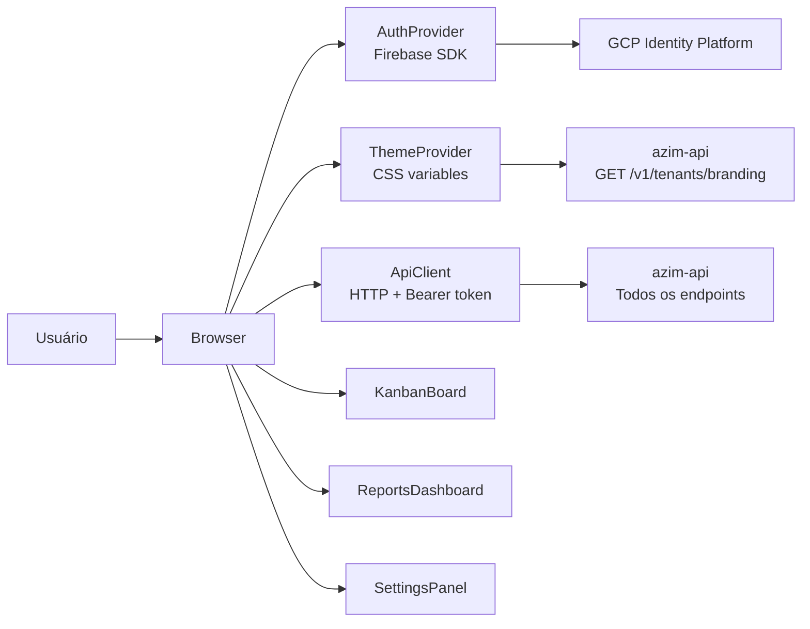

# Module — Azim Web

**Status:** Rascunho para revisão
**Fase:** Fase 1 MVP

---

## 1. Visão Geral

Frontend SPA (Single Page Application) em React + TypeScript. Interface única multi-tenant do Azim CRM com theming white-label por tenant via CSS variables, autenticação via Firebase SDK e consumo exclusivo da API REST do azim-api. Responsiva e com suporte a WCAG AA.

---

## 2. Classificação

| Item | Valor |
|---|---|
| Tipo de Módulo | Frontend SPA |
| Deployable Candidato | azim-web (GCP Cloud Run ou Firebase Hosting) |
| Bounded Context Relacionado | — (consome múltiplos BCs via azim-api) |
| Subdomínio DDD | Cross-cutting (Interface) |
| Tier / Criticidade | Tier 1 — canal único de acesso dos usuários ao CRM |
| Status | Rascunho para revisão |

---

## 3. Objetivo

Prover a interface de usuário do Azim CRM: Kanban de oportunidades por BU, gestão de contas e contatos, parceiros, atividades, metas, relatórios, configurações de organização e branding. Aplicar theming white-label do tenant via CSS variables obtidas da API de branding.

---

## 4. Responsabilidades

- Autenticar usuário via Firebase SDK (GCP Identity Platform) e passar ID token para o azim-api.
- Aplicar theming white-label (logo, favicon, cores primária/secundária) via CSS variables do tenant.
- Renderizar Kanban de oportunidades por BU com filtros e drag-and-drop.
- Exibir e interagir com: contas, contatos, parceiros, atividades, metas, relatórios e configurações.
- Exibir trilha de auditoria para TAdmin e GestorBU.
- Suportar responsividade e acessibilidade WCAG AA.
- Gerenciar estado de autenticação e sessão do usuário.

---

## 5. Fora de Escopo

- Lógica de negócio (todas as regras pertencem ao azim-api).
- BFF dedicado (Fase 1 consome azim-api diretamente — Ponto a Validar).
- App mobile nativo (fora do MVP).
- Funcionalidades de Fase 2 e Fase 3 (workflow editor, IA copilot).

---

## 6. Capacidades Atendidas

| Código | Capability | Descrição |
|---|---|---|
| CAP-01 ao CAP-09 | Todas as capacidades de Fase 1 | Interface para todas as funcionalidades do MVP |
| CAP-10 | Gestão de Organização | BUs, usuários, papéis, configurações |
| CAP-13 | Migração de Planilha | Interface de upload e dry-run (somente PlatOp) |

---

## 7. Bounded Context e Linguagem Ubíqua

| Termo | Definição |
|---|---|
| white-label | Theming visual por tenant: logo, favicon, cor primária, cor secundária |
| CSS variables | Mecanismo de aplicação do theming: `--primary-color`, `--secondary-color`, `--logo-url` |
| Kanban View | Visualização de oportunidades em colunas por estágio, com drag-and-drop |
| SPA | Single Page Application — navegação sem reload de página; estado gerenciado no cliente |
| ID token | JWT emitido pelo Firebase SDK; enviado como Bearer token em cada requisição ao azim-api |

---

## 8. Componentes Internos Candidatos

| Componente | Tipo | Responsabilidade |
|---|---|---|
| AuthProvider | Adapter | Gerencia estado de autenticação via Firebase SDK |
| ThemeProvider | Adapter | Aplica CSS variables do branding do tenant |
| ApiClient | Adapter | HTTP client configurado com Bearer token e interceptadores |
| KanbanBoard | UI Component | Kanban de oportunidades por BU com drag-and-drop |
| OpportunityForm | UI Component | Formulário de criação e edição de oportunidades |
| AccountList / AccountDetail | UI Component | Lista e detalhe de contas com visão 360° |
| ReportsDashboard | UI Component | Funil, forecast, ranking e comissões |
| SettingsPanel | UI Component | Configurações de BU, estágios, usuários, branding |
| AuditLogViewer | UI Component | Trilha de auditoria para TAdmin/GestorBU |

---

## 9. APIs Principais

Este módulo não expõe API. Consome exclusivamente a API REST do azim-api.

Integrações de frontend:
- Firebase SDK para autenticação (login, ID token, sessão)
- azim-api: todos os endpoints REST v1
- GCP Cloud Storage: URLs de logo e favicon do branding

---

## 10. Eventos Publicados

Este módulo não publica eventos de domínio próprios.

---

## 11. Eventos Consumidos

Este módulo não consome eventos diretamente.

---

## 12. Dados Próprios

Este módulo é stateless do lado do servidor. Estado de cliente gerenciado via React state/context ou biblioteca de estado (a definir).

---

## 13. Integrações

| Sistema/Módulo | Tipo de Integração | Direção | Observações |
|---|---|---|---|
| azim-api | HTTP REST | Saída | Todos os endpoints de negócio via Bearer token |
| GCP Identity Platform | Firebase SDK | Bidirecional | Login, logout, renovação de token |
| GCP Cloud Storage | URL direta | Entrada | Logo e favicon do branding do tenant |

---

## 14. Dependências

### 14.1 Dependências de Domínio

- azim-api: toda a lógica de domínio; SPA é puramente de apresentação.

### 14.2 Dependências Técnicas

- React + TypeScript
- Firebase SDK (GCP Identity Platform — autenticação)
- Biblioteca de UI (a definir — avaliar shadcn/ui, Tailwind CSS)
- Biblioteca de drag-and-drop para Kanban (a definir — avaliar dnd-kit)
- GCP Firebase Hosting ou Cloud Run para servir a SPA

### 14.3 Dependências Operacionais

- CORS configurado no azim-api para o domínio do azim-web
- CDN para assets estáticos
- Variável de ambiente: URL base do azim-api

---

## 15. Requisitos Não Funcionais Relevantes

| Categoria | Requisito / Observação |
|---|---|
| Usabilidade | WCAG AA obrigatório (RN-020); responsivo para desktop e tablet |
| Performance | Kanban fluido com centenas de oportunidades; virtualização de lista quando necessário |
| Segurança | ID token nunca armazenado em localStorage — usar sessionStorage ou cookie HttpOnly |
| Observabilidade | Erros de frontend devem ser capturados e reportados (Cloud Error Reporting ou equivalente) |

---

## 16. Compliance Aplicável

| Compliance / Norma / Lei | Aplicável? | Motivo | Impacto no Módulo |
|---|---|---|---|
| LGPD | Sim (marginal) | Exibe PII de contatos e usuários obtida do azim-api | Não cachear PII em localStorage; exibir apenas dados autorizados pelo papel |
| PCI DSS | Não aplicável | Não processa dados de cartão | — |

---

## 17. Observabilidade

| Item | Recomendação Inicial |
|---|---|
| Logs | Erros de JS capturados via error boundary e reportados ao Cloud Error Reporting |
| Métricas | Core Web Vitals (LCP, FID, CLS) monitorados via Google Analytics ou equivalente |
| Alertas | Alerta se taxa de erro JS aumentar acima do baseline |

---

## 18. Diagramas do Módulo

### 18.1 Diagrama de Componentes Internos

---

## 19. Riscos

| Código | Risco | Impacto | Mitigação |
|---|---|---|---|
| RISK-WEB-01 | ID token armazenado de forma insegura | Risco de XSS com token exposto | Usar sessionStorage ou cookie HttpOnly; não usar localStorage para tokens |
| RISK-WEB-02 | Kanban lento com muitas oportunidades | Experiência degradada | Virtualização de lista; paginação no Kanban se necessário |

---

## 20. Pontos a Validar

| Código | Ponto | Impacto | Recomendação |
|---|---|---|---|
| VAL-WEB-01 | BFF (Backend for Frontend) dedicado vs consumo direto do azim-api | Agregação de requisições e segurança | Manter consumo direto na Fase 1; avaliar BFF na Fase 2 se necessário |
| VAL-WEB-02 | Biblioteca de UI: shadcn/ui + Tailwind vs outra | Define padrão de componentes visuais | Decidir antes de iniciar a implementação do frontend |
| VAL-WEB-03 | Hospedagem: Firebase Hosting vs Cloud Run para azim-web | Define pipeline de deploy | Firebase Hosting mais simples para SPA estática |

---

## 21. Backlog Inicial Sugerido

| Tipo | Item | Descrição |
|---|---|---|
| Epic | Frontend SPA — MVP | Interface completa do Azim CRM para Fase 1 |
| Story Técnica | Setup de projeto React + TypeScript + Firebase SDK | Scaffolding, autenticação, roteamento |
| Story Técnica | ThemeProvider com CSS variables do branding do tenant | Theming white-label por tenant |
| Story Técnica | KanbanBoard de oportunidades por BU | Drag-and-drop, filtros, cards de oportunidade |
| Story Técnica | Formulário de criação e edição de oportunidade | Todos os campos obrigatórios e validações do FRD |
| Story Técnica | Telas de contas, contatos, parceiros e atividades | CRUD básico com visão 360° de conta |
| Story Técnica | Dashboard de relatórios | Funil, forecast, ranking, comissões |
| Story Técnica | Painel de configurações (organização, branding) | BUs, usuários, estágios, canais, motivos de perda |

---

## 22. Referências

| Documento | Seção |
|---|---|
| DDD Segmentation | §7 Deployables — azim-web |
| DDD Segmentation | §9 Módulos Funcionais |
| NFRD | Usabilidade — WCAG AA; performance de Kanban |
