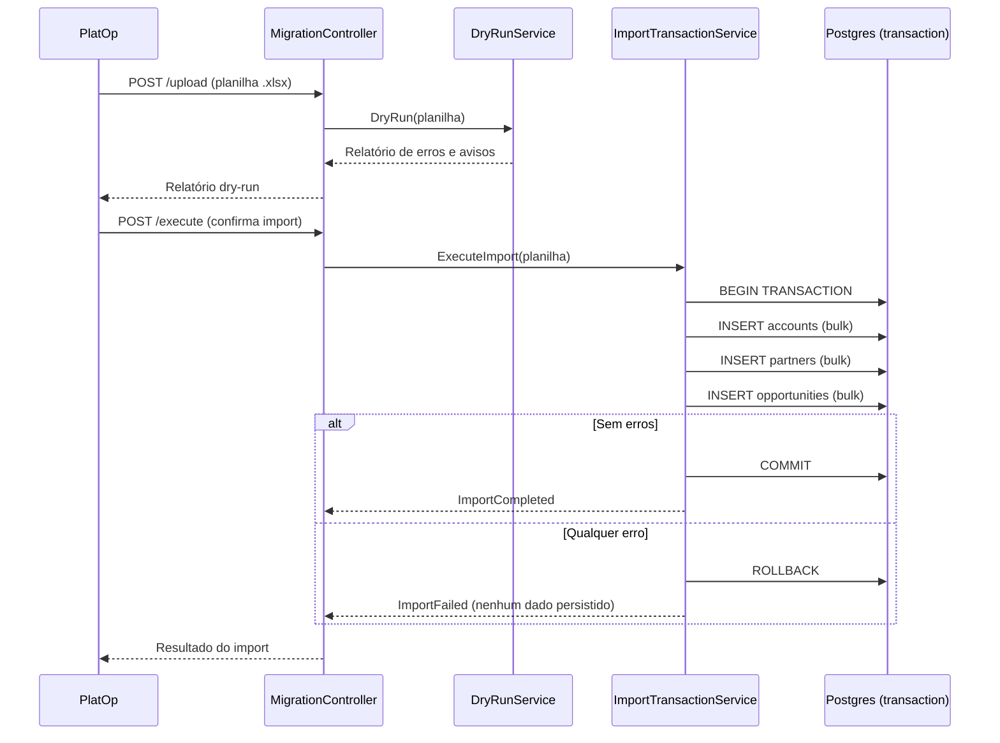

# Module — Data Migration

**Status:** Rascunho para revisão
**Fase:** Fase 1 MVP (temporário — candidato à remoção após Fase 1)

---

## 1. Visão Geral

Módulo temporário da Fase 1 responsável pela importação transacional da planilha Excel "Pipeline Vellus.xlsx" (108 oportunidades, 3 BUs) para o banco de dados do Azim CRM. Implementa dry-run com triagem assistida e import transacional com rollback total (RN-023). Deve ser removido ou arquivado após a conclusão da migração (DDD-VAL-03).

---

## 2. Classificação

| Item | Valor |
|---|---|
| Tipo de Módulo | Application Module (temporário) |
| Deployable Candidato | azim-api |
| Bounded Context Relacionado | Data Migration (BC-09) |
| Subdomínio DDD | Supporting Subdomain (temporário) |
| Tier / Criticidade | Tier 3 — uso pontual; falha não afeta operação do CRM |
| Status | Rascunho para revisão |

---

## 3. Objetivo

Realizar a importação única e controlada da planilha de pipeline da Vellus para o banco do Azim CRM. Garantir: dry-run para triagem antes da importação real, import transacional com rollback total em caso de erro (RN-023), e tempo de execução total ≤ 5 minutos (NFR-PERF-06).

---

## 4. Responsabilidades

- Upload e parsing da planilha Excel (Pipeline Vellus.xlsx).
- Dry-run: validar dados, listar erros e inconsistências sem escrever no banco.
- Triagem assistida: exibir resultados do dry-run para o operador antes da execução real.
- Import transacional: criar contas, parceiros e oportunidades em uma única transação com rollback total em falha (RN-023).
- Registrar job de migração e log de cada linha importada em migration_jobs e migration_logs.
- Congelar a planilha após import bem-sucedido (orientação operacional).

---

## 5. Fora de Escopo

- Import contínuo ou ETL recorrente (módulo é de uso único na Fase 1).
- Import de outros formatos além de Excel (.xlsx) no MVP.
- Dedupe automática de contas durante o import (triagem manual pelo operador).
- Migração de histórico de atividades (fora do MVP — apenas oportunidades ativas).

---

## 6. Capacidades Atendidas

| Código | Capability | Descrição |
|---|---|---|
| CAP-13 | Migração de Planilha | Dry-run, triagem, import transacional da planilha Pipeline Vellus.xlsx |

---

## 7. Bounded Context e Linguagem Ubíqua

| Termo | Definição |
|---|---|
| dry-run | Execução simulada do import sem escrita no banco; retorna lista de erros e avisos |
| triagem assistida | Revisão humana dos resultados do dry-run antes de confirmar o import |
| import transacional | Import real em uma única transação de banco de dados com rollback total em caso de falha |
| rollback total | Em caso de qualquer erro durante o import, nenhum registro é persistido (RN-023) |
| congelamento | Instrução operacional: planilha original não deve ser alterada após import bem-sucedido |
| migration_job | Registro de uma execução de migração (tentativa de import) |
| migration_log | Registro por linha: status (ok, erro, aviso) e mensagem |

---

## 8. Componentes Internos Candidatos

| Componente | Tipo | Responsabilidade |
|---|---|---|
| SpreadsheetParser | Adapter | Parsing do arquivo .xlsx para objetos de domínio de migração |
| DryRunService | Domain Service | Valida dados sem escrever; retorna lista de erros e avisos |
| ImportTransactionService | Domain Service | Executa import em transação atômica; chama APIs dos módulos destino |
| MigrationJobRepository | Repository | Escrita em migration_jobs e migration_logs |
| MigrationController | API Controller | Endpoints de upload, dry-run, execução e status |

---

## 9. APIs Principais

| Método | Endpoint | Finalidade | Consumidores |
|---|---|---|---|
| POST | /v1/migrations/upload | Upload da planilha Excel | PlatOp |
| POST | /v1/migrations/{jobId}/dry-run | Executar dry-run e retornar relatório | PlatOp |
| POST | /v1/migrations/{jobId}/execute | Executar import real (requer confirmação explícita) | PlatOp |
| GET | /v1/migrations/{jobId}/status | Status e log da execução | PlatOp |

---

## 10. Eventos Publicados

| Evento | Quando é publicado | Consumidores |
|---|---|---|
| ImportCompleted | Após import bem-sucedido | audit-log |

---

## 11. Eventos Consumidos

Este módulo não consome eventos diretamente.

---

## 12. Dados Próprios

| Entidade/Tabela | Tipo | Banco/Persistência | Observações |
|---|---|---|---|
| migration_jobs | Log (temporário) | Cloud SQL / Postgres | Registro de cada tentativa de import |
| migration_logs | Log (temporário) | Cloud SQL / Postgres | Log por linha da planilha; pode ser removido após Fase 1 |

---

## 13. Integrações

| Sistema/Módulo | Tipo de Integração | Direção | Observações |
|---|---|---|---|
| opportunity-pipeline | API HTTP (interna) | Saída | Cria oportunidades via ImportTransactionService |
| account-management | API HTTP (interna) | Saída | Cria contas via ImportTransactionService |
| partner-management | API HTTP (interna) | Saída | Cria parceiros via ImportTransactionService |
| organization | API HTTP (interna) | Entrada | Lê bu_id e stage_id antes do import (DEP-04) |
| audit-log | Package (AuditService) | Saída | ImportCompleted gera AuditEvent |

---

## 14. Dependências

### 14.1 Dependências de Domínio

- organization: BUs e estágios devem estar configurados antes do import (DEP-04).
- account-management: API de criação de contas.
- partner-management: API de criação de parceiros.
- opportunity-pipeline: API de criação de oportunidades.

### 14.2 Dependências Técnicas

- Biblioteca de parsing de .xlsx (.NET: ClosedXML ou NPOI)
- Cloud SQL / Postgres (tabelas migration_jobs, migration_logs)
- Transação distribuída limitada ao mesmo banco (Postgres)

### 14.3 Dependências Operacionais

- BUs e estágios configurados no tenant Vellus antes do import
- Planilha Pipeline Vellus.xlsx validada e congelada pelo operador antes do import
- Rollback manual testado em ambiente stg antes da execução em produção

---

## 15. Requisitos Não Funcionais Relevantes

| Categoria | Requisito / Observação |
|---|---|
| Performance | Import de 108 oportunidades em ≤ 5 minutos (NFR-PERF-06) |
| Resiliência | Rollback total em caso de qualquer erro (RN-023) — nenhum dado parcial |
| Observabilidade | Log detalhado por linha da planilha; status de cada registro |

---

## 16. Compliance Aplicável

| Compliance / Norma / Lei | Aplicável? | Motivo | Impacto no Módulo |
|---|---|---|---|
| LGPD | Sim | Planilha pode conter nomes de contatos (PII) | Validar tratamento de PII durante o import; não logar PII nos migration_logs |
| PCI DSS | Não aplicável | Não processa dados de cartão | — |

---

## 17. Observabilidade

| Item | Recomendação Inicial |
|---|---|
| Logs | Log por linha: índice da linha, status (ok/erro/aviso), mensagem; sem PII nos logs |
| Métricas | migration_rows_processed_total, migration_rows_failed_total, migration_duration_seconds |
| Alertas | Não crítico — notificação ao PlatOp via log ao final da execução |

---

## 18. Diagramas do Módulo

### 18.1 Diagrama de Fluxo — Import Transacional

---

## 19. Riscos

| Código | Risco | Impacto | Mitigação |
|---|---|---|---|
| RISK-MIGR-01 | Dados incompletos ou incorretos na planilha | Import parcialmente inválido | Dry-run obrigatório antes do execute; operador revisa antes de confirmar |
| RISK-MIGR-02 | Rollback falha por timeout no Postgres | Dados parcialmente importados | Testar rollback em ambiente stg com volume real antes do go-live |
| RISK-MIGR-03 | PII de contatos nos logs de migração | Violação de LGPD | Não logar nome, e-mail ou telefone nos migration_logs |

---

## 20. Pontos a Validar

| Código | Ponto | Impacto | Recomendação |
|---|---|---|---|
| VAL-MIGR-01 | Remoção do módulo data-migration após Fase 1 (DDD-VAL-03) | Limpeza arquitetural | Arquivar módulo e remover tabelas migration_* após confirmação do import |
| VAL-MIGR-02 | Import de atividades históricas além das oportunidades | Define escopo do import | Confirmar com produto se histórico de atividades precisa ser importado |

---

## 21. Backlog Inicial Sugerido

| Tipo | Item | Descrição |
|---|---|---|
| Epic | Migração da Planilha Pipeline Vellus | Import transacional com dry-run da planilha Excel |
| Story Técnica | Parsing do arquivo .xlsx | SpreadsheetParser para Pipeline Vellus.xlsx com mapeamento de colunas |
| Story Técnica | Dry-run com relatório de erros | DryRunService retorna lista de erros e avisos por linha |
| Story Técnica | Import transacional com rollback total | ImportTransactionService em transação única do Postgres |
| Task | Endpoint POST /v1/migrations/upload | Upload da planilha |
| Task | Endpoint POST /v1/migrations/{id}/execute com confirmação explícita | Dupla confirmação antes do import real |
| Task | Teste em ambiente stg com dados reais antes do go-live | Rollback testado com volume de 108 linhas |

---

## 22. Referências

| Documento | Seção |
|---|---|
| DDD Segmentation | §4.1 BC-09 Data Migration |
| DDD Segmentation | §7 Deployables — azim-api |
| DDD Segmentation | §11 Pontos a Validar — DDD-VAL-03 |
| Data Model | §3 Data Migration (BC-09) |
| Context Map | relations.md — Data Migration → Pipeline, Account, Partner |
