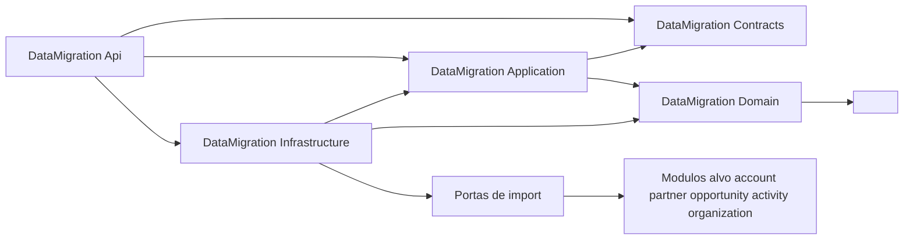
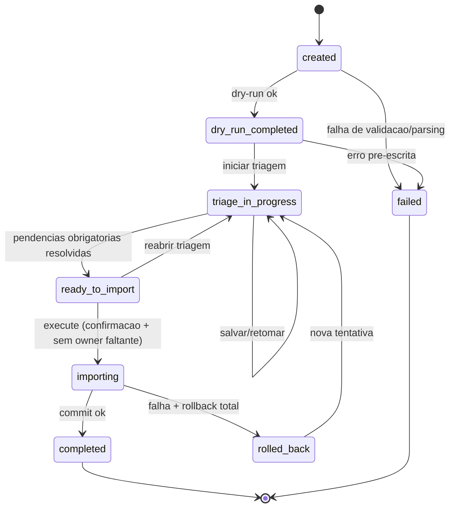
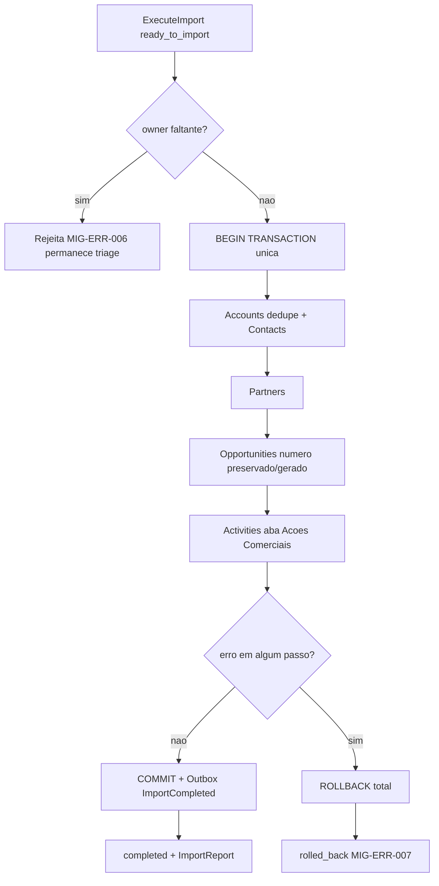
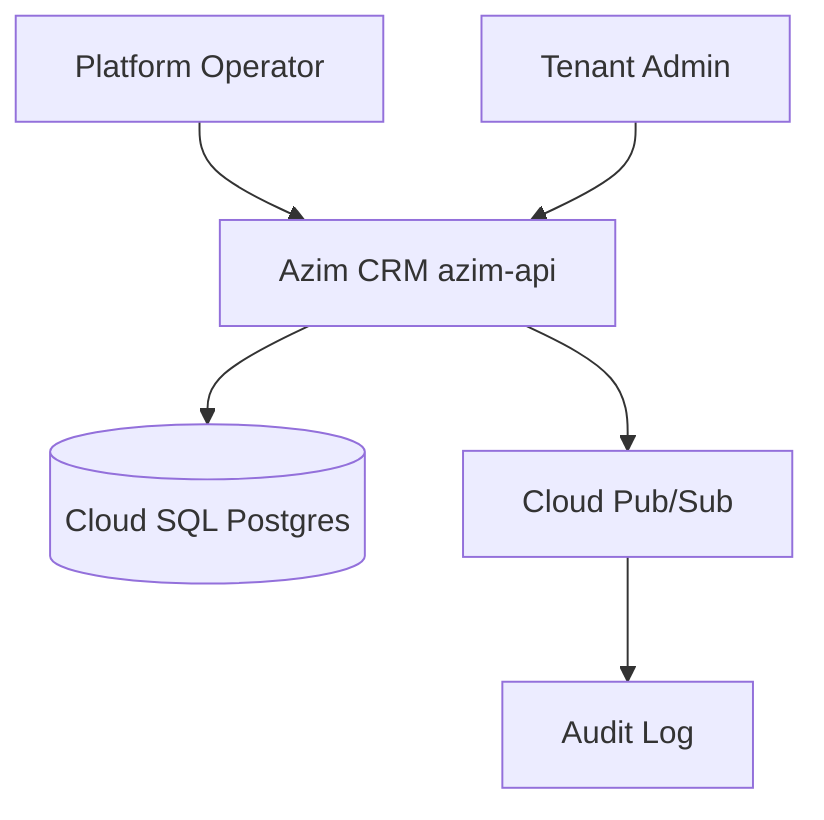
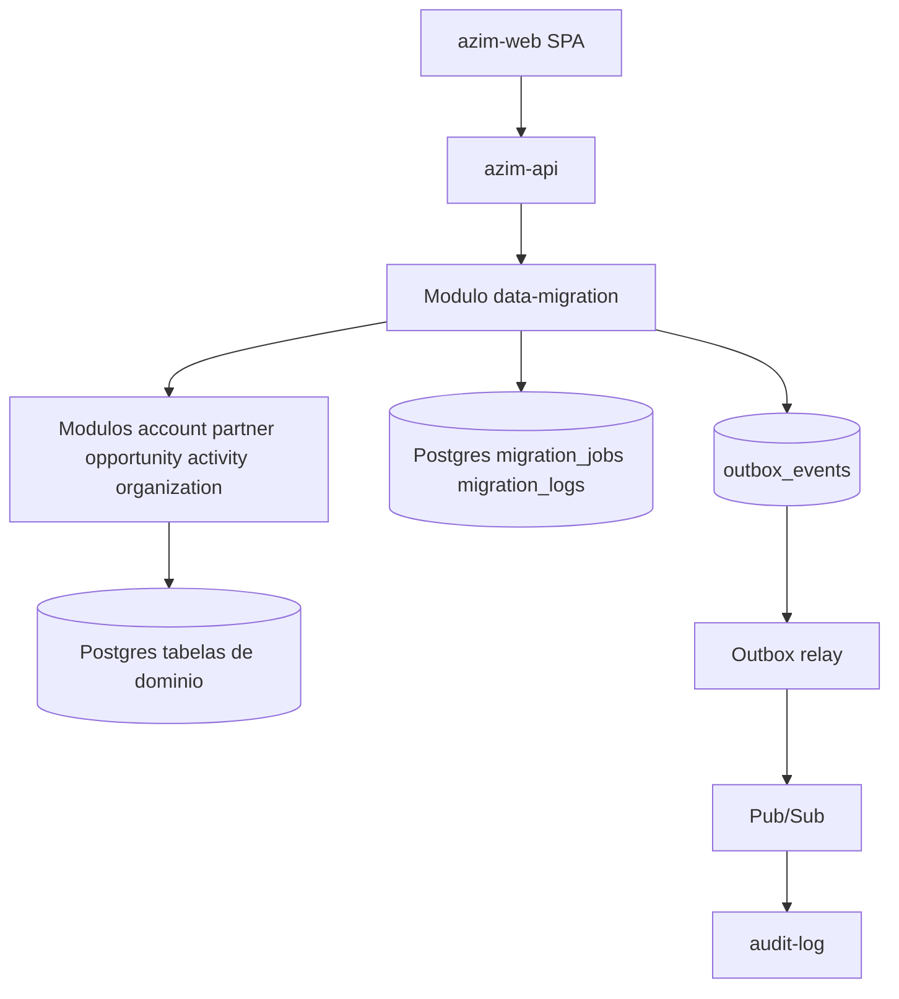
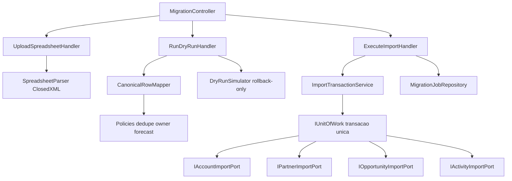
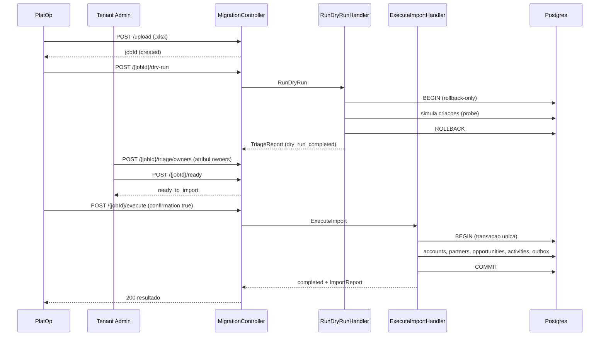

# BC-09 — Data Migration (Migração de Planilha)
**Design Técnico**

- Versão: 0.1.0
- Data: 2026-06-11
- Status: Rascunho para revisão
- Referência base: docs/product/modules/data-migration/requirements.md v0.1.0
- ADRs aplicáveis: ADR-0001 (isolamento multi-tenant em defesa em profundidade — `tenant_id` + EF Core Global Query Filter + RLS obrigatória); ADR-0003 (unicidade de `opportunity_number` por tenant, referenciada no requirements e no data-model)
- Rules aplicáveis: `.forge/rules/architecture/clean-architecture.md`, `.forge/rules/architecture/api-and-contracts.md`, `.forge/rules/architecture/ddd.md`, `.forge/rules/architecture/observability.md`, `.forge/rules/architecture/security-and-compliance.md`, `.forge/rules/conventions/database-naming.md`, `.forge/rules/domain/money-as-cents.md`, `.forge/rules/domain/nbr-5891-rounding.md`, `.forge/rules/domain/audit-immutability.md`

## Histórico de Versões

| Versão | Data | Status | Descrição da alteração |
|--------|------|--------|------------------------|
| 0.1.0 | 2026-06-11 | Rascunho para revisão | Criação inicial do design técnico derivado do requirements.md v0.1.0 |

## 1. Visão Geral

Este documento especifica o **como** do módulo **data-migration** (BC-09, Supporting Subdomain SD-11, deployable `azim-api`), derivado do `requirements.md` v0.1.0 aprovado para revisão. É um **módulo temporário da Fase 1**: realiza a importação única, controlada e auditável da planilha `Pipeline Vellus.xlsx` para as entidades de domínio do Azim e é candidato à remoção após a Fase 1 (Req 14, DDD-VAL-03).

O processo é estritamente sequenciado em cinco etapas: **upload (.xlsx) → dry-run (simulação sem efeitos colaterais, com relatório de triagem) → triagem assistida (resolução de pendências) → import transacional (tudo ou nada) → relatório final auditado + congelamento da planilha de origem**.

O agregado próprio do módulo é o `MigrationJob`, com máquina de estados linear (`created → dry_run_completed → triage_in_progress → ready_to_import → importing → completed | rolled_back | failed`). O módulo **não possui modelo de domínio de negócio próprio das entidades-alvo**: ele orquestra a criação de `Account`, `Contact`, `Partner`, `Opportunity` e `Activity`, que pertencem a outros bounded contexts, respeitando integralmente as invariantes de cada agregado (owner obrigatório, dedupe de conta, numeração imutável, money em centavos).

Pontos arquiteturais centrais:

1. **Atomicidade tudo-ou-nada (RN-023):** todo o import roda em **uma única transação do PostgreSQL** com rollback total em qualquer falha. Isso impõe execução **in-process** dos casos de uso dos módulos-alvo dentro de um `UnitOfWork` compartilhado — não via HTTP (ver DD-001).
2. **Isolamento multi-tenant em profundidade (ADR-0001):** todas as tabelas (`migration_jobs`, `migration_logs` e as tabelas-alvo) carregam `tenant_id UUID NOT NULL`, têm EF Core Global Query Filter e **RLS obrigatória** com `app.current_tenant`. A migração opera exclusivamente no escopo do tenant Vellus (nº 1).
3. **Dry-run sem efeitos colaterais:** a simulação reusa o mesmo motor de mapeamento e validação do import, mas dentro de uma transação marcada para rollback incondicional (ver DD-001 e §5.3).
4. **PII fora dos logs (RNF 3):** `migration_logs` registra apenas índice da linha, status e mensagem técnica; nome/e-mail/telefone de contatos nunca são logados.

O módulo é organizado em Clean Architecture (.NET 10, 5 projetos + testes), seguindo o padrão dos demais módulos do `azim-api`.

### 1.1 Rastreabilidade requisito → design (mapa-mestre)

| Requisito | Elementos de design |
|-----------|---------------------|
| Req 1 — Upload .xlsx | `UploadSpreadsheetCommand`/Handler, `SpreadsheetParser` (ClosedXML, DD-002), validação de formato/estrutura, `MigrationJob` em `created`, erros MIG-ERR-001/002 (§5.1, §6.4, §8) |
| Req 2 — Dry-run sem efeitos colaterais | `RunDryRunCommand`/Handler, `DryRunSimulator` em transação rollback-only (DD-001), objeto de valor `ForecastDivergence`, relatório `TriageReport` (§4.3, §5.1, §5.3, §8) |
| Req 3 — Mapeamento canônico de colunas | `ColumnMapping` (objeto de valor), `SourceRow`, `CanonicalRowMapper`, trim/normalização (§4.3, §5.5) |
| Req 4 — Triagem obrigatória de owners | `AssignOwnerCommand`/`BulkAssignOwnerCommand`, invariante `MigrationJob.CanTransitionToImporting`, PBT-07, erro MIG-ERR-006 (§4.1, §4.5, §5.1) |
| Req 5 — Triagem de estágios/parceiros | `ResolveStagePendingCommand`, `ResolvePartnerPctCommand`, flags não bloqueantes (§4.6, §5.1) |
| Req 6 — Import transacional tudo-ou-nada | `ExecuteImportCommand`/Handler, `ImportTransactionService`, `IUnitOfWork` único, rollback total, `migration_logs`, erro MIG-ERR-007 (§5.3, §6.1, §6.5) |
| Req 7 — Contas com dedupe + contatos | `AccountDedupePolicy`, objeto de valor `NormalizedName` (reuso de account-management), `IAccountImportPort`, par candidato a dedupe na triagem (§4.6, §6.4) |
| Req 8 — Número AZ-NNNN preservado/gerado | `OpportunityNumberAllocator`, `IOpportunityNumberPort`, preservação + sequência ≥95, unicidade por tenant, PBT-05 (§4.3, §6.4, §7) |
| Req 9 — Datas serial Excel → ISO | objeto de valor `ExcelSerialDate` (epoch 1899-12-30), PBT-03 (§4.3, §5.5) |
| Req 10 — Atividades (aba Ações Comerciais) | `IActivityImportPort`, resolução de FK por `opportunity_number`, mapa de typos de owner, status `aviso` (§5.3, §6.4) |
| Req 11 — Relatório final auditado + evento | `ImportReport`, evento `ImportCompleted`, Outbox → audit-log, append-only (§5.3, §6.6, §9, §11) |
| Req 12 — Idempotência do import | `import_key` por linha (DD-003), `rolled_back` reexecutável, PBT-02 (§6.5) |
| Req 13 — Congelamento da planilha | instrução operacional no `ImportReport` + auditoria; módulo não altera o arquivo (DD-010, §5.3) |
| Req 14 — Ciclo de vida temporário | feature flag `migration.import_enabled`, plano de remoção, sem dependência reversa (DD-009, §2, §18) |
| RNF 1 — Desempenho dry-run/import | processamento em lote, índices, métrica `migration_duration_seconds`, teste de carga 108/500 (§13, §15) |
| RNF 2 — Isolamento por tenant | `tenant_id` + EF Global Filter + RLS (ADR-0001), DD-008 (§6.1, §7, §10, §14) |
| RNF 3 — PII fora dos logs | `migration_logs` sem PII, `PiiSafeLogger`, mensagens por índice de linha (§6.6, §10, §11) |
| RNF 4 — Auditoria append-only | evento `ImportCompleted` → `audit_logs` append-only; `migration_logs` reconstrói o processado (§9, §11) |
| RNF 5 — Resiliência/atomicidade | transação única Postgres, rollback testado em staging, PBT-01 (§6.1, §13) |
| RNF 6 — Observabilidade | métricas `migration_rows_*`, logs estruturados, notificação ao PlatOp (§11) |
| PBT-01 — Atomicidade | teste de propriedade sobre `ImportTransactionService` (§13) |
| PBT-02 — Idempotência da reexecução | teste de propriedade com `import_key` (§13) |
| PBT-03 — Round-trip de datas | teste de propriedade sobre `ExcelSerialDate` (§13) |
| PBT-04 — Conservação de contagem | teste de propriedade sobre dedupe + mapeamento (§13) |
| PBT-05 — Preservação/unicidade AZ-NNNN | teste de propriedade sobre `OpportunityNumberAllocator` (§13) |
| PBT-06 — Divergência de forecast | teste de propriedade sobre `ForecastDivergence` (§13) |
| PBT-07 — Owner obrigatório (state machine) | teste de propriedade sobre `MigrationJob` (§13) |

## 2. Princípios e Decisões Macro

- **Temporário e isolável (Req 14, DD-009):** o módulo é empacotado em `azim-api` mas com fronteira clara; o endpoint de import é protegido por feature flag `migration.import_enabled`. Após a confirmação da migração da Fase 1, a flag é desligada e o módulo (com as tabelas `migration_jobs`/`migration_logs`) é candidato a remoção sem deixar dependências reversas nos módulos de domínio.
- **In-process, não HTTP (DD-001):** a atomicidade tudo-ou-nada (RN-023) é incompatível com chamadas HTTP entre módulos (cada HTTP teria sua própria transação). O import invoca **casos de uso/repositórios dos módulos-alvo dentro de um `UnitOfWork` compartilhado** (mesmo `DbContext`/transação Postgres). Isso supera a indicação de "API HTTP interna" do README do módulo, que deve ser corrigida (§19).
- **Respeito às invariantes dos agregados-alvo:** o módulo nunca escreve diretamente nas tabelas de outros BCs por SQL bruto. Usa as fábricas/serviços de aplicação de cada módulo (`IAccountImportPort`, `IPartnerImportPort`, `IOpportunityImportPort`, `IActivityImportPort`), garantindo owner obrigatório (RN-002), dedupe (RN-014), numeração imutável (RN-001), money em centavos (DEC-011).
- **Defesa em profundidade (ADR-0001):** RLS obrigatória em todas as tabelas tocadas; sem dispensa por omissão.
- **Money em centavos (`.forge/rules/domain/money-as-cents.md`):** todos os valores monetários (`valor_setup`, `valor_mensal`, `forecast_ponderado`) são `BIGINT` em centavos. Proibido `float`/`double`; `decimal` não é usado em cálculo monetário de domínio.
- **Arredondamento NBR 5891 (`nbr-5891-rounding.md`):** o forecast recalculado usa arredondamento bancário (round-half-to-even) ao centavo (PBT-06, DD-005).
- **Determinismo e auditabilidade:** dry-run e import compartilham o mesmo pipeline de mapeamento/validação, diferindo apenas no commit, para que o relatório de dry-run seja fiel ao import.

## 3. Estrutura da Solução

Clean Architecture, projetos físicos (.NET 10):

```text
DataMigration.Domain          -> ∅ (sem dependências de infraestrutura)
DataMigration.Application      -> Domain, Contracts
DataMigration.Infrastructure   -> Application, Domain
DataMigration.Api              -> Application, Infrastructure, Contracts
DataMigration.Contracts        -> ∅
```

Projetos de teste:

```text
DataMigration.Domain.Tests
DataMigration.Application.Tests
DataMigration.Infrastructure.Tests
DataMigration.Api.Tests
DataMigration.Architecture.Tests
```

Fronteiras com módulos-alvo: o `DataMigration.Application` depende de **portas** (`IAccountImportPort`, `IPartnerImportPort`, `IOpportunityImportPort`, `IActivityImportPort`, `IOpportunityNumberPort`, `IOrganizationReadPort`) definidas em `DataMigration.Application`. Os adaptadores em `DataMigration.Infrastructure` traduzem para os serviços de aplicação dos respectivos módulos (account-management, partner-management, opportunity-pipeline, activity-management, organization), todos compartilhando o mesmo `IUnitOfWork`/transação. Nenhuma dependência inversa: os módulos de domínio não conhecem `data-migration` (Req 14.2).



A regra de dependência é validada por `DataMigration.Architecture.Tests` (NetArchTest), incluindo a proibição de o Domain referenciar EF Core, ClosedXML ou qualquer SDK de infraestrutura.

## 4. Modelo de Domínio

### 4.1 Aggregates

**`MigrationJob`** (Aggregate Root) — única raiz do módulo. Representa uma tentativa de migração e seu ciclo de vida. Protege as invariantes:

- A transição de estado só ocorre por métodos do agregado; transições inválidas lançam `InvalidMigrationStateTransition` (MIG-ERR-005).
- `CanTransitionToImporting()` só retorna verdadeiro quando **nenhuma** oportunidade triada está sem owner (PBT-07, Req 4.3).
- O resultado do dry-run (`TriageReport`) e o estado de triagem (`TriageResolution`) são mantidos como parte do agregado (snapshot), permitindo salvar/retomar (Req 4.4).
- Metadados do arquivo (nome, tamanho, hash, contagem de linhas) são imutáveis após `created`.

O `MigrationJob` **não contém** as entidades-alvo; ele referencia o resultado da simulação/import por contagens e logs, mantendo a fronteira transacional curta para o seu próprio estado e delegando a escrita de domínio às portas.

### 4.2 Entidades

| Entidade | Pertence a | Papel no import |
|----------|-----------|-----------------|
| `MigrationLogEntry` | `MigrationJob` (filha) | Uma por linha processada: índice, status (`ok`/`aviso`/`erro`), mensagem técnica (sem PII). |

As entidades de negócio criadas no import — `Account`, `Contact`, `Partner`, `Opportunity`, `Activity` — **não pertencem a este módulo**; são criadas pelos agregados dos módulos-alvo via portas (§6.4), preservando suas próprias invariantes.

### 4.3 Objetos de valor

| Objeto de valor | Definição | Requisito |
|-----------------|-----------|-----------|
| `SourceRow` | Linha bruta da planilha (aba + índice + células), imutável; igualdade por valor. Base do parsing. | Req 1, Req 3 |
| `ColumnMapping` | Mapa imutável coluna-da-planilha → entidade/campo de destino, com transformação associada (trim, normalização, conversão). | Req 3 |
| `ExcelSerialDate` | Conversão serial Excel ↔ ISO usando epoch **1899-12-30**; valor vazio → data nula sem erro; round-trip exato. | Req 9, PBT-03 |
| `NormalizedName` | Nome de conta normalizado para dedupe (reuso da definição de account-management). | Req 7, PBT-04 |
| `Money` | Valor em centavos inteiros (BIGINT), BRL. Proíbe float/double. | Req 3.6 |
| `OpportunityNumber` | `AZ-NNNN` imutável; preservado da planilha ou alocado da sequência do tenant (≥95). | Req 8, PBT-05 |
| `ForecastDivergence` | Resultado de `round_half_even(valor_total × probabilidade / 100)` em centavos vs `Forecast (R$)` da planilha; listada somente quando |Δ| > 1 centavo. | Req 2.3, PBT-06 |
| `TriageFlag` | Marcação de pendência: tipo (`owner_missing`, `stage_missing`, `partner_pct_missing`, `dedupe_candidate`, `bu_unknown`, `typo`), severidade (`blocking`/`non_blocking`), referência por índice. | Req 2, Req 4, Req 5 |

Objetos de valor são imutáveis e têm igualdade por valor. Não se usa a abreviação "VO".

### 4.4 Domain Events

| Evento | Quando | Consumidor |
|--------|--------|-----------|
| `DryRunCompleted` | Dry-run concluído; `TriageReport` disponível. | audit-log (registro do dry-run), observabilidade |
| `ImportCompleted` | Import transacional concluído com sucesso e relatório final emitido. | audit-log (append-only, RNF 4) |
| `ImportRolledBack` | Falha durante o import; rollback total executado. | audit-log, observabilidade |

Eventos nomeados no passado. `ImportCompleted` é o evento de integração público (publicado via Outbox → Pub/Sub, §9); os demais são de domínio/observabilidade. Não há PII em nenhum payload.

### 4.5 State Machines

Máquina de estados do `MigrationJob` (lista canônica do requirements §4):



Invariante crítica (PBT-07): a aresta `ready_to_import → importing` é guardada por `CanTransitionToImporting()`, que exige zero oportunidades sem owner. `failed` e `completed` são terminais; `rolled_back` admite nova tentativa.

### 4.6 Policies / Specifications

| Policy / Specification | Responsabilidade | Requisito |
|------------------------|------------------|-----------|
| `AccountDedupePolicy` | Identifica pares de contas com mesmo `NormalizedName` e os marca como `dedupe_candidate` (não bloqueante; decisão humana — RN-014). | Req 7.1, 7.2 |
| `OwnerRequiredSpecification` | Verdadeira quando toda oportunidade triada tem owner; guarda a transição para `importing`. | Req 4, PBT-07 |
| `StageFallbackPolicy` | Etapa vazia recebe estágio "Lead" com flag de triagem não bloqueante. | Req 5.1 |
| `PartnerPctPendingPolicy` | Parceiro sem percentual vira flag não bloqueante; percentuais não são importados. | Req 5.2, 3.4 |
| `ForecastDivergencePolicy` | Calcula e lista divergências > R$ 0,01 (round-half-even). | Req 2.3, PBT-06 |
| `OwnerTypoMappingPolicy` | Corrige typos conhecidos de responsável (ex.: "Miilton" → Milton) via mapa nome→usuário. | Req 10.3 |

## 5. Application Layer

Padrão: um handler por caso de uso; commands para escrita/transição de estado; queries para leitura; validação sintática na borda; regra de negócio no domínio (`MigrationJob`) e nas policies. Stack de mediação alinhada aos demais módulos do `azim-api` (MediatR ou equivalente); descrita aqui como "handler" sem forçar versão.

### 5.1 Commands

| Command | Efeito | Estado resultante | Requisito |
|---------|--------|-------------------|-----------|
| `UploadSpreadsheetCommand` | Recebe `.xlsx`, valida formato/estrutura, persiste metadados, cria `MigrationJob`. | `created` | Req 1 |
| `RunDryRunCommand` | Executa simulação completa em transação rollback-only; gera `TriageReport`. | `dry_run_completed` | Req 2 |
| `StartTriageCommand` | Abre a triagem assistida. | `triage_in_progress` | Req 4 |
| `AssignOwnerCommand` | Atribui owner a uma oportunidade triada. | `triage_in_progress` | Req 4.1 |
| `BulkAssignOwnerCommand` | Atribui owner a todas as oportunidades de uma BU. | `triage_in_progress` | Req 4.2 |
| `ResolveStagePendingCommand` | Define estágio para linha com etapa vazia (default "Lead"). | `triage_in_progress` | Req 5.1 |
| `ResolvePartnerPctCommand` | Marca percentual de parceiro como definido ou "a definir". | `triage_in_progress` | Req 5.2 |
| `ResolveDedupeCommand` | Decide merge ou manutenção de par candidato a dedupe. | `triage_in_progress` | Req 7.2 |
| `SaveTriageProgressCommand` | Persiste o snapshot da triagem (salvar/retomar). | `triage_in_progress` | Req 4.4 |
| `MarkReadyToImportCommand` | Valida pendências obrigatórias; habilita import. | `ready_to_import` | Req 4.5 |
| `ExecuteImportCommand` | Executa o import transacional tudo-ou-nada (requer confirmação explícita). | `completed` ou `rolled_back` | Req 6, Req 12 |

### 5.2 Queries

| Query | Retorno | Requisito |
|-------|---------|-----------|
| `GetMigrationJobStatusQuery` | Estado do job, contagens, progresso da triagem. | README §9 (status) |
| `GetTriageReportQuery` | Relatório de dry-run (contagens, dedupe, flags, divergências de forecast). | Req 2 |
| `GetImportReportQuery` | Relatório final auditado para download (contagens por entidade, flags resolvidos, divergências). | Req 11 |

### 5.3 Handlers

- **`UploadSpreadsheetHandler`** — chama `SpreadsheetParser` (DD-002) apenas para detectar estrutura/contagem; valida MIME/extensão `.xlsx` (MIG-ERR-001) e colunas esperadas (MIG-ERR-002); persiste `MigrationJob` em `created`. Não persiste conteúdo de domínio (Req 1.4).
- **`RunDryRunHandler`** — abre transação marcada para **rollback incondicional**; roda o pipeline completo (`CanonicalRowMapper` → policies → simulação de criação via portas em modo *probe*), coletando contagens, flags, dedupe e `ForecastDivergence`; ao final **descarta** a transação (nenhuma escrita persiste, Req 2.1) e grava o `TriageReport` no `MigrationJob`. Emite `DryRunCompleted`.
- **`ExecuteImportHandler`** — núcleo da atomicidade (RN-023). Verifica estado `ready_to_import` e confirmação explícita (Req 6.2); aplica `OwnerRequiredSpecification` (PBT-07); abre **uma única transação Postgres** via `IUnitOfWork` e executa, em ordem determinística: (1) contas com dedupe + contatos (`IAccountImportPort`); (2) parceiros (`IPartnerImportPort`); (3) oportunidades com `OpportunityNumberAllocator` (`IOpportunityImportPort`); (4) atividades da aba Ações Comerciais (`IActivityImportPort`), resolvendo FK por `opportunity_number`. Cada linha gera `MigrationLogEntry`. Em sucesso: `COMMIT`, transição para `completed`, grava `ImportReport`, enfileira `ImportCompleted` no Outbox (mesma transação) e registra a instrução de congelamento (Req 13). Em qualquer falha: `ROLLBACK` total, transição para `rolled_back`, emite `ImportRolledBack`, retorna MIG-ERR-007 (MSG-034). Linhas de atividade sem oportunidade correspondente geram status `aviso` sem abortar (Req 10.4).

Pipeline de import:



### 5.4 Pipeline Behaviors

| Behavior | Função |
|----------|--------|
| `TenantContextBehavior` | Garante `app.current_tenant` setado (ADR-0001) antes de qualquer comando; falha-fechada. |
| `AuthorizationBehavior` | Exige papel Platform Operator (upload/dry-run/execute) ou Tenant Admin (validação/triagem), §10. |
| `FeatureFlagBehavior` | Bloqueia `ExecuteImportCommand` quando `migration.import_enabled` = false (DD-009). |
| `ValidationBehavior` | Validação sintática (FluentValidation) de entradas. |
| `PiiSafeLoggingBehavior` | Garante que nenhum log estruturado do pipeline contenha PII (RNF 3). |
| `IdempotencyBehavior` | Aplica `import_key` em reexecuções (DD-003, Req 12). |

### 5.5 Validações de Aplicação

- Borda: extensão/MIME `.xlsx`; presença das colunas canônicas esperadas; tamanho máximo de arquivo (limite em §15).
- Mapeamento (`CanonicalRowMapper`): trim de BU ("Sertão " → "Sertão", Req 3.1); título vazio → "Oportunidade — {conta}" com flag (Req 3.3); "-" em Parceiro → sem parceiro (Req 3.4); valores vazios de `Valor Setup`/`Mensal`/`Meses` → 0 (Req 3.6); conversão monetária para centavos; `ExcelSerialDate` para datas (Req 9).
- Regra de negócio: owner obrigatório, dedupe, numeração — delegadas aos agregados-alvo e ao `MigrationJob`, nunca duplicadas na borda.

## 6. Infrastructure Layer

### 6.1 Persistência

- **Banco:** Cloud SQL / PostgreSQL (`southamerica-east1`), compartilhado com o `azim-api` (pooled multi-tenancy, ADR-0001). A transação única do import abrange tabelas próprias (`migration_jobs`, `migration_logs`, `outbox_events`) e as tabelas-alvo (`accounts`, `contacts`, `partners`, `opportunities`, `activities`) — todas no mesmo banco, viabilizando rollback atômico nativo do Postgres (RNF 5).
- **EF Core:** Global Query Filter por `tenant_id` em `MigrationJob`/`MigrationLogEntry`; interceptor de conexão executa `SET app.current_tenant` antes de qualquer comando (ADR-0001).
- **RLS obrigatória (DD-008):** políticas RLS habilitadas em `migration_jobs` e `migration_logs`, comparando `tenant_id = current_setting('app.current_tenant')::uuid`, com comportamento falha-fechada. Não há dispensa por omissão.
- **UnitOfWork:** `IUnitOfWork` compartilhado entre as portas garante uma única transação física (DD-001).

### 6.2 Cache

Não aplicável a escritas do import. Leituras de configuração (BUs, estágios, mapa de owners) podem usar o cache de resolução de tenant já existente (`slug → id`, Redis), sem cache próprio do módulo.

### 6.3 Mensageria

Publicação de `ImportCompleted` via padrão **Outbox** (tabela `outbox_events`, gravada na mesma transação do import) → relay → Cloud Pub/Sub → audit-log (§9). Garante atomicidade entre efeito de domínio e publicação (sem dual-write). O módulo **não consome** eventos (README §11).

### 6.4 Integrações Externas

Não há integração com terceiros. As "integrações" são **in-process** com módulos do mesmo deployable, via portas:

| Porta (Application) | Adaptador (Infrastructure) → módulo | Operação | Invariante respeitada |
|---------------------|--------------------------------------|----------|------------------------|
| `IOrganizationReadPort` | organization | Lê `bu_id` por nome de BU e `stage_id` por etapa (DEP-04). | Leitura; BU/estágio devem pré-existir |
| `IAccountImportPort` | account-management | Cria/recupera conta por `NormalizedName` (dedupe) e vincula contato principal. | RN-014 dedupe; PII protegida |
| `IPartnerImportPort` | partner-management | Cria parceiro; não importa percentuais. | Percentual pós-import |
| `IOpportunityNumberPort` | opportunity-pipeline | Aloca próximo `AZ-NNNN` livre do tenant (≥95) de forma atômica. | RN-001 unicidade por tenant |
| `IOpportunityImportPort` | opportunity-pipeline | Cria oportunidade com número preservado/gerado, owner, estágio, valores em centavos. | RN-002 owner; money em centavos |
| `IActivityImportPort` | activity-management | Cria atividade vinculada por `opportunity_id` (resolvido do número). | FK real; typo de owner corrigido |

O `SpreadsheetParser` (ClosedXML, DD-002) é o único adaptador de I/O de arquivo, isolado na Infrastructure.

### 6.5 Idempotência

- **`import_key` por linha (DD-003):** chave natural determinística por linha de origem dentro do job (`hash(tenant_id, source_sheet, source_row_index, normalized_payload)`). As portas usam *upsert* idempotente por `import_key`, de modo que reexecutar um job em `rolled_back` não cria duplicatas (Req 12, PBT-02).
- **Números preservados** nunca são realocados em reexecução (Req 12.3); a alocação de novos números é idempotente por `import_key`.
- `IdempotencyBehavior` garante que uma segunda execução do mesmo `ExecuteImportCommand` sobre o mesmo conjunto triado seja no-op em termos de contagem.

### 6.6 Outbox / Inbox

- **Outbox:** `outbox_events` recebe `ImportCompleted` na mesma transação do import; relay publica para Pub/Sub com `correlation_id`/`causation_id`. Sem Inbox (módulo não consome eventos).
- **`migration_logs`** é o registro append-only por linha (status + mensagem sem PII), base de reconstrução do processado (RNF 4.2) e fonte do `ImportReport`.

## 7. Schema / Modelo de Persistência

Tabelas próprias (temporárias — candidatas a remoção pós-Fase 1, Req 14). `snake_case`, `tenant_id` obrigatório, RLS obrigatória (ADR-0001).

```sql
migration_jobs (
  id                 UUID PRIMARY KEY DEFAULT gen_random_uuid(),
  tenant_id          UUID NOT NULL,                       -- RLS (ADR-0001)
  status             VARCHAR(20) NOT NULL,                -- created|dry_run_completed|triage_in_progress|ready_to_import|importing|completed|rolled_back|failed
  source_file_name   TEXT NOT NULL,
  source_file_size   BIGINT NOT NULL,
  source_file_hash   TEXT NOT NULL,                       -- sha256 do .xlsx (congelamento/auditoria)
  detected_row_count INTEGER NOT NULL,
  triage_report      JSONB,                               -- snapshot do dry-run (contagens, flags, divergencias) sem PII
  triage_resolution  JSONB,                               -- snapshot da triagem (owners, estagios, dedupe) sem PII
  import_report      JSONB,                               -- relatorio final (contagens por entidade) sem PII
  started_at         TIMESTAMPTZ,                         -- inicio do import (RNF 1.2)
  finished_at        TIMESTAMPTZ,                         -- termino do import
  created_at         TIMESTAMPTZ NOT NULL DEFAULT now(),
  updated_at         TIMESTAMPTZ NOT NULL DEFAULT now(),
  created_by         UUID NOT NULL,                       -- PlatOp
  CONSTRAINT ck_migration_status CHECK (status IN
    ('created','dry_run_completed','triage_in_progress','ready_to_import','importing','completed','rolled_back','failed'))
)

migration_logs (
  id                 UUID PRIMARY KEY DEFAULT gen_random_uuid(),
  tenant_id          UUID NOT NULL,                       -- RLS (ADR-0001)
  migration_job_id   UUID NOT NULL REFERENCES migration_jobs(id),
  source_sheet       VARCHAR(40) NOT NULL,                -- aba (pipeline | acoes_comerciais)
  source_row_index   INTEGER NOT NULL,                    -- indice da linha (RNF 3.1 — referencia, nunca PII)
  status             VARCHAR(10) NOT NULL,                -- ok|aviso|erro
  message            TEXT NOT NULL,                       -- mensagem tecnica SEM PII (RNF 3)
  import_key         TEXT,                                -- chave de idempotencia por linha (DD-003)
  created_at         TIMESTAMPTZ NOT NULL DEFAULT now(),
  CONSTRAINT ck_migration_log_status CHECK (status IN ('ok','aviso','erro'))
)
```

Índices: `idx_migration_logs_job (tenant_id, migration_job_id, source_row_index)`; `idx_migration_jobs_status (tenant_id, status)`; índice único parcial `uq_migration_log_import_key (tenant_id, import_key)` quando `import_key IS NOT NULL` (suporte à idempotência, DD-003).

RLS (resumo, DD-008):

```sql
ALTER TABLE migration_jobs ENABLE ROW LEVEL SECURITY;
ALTER TABLE migration_logs ENABLE ROW LEVEL SECURITY;
CREATE POLICY rls_migration_jobs ON migration_jobs
  USING (tenant_id = current_setting('app.current_tenant')::uuid);
CREATE POLICY rls_migration_logs ON migration_logs
  USING (tenant_id = current_setting('app.current_tenant')::uuid);
```

Tabelas-alvo (`accounts`, `contacts`, `partners`, `opportunities`, `activities`): schema **de propriedade dos respectivos módulos** (ver data-model.md), não redefinido aqui. O import respeita `uq_opportunity_number_per_tenant` (ADR-0003), `valor_*` em centavos (BIGINT) e `forecast_ponderado` como coluna calculada (`valor_total * probabilidade / 100`).

**Migração de schema:** as tabelas `migration_*` entram via EF Core migration executada como Cloud Run Job pré-tráfego (TRD TOBJ-11). **Retenção:** `migration_jobs`/`migration_logs` por 30 dias pós-import, com expurgo manual pós-Fase 1 (TRD §retenção; Req 14.1).

## 8. API Contracts

REST sob `/api/v1/migrations`, autenticação JWT (GCP Identity Platform), tenant resolvido por slug. Apenas Platform Operator e Tenant Admin (§10). Todos os endpoints referenciam o catálogo de erros (§12).

| Método | Path | Autorização | Descrição |
|--------|------|-------------|-----------|
| POST | `/api/v1/migrations/upload` | PlatOp | Upload do `.xlsx` (multipart). Cria job em `created`. |
| POST | `/api/v1/migrations/{jobId}/dry-run` | PlatOp | Executa dry-run; retorna `TriageReport`. |
| GET | `/api/v1/migrations/{jobId}/triage` | PlatOp, TenantAdmin | Lê relatório de triagem e pendências. |
| POST | `/api/v1/migrations/{jobId}/triage/owners` | TenantAdmin | Atribuição individual/massa de owner. |
| POST | `/api/v1/migrations/{jobId}/triage/stages` | TenantAdmin | Resolução de estágios faltantes. |
| POST | `/api/v1/migrations/{jobId}/triage/partners` | TenantAdmin | Resolução de percentual de parceiro. |
| POST | `/api/v1/migrations/{jobId}/triage/dedupe` | TenantAdmin | Decisão de merge/manter par de contas. |
| POST | `/api/v1/migrations/{jobId}/ready` | TenantAdmin | Marca `ready_to_import` (valida obrigatórias). |
| POST | `/api/v1/migrations/{jobId}/execute` | PlatOp | Import transacional. Requer `confirmation: true` (Req 6.2). |
| GET | `/api/v1/migrations/{jobId}/status` | PlatOp, TenantAdmin | Estado, contagens, progresso. |
| GET | `/api/v1/migrations/{jobId}/report` | TenantAdmin | Relatório final auditado (download). |

Exemplo — `POST /execute` (request):

```json
{ "confirmation": true, "idempotencyKey": "import-vellus-2026-06-11" }
```

Exemplo — `POST /execute` (200, sucesso):

```json
{
  "jobId": "0f8c...",
  "status": "completed",
  "counts": { "accounts": 71, "contacts": 58, "partners": 9, "opportunities": 108, "activities": 42 },
  "flagsResolved": 77,
  "forecastDivergences": 3,
  "freezeInstruction": "Tornar Pipeline Vellus.xlsx read-only no OneDrive; banner aponta para o Azim."
}
```

Exemplo — `POST /execute` (409, rollback):

```json
{ "error": "MIG-ERR-007", "message": "Import revertido; nenhum dado persistido.", "jobId": "0f8c...", "status": "rolled_back" }
```

Notas de contrato:

- **Idempotência:** `POST /execute` aceita `idempotencyKey`; reexecução sobre o mesmo conjunto triado não duplica (Req 12, DD-003).
- **Paginação/filtros:** `GET /triage` pagina pendências por tipo de flag (`?flag=owner_missing&page=1&pageSize=50`).
- **Sem rate limit dedicado:** uso pontual por PlatOp; protegido pelo rate limit global do gateway.

## 9. AsyncAPI / Eventos Publicados e Consumidos

**Publicados** (via Outbox → Pub/Sub):

| Evento | Tipo | Channel/Topic | Payload (sem PII) | Versão |
|--------|------|---------------|-------------------|--------|
| `migration.import_completed.v1` (`ImportCompleted`) | Integração | `migration.import_completed` | `jobId`, `tenantId`, contagens por entidade, `flagsResolved`, `forecastDivergences`, `completedAt`, `correlationId`, `causationId` | v1 |
| `migration.dry_run_completed.v1` | Domínio/observabilidade | `migration.dry_run_completed` | `jobId`, `tenantId`, contagens, total de flags, `completedAt` | v1 |
| `migration.import_failed.v1` (`ImportRolledBack`) | Domínio/observabilidade | `migration.import_failed` | `jobId`, `tenantId`, `failedRowIndex` (sem PII), `reasonCode`, `failedAt` | v1 |

**Consumidos:** nenhum (README §11).

Regras de evento: `correlation_id`/`causation_id` propagados; `idempotency key` = `jobId` + versão; sem PII no payload; versionamento por sufixo `.vN` com compatibilidade retroativa aditiva. `ImportCompleted` é consumido por audit-log como registro append-only (RNF 4.1).

## 10. Segurança

- **Autenticação:** JWT via GCP Identity Platform; tenant resolvido por slug (módulo authentication).
- **Autorização (RBAC):** upload, dry-run e execute exclusivos do **Platform Operator**; validação e triagem de owners/estágios do **Tenant Admin** (Req 3). `AuthorizationBehavior` aplica papel mínimo por endpoint; parceiros não têm login e não são atores.
- **Segregação multi-tenant (ADR-0001, RNF 2):** `tenant_id` + EF Global Query Filter + RLS falha-fechada; toda escrita/leitura escopada ao tenant Vellus. Numeração `AZ-NNNN` única por tenant (RNF 2.3). Teste de isolamento em CI é gate de merge (KPI-06).
- **PII e LGPD by design (RNF 3):** nome/e-mail/telefone de contato nunca entram em `migration_logs`, mensagens de erro ou eventos; referências sempre por índice de linha. `PiiSafeLoggingBehavior` e `PiiSafeLogger` aplicam o controle. Dados pessoais importados seguem a política de PII de account-management; anonimização ≠ deleção (RNF 3.3).
- **Validação de entrada:** apenas `.xlsx`; estrutura de colunas validada; limite de tamanho de arquivo; rejeição sem efeitos colaterais (Req 1.1, 1.2).
- **Confirmação explícita:** `execute` exige `confirmation: true` para evitar import acidental (Req 6.2).
- **Secrets/criptografia:** em trânsito TLS; em repouso conforme Cloud SQL (CMEK do projeto); sem secrets próprios do módulo.
- **Feature flag (DD-009):** `migration.import_enabled` reduz a superfície de ataque ao desabilitar o endpoint após a Fase 1 (VAL-TRD-11).
- **Anti-enumeração:** erros não revelam existência de dados de outro tenant; `jobId` é UUID não sequencial.
- **Operação cross-tenant:** não há; a migração não atravessa tenants. Qualquer necessidade futura exigiria caminho privilegiado auditado e exceção formal (ADR-0001).

## 11. Observabilidade

- **Logs estruturados (RNF 6.2):** por linha — `migration_job_id`, `source_sheet`, `source_row_index`, `status`, `message`, `correlation_id`; **sem PII** (RNF 3).
- **Métricas (RNF 6.1):** `migration_rows_processed_total`, `migration_rows_failed_total`, `migration_duration_seconds` (histograma; valida RNF 1). Adicional: `migration_forecast_divergences_total`, `migration_jobs_state_total{state}`.
- **Traces:** span por etapa (parse, dry-run, import) com `correlation_id`; o span de import correlaciona com os spans das portas dos módulos-alvo.
- **Notificação (RNF 6.3):** ao final, PlatOp recebe resultado consolidado via log (não crítico; sem alerta de paging — Tier 3).
- **Auditoria (RNF 4):** `ImportCompleted` → `audit_logs` append-only; `migration_logs` reconstrói o processado.
- **Health checks:** o módulo herda liveness/readiness do `azim-api`; sem endpoints próprios.

## 12. Catálogo de Erros

| Código | Mensagem | HTTP | Quando ocorre | Ação recomendada |
|--------|----------|------|---------------|------------------|
| `MIG-ERR-001` | Formato de arquivo inválido; envie um `.xlsx` (MSG-032). | 422 | Upload de arquivo não-`.xlsx` (Req 1.1). | Reenviar no formato `.xlsx`. |
| `MIG-ERR-002` | Estrutura de colunas não reconhecida (MSG-033). Esperadas: {lista}. | 422 | Colunas esperadas ausentes (Req 1.2). | Ajustar a planilha às colunas esperadas. |
| `MIG-ERR-003` | Arquivo excede o tamanho máximo permitido. | 413 | Upload acima do limite (§15). | Reduzir/dividir o arquivo. |
| `MIG-ERR-004` | Job de migração não encontrado. | 404 | `jobId` inexistente no tenant. | Verificar o `jobId`. |
| `MIG-ERR-005` | Transição de estado inválida do job. | 409 | Operação fora da ordem da máquina de estados (§4.5). | Seguir a sequência upload→dry-run→triagem→ready→execute. |
| `MIG-ERR-006` | Import bloqueado: há oportunidades sem responsável. | 409 | `execute`/`ready` com owner faltante (Req 4.3, PBT-07). | Atribuir owner a todas as oportunidades. |
| `MIG-ERR-007` | Import revertido; nenhum dado persistido (MSG-034). | 409 | Falha em qualquer passo do import (Req 6.1, RNF 5). | Revisar a linha indicada (por índice) e reexecutar. |
| `MIG-ERR-008` | Confirmação explícita obrigatória para executar o import. | 400 | `execute` sem `confirmation: true` (Req 6.2). | Reenviar com `confirmation: true`. |
| `MIG-ERR-009` | Importação desabilitada nesta fase. | 403 | `migration.import_enabled` = false (DD-009). | Solicitar habilitação ao operador de plataforma. |
| `MIG-ERR-010` | BU ou estágio não configurado no tenant. | 409 | Pré-requisito DEP-04 ausente. | Configurar BUs/estágios antes do import. |

Regras: mensagens não expõem PII nem dados de outro tenant; `MIG-ERR-007` referencia a linha por índice; códigos estáveis e rastreáveis.

## 13. Testes

| Camada | Foco | Rastreabilidade |
|--------|------|-----------------|
| `DataMigration.Domain.Tests` | Máquina de estados do `MigrationJob`; `OwnerRequiredSpecification`; objetos de valor (`ExcelSerialDate`, `ForecastDivergence`, `OpportunityNumber`). | Req 4, 8, 9; PBT-03, 05, 06, 07 |
| `DataMigration.Application.Tests` | Handlers; validações; behaviors (idempotência, feature flag, PII-safe). | Req 1–6, 11, 12 |
| `DataMigration.Infrastructure.Tests` | `SpreadsheetParser` (ClosedXML); portas e UnitOfWork; RLS; idempotência por `import_key`. | Req 6, 7, 10, 12; RNF 2 |
| `DataMigration.Api.Tests` | Contratos REST; autorização; confirmação explícita; catálogo de erros. | §8, §10, §12 |
| `DataMigration.Architecture.Tests` | Regras de dependência Clean Architecture; Domain sem infraestrutura. | §3 |
| Integração/E2E (staging) | Dry-run e rollback total com volumes reais de **108** e **500** linhas. | RNF 1.3, RNF 5.2 |

PBTs (geradores FsCheck/equivalente):

- **PBT-01 (atomicidade):** para conjuntos com ≥1 linha que falha, o estado do banco pós-import é idêntico ao anterior (zero registros de domínio).
- **PBT-02 (idempotência):** import bem-sucedido + reexecução do mesmo conjunto triado mantém contagens por entidade.
- **PBT-03 (round-trip datas):** serial → ISO → serial reproduz o original; vazio → nulo sem erro.
- **PBT-04 (conservação de contagem):** nº de oportunidades criadas = nº de linhas válidas; nº de contas = nº de `NormalizedName` distintos pós-dedupe.
- **PBT-05 (número AZ-NNNN):** preservados inalterados; gerados a partir do próximo livre (≥95); conjunto final único por tenant, sem colisão.
- **PBT-06 (divergência de forecast):** `round_half_even(valor_total × probabilidade / 100)`; lista exatamente as divergências > 1 centavo.
- **PBT-07 (owner obrigatório):** transição para `importing` só com zero owners faltantes; caso contrário rejeita e permanece em `triage_in_progress`.
- **Anti-cross-tenant:** teste de isolamento RLS como gate de CI (KPI-06).

## 14. Multi-tenancy

Aplicável. Conforme ADR-0001 (defesa em profundidade):

- `tenant_id UUID NOT NULL` em `migration_jobs` e `migration_logs`; EF Global Query Filter; **RLS obrigatória** falha-fechada (DD-008).
- Todas as entidades criadas (`accounts`, `contacts`, `partners`, `opportunities`, `activities`) recebem o `tenant_id` da Vellus (RNF 2.1).
- Numeração `AZ-NNNN` única por tenant (RNF 2.3, ADR-0003).
- Isolamento de eventos: payloads carregam `tenantId`; audit-log segrega por tenant.
- Risco de vazamento entre tenants tratado como sev-1; coberto por teste de isolamento em CI.
- A migração da Fase 1 opera exclusivamente no tenant Vellus (nº 1); não há operação cross-tenant.

## 15. Performance e Escalabilidade

- **SLO (RNF 1):** dry-run de 108 oportunidades ≤ 5 min; import de até 500 oportunidades ≤ 5 min (medido por `started_at`/`finished_at`).
- **Volume:** dezenas a centenas de linhas (uso único). Processamento em memória + escrita em lote por entidade dentro da transação única.
- **Índices críticos:** `uq_opportunity_number_per_tenant` (alocação de número), `idx_migration_logs_job`, `uq_migration_log_import_key`.
- **Limite de payload:** tamanho máximo de upload configurável (default sugerido 10 MB; MIG-ERR-003).
- **Concorrência:** import serializado por job; sem paralelismo entre passos (ordem determinística account→partner→opportunity→activity preserva FKs).
- **Backpressure/timeout:** timeout de transação dimensionado acima do SLO de 5 min; rollback nativo do Postgres em falha. Sem retries automáticos do import (reexecução é manual e idempotente — Req 12).
- **Escala:** módulo temporário e de baixo volume; não requer scaling horizontal próprio. Roda no `azim-api` existente.

## 16. Diagramas

### 16.1 C4 Level 1 - System Context



Contexto: PlatOp e Tenant Admin operam a migração via `azim-api`; dados persistem no Postgres; `ImportCompleted` flui por Pub/Sub para o audit-log.

### 16.2 C4 Level 2 - Container



Containers: o módulo `data-migration` vive dentro do `azim-api`, escreve em suas tabelas próprias e nas tabelas de domínio via os módulos-alvo, na mesma transação.

### 16.3 C4 Level 3 - Component



Componentes principais do módulo e as portas de escrita transacional.

### 16.4 Sequence Diagrams

Fluxo upload → dry-run → triagem → import (caminho feliz):



### 16.5 State Diagrams

Ver §4.5 (máquina de estados do `MigrationJob`).

## 17. Decisões Inline

### DD-001 - Import in-process com transação única, não HTTP entre módulos

**Contexto:** RN-023 exige atomicidade tudo-ou-nada com rollback total; o README do módulo sugere "API HTTP interna" para escrever nos módulos-alvo.

**Decisão:** o import invoca os casos de uso/repositórios dos módulos-alvo **in-process**, dentro de um `IUnitOfWork` compartilhado (uma única transação Postgres). O dry-run usa o mesmo pipeline em transação marcada para rollback incondicional.

**Justificativa:** chamadas HTTP teriam transações independentes, impossibilitando rollback atômico; todos os módulos vivem no mesmo deployable `azim-api` e no mesmo banco.

**Alternativas:** (a) HTTP interna — rejeitada por quebrar atomicidade; (b) saga com compensações — rejeitada por complexidade desproporcional a um import único e por não garantir "zero dado parcial".

**Impacto:** acoplamento in-process com os módulos-alvo via portas; o README deve ser corrigido (§19). Mantém a regra de dependência (portas em Application, adaptadores em Infrastructure).

### DD-002 - Biblioteca de parsing .xlsx: ClosedXML

**Contexto:** é necessário ler `.xlsx` (Pipeline Vellus) com múltiplas abas e datas serial.

**Decisão:** usar **ClosedXML** como adaptador de parsing, isolado em `DataMigration.Infrastructure`.

**Justificativa:** API de leitura simples, suporte a `.xlsx` (OpenXML) sem dependência de Office, citada como candidata no README (§14.2); volume pequeno torna performance não-crítica.

**Alternativas:** NPOI — viável, porém API mais verbosa; EPPlus — licença comercial para uso não-pessoal (rejeitada).

**Impacto:** dependência confinada à Infrastructure; o Domain não conhece a biblioteca (validado por Architecture.Tests).

### DD-003 - Idempotência por import_key determinística por linha

**Contexto:** Req 12 exige reexecução segura após `rolled_back` sem duplicar dados.

**Decisão:** cada linha gera `import_key = hash(tenant_id, source_sheet, source_row_index, normalized_payload)`; as portas fazem upsert idempotente por essa chave; números preservados nunca são realocados.

**Justificativa:** garante PBT-02 sem depender de estado remanescente; rollback do Postgres já elimina parciais, e a chave protege contra duplicação em nova tentativa.

**Alternativas:** confiar apenas no rollback — insuficiente se a reexecução partir de dados ligeiramente alterados; tabela de staging materializada — overhead desnecessário para volume pequeno.

**Impacto:** índice único parcial `uq_migration_log_import_key`; as portas dos módulos-alvo precisam expor operação idempotente por chave natural durante o import.

### DD-004 - Alocação de número AZ-NNNN via porta de opportunity-pipeline

**Contexto:** Req 8 exige preservar números existentes e gerar sequenciais (≥95), únicos por tenant.

**Decisão:** preservação feita pelo módulo; geração delegada a `IOpportunityNumberPort` (serviço atômico de numeração já existente em opportunity-pipeline), reservando o próximo livre do tenant.

**Justificativa:** evita duplicar a lógica de numeração e respeita `uq_opportunity_number_per_tenant` (ADR-0003); a numeração atômica do Pipeline é a fonte única da verdade.

**Alternativas:** sequência própria do módulo — rejeitada por risco de colisão com o gerador do Pipeline.

**Impacto:** dependência da porta; preservados e gerados não colidem dentro do mesmo job (PBT-05).

### DD-005 - Forecast recalculado com arredondamento bancário

**Contexto:** Req 2.3 e PBT-06 exigem recálculo do forecast e detecção de divergência > R$ 0,01.

**Decisão:** `forecast = round_half_even(valor_total × probabilidade / 100)` em centavos (NBR 5891); divergência listada somente quando |forecast − Forecast_planilha| > 1 centavo.

**Justificativa:** consistência com `.forge/rules/domain/nbr-5891-rounding.md` e com a coluna calculada de `opportunities`.

**Alternativas:** round-half-up — rejeitado por divergir da regra NBR 5891 adotada no projeto.

**Impacto:** objeto de valor `ForecastDivergence` encapsula o cálculo; testado por propriedade.

### DD-006 - Conversão de datas com epoch Excel 1899-12-30

**Contexto:** Req 9 exige converter serial Excel para ISO; PBT-03 exige round-trip exato.

**Decisão:** objeto de valor `ExcelSerialDate` usa epoch **1899-12-30** (que acomoda o bug histórico do ano-1900 do Excel); vazio → nulo sem erro; datas passadas mantidas com flag "vencida".

**Justificativa:** epoch correto para serial do Excel no Windows; round-trip determinístico.

**Alternativas:** epoch 1900-01-01 — produz erro de 1–2 dias por causa do falso ano bissexto de 1900.

**Impacto:** conversão testável por propriedade; isolada no Domain.

### DD-007 - Estado de triagem persistido como snapshot JSONB no agregado

**Contexto:** Req 4.4 exige salvar/retomar a triagem entre sessões.

**Decisão:** `triage_report` e `triage_resolution` são `JSONB` em `migration_jobs`, sem PII, parte do agregado `MigrationJob`.

**Justificativa:** evita tabelas auxiliares para dados efêmeros de um módulo temporário; mantém a fronteira do agregado coesa.

**Alternativas:** tabelas relacionais de triagem — overhead para módulo descartável; cache externo — perde durabilidade do progresso.

**Impacto:** consultas de triagem leem JSONB; PII jamais entra nesses campos.

### DD-008 - RLS obrigatória nas tabelas de migração

**Contexto:** ADR-0001 exige RLS em todas as tabelas multi-tenant de domínio; tabelas de migração são temporárias.

**Decisão:** `migration_jobs` e `migration_logs` têm RLS habilitada com política falha-fechada por `app.current_tenant`, sem dispensa.

**Justificativa:** mesmo temporárias, contêm referência a dados do tenant; a omissão de RLS é proibida por ADR-0001.

**Alternativas:** dispensar RLS por serem temporárias — rejeitada; exigiria exceção formal e contraria o ADR.

**Impacto:** interceptor de conexão deve setar `app.current_tenant` também nos comandos do módulo.

### DD-009 - Ciclo de vida temporário via feature flag e plano de remoção

**Contexto:** Req 14 / VAL-TRD-11 / DDD-VAL-03 exigem que o módulo seja removível após a Fase 1.

**Decisão:** o endpoint de import é guardado pela flag `migration.import_enabled`; após confirmação da migração, a flag é desligada e o módulo + tabelas `migration_*` ficam candidatos a remoção, sem dependência reversa dos módulos de domínio.

**Justificativa:** reduz superfície de ataque e viabiliza limpeza arquitetural; o acoplamento é unidirecional (migration → domínio).

**Alternativas:** manter ativo indefinidamente — rejeitado por higiene arquitetural.

**Impacto:** `FeatureFlagBehavior`; remoção registrada e rastreável (VAL-MIGR-01).

### DD-010 - Congelamento como instrução operacional, sem alterar o arquivo

**Contexto:** Req 13 exige congelar a planilha após o import.

**Decisão:** o módulo **não** altera o arquivo de origem; emite instrução de congelamento (read-only no OneDrive + banner) no `ImportReport` e registra a instrução na auditoria.

**Justificativa:** o arquivo vive no OneDrive, fora do controle do `azim-api`; o congelamento é ação humana/operacional.

**Alternativas:** integrar com a API do OneDrive — fora de escopo e desnecessário para uso único.

**Impacto:** o `source_file_hash` permite comprovar qual versão foi importada (auditoria).

## 18. Riscos

| Código | Risco | Impacto | Probabilidade | Mitigação |
|--------|-------|---------|---------------|-----------|
| RISK-MIGR-01 | Dados incompletos/incorretos na planilha | Import inválido | Média | Dry-run obrigatório + triagem antes do execute (Req 2, 4). |
| RISK-MIGR-02 | Rollback falha por timeout no Postgres | Dados parciais | Baixa | Timeout > SLO; rollback testado em staging com 108 e 500 linhas (RNF 5.2). |
| RISK-MIGR-03 | PII de contatos nos logs | Violação LGPD | Baixa | `PiiSafeLogger` + `PiiSafeLoggingBehavior`; referência por índice (RNF 3). |
| RISK-MIGR-04 | Porta in-process de módulo-alvo não idempotente | Duplicação em reexecução | Média | `import_key` (DD-003); contrato de porta exige upsert idempotente; PBT-02. |
| RISK-MIGR-05 | BUs/estágios não configurados antes do import (DEP-04) | Import bloqueado | Média | `IOrganizationReadPort` valida pré-requisito; MIG-ERR-010. |
| RISK-MIGR-06 | Divergência de epoch/datas | Datas erradas | Baixa | Epoch 1899-12-30 (DD-006); PBT-03 round-trip. |
| RISK-MIGR-07 | README indica HTTP interna, conflitando com atomicidade | Implementação incorreta | Média | DD-001 documenta a decisão; recomendar correção do README. |

## 19. Definition of Done

- Os 14 requisitos funcionais e 6 RNFs têm contraparte técnica rastreável (§1.1) e cobertura de teste (§13).
- Os 7 PBTs implementados e verdes em CI; teste de isolamento de tenant (RLS) como gate de merge (KPI-06).
- Clean Architecture validada por `DataMigration.Architecture.Tests`; Domain sem dependência de infraestrutura.
- `migration_jobs`/`migration_logs` criadas via migration EF Core com `tenant_id`, índices e **RLS habilitada** (ADR-0001).
- Import transacional valida atomicidade (PBT-01) e idempotência (PBT-02) em staging com volumes de 108 e 500 linhas; rollback total testado.
- Catálogo de erros (§12) referenciado por todos os endpoints; nenhuma mensagem com PII.
- `ImportCompleted` publicado via Outbox e consumido por audit-log (append-only).
- Métricas `migration_rows_processed_total`, `migration_rows_failed_total`, `migration_duration_seconds` expostas; logs sem PII.
- Feature flag `migration.import_enabled` operacional; plano de remoção pós-Fase 1 registrado (VAL-MIGR-01).
- README do módulo corrigido quanto à fronteira in-process (DD-001) e sincronizado com o status do design.

## 20. Referências

| Referência | Origem |
|-----------|--------|
| Requisitos do módulo | docs/product/modules/data-migration/requirements.md v0.1.0 |
| README do módulo | docs/product/modules/data-migration/README.md |
| ADR-0001 (multi-tenant defesa em profundidade) | docs/product/adr/0001-isolamento-multi-tenant-defesa-em-profundidade.md |
| Numeração por tenant (ADR-0003) | docs/product/data-model/data-model.md § uq_opportunity_number_per_tenant |
| Subdomínio Data Migration (SD-11) | docs/product/ddd/subdomains/supporting/data-migration/README.md |
| TRD (DEC-010, FLOW-06, APIs, retenção) | docs/product/trd/trd.md |
| Modelo de dados (tabelas-alvo, RLS) | docs/product/data-model/data-model.md |
| Mapeamento de colunas | docs/product/azim-product-spec.md § Parte V |
| Money em centavos / NBR 5891 | `.forge/rules/domain/money-as-cents.md`; `.forge/rules/domain/nbr-5891-rounding.md` |
| Auditoria imutável / observabilidade | `.forge/rules/domain/audit-immutability.md`; `.forge/rules/architecture/observability.md` |
