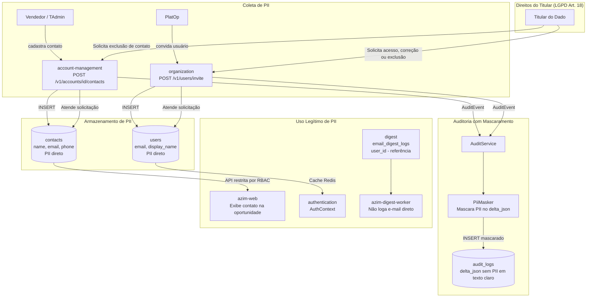

# LGPD Compliance Flow — Azim CRM

**Status:** Rascunho para revisão
**Versão:** v0.1

---

## 1. Objetivo

Descrever o fluxo de dados pessoais (PII) no Azim CRM e as regras de tratamento sob a LGPD (Lei nº 13.709/2018).

---

## 2. Dados Pessoais Identificados

| Dado | Categoria | Módulo Dono | Tabela | Finalidade | Retenção |
|---|---|---|---|---|---|
| contacts.name | PII direto | account-management | contacts | Identificação do contato na conta | Ponto a Validar (VAL-MOD-05) |
| contacts.email | PII direto | account-management | contacts | Comunicação com contato | Ponto a Validar (VAL-MOD-05) |
| contacts.phone | PII direto | account-management | contacts | Comunicação com contato | Ponto a Validar (VAL-MOD-05) |
| users.email | PII direto | organization | users | Autenticação e convite do usuário | Enquanto conta ativa; deactivated_at após desativação |
| users.display_name | PII direto | organization | users | Identificação do usuário na interface | Enquanto conta ativa |
| audit_logs.delta_json | PII indireta | audit-log | audit_logs | Auditoria de alterações em entidades | Ponto a Validar com jurídico (VAL-MOD-05) |
| email_digest_logs.user_id | PII referenciada | digest | email_digest_logs | Controle de idempotência do digest | 90 dias (KPI-03/KPI-04) |

---

## 3. Diagrama de Fluxo PII

---

## 4. Regras LGPD Aplicadas

| Regra | Implementação |
|---|---|
| Finalidade | Contatos coletados para uso comercial no CRM; usuários coletados para autenticação e operação do tenant |
| Minimização | Não coletar PII além do necessário (ex: não armazenar CPF, endereço, dados bancários no MVP) |
| Controle de acesso | Contatos acessíveis apenas por usuários com papel mínimo de Vendedor na BU relacionada; audit_logs por TAdmin/GestorBU |
| Mascaramento em logs | PiiMasker obrigatório no AuditService antes de persistir delta_json; logs de aplicação sem e-mail/nome em texto claro (RN-025) |
| Mascaramento em interfaces | Não exibir PII de usuários desativados em interfaces não autorizadas |
| Retenção | contacts: Ponto a Validar com jurídico (VAL-MOD-05); users: enquanto conta ativa; email_digest_logs: 90 dias |
| Descarte | Política de descarte de contacts sob definição com jurídico |
| Auditoria de acesso | Toda leitura e escrita em contacts e users gera AuditEvent com delta_json mascarado |
| Direitos do titular | Fluxo de acesso, correção e exclusão a ser implementado — pré-requisito para go-live (Art. 18 LGPD) |
| DPA com terceiros | Postmark/SendGrid recebem e-mail de destinatário — DPA obrigatório antes do go-live |

---

## 5. Módulos Fora do Escopo PII

| Módulo | Justificativa |
|---|---|
| opportunity-pipeline | Não armazena PII diretamente; vincula apenas por account_id e owner_id (UUIDs) |
| partner-management | partner.name é PII apenas se parceiro for pessoa física — Ponto a Validar (VAL-PARTNER-01) |
| goal-forecast | Sem dados pessoais diretos — metas por BU ou por user_id (UUID) |
| reporting | Exibe display_name de vendedores no ranking — consumo permitido por RBAC |
| tenant-administration | tenant.slug e display_name identificam empresa, não pessoa física |
| workflow-automation (Fase 2) | Não armazena PII diretamente; ações podem incluir e-mail como parâmetro |
| ai-intelligence (Fase 3) | Risco de PII indireta — avaliar antes da Fase 3 (VAL-AI-02) |

---

## 6. Pontos a Validar

| Código | Ponto | Impacto | Recomendação |
|---|---|---|---|
| VAL-PII-01 | Política de retenção e descarte de contacts (PII) sob LGPD (VAL-MOD-05) | Define obrigação de descarte automático ou manual | Definir com jurídico antes do go-live |
| VAL-PII-02 | Implementar fluxo de direitos do titular (acesso, correção, exclusão — LGPD Art. 18) | Obrigação legal | Planejar para Fase 1 ou Fase 2; definir antes do go-live |
| VAL-PII-03 | DPA com Postmark/SendGrid para envio de e-mail (PII em trânsito) | Obrigação legal de acordo de processamento de dados | Assinar DPA antes de enviar qualquer e-mail com PII |
| VAL-PII-04 | partner.name como PII se parceiro for pessoa física (VAL-PARTNER-01) | Define se partner-management tem obrigações LGPD | Confirmar com produto e jurídico o tipo de parceiro |
| VAL-PII-05 | Dados enviados ao LLM na Fase 3 (VAL-AI-02) | Risco de transferência internacional de PII | Definir com jurídico antes de iniciar a Fase 3 |

---

## 7. Base Legal Identificada

| Dado | Base Legal (LGPD Art. 7º) | Observação |
|---|---|---|
| users.email e display_name | Execução de contrato (Art. 7º, V) | Necessário para autenticação e operação do serviço contratado |
| contacts.name, email, phone | Legítimo interesse ou consentimento (Art. 7º, IX ou I) | Definir base legal com jurídico antes do go-live — Ponto a Validar |
| audit_logs.delta_json | Obrigação legal / legítimo interesse | Registro de auditoria para conformidade e rastreabilidade |
