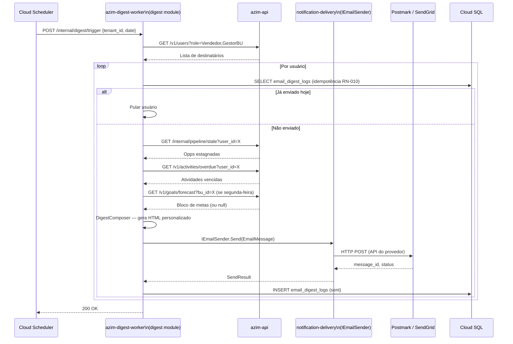
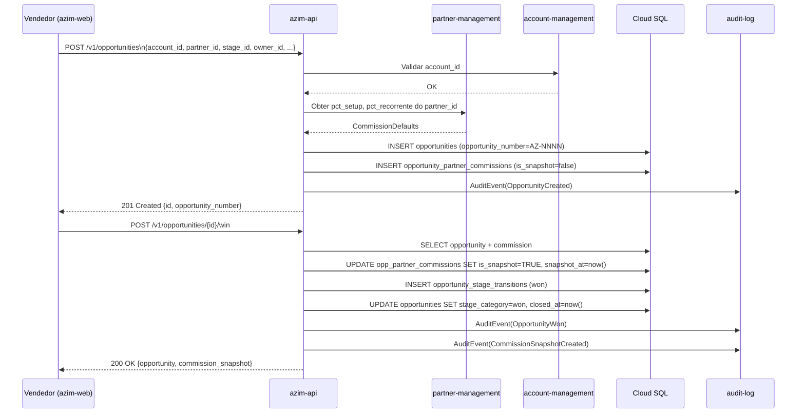
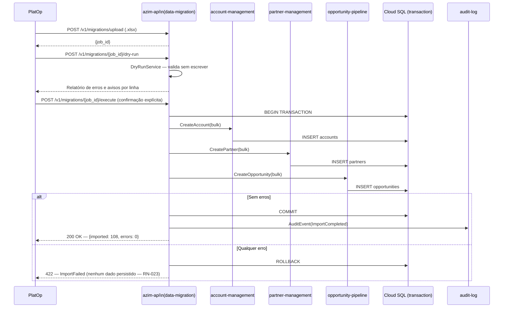
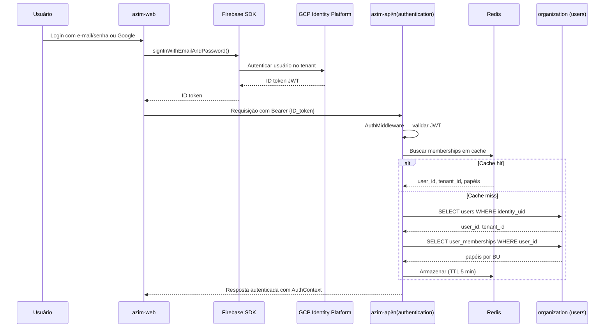
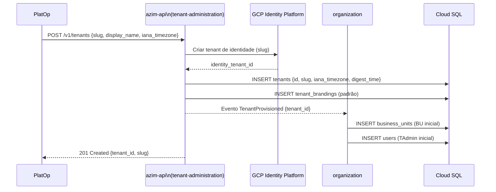

# Integration Flows — Azim CRM

**Status:** Rascunho para revisão
**Versão:** v0.1

---

## 1. Objetivo

Documentar os principais fluxos de integração entre módulos e sistemas externos do Azim CRM.

---

## 2. Fluxo 1 — Digest Diário (07:00 BRT)

**Regras do Fluxo:**

| Regra | Descrição |
|---|---|
| Idempotência RN-010 | UNIQUE(tenant_id, user_id, digest_date) em email_digest_logs — digest nunca enviado duas vezes no mesmo dia |
| Azimute apenas segunda | Bloco de metas (azimute) incluído somente às segundas-feiras (RN-029) |
| Graceful degradation RN-018 | Bloco de metas omitido quando não há meta cadastrada — sem erro |
| Seleção por fuso IANA | Horário UTC do trigger calculado pelo fuso IANA do tenant (padrão 07:00 local) |

**Pontos de Falha:**

| Ponto | Tratamento Esperado |
|---|---|
| Provedor de e-mail fora do ar | Retry com backoff exponencial; alerta imediato |
| azim-api indisponível | Retry do job; alerta; não deixar usuário sem digest silenciosamente |
| Token de ação expirado no e-mail | Link de fallback para o CRM web no e-mail |

---

## 3. Fluxo 2 — Criar e Ganhar Oportunidade com Comissão

**Regras do Fluxo:**

| Regra | Descrição |
|---|---|
| RN-001 | opportunity_number gerado sequencialmente no formato AZ-NNNN; imutável |
| RN-002 | owner_id obrigatório na criação |
| RN-007 | Snapshot de comissão imutável após is_snapshot=TRUE |
| RN-022 | Comissão calculada e congelada no momento do ganho |
| RN-026 | Fórmula: pct_setup × valor_setup + pct_recorrente × valor_mensal × meses_comissionados |

---

## 4. Fluxo 3 — Migração de Planilha (Fase 1 — único uso)

**Regras do Fluxo:**

| Regra | Descrição |
|---|---|
| RN-023 | Rollback total em caso de qualquer erro — nenhum dado parcial |
| NFR-PERF-06 | Import deve concluir em ≤ 5 minutos para 108 registros |
| Dry-run obrigatório | PlatOp deve revisar o relatório do dry-run antes de executar o import real |
| Confirmação explícita | O endpoint de execução requer confirmação explícita para evitar execução acidental |

---

## 5. Fluxo 4 — Autenticação e Carregamento de Contexto

---

## 6. Fluxo 5 — Provisionamento de Tenant

---

## 7. Pontos de Falha Globais

| Ponto | Módulos Afetados | Tratamento Esperado |
|---|---|---|
| Cloud SQL indisponível | Todos | Circuit breaker; resposta 503; alerta imediato |
| Redis indisponível | authentication, digest, ai-intelligence | Fallback: consulta ao banco sem cache; alerta |
| GCP Identity Platform indisponível | authentication | Nenhum usuário consegue autenticar; alerta crítico |
| Postmark/SendGrid indisponível | notification-delivery, digest, organization | Retry com backoff; alerta; digest não entregue |
| Cloud Scheduler não dispara | digest | Alerta se digest não processar no horário esperado |
