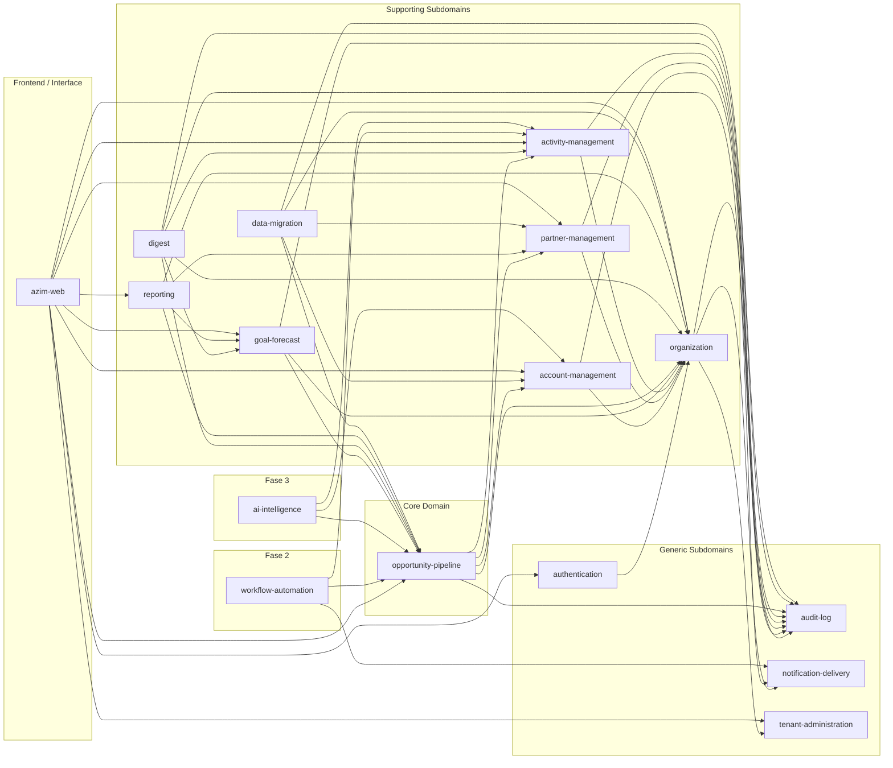

# Module Dependencies Diagram — Azim CRM

**Status:** Rascunho para revisão
**Versão:** v0.1

---

## 1. Objetivo

Mostrar as dependências diretas entre os módulos da solução, respeitando o context map DDD. Leitura do grafo: `A --> B` significa "A depende de B" (A é downstream, B é upstream).

---

## 2. Diagrama de Dependências — Ordem Generic → Supporting → Core

---

## 3. Matriz de Dependências

| Módulo (Origem) | Módulo (Destino) | Tipo | Obrigatória? | Observação |
|---|---|---|---|---|
| authentication | GCP Identity Platform | Externa (ACL) | Sim | Valida JWT; traduz identity_uid → user_id |
| authentication | organization | Síncrona | Sim | Carrega user_memberships e papéis |
| tenant-administration | GCP Identity Platform | Externa | Sim | Cria tenant de identidade |
| tenant-administration | organization | Evento (downstream) | Sim | TenantProvisioned → cria BU inicial |
| organization | tenant-administration | Conformist | Sim | tenant_id base do RLS |
| organization | notification-delivery | Package | Sim | Envia convite por e-mail |
| organization | audit-log | Package | Sim | Toda escrita gera AuditEvent |
| account-management | organization | Conformist | Sim | tenant_id, bu_id, RBAC |
| account-management | audit-log | Package | Sim | Toda escrita gera AuditEvent |
| partner-management | organization | Conformist | Sim | tenant_id |
| partner-management | audit-log | Package | Sim | Toda escrita gera AuditEvent |
| activity-management | organization | Conformist | Sim | tenant_id, bu_id, owner_id |
| activity-management | audit-log | Package | Sim | Toda escrita gera AuditEvent |
| goal-forecast | organization | Conformist | Sim | tenant_id, bu_id |
| goal-forecast | opportunity-pipeline | Síncrona (read-only) | Sim | won_total e pipeline ponderado para painel |
| goal-forecast | audit-log | Package | Sim | Toda escrita gera AuditEvent |
| opportunity-pipeline | account-management | Síncrona (Customer/Supplier) | Sim | account_id na criação de oportunidade |
| opportunity-pipeline | partner-management | Síncrona (Customer/Supplier) | Condicional | Obrigatório se canal = Parceiro |
| opportunity-pipeline | activity-management | Síncrona (read-only) | Sim | last_activity_at para detecção de estagnação |
| opportunity-pipeline | organization | Conformist | Sim | bu_id, stage_id, owner_id |
| opportunity-pipeline | audit-log | Package | Sim | Toda escrita gera AuditEvent |
| digest | opportunity-pipeline | Síncrona (read-only) | Sim | Opps estagnadas e fechamentos esperados |
| digest | activity-management | Síncrona (read-only) | Sim | Atividades vencidas e do dia |
| digest | goal-forecast | Síncrona (read-only) | Condicional | Bloco de metas (segunda-feira); graceful degradation |
| digest | organization | Conformist | Sim | Usuários, papéis, fuso do tenant |
| digest | notification-delivery | Package | Sim | IEmailSender para envio do digest |
| digest | audit-log | Package | Sim | DigestEmailSent gera AuditEvent |
| reporting | opportunity-pipeline | Read Model | Sim | FunnelReport, ForecastReport |
| reporting | partner-management | Read Model | Sim | CommissionReport |
| reporting | goal-forecast | Read Model | Sim | ForecastReport comparativo |
| reporting | organization | Conformist | Sim | Filtros RBAC |
| data-migration | opportunity-pipeline | Síncrona (escrita) | Sim | Import bulk de oportunidades |
| data-migration | account-management | Síncrona (escrita) | Sim | Import bulk de contas |
| data-migration | partner-management | Síncrona (escrita) | Sim | Import bulk de parceiros |
| data-migration | organization | Conformist | Sim | Lê bu_id e stage_id antes do import |
| data-migration | audit-log | Package | Sim | ImportCompleted gera AuditEvent |
| azim-web | authentication | HTTP (Firebase SDK) | Sim | Login e validação de sessão |
| azim-web | azim-api (todos os módulos) | HTTP REST | Sim | Consumo de todos os endpoints via Bearer token |
| workflow-automation | opportunity-pipeline | Assíncrona (Pub/Sub) | Sim (Fase 2) | Consome opportunity.* events |
| workflow-automation | activity-management | Síncrona | Sim (Fase 2) | Cria atividades como ação |
| workflow-automation | notification-delivery | Package | Sim (Fase 2) | Envia e-mail como ação |
| ai-intelligence | opportunity-pipeline | Síncrona (read-only) | Sim (Fase 3) | opp_data_for_scoring |
| ai-intelligence | account-management | Síncrona (read-only) | Sim (Fase 3) | account_360_data para briefing |
| ai-intelligence | activity-management | Síncrona (read-only) | Sim (Fase 3) | Histórico de atividades |

---

## 4. Regras de Dependência

| Regra | Descrição |
|---|---|
| Sem ciclos | Nenhum módulo pode depender de um módulo que depende dele (ciclo proibido) |
| Generic sem dependência de Supporting/Core | audit-log e notification-delivery não dependem de nenhum BC de negócio |
| Escrita cruzada proibida | Um módulo não pode escrever diretamente em tabelas de outro módulo |
| Conformist não influencia o modelo | Módulos que dependem de organization e tenant-administration como Conformist não alteram o modelo destes |
| ACL protege o modelo interno | authentication e notification-delivery têm ACL que protege o modelo interno do contrato externo |
| Read models via API ou view controlada | Reporting consome dados via API ou view — sem JOIN direto entre schemas de contextos diferentes |

---

## 5. Pontos a Validar

| Código | Ponto | Impacto |
|---|---|---|
| VAL-DEP-01 | Comunicação interna entre módulos do azim-api: chamada de método vs HTTP interno | Define acoplamento; no monólito modular, preferir chamada de método com interfaces |
| VAL-DEP-02 | Publicação de opportunity.* via Pub/Sub (DDD-VAL-05) cria dependência de infraestrutura entre Pipeline e Workflow | Confirmar antes da Fase 2 |
