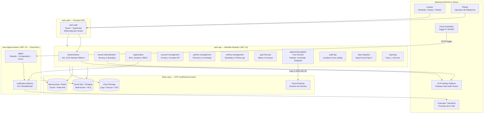
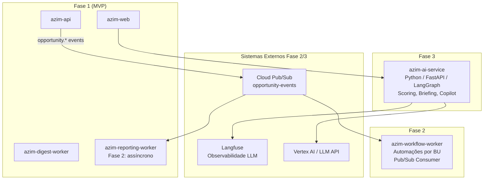

# Solution Architecture Diagram — Azim CRM

**Status:** Rascunho para revisão
**Versão:** v0.1

---

## 1. Objetivo

Mostrar como os módulos da solução Azim CRM se relacionam em alto nível, incluindo deployables, sistemas externos, zonas de dados e compliance.

---

## 2. Diagrama — Fase 1 MVP

---

## 3. Diagrama — Fase 2 e Fase 3 (Expansão)

---

## 4. Mapa de Deployables

| Deployable | Tipo | Runtime | Região | Fase |
|---|---|---|---|---|
| azim-api | Monólito Modular | .NET 10 / ASP.NET Core / Cloud Run | southamerica-east1 | Fase 1 |
| azim-digest-worker | Worker | .NET 10 / Cloud Run | southamerica-east1 | Fase 1 |
| azim-reporting-worker | Worker | .NET 10 / Cloud Run | southamerica-east1 | Fase 1 (sync) / Fase 2 (async) |
| azim-web | Frontend SPA | React + TypeScript / Firebase Hosting | CDN global | Fase 1 |
| azim-workflow-worker | Worker | .NET 10 / Cloud Run | southamerica-east1 | Fase 2 |
| azim-ai-service | Microservice | Python / FastAPI / Cloud Run | southamerica-east1 | Fase 3 |

---

## 5. Zonas de Segurança

| Zona | Componentes | Regras |
|---|---|---|
| Edge / Público | azim-web, GCP Load Balancer | HTTPS obrigatório; sem lógica de domínio |
| API Interna | azim-api | Autenticação obrigatória (Bearer token validado por AuthMiddleware); RLS por tenant_id |
| Workers | azim-digest-worker, azim-reporting-worker, azim-workflow-worker | Autenticação M2M via IAM Service Account; sem acesso público |
| Data | Cloud SQL, Redis, Cloud Storage | VPC privada; acesso apenas pelos deployables autorizados |
| IA (Fase 3) | azim-ai-service | Isolamento por tenant; rate-limit via Redis; dados nunca cruzam tenants |

---

## 6. Observações

- **Fase 1:** monólito modular no azim-api com fronteiras de módulo preservadas — separação física possível na Fase 2+.
- **Tenant RLS:** todo acesso ao banco é filtrado por `tenant_id` via Row Level Security do Postgres.
- **Digest separado:** azim-digest-worker deployado independentemente para garantir que falha no digest não afeta a API transacional e vice-versa.
- **DDD-VAL-05:** publicação de `opportunity.*` via Pub/Sub para o Workflow Automation precisa ser confirmada antes da Fase 2.
