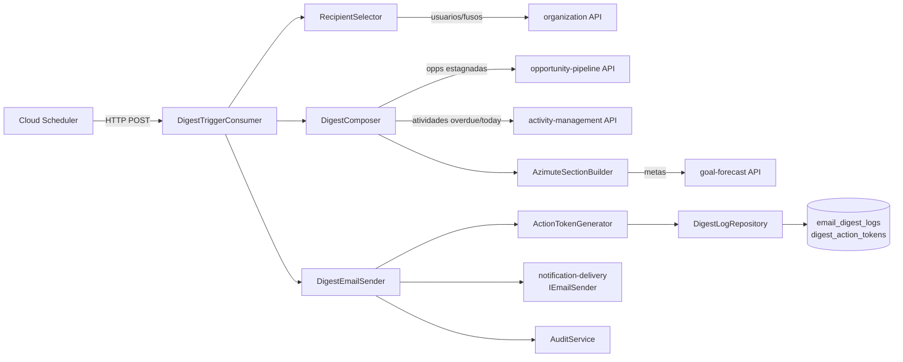
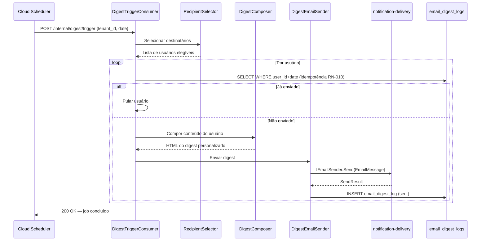

# Module — Digest

**Status:** Rascunho para revisão
**Fase:** Fase 1 MVP

---

## 1. Visão Geral

Worker responsável pela seleção de destinatários, composição e envio do e-mail diário de digest às 07:00 BRT (no fuso horário de cada tenant). É um diferencial competitivo central do produto — "o CRM que vai ao vendedor". Deployado como processo separado (azim-digest-worker) para garantir isolamento de carga e falhas em relação à API principal.

---

## 2. Classificação

| Item | Valor |
|---|---|
| Tipo de Módulo | Worker |
| Deployable Candidato | azim-digest-worker (Cloud Run, .NET 10) |
| Bounded Context Relacionado | Digest (BC-06) |
| Subdomínio DDD | Supporting Subdomain |
| Tier / Criticidade | Tier 1 — diferencial de produto; falha visível ao usuário toda manhã |
| Status | Rascunho para revisão |

---

## 3. Objetivo

Processar o digest diário por tenant no horário configurado (padrão 07:00 no fuso IANA do tenant). Selecionar destinatários com papéis adequados, compor o conteúdo personalizado por usuário (atividades vencidas, oportunidades estagnadas, fechamentos esperados, bloco de metas na segunda-feira) e enviar via IEmailSender com idempotência garantida (RN-010).

---

## 4. Responsabilidades

- Receber trigger do Cloud Scheduler (horário UTC calculado pelo fuso do tenant).
- Selecionar destinatários por papel (Vendedor, GestorBU) e fuso IANA (RN-009, RN-011).
- Compor conteúdo personalizado por usuário: atividades vencidas, atividades do dia, oportunidades estagnadas, fechamentos esperados.
- Incluir bloco de azimute (metas) somente às segundas-feiras (RN-029).
- Omitir bloco de metas quando não houver meta cadastrada (RN-018).
- Garantir idempotência: não enviar mais de um digest por (user_id, date) — RN-010.
- Registrar resultado de cada envio em email_digest_logs.
- Suportar ações de 1 clique: gerar digest_action_tokens para atividades pendentes.
- Enviar e-mail via notification-delivery (IEmailSender).

---

## 5. Fora de Escopo

- Gestão de oportunidades, atividades ou metas (pertence aos respectivos módulos).
- Composição de relatórios analíticos (pertence ao reporting).
- Notificações push ou in-app (pertence ao workflow-automation — Fase 2).
- Template visual avançado de e-mail (MVP usa template funcional simples).

---

## 6. Capacidades Atendidas

| Código | Capability | Descrição |
|---|---|---|
| CAP-08 | Digest Diário | Seleção, composição e envio de e-mail diário personalizado às 07:00 BRT |

---

## 7. Bounded Context e Linguagem Ubíqua

| Termo | Definição |
|---|---|
| DigestJob | Execução do digest para um tenant em uma data específica |
| EmailDigestLog | Registro de envio por (user_id, date) — base da idempotência (RN-010) |
| DigestActionToken | Token gerado no digest para conclusão de atividade em 1 clique |
| recipient selection | Seleção de destinatários do digest por papel e horário do fuso IANA do tenant |
| azimute | Bloco semanal do digest com metas, realizado e pipeline — exibido apenas às segundas (RN-029) |
| horario_digest | Hora local no fuso do tenant em que o digest é disparado (padrão 07:00) |
| idempotência | Garantia de que o digest não é enviado mais de uma vez por (user_id, date) — RN-010 |

---

## 8. Componentes Internos Candidatos

| Componente | Tipo | Responsabilidade |
|---|---|---|
| DigestTriggerConsumer | Consumer | Recebe trigger do Cloud Scheduler via Pub/Sub ou HTTP |
| RecipientSelector | Domain Service | Seleciona destinatários por papel, BU e fuso horário |
| DigestComposer | Domain Service | Compõe conteúdo personalizado por usuário |
| AzimuteSectionBuilder | Domain Service | Compõe bloco de metas (apenas às segundas — RN-029) |
| DigestEmailSender | Application Service | Chama IEmailSender com retry; registra EmailDigestLog |
| ActionTokenGenerator | Domain Service | Gera digest_action_tokens para atividades pendentes |
| DigestLogRepository | Repository | Escrita em email_digest_logs e digest_action_tokens |

---

## 9. APIs Principais

Este módulo não expõe API pública. Atua como worker disparado por Cloud Scheduler.

O endpoint interno (protegido) é:

| Método | Endpoint | Finalidade | Consumidores |
|---|---|---|---|
| POST | /internal/digest/trigger | Dispara o job de digest para o tenant informado | Cloud Scheduler (autenticado via IAM) |

---

## 10. Eventos Publicados

| Evento | Quando é publicado | Consumidores |
|---|---|---|
| DigestEmailSent | Após envio bem-sucedido por usuário | audit-log |

---

## 11. Eventos Consumidos

| Evento | Produtor | Finalidade |
|---|---|---|
| Trigger HTTP (Cloud Scheduler) | Cloud Scheduler | Dispara o job de digest para o tenant no horário configurado |
| OpportunityStale | opportunity-pipeline | Identifica oportunidades estagnadas para o conteúdo do digest |
| ActivityOverdue | activity-management | Identifica atividades vencidas para o conteúdo do digest |

---

## 12. Dados Próprios

| Entidade/Tabela | Tipo | Banco/Persistência | Observações |
|---|---|---|---|
| email_digest_logs | Log | Cloud SQL / Postgres | UNIQUE(tenant_id, user_id, digest_date) — idempotência RN-010; retenção 90 dias (KPI-03/04) |
| digest_action_tokens | Temporário | Cloud SQL / Postgres | Token com expires_at; vinculado a activities; removível após uso |

---

## 13. Integrações

| Sistema/Módulo | Tipo de Integração | Direção | Observações |
|---|---|---|---|
| opportunity-pipeline | API HTTP (interna) | Entrada | Consulta opps estagnadas e fechamentos esperados |
| activity-management | API HTTP (interna) | Entrada | Consulta atividades vencidas e do dia por usuário |
| goal-forecast | API HTTP (interna) | Entrada | Consulta bloco de metas para azimute (apenas segunda) |
| organization | API HTTP (interna) | Entrada | Consulta usuários, papéis e fuso do tenant |
| notification-delivery | Package (IEmailSender) | Saída | Envia e-mail via PostmarkEmailSender |
| audit-log | Package (AuditService) | Saída | DigestEmailSent gera AuditEvent |
| Cloud Scheduler | HTTP trigger | Entrada | Dispara o job no horário UTC calculado pelo fuso do tenant |

---

## 14. Dependências

### 14.1 Dependências de Domínio

- opportunity-pipeline: opps estagnadas e fechamentos esperados.
- activity-management: atividades vencidas e do dia.
- goal-forecast: bloco de metas.
- organization: usuários, papéis, fuso horário do tenant.

### 14.2 Dependências Técnicas

- Cloud Scheduler (Google): configurado com horário UTC por tenant
- notification-delivery (IEmailSender + PostmarkEmailSender)
- Cloud SQL / Postgres (email_digest_logs, digest_action_tokens)
- Pub/Sub (opcional — avaliar se trigger é HTTP direto ou via tópico)

### 14.3 Dependências Operacionais

- Configuração do Cloud Scheduler por tenant com horário UTC calculado pelo fuso
- Secret: API Key do provedor de e-mail via GCP Secret Manager
- Retenção de email_digest_logs: 90 dias (KPI-03/KPI-04)
- Alerta se digest não processar no horário esperado

---

## 15. Requisitos Não Funcionais Relevantes

| Categoria | Requisito / Observação |
|---|---|
| Performance | Processamento antes das 07:00 BRT para todos os tenants (NFR-PERF-05) |
| Resiliência | Idempotência obrigatória (RN-010); retry com backoff sem duplicar envios |
| Disponibilidade | Falha no digest é visível ao usuário toda manhã — monitorar com alerta |
| Observabilidade | Log de cada tentativa de envio; métricas de entregabilidade |

---

## 16. Compliance Aplicável

| Compliance / Norma / Lei | Aplicável? | Motivo | Impacto no Módulo |
|---|---|---|---|
| LGPD | Sim | email_digest_logs contém user_id e digest_date; e-mail de destinatário é PII | Não logar e-mail em texto claro; retenção de 90 dias dos logs |
| PCI DSS | Não aplicável | Não processa dados de cartão | — |

---

## 17. Observabilidade

| Item | Recomendação Inicial |
|---|---|
| Logs | Log por digest_job: correlation_id, tenant_id, data, destinatários selecionados, status; sem PII (sem e-mail) |
| Métricas | digest_jobs_processed_total, digest_emails_sent_total, digest_emails_failed_total, digest_duration_seconds |
| Traces | Trace cobrindo: seleção de destinatários → composição → envio por usuário |
| Alertas | Alerta se digest_jobs_processed_total = 0 após horário esperado; alerta se taxa de falha > 2% |
| Health Checks | Verificar conectividade com banco, IEmailSender e APIs internas na inicialização |

---

## 18. Diagramas do Módulo

### 18.1 Diagrama de Componentes Internos

### 18.2 Diagrama de Fluxo — Digest Diário

---

## 19. Riscos

| Código | Risco | Impacto | Mitigação |
|---|---|---|---|
| RISK-DIGEST-01 | Digest não entregue antes das 07:00 BRT | Diferencial de produto não cumprido | Alerta se job não concluir antes do horário; retry automático |
| RISK-DIGEST-02 | Digest enviado em duplicidade | Usuário recebe múltiplos e-mails | Idempotência via UNIQUE(user_id, date) no EmailDigestLog (RN-010) |
| RISK-DIGEST-03 | Falha no provedor de e-mail (Postmark/SendGrid) | Nenhum digest entregue | Retry com backoff; alerta imediato; avaliar fallback de provedor |

---

## 20. Pontos a Validar

| Código | Ponto | Impacto | Recomendação |
|---|---|---|---|
| VAL-DIGEST-01 | Trigger do Cloud Scheduler: HTTP direto vs Pub/Sub | Define resiliência do trigger | HTTP direto é mais simples no MVP; Pub/Sub para retry automático |
| VAL-DIGEST-02 | Multi-tenant: um job por tenant ou job global com iteração | Define escalonamento do scheduler | Avaliar: job global que itera por tenant é mais simples no MVP |
| VAL-DIGEST-03 | TTL dos digest_action_tokens | Define expiração dos links de 1 clique | Sugestão: 24h após envio do digest |

---

## 21. Backlog Inicial Sugerido

| Tipo | Item | Descrição |
|---|---|---|
| Epic | Digest Diário — Worker Separado | Worker independente com seleção, composição e envio do digest |
| Story Técnica | RecipientSelector com filtro por papel e fuso IANA | Selecionar Vendedores e GestoresBU no fuso correto do tenant |
| Story Técnica | DigestComposer com bloco de atividades e oportunidades | Composição personalizada por usuário |
| Story Técnica | AzimuteSectionBuilder (apenas segunda-feira — RN-029) | Bloco de metas no azimute semanal |
| Story Técnica | DigestEmailSender com idempotência (RN-010) | INSERT com UNIQUE constraint; sem duplicidade |
| Story Técnica | ActionTokenGenerator para conclusão de 1 clique | Gerar tokens por atividade pendente no digest |
| Task | Configurar Cloud Scheduler por tenant | Horário UTC calculado pelo fuso IANA do tenant |
| Task | Alerta de falha de digest no Cloud Monitoring | Alerta se job não processar no horário esperado |

---

## 22. Referências

| Documento | Seção |
|---|---|
| DDD Segmentation | §4.1 BC-06 Digest |
| DDD Segmentation | §2 Event Storming — Fluxo 2 |
| DDD Segmentation | §6 Data Ownership — Digest |
| DDD Segmentation | §7 Deployables — azim-digest-worker |
| Data Model | §3 Digest (BC-06) |
| Context Map | relations.md — Digest → Pipeline, Activity, Goal, Notification |
