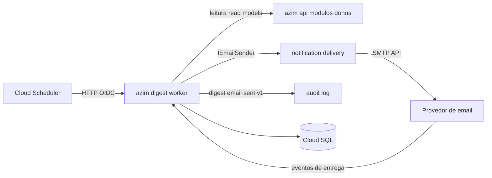
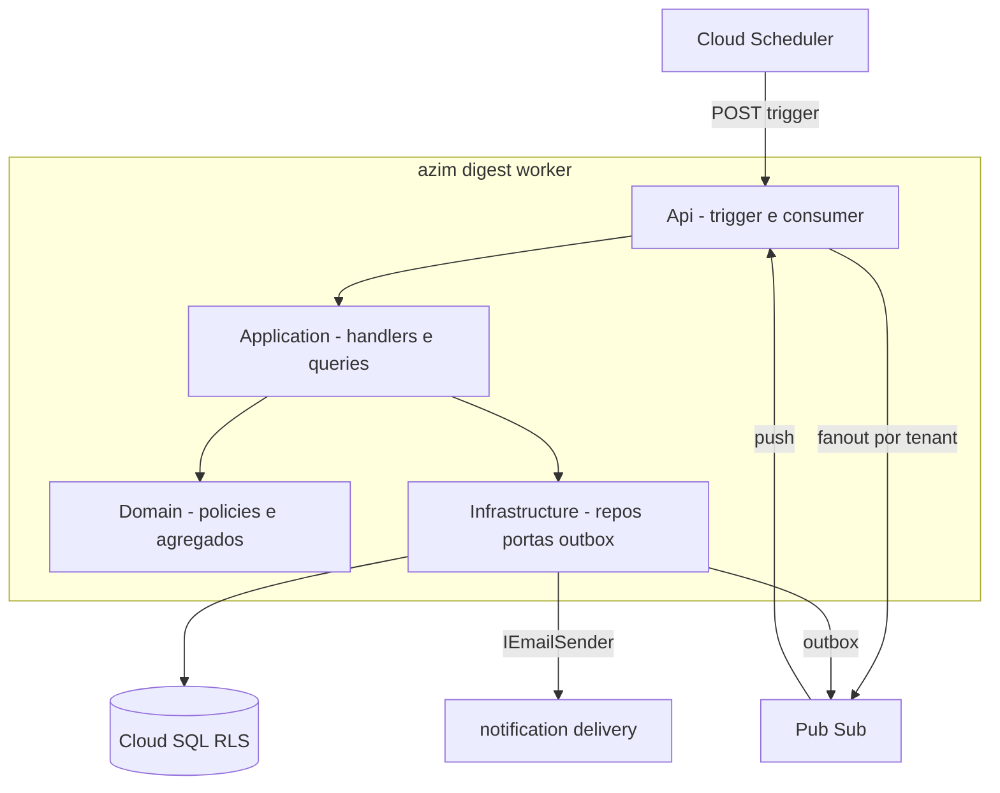
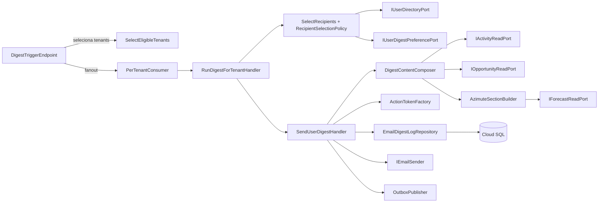
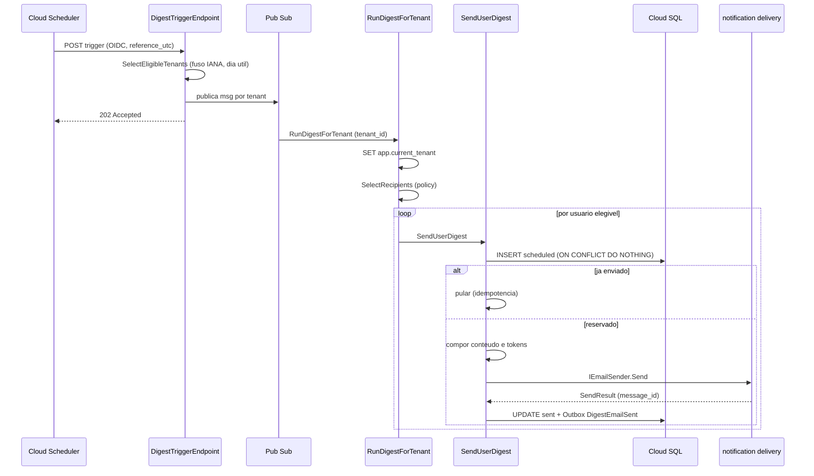
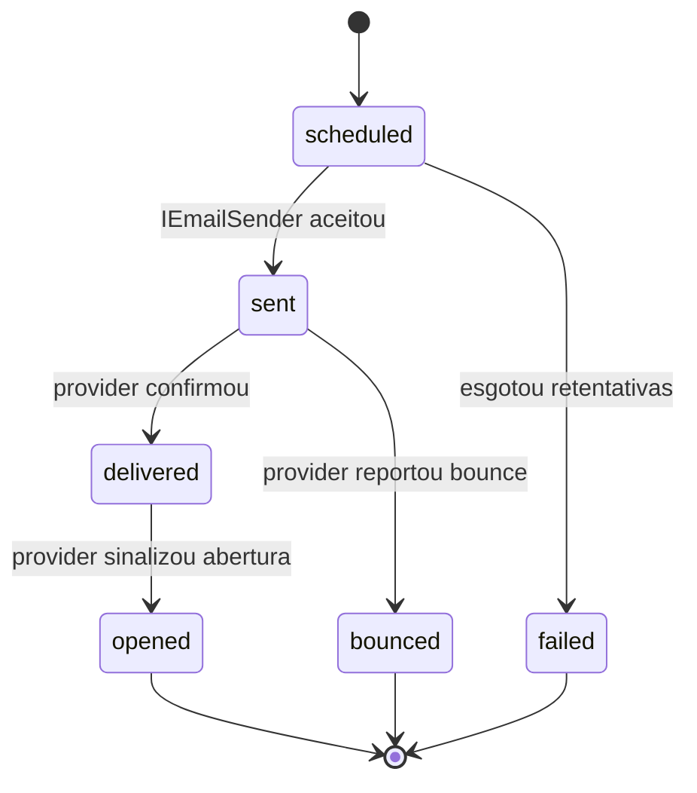

# DIG — Digest
**Design Técnico**

- Versão: 0.2.0
- Data: 2026-06-15
- Status: Rascunho para revisão
- Referência base: docs/product/modules/digest/requirements.md v0.1.0
- ADRs aplicáveis: ADR-0001 (isolamento multi-tenant em defesa em profundidade — Aceito); ADR-0004 (outbox/idempotência — Fase 1, a formalizar); ADR-0006 (token de link autenticado do digest — Fase 1, a formalizar); ADR-0008 (scheduling por Cloud Scheduler UTC + seleção por fuso IANA — Fase 1, a formalizar); ADR-0005 (provider de e-mail via `IEmailSender` — Fase 0, a formalizar); ADR-0007 (stack de observabilidade GCP — a formalizar, VAL-TRD-07)
- Rules aplicáveis: `.forge/rules/architecture/clean-architecture.md`, `.forge/rules/architecture/ddd.md`, `.forge/rules/architecture/api-and-contracts.md`, `.forge/rules/architecture/security-and-secrets.md`, `.forge/rules/architecture/security-and-compliance.md`, `.forge/rules/architecture/observability.md`, `.forge/rules/domain/money-as-cents.md`, `.forge/rules/domain/audit-immutability.md`, `.forge/rules/conventions/language-policy.md`, `.forge/rules/conventions/naming.md`, `.forge/rules/conventions/database-naming.md`, `.forge/rules/conventions/document-versioning.md`, `.forge/rules/testing/tdd.md`, `.forge/rules/testing/quality-gates.md`

## Histórico de Versões

| Versão | Data | Status | Descrição da alteração |
|--------|------|--------|------------------------|
| 0.2.0 | 2026-06-15 | Rascunho para revisão | VAL-ACT-02: TTL do `digest_action_token` passa a ser configurável por tenant via `digest_tenant_settings`. Default global de 48h mantido em `DigestOptions.DefaultActionTokenTtlHours`. `DigestActionToken.Issue` recebe `TimeSpan ttl` em vez do `const` fixo. Adicionados: `IDigestTenantSettingsRepository`, `ActionTokenTtlResolver`, migration `20260615000000_AddDigestTenantSettings`. |
| 0.1.0 | 2026-06-11 | Rascunho para revisão | Criação inicial do design a partir do requirements.md v0.1.0 (Req 1..11, RNF 1..10, PBT-01..06), README do módulo, TRD (§7.3, §9.3/9.6, §15, §17, §19.3) e data-model (§BC-06, §BC-13). Resolve VAL-TRD-13 (DD-001), VAL-DIGEST-02/01 (DD-005/DD-006), VAL-DIGEST-04 (DD-003) e VAL-TRD-05/VAL-DIGEST-03 (DD-004). Isolamento por ADR-0001 (DD-002). |

## 1. Visão Geral

O módulo **digest** (Bounded Context BC-06, *Supporting Subdomain* SD-06) é um **worker assíncrono** empacotado no deployable independente `azim-digest-worker` (.NET 10, Cloud Run). Sua responsabilidade é selecionar destinatários, compor e enviar o **digest diário por e-mail** — o diferencial competitivo "o CRM que vai ao vendedor".

O worker é acionado **de hora em hora em UTC** pelo Cloud Scheduler em um endpoint interno autenticado por OIDC/WIF. A cada disparo, seleciona os *tenants* cujo horário local (no fuso IANA configurado) equivale ao `digest_time` (padrão 07:00) e cujo dia local é dia útil; em seguida, por *tenant*, seleciona os usuários elegíveis, compõe o conteúdo personalizado e envia via `IEmailSender` (módulo notification-delivery), garantindo idempotência por `EmailDigestLog`.

A lógica de domínio do digest é de **orquestração**: o worker **consome** *read models* já calculados por opportunity-pipeline, activity-management, goal-forecast e organization, e **nunca recalcula** regras de outros contextos (estagnação RN-028, forecast ponderado RN-006). O envio físico do e-mail é delegado à notification-delivery (ACL sobre o provedor Postmark/SendGrid). A trilha de auditoria recebe o evento `DigestEmailSent`.

Criticidade **Tier 1**: falha é visível ao usuário toda manhã; entregabilidade alvo ≥ 98% (KPI-03).

### 1.1 Rastreabilidade requisito → design

| Requisito | Elemento de design | Seções |
|---|---|---|
| Req 1 Trigger horário do Cloud Scheduler | `DigestTriggerEndpoint` (OIDC/WIF), enfileiramento assíncrono via Pub/Sub fan-out por tenant | 5.1, 6.3, 8, DD-005, DD-006 |
| Req 2 Seleção de tenants por fuso IANA + dia útil | `TenantEligibility` (objeto de valor) + `SelectEligibleTenantsQuery`; conversão IANA neutra a DST | 4.3, 5.2, DD-005, PBT-01 |
| Req 3 Seleção de destinatários por papel/pendências | `RecipientSelectionPolicy` (domain policy); `IUserDirectoryPort`, opt-out via `IUserDigestPreferencePort` | 4.6, 5.2, DD-003, PBT-03 |
| Req 4 Digest de pendências (ter–sex) | `DigestContentComposer`; portas de leitura de atividades/oportunidades | 4.1, 5.3, 6.4, DD-001 |
| Req 5 Azimute da semana (segunda) | `AzimuteSectionBuilder`; `IForecastReadPort`; degradação graciosa de metas | 4.1, 5.3, DD-010, PBT-04, PBT-06 |
| Req 6 Consumo via read model dos módulos donos | Portas de leitura (`IActivityReadPort`, `IOpportunityReadPort`, `IForecastReadPort`, `IUserDirectoryPort`); sem escrita externa | 3, 6.4, DD-001 |
| Req 7 Token de ação de um clique | `DigestActionToken` (entidade), `ActionTokenFactory`, `token_hash`, `expires_at`; TTL configurável por tenant via `digest_tenant_settings` + `ActionTokenTtlResolver` (VAL-ACT-02) | 4.2, 6.1, 7, DD-004, DD-007, PBT-05 |
| Req 8 Envio via `IEmailSender` + registro | `SendUserDigestHandler`; `EmailDigestLog`; mapeamento de `SendResult` | 5.1, 5.3, 6.2, 12 |
| Req 9 Idempotência por usuário e data | Reserva `scheduled` + UNIQUE (`tenant_id`,`user_id`,`digest_date`) | 4.1, 6.5, 7, DD-008, PBT-02 |
| Req 10 Opt-out individual | `IUserDigestPreferencePort` (dono: organization, DD-003); avaliado na seleção | 5.2, DD-003 |
| Req 11 Status de entrega + evento de auditoria | `DeliveryStatusUpdateHandler`; Outbox → `DigestEmailSent`/`digest.email_sent.v1` | 5.1, 6.6, 9, DD-009 |
| RNF 1 Isolamento por tenant | `tenant_id` + EF Core Global Query Filter + RLS falha-fechada (ADR-0001) | 6.1, 7, 10, 14, DD-002 |
| RNF 2 Idempotência resiliente | Reserva antes do envio; chave única; independente de ordem | 6.5, DD-008, PBT-02 |
| RNF 3 Ausência de PII em logs | `correlationId`/`tenant_id`/`user_id` opacos; destructuring policy; sem e-mail | 11, DD-011 |
| RNF 4 Pontualidade e desempenho | Fan-out por tenant; leitura em lote; métrica de duração; janela ≤ 5 min | 6.4, 11, 15, DD-005 |
| RNF 5 Resiliência de envio / isolamento de falhas | Backoff (notification-delivery); falha por tenant isolada; degradação graciosa | 6.3, 6.4, 15, DD-005 |
| RNF 6 Observabilidade do worker | Logs estruturados, métricas `digest_*`, traces, alertas | 11 |
| RNF 7 Segurança do trigger e do token | OIDC/WIF no trigger; token de 256 bits, `token_hash`, anti-enumeração | 6.1, 7, 10, DD-007, PBT-05 |
| RNF 8 Execução assíncrona obrigatória | Trigger responde 202; processamento desacoplado da `azim-api` | 5.1, 6.3, DD-005 |
| RNF 9 Retenção e minimização de logs | `email_digest_logs` 90 dias; purge de `digest_action_tokens` pós-`expires_at` (TTL configurável por tenant, default 48h — VAL-ACT-02) | 6.1, 7, DD-004 |
| RNF 10 Auditoria do envio | `DigestEmailSent` append-only via Outbox, sem PII | 6.6, 9, 12, DD-009 |
| PBT-01 Seleção por fuso neutra a DST | Teste de propriedade sobre `TenantEligibility` | 4.3, 13, PBT-01 |
| PBT-02 Idempotência sob retentativas | Teste de propriedade sobre reserva + UNIQUE | 6.5, 13, DD-008 |
| PBT-03 Regra de inclusão de destinatário | Teste de propriedade sobre `RecipientSelectionPolicy` | 4.6, 13 |
| PBT-04 Omissão graciosa do bloco de metas | Teste de propriedade sobre `AzimuteSectionBuilder` | 5.3, 13 |
| PBT-05 Token não previsível e expirável | Teste de propriedade sobre `ActionTokenFactory` | 7, 13, DD-007 |
| PBT-06 Azimute apenas na segunda | Teste de propriedade sobre composição por dia | 4.1, 5.3, 13 |

## 2. Princípios e Decisões Macro

1. **Worker desacoplado e stateless de carga** — `azim-digest-worker` é deployable independente da `azim-api`; sua falha não degrada a operação transacional (RNF 8, DD-005).
2. **Orquestração, não recálculo** — o digest consome *read models* já calculados pelos módulos donos via portas de leitura e nunca recalcula nem escreve em contextos alheios (Req 6, DD-001).
3. **Seleção dirigida por estado, não por evento acumulado** — a elegibilidade de itens estagnados/vencidos é consultada *no momento do disparo* a partir do estado atual (`StagnationView`/`ForecastView`), resolvendo VAL-TRD-13 a favor de leitura direta (DD-001), o que torna o conteúdo um *snapshot* consistente com o `digest_date`.
4. **Isolamento em defesa em profundidade obrigatório** — `tenant_id` + EF Core Global Query Filter + RLS falha-fechada no PostgreSQL (`tenant_id = current_setting('app.current_tenant')::uuid`), `SET app.current_tenant` por conexão; o processamento itera por tenant setando o contexto a cada iteração (ADR-0001, DD-002, RNF 1).
5. **Idempotência por reserva** — antes de chamar o `IEmailSender`, o worker insere a reserva `scheduled` em `email_digest_logs`; a UNIQUE (`tenant_id`,`user_id`,`digest_date`) é a barreira de corrida; retentativas não reenviam (Req 9, RNF 2, DD-008).
6. **Fan-out por tenant para isolamento de falha e pontualidade** — o trigger global publica uma mensagem Pub/Sub por tenant elegível; falha de um tenant não afeta os demais e o processamento paraleliza dentro da janela de 5 min (RNF 4, RNF 5, DD-005).
7. **Token opaco, persistido por hash** — o link carrega o token em claro uma única vez; o banco guarda apenas `token_hash` (SHA-256), com entropia de 256 bits, anti-enumeração e `expires_at` (ADR-0006, DD-007, RNF 7).
8. **PII nunca em telemetria** — e-mail do destinatário e conteúdo do digest jamais em log, métrica ou trace; correlação por identificadores opacos (RNF 3, DD-011).
9. **Money em centavos inteiros** — todos os valores do azimute (pipeline, variação, realizado, meta) são `long` em centavos; nenhuma comparação usa ponto flutuante (RN money-as-cents, DD-010, Req 5.5).
10. **Auditoria via Outbox** — `DigestEmailSent` é publicado pelo padrão Outbox transacional com o registro de envio, garantindo exatamente-uma-vez efetiva (ADR-0004, DD-009, RNF 10).
11. **Opt-out é leitura, não posse** — a preferência de opt-out pertence ao organization; o digest apenas a lê via porta (VAL-DIGEST-04, DD-003).

## 3. Estrutura da Solução

O módulo segue Clean Architecture com a regra de dependência enforçada pelo compilador. O domínio é de orquestração (sem agregados de outros contextos), mas há lógica de negócio própria relevante (elegibilidade por fuso, política de inclusão, composição por papel, ciclo de vida do envio e do token) que **não deve ser anemizada**.

```text
Digest.Domain          -> DigestJob (aggregate root), EmailDigestLog (entidade), DigestActionToken (entidade),
                          TenantEligibility, DigestDate, ActionToken, RecipientSelectionPolicy,
                          DigestContent/Section (objetos de valor), Domain Events (DigestEmailSent)
Digest.Application     -> Handlers (RunDigestForTenant, SendUserDigest, UpdateDeliveryStatus),
                          Queries (SelectEligibleTenants, SelectRecipients), portas de leitura
                          (IActivityReadPort, IOpportunityReadPort, IForecastReadPort, IUserDirectoryPort,
                          IUserDigestPreferencePort), DigestContentComposer, AzimuteSectionBuilder,
                          pipeline behaviors (TenantScope, Logging, Validation)
Digest.Infrastructure  -> Repositórios (EmailDigestLogRepository, DigestActionTokenRepository),
                          adaptadores das portas de leitura (HTTP/DB), TenantConnectionInterceptor (RLS),
                          OutboxPublisher, EmailTemplateRenderer, ActionTokenFactory, IClock, DI
Digest.Api             -> DigestTriggerEndpoint (/internal/digest/trigger), PerTenantConsumer (Pub/Sub push),
                          HealthChecks (live/ready)
Digest.Contracts       -> DTOs do trigger, contrato do evento digest.email_sent.v1, enums de status
```

> O módulo notification-delivery é referenciado como **biblioteca** (`IEmailSender`), não como projeto deste módulo. O audit-log é alcançado via Outbox + Pub/Sub (`digest.email_sent.v1`), não por referência direta.

Projetos de teste:

```text
Digest.Domain.Tests          -> TenantEligibility (DST), RecipientSelectionPolicy, ciclo do EmailDigestLog/token
Digest.Application.Tests     -> composição por dia/papel, omissão de metas, idempotência (reserva)
Digest.Infrastructure.Tests  -> repositórios + filtro global + RLS (Testcontainers Postgres), Outbox, token_hash
Digest.Api.Tests             -> autenticação OIDC do trigger, resposta 202, contrato do consumer
Digest.Architecture.Tests    -> regra de dependência Clean Architecture; proibição de escrita em schema alheio
```

### 3.1 Regra de dependência

```text
Api -> Application, Infrastructure, Contracts
Application -> Domain, Contracts
Infrastructure -> Application, Domain
Domain -> ∅
Contracts -> ∅
```

`Digest.Architecture.Tests` valida estas setas e proíbe `Domain` de referenciar EF Core, HTTP, Pub/Sub SDK ou `IEmailSender`.

## 4. Modelo de Domínio

### 4.1 Aggregates

**`DigestJob` (Aggregate Root).** Representa a execução do digest para um (`tenant_id`, `digest_date`). É efêmero (in-memory; data-model §BC-06) e coordena: a lista de destinatários selecionados, a composição por usuário e a emissão dos eventos `DigestEmailSent`. Invariantes:

- Todo `DigestJob` opera sobre exatamente um `tenant_id` e um `digest_date` (data local do tenant).
- A composição de um usuário só ocorre após a verificação de idempotência (reserva).
- O bloco de azimute só integra o conteúdo quando `digest_date` é segunda-feira **e** o papel é `GestorBU` ou `TAdmin` (RN-029, Req 5.7, PBT-06).
- Para cada envio bem-sucedido, registra-se exatamente um `DigestEmailSent` (RNF 10.1).

`EmailDigestLog` e `DigestActionToken` são entidades persistentes (próprias do BC), tratadas como agregados de persistência independentes para fins transacionais, referenciados pelo `DigestJob` durante a execução.

### 4.2 Entidades

| Entidade | Identidade | Descrição | Tabela |
|---|---|---|---|
| `EmailDigestLog` | `id` (UUID) | Registro de envio por (`tenant_id`,`user_id`,`digest_date`); base de idempotência (RN-010) e trilha de entregabilidade (KPI-03/04). | `email_digest_logs` |
| `DigestActionToken` | `id` (UUID) | Token de um clique para conclusão/reagendamento de uma atividade; guarda `token_hash` e `expires_at`. | `digest_action_tokens` |

### 4.3 Objetos de valor

- **`TenantEligibility`** — imutável; encapsula a regra de elegibilidade do tenant a partir de (`utc_trigger_hour`, `iana_timezone`, `digest_time`, `active`). Expõe `IsEligible()` e `LocalDate`/`LocalWeekday`. A conversão usa a base IANA (NodaTime, DD-012), neutralizando DST (Req 2, PBT-01).
- **`DigestDate`** — data local do tenant (não UTC), derivada da conversão; usada como `digest_date` (Req 8.3).
- **`ActionToken`** — par (token em claro, `token_hash`); o claro só existe em memória durante a emissão; igualdade por `token_hash` (DD-007).
- **`MoneyCents`** — valor monetário como `long` em centavos (BRL no MVP); proíbe construção a partir de `double`/`float` (DD-010, Req 5.5).
- **`DigestSection`** / **`DigestContent`** — blocos canônicos (§4.3 do requirements) compostos para um usuário; imutáveis; sabem se estão vazios (suporta a regra "ao menos um bloco" — Req 4.6).

### 4.4 Domain Events

| Evento | Quando | Carga (sem PII) | Consumidor |
|---|---|---|---|
| `DigestEmailSent` | Após envio aceito pelo provedor, por usuário | `tenant_id`, `user_id`, `digest_date`, `message_id`, `occurred_at` | audit-log (via `digest.email_sent.v1`) |

Nome no passado (convenção DDD). Publicado via Outbox (DD-009). Não contém e-mail nem conteúdo (RNF 3.4, RNF 10.2).

### 4.5 State Machines

**`EmailDigestLog.status`** (lista canônica §4.2 do requirements):

```text
scheduled -> sent -> delivered -> opened
scheduled -> failed
sent -> bounced
```

- `scheduled`: reserva de idempotência inserida antes do `IEmailSender` (DD-008).
- `sent`: provedor aceitou; `message_id` registrado.
- `delivered`/`opened`/`bounced`: atualizados por eventos do provedor (Req 11.1).
- `failed`: falha definitiva após esgotar retentativas (RNF 5.2). Terminais: `bounced`, `failed`.

**`DigestActionToken`** ciclo de vida (emissão é do digest; consumo/`used_at` é do activity-management):

```text
issued (expires_at futuro) -> expired (now > expires_at)  [purge pós-expiração, RNF 9.2]
issued -> used (used_at setado pelo activity-management)  [fora do escopo deste worker]
```

### 4.6 Policies / Specifications

**`RecipientSelectionPolicy`** (domain policy, núcleo do PBT-03 e Req 3). Decide a inclusão a partir de (`papel`, `hasOwnPendencias`, `optOut`, `weekday`, `active`):

| Condição | Resultado |
|---|---|
| usuário inativo **ou** papel `Viewer` | nunca recebe (3.5, 3.7) |
| tem pendência própria **e** sem opt-out | recebe digest de pendências (3.1) |
| tem pendência própria **e** com opt-out | não recebe digest de pendências (10.1); recebe apenas azimute se aplicável |
| segunda-feira **e** papel `GestorBU`/`TAdmin` | recebe azimute mesmo sem pendências; opt-out **não** suprime (3.3, 10.2) |
| sem pendência **e** sem papel de gestão | nunca recebe (3.2, RN-011) |

A política é **total** (cobre todo o espaço de entrada) — propriedade verificada por PBT-03. O recorte de pendências do Vendedor restringe-se a `owner_id = user_id` (Req 3.4).

**`StaleOpportunitySpecification`** não existe aqui: o critério de estagnação (RN-028) é do opportunity-pipeline; o digest apenas lê o resultado (`StagnationView`).

## 5. Application Layer

O mecanismo de mediação é **MediatR** (alinhado aos demais módulos do azim-api/workers); um handler por caso de uso. Escrita por `Command`, leitura por `Query`.

### 5.1 Commands

| Command | Disparado por | Efeito |
|---|---|---|
| `RunDigestForTenantCommand(tenant_id, reference_utc)` | `PerTenantConsumer` (mensagem Pub/Sub por tenant) | Seta `app.current_tenant`, deriva `digest_date`, seleciona destinatários, dispara `SendUserDigestCommand` por usuário. |
| `SendUserDigestCommand(tenant_id, user_id, digest_date)` | `RunDigestForTenantHandler` | Reserva idempotência, compõe conteúdo, emite tokens, envia via `IEmailSender`, atualiza `EmailDigestLog`, enfileira `DigestEmailSent`. |
| `UpdateDeliveryStatusCommand(message_id, provider_status)` | Webhook de entrega (hospedado por notification-delivery/consumer) | Atualiza `status` para `delivered`/`opened`/`bounced` (Req 11.1). |

### 5.2 Queries

| Query | Retorno | Origem dos dados |
|---|---|---|
| `SelectEligibleTenantsQuery(reference_utc)` | lista de `tenant_id` elegíveis | `tenants` (`iana_timezone`, `digest_time`, `active`) via `IUserDirectoryPort`/leitura direta — `TenantEligibility` |
| `SelectRecipientsQuery(tenant_id, digest_date)` | lista de `RecipientCandidate` | `IUserDirectoryPort` (usuários/papéis/BU ativos) + portas de pendências + `IUserDigestPreferencePort` (opt-out) → `RecipientSelectionPolicy` |

> `SelectEligibleTenantsQuery` roda **antes** de setar `app.current_tenant` (a tabela `tenants` é cross-tenant por natureza administrativa); o restante do processamento ocorre sempre dentro do escopo de um único tenant (DD-002).

### 5.3 Handlers

- **`RunDigestForTenantHandler`** — orquestra o `DigestJob`: seta o contexto de tenant, executa `SelectRecipientsQuery`, e para cada candidato dispara `SendUserDigestCommand`. Falha de um usuário não interrompe os demais (RNF 5.3, try/catch por usuário com log e métrica).
- **`SendUserDigestHandler`** — (1) tenta reservar `scheduled` (idempotência, DD-008); se já existir `sent`/`delivered`/`opened`, retorna sem enviar (Req 9.2); (2) invoca `DigestContentComposer`; se nenhum bloco aplicável e usuário não é gestor em segunda, aborta sem envio; (3) `ActionTokenFactory` emite tokens das atividades; (4) `EmailTemplateRenderer` gera HTML+texto com branding; (5) `IEmailSender.Send`; (6) atualiza `EmailDigestLog` para `sent`/`failed` e enfileira `DigestEmailSent` no Outbox na mesma transação (DD-009).
- **`UpdateDeliveryStatusHandler`** — mapeia eventos do provedor para a state machine (§4.5); idempotente por `message_id`.
- **`DigestContentComposer`** (serviço de aplicação) — monta os blocos `overdue_activities`, `today_activities`, `stale_opportunities`, `overdue_closings` a partir das portas; delega a `AzimuteSectionBuilder` na segunda.
- **`AzimuteSectionBuilder`** — compõe `azimute_pipeline` (pipeline ponderado por estágio/BU, variação, status, ganhos, fechamentos) e `azimute_metas`; **omite completamente** o bloco de metas quando `IForecastReadPort` não retorna meta para o período (RN-018, Req 5.4, PBT-04). Valores em `MoneyCents` (DD-010).

### 5.4 Pipeline Behaviors

| Behavior | Função |
|---|---|
| `TenantScopeBehavior` | Em `RunDigestForTenantCommand`/`SendUserDigestCommand`, resolve o `TenantContext` e garante o filtro global + `SET app.current_tenant` na conexão antes de qualquer comando (RNF 1, DD-002). |
| `LoggingBehavior` | Loga início/fim com `correlationId`, `tenant_id`, `digest_date`, contagem de destinatários e status — sem PII (RNF 3, RNF 6.1). |
| `ValidationBehavior` | Valida sintaticamente o comando/payload do trigger (FluentValidation). |
| `UnitOfWorkBehavior` | Encerra a transação que abrange `EmailDigestLog` + Outbox (DD-009). |

### 5.5 Validações de Aplicação

- Payload do trigger: `reference_utc` presente e parseável; rejeição → `DIG-ERR-001`.
- `digest_date` derivado do fuso do tenant, nunca da data UTC (Req 8.3).
- Validações de regra de negócio (inclusão, azimute) residem no domínio (`RecipientSelectionPolicy`, `DigestJob`), não nos handlers.
- Autorização do trigger é feita na borda (OIDC/WIF, §10), não no handler.

## 6. Infrastructure Layer

### 6.1 Persistência

- **Cloud SQL (PostgreSQL)** compartilhado, *pooled multi-tenancy*. EF Core com **Global Query Filter** por `tenant_id` em `email_digest_logs` e `digest_action_tokens`, e **RLS obrigatória falha-fechada** (ADR-0001, DD-002): políticas `USING/WITH CHECK (tenant_id = current_setting('app.current_tenant')::uuid)`. O `TenantConnectionInterceptor` executa `SET app.current_tenant = @tenant_id` ao alugar a conexão, antes de qualquer comando.
- Repositórios: `EmailDigestLogRepository`, `DigestActionTokenRepository` — expressam intenção de domínio (`ReserveAsync`, `MarkSentAsync`, `IssueTokenAsync`).
- O worker **não** possui `DbSet` de `opportunities`, `activities`, `goals` ou `users`: o acesso a esses dados é por portas de leitura (§6.4), nunca por escrita (Req 6.2). `Architecture.Tests` proíbe mapeamento de tabelas alheias.

### 6.2 Cache

Não aplicável como cache distribuído nesta versão. O *snapshot* de leitura dos read models é mantido **em memória por execução de tenant** (vida do `DigestJob`), evitando reconsulta por usuário dentro do mesmo job (otimização de pontualidade, RNF 4.3). Sem `tenant_id` cruzado: o cache de job é descartado ao fim do tenant.

### 6.3 Mensageria

- **Entrada — trigger:** Cloud Scheduler → `POST /internal/digest/trigger` (OIDC/WIF). O endpoint **não processa** os envios; publica uma mensagem por tenant elegível no tópico `azim-digest-fanout` e responde `202 Accepted` (RNF 8, DD-005, DD-006).
- **Entrada — fan-out:** `PerTenantConsumer` (Pub/Sub push autenticado) consome `azim-digest-fanout`, um `RunDigestForTenantCommand` por mensagem. Retry e DLQ por subscription (TRD §15.4): após N tentativas → DLQ + alerta.
- **Saída — auditoria:** Outbox → tópico `azim-digest`, evento `digest.email_sent.v1` (§9).
- **Decisão VAL-TRD-13:** o worker **não** mantém assinatura de `opportunity.stale.v1`/`activity.overdue.v1` para compor conteúdo; usa leitura direta dos read models no disparo (DD-001). Recomenda-se atualizar TRD §7.3/§9.3/§19.3.

### 6.4 Integrações Externas (portas de leitura)

Todas as portas são **somente leitura**, restritas ao `tenant_id` em processamento (Req 6.4), com **timeout (10 s), retry com backoff e circuit breaker** (Polly) — TRD §15.

| Porta | Fonte | Dados |
|---|---|---|
| `IUserDirectoryPort` | organization | usuários ativos, papéis (`user_memberships.papel`), BU, fuso do tenant |
| `IActivityReadPort` | activity-management | atividades vencidas e do dia por `owner_id` (`StagnationView`/consulta) |
| `IOpportunityReadPort` | opportunity-pipeline | oportunidades estagnadas (RN-028), fechamentos vencidos, pipeline ponderado (`ForecastView`/`StagnationView`) |
| `IForecastReadPort` | goal-forecast | bloco de metas (realizado vs. meta) do período, em centavos |
| `IUserDigestPreferencePort` | organization (DD-003) | preferência de opt-out por usuário |

> Implementação concreta: no monólito modular (azim-api + worker no mesmo Cloud SQL), as portas podem resolver por **leitura direta de read model** sob RLS; se/quando os módulos donos virarem deployables separados, a implementação migra para HTTP `/internal/*` (TRD §7.1) sem mudar a porta. A decisão entre DB e HTTP é de infraestrutura, transparente ao domínio (DD-001).

### 6.5 Idempotência

A chave é (`tenant_id`, `user_id`, `digest_date`) com UNIQUE em `email_digest_logs` (RN-010). Fluxo (DD-008):

1. `INSERT ... status='scheduled' ON CONFLICT DO NOTHING`. Se 0 linhas afetadas, já existe reserva/envio → consulta status; se `sent`/`delivered`/`opened`, **não reenvia** (Req 9.2).
2. Só após a reserva vencer a corrida, invoca-se `IEmailSender` (RNF 2.3).
3. Em sucesso, `UPDATE status='sent', message_id, sent_at`; em falha definitiva, `status='failed'`.

A propriedade (exatamente um envio efetivo para N disparos) é verificada por PBT-02. Independe da ordem de processamento dos usuários (RNF 2.4).

### 6.6 Outbox / Inbox

- **Outbox** (ADR-0004, DD-009): `DigestEmailSent` é gravado em tabela `outbox_messages` na **mesma transação** do `UPDATE` para `sent`; um relay publica em `digest.email_sent.v1`. Garante que auditoria e envio são atômicos e que retentativa idempotente não duplica evento processado (RNF 10.3).
- **Inbox**: o `UpdateDeliveryStatusHandler` deduplica eventos do provedor por `message_id` (idempotente), dispensando tabela de inbox dedicada nesta versão.

## 7. Schema / Modelo de Persistência

Nomes físicos em `snake_case` (database-naming). Alinhado ao data-model §BC-06, com acréscimos justificados (`token_hash`, `message_id`, `correlation_id`, auditoria, RLS).

```sql
-- email_digest_logs — idempotência (RN-010) e trilha de entregabilidade (KPI-03/04)
CREATE TABLE email_digest_logs (
  id              UUID PRIMARY KEY DEFAULT gen_random_uuid(),
  tenant_id       UUID NOT NULL,
  user_id         UUID NOT NULL,
  digest_date     DATE NOT NULL,                       -- data LOCAL no fuso do tenant (Req 8.3)
  status          VARCHAR(20) NOT NULL,                -- scheduled|sent|delivered|opened|bounced|failed
  message_id      TEXT,                                -- id do provedor (sem PII)
  correlation_id  UUID,
  scheduled_at    TIMESTAMPTZ NOT NULL DEFAULT now(),
  sent_at         TIMESTAMPTZ,
  delivered_at    TIMESTAMPTZ,
  opened_at       TIMESTAMPTZ,
  failed_at       TIMESTAMPTZ,
  CONSTRAINT uq_email_digest_logs_tenant_user_date
    UNIQUE (tenant_id, user_id, digest_date),          -- RN-010: idempotência
  CONSTRAINT ck_email_digest_logs_status
    CHECK (status IN ('scheduled','sent','delivered','opened','bounced','failed'))
);
CREATE INDEX ix_email_digest_logs_tenant_date ON email_digest_logs (tenant_id, digest_date);
CREATE INDEX ix_email_digest_logs_status ON email_digest_logs (tenant_id, status);

ALTER TABLE email_digest_logs ENABLE ROW LEVEL SECURITY;
ALTER TABLE email_digest_logs FORCE ROW LEVEL SECURITY;       -- falha-fechada (ADR-0001 / DD-002)
CREATE POLICY p_email_digest_logs_tenant ON email_digest_logs
  USING (tenant_id = current_setting('app.current_tenant')::uuid)
  WITH CHECK (tenant_id = current_setting('app.current_tenant')::uuid);

-- digest_action_tokens — token de 1 clique; persiste apenas o HASH (DD-007)
-- expires_at = created_at + TTL (configurável por tenant via digest_tenant_settings; default 48h — DD-004, VAL-ACT-02)
CREATE TABLE digest_action_tokens (
  id              UUID PRIMARY KEY DEFAULT gen_random_uuid(),
  tenant_id       UUID NOT NULL,
  user_id         UUID NOT NULL,
  activity_id     UUID NOT NULL,                       -- ref. lógica a activities (outro BC; sem FK física)
  action          VARCHAR(20) NOT NULL,                -- complete | reschedule
  token_hash      BYTEA NOT NULL,                      -- SHA-256 do token opaco (nunca o token em claro)
  expires_at      TIMESTAMPTZ NOT NULL,
  used_at         TIMESTAMPTZ,                          -- setado pelo activity-management (consumo)
  created_at      TIMESTAMPTZ NOT NULL DEFAULT now(),
  CONSTRAINT uq_digest_action_tokens_hash UNIQUE (token_hash),
  CONSTRAINT ck_digest_action_tokens_action CHECK (action IN ('complete','reschedule'))
);
CREATE INDEX ix_digest_action_tokens_expires ON digest_action_tokens (expires_at);  -- purge RNF 9.2

ALTER TABLE digest_action_tokens ENABLE ROW LEVEL SECURITY;
ALTER TABLE digest_action_tokens FORCE ROW LEVEL SECURITY;
CREATE POLICY p_digest_action_tokens_tenant ON digest_action_tokens
  USING (tenant_id = current_setting('app.current_tenant')::uuid)
  WITH CHECK (tenant_id = current_setting('app.current_tenant')::uuid);

-- digest_tenant_settings — TTL configurável por tenant (VAL-ACT-02, decisão de produto 2026-06-15)
-- Quando ausente, o default global de 48h é aplicado pela camada Application (DigestOptions).
CREATE TABLE digest_tenant_settings (
  tenant_id               UUID PRIMARY KEY,
  action_token_ttl_hours  INTEGER NOT NULL,
  created_at              TIMESTAMPTZ NOT NULL DEFAULT now(),
  updated_at              TIMESTAMPTZ NOT NULL DEFAULT now(),
  CONSTRAINT ck_digest_tenant_settings_ttl CHECK (action_token_ttl_hours > 0)
);

ALTER TABLE digest_tenant_settings ENABLE ROW LEVEL SECURITY;
ALTER TABLE digest_tenant_settings FORCE ROW LEVEL SECURITY;
CREATE POLICY p_digest_tenant_settings_tenant ON digest_tenant_settings
  USING (tenant_id = NULLIF(current_setting('app.current_tenant', TRUE), '')::uuid)
  WITH CHECK (tenant_id = NULLIF(current_setting('app.current_tenant', TRUE), '')::uuid);
```

Notas:

- **Sem FK física** para `users`/`activities` (BCs distintos / futura separação de deployable); integridade lógica garantida pelas portas de leitura (Req 6.2). Diverge do data-model (que esboça `REFERENCES`), justificado por fronteira de contexto — registrado em DD-001.
- **Migrations**: EF Core Migrations; RLS aplicada por script idempotente pós-migration.
- **Retenção**: purge mensal de `email_digest_logs` > 90 dias (RNF 9.1); purge de `digest_action_tokens` com `expires_at < now()` (RNF 9.2). Particionamento não necessário no MVP (50 tenants).
- Sem colunas de PII (e-mail, conteúdo): apenas identificadores e status (RNF 9.3).

## 8. API Contracts

O módulo **não expõe API pública**. Há apenas o endpoint interno de trigger e os health checks.

### 8.1 POST /internal/digest/trigger

| Campo | Valor |
|---|---|
| Método / Path | `POST /internal/digest/trigger` |
| Autenticação | OIDC token via Workload Identity Federation (identidade do Cloud Scheduler) — RNF 7.1 |
| Idempotência | A idempotência efetiva é por `EmailDigestLog`; redisparos no mesmo horário não duplicam envio (Req 9.3) |
| Request body | `{ "reference_utc": "2026-06-11T10:00:00Z" }` (opcional; ausência ⇒ hora cheia atual em UTC — Req 1.5) |
| Resposta sucesso | `202 Accepted` `{ "accepted": true, "eligible_tenants": <int>, "correlation_id": "<uuid>" }` (RNF 8.1) |
| Erros | `DIG-ERR-001` (payload inválido, 400), `DIG-ERR-010` (não autenticado, 401), `DIG-ERR-011` (identidade não autorizada, 403) |

> A resposta é devolvida **antes** da conclusão dos envios: o endpoint apenas valida, seleciona tenants e enfileira o fan-out (RNF 8.1, DD-005).

### 8.2 Health checks

| Endpoint | Tipo | Verifica |
|---|---|---|
| `GET /health/live` | liveness | processo vivo |
| `GET /health/ready` | readiness | Cloud SQL, Pub/Sub, `IEmailSender` (ping sem envio), portas internas |

> A **validação/consumo** do token de um clique é endpoint do activity-management (`GET /api/v1/digest/actions/{token}`, TRD §8.4), fora deste worker (Req 7.4).

## 9. AsyncAPI / Eventos Publicados e Consumidos

### 9.1 Publicados

**`digest.email_sent.v1`** (evento de integração; tópico `azim-digest`; retenção 90 dias):

```json
{
  "event": "digest.email_sent.v1",
  "version": "1",
  "tenant_id": "uuid",
  "user_id": "uuid",
  "digest_date": "2026-06-11",
  "message_id": "provider-msg-id",
  "correlation_id": "uuid",
  "causation_id": "uuid",
  "occurred_at": "2026-06-11T10:00:12Z"
}
```

- Publicado via Outbox (DD-009); chave de partição `tenant_id` (ordering por tenant).
- **Sem PII** (sem e-mail nem conteúdo — RNF 3.4, RNF 10.2).
- Idempotência do consumidor por (`tenant_id`,`user_id`,`digest_date`). Versionamento por sufixo `.v1`; compatibilidade retroativa aditiva.
- Consumidor: audit-log (trilha append-only, RNF 10).

### 9.2 Consumidos

| Mensagem | Origem | Tipo | Uso |
|---|---|---|---|
| Trigger HTTP | Cloud Scheduler | comando externo | Dispara o ciclo horário (Req 1) |
| `azim-digest-fanout` (uma msg/tenant) | o próprio worker (trigger) | comando interno | `RunDigestForTenantCommand` por tenant (DD-005); retry/DLQ por subscription |
| Webhook/evento de entrega do provedor | notification-delivery | evento de integração | `UpdateDeliveryStatusCommand` (Req 11.1); deduplicado por `message_id` |

> **Eventos de domínio** (`DigestEmailSent`) e **eventos de integração** (`digest.email_sent.v1`) são distintos: o primeiro é interno ao agregado; o segundo é a projeção publicada via Outbox.
> **VAL-TRD-13 (resolvido, DD-001):** `opportunity.stale.v1` e `activity.overdue.v1` **não** são consumidos para compor conteúdo — o conteúdo vem de leitura direta dos read models no disparo.

## 10. Segurança

| Vetor | Mecanismo |
|---|---|
| Autenticação do trigger | OIDC token via WIF; somente a service account do Cloud Scheduler é aceita; chamadas anônimas → `401` (RNF 7.1) |
| Autorização do trigger | Verificação de `audience`/`email` da SA esperada; identidade não autorizada → `403` |
| Autenticação do fan-out | Pub/Sub push com OIDC; subscription com SA dedicada |
| Isolamento multi-tenant | `tenant_id` + EF Core Global Query Filter + **RLS falha-fechada** (ADR-0001, DD-002); `SET app.current_tenant` por conexão; iteração por tenant nunca atravessa contexto |
| Defesa em profundidade | RNF 1.4: falha de uma camada (ex.: filtro EF esquecido) não vaza — RLS barra no banco |
| Token de um clique | 256 bits de entropia (CSPRNG), opaco no link, persistido só como `token_hash` SHA-256; anti-enumeração (não revela existência de outras atividades/tokens — RNF 7.4, PBT-05) |
| Expiração do token | `expires_at` = `sent_at` + 48h (DD-004); purge pós-expiração |
| Replay do token | Uso único validado pelo activity-management (`used_at`); fora deste worker (Req 7.4) |
| Secrets | `POSTMARK_API_KEY`, `REDIS_URL` via GCP Secret Manager; rotação sem deploy; nunca em log |
| PII / LGPD by design | E-mail do destinatário e conteúdo nunca em log, métrica, trace ou evento (RNF 3); retenção mínima (RNF 9) |
| Criptografia | TLS em trânsito (interno e provedor); encryption at rest do Cloud SQL |
| Menor privilégio | SA do worker com acesso somente às tabelas próprias e leitura dos read models necessários |

## 11. Observabilidade

- **Logs estruturados** (JSON, Cloud Logging): cada job registra `correlation_id`, `tenant_id`, `digest_date`, `recipients_selected`, `status` — **sem PII** (RNF 6.1, RNF 3). Destructuring policy do Serilog mascara/omite e-mail e conteúdo (DD-011).
- **Métricas** (RNF 6.2): `digest_jobs_processed_total`, `digest_emails_sent_total`, `digest_emails_failed_total`, `digest_processing_duration_seconds` (histogram, NFR-PERF-05), `digest_delivery_rate` (gauge, KPI-03).
- **Traces** (Cloud Trace): span por job cobrindo seleção → composição → envio por usuário (RNF 6.4); correlação Cloud Scheduler → worker → Postmark.
- **Alertas** (RNF 6.3): nenhum job processado após o horário esperado; taxa de falha > 2%; `digest_delivery_rate < 95%` por > 1 h (TRD §17).
- **Health checks**: `live`/`ready` (§8.2).
- **Auditoria operacional**: `DigestEmailSent` (negócio observável) sem PII.

## 12. Catálogo de Erros

| Código | Mensagem | HTTP | Quando ocorre | Ação recomendada |
|---|---|---|---|---|
| `DIG-ERR-001` | Payload do trigger inválido | 400 | `reference_utc` ausente/malformado quando enviado | Corrigir o corpo do disparo |
| `DIG-ERR-010` | Requisição não autenticada | 401 | Chamada ao trigger sem token OIDC válido | Autenticar via WIF |
| `DIG-ERR-011` | Identidade não autorizada | 403 | Token OIDC de identidade diferente da SA esperada | Usar a service account do Cloud Scheduler |
| `DIG-ERR-020` | Falha ao selecionar tenants elegíveis | 500 | Erro de leitura de `tenants` | Retry automático; alerta se persistir |
| `DIG-ERR-030` | Falha de leitura de read model | — (interno) | Timeout/erro em porta de leitura | Circuit breaker; degradação graciosa; log por tenant |
| `DIG-ERR-040` | Falha definitiva de envio | — (interno) | `IEmailSender` esgotou retentativas | Marca `failed`; alerta operacional (RNF 5.2) |
| `DIG-ERR-050` | Conflito de idempotência | — (interno, esperado) | Reserva já existente para (tenant,user,date) | Pular usuário; não é erro de usuário (Req 9.2) |

Regras: o trigger é a única superfície HTTP; erros internos (`-030/-040/-050`) não vazam ao Cloud Scheduler (a resposta já foi `202`). Mensagens não expõem PII; erros de auth não permitem enumeração.

## 13. Testes

| Camada | Cobertura | Rastreabilidade |
|---|---|---|
| `Domain.Tests` | `TenantEligibility` (incl. transições DST), `RecipientSelectionPolicy` (totalidade), state machine do `EmailDigestLog`/token, `MoneyCents` | Req 2, Req 3, Req 5, Req 9 |
| `Application.Tests` | Composição por dia/papel, omissão graciosa de metas, idempotência (reserva), degradação graciosa de read model | Req 4, Req 5, Req 6, Req 9 |
| `Infrastructure.Tests` | Repositórios + filtro global + **RLS** (Testcontainers + Postgres real, incl. caminho "sem tenant setado"), Outbox, `token_hash`, purge | RNF 1, RNF 9, DD-002, DD-007 |
| `Api.Tests` | Autenticação OIDC do trigger (401/403), resposta 202, contrato do `PerTenantConsumer` | Req 1, RNF 7, RNF 8 |
| `Architecture.Tests` | Regra de dependência Clean Architecture; proibição de escrita/mapeamento de schema alheio | §3.1, Req 6.2 |
| Contrato | Schema de `digest.email_sent.v1`; contrato das portas de leitura | Req 11, Req 6 |
| Integração | Retentativa forçada do trigger/provedor → exatamente um envio; falha de tenant não afeta os demais | RNF 2, RNF 5 |
| Isolamento (gate CI) | Tenant A não acessa dados de B (API + acesso direto) | RNF 1.3, ADR-0001 |
| Segurança | Entropia/anti-enumeração do token; ausência de PII em telemetria | RNF 3, RNF 7 |
| Resiliência | Backoff sem duplicar envio; circuit breaker das portas | RNF 5 |

### 13.1 Property-Based Tests

| PBT | Propriedade | Onde |
|---|---|---|
| PBT-01 | Elegibilidade ⟺ hora local = `digest_time` ∧ dia útil, neutra a DST | `Domain.Tests` sobre `TenantEligibility`; geradores de fuso IANA, `digest_time` e datas em transição DST |
| PBT-02 | N disparos ⇒ exatamente um envio efetivo por (tenant,user,date) | `Application/Infrastructure.Tests` sobre reserva + UNIQUE; gerador de N≥1 |
| PBT-03 | Inclusão ⟺ (pendência ∧ ¬opt-out) ∨ (segunda ∧ gestão); `Viewer`/inativo nunca | `Domain.Tests` sobre `RecipientSelectionPolicy`; gerador de papel/pendências/opt-out/dia |
| PBT-04 | Bloco de metas presente ⟺ existe meta no período; sem erro/placeholder caso contrário | `Application.Tests` sobre `AzimuteSectionBuilder` |
| PBT-05 | Tokens distintos, não sequenciais, não deriváveis; `expires_at` futuro; vinculados a (tenant,user,activity) | `Domain/Infrastructure.Tests` sobre `ActionTokenFactory` |
| PBT-06 | Azimute presente ⟺ dia local = segunda ∧ papel gestão | `Application.Tests` sobre composição por dia |

## 14. Multi-tenancy

- **Modelo de isolamento:** defesa em profundidade obrigatória (ADR-0001, DD-002): `tenant_id` + EF Core Global Query Filter + **RLS falha-fechada** no PostgreSQL (`tenant_id = current_setting('app.current_tenant')::uuid`). Pooled multi-tenancy.
- **`SET app.current_tenant`** aplicado por conexão alugada pelo `TenantConnectionInterceptor`, antes de qualquer comando.
- **Operação cross-tenant** (seleção de tenants elegíveis): `SelectEligibleTenantsQuery` lê `tenants` (tabela administrativa) **antes** de entrar no escopo de um tenant; a partir daí, cada `RunDigestForTenantCommand` seta o contexto e processa um único tenant — não há caminho que atravesse tenants sem `SET` explícito.
- **Segregação de eventos/tokens:** `digest.email_sent.v1` e `digest_action_tokens` carregam `tenant_id`; tokens nunca referenciam atividade de outro tenant (RNF 1.2).
- **Segregação de cache:** o cache de job (§6.2) vive apenas na execução de um tenant e é descartado ao fim.
- **Auditoria por tenant:** logs e métricas rotulados por `tenant_id`.
- **Risco de vazamento:** mitigado por RLS (incidente sev-1 — RNF 1); gate de CI (RNF 1.3).

## 15. Performance e Escalabilidade

- **SLO/Janela:** processamento e enfileiramento de até 1.000 destinatários em ≤ 5 min por horário (NFR-PERF-05, RNF 4.1); entrega entre `digest_time` e +5 min no fuso do tenant (RNF 4.2).
- **Escala horizontal:** Cloud Run autoscaling por nº de mensagens `azim-digest-fanout`; o fan-out por tenant paraleliza o processamento (DD-005).
- **Gargalos esperados:** consultas a read models e latência do provedor. Mitigação: leitura em lote por tenant no `DigestJob` (§6.2), `IEmailSender` com backoff/circuit breaker, índices `ix_email_digest_logs_tenant_date`.
- **Backpressure:** Pub/Sub absorve picos; subscription com `ack deadline` e DLQ.
- **Timeouts/retries:** portas de leitura 10 s + backoff; envio com 5 tentativas (1s/5s/30s/2min/10min) — TRD §15.4.
- **Limites:** payload do trigger mínimo; sem paginação de API (worker).
- **Métrica de evidência:** `digest_processing_duration_seconds` (RNF 4.4).

## 16. Diagramas

### 16.1 C4 Level 1 — System Context



O Cloud Scheduler dispara o worker, que lê read models, envia via notification-delivery e publica auditoria.

### 16.2 C4 Level 2 — Container



### 16.3 C4 Level 3 — Component



### 16.4 Sequence Diagram — Digest Diário



### 16.5 State Diagram — EmailDigestLog



## 17. Decisões Inline

### DD-001 - Padrão de acesso a itens estagnados/vencidos: leitura direta de read model (resolve VAL-TRD-13)

**Contexto:** o TRD descreve, sem resolver, duas formas de o worker obter itens estagnados/vencidos: consumir `opportunity.stale.v1`/`activity.overdue.v1` (Pub/Sub, §7.3/§9.3) ou consultar o banco/read model diretamente (§19.3).

**Decisão:** o worker **lê diretamente os read models** (`StagnationView`, `ForecastView` e consultas de atividades) **no momento do disparo**, via portas de leitura. Não mantém assinatura Pub/Sub para compor conteúdo.

**Justificativa:** o digest precisa de um *snapshot* consistente com o `digest_date` no instante do envio; consumir eventos exigiria acumular e reconciliar estado (com risco de defasagem/duplicidade) e não dispensaria a consulta de elegibilidade atual. Leitura direta é mais simples, idempotente por natureza e preserva o "não recalcula" (Req 6.3). As portas isolam o domínio da escolha DB vs HTTP.

**Alternativas:** (a) assinatura Pub/Sub dos eventos — rejeitada (estado acumulado, complexidade, defasagem); (b) materialização própria — rejeitada (duplicação de regra de outro BC, viola Req 6.3).

**Impacto:** remove a necessidade de subscriptions de conteúdo no worker; recomenda-se atualizar TRD §7.3/§9.3/§19.3. As tabelas próprias não têm FK física para `activities`/`users` (fronteira de BC e futura separação de deployable).

### DD-002 - Isolamento multi-tenant em defesa em profundidade

**Contexto:** dados de tenants concorrentes coexistem no mesmo Cloud SQL; vazamento é incidente sev-1 (RNF 1).

**Decisão (aprovada — ADR-0001):** `tenant_id` + EF Core Global Query Filter + **RLS no PostgreSQL** falha-fechada (`FORCE ROW LEVEL SECURITY`, política `tenant_id = current_setting('app.current_tenant')::uuid`), com `SET app.current_tenant` pelo `TenantConnectionInterceptor`. RLS **não é opcional**.

**Justificativa:** camada única (filtro de aplicação) é ponto único de falha; RLS barra no banco mesmo com bug de aplicação (RNF 1.4).

**Alternativas:** (a) só coluna + filtro EF — rejeitada (ADR-0001); (b) RLS opcional — rejeitada (bypass por omissão).

**Impacto:** todas as tabelas próprias recebem RLS; teste de isolamento é gate de merge (RNF 1.3).

### DD-003 - Origem da preferência de opt-out: organization (resolve VAL-DIGEST-04)

**Contexto:** o requirements deixa em aberto o módulo dono e o mecanismo de persistência da preferência de opt-out (VAL-DIGEST-04).

**Decisão:** a preferência de opt-out **pertence ao organization** (escopo do usuário, junto de papéis/memberships), exposta ao digest por `IUserDigestPreferencePort` (somente leitura). O digest **não persiste nem possui** essa preferência.

**Justificativa:** o opt-out é atributo do usuário/membership, gerido onde o usuário é administrado; mantém o digest como orquestrador sem posse de dado alheio (coerente com Req 6.2 e a natureza Supporting do BC). A UI de preferência vive no organization/tenant-admin.

**Alternativas:** (a) coluna própria no digest — rejeitada (digest passaria a possuir dado de usuário, acoplando escrita); (b) preferência no notification-delivery — rejeitada (notification-delivery é stateless/ACL).

**Impacto:** organization deve expor o campo (ex.: `user_memberships.digest_opt_out` ou preferência de usuário) e a porta de leitura; dependência adicional registrada em §6.4. Recomenda-se refletir VAL-DIGEST-04 no requirements do organization.

### DD-004 - TTL do token de ação: 48 horas (resolve VAL-TRD-05 / VAL-DIGEST-03)

**Contexto:** prazo de expiração do token de um clique em aberto (24h vs 48h).

**Decisão:** `expires_at = sent_at + 48h`.

**Justificativa:** cobre dois dias de não abertura (ex.: digest de sexta lido na segunda parcialmente; alinhado à recomendação do TRD §23/VAL-TRD-05), mantendo janela curta de segurança.

**Alternativas:** 24h — rejeitada (janela curta prejudica UX de quem não abre no mesmo dia).

**Impacto:** purge de `digest_action_tokens` com `expires_at < now()` (RNF 9.2); valor configurável por flag para ajuste com produto.

### DD-005 - Fan-out por tenant via Pub/Sub (resolve VAL-DIGEST-02)

**Contexto:** processar todos os tenants de um horário em um job único vs. um job por tenant (VAL-DIGEST-02), com requisitos de isolamento de falha (RNF 5.3) e pontualidade (RNF 4).

**Decisão:** **um trigger global horário**; o endpoint seleciona os tenants elegíveis e **publica uma mensagem Pub/Sub por tenant** (`azim-digest-fanout`); cada mensagem vira um `RunDigestForTenantCommand` independente.

**Justificativa:** falha de um tenant não afeta os demais (RNF 5.3); paralelização horizontal atende a janela de 5 min (RNF 4.1); evita um agendamento por tenant no Scheduler (Req 1.4).

**Alternativas:** (a) job único iterando tenants em série — rejeitada (falha/lentidão de um tenant atrasa todos); (b) um Cloud Scheduler job por tenant — rejeitada (explosão de configuração, contraria Req 1.4).

**Impacto:** tópico/subscription `azim-digest-fanout` com retry/DLQ; idempotência por `EmailDigestLog` cobre reentrega.

### DD-006 - Trigger HTTP direto + fan-out interno (resolve VAL-DIGEST-01)

**Contexto:** trigger do Scheduler como HTTP direto vs Pub/Sub (VAL-DIGEST-01).

**Decisão:** Cloud Scheduler chama o worker por **HTTP direto** (OIDC/WIF); o **fan-out interno** usa Pub/Sub (DD-005). Combina simplicidade do trigger com resiliência do processamento.

**Justificativa:** HTTP direto é mais simples e síncrono na seleção; Pub/Sub garante retry/DLQ no processamento por tenant, onde a resiliência importa.

**Alternativas:** Scheduler → Pub/Sub → worker — rejeitada (a seleção de tenants ainda precisaria rodar em algum lugar; sem ganho líquido no MVP).

**Impacto:** endpoint `/internal/digest/trigger` protegido por OIDC; tópico interno de fan-out.

### DD-007 - Token opaco persistido por hash

**Contexto:** o token de um clique permite ação sem login (RNF 7); persistir o token em claro o expõe em caso de leitura indevida do banco.

**Decisão:** gerar token com 256 bits (CSPRNG); incluir o valor em claro **apenas no link**; persistir somente `token_hash` (SHA-256). Verificação (no activity-management) compara o hash do token apresentado.

**Justificativa:** mesma postura de credenciais; mitiga vazamento de token por leitura de banco; anti-enumeração (RNF 7.2/7.4, PBT-05).

**Alternativas:** token assinado (JWT) sem persistência — rejeitada no MVP (revogação/uso único exigem estado; ADR-0006 favorece registro com `used_at`).

**Impacto:** coluna `token_hash BYTEA` UNIQUE; o claro nunca é logado nem rearmazenado.

### DD-008 - Idempotência por reserva antes do envio

**Contexto:** retentativas do Scheduler/provedor não podem duplicar e-mail (Req 9, RNF 2).

**Decisão:** inserir `status='scheduled'` com `ON CONFLICT DO NOTHING` antes de chamar o `IEmailSender`; só quem vence a UNIQUE envia; após sucesso, `UPDATE` para `sent`.

**Justificativa:** a verificação ocorre antes do envio (RNF 2.3), é independente de ordem (RNF 2.4) e atômica via constraint.

**Alternativas:** verificar-depois-inserir — rejeitada (corrida entre instâncias do worker pode enviar duas vezes).

**Impacto:** estado `scheduled` adicionado à state machine; um `scheduled` órfão (falha antes do envio) é reprocessável e termina em `sent`/`failed`.

### DD-009 - Publicação de DigestEmailSent via Outbox

**Contexto:** auditoria do envio deve ser exatamente-uma-vez efetiva e atômica com o registro (RNF 10).

**Decisão (ADR-0004):** gravar o evento em `outbox_messages` na mesma transação do `UPDATE` para `sent`; relay publica `digest.email_sent.v1`.

**Justificativa:** evita evento sem envio e envio sem evento; retentativa idempotente não duplica evento processado (RNF 10.3).

**Alternativas:** publicar direto após commit — rejeitada (janela de perda/duplicação).

**Impacto:** tabela de outbox e relay no worker; consumidor (audit-log) deduplica.

### DD-010 - Valores monetários do azimute em centavos inteiros

**Contexto:** o azimute exibe pipeline, variação, realizado e meta (Req 5.5).

**Decisão:** representar todos como `long` em centavos (BRL no MVP) via objeto de valor `MoneyCents`; nenhuma comparação/diferença usa `float`/`double`/`decimal` de domínio.

**Justificativa:** regra `money-as-cents`; evita erro de arredondamento (Req 5.5).

**Alternativas:** `decimal` — rejeitada pela regra de projeto para money de domínio.

**Impacto:** as portas de leitura (`IForecastReadPort`, `IOpportunityReadPort`) devolvem centavos; renderização formata para BRL na borda.

### DD-011 - Política de telemetria sem PII

**Contexto:** e-mail e conteúdo do digest são PII (RNF 3).

**Decisão:** destructuring/redaction policy no logger; logs/métricas/traces/eventos usam `tenant_id`, `user_id`, `correlation_id`, nunca e-mail nem títulos/contas.

**Justificativa:** LGPD by design; MSG-031 referencia `user_id` (RNF 3.3).

**Alternativas:** logar e-mail mascarado — rejeitada (risco residual desnecessário; `user_id` basta para correlação).

**Impacto:** teste de propriedade sobre telemetria (PBT de anti-vazamento); revisão de logs no code review.

### DD-012 - Conversão de fuso via base IANA (NodaTime)

**Contexto:** a elegibilidade depende de conversão UTC→local neutra a DST (Req 2.3, PBT-01).

**Decisão:** usar **NodaTime** (TZDB IANA) para converter `reference_utc` em hora/dia local por `iana_timezone`; comparar com `digest_time`.

**Justificativa:** `TimeZoneInfo` do SO varia entre ambientes; NodaTime traz TZDB embarcado e API explícita para DST.

**Alternativas:** `TimeZoneInfo` nativo — rejeitada (dependência do SO host/imagem).

**Impacto:** dependência NodaTime na Infrastructure; `TenantEligibility` recebe o serviço de zona por porta `IClock`/`IDateTimeZoneProvider`.

## 18. Riscos

| Código | Risco | Impacto | Prob. | Mitigação |
|---|---|---|---|---|
| RISK-DIGEST-01 | Digest não entregue antes do `digest_time` | Diferencial não cumprido | Média | Fan-out + métrica de duração; alerta se job não concluir; retry (RNF 4, RNF 6) |
| RISK-DIGEST-02 | Envio duplicado | Usuário recebe e-mails repetidos | Baixa | Reserva + UNIQUE (DD-008, PBT-02) |
| RISK-DIGEST-03 | Falha do provedor de e-mail | Nenhum digest entregue | Média | Backoff + circuit breaker (notification-delivery); alerta; avaliar fallback de provedor |
| RISK-DIGEST-04 | Vazamento cross-tenant por falha de filtro | Incidente sev-1 | Baixa | RLS falha-fechada (DD-002/ADR-0001); gate de CI (RNF 1.3) |
| RISK-DIGEST-05 | Acoplamento de schema a `activities`/`users` | Rigidez na separação de deployables | Média | Sem FK física; acesso por porta de leitura (DD-001) |
| RISK-DIGEST-06 | Defasagem do read model no instante do disparo | Conteúdo desatualizado | Baixa | Leitura no disparo (snapshot); read models calculados em tempo real (TRD §16.2) |
| RISK-DIGEST-07 | Dependência de opt-out no organization atrasa Req 10 | Opt-out indisponível no MVP | Média | Coordenar porta `IUserDigestPreferencePort` no organization (DD-003); Req 10 é Should |

## 19. Definition of Done

- [ ] Trigger `/internal/digest/trigger` protegido por OIDC/WIF; 401/403 cobertos; resposta 202 assíncrona (Req 1, RNF 7, RNF 8).
- [ ] `TenantEligibility` com conversão IANA neutra a DST; PBT-01 verde (Req 2).
- [ ] `RecipientSelectionPolicy` total; PBT-03 verde; opt-out via porta (Req 3, Req 10, DD-003).
- [ ] Composição ter–sex e azimute de segunda; omissão graciosa de metas; PBT-04/PBT-06 verdes (Req 4, Req 5).
- [ ] Portas de leitura somente-leitura com timeout/retry/circuit breaker; sem escrita em schema alheio; `Architecture.Tests` verde (Req 6, RNF 5).
- [ ] Tokens com 256 bits, `token_hash`, `expires_at` 48h; PBT-05 verde (Req 7, RNF 7, DD-004/DD-007).
- [ ] Envio via `IEmailSender`; reserva de idempotência antes do envio; PBT-02 verde (Req 8, Req 9, RNF 2).
- [ ] Status de entrega atualizado; `DigestEmailSent` via Outbox sem PII (Req 11, RNF 10).
- [ ] RLS habilitada e falha-fechada em `email_digest_logs` e `digest_action_tokens`; `SET app.current_tenant` no interceptor; gate de isolamento CI verde (RNF 1, DD-002).
- [ ] Métricas `digest_*`, traces, alertas e health checks ativos; logs sem PII (RNF 3, RNF 6, DD-011).
- [ ] Valores do azimute em centavos; sem float/decimal de domínio (Req 5.5, DD-010).
- [ ] Retenção 90 dias de `email_digest_logs` e purge de tokens expirados (RNF 9).
- [ ] VAL-TRD-13, VAL-DIGEST-01/02/03/04 e VAL-TRD-05 resolvidos via DDs.

## 20. Referências

| Documento | Relação |
|---|---|
| docs/product/modules/digest/requirements.md v0.1.0 | Base funcional/não-funcional e PBTs |
| docs/product/modules/digest/README.md | Visão de módulo, componentes, riscos, pontos a validar |
| docs/product/trd/trd.md §7.3, §9.3/9.6, §15, §17, §19.3, §23 | Worker, Scheduler, eventos, resiliência, observabilidade, VAL-TRD-05/13 |
| docs/product/data-model/data-model.md §BC-06, §BC-13 | `email_digest_logs`, `digest_action_tokens`, `tenants.iana_timezone`/`digest_time` |
| docs/product/ddd/subdomains/supporting/digest/README.md | Classificação SD-06, regras RN-009/010/011/018/029 |
| docs/product/adr/0001-isolamento-multi-tenant-defesa-em-profundidade.md | Isolamento multi-tenant (RLS) — Aceito |
| ADR-0004 (outbox/idempotência), ADR-0006 (token de link), ADR-0008 (scheduling por fuso IANA) | Decisões referenciadas (a formalizar) |
| docs/product/modules/notification-delivery/design.md | Contrato `IEmailSender`/`SendResult` |
| docs/product/modules/activity-management/design.md | Consumo/validação do token de ação (Req 7) |
| `.forge/rules/domain/money-as-cents.md`, `.forge/rules/domain/audit-immutability.md` | Regras transversais |
