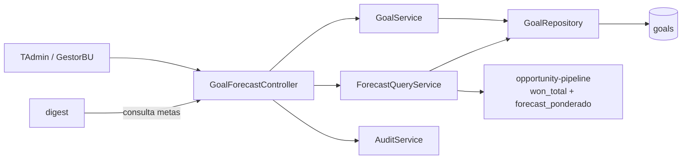
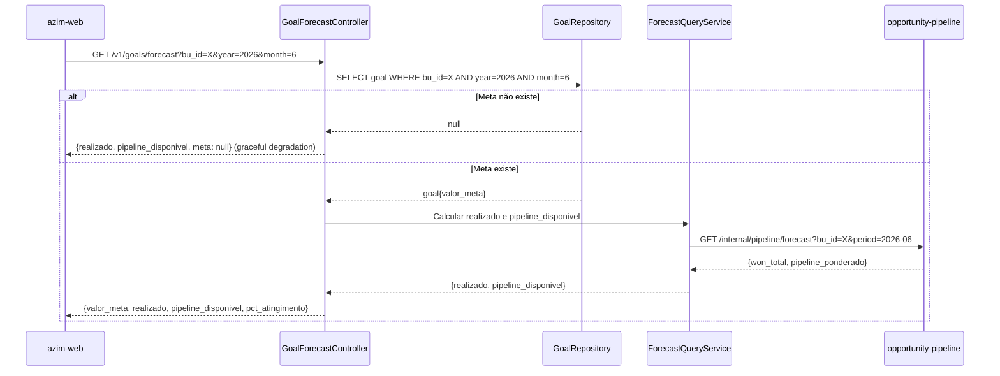

# Module — Goal & Forecast

**Status:** Rascunho para revisão
**Fase:** Fase 1 MVP

---

## 1. Visão Geral

Módulo responsável pelo cadastro de metas mensais por BU e/ou responsável, e pela composição do painel comparativo realizado vs meta vs pipeline. Alimenta o bloco de metas no azimute do Digest. Implementa graceful degradation quando não há meta cadastrada (RN-018: bloco omitido no Digest).

---

## 2. Classificação

| Item | Valor |
|---|---|
| Tipo de Módulo | Application Module |
| Deployable Candidato | azim-api |
| Bounded Context Relacionado | Goal & Forecast (BC-05) |
| Subdomínio DDD | Supporting Subdomain |
| Tier / Criticidade | Tier 2 — suporte ao pipeline; graceful degradation garante que ausência de meta não quebra o sistema |
| Status | Rascunho para revisão |

---

## 3. Objetivo

Permitir o cadastro de metas mensais em centavos inteiros por BU e/ou responsável, e calcular o painel comparativo: valor realizado (oportunidades ganhas no período) vs meta vs pipeline disponível (oportunidades abertas ponderadas). Fornecer o bloco de metas para o Digest.

---

## 4. Responsabilidades

- CRUD de metas mensais por (tenant_id, bu_id, owner_id, year, month) com unicidade garantida (UNIQUE constraint).
- Calcular `realizado` (won_total no período) a partir do Opportunity Pipeline.
- Calcular `pipeline_disponível` (soma de forecast_ponderado de opps abertas) a partir do Pipeline.
- Compor painel comparativo: meta, realizado, pipeline_disponível, % atingimento.
- Graceful degradation: retornar painel sem bloco de meta quando não houver meta cadastrada (RN-017, RN-018).
- Fornecer dados de meta para o Digest (bloco do azimute semanal).
- Publicar AuditEvent em toda escrita via audit-log.

---

## 5. Fora de Escopo

- Cálculo de `valor_total` e `forecast_ponderado` por oportunidade (pertence ao opportunity-pipeline — RN-005, RN-006).
- Composição e envio do Digest (pertence ao digest).
- Previsão de demanda ou forecast preditivo com IA (pertence ao ai-intelligence — Fase 3).
- Metas por produto ou categoria (fora do MVP).

---

## 6. Capacidades Atendidas

| Código | Capability | Descrição |
|---|---|---|
| CAP-07 | Metas e Forecast Comparativo | Cadastro de metas mensais; painel realizado vs meta; graceful degradation |

---

## 7. Bounded Context e Linguagem Ubíqua

| Termo | Definição |
|---|---|
| Goal | Meta mensal em centavos inteiros por BU e/ou responsável |
| GoalPeriod | Período da meta: ano e mês |
| valor_meta | Valor da meta em centavos inteiros BRL (DEC-011) |
| realizado | Soma dos valor_total de oportunidades ganhas no período |
| pipeline_disponível | Soma do forecast_ponderado de oportunidades abertas no período |
| graceful degradation | Comportamento do sistema quando a meta não existe: não exibir o bloco, sem erro |
| azimute | Bloco semanal do Digest que inclui meta, realizado e pipeline (RN-029 — apenas às segundas) |

---

## 8. Componentes Internos Candidatos

| Componente | Tipo | Responsabilidade |
|---|---|---|
| GoalService | Domain Service | CRUD de metas mensais com unicidade |
| ForecastQueryService | Application Service | Calcula realizado e pipeline_disponível consultando o Pipeline |
| GoalForecastController | API Controller | Endpoints de metas e painel comparativo |
| GoalRepository | Repository | Escrita e leitura em goals |

---

## 9. APIs Principais

| Método | Endpoint | Finalidade | Consumidores |
|---|---|---|---|
| GET | /v1/goals | Lista metas do tenant por período/BU | azim-web, digest |
| POST | /v1/goals | Criar ou atualizar meta mensal | TAdmin, GestorBU |
| PUT | /v1/goals/{id} | Atualizar meta | TAdmin, GestorBU |
| GET | /v1/goals/forecast | Painel comparativo: meta vs realizado vs pipeline | azim-web, digest |

---

## 10. Eventos Publicados

| Evento | Quando é publicado | Consumidores |
|---|---|---|
| GoalUpdated | Após criação ou atualização de meta | audit-log |

---

## 11. Eventos Consumidos

Este módulo não consome eventos diretamente. Consulta o opportunity-pipeline via API interna para calcular realizado e pipeline_disponível.

---

## 12. Dados Próprios

| Entidade/Tabela | Tipo | Banco/Persistência | Observações |
|---|---|---|---|
| goals | Transacional | Cloud SQL / Postgres | Valores em centavos inteiros (DEC-011); UNIQUE(tenant_id, bu_id, owner_id, year, month) |

---

## 13. Integrações

| Sistema/Módulo | Tipo de Integração | Direção | Observações |
|---|---|---|---|
| opportunity-pipeline | API HTTP (read-only) | Entrada | Consulta won_total e forecast_ponderado por período para painel |
| digest | API HTTP | Entrada | Digest consulta bloco de metas para azimute semanal |
| reporting | Read Model (query) | Entrada | Relatórios de metas e forecast |
| audit-log | Package (AuditService) | Saída | Toda escrita gera AuditEvent |

---

## 14. Dependências

### 14.1 Dependências de Domínio

- opportunity-pipeline: won_total e forecast_ponderado são calculados a partir de dados do Pipeline.
- organization: bu_id e owner_id para validação de escopo.

### 14.2 Dependências Técnicas

- Cloud SQL / Postgres (tabela goals)
- API interna do opportunity-pipeline (read-only, no mesmo monólito modular)

### 14.3 Dependências Operacionais

- Nenhuma dependência operacional específica além do banco.

---

## 15. Requisitos Não Funcionais Relevantes

| Categoria | Requisito / Observação |
|---|---|
| Resiliência | Graceful degradation: se meta não existe, retornar painel sem bloco de meta (sem erro 404) |
| Performance | Painel comparativo deve ser calculado em tempo real na query; sem cache separado |
| Auditabilidade | Toda criação e atualização de meta deve gerar AuditEvent |

---

## 16. Compliance Aplicável

| Compliance / Norma / Lei | Aplicável? | Motivo | Impacto no Módulo |
|---|---|---|---|
| LGPD | Não aplicável | Goals não contêm PII diretamente | — |
| PCI DSS | Não aplicável | Não processa dados de cartão | — |

---

## 17. Observabilidade

| Item | Recomendação Inicial |
|---|---|
| Logs | Log estruturado: correlation_id, tenant_id, bu_id, período, ação |
| Métricas | goals_created_total, goals_updated_total |
| Auditoria | Toda escrita gera entrada em audit-log |

---

## 18. Diagramas do Módulo

### 18.1 Diagrama de Componentes Internos

### 18.2 Diagrama de Fluxo — Painel Comparativo

---

## 19. Riscos

| Código | Risco | Impacto | Mitigação |
|---|---|---|---|
| RISK-GOAL-01 | Indisponibilidade do opportunity-pipeline impede cálculo do painel | Painel comparativo não exibível | Circuit breaker na consulta ao pipeline; retornar valores parciais disponíveis |
| RISK-GOAL-02 | Meta duplicada por condição de corrida | Constraint violada | UNIQUE constraint no banco como última linha de defesa |

---

## 20. Pontos a Validar

| Código | Ponto | Impacto | Recomendação |
|---|---|---|---|
| VAL-GOAL-01 | Meta por owner_id vs meta apenas por bu_id | Define granularidade das metas | Confirmar com produto: metas individuais por vendedor ou apenas por BU? |
| VAL-GOAL-02 | Período de apuração de realizado: data de fechamento vs data de ganho | Define como won_total é calculado | Confirmar com produto antes de implementar ForecastQueryService |

---

## 21. Backlog Inicial Sugerido

| Tipo | Item | Descrição |
|---|---|---|
| Epic | Metas e Forecast Comparativo | Cadastro de metas mensais e painel realizado vs meta |
| Story Técnica | CRUD de metas mensais com unicidade | POST/PUT/GET /v1/goals com UNIQUE constraint |
| Story Técnica | Painel comparativo com graceful degradation | GET /v1/goals/forecast sem erro quando meta ausente |
| Story Técnica | API de metas para o Digest | GET /v1/goals com filtro por BU e período para o azimute semanal |

---

## 22. Referências

| Documento | Seção |
|---|---|
| DDD Segmentation | §4.1 BC-05 Goal & Forecast |
| DDD Segmentation | §6 Data Ownership — Goal & Forecast |
| Data Model | §3 Goal & Forecast (BC-05) |
| Context Map | relations.md — Goal & Forecast → Opportunity Pipeline |
| Context Map | relations.md — Digest → Goal & Forecast |
