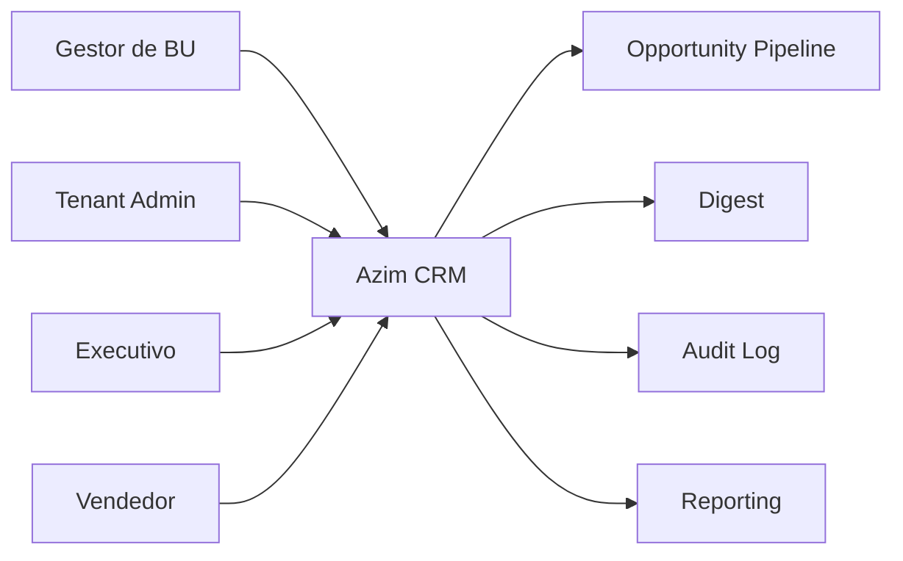
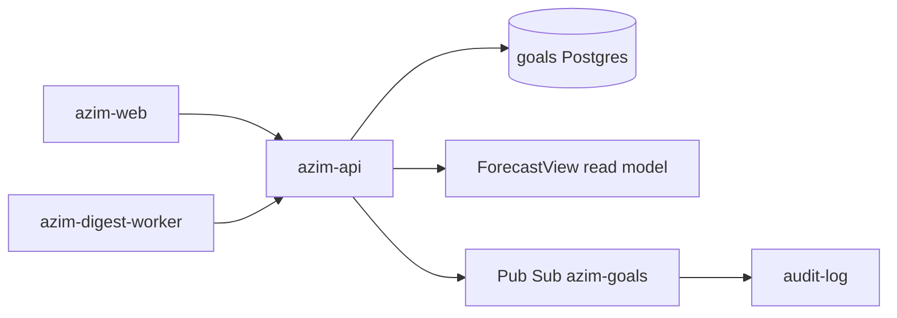
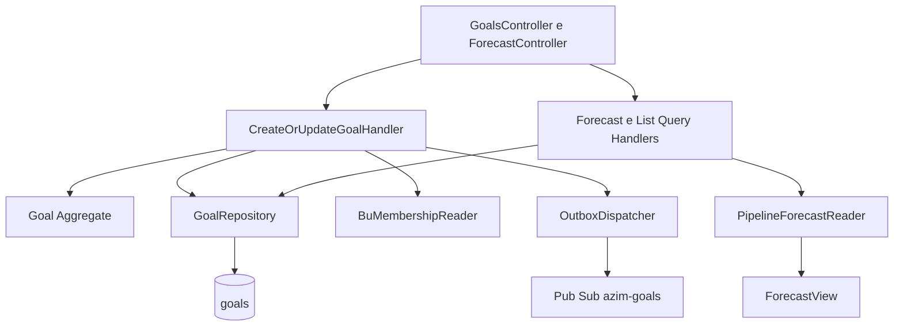
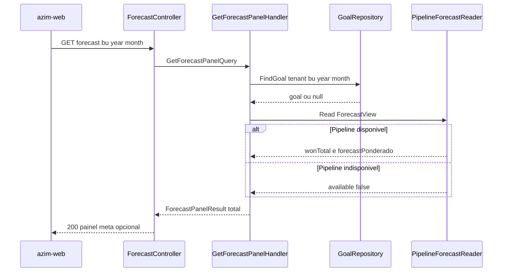
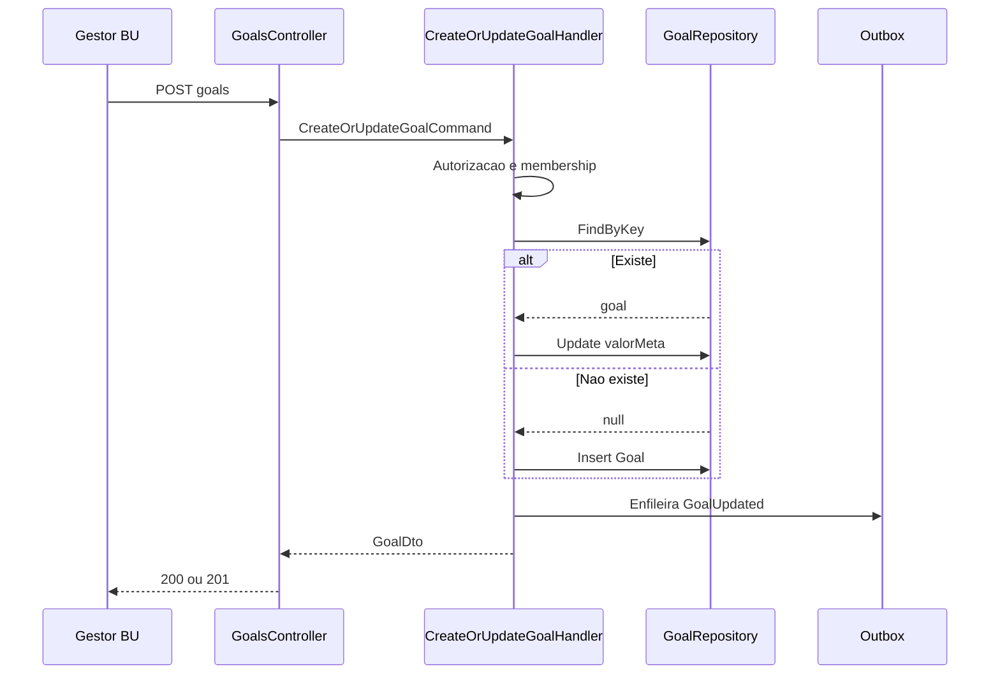
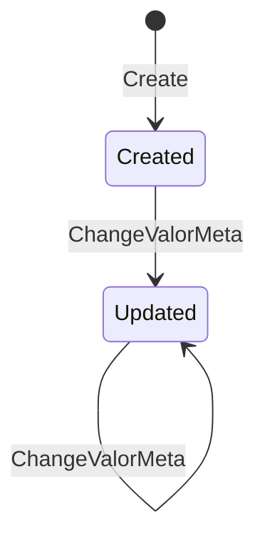

# GF — Goal & Forecast (Metas e Forecast Comparativo)
**Design Técnico**

- Versão: 0.1.0
- Data: 2026-06-11
- Status: Rascunho para revisão
- Referência base: docs/product/modules/goal-forecast/requirements.md v0.1.0
- ADRs aplicáveis: ADR-0001 (Isolamento multi-tenant — defesa em profundidade)
- Rules aplicáveis: `.forge/rules/` (conventions, architecture, domain/money-audit, testing)

## Histórico de Versões

| Versão | Data | Status | Descrição da alteração |
|--------|------|--------|------------------------|
| 0.1.0 | 2026-06-11 | Rascunho para revisão | Criação inicial do design técnico do módulo goal-forecast |

## 1. Visão Geral

O módulo **goal-forecast** (BC-05, subdomínio de suporte, deployable `azim-api`) entrega dois resultados técnicos:

1. **CRUD de metas mensais** (`Goal`) em centavos inteiros, com escopo `BU` ou `RESPONSAVEL`, único por `(tenant_id, bu_id, owner_id, year, month)`.
2. **Composição do painel comparativo "Direção"** (realizado vs meta vs pipeline disponível), com agregações trimestral/anual derivadas e degradação graciosa sem meta.

O módulo **não recalcula forecast**. Os valores `realizado` (`won_total`) e `pipeline_disponivel` (`forecast_ponderado`) são lidos do módulo **opportunity-pipeline** por uma porta de leitura síncrona na query (read model `ForecastView`). O goal-forecast é dono exclusivo da tabela `goals` e da lógica de comparação meta vs realizado vs pipeline.

Fronteira de fases:

- **Fase 1 (MVP, este design):** CRUD de metas, painel comparativo básico (meta, realizado, pipeline, gap, pct), agregação trimestral/anual derivada, degradação graciosa, bloco para o Digest, auditoria e RBAC.
- **Fase 2 (fora deste MVP, contemplada na arquitetura):** projeção por `data_fechamento_esperada` (painel "Direção" completo — Req 11). O design deixa pontos de extensão explícitos, mas não implementa a projeção.

### 1.1 Rastreabilidade requisito → design

| Requisito | Elemento(s) de design |
|---|---|
| Req 1 — Cadastrar meta | `CreateOrUpdateGoalCommand` (§5.1), agregado `Goal` (§4.1), validação de membership (§5.5), `goals` (§7) |
| Req 2 — Unicidade por período | UNIQUE `(tenant_id, bu_id, owner_id, year, month)` (§7), upsert idempotente (§5.1), DD-002 |
| Req 3 — Consultar metas | `ListGoalsQuery` (§5.2), filtro RBAC (§10), Global Query Filter + RLS (§6.1) |
| Req 4 — Atualizar meta | `CreateOrUpdateGoalCommand` modo update (§5.1), auditoria (§5.4) |
| Req 5 — Painel comparativo | `GetForecastPanelQuery` (§5.2), `ForecastView` porta (§6.4), DD-005 |
| Req 6 — Degradação graciosa | `ForecastPanelResult` com meta nula (§5.2, §8), DD-006, PBT-04 |
| Req 7 — Agregação trimestre/ano | `GetGoalAggregateQuery` (§5.2), agregação em memória (§4.6), DD-003 |
| Req 8 — Derivar do pipeline | `IPipelineForecastReader` (§6.4), read-only, DD-005 |
| Req 9 — Bloco para Digest | `GetGoalDigestBlockQuery` (§5.2), sinalização de ausência (§8) |
| Req 10 — Auditoria | `GoalUpdated` domain event + `AuditBehavior` (§4.4, §5.4, §6.6) |
| Req 11 — Projeção (Fase 2) | Ponto de extensão `ForecastView.projecao` (§6.4) — não implementado |
| Req 12 — Tenant + RBAC | RLS + Global Query Filter (§6.1, §10), `GoalAuthorizationPolicy` (§4.6) |
| RNF 1 — Multi-tenant | ADR-0001: tenant_id + Global Query Filter + RLS (§6.1, §10) |
| RNF 2 — RBAC | `GoalAuthorizationBehavior` (§5.4), políticas (§10) |
| RNF 3 — Latência | Query direta sem cache, índices (§7, §15) |
| RNF 4 — Centavos inteiros | objeto de valor `Money` (§4.3), `BIGINT` (§7), PBT-05 |
| RNF 5 — Auditoria imutável | outbox + audit-log append-only (§6.6) |
| RNF 6 — Resiliência pipeline | timeout + circuit breaker na porta (§6.4), DD-007 |
| RNF 7 — Observabilidade | logs estruturados, métricas (§11) |

## 2. Princípios e Decisões Macro

- **Clean Architecture** com cinco projetos: `GoalForecast.Domain`, `GoalForecast.Application`, `GoalForecast.Infrastructure`, `GoalForecast.Api`, `GoalForecast.Contracts` (DD-001). No monólito modular `azim-api`, o módulo é um slice vertical com fronteiras validadas por testes de arquitetura.
- **CQRS leve:** commands para escrita de meta, queries para leitura/painel/agregação/digest. Sem event sourcing.
- **DDD tático:** `Goal` é Aggregate Root pequeno, protege invariantes de período e monetária. Agregações trimestral/anual e o painel **não** são persistidos — são derivados na query (RN-027).
- **O goal-forecast nunca calcula forecast por oportunidade.** Consome o read model `ForecastView` do opportunity-pipeline via porta de leitura (RN-005, RN-006).
- **Multi-tenant defesa em profundidade (ADR-0001, vinculante):** `tenant_id` em toda linha, EF Core Global Query Filter na aplicação e **Row-Level Security (RLS) obrigatória** no Postgres. RLS não é opcional.
- **Integridade monetária:** objeto de valor `Money` em centavos inteiros (`long`/`BIGINT`); proibido `float`/`double`. `pct_atingimento` é a única razão derivada e nunca substitui o inteiro de origem (RNF 4).
- **Degradação graciosa como propriedade:** o painel é função total (PBT-04). Ausência de meta e indisponibilidade do pipeline são estados explícitos, nunca exceções ou zero confundível.
- **Auditoria append-only** via domain event `GoalUpdated` despachado por outbox para o audit-log.

## 3. Estrutura da Solução

```text
GoalForecast.Domain            -> ∅ (sem dependências externas)
  Goal (Aggregate Root)
  GoalScope, GoalPeriod, Money (objetos de valor)
  GoalUpdated (domain event)
  GoalAuthorizationPolicy, BuMembershipSpecification

GoalForecast.Application       -> Domain, Contracts
  Commands/CreateOrUpdateGoalCommand + Handler
  Queries/ListGoalsQuery, GetForecastPanelQuery, GetGoalAggregateQuery, GetGoalDigestBlockQuery
  Ports/IGoalRepository, IPipelineForecastReader, IBuMembershipReader
  Behaviors/Validation, Authorization, Audit, Logging

GoalForecast.Infrastructure    -> Application, Domain
  Persistence/GoalRepository, GoalForecastDbContext (Global Query Filter)
  Pipeline/PipelineForecastReader (in-process read do opportunity-pipeline + circuit breaker)
  Organization/BuMembershipReader
  Outbox/OutboxDispatcher

GoalForecast.Api               -> Application, Infrastructure, Contracts
  Controllers/GoalsController, ForecastController
  Internal/InternalGoalsController (Digest worker)

GoalForecast.Contracts         -> ∅
  DTOs de request/response, schema do evento goal.updated.v1
```

Regras de dependência (validadas por `GoalForecast.Architecture.Tests`):

```text
Api -> Application, Infrastructure, Contracts
Application -> Domain, Contracts
Infrastructure -> Application, Domain
Domain -> ∅
Contracts -> ∅
```

> Nota: a leitura do pipeline é in-process no monólito modular, mas atravessa a porta `IPipelineForecastReader` (read model `ForecastView`), preservando o desacoplamento lógico e a possibilidade futura de extração para HTTP (DD-005).

## 4. Modelo de Domínio

### 4.1 Aggregates

**`Goal`** — Aggregate Root único do módulo. Representa a meta de um dono por período.

| Atributo | Tipo de domínio | Observação |
|---|---|---|
| `Id` | `GoalId` (UUID) | Identidade |
| `TenantId` | `TenantId` (UUID) | Isolamento (RNF 1) |
| `Scope` | `GoalScope` (objeto de valor) | `BU` ou `RESPONSAVEL` |
| `Period` | `GoalPeriod` (objeto de valor) | `year`, `month` |
| `ValorMeta` | `Money` (objeto de valor) | centavos inteiros, não-negativo |
| `CreatedAt` / `UpdatedAt` | timestamp | auditoria técnica |

Invariantes protegidas pelo Aggregate Root:

- INV-1: `ValorMeta` é sempre `>= 0` e inteiro de centavos (Req 1.2, RNF 4).
- INV-2: `Period.Month` ∈ [1..12] e `Period.Year` é ano de quatro dígitos (Req 1.3).
- INV-3: `Scope.BuId` é sempre obrigatório; `Scope.OwnerId` obrigatório se e somente se escopo `RESPONSAVEL` (seção 4 do requirements).
- INV-4: o agregado não cruza fronteira de tenant; `TenantId` é imutável após criação.
- Fronteira transacional: uma escrita de meta = uma transação sobre uma única linha de `goals` + um registro de outbox (auditoria).

Factory e operações:

- `Goal.Create(tenantId, scope, period, valorMeta)` → valida INV-1..INV-4, emite `GoalUpdated(action=created)`.
- `goal.ChangeValorMeta(novoValor)` → revalida INV-1, atualiza `UpdatedAt`, emite `GoalUpdated(action=updated, delta)` (Req 4).

> A consistência de membership (`owner_id` é membro da `bu_id`, Req 1.4) é validada na aplicação via `IBuMembershipReader`, pois depende de dados do contexto `organization`, fora do agregado `Goal` (DD-004).

### 4.2 Entidades

Não há entidades filhas. O agregado `Goal` é uma raiz simples (sem coleções internas). As agregações trimestral/anual e o painel são **projeções de leitura**, não entidades persistidas (RN-027).

### 4.3 Objetos de valor

- **`GoalScope`** — imutável; campos `BuId` (obrigatório) e `OwnerId` (nulo no escopo BU). Expõe `Kind ∈ {BU, RESPONSAVEL}` derivado da presença de `OwnerId`. Igualdade por valor.
- **`GoalPeriod`** — imutável; `Year` (smallint), `Month` (1..12). Métodos `Quarter()` e `YearOf()` para suportar agregação. Igualdade por valor.
- **`Money`** — imutável; `Cents` (`long`). Operações `Add`, `Subtract` apenas inteiras. Sem multiplicação/divisão monetária no domínio; `pct_atingimento` é razão derivada na query, não método de `Money`. Igualdade por valor. Proíbe construção a partir de `double` (RNF 4, PBT-05).

> Nomenclatura: usamos sempre "objeto de valor", nunca "VO".

### 4.4 Domain Events

| Evento | Quando | Payload (delta) | Consumidor |
|---|---|---|---|
| `GoalUpdated` (`goal.updated.v1`) | após `Create` ou `ChangeValorMeta` | `goal_id`, `tenant_id`, `bu_id`, `owner_id`, `year`, `month`, `action`, `valor_meta_anterior`, `valor_meta_novo` | audit-log, digest, reporting |

Eventos de domínio nomeados no passado. `GoalUpdated` é evento de **integração** (publicado para outros BCs via outbox); internamente também aciona a trilha de auditoria (Req 10). Não há outros eventos no MVP.

### 4.5 State Machines

`Goal` não possui ciclo de vida com múltiplos estados de negócio (sem rascunho/aprovação/arquivamento no MVP). Existe apenas `created → updated*`. **Não aplicável** uma state machine não trivial nesta versão.

### 4.6 Policies / Specifications

- **`GoalAuthorizationPolicy`** — decide se um `principal` (role + tenant + bu + ownerId) pode escrever ou ler uma meta de determinado escopo (Req 12, §10). Pura, sem I/O.
- **`BuMembershipSpecification`** — expressa a intenção de domínio "o owner pertence à BU"; avaliada com dados fornecidos por `IBuMembershipReader` (Req 1.4).
- **`GoalAggregation`** (serviço de domínio puro) — soma exata em centavos de um conjunto de `Goal` por trimestre/ano; meses ausentes contribuem com `Money.Zero` (RN-027, PBT-02). Função total, determinística, sem arredondamento.

## 5. Application Layer

### 5.1 Commands

**`CreateOrUpdateGoalCommand`** (Req 1, Req 2, Req 4) — comando único de escrita com semântica **upsert idempotente por chave** (DD-002, PBT-01).

| Campo | Tipo | Regras |
|---|---|---|
| `scope` | enum `BU`\|`RESPONSAVEL` | obrigatório |
| `buId` | UUID | obrigatório |
| `ownerId` | UUID? | obrigatório se `RESPONSAVEL`, proibido se `BU` |
| `year` | int | quatro dígitos |
| `month` | int | 1..12 |
| `valorMeta` | long (centavos) | `>= 0`, inteiro |

Handler `CreateOrUpdateGoalCommandHandler`:

1. Resolve `tenant_id` do contexto autenticado (nunca do payload).
2. Autorização via `GoalAuthorizationPolicy` (escrita).
3. Se escopo `RESPONSAVEL`, valida membership via `IBuMembershipReader` (Req 1.4) → erro `GF-ERR-004` se falhar.
4. `IGoalRepository.FindByKey(tenant, bu, owner, year, month)`:
   - existe → `goal.ChangeValorMeta(...)` (update);
   - não existe → `Goal.Create(...)` (insert).
5. Persiste em transação; a UNIQUE constraint + tratamento de violação garantem upsert sob corrida (Req 2.2, DD-002) — em conflito de corrida, retenta como update.
6. Despacha `GoalUpdated` via outbox (auditoria).

### 5.2 Queries

| Query | Requisito | Retorno |
|---|---|---|
| `ListGoalsQuery(buId?, ownerId?, year?, month?)` | Req 3 | lista de `GoalDto` do tenant, filtrada por RBAC |
| `GetForecastPanelQuery(scope, year, month)` | Req 5, Req 6 | `ForecastPanelResult` (total, meta possivelmente nula) |
| `GetGoalAggregateQuery(scope, year, granularity=quarter\|year)` | Req 7 | soma derivada em centavos |
| `GetGoalDigestBlockQuery(buId, year, month)` | Req 9 | bloco de meta ou sinal de ausência |

**`GetForecastPanelQuery`** — orquestra a composição (sem recalcular forecast):

1. Autorização de leitura (escopo de visibilidade, Req 12).
2. Lê a meta do tenant/escopo/período via `IGoalRepository` (pode ser nula).
3. Lê `won_total` e `forecast_ponderado` via `IPipelineForecastReader.Read(ForecastViewQuery)` (Req 8).
4. Compõe `ForecastPanelResult`:
   - `realizado = won_total`; `pipeline_disponivel = forecast_ponderado`;
   - se meta presente: `gap = valor_meta − realizado`; `pct_atingimento = realizado / valor_meta` quando `valor_meta > 0` (PBT-03);
   - se meta ausente: `valor_meta = gap = pct_atingimento = null`, demais campos presentes (Req 6, PBT-04);
   - se pipeline indisponível: `realizado`/`pipeline_disponivel` marcados como `unavailable=true`, sem zero confundível (RNF 6, DD-007).

`GetGoalAggregateQuery` usa `GoalAggregation` (§4.6): meses ausentes = zero, soma exata (PBT-02).

### 5.3 Handlers

Um handler por caso de uso (CQRS). Handlers de query são read-only e não emitem eventos. O único handler de escrita é `CreateOrUpdateGoalCommandHandler`. Handlers dependem apenas de portas (`IGoalRepository`, `IPipelineForecastReader`, `IBuMembershipReader`) e do domínio.

### 5.4 Pipeline Behaviors

Encadeamento (estilo MediatR; mecanismo equivalente se a stack divergir — DD-001):

1. `LoggingBehavior` — correlation_id, tenant_id, bu_id, período, ação (RNF 7).
2. `TenantContextBehavior` — injeta/valida `tenant_id` do principal (ADR-0001, camada de aplicação).
3. `ValidationBehavior` — validação sintática do command/query (§5.5).
4. `GoalAuthorizationBehavior` — aplica `GoalAuthorizationPolicy` (RNF 2).
5. `AuditBehavior` (apenas commands) — após sucesso, garante enfileiramento de `GoalUpdated` no outbox (Req 10, RNF 5).

### 5.5 Validações de Aplicação

- Sintáticas na borda (FluentValidation ou equivalente): `month ∈ [1..12]`, `year` quatro dígitos, `valorMeta >= 0` inteiro, coerência `scope` × `ownerId` (Req 1.2, 1.3).
- Regra de negócio no domínio: invariantes do agregado `Goal` (§4.1).
- Consistência externa na aplicação: membership owner↔BU via porta (Req 1.4).
- Idempotência: chave de upsert `(tenant, bu, owner, year, month)` (PBT-01).

## 6. Infrastructure Layer

### 6.1 Persistência

- `GoalForecastDbContext` (EF Core / Npgsql) mapeia `Goal` → `goals`. `Money` e `GoalPeriod` como conversões de valor (`ValueConverter`/owned types) preservando `BIGINT`/`SMALLINT`.
- **EF Core Global Query Filter** por `tenant_id` em `goals` (ADR-0001, camada aplicação).
- **Row-Level Security (RLS) obrigatória** no Postgres (ADR-0001, camada banco — não opcional): policy que filtra por `current_setting('app.tenant_id')`. A sessão de conexão define `SET app.tenant_id` a cada request a partir do tenant autenticado. Defesa em profundidade: mesmo se o Global Query Filter for omitido por engano, a RLS bloqueia vazamento (RNF-1.1).
- `IGoalRepository`: `FindByKey`, `FindById`, `Add`, `Update`, `Query` (intenção de domínio, não DSL de SQL).

### 6.2 Cache

**Não aplicável nesta versão.** RNF-3.3 determina cálculo do painel em tempo real na query, sem cache dedicado. Caso a latência exceda o SLO, avaliar cache em Fase 2 (registrar como DD futuro).

### 6.3 Mensageria

Saída de eventos de integração via **Outbox** → Pub/Sub topic `azim-goals` (`goal.updated.v1`), conforme TRD. O módulo **não consome** eventos no MVP (lê o pipeline de forma síncrona). Sem DLQ própria além da política transversal do barramento.

### 6.4 Integrações Externas

**`IPipelineForecastReader`** (porta de leitura do read model `ForecastView`):

```text
ForecastViewQuery { tenantId, buId?, ownerId?, year, month }
ForecastViewResult { wonTotalCents: long, forecastPonderadoCents: long, available: bool }
```

- Implementação `PipelineForecastReader` lê o read model `ForecastView` (opportunities + goals) do opportunity-pipeline **in-process** no monólito modular (DD-005), read-only.
- **Resiliência (RNF 6, DD-007):** timeout curto, **circuit breaker**; em falha/timeout, retorna `available=false` em vez de zero. Nunca escreve no pipeline (Req 8.3).
- **Ponto de extensão Fase 2:** `ForecastViewResult` poderá incluir `projecaoFechamentoCents` derivada de `data_fechamento_esperada` (Req 11) — não implementado neste MVP.

### 6.5 Idempotência

- Escrita de meta: idempotência por chave natural `(tenant, bu, owner, year, month)` + UNIQUE constraint (PBT-01, DD-002).
- Publicação de evento: outbox com `event_id` único; consumidores deduplicam por `event_id` (auditoria append-only tolera reentrega).

### 6.6 Outbox / Inbox

- **Outbox:** `GoalUpdated` gravado na mesma transação da escrita de `goals`; dispatcher publica em `azim-goals` e alimenta o audit-log (append-only). Garante atomicidade entre estado e auditoria (Req 10, RNF 5).
- **Inbox:** não aplicável — o módulo não consome eventos no MVP.

## 7. Schema / Modelo de Persistência

Tabela `goals` (Cloud SQL / Postgres), nomes físicos em `snake_case`:

```sql
goals (
  id              UUID PRIMARY KEY DEFAULT gen_random_uuid(),
  tenant_id       UUID NOT NULL,
  bu_id           UUID NOT NULL REFERENCES business_units(id),  -- DD-008: NOT NULL (bu sempre obrigatória)
  owner_id        UUID REFERENCES users(id),                    -- nulo no escopo BU
  year            SMALLINT NOT NULL,
  month           SMALLINT NOT NULL CHECK (month BETWEEN 1 AND 12),
  valor_meta      BIGINT NOT NULL CHECK (valor_meta >= 0),      -- centavos inteiros (DEC-011, RNF 4)
  created_at      TIMESTAMPTZ NOT NULL DEFAULT now(),
  updated_at      TIMESTAMPTZ NOT NULL DEFAULT now(),
  UNIQUE (tenant_id, bu_id, owner_id, year, month)              -- Req 2
)
```

Considerações:

- **Unicidade com `owner_id` nulo:** no Postgres, `NULL` não colide em UNIQUE. Para garantir unicidade da meta de BU (owner nulo), criar índice único parcial complementar: `CREATE UNIQUE INDEX ux_goals_bu_scope ON goals (tenant_id, bu_id, year, month) WHERE owner_id IS NULL;` e manter a UNIQUE composta para escopo RESPONSAVEL (DD-002).
- **RLS obrigatória (ADR-0001):**
  ```sql
  ALTER TABLE goals ENABLE ROW LEVEL SECURITY;
  ALTER TABLE goals FORCE ROW LEVEL SECURITY;
  CREATE POLICY goals_tenant_isolation ON goals
    USING (tenant_id = current_setting('app.tenant_id')::uuid);
  ```
- **Índices:** `(tenant_id, bu_id, year, month)` e `(tenant_id, owner_id, year, month)` para consulta e painel (RNF 3, §15).
- **Auditoria:** `created_at`/`updated_at` técnicos na tabela; trilha imutável de negócio no audit-log (não nesta tabela).
- **Multi-tenancy:** `tenant_id` obrigatório em toda linha (§14).
- **Retenção:** metas não expiram no MVP; auditoria segue NFR-AUD-03.
- **Migration:** versionada (EF Core migrations); criação da tabela, índices, índice parcial e policies RLS no mesmo deploy.
- **Decisão divergente da data-model:** `bu_id` passa a `NOT NULL` (DD-008), alinhado à regra canônica "não existe meta global de tenant" (requirements §4). A data-model marca `bu_id` nullable; este design registra a divergência para reconciliação.

## 8. API Contracts

Base: `/api/v1`. Autenticação JWT; `tenant_id` derivado do token. Todos os valores monetários em **centavos inteiros** (RNF 4).

### 8.1 POST /api/v1/goals — criar/atualizar meta (upsert)

- **Autorização:** Tenant Admin (qualquer BU) ou Gestor de BU (sua BU) — RNF-2.1.
- **Request:**
  ```json
  { "scope": "RESPONSAVEL", "buId": "uuid", "ownerId": "uuid", "year": 2026, "month": 6, "valorMeta": 50000000 }
  ```
- **Response 200/201:** `GoalDto` `{ id, scope, buId, ownerId, year, month, valorMeta }`.
- **Códigos:** 201 criada, 200 atualizada, 400 validação (`GF-ERR-001/002/003`), 403 (`GF-ERR-006`), 409 conflito (`GF-ERR-005`), 422 membership (`GF-ERR-004`).
- Idempotente por chave (PBT-01).

### 8.2 PUT /api/v1/goals/{id} — atualizar valor_meta

- **Autorização:** idem POST.
- **Request:** `{ "valorMeta": 60000000 }`.
- **Response 200:** `GoalDto`. **Códigos:** 200, 400, 403, 404 (`GF-ERR-007`), 409 (`GF-ERR-005`).

### 8.3 GET /api/v1/goals — listar metas

- **Autorização:** leitura com escopo de visibilidade (Req 12). Vendedor: só `owner_id` próprio; Gestor: sua BU; Admin/Executivo: tenant.
- **Query params:** `buId?`, `ownerId?`, `year?`, `month?`. **Paginação:** `page`, `pageSize` (default 50, máx 200), ordenação por `year,month,bu_id`.
- **Response 200:** `{ items: GoalDto[], page, pageSize, total }`. **Códigos:** 200, 400, 403.

### 8.4 GET /api/v1/forecast — painel comparativo "Direção"

- **Autorização:** leitura com escopo de visibilidade (Req 12).
- **Query params:** `buId?`, `ownerId?`, `year`, `month` (ou `period=YYYY-MM`).
- **Response 200 (com meta):**
  ```json
  { "scope": "BU", "buId": "uuid", "year": 2026, "month": 6,
    "valorMeta": 50000000, "realizado": 32000000, "pipelineDisponivel": 41000000,
    "gap": 18000000, "pctAtingimento": 0.64, "pipelineUnavailable": false }
  ```
- **Response 200 (sem meta — degradação graciosa, Req 6):**
  ```json
  { "scope": "BU", "buId": "uuid", "year": 2026, "month": 6,
    "valorMeta": null, "realizado": 32000000, "pipelineDisponivel": 41000000,
    "gap": null, "pctAtingimento": null, "pipelineUnavailable": false }
  ```
- **Response 200 (pipeline indisponível, RNF 6):** `realizado`/`pipelineDisponivel` = `null`, `pipelineUnavailable: true`.
- **Operação total:** nunca 404, nunca `NaN` (PBT-04). **Códigos:** 200, 400, 403.

### 8.5 GET /api/v1/forecast/aggregate — agregação trimestral/anual

- **Query params:** `buId?`/`ownerId?`, `year`, `granularity=quarter|year`, `quarter?` (1..4).
- **Response 200:** `{ granularity, year, quarter?, valorMetaAgregado: long }` (soma derivada, RN-027). **Códigos:** 200, 400, 403.

### 8.6 GET /api/v1/internal/goals/digest-block — bloco para o Digest (interno)

- **Autorização:** chamador interno (Digest worker), mTLS/escopo de serviço; não exposto publicamente.
- **Query params:** `buId`, `year`, `month`.
- **Response 200 (com meta):** `{ present: true, valorMeta, realizado, gap, pipelineDisponivel }`.
- **Response 200 (sem meta — Req 9.2):** `{ present: false }` (Digest omite o bloco). **Códigos:** 200, 400, 403.

> Todo endpoint referencia o catálogo de erros (§12). Nenhum erro vaza existência de meta fora do escopo (RNF-2.3).

## 9. AsyncAPI / Eventos Publicados e Consumidos

### 9.1 Publicados

**`goal.updated.v1`** — topic `azim-goals` (Pub/Sub), evento de integração.

| Campo | Tipo | Observação |
|---|---|---|
| `eventId` | UUID | dedup/idempotência |
| `tenantId` | UUID | isolamento |
| `goalId` | UUID | |
| `buId` | UUID | |
| `ownerId` | UUID? | nulo no escopo BU |
| `year` / `month` | int | período |
| `action` | `created`\|`updated` | |
| `valorMetaAnterior` | long? | nulo em created |
| `valorMetaNovo` | long | centavos |
| `occurredAt` | timestamp | |

Headers: `correlation_id`, `causation_id`, `tenant_id`, `event_version=1`. Compatibilidade retroativa por versionamento de sufixo (`.v1`); novos campos opcionais não quebram consumidores. Consumidores: audit-log (append-only), digest, reporting.

### 9.2 Consumidos

**Nenhum** no MVP. A obtenção de `realizado`/`pipeline_disponivel` é por **leitura síncrona** do read model `ForecastView` (porta `IPipelineForecastReader`), não por evento (Req 8).

## 10. Segurança

- **Autenticação:** JWT do gateway; `tenant_id`, `user_id`, `role` e `bu_id` do principal extraídos do token, nunca do payload (Req 12.1).
- **Isolamento multi-tenant (ADR-0001, defesa em profundidade):** `tenant_id` em toda linha + EF Core Global Query Filter + **RLS obrigatória** no Postgres. Conexão define `app.tenant_id` por request. Falha de uma camada não vaza dados (RNF-1.1).
- **RBAC (RNF 2, Req 12), via `GoalAuthorizationPolicy`:**

  | Operação | Tenant Admin | Gestor de BU | Executivo | Vendedor |
  |---|---|---|---|---|
  | Criar/editar meta | qualquer BU | só sua BU | negado | negado |
  | Listar/ver painel | tenant | sua BU | tenant | só `owner_id` próprio |

- **Anti-enumeração:** negação de autorização não revela existência de metas de outras BUs/tenants; 403 genérico, sem distinção entre "não existe" e "sem permissão" para recursos fora de escopo (RNF-2.3, Req 12.4, `GF-ERR-006`).
- **Validação de entrada:** sintática na borda (§5.5), proteção contra over-posting (`tenant_id`/`id` ignorados no body).
- **Endpoint interno do Digest:** segregado em `/internal`, mTLS/escopo de serviço, não roteável externamente.
- **PII:** `goals` não contém PII (LGPD não aplicável diretamente — README §16). `owner_id` é referência, não dado pessoal direto; logs não expõem dado sensível além do necessário (RNF-7.3).
- **Criptografia:** em trânsito (TLS) e em repouso (Cloud SQL gerenciado), conforme política transversal. Secrets via Secret Manager.
- **Auditoria como controle:** toda escrita rastreada (append-only) por `user_id` e `delta_json` (Req 10).

## 11. Observabilidade

- **Logs estruturados** (RNF 7.1): `correlation_id`, `tenant_id`, `bu_id`, `owner_id`, `year`, `month`, `action`, `result`. Sem PII além do necessário (RNF-7.3). Indisponibilidade do pipeline logada com contexto (RNF-6.3).
- **Métricas** (RNF 7.2): `goals_created_total`, `goals_updated_total` (counters por tenant/bu); adicionais: `forecast_panel_requests_total`, `forecast_panel_latency_ms` (histograma), `pipeline_reader_failures_total`, `pipeline_circuit_open_total`.
- **Traces:** span por command/query com `correlation_id`; span filho na leitura do pipeline.
- **Health/readiness/liveness:** o módulo participa do health do `azim-api`; readiness depende do banco. A indisponibilidade do pipeline **não** torna o módulo unhealthy (degrada graciosamente).
- **Eventos de negócio observáveis:** `goal.updated.v1` no audit-log.
- **Alertas:** violação de isolamento → incidente sev-1 (RNF-1.3); taxa de `pipeline_circuit_open_total` elevada → alerta de degradação.
- **SLO técnico:** painel p95 ≤ 3.000 ms (RNF-3.1).

## 12. Catálogo de Erros

| Código | Mensagem | HTTP | Quando ocorre | Ação recomendada |
|---|---|---|---|---|
| `GF-ERR-001` | Valor de meta inválido. | 400 | `valorMeta` não inteiro ou negativo (Req 1.2) | Enviar inteiro de centavos `>= 0` |
| `GF-ERR-002` | Mês ou ano fora da faixa. | 400 | `month ∉ [1..12]` ou `year` inválido (Req 1.3) | Corrigir período |
| `GF-ERR-003` | Escopo inconsistente. | 400 | `ownerId` ausente em RESPONSAVEL ou presente em BU | Ajustar `scope`/`ownerId` |
| `GF-ERR-004` | Responsável não pertence à BU. | 422 | membership owner↔BU falha (Req 1.4) | Usar owner membro da BU |
| `GF-ERR-005` | Conflito de meta para o período. | 409 | violação de unicidade (Req 2, 4.3) | Atualizar a meta existente |
| `GF-ERR-006` | Operação não permitida. | 403 | RBAC/escopo negado (Req 12) | Verificar papel/escopo (não revela existência) |
| `GF-ERR-007` | Meta não encontrada. | 404 | `id` inexistente no tenant (PUT) | Verificar `id` |
| `GF-ERR-008` | Dados de pipeline indisponíveis. | 200 | leitura do pipeline falhou (RNF 6) | Resposta parcial com `pipelineUnavailable=true`, repetir depois |

Regras: mensagens não expõem dados sensíveis; erros de autorização não permitem enumeração (RNF-2.3); códigos estáveis e rastreáveis. `GF-ERR-008` não é erro HTTP — sinaliza degradação no corpo (Req 6/RNF 6).

## 13. Testes

| Camada | Foco | Requisitos/PBT cobertos |
|---|---|---|
| `Domain.Tests` | invariantes de `Goal`, `Money`, `GoalPeriod`, `GoalScope`; agregação | Req 1,7; RNF 4; PBT-02, PBT-05 |
| `Application.Tests` | handlers, upsert, RBAC policy, degradação | Req 1-7,12; PBT-01, PBT-03, PBT-04 |
| `Infrastructure.Tests` | repositório, Global Query Filter, mapeamento `Money`/período, circuit breaker | Req 2,8; RNF 1,6 |
| `Api.Tests` | contratos, códigos HTTP, anti-enumeração | Req 3,5,6,12; catálogo §12 |
| `Architecture.Tests` | regras de dependência Clean Architecture (§3) | princípio arquitetural |
| Integração/RLS | tenant não acessa metas de outro via API nem SQL sem contexto | RNF-1.2 (KPI-06: 100%, bloqueia merge) |
| Contrato | schema `goal.updated.v1` e `ForecastView` (porta) | §9, Req 8 |

**PBTs (geradores):**

- **PBT-01** — sequência aleatória de upserts com mesma chave → exatamente 1 registro com último `valorMeta` (gerador: chaves + valores aleatórios, ordem permutada).
- **PBT-02** — conjunto aleatório de metas mensais → trimestral = soma de 3, anual = soma de 12, meses ausentes = 0, exato em centavos (gerador: subconjuntos de meses + valores `long`).
- **PBT-03** — `gap = valorMeta − realizado`; `realizado=valorMeta ⇒ gap=0, pct=1` (gerador: pares `long` não-negativos).
- **PBT-04** — qualquer período/escopo válido (com ou sem meta) → resultado bem-formado, sem 404/`NaN` (gerador: presença/ausência de meta + pipeline disponível/indisponível).
- **PBT-05** — round-trip persistência e API preserva `long` exato, sem float (gerador: `long` não-negativo incl. limites grandes).

Testes de resiliência: pipeline com timeout/erro → `pipelineUnavailable=true`, sem exceção propagada (RNF 6). Testes de segurança: tentativa cross-tenant/cross-BU → 403 sem enumeração (RNF 2).

## 14. Multi-tenancy

Aplicável. Modelo **pool com isolamento por linha** (DEC-006, ADR-0001):

- `tenant_id` obrigatório em `goals`.
- Validação de escopo na aplicação (Global Query Filter) + **RLS obrigatória** no banco.
- `app.tenant_id` setado por request a partir do principal autenticado.
- Segregação de eventos: `goal.updated.v1` carrega `tenant_id`; consumidores filtram por tenant.
- Cache: não aplicável (§6.2), logo sem risco de vazamento por cache.
- Auditoria por tenant: registros carregam `tenant_id`.
- Risco de vazamento mitigado em duas camadas; violação → sev-1 (RNF-1.3).

## 15. Performance e Escalabilidade

- **SLO:** painel p95 ≤ 3.000 ms para até 12 meses agregados e ~2.000 oportunidades/tenant (RNF-3.1); CRUD dentro do SLO geral de API (RNF-3.2).
- **Sem cache dedicado** (RNF-3.3); cálculo em tempo real na query.
- **Índices críticos:** `(tenant_id, bu_id, year, month)`, `(tenant_id, owner_id, year, month)`, índice parcial de unicidade BU.
- **Agregação trimestral/anual:** leitura de ≤ 12 linhas + soma em memória — custo desprezível.
- **Gargalo esperado:** leitura do `ForecastView` (opportunity-pipeline). Mitigado por leitura in-process, timeout e circuit breaker (RNF 6).
- **Paginação:** listagem com `pageSize` máx 200; limite de payload aplicado.
- **Backpressure/resiliência:** circuit breaker isola falha do pipeline; o painel degrada em vez de saturar.
- **Scaling:** stateless no `azim-api`; escala horizontal com o deployable. Banco escala vertical (Cloud SQL) com índices adequados.

## 16. Diagramas

### 16.1 C4 Level 1 - System Context

Contexto do módulo dentro do Azim CRM e seus atores e sistemas vizinhos.



### 16.2 C4 Level 2 - Container

Containers envolvidos na operação do goal-forecast.



### 16.3 C4 Level 3 - Component

Componentes internos do slice goal-forecast.



### 16.4 Sequence Diagrams

Painel comparativo com degradação graciosa e resiliência ao pipeline.



Escrita de meta com upsert e auditoria.



### 16.5 State Diagrams

`Goal` possui ciclo de vida trivial; diagrama incluído por completude.



## 17. Decisões Inline

### DD-001 - Clean Architecture em cinco projetos com CQRS leve

**Contexto:** módulo de suporte dentro do monólito modular `azim-api`, com escrita simples e leituras compostas.

**Decisão:** organizar em `Domain`/`Application`/`Infrastructure`/`Api`/`Contracts` com CQRS leve (commands e queries), pipeline behaviors estilo MediatR.

**Justificativa:** preserva fronteiras, testabilidade e rastreabilidade; alinhado à stack documentada do `azim-api`.

**Alternativas:** serviço único anêmico (rejeitado: dilui invariantes); event sourcing (rejeitado: complexidade desnecessária para meta simples).

**Impacto:** mais arquivos, porém fronteiras validadas por testes de arquitetura.

### DD-002 - Upsert idempotente por chave natural com índice parcial

**Contexto:** Req 2 exige no máximo uma meta por escopo/período, sob condição de corrida; `owner_id` nulo no escopo BU não colide em UNIQUE padrão do Postgres.

**Decisão:** comando único `CreateOrUpdateGoal` com upsert por chave `(tenant, bu, owner, year, month)`; UNIQUE composta para RESPONSAVEL + índice único parcial `WHERE owner_id IS NULL` para BU; tratar violação de corrida como update.

**Justificativa:** garante exatamente um registro (PBT-01) cobrindo o caso de `NULL` em UNIQUE.

**Alternativas:** apenas UNIQUE composta (rejeitado: não impede duplicata de meta BU com owner nulo); lock pessimista (rejeitado: pior concorrência).

**Impacto:** dois constraints a manter; semântica de erro 409 clara.

### DD-003 - Agregações trimestral e anual derivadas, nunca persistidas

**Contexto:** RN-027 e PBT-02 exigem soma exata sem registro próprio.

**Decisão:** calcular agregações em memória na query (`GoalAggregation`), meses ausentes = zero.

**Justificativa:** evita estado redundante e risco de divergência; soma de ≤ 12 inteiros é barata.

**Alternativas:** materializar metas trimestrais/anuais (rejeitado: viola RN-027, risco de inconsistência).

**Impacto:** nenhuma tabela adicional; consistência garantida por construção.

### DD-004 - Membership owner-BU validada na aplicação, não no agregado

**Contexto:** Req 1.4 exige owner membro da BU, dado que pertence ao contexto organization.

**Decisão:** validar via porta `IBuMembershipReader` no handler; `BuMembershipSpecification` expressa a intenção no domínio.

**Justificativa:** mantém o agregado `Goal` livre de dependência de outro contexto (Clean Architecture).

**Alternativas:** carregar membership no domínio (rejeitado: acopla Goal a organization).

**Impacto:** uma leitura extra na escrita; erro `GF-ERR-004` dedicado.

### DD-005 - Leitura do pipeline via porta, in-process no monólito

**Contexto:** Req 8 exige derivar realizado/pipeline do opportunity-pipeline sem recalcular forecast; TRD indica read model `ForecastView` síncrono na query no mesmo monólito.

**Decisão:** porta `IPipelineForecastReader` lendo `ForecastView` in-process; contrato pronto para extração futura para HTTP.

**Justificativa:** desacopla logicamente sem custo de rede no MVP; preserva read-only (Req 8.3).

**Alternativas:** chamada HTTP interna já no MVP (rejeitado: latência e falha de rede desnecessárias dentro do monólito); duplicar cálculo de forecast (rejeitado: viola RN-005/RN-006).

**Impacto:** acoplamento de build entre slices controlado pela porta; migração futura simples.

### DD-006 - Degradação graciosa como resultado total com meta nula

**Contexto:** Req 6 e PBT-04 exigem painel sem erro quando não há meta.

**Decisão:** `ForecastPanelResult` modela meta/gap/pct como anuláveis; ausência de meta retorna 200 com campos nulos explícitos.

**Justificativa:** consulta total, sem 404/`NaN`, frontend distingue "meta não cadastrada".

**Alternativas:** 404 sem meta (rejeitado: viola Req 6.1); retornar zero (rejeitado: confunde com meta zero).

**Impacto:** contrato com campos anuláveis; testes de totalidade.

### DD-007 - Resiliência ao pipeline com circuit breaker e flag de indisponibilidade

**Contexto:** RNF 6 e RISK-GOAL-01: pipeline pode falhar/expirar.

**Decisão:** timeout curto + circuit breaker na porta; em falha, `available=false` propaga `pipelineUnavailable=true` em vez de zero.

**Justificativa:** não exibir valor monetário incorreto; endpoint não cai (RNF-6.1/6.2).

**Alternativas:** retornar zero (rejeitado: valor falso); propagar 500 (rejeitado: derruba painel).

**Impacto:** estado adicional no contrato; métricas de circuito.

### DD-008 - bu_id NOT NULL divergindo da data-model

**Contexto:** requirements §4 estabelece que não existe meta global de tenant; `bu_id` é sempre obrigatório. A data-model define `bu_id` nullable.

**Decisão:** `bu_id NOT NULL` em `goals` neste design, registrando a divergência para reconciliação na data-model.

**Justificativa:** alinha o schema à regra canônica de escopo; evita estado inválido.

**Alternativas:** manter nullable e validar só na aplicação (rejeitado: enfraquece a invariante no banco).

**Impacto:** requer atualização da data-model; sem impacto em dados (módulo novo).

## 18. Riscos

| Código | Risco | Impacto | Mitigação |
|---|---|---|---|
| RISK-GOAL-01 | Indisponibilidade do opportunity-pipeline | Painel sem realizado/pipeline | Circuit breaker + `pipelineUnavailable` (DD-007, RNF 6) |
| RISK-GOAL-02 | Meta duplicada por corrida | Unicidade violada | UNIQUE + índice parcial + upsert (DD-002) |
| RISK-GOAL-03 | Vazamento cross-tenant | Confidencialidade | Defesa em profundidade: Global Query Filter + RLS obrigatória (ADR-0001) |
| RISK-GOAL-04 | Divergência data-model (`bu_id` nullable) | Inconsistência de modelo | Reconciliar via DD-008 antes de tasks |
| RISK-GOAL-05 | Membership desatualizada (owner removido da BU) | Meta órfã | Validação na escrita; revisão futura via evento de organization |

## 19. Definition of Done

- [ ] CRUD de meta (`POST`/`PUT`/`GET /goals`) com upsert idempotente e unicidade (Req 1, 2, 4; PBT-01).
- [ ] Painel `GET /forecast` com gap/pct, degradação graciosa e resiliência ao pipeline (Req 5, 6, 8; PBT-03, PBT-04; RNF 6).
- [ ] Agregação trimestral/anual derivada (Req 7; PBT-02).
- [ ] Bloco interno para o Digest com sinal de ausência (Req 9).
- [ ] `tenant_id` + Global Query Filter + **RLS obrigatória** ativos e testados (Req 12; RNF 1; ADR-0001).
- [ ] RBAC por papel/escopo em todo endpoint, sem enumeração (Req 12; RNF 2).
- [ ] Money em centavos inteiros fim a fim, sem float (RNF 4; PBT-05).
- [ ] `goal.updated.v1` via outbox alimentando audit-log append-only (Req 10; RNF 5).
- [ ] Logs estruturados e métricas `goals_created_total`/`goals_updated_total` (RNF 7).
- [ ] Catálogo de erros (§12) referenciado por todos os endpoints.
- [ ] Testes de domínio, aplicação, infraestrutura, API, arquitetura e isolamento (KPI-06 100%) verdes.
- [ ] Painel p95 ≤ 3.000 ms no volume de referência (RNF 3).
- [ ] DD-008 reconciliado com a data-model.

## 20. Referências

| Documento | Relação |
|---|---|
| docs/product/modules/goal-forecast/requirements.md v0.1.0 | Base funcional e não-funcional (Req 1-12, RNF 1-7, PBT-01-05) |
| docs/product/modules/goal-forecast/README.md | Visão do módulo, componentes, APIs, eventos |
| docs/product/adr/0001-isolamento-multi-tenant-defesa-em-profundidade.md | Decisão vinculante de isolamento (RLS obrigatória) |
| docs/product/trd/trd.md § goal-forecast, § ForecastView, § eventos | Endpoints, read model, topic `azim-goals` |
| docs/product/data-model/data-model.md § Goal & Forecast (BC-05) | Tabela `goals` e unicidade (divergência em DD-008) |
| docs/product/ddd/subdomains/supporting/goal-forecast/README.md | Classificação Supporting, RN-017/018/027 |
| docs/product/modules/opportunity-pipeline/ | Origem de realizado e forecast ponderado (porta de leitura) |
| docs/product/modules/digest/ | Consumidor do bloco de metas |
