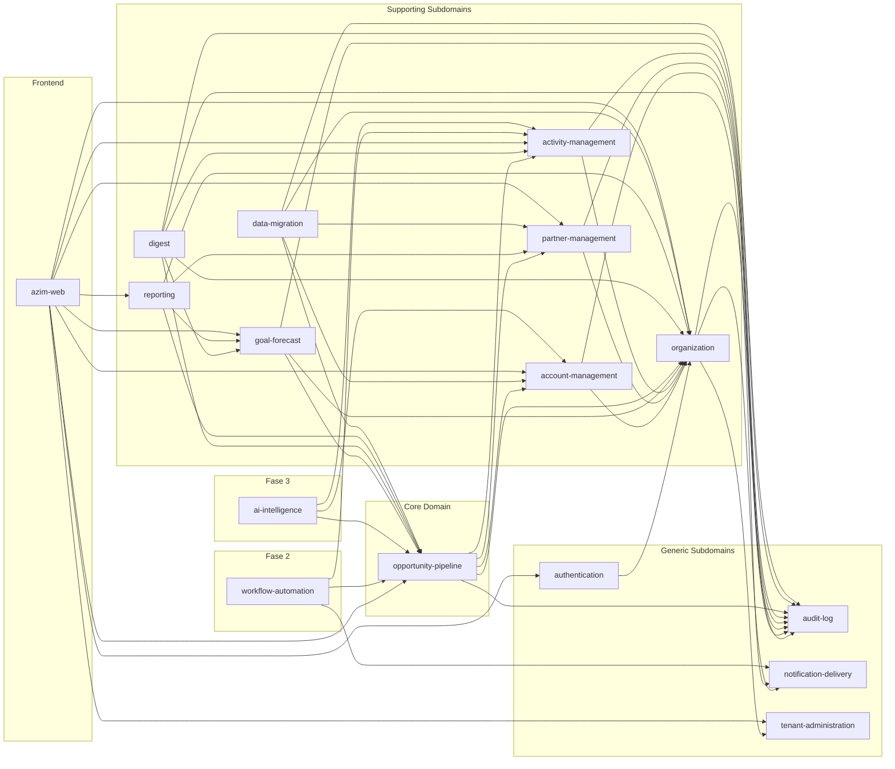

# Relatório de Validação — Módulos

- **Versão:** 1.0.0
- **Data:** 2026-06-11
- **Status:** Aprovado com Ressalvas
- **Validador:** module-validator
- **Insumos consultados:**
  - `docs/product/modules/` (catálogo completo — 16 módulos)
  - `docs/product/ddd/ddd-segmentation.md` v0.1
  - `docs/product/ddd/bounded-contexts/` (15 BCs)
  - `docs/product/ddd/context-map/relations.md`, `patterns.md`, `README.md`, `diagram.md`
  - `docs/product/data-model/data-model.md` v1.0
  - `docs/product/frd-nfrd/nfrd.md` v0.1
  - `docs/product/frd-nfrd/frd.md`
  - **TRD ausente** — `docs/product/trd/trd.md` não encontrado (Ponto a Validar)

---

## Resumo Executivo

Foram validados 16 módulos (15 com BC correspondente + 1 frontend cross-cutting `azim-web`). A cobertura BC ↔ módulo é de 100% (15/15). Nenhuma tabela do data model está órfã nem tem dono duplicado. Dois ciclos de dependência foram detectados no diagrama Mermaid de `module-dependencies.md` — ambos causados por arestas inconsistentes com os READMEs dos próprios módulos — e corrigidos diretamente. Um erro de catalogação de eventos (GoalUpdated listado como evento consumido pelo digest quando na realidade é leitura via API) também foi corrigido. O TRD não existe ainda; o Passo 5 (módulo ↔ deployable) foi parcialmente validado usando apenas as referências internas dos READMEs. A LGPD está marcada em todos os 7 módulos que tocam PII. PCI DSS é explicitamente fora de escopo em todos os módulos.

**Achados:** 2 Críticas [CORRIGIDAS], 1 Alta [CORRIGIDA], 2 Altas [Ponto a Validar], 1 Média, 2 Baixas.

---

## 1. Matriz de Cobertura BC ↔ Módulo

| Bounded Context (DDD) | Diretório BC | Módulo | Tipo Subdomínio (DDD) | Tipo Subdomínio (Módulo) | Status |
|---|---|---|---|---|---|
| Opportunity Pipeline (BC-01) | `opportunity-pipeline/` | `opportunity-pipeline` | Core Domain | Core Domain | OK |
| Account Management (BC-02) | `account-management/` | `account-management` | Supporting | Supporting | OK |
| Partner Management (BC-03) | `partner-management/` | `partner-management` | Supporting | Supporting | OK |
| Activity Management (BC-04) | `activity-management/` | `activity-management` | Supporting | Supporting | OK |
| Goal & Forecast (BC-05) | `goal-forecast/` | `goal-forecast` | Supporting | Supporting | OK |
| Digest (BC-06) | `digest/` | `digest` | Supporting | Supporting | OK |
| Reporting (BC-07) | `reporting/` | `reporting` | Supporting | Supporting | OK |
| Organization Management (BC-08) | `organization-management/` | `organization` | Supporting | Supporting | Nome diverge |
| Data Migration (BC-09) | `data-migration/` | `data-migration` | Supporting | Supporting | OK |
| Workflow Automation (BC-10) | `workflow-automation/` | `workflow-automation` | Supporting | Supporting | OK |
| AI Intelligence (BC-11) | `ai-intelligence/` | `ai-intelligence` | Supporting | Supporting | OK |
| Identity & Access (BC-12) | `identity-access/` | `authentication` | Generic | Generic | Nome diverge |
| Tenancy & Branding (BC-13) | `tenancy-branding/` | `tenant-administration` | Generic | Generic | Nome diverge |
| Notification Delivery (BC-14) | `notification-delivery/` | `notification-delivery` | Generic | Generic | OK |
| Audit Log (BC-15) | `audit-log/` | `audit-log` | Generic | Generic | OK |
| — (sem BC) | — | `azim-web` | Cross-cutting | Cross-cutting | Sem BC (frontend, esperado) |

**Cobertura:** 15/15 BCs mapeados (100%). Três pares com divergência de nome de diretório (BC kebab-case ≠ módulo kebab-case), mas bijeção preservada via mapeamento explícito no `modules/README.md §5`.

---

## 2. Matriz de Ownership de Dados

| Tabela | Módulo Dono | Consumers (read-only) | Status |
|---|---|---|---|
| opportunities | opportunity-pipeline | digest, reporting, goal-forecast | OK |
| opportunity_stage_transitions | opportunity-pipeline | reporting, audit-log | OK |
| opportunity_partner_commissions | opportunity-pipeline | reporting, partner-management | OK |
| stages | organization (escrita) / opportunity-pipeline (uso) | opportunity-pipeline | OK — ownership de escrita em organization; uso em pipeline declarado no data model |
| origin_channels | organization (escrita) | opportunity-pipeline | OK |
| loss_reasons | organization (escrita) | opportunity-pipeline | OK |
| accounts | account-management | opportunity-pipeline, activity-management, reporting | OK |
| contacts | account-management | reporting | OK (PII — LGPD) |
| partners | partner-management | opportunity-pipeline, reporting | OK |
| activities | activity-management | digest, reporting | OK |
| goals | goal-forecast | digest, reporting | OK |
| email_digest_logs | digest | dashboard KPI | OK (PII referenciada) |
| digest_action_tokens | digest | digest (validação interna) | OK |
| business_units | organization | todos os BCs | OK |
| users | organization | todos os BCs | OK (PII — LGPD) |
| user_memberships | organization | todos os BCs | OK |
| user_invitations | organization | identity & access | OK |
| tenants | tenant-administration | todos os BCs (RLS) | OK |
| tenant_brandings | tenant-administration | azim-web | OK |
| migration_jobs | data-migration | — (interno) | OK (temporário — Fase 1) |
| migration_logs | data-migration | — (interno) | OK (temporário — Fase 1) |
| audit_logs | audit-log | tenant-admin, gestor-bu (read-only) | OK (append-only; LGPD) |

**Tabelas órfãs:** nenhuma.
**Tabelas com dono duplicado:** nenhuma. A notação "Organization Management (escrita)" para stages/origin_channels/loss_reasons no data model é clara — organization escreve, opportunity-pipeline consome via API.
**Nota Fase 2/3:** `workflow_definitions`, `workflow_executions` (workflow-automation) e `scoring_results`, `briefings` (ai-intelligence) não estão no data model — esperado para fases futuras, declarado nos READMEs dos módulos como "Fase 2" e "Fase 3".

---

## 3. Grafo de Dependências

### 3.1 Diagrama de Dependências (após correções)

### 3.2 Verificação de Ciclos (DFS)

| Ciclo | Status | Resolução |
|---|---|---|
| `Authentication → TenantAdmin → Authentication` | CORRIGIDO | Ambas as arestas removidas do diagrama; nenhuma está nos READMEs dos módulos |
| `Authentication → Organization → Authentication` | CORRIGIDO | `Organization → Authentication` removida do diagrama; era invalidação de cache Redis, não dependência de módulo |

**Grafo pós-correção: acíclico (confirmado).** Verificação DFS nas 16 arestas remanescentes — nenhum ciclo detectado.

### 3.3 Violações de Context Map

| Aresta | Padrão Context Map | Declarado no Módulo? | Status |
|---|---|---|---|
| Authentication → Organization | ACL (Organization valida sessão; auth carrega memberships) | Sim — auth README §14.1 | OK |
| Organization → TenantAdmin | Conformist | Sim — org README §14.1 | OK |
| Organization → notification-delivery | Customer/Supplier | Sim — org README §13 | OK |
| OpPipeline → AccountMgmt | Customer/Supplier | Sim — opp README | OK |
| OpPipeline → PartnerMgmt | Customer/Supplier | Sim — opp README | OK |
| GoalForecast → OpPipeline | Customer/Supplier | Sim — goal README | OK |
| Digest → notification-delivery | ACL (IEmailSender) | Sim — digest README §13 | OK |
| Todos → AuditLog | Published Language | Declarado em todos os módulos de escrita | OK |

**Ponto a Validar — MOD-DEP-003:** `authentication` (Generic) → `organization` (Supporting): Generic dependendo de Supporting viola o princípio de isolamento de subdomínios genéricos. É uma escolha arquitetural deliberada e documentada no context map ("Organization Management → Identity & Access" como ACL), mas cria uma dependência de camada invertida. Avaliar se a resolução de `identity_uid → user_id` deve ser encapsulada em uma camada de infraestrutura compartilhada (ex.: leitura direta na tabela `users` dentro do AuthMiddleware, sem chamada ao módulo organization) para preservar o caráter Generic de authentication.

---

## 4. Matriz Módulo ↔ Deployable

> **ATENÇÃO:** TRD (`docs/product/trd/trd.md`) não existe. Esta matriz é derivada dos READMEs dos módulos e do `modules/README.md §9`. Não é possível cruzar com o TRD canônico.

| Módulo | Deployable Declarado no README | Stack | Status |
|---|---|---|---|
| authentication | azim-api | .NET 10 / ASP.NET Core | Sem TRD para cross-check |
| tenant-administration | azim-api | .NET 10 / ASP.NET Core | Sem TRD para cross-check |
| organization | azim-api | .NET 10 / ASP.NET Core | Sem TRD para cross-check |
| account-management | azim-api | .NET 10 / ASP.NET Core | Sem TRD para cross-check |
| partner-management | azim-api | .NET 10 / ASP.NET Core | Sem TRD para cross-check |
| activity-management | azim-api | .NET 10 / ASP.NET Core | Sem TRD para cross-check |
| goal-forecast | azim-api | .NET 10 / ASP.NET Core | Sem TRD para cross-check |
| opportunity-pipeline | azim-api | .NET 10 / ASP.NET Core | Sem TRD para cross-check |
| audit-log | azim-api | .NET 10 / ASP.NET Core | Sem TRD para cross-check |
| data-migration | azim-api | .NET 10 / ASP.NET Core | Sem TRD para cross-check |
| notification-delivery | azim-digest-worker / azim-api | .NET 10 | Deployable duplo — justificado no README (uso por digest e por organization/convites) |
| digest | azim-digest-worker | .NET 10, Cloud Run | Sem TRD para cross-check |
| reporting | azim-reporting-worker (Fase 2) / azim-api (Fase 1) | .NET 10 | Deployable evoluído por fase — justificado |
| azim-web | azim-web | React + TypeScript | Sem TRD para cross-check |
| workflow-automation | azim-workflow-worker | .NET 10 (Fase 2) | Sem TRD para cross-check |
| ai-intelligence | azim-ai-service | Python / FastAPI / LangGraph (Fase 3) | Sem TRD para cross-check |

**Deployables internamente declarados:** azim-api, azim-digest-worker, azim-reporting-worker, azim-web, azim-workflow-worker, azim-ai-service (6 deployables, todos justificados).

---

## 5. Achados

### 5.1 Críticas

| ID | Achado | Local | Ação |
|---|---|---|---|
| MOD-DEP-001 | Ciclo de dependência `Authentication → TenantAdmin → Authentication`: ambas as arestas presentes no diagrama Mermaid. Nenhuma declarada nos READMEs dos módulos (auth §14 depende apenas de organization; tenant-admin §14.1 declara "Nenhum BC de negócio"). | `docs/product/modules/diagrams/module-dependencies.md` linhas 53 e 55 | [CORRIGIDO] |
| MOD-DEP-002 | Ciclo de dependência `Authentication → Organization → Authentication`: aresta `Organization → Authentication` no diagrama. Organization não chama o módulo authentication — invalida cache Redis (integração de infraestrutura, não dependência de módulo). | `docs/product/modules/diagrams/module-dependencies.md` linha 59 | [CORRIGIDO] |

### 5.2 Altas

| ID | Achado | Local | Ação |
|---|---|---|---|
| MOD-INT-001 | `modules/README.md §7` lista `GoalUpdated` como evento consumido pelo módulo `digest`. O README do digest (§11) não lista GoalUpdated como evento consumido — goal-forecast é lido via chamada API HTTP interna (§13), não por evento. Inconsistência entre índice e README canônico do módulo. | `docs/product/modules/README.md` linha 153 | [CORRIGIDO] |
| MOD-DEP-TRD-001 | TRD ausente (`docs/product/trd/trd.md` não encontrado). O Passo 5 de validação (módulo ↔ deployable) não pode ser completado contra a fonte canônica. Deployables declarados apenas nos READMEs dos módulos sem cross-check com TRD. | `docs/product/trd/` | Ponto a Validar |

### 5.3 Médias

| ID | Achado | Local | Ação |
|---|---|---|---|
| MOD-DEP-003 | `authentication` (Generic Subdomain) depende de `organization` (Supporting Subdomain): carrega `user_memberships` e papéis após validação do JWT. Generic dependendo de Supporting viola o princípio de isolamento de subdomínios genéricos declarado em `module-dependencies.md §4`. Escolha arquitetural documentada no context map mas sem ADR formalizado. | `docs/product/modules/authentication/README.md` §14 | Ponto a Validar |
| MOD-COV-001 | Três pares de nomes divergem entre BC directory e módulo directory: `identity-access` → `authentication`; `tenancy-branding` → `tenant-administration`; `organization-management` → `organization`. Bijeção preservada via `modules/README.md §5`, mas buscas por nome de diretório falham sem mapeamento explícito. | `docs/product/ddd/bounded-contexts/` vs `docs/product/modules/` | Ponto a Validar |

### 5.4 Baixas

| ID | Achado | Local | Ação |
|---|---|---|---|
| MOD-DOC-001 | Módulos `workflow-automation` (Fase 2) e `ai-intelligence` (Fase 3) não têm entradas no `data-model.md`. Esperado para fases futuras, mas o data model não documenta explicitamente que essas tabelas serão adicionadas em fases posteriores. | `docs/product/data-model/data-model.md` | Registrado — esperado neste estágio |
| MOD-DOC-002 | `modules/README.md §7`: `goal-forecast` publica `GoalUpdated` com coluna "Consome" vazia (`—`). Nenhum módulo listado como consumer desse evento. O evento está definido mas sem consumer declarado. Pode ser consumido em Fase 2 (workflow-automation) mas não está mapeado. | `docs/product/modules/README.md` §7 | Registrado — avaliar na Fase 2 |

---

## 6. Correções Aplicadas

| ID | Arquivo | Seção | Antes | Depois |
|---|---|---|---|---|
| MOD-DEP-001 | `docs/product/modules/diagrams/module-dependencies.md` | `%% Generic dependencies` | `Authentication --> TenantAdmin` e `TenantAdmin --> Authentication` presentes | Ambas as arestas removidas; comentários explicativos adicionados |
| MOD-DEP-002 | `docs/product/modules/diagrams/module-dependencies.md` | `%% Supporting → Generic` | `Organization --> Authentication` presente | Aresta removida; comentário documenta que é invalidação de cache Redis |
| MOD-INT-001 | `docs/product/modules/README.md` | §7 linha digest | `OpportunityStale, ActivityOverdue, GoalUpdated` | `OpportunityStale, ActivityOverdue` |

---

## 7. Conflitos Arquiteturais

Nenhum conflito arquitetural identificado que exija escolha entre alternativas com trade-offs significativos e equivalentes. Os pontos a validar (§8) são ambiguidades que requerem confirmação, não conflitos de alternativas.

---

## 8. Pontos a Validar

| Código | Ponto | Impacto | Recomendação |
|---|---|---|---|
| MOD-DEP-TRD-001 | TRD ausente — Passo 5 incompleto | Impossível validar stack e deployables canônicos | Gerar TRD antes do próximo ciclo de validação; executar `module-validator` novamente após TRD criado |
| MOD-DEP-003 | `authentication` (Generic) → `organization` (Supporting): Generic dependendo de Supporting | Viola princípio de isolamento de subdomínios; risco de coupling se Organization mudar seu modelo | Avaliar encapsular leitura de `users` (resolve identity_uid) diretamente no AuthMiddleware via DB, sem chamar módulo organization como serviço. Formalizar decisão em ADR. |
| MOD-COV-001 | 3 divergências de nome BC directory ↔ módulo directory | Ferramentas automáticas de cross-reference falham; onboarding confuso | Padronizar: ou renomear os diretórios BC para bater com os módulos, ou adicionar um `aliases.md` no `bounded-contexts/` (decisão de produto/arquitetura) |
| VAL-MOD-01 a 05 | Pontos a validar pré-existentes no `modules/README.md §12` | Impactam escopo, deployable e compliance | Resolver com produto/jurídico antes do freeze de Fase 1 |

---

## 9. Recomendações

1. **Criar TRD** antes do próximo ciclo de validação de módulos. O mapeamento módulo ↔ deployable está internamente consistente mas não tem fonte canônica única.
2. **Formalizar ADR** para a dependência `authentication → organization` (Generic dependendo de Supporting). Duas opções: (a) aceitar e documentar que authentication tem acesso especial à infra de organization; (b) mover a lógica de resolução `identity_uid → user_id` para uma query direta ao banco dentro do AuthMiddleware, eliminando a dependência de módulo.
3. **Alinhar nomes** de diretórios BC e módulos (ou criar mapeamento explícito em arquivo de aliases). A divergência atual (identity-access/authentication, tenancy-branding/tenant-administration, organization-management/organization) é um risco de onboarding e tooling.
4. **GoalUpdated sem consumer:** avaliar ao planejar Fase 2 se `workflow-automation` deve consumir esse evento como trigger. Se não, remover a publicação para evitar ruído na documentação.
5. **data-migration:** planejar formalmente a remoção do módulo pós-Fase 1 (VAL-MOD-04). Incluir no ciclo de fechamento de Fase 1.

---

## 10. Parecer Final

**Aprovado com Ressalvas**

Os dois ciclos críticos detectados no diagrama de dependências foram corrigidos diretamente (eram erros de diagrama sem correspondência nos READMEs dos módulos); o grafo resultante é acíclico. A inconsistência de eventos do digest também foi corrigida. Não há tabela órfã, duplamente donada ou sem módulo responsável. A LGPD está marcada em todos os 7 módulos com PII identificado. A cobertura BC ↔ módulo é de 100% (15/15). O único bloqueio remanescente ao avanço é a ausência do TRD, que impede a validação canônica de deployables (Passo 5); este ponto é de responsabilidade do `trd-generator` e está fora do escopo de correção do `module-validator`. A ressalva arquitetural sobre `authentication → organization` (Generic dependendo de Supporting) deve ser endereçada antes do freeze de arquitetura da Fase 1.
