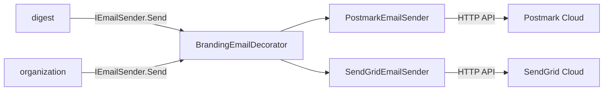
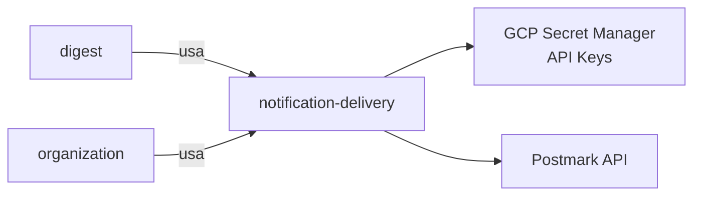

# Module — Notification Delivery

**Status:** Rascunho para revisão
**Fase:** Fase 1 MVP

---

## 1. Visão Geral

Adapter (Anti-Corruption Layer) que abstrai o envio de e-mail transacional via interface `IEmailSender`. Protege os módulos consumidores (digest e organization) da instabilidade de contratos de provedores externos (Postmark, SendGrid). Não possui lógica de domínio própria nem estado persistido.

---

## 2. Classificação

| Item | Valor |
|---|---|
| Tipo de Módulo | Adapter (ACL — Anti-Corruption Layer) |
| Deployable Candidato | azim-digest-worker (uso primário) e azim-api (convites via organization) |
| Bounded Context Relacionado | Notification Delivery (BC-14) |
| Subdomínio DDD | Generic Subdomain |
| Tier / Criticidade | Tier 2 — entregabilidade ≥ 98% (NFRD); falha não derruba API principal |
| Status | Rascunho para revisão |

---

## 3. Objetivo

Isolar o modelo de domínio interno (Digest, Organization) da API específica de cada provedor de e-mail. Permitir troca de provedor (Postmark → SendGrid ou vice-versa) sem alterar nenhum módulo consumidor — apenas a implementação concreta de `IEmailSender`.

---

## 4. Responsabilidades

- Definir e expor a interface `IEmailSender` com contrato estável para os módulos consumidores.
- Implementar `PostmarkEmailSender` e `SendGridEmailSender` como implementações concretas da interface.
- Aplicar configuração de branding (logo, cores do tenant) nos templates de e-mail, quando fornecidos pelo chamador.
- Registrar resultado do envio (sucesso, bounce, falha) para consumo pelos módulos que chamam.
- Não tomar decisões de negócio sobre quem ou quando enviar — essas decisões pertencem ao Digest e ao Organization.

---

## 5. Fora de Escopo

- Lógica de seleção de destinatários (pertence ao Digest).
- Lógica de composição de conteúdo do e-mail (pertence ao Digest e ao Organization).
- Idempotência de envio (pertence ao Digest via EmailDigestLog).
- Gestão de templates visuais avançados (fora do MVP).
- Webhooks de tracking de abertura/clique (Ponto a Validar LAC-03).

---

## 6. Capacidades Atendidas

| Código | Capability | Descrição |
|---|---|---|
| CAP-16 | Entrega de Notificações | Envio de e-mail transacional via IEmailSender (digest diário e convites) |

---

## 7. Bounded Context e Linguagem Ubíqua

| Termo | Definição |
|---|---|
| IEmailSender | Interface de contrato estável para envio de e-mail — único ponto de acoplamento permitido entre o modelo de domínio e os provedores externos |
| EmailMessage | Objeto de valor com: destinatário, assunto, corpo HTML, configurações de branding |
| SendResult | Resultado do envio: sucesso, falha, bounce — retornado ao módulo chamador |
| ACL (Anti-Corruption Layer) | Padrão DDD que protege o modelo interno do contrato externo instável |

---

## 8. Componentes Internos Candidatos

| Componente | Tipo | Responsabilidade |
|---|---|---|
| IEmailSender | Interface / Contrato | Define Send(EmailMessage) → SendResult |
| PostmarkEmailSender | Adapter | Implementação concreta via API Postmark |
| SendGridEmailSender | Adapter | Implementação concreta via API SendGrid (fallback / migração) |
| BrandingEmailDecorator | Adapter | Injeta logo e cores do tenant no template antes do envio |

---

## 9. APIs Principais

Este módulo não expõe API pública. Atua como package/adapter consumido internamente por digest e organization via injeção de dependência.

---

## 10. Eventos Publicados

Este módulo não publica eventos de domínio próprios.

---

## 11. Eventos Consumidos

Este módulo não consome eventos diretamente.

---

## 12. Dados Próprios

Este módulo é stateless e não possui dados próprios. O registro de resultado de envio é retornado ao módulo chamador (Digest persiste em email_digest_logs).

---

## 13. Integrações

| Sistema/Módulo | Tipo de Integração | Direção | Observações |
|---|---|---|---|
| Postmark | HTTP API | Saída | Provedor primário de e-mail transacional |
| SendGrid | HTTP API | Saída | Provedor alternativo / fallback (LAC-03 pendente) |
| digest | Package (IEmailSender injetado) | Entrada | Digest chama Send(EmailMessage) para envio do digest diário |
| organization | Package (IEmailSender injetado) | Entrada | Organization chama Send(EmailMessage) para envio de convites |

---

## 14. Dependências

### 14.1 Dependências de Domínio

- Nenhuma — é adapter puramente técnico.

### 14.2 Dependências Técnicas

- SDK Postmark (.NET) ou HTTP client com retry
- GCP Secret Manager: POSTMARK_API_KEY ou SENDGRID_API_KEY (sem segredos no repositório)
- Retry com backoff exponencial no cliente HTTP

### 14.3 Dependências Operacionais

- Secret: POSTMARK_API_KEY (ou SENDGRID_API_KEY) via GCP Secret Manager
- Configuração de domínio de envio verificado no provedor (SPF, DKIM, DMARC)
- Alerta de entregabilidade < 98%

---

## 15. Requisitos Não Funcionais Relevantes

| Categoria | Requisito / Observação |
|---|---|
| Disponibilidade | Entregabilidade ≥ 98% (NFRD) |
| Resiliência | Retry com backoff exponencial; não bloquear o chamador em falha do provedor |
| Segurança | API Key do provedor somente via Secret Manager; nunca em variável de ambiente hard-coded |
| Observabilidade | Log de cada tentativa de envio com correlation_id e status do provedor |

---

## 16. Compliance Aplicável

| Compliance / Norma / Lei | Aplicável? | Motivo | Impacto no Módulo |
|---|---|---|---|
| LGPD | Sim (marginal) | O e-mail do destinatário é PII trafegado para o provedor externo | Verificar DPA (Data Processing Agreement) com Postmark/SendGrid; não logar e-mail completo |
| PCI DSS | Não aplicável | Não processa dados de cartão | — |

---

## 17. Observabilidade

| Item | Recomendação Inicial |
|---|---|
| Logs | Log estruturado por envio: correlation_id, tenant_id, provider, status, message_id (sem PII — e-mail não deve aparecer em logs) |
| Métricas | email_send_attempts_total, email_send_success_total, email_send_failure_total |
| Alertas | Alerta se taxa de falha > 2% em janela de 1h |
| Health Checks | Ping no provedor configurado na inicialização |

---

## 18. Diagramas do Módulo

### 18.1 Diagrama de Componentes Internos

### 18.2 Diagrama de Dependências

---

## 19. Riscos

| Código | Risco | Impacto | Mitigação |
|---|---|---|---|
| RISK-NOTIF-01 | Provedor de e-mail fora do ar | Digest não entregue; convites não enviados | Retry com backoff; alerta imediato; avaliar fallback de provedor |
| RISK-NOTIF-02 | API Key expirada ou revogada | Falha total de envio silenciosa | Monitorar expiração via Secret Manager; alerta de falha de envio |
| RISK-NOTIF-03 | DPA não assinado com provedor (LGPD) | Risco regulatório de transferência de PII | Assinar DPA com Postmark/SendGrid antes do go-live |

---

## 20. Pontos a Validar

| Código | Ponto | Impacto | Recomendação |
|---|---|---|---|
| VAL-NOTIF-01 | Confirmar provedor primário: Postmark vs SendGrid (LAC-03 pendente no PRD) | Define qual SDK implementar primeiro | Decidir antes do início da implementação do digest |
| VAL-NOTIF-02 | notification-delivery como package compartilhado (azim-api + azim-digest-worker) ou como microservice | Define fronteira de deployable | Manter como package compartilhado na Fase 1 para reduzir complexidade operacional |
| VAL-MOD-02 | (duplicado do índice) Residência nos deployables | Define onde o package é referenciado | Ver VAL-MOD-02 no README.md do diretório modules/ |

---

## 21. Backlog Inicial Sugerido

| Tipo | Item | Descrição |
|---|---|---|
| Epic | Adapter de E-mail Transacional | Implementar IEmailSender com PostmarkEmailSender e BrandingDecorator |
| Story Técnica | Definir interface IEmailSender | Contrato: Send(EmailMessage) → SendResult; EmailMessage com campos de branding |
| Story Técnica | Implementar PostmarkEmailSender | HTTP client com retry, backoff e log de resultado |
| Task | Configurar Secret Manager para API Key do provedor | Sem segredos no repositório nem em env hard-coded |
| Task | Teste de integração com provedor em ambiente stg | Verificar SPF/DKIM/DMARC antes do go-live |

---

## 22. Referências

| Documento | Seção |
|---|---|
| DDD Segmentation | §4.1 BC-14 Notification Delivery |
| DDD Segmentation | §8 Context Map — ACL Digest → Notification Delivery |
| Context Map | relations.md — Digest → Notification Delivery |
| NFRD | Entregabilidade de e-mail ≥ 98% |
