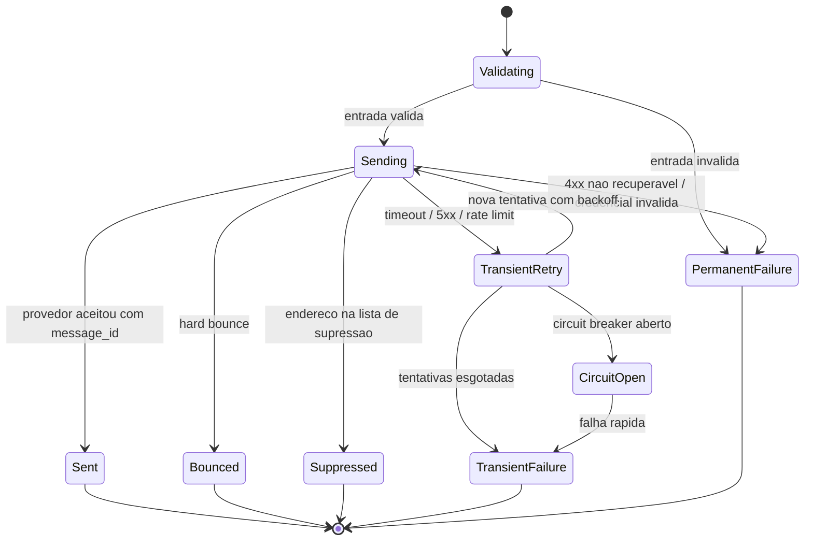
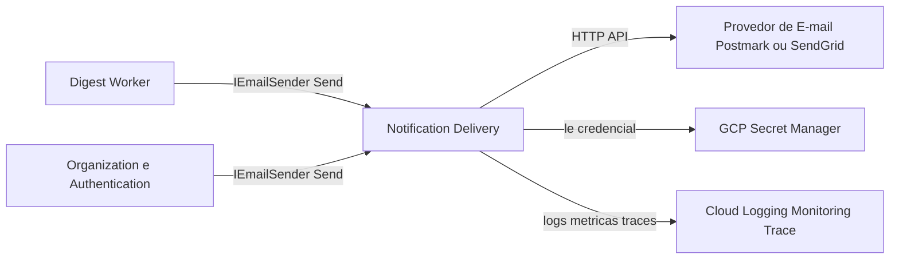
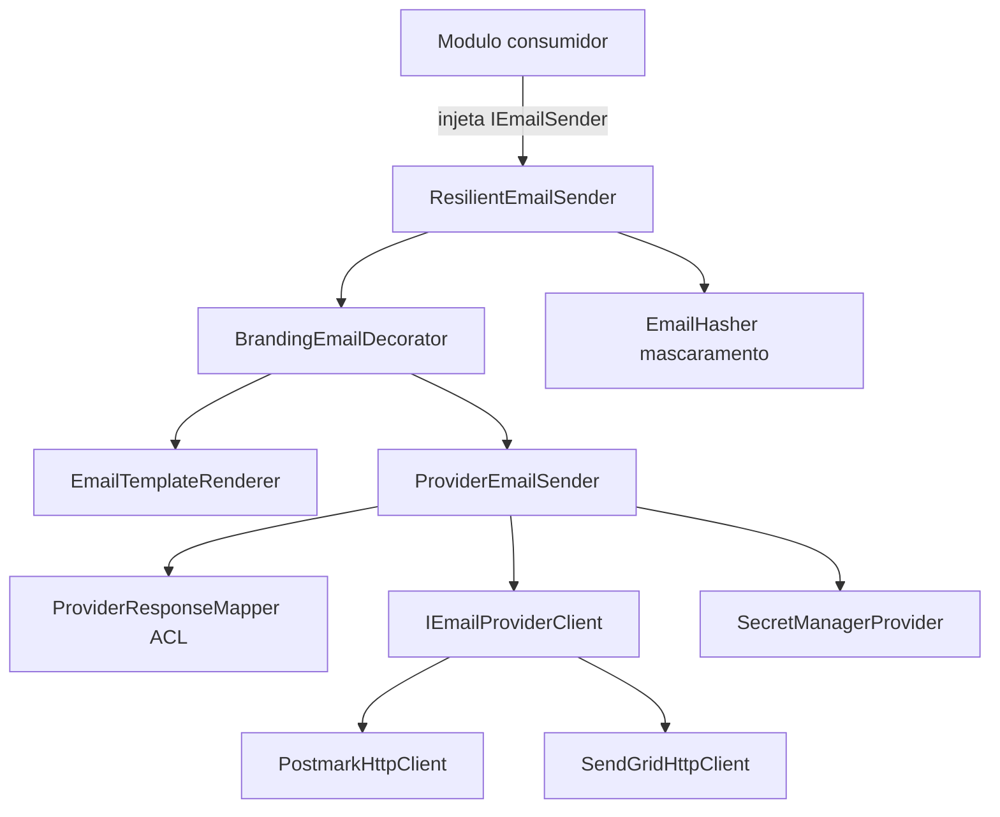
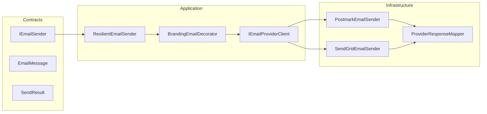
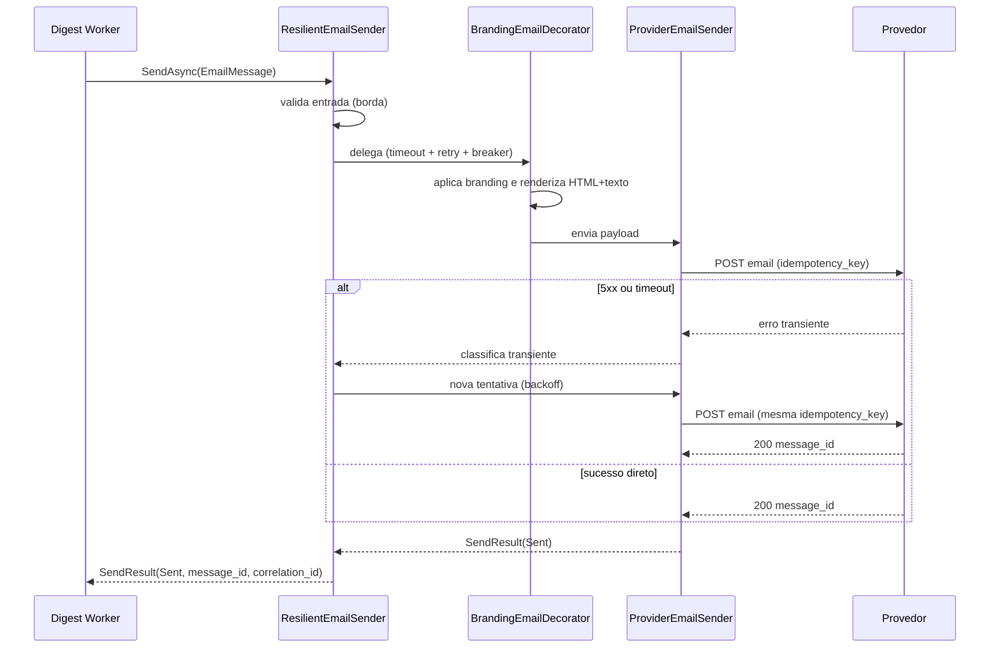

# NOTIF — Notification Delivery
**Design Técnico**

- Versão: 0.1.0
- Data: 2026-06-11
- Status: Rascunho para revisão
- Referência base: docs/product/modules/notification-delivery/requirements.md v0.1.0
- ADRs aplicáveis: ADR-0005 (provider de e-mail transacional = **Resend**, decisão aprovada, via IEmailSender); ADR-0007 (stack de observabilidade GCP Cloud Logging/Monitoring/Trace)
- Rules aplicáveis: `.forge/rules/architecture/clean-architecture.md`, `.forge/rules/architecture/api-and-contracts.md`, `.forge/rules/architecture/security-and-secrets.md`, `.forge/rules/architecture/security-and-compliance.md`, `.forge/rules/architecture/observability.md`, `.forge/rules/architecture/ddd.md`, `.forge/rules/conventions/language-policy.md`, `.forge/rules/conventions/naming.md`, `.forge/rules/conventions/document-versioning.md`, `.forge/rules/testing/tdd.md`, `.forge/rules/testing/quality-gates.md`

## Histórico de Versões

| Versão | Data | Status | Descrição da alteração |
|--------|------|--------|------------------------|
| 0.1.0 | 2026-06-11 | Rascunho para revisão | Criação inicial do design a partir do requirements.md v0.1.0 (Req 1..11, RNF 1..7, PBT-01..05), TRD (§4.4, §7.3, §11.1, §11.3, §12.6, §14.5, §17) e rules de arquitetura/segurança/observabilidade. Trata VAL-NOTIF-01 via DD-001 e VAL-NOTIF-02 via DD-002. |

## 1. Visão Geral

O módulo **notification-delivery** (BC-14, subdomínio **Genérico**, SD-14) é um adapter do tipo **Anti-Corruption Layer (ACL)** que isola o modelo de domínio interno dos módulos consumidores (`digest`, `organization`, `authentication`) do contrato específico de cada provedor de e-mail transacional externo (Postmark, primário candidato; SendGrid, alternativa).

O único ponto de acoplamento permitido é a interface estável `IEmailSender`, com a operação `Send(EmailMessage) → SendResult`. O módulo é **stateless**: não possui modelo de domínio próprio com regra de negócio do CRM, não persiste dados, não publica nem consome eventos de domínio. O resultado de cada envio (`SendResult`) é devolvido ao chamador, que decide o que persistir (o `digest` persiste em `email_digest_logs`, RN-010).

O módulo é empacotado como **biblioteca compartilhada** (DD-002) e referenciado por injeção de dependência nos deployables `azim-digest-worker` (uso primário — digest diário) e `azim-api` (convites e recuperação de senha).

A criticidade é **Tier 2**: entregabilidade alvo ≥ 98% (KPI-03), porém uma falha do provedor não pode derrubar a operação transacional principal nem bloquear o chamador (RNF 3).

### 1.1 Rastreabilidade requisito → design

| Requisito | Elemento de design | Seções |
|---|---|---|
| Req 1 Interface estável `IEmailSender` | `IEmailSender` em `Contracts`; injeção por DI; nenhum tipo de provedor exposto | 3, 4.3, 8, DD-003 |
| Req 2 `EmailMessage` (entrada) | Objeto de valor `EmailMessage` imutável com validação na construção | 4.3, 5.5, 8, DD-003 |
| Req 3 `SendResult` (saída) | Objeto de valor `SendResult` + estado canônico + sem exceção ao chamador | 4.3, 4.5, 12 |
| Req 4 Implementações intercambiáveis | `PostmarkEmailSender`, `SendGridEmailSender` atrás de `IEmailSender`; seleção por config | 3, 6.4, DD-001 |
| Req 5 Branding do tenant | `BrandingEmailDecorator` aplica branding estrito (DEC-004) no template | 5.3, 6.6, DD-006 |
| Req 6 Corpo HTML responsivo + texto puro | `EmailTemplateRenderer` determinístico (HTML + plaintext) | 6.6, DD-006 |
| Req 7 Bounce e supressão | Mapeamento ACL → `Bounced`/`Suppressed`; exclusão do circuit breaker | 4.5, 6.4, 6.5, 11 |
| Req 8 Retry, backoff e circuit breaker | `ResilientEmailSender` (Polly) + timeout por tentativa | 6.4, 15, DD-004 |
| Req 9 Idempotência (suporte ao chamador) | Propagação de `idempotency_key` ao provedor quando suportado | 6.5, DD-005 |
| Req 10 Credenciais via Secret Manager | `ISecretProvider` → GCP Secret Manager; rotação sem deploy | 6.7, 10, DD-007 |
| Req 11 Health check do provedor | `EmailProviderHealthCheck` (ping sem envio) | 6.4, 11 |
| RNF 1 Portabilidade de provedor | ACL + `Architecture.Tests` proíbem SDK fora da implementação | 3, 13, DD-003 |
| RNF 2 Entregabilidade e SPF/DKIM/DMARC | Métrica de bounce; gate de go-live; DPA | 11, 18, DD-001 |
| RNF 3 Resiliência / não bloqueio | `ResilientEmailSender`; falha sempre vira `SendResult` | 6.4, 15, DD-004 |
| RNF 4 Sem PII em logs | `EmailHasher` / mascaramento; Serilog destructuring policy | 6.8, 10, 11, DD-008 |
| RNF 5 Observabilidade | Logs estruturados, métricas `email_send_*`, alerta de falha | 11 |
| RNF 6 Gestão de segredos | Secret Manager exclusivo; gitleaks no CI; sem credencial em log | 10, DD-007 |
| RNF 7 LGPD / DPA | DPA gate de go-live; dados mínimos ao provedor | 10, 18 |
| PBT-01 Reversibilidade do adapter | Teste de contrato compartilhado entre senders | 13 |
| PBT-02 Idempotência sob reenvio | Teste de propriedade sobre `idempotency_key` | 13, DD-005 |
| PBT-03 Anti-vazamento de PII | Teste de propriedade sobre telemetria | 13, DD-008 |
| PBT-04 Totalidade da classificação | Teste de propriedade sobre o mapeamento ACL | 13, 4.5 |
| PBT-05 Backoff não duplica entrega | Teste de propriedade sobre retry + idempotência | 13, DD-004 |

## 2. Princípios e Decisões Macro

1. **Adapter/ACL stateless, sem domínio anêmico** — o módulo não modela regra de negócio do CRM; os objetos de valor `EmailMessage` e `SendResult` carregam apenas o contrato técnico de transporte. Por isso, a estrutura Clean Architecture é adaptada para um adapter (DD-003): não há `Domain` com agregados.
2. **Único ponto de acoplamento é `IEmailSender`** — nenhum tipo, exceção ou símbolo de provedor (Postmark, SendGrid) cruza a fronteira do contrato público (Req 1, RNF 1).
3. **Toda falha vira `SendResult`, nunca exceção ao chamador** — o módulo é o limite onde exceções de provedor são capturadas e mapeadas para estados canônicos (Req 3, PBT-04).
4. **Resiliência no adapter, transparente ao chamador** — retry com backoff exponencial, circuit breaker e timeout por tentativa ficam dentro do módulo (DD-004, RNF 3).
5. **Idempotência é responsabilidade do chamador; o módulo apenas a suporta** — propaga `idempotency_key` ao provedor quando há mecanismo; não mantém estado próprio de deduplicação (Req 9, DD-005).
6. **PII nunca em telemetria** — o e-mail do destinatário é PII; logs, métricas, traces e motivos de falha usam identificadores mascarados (RNF 4, DD-008).
7. **Segredos exclusivamente no Secret Manager** — credencial do provedor jamais em repositório, env hard-coded, log ou erro (RNF 6, DD-007).
8. **Portabilidade verificada por teste de arquitetura** — `Architecture.Tests` garante que SDK de provedor não vaze para fora da implementação concreta (RNF 1, DD-003).
9. **Sem valores monetários** — o módulo não processa money; a regra `money-as-cents` não se aplica a este escopo.

## 3. Estrutura da Solução

O módulo segue Clean Architecture, com a regra de dependência enforçada pelo compilador, **adaptada à natureza de adapter/ACL stateless** (DD-003): o contrato público e os objetos de valor residem em `Contracts`; não há projeto `Domain` com agregados de negócio.

```text
NotificationDelivery.Contracts        -> IEmailSender, EmailMessage, SendResult, SendStatus,
                                          BrandingConfig, FailureReason (contrato público estável)
NotificationDelivery.Application       -> ResilientEmailSender (decorator de resiliência),
                                          BrandingEmailDecorator, EmailTemplateRenderer,
                                          IEmailProviderClient (porta), validações de borda
NotificationDelivery.Infrastructure    -> PostmarkEmailSender, SendGridEmailSender,
                                          ProviderResponseMapper (ACL), SecretManagerProvider,
                                          EmailHasher, EmailProviderHealthCheck, DI extensions
```

> Não há `NotificationDelivery.Api`: o módulo não expõe endpoints HTTP próprios (README §9). Quando o webhook de bounce/supressão for adotado (DD-009), o endpoint é hospedado pelo deployable consumidor, que delega o parse ao `ProviderResponseMapper`.

Projetos de teste:

```text
NotificationDelivery.Contracts.Tests        -> imutabilidade e igualdade dos objetos de valor
NotificationDelivery.Application.Tests       -> resiliência, branding, renderização, validações
NotificationDelivery.Infrastructure.Tests    -> mapeamento ACL, senders (provedor fake/WireMock)
NotificationDelivery.Architecture.Tests      -> regra de dependência + proibição de SDK fora da impl
```

Regra de dependência (inviolável):

```text
Application  -> Contracts
Infrastructure -> Application, Contracts
Contracts -> nenhum projeto interno (apenas tipos primitivos)
```

Mapeamento à rule canônica `clean-architecture.md`: o papel de `Domain` (objetos de valor imutáveis, contrato de porta) é cumprido por `Contracts`; `IEmailProviderClient` é a porta de saída (definida em `Application`, implementada em `Infrastructure`). A ausência de `Api`/`Domain` é justificada e auditada em DD-003.

## 4. Modelo de Domínio

> O módulo é um adapter técnico sem agregado de negócio (seção 2, DD-003). As subseções abaixo descrevem os artefatos de transporte (objetos de valor) e a máquina de estados do resultado, que constituem o "modelo" deste módulo.

### 4.1 Aggregates

Não aplicável nesta versão. O módulo não possui agregado de negócio; é stateless e não protege invariantes de domínio do CRM.

### 4.2 Entidades

Não aplicável nesta versão. Não há entidade com identidade e ciclo de vida persistido.

### 4.3 Objetos de valor

Todos imutáveis, com igualdade por valor, definidos em `NotificationDelivery.Contracts`.

| Objeto de valor | Campos | Invariantes |
|---|---|---|
| `EmailMessage` | `RecipientEmail`, `Subject`, `HtmlBody`, `PlainTextBody?`, `Branding` (`BrandingConfig?`), `TenantId`, `CorrelationId`, `IdempotencyKey?` | `RecipientEmail` sintaticamente válido; `Subject` não vazio; `HtmlBody` não vazio; `TenantId` e `CorrelationId` presentes; construção falha (lança na borda do chamador) ou é rejeitada como `PermanentFailure` de validação antes de qualquer chamada ao provedor (Req 2.5). Imutável (Req 2.3). |
| `BrandingConfig` | `LogoUrl`, `PrimaryColor`, `SecondaryColor` | Restrito ao branding estrito DEC-004 (cinco elementos); cores em formato hex validado; sem CSS arbitrário (Req 5.2). |
| `SendResult` | `Status` (`SendStatus`), `MessageId?`, `Reason` (`FailureReason?`), `CorrelationId`, `Provider`, `AttemptCount` | Exatamente um `SendStatus` (seção 4.5); `MessageId` presente sse `Status = Sent`; `Reason` presente sse falha; `Reason` e nenhum campo expõem PII ou credencial (Req 3.3, RNF 4). |
| `FailureReason` | `Code` (catálogo seção 12), `Message` (legível, sem PII), `IsRetriable` | `Code` pertence ao catálogo de erros; `Message` estável e classificável. |

`SendStatus` é um enum de cinco valores: `Sent`, `TransientFailure`, `PermanentFailure`, `Bounced`, `Suppressed` (identificadores técnicos em inglês, seção 4 do requirements).

### 4.4 Domain Events

Não aplicável nesta versão. O módulo não publica eventos de domínio (README §10).

### 4.5 State Machines

A máquina de estados do resultado de envio é **terminal**: cada chamada `Send` resolve em exatamente um estado canônico. O mapeamento ACL da resposta do provedor para o estado é **total** (PBT-04): nenhuma resposta resulta em estado indefinido ou exceção propagada.



Regras de classificação:

- `Bounced` e `Suppressed` **não** contam como falha de provedor para o circuit breaker (Req 7.3): não indicam indisponibilidade.
- `TransientFailure` é elegível a nova tentativa pelo chamador após esgotamento interno; `PermanentFailure` não.

### 4.6 Policies / Specifications

| Policy | Responsabilidade | Req |
|---|---|---|
| `ProviderResponseMapper` (ACL) | Traduz resposta/exceção do provedor (HTTP status, código de bounce, supressão) para `SendStatus` + `FailureReason`. Mapeamento total. | Req 3, Req 7, PBT-04 |
| `RetryPolicy` | Define quais `SendStatus`/exceções são retriáveis (transientes) e o número/backoff de tentativas. | Req 8, RNF 3 |
| `CircuitBreakerPolicy` | Abre após N falhas consecutivas de provedor (excluindo `Bounced`/`Suppressed`), falha rápido e emite alerta. | Req 8.3, RNF 3 |
| `BrandingPolicy` | Aplica branding estrito DEC-004; tema padrão na ausência de config; jamais CSS arbitrário. | Req 5 |

## 5. Application Layer

> Sendo um adapter síncrono invocado por chamada de método (não por mediator de caso de uso), a "Application Layer" deste módulo é a composição de decorators sobre `IEmailSender`. Não há Commands/Queries no sentido de CQRS, pois não há caso de uso de negócio nem persistência (DD-003).

### 5.1 Commands

Não aplicável nesta versão. O módulo não expõe caso de uso de escrita de negócio; a operação pública é a chamada direta `IEmailSender.Send`.

### 5.2 Queries

Não aplicável nesta versão, exceto a verificação de disponibilidade `EmailProviderHealthCheck.CheckAsync` (Req 11), que é uma consulta de readiness sem efeito colateral de envio.

### 5.3 Handlers

A cadeia de execução de `Send` é montada por composição (decorator pattern):

```text
Caller -> ResilientEmailSender -> BrandingEmailDecorator -> ProviderEmailSender -> IEmailProviderClient
```

| Componente | Camada | Responsabilidade |
|---|---|---|
| `ResilientEmailSender` | Application | Aplica timeout por tentativa, retry com backoff e circuit breaker; captura qualquer exceção residual e devolve `SendResult` (nunca lança). É o `IEmailSender` registrado no DI do consumidor. |
| `BrandingEmailDecorator` | Application | Aplica `BrandingPolicy` e renderiza HTML+plaintext via `EmailTemplateRenderer` antes de delegar ao sender concreto. Não altera destinatário, assunto nem `correlation_id` (Req 5.4). |
| `EmailTemplateRenderer` | Application | Renderização determinística de template responsivo (HTML + texto puro), preservando links de 1 clique (Req 6). |
| `ProviderEmailSender` (`PostmarkEmailSender` / `SendGridEmailSender`) | Infrastructure | Traduz `EmailMessage` para o payload do provedor, chama `IEmailProviderClient`, mapeia resposta via `ProviderResponseMapper`. |

### 5.4 Pipeline Behaviors

A ordem de decoração é significativa: a resiliência (retry/circuit breaker/timeout) envolve a renderização e o envio, de modo que a renderização determinística (Req 6.4) não seja repetida desnecessariamente entre tentativas (a renderização ocorre uma vez; o retry reenvia o mesmo payload com a mesma `idempotency_key`, sustentando PBT-05).

### 5.5 Validações de Aplicação

- Validação sintática de `EmailMessage` na borda (destinatário, assunto, corpo) antes de qualquer chamada ao provedor; entrada inválida resulta em `PermanentFailure` com `NOTIF-ERR-001` (Req 2.5), sem consumir tentativa nem cota.
- Validação de `BrandingConfig` (cores hex, restrição DEC-004); branding inválido degrada para tema padrão com log de aviso, sem falhar o envio (Req 5.3).
- Validação de presença de `CorrelationId` e `TenantId` para rastreabilidade (Req 2.2).

## 6. Infrastructure Layer

### 6.1 Persistência

Não aplicável nesta versão. O módulo é stateless e não persiste dados (README §12). O registro do `SendResult` é responsabilidade do chamador (`digest` → `email_digest_logs`).

### 6.2 Cache

Não aplicável a envio. Há um cache de curta duração apenas para o valor do segredo recuperado do Secret Manager (seção 6.7), com TTL e invalidação na rotação, para evitar uma chamada ao Secret Manager por envio. O cache jamais é logado.

### 6.3 Mensageria

Não aplicável nesta versão. O módulo não publica nem consome eventos de domínio (README §10, §11). O acionamento do envio ocorre por chamada de método pelos consumidores `digest`/`organization`.

### 6.4 Integrações Externas

Integração de saída com o provedor de e-mail (INT-02) via HTTP API. Parâmetros conforme TRD §17 (`azim-digest-worker → Postmark`):

| Parâmetro | Valor (referência TRD) | Origem |
|---|---|---|
| Timeout por tentativa | 10 s | TRD §17, RNF-3.1 |
| Tentativas (transiente) | até 5, backoff exponencial + jitter | TRD §17, RNF-3.2 |
| Circuit breaker | abre após 5 falhas consecutivas de provedor; alerta operacional; half-open após janela configurável | TRD §17, RNF-3.3 |
| Health check (ping) | endpoint leve do provedor, sem envio real (Postmark `GET /deliverystats` ou equivalente; SendGrid `GET /v3/scopes`) | Req 11 |

A resiliência é implementada via **Polly** (DD-004): políticas de `Timeout`, `Retry` (com backoff exponencial e jitter, somente para transientes classificados pelo `ProviderResponseMapper`) e `CircuitBreaker`, compostas no `ResilientEmailSender`. `Bounced` e `Suppressed` não acionam o breaker (Req 7.3).

`IEmailProviderClient` é a porta de saída (em `Application`), implementada por `PostmarkHttpClient`/`SendGridHttpClient` (em `Infrastructure`) usando `HttpClientFactory` com handler tipado. Nenhum SDK/tipo de provedor cruza a fronteira de `Contracts`/`Application` (RNF 1, DD-003).

### 6.5 Idempotência

O módulo **não** mantém estado de idempotência (Req 9.3); a garantia de "no máximo um digest por usuário por dia" é do chamador via `email_digest_logs` (RN-010). O suporte do módulo (DD-005):

- Quando `EmailMessage.IdempotencyKey` está presente e o provedor suporta deduplicação por header/campo, a chave é propagada (ex.: header de idempotência / `Message-ID` estável).
- A mesma `idempotency_key` reenviada (retry interno ou retentativa do chamador) resulta em no máximo uma entrega efetiva (Req 9.2, PBT-02, PBT-05).
- Na ausência de chave, o módulo documenta que a deduplicação é integralmente do chamador (Req 9.4); ver limitações de provedor em DD-005.

### 6.6 Outbox / Inbox

Não aplicável nesta versão. Sem mensageria própria, não há outbox/inbox neste módulo. A entrega confiável de eventos de domínio é tratada pelos deployables consumidores (Outbox Pattern, TRD §11.3), fora deste escopo.

### 6.7 Secret Manager (credenciais do provedor)

A credencial do provedor é lida **exclusivamente** do GCP Secret Manager (Req 10, RNF 6, TRD §12.6, DEC-005):

- `ISecretProvider` (porta em `Application`) → `SecretManagerProvider` (Infrastructure) recupera `POSTMARK_API_KEY` ou `SENDGRID_API_KEY` conforme o provedor ativo.
- Rotação/alternância de chave sem novo deploy (Req 10.3, RNF-6.2): o provider relê o segredo na expiração do cache (seção 6.2) ou por sinal de invalidação.
- A credencial nunca é logada, nunca aparece em `SendResult`, métrica ou trace (Req 10.4, RNF-6.3). `gitleaks` no CI garante ausência no repositório (RNF-6.1).

### 6.8 Mascaramento de PII

`EmailHasher` (Infrastructure) produz um identificador mascarado/pseudônimo do destinatário (ex.: hash truncado ou `a***@d***.com`) para uso em telemetria (RNF 4, DD-008). O e-mail em claro só transita no payload destinado ao provedor (RNF-7.3, dados mínimos) e nunca em log/métrica/trace/`FailureReason`.

## 7. Schema / Modelo de Persistência

Não aplicável nesta versão. O módulo não possui schema de banco próprio (stateless, README §12). Para referência, o registro do resultado é persistido pelo chamador `digest` na tabela `email_digest_logs` (campos `correlation_id`, `provider`, `status`, `message_id`, `bounce_reason`), cujo modelo pertence ao design do módulo `digest` (FRD-digest-04, fora deste escopo).

## 8. API Contracts

O módulo **não expõe API HTTP pública** (README §9). O "contrato" é a interface de aplicação `IEmailSender`, consumida por injeção de dependência.

### 8.1 Contrato de programação `IEmailSender`

```text
SendResult Send(EmailMessage message)            // assíncrono: Task<SendResult> SendAsync(EmailMessage, CancellationToken)
HealthCheckResult CheckAvailability()            // Task<HealthCheckResult> CheckAvailabilityAsync(CancellationToken)
```

Contrato semântico (Req 1, Req 3):

- `SendAsync` **nunca** lança exceção de provedor; toda falha é um `SendResult` com `SendStatus` (Req 3.5, PBT-04).
- Nenhum tipo de provedor (Postmark/SendGrid) aparece na assinatura (Req 1.2).
- Substituível por duplicata de teste sem referenciar provedor (Req 1.5, RNF-1.2).

### 8.2 `EmailMessage` (entrada)

| Campo | Tipo | Obrigatório | Observação |
|---|---|---|---|
| `RecipientEmail` | string | Sim | PII; validado; nunca logado em claro |
| `Subject` | string | Sim | Não vazio |
| `HtmlBody` | string | Sim | Corpo HTML fornecido pelo chamador |
| `PlainTextBody` | string | Não | Se ausente, derivado do HTML (Req 6.3) |
| `Branding` | `BrandingConfig` | Não | Ausente → tema padrão (Req 5.3) |
| `TenantId` | string/Guid | Sim | Rastreabilidade multi-tenant |
| `CorrelationId` | string/Guid | Sim | Propagado ao `SendResult` |
| `IdempotencyKey` | string | Não | Propagado ao provedor quando suportado |

### 8.3 `SendResult` (saída)

| Campo | Tipo | Observação |
|---|---|---|
| `Status` | `SendStatus` | Um de: `Sent`, `TransientFailure`, `PermanentFailure`, `Bounced`, `Suppressed` |
| `MessageId` | string? | Presente sse `Sent` |
| `Reason` | `FailureReason?` | Presente sse falha; `Code` do catálogo (seção 12); sem PII |
| `CorrelationId` | string/Guid | Eco da entrada |
| `Provider` | string | `postmark` / `sendgrid` |
| `AttemptCount` | int | Número de tentativas realizadas |

## 9. AsyncAPI / Eventos Publicados e Consumidos

Não aplicável nesta versão. O módulo não publica nem consome eventos de domínio (README §10, §11).

**Webhooks de provedor (futuro / DD-009):** quando adotado, o provedor envia eventos de entregabilidade (`Bounce`, `SpamComplaint`, `Delivery`) via webhook HTTP ao deployable consumidor. O `ProviderResponseMapper` traduz o payload do webhook para o vocabulário canônico (`Bounced`/`Suppressed`), mas a persistência/atualização de status (`opened`, `bounce`) pertence ao `digest` (FRD-digest-04), não a este módulo. Na Fase 1, a supressão é consultada em tempo de envio na lista do provedor (README §9 do requirements, item "Fora do escopo do MVP").

## 10. Segurança

| Aspecto | Mecanismo | Req/RNF |
|---|---|---|
| Gestão de segredos | Credencial do provedor exclusivamente no GCP Secret Manager via `ISecretProvider`; nunca em env hard-coded, arquivo versionado ou constante; `gitleaks` bloqueante no CI | Req 10, RNF 6 |
| Rotação de chave | Alternância sem novo deploy (relê do Secret Manager; cache com TTL/invalidação) | Req 10.3, RNF-6.2 |
| Não vazamento de credencial | Credencial nunca em log, métrica, trace, `SendResult` ou mensagem de erro | Req 10.4, RNF-6.3 |
| PII em trânsito | TLS 1.2+ obrigatório na chamada HTTP ao provedor; e-mail trafega apenas no payload de envio (dados mínimos, RNF-7.3) | RNF 4, RNF 7 |
| PII em telemetria | E-mail do destinatário mascarado/pseudonimizado (`EmailHasher`) em qualquer log/métrica/trace; Serilog destructuring policy bloqueia campos PII | RNF 4, PBT-03, DD-008 |
| Mensagens de erro | `FailureReason.Message` não expõe e-mail nem credencial; sem detalhes que permitam enumeração de endereços | Req 3.3, RNF-4.3 |
| Webhook (DD-009, futuro) | Validação de assinatura do provedor; rate limit; payload validado antes do parse | Req 7, DD-009 |
| LGPD / DPA | DPA assinado com o provedor selecionado é gate de go-live; base legal documentada (NFR-PRIV-04) | RNF 7 |
| Princípio do menor privilégio | Service account do worker com acesso somente ao segredo do provedor; sem permissões de escrita em recursos não relacionados | RNF 6, DEC-005 |

Não há autenticação/autorização de usuário neste módulo (sem API pública). A confiança é estabelecida por DI dentro do deployable e pela credencial de serviço junto ao provedor.

## 11. Observabilidade

Stack: Cloud Logging / Monitoring / Trace (ADR-0007), `tenant_id` como label obrigatório (TOBJ-09).

### 11.1 Logs estruturados (RNF 5, RNF 4)

Cada tentativa de envio emite log estruturado com: `correlation_id`, `tenant_id`, `provider`, `status`, `message_id`, `attempt`, `recipient_hash` (mascarado). **Nunca** o e-mail em claro nem a credencial (RNF-4.2, RNF-5.1). Serilog destructuring policy garante o mascaramento na borda do logger (DD-008).

### 11.2 Métricas (RNF 5)

| Métrica | Tipo | Labels |
|---|---|---|
| `email_send_attempts_total` | counter | `tenant_id`, `provider` |
| `email_send_success_total` | counter | `tenant_id`, `provider` |
| `email_send_failure_total` | counter | `tenant_id`, `provider`, `status` |
| `email_bounce_total` | counter | `tenant_id`, `provider` |
| `email_suppressed_total` | counter | `tenant_id`, `provider` |
| `email_send_duration_seconds` | histogram | `provider`, `status` |
| `email_circuit_breaker_state` | gauge | `provider` |

### 11.3 Traces (RNF 5.4)

Span de `Send` correlacionado fim a fim (Cloud Scheduler → `azim-digest-worker` → provedor) via `correlation_id` (TRD §13). Atributos do span sem PII.

### 11.4 Alertas

- Taxa de falha de envio > 2% em janela de 1 h (RNF-5.3, README §17).
- Taxa de bounce > 5% (RNF-2.2, Req 7.5).
- Circuit breaker aberto (Req 8.3, RNF-3.3).
- Falha de leitura do Secret Manager / credencial inválida (RISK-NOTIF-02).

### 11.5 Health check / readiness

`EmailProviderHealthCheck` faz ping leve no provedor configurado sem envio real nem consumo de cota relevante (Req 11.2); consumido pelo `GET /health/ready` do `azim-digest-worker` (TRD §14.5). Falha reportada de forma estruturada, sem PII e sem credencial (Req 11.3).

## 12. Catálogo de Erros

Erros expressos como `FailureReason.Code` em `SendResult` (não há HTTP público; a coluna "Mapeia para" indica o `SendStatus` e, entre parênteses, o status HTTP do provedor que tipicamente origina o caso).

| Código | Mensagem (sem PII) | Mapeia para SendStatus | Quando ocorre | Ação recomendada (chamador) |
|---|---|---|---|---|
| `NOTIF-ERR-001` | Mensagem inválida: destinatário ausente ou malformado | `PermanentFailure` | Validação de borda de `EmailMessage` (Req 2.5) | Corrigir o destinatário; não re-tentar |
| `NOTIF-ERR-002` | Assunto ou corpo obrigatório ausente | `PermanentFailure` | Validação de `Subject`/`HtmlBody` | Corrigir a mensagem; não re-tentar |
| `NOTIF-ERR-010` | Falha transiente do provedor; tentativas esgotadas | `TransientFailure` | Timeout, 5xx ou rate limit após N tentativas (Req 8) | Re-tentar mais tarde; registrar falha |
| `NOTIF-ERR-011` | Provedor indisponível; circuit breaker aberto | `TransientFailure` | Breaker aberto após N falhas consecutivas (Req 8.3) | Aguardar; acionar runbook RISK-NOTIF-01 |
| `NOTIF-ERR-012` | Tempo limite da tentativa excedido | `TransientFailure` | Timeout por tentativa (RNF-3.1) | Re-tentar; verificar latência do provedor |
| `NOTIF-ERR-020` | Provedor rejeitou a requisição (payload inválido) | `PermanentFailure` | 4xx não recuperável | Corrigir payload; alertar operação |
| `NOTIF-ERR-021` | Credencial do provedor inválida ou revogada | `PermanentFailure` | 401/403 do provedor | Acionar runbook RISK-NOTIF-02 (rotação) |
| `NOTIF-ERR-030` | Endereço rejeitado pelo destino (hard bounce) | `Bounced` | Hard bounce reportado (Req 7.1) | Sinalizar destinatário para supressão |
| `NOTIF-ERR-031` | Endereço na lista de supressão do provedor | `Suppressed` | Endereço suprimido (Req 7.2) | Não contar como falha de provedor |
| `NOTIF-ERR-040` | Falha ao recuperar segredo do provedor | `PermanentFailure` | Erro de acesso ao Secret Manager | Acionar runbook RISK-NOTIF-02 |
| `NOTIF-ERR-090` | Resposta não classificável do provedor (fallback ACL) | `TransientFailure` | Resposta inesperada; mapeamento conservador | Investigar; alertar para evitar estado indefinido |

Regras: nenhuma mensagem expõe o e-mail do destinatário nem a credencial (RNF-4.3); erros são estáveis e rastreáveis por `correlation_id`; o mapeamento é total (PBT-04) — `NOTIF-ERR-090` é o fallback conservador que garante ausência de estado indefinido.

## 13. Testes

| Camada / Tipo | Foco | Cobertura de requisitos |
|---|---|---|
| `Contracts.Tests` | Imutabilidade e igualdade por valor de `EmailMessage`/`SendResult`/`BrandingConfig` | Req 2.3, Req 3 |
| `Application.Tests` (resiliência) | Retry/backoff, timeout, circuit breaker; falha sempre vira `SendResult`; renderização única entre tentativas | Req 8, RNF 3, PBT-05 |
| `Application.Tests` (branding/render) | Branding estrito DEC-004; tema padrão; HTML+plaintext; determinismo; preservação de links | Req 5, Req 6 |
| `Infrastructure.Tests` (ACL) | Mapeamento total resposta→`SendStatus` (sucesso, 4xx, 5xx, timeout, bounce, supressão) com provedor fake / WireMock | Req 3, Req 7, PBT-04 |
| `Infrastructure.Tests` (senders) | Postmark e SendGrid produzem semântica equivalente; idempotency_key propagada | Req 4, Req 9, PBT-01 |
| `Architecture.Tests` (NetArchTest) | SDK/tipo de provedor não aparece fora da implementação concreta; regra de dependência | Req 1.2, Req 4.4, RNF 1, DD-003 |
| Teste de contrato compartilhado | Suíte parametrizada executada contra ambos os senders garantindo mesma forma de `SendResult` | PBT-01, Req 4.3 |
| Teste de propriedade (PBT) | PBT-01..05 com geradores de `EmailMessage`/respostas de provedor | PBT-01..05 |
| Teste de segurança (anti-PII) | Scan de logs/métricas/erros por regex de e-mail e por credencial | RNF 4, RNF 6, PBT-03 |
| Teste de caos / resiliência | Provedor indisponível: worker re-tenta, alerta e segue sem downtime da API | RNF-3.4 |
| Teste de integração (staging) | Envio real em stg com SPF/DKIM/DMARC validados antes do go-live | RNF-2.1, README §21 |

### 13.1 Geradores para PBT

- `EmailMessage` válida/ inválida (destinatário com/sem `@`, corpo vazio, branding ausente/ presente).
- Respostas de provedor: `{200+message_id, 202, 400, 401, 422, 429, 500, 503, timeout, hard_bounce, suppressed}` — usadas em PBT-04 para verificar totalidade.
- Sequências de falhas transientes seguidas de sucesso, com `idempotency_key` fixa — PBT-05.

## 14. Multi-tenancy

O módulo é stateless e não persiste dados por tenant, portanto não há isolamento de dados próprio. Ainda assim:

- `EmailMessage` carrega `TenantId`, propagado em logs, métricas e traces como label obrigatório (TOBJ-09, RNF-5.1).
- O branding aplicado é o do tenant fornecido pelo chamador (Req 5), sem mistura: o `BrandingConfig` vem na própria mensagem, não de cache/estado compartilhado entre tenants.
- O cache de segredo (seção 6.2) é por provedor (global ao deployable), não por tenant; não há risco de vazamento de dados entre tenants pois o segredo é da plataforma, não do tenant.
- Não há lista de supressão própria por tenant na Fase 1 (supressão é a do provedor).

## 15. Performance e Escalabilidade

| Aspecto | Definição | Origem |
|---|---|---|
| Timeout por tentativa | 10 s | TRD §17, RNF-3.1 |
| Tentativas | até 5 com backoff exponencial + jitter | TRD §17, RNF-3.2 |
| Circuit breaker | abre após 5 falhas consecutivas; half-open após janela | TRD §17, RNF-3.3 |
| Não bloqueio do chamador | falha sempre resolve em `SendResult`; sem espera indefinida (Req 8.4) | RNF 3 |
| Isolamento por mensagem | falha de um destinatário não impede os demais (Req 8.5) | Req 8.5 |
| Concorrência | envio do digest em lote pelo worker; paralelismo limitado por `HttpClient` pool e por rate limit do provedor | TRD §7.3 |
| Backpressure | rate limit do provedor (429) tratado como transiente com backoff; circuit breaker protege contra saturação | Req 8 |
| Entregabilidade | ≥ 98% medida a partir dos `SendResult` (KPI-03) | RNF 2 |

Escalabilidade horizontal: o módulo é stateless; múltiplas instâncias do worker podem enviar concorrentemente sem coordenação, pois a idempotência de negócio é garantida pelo chamador (`email_digest_logs`, DD-005).

## 16. Diagramas

### 16.1 C4 Level 1 - System Context

Contexto de uso do adapter entre consumidores internos e provedor externo.



### 16.2 C4 Level 2 - Container

Composição interna do package compartilhado.



### 16.3 C4 Level 3 - Component

Fronteira de portabilidade: o que pode e o que não pode conhecer tipos de provedor.



### 16.4 Sequence Diagrams

Fluxo de envio com sucesso e com falha transiente seguida de retry.



### 16.5 State Diagrams

Ver seção 4.5 (máquina de estados do `SendResult`).

## 17. Decisões Inline

### DD-001 - Provedor primário Resend atrás da interface IEmailSender (decisão aprovada)

**Contexto:** VAL-NOTIF-01 / LAC-03 / VAL-TRD-01 estavam abertos. **Decisão de produto aprovada no HITL #1 (11/06/2026): o provedor de e-mail transacional é o Resend** (não Postmark, não SendGrid). Formalizada em ADR-0005.

**Decisão:** adotar **Resend como provedor primário** via `ResendEmailSender` implementando `IEmailSender`. A interface ACL permanece provider-agnóstica — qualquer outro provedor (ex.: SendGrid) pode ser adicionado como implementação alternativa atrás da mesma interface, por configuração, sem impacto no domínio. As referências a `PostmarkEmailSender`/`SendGridEmailSender` nas seções de exemplo deste design devem ser lidas como o padrão de adapter; a implementação concreta de Fase 1 é `ResendEmailSender`.

**Justificativa:** a interface `IEmailSender` torna a escolha reversível sem impacto no domínio (RNF 1); Resend escolhido pela equipe; SPF/DKIM/DMARC no domínio de envio permanecem gate de go-live.

**Alternativas:** Postmark e SendGrid — não escolhidos; permanecem como possíveis implementações alternativas atrás da ACL.

**Impacto:** a seleção é configuração + DI. SDK/HTTP API do Resend encapsulados em `IEmailProviderClient`. Pendência VAL-NOTIF-01 **resolvida**.

### DD-002 - notification-delivery como biblioteca compartilhada (não microservice)

**Contexto:** VAL-NOTIF-02 / VAL-MOD-02 — definir se o módulo é package compartilhado ou deployable próprio.

**Decisão:** manter como **biblioteca compartilhada** referenciada por DI nos deployables `azim-digest-worker` (primário) e `azim-api` (TRD §7.3, §4.6).

**Justificativa:** reduz complexidade operacional na Fase 1; sem estado próprio e sem necessidade de escala independente, um microservice agregaria latência de rede e superfície de falha sem benefício.

**Alternativas:** microservice dedicado — rejeitado para a Fase 1 (fora do escopo do MVP, requirements §9); reavaliável em fase posterior.

**Impacto:** o módulo não tem projeto `Api` próprio; eventual webhook é hospedado pelo deployable consumidor (DD-009).

### DD-003 - Clean Architecture adaptada para adapter/ACL stateless

**Contexto:** a rule `clean-architecture.md` prescreve 5 projetos com `Domain` e `Api`; este módulo não tem domínio de negócio nem API HTTP.

**Decisão:** usar 3 projetos de produção (`Contracts`, `Application`, `Infrastructure`), com `Contracts` cumprindo o papel de portador dos objetos de valor imutáveis e do contrato de porta, e `Architecture.Tests` enforçando a regra de dependência e a não-fuga de SDK de provedor.

**Justificativa:** criar um `Domain` anêmico ou um `Api` vazio violaria o princípio de simplicidade sem ganho; a regra de dependência permanece inviolável e verificável.

**Alternativas:** seguir literalmente os 5 projetos — rejeitada por gerar artefatos vazios; colapsar tudo em um projeto — rejeitada por perder a barreira de portabilidade (RNF 1).

**Impacto:** divergência consciente da rule `clean-architecture.md`, registrada aqui; recomenda-se nota na rule ou ADR caso o padrão de adapter se repita em outros módulos ACL (ex.: `authentication`).

### DD-004 - Resiliência via Polly no ResilientEmailSender

**Contexto:** Req 8 / RNF 3 / TRD §11.3 e §17 exigem retry com backoff, circuit breaker e timeout por tentativa sem bloquear o chamador.

**Decisão:** implementar as políticas com **Polly** (`Timeout` + `Retry` com backoff exponencial e jitter + `CircuitBreaker`), compostas no `ResilientEmailSender`, que captura qualquer exceção residual e devolve `SendResult`.

**Justificativa:** Polly é o padrão estabelecido no ecossistema .NET para resiliência de chamadas HTTP; alinhado ao TOBJ de retry/circuit breaker.

**Alternativas:** implementação manual de retry — rejeitada por reinventar mecanismo testado; delegar resiliência ao chamador — rejeitada por violar a encapsulação do adapter (RNF 3).

**Impacto:** `Bounced`/`Suppressed` configurados como não-contabilizáveis pelo breaker (Req 7.3); a renderização ocorre uma vez por envio (seção 5.4) para sustentar PBT-05.

### DD-005 - Idempotência por propagação de chave, sem estado próprio

**Contexto:** Req 9 / PBT-02 / PBT-05 — evitar entrega duplicada em reenvio, mantendo a idempotência de negócio no chamador (RN-010).

**Decisão:** o módulo propaga `IdempotencyKey` ao provedor quando este oferece mecanismo de deduplicação (header/campo). Não mantém estado próprio de idempotência. Na ausência de suporte do provedor, documenta que a deduplicação é integralmente do chamador.

**Justificativa:** preserva a fronteira (módulo stateless) e a responsabilidade de "no máximo um digest por usuário por dia" no `digest`.

**Alternativas:** manter cache de chaves enviadas no módulo — rejeitada por introduzir estado e dupla fonte de verdade; ignorar idempotência — rejeitada por violar NFR-RES-02.

**Impacto:** o grau de garantia depende do provedor selecionado (a confirmar no spike DD-001); registrar a capacidade de deduplicação do provedor como item do gate de go-live.

### DD-006 - Renderização de template determinística com branding estrito

**Contexto:** Req 5 / Req 6 — branding do tenant (DEC-004) e corpo HTML responsivo com versão texto puro, de forma determinística.

**Decisão:** `EmailTemplateRenderer` usa um template responsivo fixo com pontos de injeção para os cinco elementos de branding estrito; produz HTML + plaintext; renderização determinística para a mesma `EmailMessage`. Nenhum CSS arbitrário por tenant.

**Justificativa:** determinismo (Req 6.4) e segurança (sem injeção de CSS arbitrário, Req 5.2); branding estrito alinhado a DEC-004.

**Alternativas:** editor de template por tenant — fora do escopo do MVP (requirements §9); permitir CSS livre — rejeitada por risco de quebra de renderização e de segurança.

**Impacto:** o engine concreto (ex.: Scriban/Razor) é detalhe de implementação encapsulado em `Application`; preservação dos links de 1 clique fornecidos pelo chamador (Req 6.2).

### DD-007 - Credencial exclusivamente via Secret Manager com cache curto

**Contexto:** Req 10 / RNF 6 / TRD §12.6 / DEC-005 — credencial fora do repositório, rotacionável sem deploy, nunca em log.

**Decisão:** `SecretManagerProvider` lê a credencial do GCP Secret Manager; cache em memória com TTL curto e invalidação na rotação, para evitar uma chamada por envio.

**Justificativa:** equilibra segurança (fonte única), custo (menos chamadas) e rotação sem deploy (RNF-6.2).

**Alternativas:** ler o segredo a cada envio — rejeitada por custo/latência; injetar via env no deploy — rejeitada por violar Req 10.2.

**Impacto:** janela de propagação de rotação limitada pelo TTL; documentar o TTL e o procedimento de invalidação no runbook RISK-NOTIF-02.

### DD-008 - Mascaramento de PII na borda da telemetria

**Contexto:** RNF 4 / PBT-03 / RN-025 — e-mail do destinatário é PII e não pode aparecer em log, métrica, trace ou erro.

**Decisão:** `EmailHasher` gera identificador mascarado/pseudônimo; uma Serilog destructuring policy impede que o campo de e-mail seja serializado em claro; `FailureReason.Message` nunca inclui o endereço.

**Justificativa:** defesa em profundidade (mascaramento na origem + política no logger) reduz risco de vazamento acidental; verificável por scan de logs (RNF-4.1).

**Alternativas:** confiar apenas na disciplina de não logar — rejeitada por frágil; remover totalmente o identificador — rejeitada por prejudicar diagnóstico.

**Impacto:** telemetria usa `recipient_hash`; o e-mail em claro só existe no payload destinado ao provedor.

### DD-009 - Webhook de bounce/supressão fora do MVP, mapeamento preparado

**Contexto:** Req 7 e requirements §9 — bounce/supressão na Fase 1; webhooks de tracking (abertura/clique) fora do MVP (LAC-03).

**Decisão:** na Fase 1, bounce/supressão são classificados a partir da resposta síncrona de envio e da lista de supressão do provedor consultada no envio. O webhook assíncrono de eventos de entregabilidade é preparado (mapeamento no `ProviderResponseMapper`) mas não ativado; quando ativado, o endpoint é hospedado pelo deployable consumidor e a persistência pertence ao `digest`.

**Justificativa:** reduz escopo do MVP mantendo o caminho de evolução; preserva a fronteira (sem estado neste módulo).

**Alternativas:** implementar webhook completo na Fase 1 — rejeitada por escopo; ignorar bounce/supressão — rejeitada por violar Req 7.

**Impacto:** a atualização de status `opened`/`bounce` no `email_digest_logs` permanece responsabilidade do `digest` (FRD-digest-04).

## 18. Riscos

| Código | Risco | Impacto | Mitigação |
|---|---|---|---|
| RISK-NOTIF-01 | Provedor de e-mail fora do ar | Digest não entregue; convites não enviados | Retry com backoff + circuit breaker (DD-004); alerta; SendGrid pronto como fallback (DD-001) |
| RISK-NOTIF-02 | API Key expirada/revogada | Falha total silenciosa de envio | Secret Manager + monitoramento; `NOTIF-ERR-021/040`; alerta de credencial; runbook de rotação |
| RISK-NOTIF-03 | DPA não assinado (LGPD) | Risco regulatório de transferência de PII | DPA como gate de go-live (RNF 7); dados mínimos ao provedor |
| RISK-NOTIF-04 | SPF/DKIM/DMARC não validados no go-live | Baixa entregabilidade; spam | Gate de Fase 0 (RNF-2.1); teste de integração em stg |
| RISK-NOTIF-05 | Vazamento de PII em log por novo caminho de código | Não conformidade LGPD | Destructuring policy + scan de logs no CI (DD-008, PBT-03) |
| RISK-NOTIF-06 | Provedor sem deduplicação nativa robusta | Duplicação em retry | Idempotência de negócio no chamador (DD-005); avaliar suporte no spike |
| RISK-NOTIF-07 | Divergência da rule clean-architecture (3 projetos) gera inconsistência entre módulos ACL | Confusão de padrão | DD-003 registrado; recomendar nota na rule ou ADR de padrão adapter |

## 19. Definition of Done

<!-- Atualizado em TASK-21 (Onda 5). Status: Implementado (231 testes verdes). -->
<!-- Gates operacionais pendentes sinalizados como [GATE]. -->

- [X] `IEmailSender` definido em `Contracts`, sem nenhum tipo de provedor na assinatura (Req 1, RNF-1.1). _(TASK-02, Onda 1)_
- [X] `EmailMessage` e `SendResult` imutáveis, com igualdade por valor e testes correspondentes (Req 2, Req 3). _(TASK-03..06, Onda 2)_
- [X] `ResendEmailSender` (primário, DD-001) e `SendGridEmailSender` implementados e intercambiáveis por configuração (Req 4). _(TASK-14..16, Onda 4)_
- [X] `ProviderResponseMapper` cobre o mapeamento total (sucesso, 4xx, 5xx, timeout, bounce, supressão) sem estado indefinido (Req 7, PBT-04). _(TASK-11, Onda 4; PBT-04 verde em TASK-17)_
- [X] `ResilientEmailSender` com timeout, retry/backoff e circuit breaker; nunca lança ao chamador (Req 8, RNF 3, DD-004). _(TASK-08, Onda 3)_
- [X] Idempotency_key propagada quando suportada; idempotência de negócio documentada como do chamador (Req 9, DD-005). _(TASK-05, Onda 2; PBT-02 verde em TASK-18)_
- [X] Branding estrito (DEC-004) e renderização determinística HTML+plaintext (Req 5, Req 6, DD-006). _(TASK-09..10, Onda 3)_
- [X] Credencial exclusivamente via Secret Manager; `gitleaks` verde; nunca em log/erro (Req 10, RNF 6, DD-007). _(TASK-12..13, Onda 4)_
- [X] `EmailProviderHealthCheck` integrado ao readiness do worker (Req 11). _(TASK-16, Onda 4)_
- [X] Logs estruturados sem PII + métricas `email_send_*` + alertas configurados (RNF 4, RNF 5, DD-008). _(TASK-20, Onda 5; observability/alerts.yaml)_
- [X] `Architecture.Tests` valida regra de dependência e não-fuga de SDK de provedor (RNF 1, DD-003). _(TASK-07, Onda 3)_
- [X] PBT-01..05 implementados e verdes (≥ 500 exemplos cada). _(TASK-17..19, Onda 5)_
- [X] Teste de caos confirma não bloqueio do chamador (RNF-3.4). _(TASK-21, Onda 5; ChaosAndIsolationTests)_
- [GATE] Gates de go-live operacionais — pendentes de validação antes do primeiro envio em produção:
  - [ ] SPF configurado para domínio remetente (`v=spf1 include:_spf.resend.com ~all`).
  - [ ] DKIM habilitado no painel Resend e registro DNS publicado.
  - [ ] DMARC publicado (`v=DMARC1; p=quarantine; rua=mailto:dmarc@azim.com.br`).
  - [ ] DPA (Data Processing Agreement) assinado com Resend (RNF 7, RNF 2).
  - [ ] ADR-0005 (provedor primário Resend) publicada em `docs/product/adr/`.
  - [ ] Variáveis de ambiente de produção (`RESEND__ApiKey`, `RESEND__FromEmail`) provisionadas no Secret Manager.

## 20. Referências

| Referência | Origem | Relação |
|---|---|---|
| requirements.md v0.1.0 | docs/product/modules/notification-delivery/requirements.md | Base deste design (Req 1..11, RNF 1..7, PBT-01..05) |
| README do módulo | docs/product/modules/notification-delivery/README.md | Classificação, responsabilidades, riscos, pontos a validar |
| Subdomínio SD-14 | docs/product/ddd/subdomains/generic/notification-delivery/README.md | Classificação Generic; ACL; bounce/supressão |
| TRD §4.4 (DEC-008) | docs/product/trd/trd.md | IEmailSender como ACL; Postmark primário |
| TRD §7.3 | docs/product/trd/trd.md | Deployable azim-digest-worker; módulos internos |
| TRD §11.1 / §11.3 | docs/product/trd/trd.md | Integração ACL; retry/circuit breaker |
| TRD §12.6 | docs/product/trd/trd.md | Segredos via Secret Manager |
| TRD §14.5 | docs/product/trd/trd.md | Readiness com IEmailSender ping |
| TRD §17 | docs/product/trd/trd.md | Timeout 10 s; 5 tentativas; circuit breaker |
| ADR-0005 | docs/product/trd/trd.md §21 | Provedor primário após spike (VAL-NOTIF-01) — a formalizar |
| ADR-0007 | docs/product/trd/trd.md §21 | Stack de observabilidade GCP — a formalizar |
| `.forge/rules/architecture/clean-architecture.md` | rules | Estrutura de camadas (adaptada em DD-003) |
| `.forge/rules/architecture/security-and-secrets.md` | rules | Gestão de segredos |
| `.forge/rules/architecture/observability.md` | rules | Logs/métricas/traces |
| NFR-INT-02/03, NFR-RES-02/03, NFR-PRIV-01/04 | docs/product/frd-nfrd/nfrd.md | RNFs de origem |
