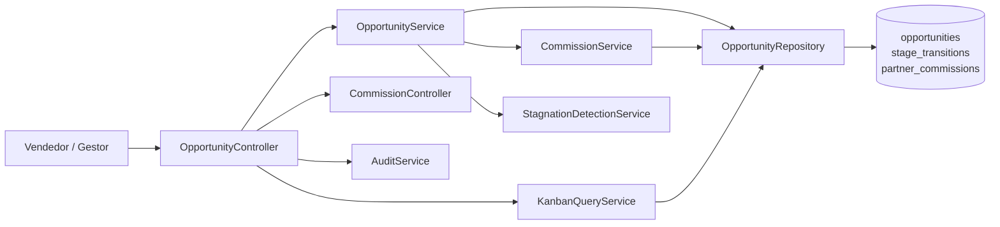
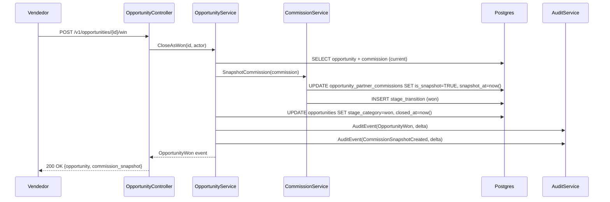
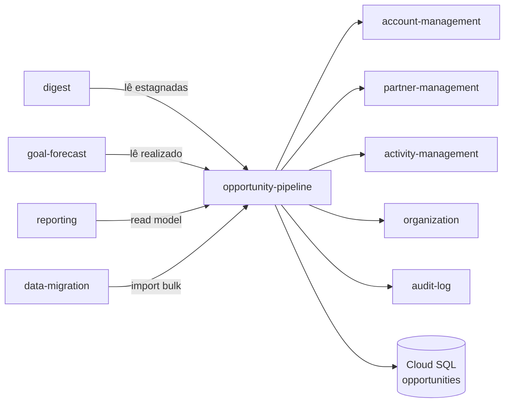

# Module — Opportunity Pipeline

**Status:** Rascunho para revisão
**Fase:** Fase 1 MVP

---

## 1. Visão Geral

Módulo central e Core Domain do Azim CRM. Gerencia o ciclo de vida completo de oportunidades comerciais no funil de vendas: criação com owner obrigatório, movimentação de estágio, encerramento (ganho ou perdido), detecção de estagnação e comissão nativa de parceiro com snapshot imutável ao fechar. Diferencial competitivo confirmado adversarialmente — gap inexistente em Salesforce e Zoho.

---

## 2. Classificação

| Item | Valor |
|---|---|
| Tipo de Módulo | Application Module (Core Domain) |
| Deployable Candidato | azim-api |
| Bounded Context Relacionado | Opportunity Pipeline (BC-01) |
| Subdomínio DDD | Core Domain |
| Tier / Criticidade | Tier 1 — diferencial central do produto; toda operação comercial depende deste módulo |
| Status | Rascunho para revisão |

---

## 3. Objetivo

Prover o pipeline comercial estruturado com rastreabilidade completa: owner obrigatório, numeração sequencial imutável, forecast ponderado calculado automaticamente, comissão nativa por parceiro com snapshot imutável no fechamento e detecção automática de estagnação. Viabilizar o Kanban por BU com performance fluida e a visão de pipeline para Digest, Relatórios e Metas.

---

## 4. Responsabilidades

- Criar oportunidade com owner obrigatório (RN-002), numeração AZ-NNNN (RN-001) e canal de origem.
- Validar data de fechamento esperada a partir do estágio "Proposta Enviada" (RN-003).
- Registrar transição de estágio com ator e timestamp (opportunity_stage_transitions).
- Encerrar como perdida com motivo de perda obrigatório (RN-004).
- Encerrar como ganha: snapshot imutável de comissão (RN-007, RN-022).
- Calcular valor_total (setup + mensal × meses — RN-005) e forecast_ponderado (valor_total × probabilidade — RN-006) via colunas geradas no banco.
- Vincular parceiro à oportunidade; herdar percentuais default (RN-008).
- Calcular comissão de parceiro por componente: pct_setup × valor_setup + pct_recorrente × valor_mensal × meses (RN-026).
- Detectar estagnação: oportunidade sem atividade concluída há ≥ 14 dias (RN-028) — publicar OpportunityStale.
- Reabrir oportunidade perdida — restrito a TAdmin e GestorBU (RN-016).
- Expor Kanban View, read models para Digest, Relatórios e Goal & Forecast.
- Publicar AuditEvent em toda escrita via audit-log.

---

## 5. Fora de Escopo

- Gestão de contas e contatos (pertence ao account-management).
- Gestão de parceiros e percentuais default (pertence ao partner-management).
- Gestão de atividades (pertence ao activity-management).
- Gestão de metas mensais (pertence ao goal-forecast).
- Composição e envio do Digest (pertence ao digest).
- Relatórios analíticos complexos (pertence ao reporting).
- Automação de pipeline por workflow (pertence ao workflow-automation — Fase 2).
- Scoring com IA (pertence ao ai-intelligence — Fase 3).
- Multimoeda (fora do MVP — LAC-05).

---

## 6. Capacidades Atendidas

| Código | Capability | Descrição |
|---|---|---|
| CAP-01 | Gestão de Pipeline | Ciclo de vida de oportunidades do funil |
| CAP-02 | Comissão Nativa de Parceiro | Cálculo e snapshot imutável de comissão |
| CAP-03 | Forecast Ponderado | Cálculo valor_total e forecast_ponderado |

---

## 7. Bounded Context e Linguagem Ubíqua

| Termo | Definição |
|---|---|
| Opportunity | Oportunidade comercial — aggregate central com owner, conta, parceiro, estágio, valor e comissão |
| opportunity_number | Número sequencial imutável AZ-NNNN; identificador humano da oportunidade (RN-001) |
| owner_id | Responsável obrigatório pela oportunidade; deve ser usuário ativo na BU (RN-002) |
| stage_category | Categoria do estágio: open, won, lost — define o ciclo de vida |
| valor_setup | Valor de setup em centavos inteiros BRL |
| valor_mensal | Valor mensalidade em centavos inteiros BRL |
| duracao_meses | Duração do contrato em meses |
| valor_total | valor_setup + valor_mensal × duracao_meses (coluna gerada — RN-005) |
| probabilidade | Probabilidade de fechamento herdada do estágio (0–100) |
| forecast_ponderado | valor_total × probabilidade / 100 (coluna gerada — RN-006) |
| stale | Oportunidade sem atividade concluída há ≥ 14 dias (RN-028) |
| snapshot imutável | Registro de comissão após ganho da oportunidade — sem UPDATE após is_snapshot=true (RN-007) |
| OpportunityPartnerCommission | Entidade de comissão por componente; imutável após snapshot |
| loss_reason | Motivo de perda obrigatório ao encerrar como perdida (RN-004) |

---

## 8. Componentes Internos Candidatos

| Componente | Tipo | Responsabilidade |
|---|---|---|
| OpportunityService | Domain Service | Ciclo de vida: criar, mover estágio, ganhar, perder, reabrir |
| CommissionService | Domain Service | Calcular e criar snapshot imutável de comissão (RN-026, RN-007) |
| StagnationDetectionService | Domain Service | Detectar estagnação via last_activity_at (RN-028) |
| KanbanQueryService | Application Service | Compor KanbanView por BU com filtros |
| PipelineReadModelService | Application Service | Compor read models para Digest, Goals e Reporting |
| OpportunityRepository | Repository | Escrita em opportunities, opportunity_stage_transitions, opportunity_partner_commissions |
| OpportunityController | API Controller | Endpoints de CRUD, Kanban e operações de estágio |
| CommissionController | API Controller | Endpoints de comissão por oportunidade |

---

## 9. APIs Principais

| Método | Endpoint | Finalidade | Consumidores |
|---|---|---|---|
| GET | /v1/opportunities | Lista oportunidades com filtros (BU, estágio, owner, período) | azim-web |
| POST | /v1/opportunities | Criar oportunidade | azim-web, data-migration |
| GET | /v1/opportunities/{id} | Detalhes da oportunidade | azim-web |
| PUT | /v1/opportunities/{id} | Atualizar oportunidade (campos permitidos) | azim-web |
| PUT | /v1/opportunities/{id}/stage | Mover estágio | azim-web |
| POST | /v1/opportunities/{id}/win | Encerrar como ganha (gera snapshot de comissão) | azim-web |
| POST | /v1/opportunities/{id}/lose | Encerrar como perdida (motivo obrigatório) | azim-web |
| POST | /v1/opportunities/{id}/reopen | Reabrir (TAdmin/GestorBU) | azim-web |
| GET | /v1/opportunities/kanban | KanbanView por BU | azim-web |
| GET | /v1/opportunities/{id}/commissions | Comissão calculada da oportunidade | azim-web |
| PUT | /v1/opportunities/{id}/commissions | Atualizar percentuais de comissão (antes do snapshot) | azim-web |
| GET | /internal/pipeline/stale | Oportunidades estagnadas (para Digest) | digest |
| GET | /internal/pipeline/forecast | Forecast e realizado por período (para Goals) | goal-forecast |

---

## 10. Eventos Publicados

| Evento | Quando é publicado | Consumidores |
|---|---|---|
| OpportunityCreated | Após criação | audit-log |
| OpportunityStageChanged | Após movimentação de estágio | audit-log |
| OpportunityWon | Após encerramento como ganha | audit-log, reporting |
| OpportunityLost | Após encerramento como perdida | audit-log |
| OpportunityStale | Após detecção de estagnação (scheduler) | digest, audit-log |
| OpportunityReopened | Após reabertura | audit-log |
| CommissionCalculated | Após cálculo de comissão | audit-log |
| CommissionSnapshotCreated | Após snapshot imutável no ganho | audit-log, reporting |

---

## 11. Eventos Consumidos

Este módulo não consome eventos diretamente. A detecção de estagnação é executada de forma programática pelo StagnationDetectionService (agendado ou sob demanda).

---

## 12. Dados Próprios

| Entidade/Tabela | Tipo | Banco/Persistência | Observações |
|---|---|---|---|
| opportunities | Transacional | Cloud SQL / Postgres | valor_total e forecast_ponderado como colunas geradas; RLS por tenant_id |
| opportunity_stage_transitions | Histórico | Cloud SQL / Postgres | Registro imutável de cada transição de estágio |
| opportunity_partner_commissions | Imutável (snapshot) | Cloud SQL / Postgres | is_snapshot=TRUE = imutável; trigger/policy bloqueia UPDATE após snapshot |
| stages | Configuração | Dono: organization; consumido | FK para stage_id; sem escrita neste módulo |
| origin_channels | Configuração | Dono: organization; consumido | FK para origin_channel_id; sem escrita neste módulo |
| loss_reasons | Configuração | Dono: organization; consumido | FK para loss_reason_id; sem escrita neste módulo |

---

## 13. Integrações

| Sistema/Módulo | Tipo de Integração | Direção | Observações |
|---|---|---|---|
| account-management | API HTTP | Entrada | Consulta account_id e dados da conta ao criar/exibir oportunidade |
| partner-management | API HTTP | Entrada | Consulta partner_id, pct_setup, pct_recorrente ao vincular parceiro |
| activity-management | API HTTP | Entrada | Consulta last_activity_at para detecção de estagnação |
| organization | API HTTP | Entrada (Conformist) | Valida bu_id, stage_id, owner_id, origin_channel_id, loss_reason_id |
| digest | API HTTP | Saída | Expõe opps estagnadas e fechamentos esperados |
| goal-forecast | API HTTP | Saída | Expõe won_total e pipeline ponderado por período |
| reporting | Read Model (query) | Saída | FunnelReport, CommissionReport, StagnationView |
| audit-log | Package (AuditService) | Saída | Toda escrita gera AuditEvent |
| data-migration | API HTTP | Entrada | Import bulk de oportunidades via transação única (Fase 1) |
| workflow-automation | Evento (Pub/Sub, Fase 2) | Saída | Publica opportunity.* events para automações (DDD-VAL-05) |
| ai-intelligence | API HTTP (Fase 3) | Saída | Expõe opp_data_for_scoring |

---

## 14. Dependências

### 14.1 Dependências de Domínio

- account-management: account_id (oportunidade sempre vinculada a uma conta).
- partner-management: partner_id e percentuais (opcional — canal Parceiro exige RN-008).
- activity-management: last_activity_at para RN-028.
- organization: bu_id, stage_id, owner_id, origin_channel_id, loss_reason_id.

### 14.2 Dependências Técnicas

- Cloud SQL / Postgres (tabelas opportunities, transitions, commissions)
- Colunas geradas (GENERATED ALWAYS AS) para valor_total e forecast_ponderado
- Trigger/policy de imutabilidade em opportunity_partner_commissions (is_snapshot=true)
- Índice: (tenant_id, bu_id, stage_id) para KanbanView
- Cloud Scheduler ou job interno para StagnationDetectionService (agendado)

### 14.3 Dependências Operacionais

- Configuração do job de detecção de estagnação (agendamento, retentativas)
- Alerta se OpportunityStale não for publicado no intervalo esperado

---

## 15. Requisitos Não Funcionais Relevantes

| Categoria | Requisito / Observação |
|---|---|
| Performance | Kanban fluido com centenas de oportunidades — NFR-PERF-02/03; índice em (tenant_id, bu_id, stage_id) |
| Segurança | Snapshot imutável garantido por trigger/policy; sem UPDATE após is_snapshot=TRUE (RN-007) |
| Resiliência | Detecção de estagnação deve ser idempotente; re-execução não deve duplicar OpportunityStale |
| Auditabilidade | opportunity_stage_transitions como histórico imutável; audit_logs para toda escrita |

---

## 16. Compliance Aplicável

| Compliance / Norma / Lei | Aplicável? | Motivo | Impacto no Módulo |
|---|---|---|---|
| LGPD | Marginal | opportunities.title pode conter nome de contato por referência informal | Não armazenar PII em campos de texto livre; PII de contatos fica em account-management |
| PCI DSS | Não aplicável | Não processa dados de cartão | — |

---

## 17. Observabilidade

| Item | Recomendação Inicial |
|---|---|
| Logs | Log estruturado: correlation_id, tenant_id, bu_id, opportunity_id, estágio, ação |
| Métricas | opportunities_created_total, opportunities_won_total, opportunities_lost_total, opportunities_stale_total |
| Traces | Trace em operações de ganho (win) que geram snapshot de comissão |
| Alertas | Alerta se stagnation job não executar no intervalo esperado; alerta se snapshot falhar |
| Auditoria | opportunity_stage_transitions como linha do tempo auditável; audit_logs para toda escrita |

---

## 18. Diagramas do Módulo

### 18.1 Diagrama de Componentes Internos

### 18.2 Diagrama de Fluxo — Ganhar Oportunidade com Snapshot de Comissão

### 18.3 Diagrama de Dependências

---

## 19. Riscos

| Código | Risco | Impacto | Mitigação |
|---|---|---|---|
| RISK-PIPE-01 | Snapshot de comissão corrompido ou duplicado | Comissão incorreta registrada de forma imutável | Transação atômica; constraint UNIQUE(opportunity_id, is_snapshot=true); teste de regressão |
| RISK-PIPE-02 | Detecção de estagnação não executada | Digest não exibe opps estagnadas; gestor não acionado | Alerta se job não executar; idempotência na re-execução |
| RISK-PIPE-03 | opportunity_number duplicado em concorrência | Violação de RN-001 | Geração sequencial com lock ou sequence do banco |

---

## 20. Pontos a Validar

| Código | Ponto | Impacto | Recomendação |
|---|---|---|---|
| VAL-PIPE-01 | Publicação de opportunity.* via Pub/Sub para Workflow Automation (Fase 2 — DDD-VAL-05) | Define contrato de evento entre BCs | Confirmar antes de iniciar a Fase 2 |
| VAL-PIPE-02 | Mecanismo de geração do opportunity_number (AZ-NNNN): sequence do banco vs geração na aplicação | Define abordagem sem duplicação | Preferir SEQUENCE do Postgres para garantia de unicidade |
| VAL-PIPE-03 | Job de detecção de estagnação: Cloud Scheduler externo vs cron interno na API | Define deployable do job | Avaliar Cloud Scheduler com endpoint interno protegido |

---

## 21. Backlog Inicial Sugerido

| Tipo | Item | Descrição |
|---|---|---|
| Epic | Pipeline Core — Ciclo de Vida de Oportunidades | CRUD, Kanban, ganho/perda, estagnação |
| Epic | Comissão Nativa de Parceiro | Cálculo, snapshot imutável, relatório |
| Story Técnica | Criar oportunidade com owner obrigatório e numeração AZ-NNNN | POST /v1/opportunities; RN-001, RN-002 |
| Story Técnica | Mover estágio com validação de data de fechamento | PUT /v1/opportunities/{id}/stage; RN-003 |
| Story Técnica | Encerrar como ganha com snapshot imutável de comissão | POST /v1/opportunities/{id}/win; RN-007, RN-022 |
| Story Técnica | Encerrar como perdida com motivo obrigatório | POST /v1/opportunities/{id}/lose; RN-004 |
| Story Técnica | KanbanView com filtros por BU e estágio | GET /v1/opportunities/kanban |
| Story Técnica | Detecção de estagnação (RN-028) | StagnationDetectionService agendado; publicar OpportunityStale |
| Story Técnica | Cálculo de comissão por componente (RN-026) | PUT /v1/opportunities/{id}/commissions |
| Task | Constraint de imutabilidade em opportunity_partner_commissions | Trigger/policy: sem UPDATE quando is_snapshot=TRUE |
| Task | Restrição de reabertura a TAdmin/GestorBU (RN-016) | RBAC no endpoint POST /v1/opportunities/{id}/reopen |

---

## 22. Referências

| Documento | Seção |
|---|---|
| DDD Segmentation | §4.1 BC-01 Opportunity Pipeline (Core Domain) |
| DDD Segmentation | §2 Event Storming — Fluxo 1 e Fluxo 3 |
| DDD Segmentation | §6 Data Ownership — Opportunity Pipeline |
| Data Model | §3 Opportunity Pipeline (BC-01) |
| Context Map | relations.md — Opportunity Pipeline → todos os upstream BCs |
