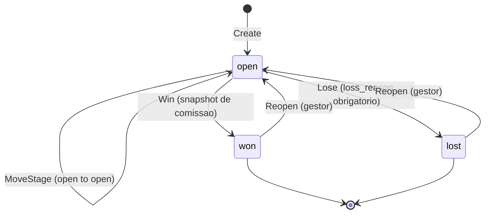
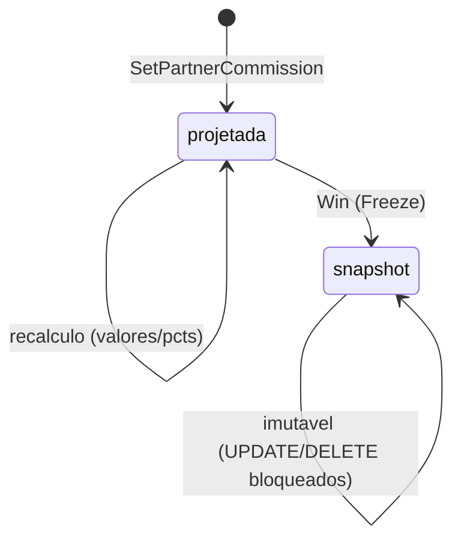
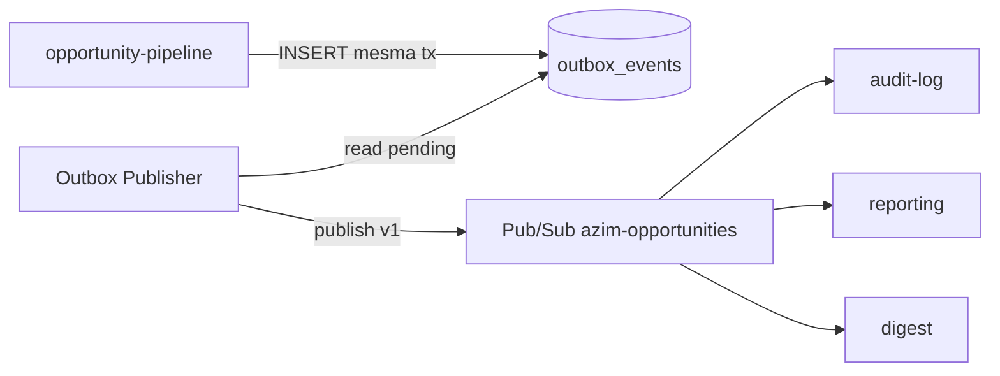
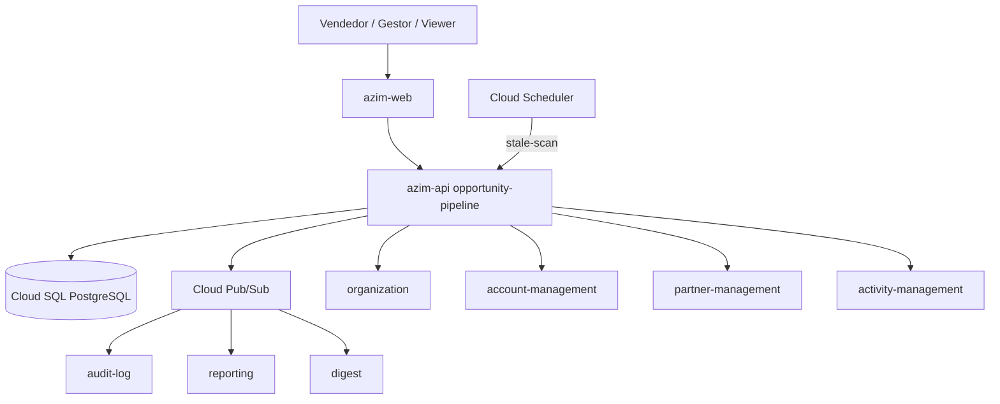
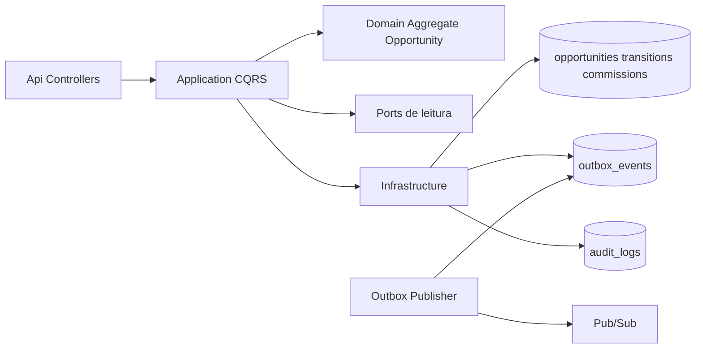
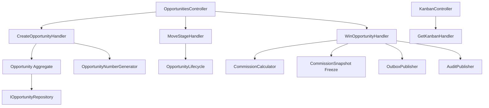
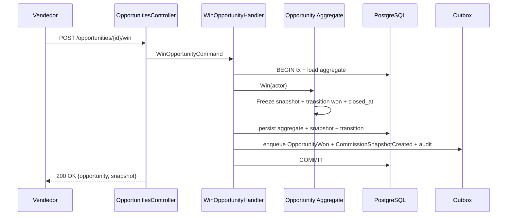

# OP — Opportunity Pipeline (Pipeline de Oportunidades)
**Design Técnico**

- Versão: 0.1.0
- Data: 2026-06-11
- Status: Rascunho para revisão
- Referência base: docs/product/modules/opportunity-pipeline/requirements.md v0.1.0
- ADRs aplicáveis: **ADR-0001** (isolamento multi-tenant em defesa em profundidade — Aceito); **ADR-0002** (snapshot imutável de comissão — a formalizar, referência TRD §22/DEC-002); **ADR-0003** (unicidade de `opportunity_number` por tenant — a formalizar, referência data-model §3/FIND-TRD-001); **ADR-0004** (Outbox pattern + idempotência de consumers — a formalizar, referência TRD §9.5/DEC-009)
- Rules aplicáveis: `.forge/rules/architecture/clean-architecture.md`, `.forge/rules/architecture/ddd.md`, `.forge/rules/architecture/api-and-contracts.md`, `.forge/rules/architecture/observability.md`, `.forge/rules/architecture/security-and-compliance.md`, `.forge/rules/architecture/jwt-permissions.md`, `.forge/rules/domain/money-as-cents.md`, `.forge/rules/domain/nbr-5891-rounding.md`, `.forge/rules/domain/audit-immutability.md`, `.forge/rules/conventions/database-naming.md`, `.forge/rules/conventions/language-policy.md`, `.forge/rules/conventions/document-versioning.md`

## Histórico de Versões

| Versão | Data | Status | Descrição da alteração |
|--------|------|--------|------------------------|
| 0.1.0 | 2026-06-11 | Rascunho para revisão | Criação inicial do design técnico derivado do requirements.md v0.1.0 (Req 1..20, RNF 1..12, PBT-01..11), TRD, data-model §3, ADR-0001 e DDD core/opportunity-pipeline. |

## 1. Visão Geral

Este documento especifica o **como** do módulo **opportunity-pipeline** (Bounded Context BC-01, **Core Domain**, deployable `azim-api`), derivado do `requirements.md` v0.1.0 (Rascunho para revisão).

O módulo governa o **ciclo de vida completo de uma oportunidade comercial** — o coração do produto e o diferencial competitivo confirmado (parceiro → comissão → oportunidade como cidadão de primeira classe). Entrega as capacidades:

1. **Gestão de pipeline (CAP-01):** criar oportunidade com owner obrigatório (Req 1, Req 2), numeração `AZ-NNNN` atômica e imutável (Req 3), movimentação de estágio auditável (Req 5) governada por máquina de estados por categoria (Req 6), encerramento como ganha (Req 14) ou perdida (Req 10), reabertura restrita a gestão (Req 15) e detecção de estagnação (Req 17).
2. **Comissão nativa de parceiro (CAP-02):** vínculo por componente (Req 11), cálculo automático em centavos (Req 12) e **congelamento por snapshot imutável ao ganhar** (Req 14, RNF 5) — o diferencial central.
3. **Forecast ponderado (CAP-03):** cálculo de `valor_total`, `forecast_ponderado` (Req 8) e `forecast_liquido` (Req 13), insumo do Kanban (Req 18), lista (Req 19), digest, goal-forecast e reporting.

Tudo sob **isolamento multi-tenant em defesa em profundidade** (RNF 3, ADR-0001), **integridade monetária em centavos** (RNF 11), **auditoria imutável** (RNF 6, RNF 7) e **eventos confiáveis via Outbox** (Req 20, ADR-0004).

A solução é organizada em **Clean Architecture (.NET, 5 projetos + projetos de teste)**, com **DDD tático rico** no agregado `Opportunity`. A persistência é Cloud SQL/PostgreSQL em `southamerica-east1`; eventos de domínio são publicados via padrão **Outbox + Cloud Pub/Sub**.

### 1.1 Rastreabilidade requisito → design (mapa-mestre)

| Requisito | Elementos de design |
|-----------|---------------------|
| Req 1 — Criar oportunidade | `CreateOpportunityCommand`/Handler, agregado `Opportunity.Create`, `OpportunityNumberGenerator`, evento `OpportunityCreated`, erros OP-ERR-001/010/011, `POST /opportunities` (§4.1, §5.1, §6.5, §8) |
| Req 2 — Owner obrigatório | Invariante de `Opportunity` (owner não nulo), porta `IOrganizationReadPort.ValidateOwnerMembership`, `NOT NULL owner_id`, erro OP-ERR-002 (§4.1, §5.5, §7) |
| Req 3 — Numeração AZ-NNNN atômica | Objeto de valor `OpportunityNumber`, `OpportunityNumberGenerator` + tabela `opportunity_number_sequences` com lock atômico, DD-001, `uq_opportunities_tenant_number`, PBT-01/02 (§4.3, §6.1, §7, §17) |
| Req 4 — Canal obrigatório / Parceiro exige parceiro | Invariante de `Opportunity` (canal obrigatório; canal Parceiro exige `partner_id`), objeto de valor `OriginChannelRef`, erros OP-ERR-003/004 (§4.1, §4.3, §5.5) |
| Req 5 — Estágio e transição na timeline | Entidade `OpportunityStageTransition` (append-only), `MoveStageCommand`/Handler, evento `OpportunityStageChanged`, `opportunity_stage_transitions`, RNF 7 (§4.2, §5.1, §7) |
| Req 6 — Máquina de estados | `StageCategory` + `OpportunityLifecycle` (state machine), guardas de transição, PBT-08 (§4.5, §4.6) |
| Req 7 — Probabilidade herdada/editável | Objeto de valor `Probability`, default do estágio via `IOrganizationReadPort`, recálculo de forecast (§4.3, §5.5) |
| Req 8 — valor_total e forecast_ponderado | Objeto de valor `Money`, `ContractValue`, colunas geradas `valor_total`/`forecast_ponderado`, `NbrRounding`, PBT-03/04 (§4.3, §7, §15) |
| Req 9 — Data fechamento a partir de Proposta Enviada | Política `ExpectedCloseDatePolicy`, guarda na transição, flag `vencida` derivada, erro OP-ERR-005 (§4.6, §5.5) |
| Req 10 — Perder com motivo | `LoseOpportunityCommand`/Handler, guarda `loss_reason_id`, evento `OpportunityLost`, erro OP-ERR-006 (§4.5, §5.1) |
| Req 11 — Vínculo de comissão por componente | Entidade `OpportunityPartnerCommission`, objeto de valor `CommissionTerms` (`papel`, `pct_setup`, `pct_recorrente`, `valor_fixo`, `meses_comissionados`), `SetPartnerCommissionCommand`, evento `CommissionCalculated` (§4.2, §4.3, §5.1) |
| Req 12 — Cálculo de comissão | Objeto de valor `CommissionCalculation` + `CommissionCalculator` (domain service), `NbrRounding`, PBT-05 (§4.3, §4.6) |
| Req 13 — Forecast líquido | `NetForecastCalculator`, read model, PBT-06 (§4.6, §5.2) |
| Req 14 — Ganhar com snapshot imutável | `WinOpportunityCommand`/Handler transacional, `CommissionSnapshot.Freeze`, trigger de imutabilidade, eventos `OpportunityWon`/`CommissionSnapshotCreated`, `uq_partner_commission_active_snapshot`, DD-002, DD-007 (VAL-07), PBT-07/11 (§4.2, §6.1, §7, §17) |
| Req 15 — Reabertura restrita | `ReopenOpportunityCommand`/Handler, política RBAC (TenantAdmin/GestorBU), preservação do snapshot, evento `OpportunityReopened`, erro OP-ERR-008 (§5.1, §10) |
| Req 16 — Contatos (1 principal) | Entidade `OpportunityContactLink`, objeto de valor `ContactLink`, invariante "exatamente um principal", erro OP-ERR-009 (§4.2, §4.3) |
| Req 17 — Estagnação | `StagnationDetectionService`, `IActivityReadPort.GetLastActivity`, idempotência via `stale_detection_runs`, evento `OpportunityStale`, DD-005, PBT-09 (§4.6, §5.3, §6.5) |
| Req 18 — Kanban por BU | `GetKanbanQuery`/Handler, read model `KanbanView`, índice `idx_opportunities_tenant_bu_stage`, paginação por coluna, RNF 1 (§5.2, §7, §15) |
| Req 19 — Lista com filtros salvos + timeline | `ListOpportunitiesQuery`, `SavedFilter`, `GetTimelineQuery`, `GET /opportunities`, `GET /opportunities/{id}/timeline` (§5.2, §8) |
| Req 20 — Eventos de domínio | `IDomainEventDispatcher` + Outbox (`outbox_events`), envelope versionado `.v1`, §9 (§6.6, §9) |
| RNF 1 — Performance Kanban | Índice composto, paginação incremental, somas agregadas em SQL, alerta p95 (§7, §11, §15) |
| RNF 2 — Latência de escrita | Auditoria no mesmo fluxo transacional, índices, SLO p95 ≤ 500 ms (§11, §15) |
| RNF 3 — Isolamento em profundidade | `tenant_id` + EF Global Query Filter + RLS falha-fechada, DD-006, PBT-10 (§6.1, §10, §14) |
| RNF 4 — RBAC por endpoint | `[Authorize]` por política, `RbacBehavior`, matriz papel × capacidade (§5.4, §10) |
| RNF 5 — Imutabilidade do snapshot | Trigger `trg_block_snapshot_mutation` + `uq_partner_commission_active_snapshot`, PBT-07/11 (§6.1, §7) |
| RNF 6 — AuditLog imutável | `IAuditPublisher` via Outbox, `audit_logs` append-only, `PiiMasker` (§6.6, §11) |
| RNF 7 — Transições append-only | `opportunity_stage_transitions` somente INSERT; REVOKE UPDATE/DELETE (§6.1, §7) |
| RNF 8 — Retenção indefinida | Sem job de purge para snapshot/transições; role `app` sem DELETE (§7, §15) |
| RNF 9 — Idempotência da estagnação | `stale_detection_runs` por período, alerta de não execução (§5.3, §11) |
| RNF 10 — Observabilidade | Logs estruturados, métricas, traces com `correlation_id`/`tenant_id`, sem PII (§11) |
| RNF 11 — Integridade monetária | Objeto de valor `Money` (centavos `long`/`BIGINT`), `NbrRounding` ToEven, proibição de `float`/`double` (§4.3) |
| RNF 12 — Disponibilidade Tier 1 | Endpoints idempotentes, health checks, escalabilidade horizontal (§11, §15) |
| PBT-01..11 | Cobertura em §13 (Testes), mapeada por propriedade |

## 2. Princípios e Decisões Macro

| # | Princípio | Decisão de design |
|---|-----------|-------------------|
| P1 | Clean Architecture estrita | 5 projetos .NET (`OpportunityPipeline.Domain/Application/Infrastructure/Api/Contracts`); regra de dependência enforçada por `OpportunityPipeline.Architecture.Tests` |
| P2 | Domínio rico, não anêmico | Invariantes (owner, estágio, canal, data de fechamento, motivo de perda, comissão) e cálculos vivem no `Domain`; handlers apenas orquestram caso de uso, transação e portas |
| P3 | Agregado como fronteira transacional | `Opportunity` é o único aggregate root; transições, links de contato e vínculo de comissão são entidades internas; consistência forte dentro do agregado |
| P4 | Imutabilidade financeira garantida no banco | Snapshot de comissão e transições são append-only; UPDATE/DELETE bloqueados por trigger + REVOKE, não só na aplicação (RNF 5, RNF 7) |
| P5 | Isolamento em profundidade obrigatório | `tenant_id` em coluna + EF Core Global Query Filter + **RLS PostgreSQL falha-fechada** (ADR-0001, DD-006); RLS não é opcional |
| P6 | Money sempre em centavos inteiros | Objeto de valor `Money` (`long`/`BIGINT`); arredondamento NBR 5891 ToEven; `float`/`double` proibidos; `decimal` apenas em apresentação (RNF 11) |
| P7 | Eventos confiáveis via Outbox | Evento de domínio persistido em `outbox_events` na mesma transação do estado de negócio; publisher background publica no Pub/Sub at-least-once; consumer idempotente por `event_id` (ADR-0004) |
| P8 | Numeração atômica por tenant | `opportunity_number` gerado por contador transacional com lock por tenant; nunca pelo usuário; imutável; unicidade `uq_opportunities_tenant_number` (DD-001, ADR-0003) |
| P9 | Conformist com upstream de configuração | `stages`, `origin_channels`, `loss_reasons`, `business_units`, `users`, `partners` e `contacts` são lidos via portas; o módulo nunca os escreve |
| P10 | API-first/contract-first | Contratos OpenAPI versionados em `/api/v1`; erros padronizados com `correlationId`; idempotência por `Idempotency-Key` nas operações de escrita |
| P11 | Auditoria imutável de toda escrita | Cada operação de negócio gera exatamente 1 registro em `audit_logs` (append-only) com delta mascarado de PII (RNF 6) |
| P12 | LGPD by design | `title`/`notes` sem PII de contato; PII reside em account-management; nenhum log/trace/evento expõe PII (Req 1.3, Req 16.4, RNF 10) |

## 3. Estrutura da Solução

```text
OpportunityPipeline.Domain
  Opportunities/
    Opportunity.cs                       (Aggregate Root)
    OpportunityStageTransition.cs        (Entidade interna, append-only)
    OpportunityPartnerCommission.cs      (Entidade interna; vira snapshot)
    OpportunityContactLink.cs            (Entidade interna)
    ValueObjects/
      OpportunityNumber.cs               (AZ-NNNN)
      Money.cs                           (centavos long)
      ContractValue.cs                   (setup + mensal x meses)
      Probability.cs                     (0..100)
      StageCategory.cs                   (open|won|lost)
      StageRef.cs OriginChannelRef.cs LossReasonRef.cs
      CommissionTerms.cs                 (papel, pcts, valor_fixo, meses)
      CommissionCalculation.cs           (setup/recorrente/total)
      CommissionRole.cs                  (Indicador|Revendedor|Distribuidor|Integrador)
      ContactLink.cs                     (contact_id, is_primary)
    Events/
      OpportunityCreated.cs OpportunityStageChanged.cs
      OpportunityWon.cs OpportunityLost.cs
      OpportunityStale.cs OpportunityReopened.cs
      CommissionCalculated.cs CommissionSnapshotCreated.cs
    Services/
      OpportunityLifecycle.cs            (máquina de estados / guardas)
      CommissionCalculator.cs            (cálculo puro)
      NetForecastCalculator.cs           (forecast líquido)
      NbrRounding.cs                     (arredondamento ToEven)
      ExpectedCloseDatePolicy.cs
    Repositories/
      IOpportunityRepository.cs
      IOpportunityNumberGenerator.cs
    Exceptions/
      OwnerRequiredException.cs StageRequiredException.cs
      OriginChannelRequiredException.cs PartnerRequiredException.cs
      LossReasonRequiredException.cs ExpectedCloseDateRequiredException.cs
      InvalidStageTransitionException.cs SnapshotImmutableException.cs
      PrimaryContactRequiredException.cs

OpportunityPipeline.Application
  Opportunities/Commands/   (CreateOpportunity, UpdateOpportunity, MoveStage,
                             WinOpportunity, LoseOpportunity, ReopenOpportunity,
                             SetPartnerCommission, LinkContact, UnlinkContact)
  Opportunities/Queries/    (ListOpportunities, GetOpportunity, GetKanban,
                             GetTimeline, GetCommission, GetForecast, GetStale)
  Behaviors/                (Validation, Rbac, Tenant, Idempotency, Logging, Tx)
  Ports/                    (IOrganizationReadPort, IAccountReadPort,
                             IPartnerReadPort, IActivityReadPort,
                             IAuditPublisher, IDomainEventDispatcher, IClock)
  Services/                 (StagnationDetectionService)
  Validators/
  SavedFilters/             (SaveFilter, ListFilters)

OpportunityPipeline.Infrastructure
  Persistence/              (OpportunityDbContext, EntityConfigs, Repositories, Migrations)
  Numbering/                (OpportunityNumberGenerator — contador transacional)
  Outbox/                   (OutboxMessage, OutboxPublisher background service)
  Audit/                    (AuditPublisher, PiiMasker)
  ReadPorts/                (Organization/Account/Partner/Activity adapters — gRPC/HTTP interno)
  Tenancy/                  (TenantContext, GlobalQueryFilter, RlsConnectionInterceptor)
  Scheduling/               (StaleScanEndpointHandler / Cloud Scheduler trigger)

OpportunityPipeline.Api
  Controllers/              (OpportunitiesController, CommissionsController,
                             KanbanController, InternalPipelineController)
  Contracts mapping, AuthZ policies, ProblemDetails handlers

OpportunityPipeline.Contracts
  Dtos/ (Requests, Responses)
  Events/ (envelopes públicos .v1)
  ErrorCodes/ (OP-ERR-*)
```

Projetos de teste: `OpportunityPipeline.Domain.Tests`, `OpportunityPipeline.Application.Tests`, `OpportunityPipeline.Infrastructure.Tests`, `OpportunityPipeline.Api.Tests`, `OpportunityPipeline.Architecture.Tests`.

Regra de dependência (Clean Architecture), validada por `Architecture.Tests`:

```text
Api -> Application, Infrastructure, Contracts
Application -> Domain, Contracts
Infrastructure -> Application, Domain
Domain -> ∅
Contracts -> ∅
```

## 4. Modelo de Domínio

O domínio é organizado em torno de um único aggregate root, **`Opportunity`**, que protege todas as invariantes do ciclo de vida. As referências a entidades de outros bounded contexts (conta, parceiro, estágio, canal, motivo, usuário, contato) entram no agregado como **objetos de valor de referência tipados** (`*Ref` / `ContactLink`), nunca como entidades importadas — o agregado guarda apenas o identificador e os atributos imutáveis necessários à decisão de negócio, validados na borda pelas portas de leitura.

### 4.1 Aggregates

#### `Opportunity` (Aggregate Root)

Representa a negociação comercial. Tabela `opportunities`. Responsável por:

- garantir as invariantes de criação e de transição de estado;
- conter e ordenar as entidades internas (`OpportunityStageTransition`, `OpportunityPartnerCommission`, `OpportunityContactLink`);
- recalcular valores derivados quando seus insumos mudam;
- emitir domain events.

**Identidade:** `id` (UUID) + `opportunity_number` (`OpportunityNumber`, identificador humano). Igualdade por `id`.

**Estado principal:** `tenant_id`, `bu_id`, `account_id`, `owner_id`, `stage` (`StageRef` + `StageCategory` + `Probability`), `origin_channel` (`OriginChannelRef`), `partner_id?`, `title`, `contract_value` (`ContractValue`), `probability` (`Probability`), `expected_close_date?`, `loss_reason?` (`LossReasonRef`), `closed_at?`, `notes?`.

**Invariantes (sempre verdadeiras enquanto a oportunidade existe):**

| Inv | Descrição | Origem |
|-----|-----------|--------|
| INV-1 | `owner_id` é sempre não nulo e referencia usuário ativo com membership na `bu_id` | Req 2, RN-002 |
| INV-2 | `stage` é sempre não nulo; `stage_category` ∈ {`open`, `won`, `lost`} | Req 5, Req 6 |
| INV-3 | `origin_channel` é sempre não nulo | Req 4, RN-008 |
| INV-4 | Se `origin_channel` é "Parceiro" então `partner_id` é não nulo | Req 4.2, RN-008 |
| INV-5 | `opportunity_number` é imutável após criação | Req 3, RN-001, PBT-02 |
| INV-6 | `expected_close_date` é obrigatória quando `stage` é "Proposta Enviada" ou posterior | Req 9, RN-003 |
| INV-7 | Encerrada como `lost` exige `loss_reason` não nulo | Req 10, RN-004 |
| INV-8 | `valor_total = valor_setup + valor_mensal × duracao_meses`; `forecast_ponderado = round(valor_total × probabilidade / 100)` | Req 8, RN-005/006 |
| INV-9 | `probability` ∈ [0, 100] | Req 7 |
| INV-10 | No máximo 1 `partner_id` por oportunidade (MVP unitário) | Req 11.5 |
| INV-11 | Se há ≥ 1 contato vinculado, exatamente 1 é principal | Req 16.2 |
| INV-12 | No máximo 1 `OpportunityPartnerCommission` com `is_snapshot = TRUE` por oportunidade | Req 14.6, RNF 5 |
| INV-13 | `title` e `notes` não contêm PII de contato em texto livre | Req 1.3, Req 16.4, LGPD |

**Métodos de negócio (comportamento, não setters):**

- `Create(...)` — fábrica estática; valida INV-1..INV-5, INV-8, INV-9; aplica `probability` default do estágio; registra transição inicial; emite `OpportunityCreated`.
- `MoveStage(targetStage, actor)` — delega a `OpportunityLifecycle`; valida guardas (INV-6); recalcula `probability`/forecast; adiciona `OpportunityStageTransition`; emite `OpportunityStageChanged`.
- `UpdateContractValue(setup, mensal, meses)` / `OverrideProbability(p)` — recalculam `ContractValue` e forecast (INV-8/INV-9); recalculam comissão projetada enquanto não ganha; emitem `CommissionCalculated` quando há vínculo.
- `SetPartnerCommission(terms)` — cria/atualiza `OpportunityPartnerCommission` não-snapshot; valida INV-4/INV-10; emite `CommissionCalculated`.
- `Win(actor)` — guarda de categoria (`open → won`); congela snapshot de comissão (ver §4.2); define `closed_at`; registra transição; emite `OpportunityWon` + `CommissionSnapshotCreated`.
- `Lose(lossReason, actor)` — guarda de categoria; valida INV-7; define `closed_at`; registra transição; emite `OpportunityLost`.
- `Reopen(actor)` — guarda (`won|lost → open`); preserva snapshot existente; limpa `closed_at`; registra transição; emite `OpportunityReopened`.
- `LinkContact(contactLink)` / `UnlinkContact(contactId)` / `PromotePrimary(contactId)` — mantêm INV-11.
- `MarkStale()` — usado pelo serviço de estagnação; idempotente; emite `OpportunityStale`.

A oportunidade é a **fronteira transacional**: uma operação de aplicação carrega o agregado, invoca um método, persiste o agregado inteiro (com suas entidades internas, eventos no Outbox e auditoria) em uma única transação.

### 4.2 Entidades

#### `OpportunityStageTransition` (entidade interna, append-only)

Registro imutável de cada mudança de estágio. Tabela `opportunity_stage_transitions`. Campos: `id`, `tenant_id`, `opportunity_id`, `from_stage_id?`, `to_stage_id`, `from_category`, `to_category`, `actor_id`, `occurred_at`. Forma a **linha do tempo** (Req 5.3, Req 19.3). Somente INSERT (RNF 7): sem UPDATE/DELETE — garantido por REVOKE + ausência de comportamento mutável.

#### `OpportunityPartnerCommission` (entidade interna; congela como snapshot)

Vínculo de comissão de parceiro. Tabela `opportunity_partner_commissions`. Dois estados:

- **Projetada** (`is_snapshot = FALSE`): editável enquanto a oportunidade está aberta; recalculada a cada mudança de valores/percentuais (Req 12.5). Existe no máximo uma projetada por oportunidade no MVP unitário.
- **Snapshot** (`is_snapshot = TRUE`): criada ao ganhar (`Win`); congela `pct_setup`, `pct_recorrente`, `valor_fixo`, `meses_comissionados` e `comissao_calculada` vigentes; recebe `snapshot_at`. **Imutável**: sem UPDATE/DELETE por nenhum papel (trigger de banco — §6.1, RNF 5). A `Freeze()` copia os termos correntes da projetada para um novo registro snapshot, deixando a projetada como histórico ou promovendo-a a snapshot conforme DD-002.

#### `OpportunityContactLink` (entidade interna)

Vínculo a contatos da conta (mantidos por account-management). Tabela `opportunity_contacts`. Campos: `id`, `tenant_id`, `opportunity_id`, `contact_id`, `is_primary`. Invariante INV-11 garantida no agregado e por índice parcial único `uq_opportunity_contacts_primary (opportunity_id) WHERE is_primary`. Não armazena PII (apenas `contact_id`).

> **Observação de modelagem (DD-003):** `OpportunityPartnerCommission` é tratada como **entidade** (tem identidade e ciclo projetada→snapshot), enquanto `CommissionTerms` e `CommissionCalculation` são **objetos de valor** que compõem essa entidade. Isso evita anemia: o cálculo é comportamento de domínio, não lógica de serviço de aplicação.

### 4.3 Objetos de valor

Todos imutáveis, com igualdade por valor e validação no construtor (falha = exceção de domínio).

| Objeto de valor | Definição | Regras |
|-----------------|-----------|--------|
| `OpportunityNumber` | String `AZ-NNNN` (prefixo `AZ-` + sequência) | Formato validado por regex `^AZ-\d{4,}$`; imutável; gerado pelo sistema (Req 3) |
| `Money` | Valor monetário em **centavos** (`long`) de BRL | Não negativo nos campos de valor; aritmética inteira; sem `float`/`double`; arredondamento só via `NbrRounding` (RNF 11) |
| `ContractValue` | Agrega `valor_setup: Money`, `valor_mensal: Money`, `duracao_meses: int` | `valor_total = setup + mensal × meses`; `duracao_meses` obrigatório quando `valor_mensal > 0` (Req 8.4) |
| `Probability` | Inteiro [0, 100] | Fora do intervalo = exceção (Req 7.4) |
| `StageCategory` | Enum `open` \| `won` \| `lost` | Governa máquina de estados (Req 6) |
| `StageRef` | `stage_id`, `name`, `category`, `default_probability`, `order` | Snapshot leve do estágio lido de organization; usado para guardas e default |
| `OriginChannelRef` | `origin_channel_id`, `name`, `is_partner_channel` | `is_partner_channel` dispara INV-4 |
| `LossReasonRef` | `loss_reason_id`, `name` | Validado contra organization na borda |
| `CommissionRole` | Enum `Indicador` \| `Revendedor` \| `Distribuidor` \| `Integrador` | Papel do parceiro (Req 11.1) |
| `CommissionTerms` | `role`, `pct_setup`, `pct_recorrente`, `valor_fixo: Money?`, `meses_comissionados` | `valor_fixo` é mutuamente excludente aos percentuais (Req 11.4); pcts em [0,100] |
| `CommissionCalculation` | `comissao_setup: Money`, `comissao_recorrente: Money`, `comissao_total: Money` | Resultado derivado; ver §4.6 |
| `CommissionDefaults` | `pct_setup`, `pct_recorrente` default do parceiro | Lido de partner-management; pré-preenche `CommissionTerms` (Req 11.2) |
| `ContactLink` | `contact_id`, `is_primary` | INV-11 |

> Percentuais (`pct_setup`, `pct_recorrente`) são representados como `NUMERIC(5,2)` no banco e como tipo decimal de domínio **apenas para a taxa** (fator), nunca para o resultado monetário. O resultado monetário é sempre `Money` em centavos, com arredondamento NBR 5891 (RNF 11, DD-004).

### 4.4 Domain Events

Eventos nomeados no passado, emitidos pelo agregado e despachados via Outbox (§6.6, §9).

| Evento de domínio | Disparo | Payload essencial (sem PII) |
|-------------------|---------|------------------------------|
| `OpportunityCreated` | Após `Create` | `opportunity_id`, `opportunity_number`, `tenant_id`, `bu_id`, `account_id`, `owner_id`, `stage_id`, `origin_channel_id`, `actor_id`, `occurred_at` |
| `OpportunityStageChanged` | Após `MoveStage` | `opportunity_id`, `from_stage_id`, `to_stage_id`, `from_category`, `to_category`, `actor_id`, `occurred_at` |
| `OpportunityWon` | Após `Win` | `opportunity_id`, `valor_total`, `closed_at`, `actor_id` |
| `OpportunityLost` | Após `Lose` | `opportunity_id`, `loss_reason_id`, `closed_at`, `actor_id` |
| `OpportunityStale` | Após `MarkStale` | `opportunity_id`, `bu_id`, `last_activity_at`, `detected_at`, `detection_period` |
| `OpportunityReopened` | Após `Reopen` | `opportunity_id`, `previous_category`, `actor_id`, `reason`, `occurred_at` |
| `CommissionCalculated` | Após criar/editar comissão projetada | `opportunity_id`, `partner_id`, `comissao_total`, `is_snapshot=false` |
| `CommissionSnapshotCreated` | Após `Freeze` no ganho | `opportunity_id`, `partner_id`, `commission_id`, `comissao_total`, `snapshot_at` |

### 4.5 State Machines

#### `OpportunityLifecycle` — categorias de ciclo de vida (Req 6, PBT-08)



Transições válidas e guardas:

| De | Para | Gatilho | Guardas |
|----|------|---------|---------|
| (none) | `open` | `Create` | INV-1..5, INV-8, INV-9 |
| `open` | `open` | `MoveStage` | INV-6 (data de fechamento), categoria destino `open` |
| `open` | `won` | `Win` | Snapshot de comissão criado; VAL-07 (DD-007) |
| `open` | `lost` | `Lose` | `loss_reason` presente (INV-7) |
| `won`/`lost` | `open` | `Reopen` | RBAC TenantAdmin/GestorBU na BU; snapshot preservado |

Qualquer transição fora desta tabela (ex.: `won → lost`, `lost → won`, `open → open` por estágio inexistente) é **rejeitada sem efeito colateral**: sem registro de transição, sem evento, sem mudança de categoria (Req 6.5, PBT-08) — implementado lançando `InvalidStageTransitionException` antes de qualquer mutação.

#### `CommissionState` — projetada → snapshot



Após `snapshot`, nenhuma transição de volta é possível — a imutabilidade persiste mesmo após reabertura da oportunidade (Req 15.3, PBT-11).

### 4.6 Policies / Specifications

| Política / Cálculo | Responsabilidade | Regra |
|--------------------|------------------|-------|
| `ExpectedCloseDatePolicy` | Decide se `expected_close_date` é obrigatória | Obrigatória se `stage.order ≥ order("Proposta Enviada")` (Req 9, RN-003); guarda em `MoveStage` |
| `OverdueSpecification` | Marca oportunidade aberta como **vencida** | `stage_category = open ∧ expected_close_date < hoje` (Req 9.3); derivada em leitura, não persistida |
| `StagnationSpecification` | Marca oportunidade como **stale** | `stage_category = open ∧ (hoje − last_activity_at) ≥ 14 dias corridos` (Req 17.2, RN-028) |
| `CommissionCalculator` | Calcula comissão por componente (Req 12) | `comissao_setup = round(valor_setup × pct_setup/100)`; `comissao_recorrente = round(valor_mensal × meses_comissionados × pct_recorrente/100)`; `comissao_total = comissao_setup + comissao_recorrente`; se `valor_fixo` definido, `comissao_total = valor_fixo` (PBT-05) |
| `ForecastCalculator` | Calcula forecast ponderado (Req 8) | `forecast_ponderado = round(valor_total × probabilidade/100)` (PBT-04) |
| `NetForecastCalculator` | Calcula forecast líquido (Req 13) | `comissao_ponderada = round(comissao_total × probabilidade/100)`; `forecast_liquido = forecast_ponderado − comissao_ponderada`; sem comissão ⇒ `forecast_liquido = forecast_ponderado` (PBT-06) |
| `NbrRounding` | Arredondamento bancário | NBR 5891 ToEven (`MidpointRounding.ToEven`) em toda divisão monetária; entrada/saída em centavos `long` (RNF 11, PBT-03..06) |

Todos os cálculos operam exclusivamente sobre `Money` (centavos `long`) e fatores inteiros/decimais de taxa; nenhum usa `float`/`double` (RNF 11.2).

## 5. Application Layer

Padrão CQRS com um handler por caso de uso (estilo MediatR, alinhado aos demais módulos do `azim-api`). Commands para escrita, Queries para leitura. Validação sintática na borda; regra de negócio no domínio; autorização, idempotência, tenant e transação em pipeline behaviors.

### 5.1 Commands

| Command | Caso de uso | Agregado/método | Eventos | Erros |
|---------|-------------|-----------------|---------|-------|
| `CreateOpportunityCommand` | Criar oportunidade (completa/rápida) — Req 1 | `Opportunity.Create` | `OpportunityCreated` | OP-ERR-001/002/003/004/010/011 |
| `UpdateOpportunityCommand` | Editar campos permitidos — Req 1, Req 7, Req 8 | `UpdateContractValue`/`OverrideProbability`/edição | `CommissionCalculated`? | OP-ERR-002/007/012 |
| `MoveStageCommand` | Mover estágio (inclui drag-and-drop) — Req 5 | `MoveStage` | `OpportunityStageChanged` | OP-ERR-005/013 |
| `SetPartnerCommissionCommand` | Vincular/editar comissão — Req 11 | `SetPartnerCommission` | `CommissionCalculated` | OP-ERR-004/014/015 |
| `LinkContactCommand` / `UnlinkContactCommand` | Vincular/remover contato — Req 16 | `LinkContact`/`UnlinkContact`/`PromotePrimary` | — | OP-ERR-009/016 |
| `WinOpportunityCommand` | Ganhar com snapshot — Req 14 | `Win` (+`Freeze`) | `OpportunityWon`, `CommissionSnapshotCreated` | OP-ERR-013/017 (VAL-07: DD-007) |
| `LoseOpportunityCommand` | Perder com motivo — Req 10 | `Lose` | `OpportunityLost` | OP-ERR-006/013 |
| `ReopenOpportunityCommand` | Reabrir (gestão) — Req 15 | `Reopen` | `OpportunityReopened` | OP-ERR-008/013 |
| `SaveFilterCommand` | Salvar filtro de lista — Req 19 | — (read-side) | — | — |

`WinOpportunityCommand` é o caso de uso mais sensível: handler abre transação única, recarrega o agregado, invoca `Win` (que congela o snapshot, registra transição `won`, define `closed_at` e categoria), grava agregado + snapshot + transição + outbox + auditoria, e só então faz commit; falha em qualquer passo provoca rollback total (Req 14.4, RNF 5.4).

### 5.2 Queries

| Query | Retorno | Read model / fonte | Requisito |
|-------|---------|--------------------|-----------|
| `GetOpportunityQuery` | Detalhe + comissão + contatos + flags vencida/stale | `opportunities` (+joins leves) | Req 1, Req 9, Req 13 |
| `ListOpportunitiesQuery` | Lista paginada com filtros (owner, canal, parceiro, estágio, data, stale) | `opportunities` + índices | Req 19 |
| `GetKanbanQuery` | Colunas por estágio da BU com somas de `valor_total` e `forecast_ponderado`, paginação por coluna | `KanbanView` (SQL agregado) | Req 18, RNF 1 |
| `GetTimelineQuery` | Linha do tempo de transições | `opportunity_stage_transitions` | Req 5, Req 19 |
| `GetCommissionQuery` | Comissão projetada/snapshot + forecast líquido | `opportunity_partner_commissions` | Req 12, Req 13 |
| `GetForecastQuery` | Forecast e ponderado por período (interno) | `ForecastView` | Req 13; goal-forecast |
| `GetStaleQuery` | Oportunidades estagnadas (interno) | `StagnationView` | Req 17; digest |
| `ListSavedFiltersQuery` | Filtros salvos do usuário | `saved_filters` | Req 19.2 |

`GetKanbanQuery` calcula as somas por estágio diretamente em SQL agregado (`SUM(valor_total)`, `SUM(forecast_ponderado)`) usando o índice `idx_opportunities_tenant_bu_stage`, com paginação incremental por coluna para não materializar todo o conjunto (RNF 1.3).

### 5.3 Handlers

Um handler por command/query. Responsabilidades do handler de escrita, em ordem: (1) resolver tenant e RBAC (via behaviors); (2) carregar agregado pelo `IOpportunityRepository`; (3) validar referências externas via portas de leitura (owner, conta, estágio, canal, parceiro); (4) invocar o método de domínio; (5) persistir agregado + eventos no Outbox + auditoria na mesma transação; (6) retornar DTO de resposta. O handler **não contém regra de negócio** — apenas orquestra (P2).

#### `StagnationDetectionService` (Application Service, agendado)

Acionado por endpoint interno `POST /internal/stale-scan` (Cloud Scheduler — DD-005, VAL-PIPE-03). Para cada tenant/BU: consulta oportunidades `open` com `last_activity_at` (via `IActivityReadPort`) há ≥ 14 dias; para cada uma ainda não sinalizada no período corrente, invoca `MarkStale` e registra em `stale_detection_runs (tenant_id, opportunity_id, detection_period)`. Idempotência: a chave `(opportunity_id, detection_period)` impede `OpportunityStale` duplicado em reexecuções (Req 17.5, RNF 9, PBT-09).

### 5.4 Pipeline Behaviors

Ordem de execução do pipeline (request → handler):

1. `LoggingBehavior` — correlação, `tenant_id`, `bu_id`, ação (sem PII — RNF 10).
2. `TenantBehavior` — resolve `TenantContext`; garante `app.current_tenant` setado antes de qualquer acesso a dados.
3. `RbacBehavior` — valida política RBAC do caso de uso (RNF 4); 403 antes de tocar o domínio.
4. `IdempotencyBehavior` — em escritas, deduplica por `Idempotency-Key` (NFR-RES-02).
5. `ValidationBehavior` — validação sintática (FluentValidation).
6. `TransactionBehavior` — abre transação, executa handler, persiste Outbox + auditoria, commit/rollback atômico.

### 5.5 Validações de Aplicação

Validação sintática (borda, HTTP 422 com `OP-ERR-*`): presença de `account_id`, `bu_id`, `stage_id`, `origin_channel_id`, `owner_id`, `title`; `probability ∈ [0,100]`; `valores ≥ 0`; `duracao_meses` presente quando `valor_mensal > 0`; mutual exclusão `valor_fixo` × percentuais.

Validação semântica (portas de leitura, antes do domínio): `owner_id` é usuário ativo com membership na `bu_id` (`IOrganizationReadPort`); `account_id` existe (`IAccountReadPort`); `stage_id`/`origin_channel_id`/`loss_reason_id` pertencem à BU (`IOrganizationReadPort`); `partner_id` existe e fornece `CommissionDefaults` (`IPartnerReadPort`).

Validação de regra de negócio (domínio): todas as invariantes INV-1..13 e guardas de transição — lançadas como exceções de domínio mapeadas a `OP-ERR-*` no Api.

## 6. Infrastructure Layer

### 6.1 Persistência

- **Banco:** Cloud SQL / PostgreSQL, região `southamerica-east1` (residência Brasil).
- **ORM:** EF Core; `OpportunityDbContext` com mapeamento `snake_case` (rule database-naming), `tenant_id` em toda entidade e **Global Query Filter por `tenant_id`** (ADR-0001 camada 2).
- **RLS (ADR-0001 camada 3, obrigatória):** todas as três tabelas próprias têm RLS habilitada com política `tenant_id = current_setting('app.current_tenant')::uuid`, comportamento **falha-fechada** (sem tenant setado ⇒ nega). O `RlsConnectionInterceptor` executa `SET app.current_tenant = @tenant_id` ao alugar a conexão, antes de qualquer comando de negócio (DD-006).
- **Repositório:** `IOpportunityRepository` (intenção de domínio: `GetById`, `GetByNumber`, `Add`, `Save`); carrega o agregado completo (transições, comissão ativa, contatos).
- **Imutabilidade no banco:**
  - `opportunity_stage_transitions`: REVOKE UPDATE/DELETE do role `app` (RNF 7).
  - `opportunity_partner_commissions`: trigger `trg_block_snapshot_mutation` que rejeita UPDATE/DELETE quando `is_snapshot = TRUE`; índice parcial `uq_partner_commission_active_snapshot (opportunity_id) WHERE is_snapshot` (RNF 5).
- **Colunas geradas:** `valor_total` e `forecast_ponderado` como `GENERATED ALWAYS AS ... STORED` (data-model §3) — a fonte da verdade do cálculo é o banco, espelhada pelos objetos de valor de domínio para coerência (DD-004).
- **Numeração atômica:** ver §6.1 abaixo (DD-001).

#### Geração atômica de `opportunity_number` (DD-001, Req 3, PBT-01)

Tabela de contador por tenant `opportunity_number_sequences (tenant_id PK, next_value BIGINT)`. O `OpportunityNumberGenerator` executa, dentro da transação de criação:

```sql
INSERT INTO opportunity_number_sequences (tenant_id, next_value) VALUES (@t, 2)
ON CONFLICT (tenant_id) DO UPDATE SET next_value = opportunity_number_sequences.next_value + 1
RETURNING next_value - 1;  -- valor consumido
```

O `UPDATE ... RETURNING` adquire lock de linha por tenant, serializando criações concorrentes do mesmo tenant sem colisão e sem bloquear outros tenants (PBT-01). O número formatado (`AZ-{n:0000}`) é gravado com a oportunidade na mesma transação; a constraint `uq_opportunities_tenant_number` é a rede de segurança final. Números nunca são reutilizados (o contador só avança), mesmo após exclusão lógica (Req 3.5). Alternativa `SEQUENCE` global do Postgres foi considerada e rejeitada em DD-001 (não é por tenant e desperdiça faixa em rollbacks).

### 6.2 Cache

- Resolução `tenant slug → id` em cache Redis (compartilhado, ADR-0001).
- Snapshots leves de configuração (`StageRef`, `OriginChannelRef`, `LossReasonRef`) lidos das portas podem ser cacheados com TTL curto (ex.: 60 s) por tenant/BU, com invalidação por evento de organization. Não aplicável a dados transacionais de oportunidade nesta versão.

### 6.3 Mensageria

Publicação de eventos de domínio via **Outbox + Cloud Pub/Sub** (ADR-0004). Tópico `azim-opportunities` (TRD §9.3). Este módulo **não consome** eventos no MVP (README §11); a detecção de estagnação é programática.

### 6.4 Integrações Externas

Portas de leitura (Conformist com upstream), via gRPC/HTTP interno com **mTLS** (rule mtls-internal-services):

| Porta | Upstream | Uso | Resiliência |
|-------|----------|-----|-------------|
| `IOrganizationReadPort` | organization | Valida `bu_id`, `stage_id`, `owner_id`, `origin_channel_id`, `loss_reason_id`; fornece `StageRef`/probabilidade default | timeout 2 s, 3 retries com backoff, circuit breaker |
| `IAccountReadPort` | account-management | Valida `account_id`; lê contatos para `ContactLink` | idem; sem cache de PII |
| `IPartnerReadPort` | partner-management | Valida `partner_id`; fornece `CommissionDefaults` | idem |
| `IActivityReadPort` | activity-management | `last_activity_at` para estagnação | idem; degradação graciosa: indisponibilidade adia o scan |

Toda chamada externa tem timeout, retry com backoff exponencial e circuit breaker (Polly); falha de validação semântica retorna `OP-ERR-*` apropriado, não 500.

### 6.5 Idempotência

- **APIs de escrita:** header `Idempotency-Key` deduplicado por `IdempotencyBehavior` (chave `tenant_id + key + rota`), evitando dupla criação/movimentação (NFR-RES-02).
- **Detecção de estagnação:** chave natural `(opportunity_id, detection_period)` em `stale_detection_runs` (RNF 9, PBT-09).
- **Consumers de eventos:** idempotentes por `event_id` (responsabilidade do consumidor; garantia at-least-once do publisher).

### 6.6 Outbox / Inbox

- **Outbox:** tabela `outbox_events` (TRD §9.5) escrita na **mesma transação** do estado de negócio; `OutboxPublisher` (background service) lê `status='pending'`, publica no Pub/Sub e marca `published`; purge batch após 7 dias (TRD §16). Garante "sem evento sem persistência correspondente" (Req 20.4). Alerta `outbox_pending_events > 100` por > 5 min (TRD §17).
- **Auditoria:** `IAuditPublisher` grava em `audit_logs` (append-only) também na mesma transação, com delta JSON mascarado por `PiiMasker` (RNF 6.3).
- **Inbox:** não aplicável nesta versão (o módulo não consome eventos).

## 7. Schema / Modelo de Persistência

Schema alinhado ao data-model §3 (autoritativo). Nomes físicos em `snake_case`; valores monetários em `BIGINT` centavos. Os nomes em português (`valor_setup`, `valor_mensal`) são preservados por fidelidade ao data-model congelado; o desvio do sufixo `_cents` da rule database-naming é aceito e registrado em **DD-004**.

### 7.1 `opportunities`

```sql
opportunities (
  id                 UUID PRIMARY KEY DEFAULT gen_random_uuid(),
  tenant_id          UUID NOT NULL,                       -- RLS (ADR-0001)
  bu_id              UUID NOT NULL REFERENCES business_units(id),
  account_id         UUID NOT NULL REFERENCES accounts(id),
  partner_id         UUID REFERENCES partners(id),        -- nullable; obrigatório se canal Parceiro (INV-4)
  stage_id           UUID NOT NULL REFERENCES stages(id),
  owner_id           UUID NOT NULL REFERENCES users(id),  -- RN-002 (INV-1)
  origin_channel_id  UUID NOT NULL REFERENCES origin_channels(id),
  opportunity_number VARCHAR(10) NOT NULL,                -- RN-001 AZ-NNNN imutável
  title              TEXT NOT NULL,                       -- sem PII (INV-13)
  valor_setup        BIGINT NOT NULL DEFAULT 0,           -- centavos
  valor_mensal       BIGINT NOT NULL DEFAULT 0,           -- centavos
  duracao_meses      INTEGER NOT NULL DEFAULT 0,
  valor_total        BIGINT GENERATED ALWAYS AS
                       (valor_setup + valor_mensal * duracao_meses) STORED,   -- RN-005
  probabilidade      SMALLINT NOT NULL DEFAULT 0,         -- [0,100]
  forecast_ponderado BIGINT GENERATED ALWAYS AS
                       (valor_total * probabilidade / 100) STORED,            -- RN-006
  data_fechamento_esperada DATE,                          -- RN-003 (INV-6)
  loss_reason_id     UUID REFERENCES loss_reasons(id),    -- RN-004 (INV-7)
  closed_at          TIMESTAMPTZ,
  stage_category     VARCHAR(20) NOT NULL DEFAULT 'open', -- open|won|lost
  last_activity_at   TIMESTAMPTZ,                         -- RN-028 (consultado de activity)
  notes              TEXT,                                -- sem PII (INV-13)
  created_at         TIMESTAMPTZ NOT NULL DEFAULT now(),
  updated_at         TIMESTAMPTZ NOT NULL DEFAULT now(),
  created_by         UUID NOT NULL REFERENCES users(id),
  CONSTRAINT uq_opportunities_tenant_number UNIQUE (tenant_id, opportunity_number), -- RN-001/PBT-01 (ADR-0003)
  CONSTRAINT chk_opportunities_category CHECK (stage_category IN ('open','won','lost')),
  CONSTRAINT chk_opportunities_prob CHECK (probabilidade BETWEEN 0 AND 100),
  CONSTRAINT chk_opportunities_values_nonneg CHECK (valor_setup >= 0 AND valor_mensal >= 0 AND duracao_meses >= 0)
)
```

**Índices:** `idx_opportunities_tenant_bu_stage (tenant_id, bu_id, stage_id)` — Kanban (RNF 1.2); `idx_opportunities_tenant_owner (tenant_id, owner_id)`; `idx_opportunities_tenant_partner (tenant_id, partner_id)`; `idx_opportunities_tenant_close (tenant_id, data_fechamento_esperada)`; `idx_opportunities_tenant_lastact (tenant_id, last_activity_at) WHERE stage_category='open'` — estagnação. **RLS:** `ENABLE ROW LEVEL SECURITY` + policy falha-fechada.

### 7.2 `opportunity_stage_transitions` (append-only)

```sql
opportunity_stage_transitions (
  id              UUID PRIMARY KEY DEFAULT gen_random_uuid(),
  tenant_id       UUID NOT NULL,
  opportunity_id  UUID NOT NULL REFERENCES opportunities(id),
  from_stage_id   UUID REFERENCES stages(id),         -- nullable na criação
  to_stage_id     UUID NOT NULL REFERENCES stages(id),
  from_category   VARCHAR(20),
  to_category     VARCHAR(20) NOT NULL,
  actor_id        UUID NOT NULL REFERENCES users(id),
  occurred_at     TIMESTAMPTZ NOT NULL DEFAULT now()
)
```

Índice `idx_stage_transitions_tenant_opp (tenant_id, opportunity_id, occurred_at)`. **REVOKE UPDATE, DELETE** do role `app` (RNF 7, RNF 8.2). RLS habilitada.

### 7.3 `opportunity_partner_commissions` (snapshot imutável)

```sql
opportunity_partner_commissions (
  id                  UUID PRIMARY KEY DEFAULT gen_random_uuid(),
  tenant_id           UUID NOT NULL,
  opportunity_id      UUID NOT NULL REFERENCES opportunities(id),
  partner_id          UUID NOT NULL REFERENCES partners(id),
  role                VARCHAR(20) NOT NULL,            -- Indicador|Revendedor|Distribuidor|Integrador
  pct_setup           NUMERIC(5,2) NOT NULL DEFAULT 0,
  pct_recorrente      NUMERIC(5,2) NOT NULL DEFAULT 0,
  valor_fixo          BIGINT NOT NULL DEFAULT 0,       -- centavos; alternativa aos pcts
  meses_comissionados INTEGER NOT NULL DEFAULT 0,
  comissao_calculada  BIGINT NOT NULL,                 -- centavos (RN-026)
  is_snapshot         BOOLEAN NOT NULL DEFAULT FALSE,
  snapshot_at         TIMESTAMPTZ,
  created_at          TIMESTAMPTZ NOT NULL DEFAULT now(),
  CONSTRAINT chk_commission_role CHECK (role IN ('Indicador','Revendedor','Distribuidor','Integrador')),
  CONSTRAINT chk_commission_nonneg CHECK (valor_fixo >= 0 AND comissao_calculada >= 0 AND meses_comissionados >= 0)
)
```

**Índices/constraints de integridade:** `uq_partner_commission_active_snapshot (opportunity_id) WHERE is_snapshot` — no máximo 1 snapshot por oportunidade (Req 14.6, INV-12); `idx_commission_tenant_opp (tenant_id, opportunity_id)`; `idx_commission_tenant_partner (tenant_id, partner_id)`. **Trigger** `trg_block_snapshot_mutation`:

```sql
CREATE FUNCTION block_snapshot_mutation() RETURNS trigger AS $$
BEGIN
  IF (TG_OP = 'DELETE' AND OLD.is_snapshot) OR (TG_OP = 'UPDATE' AND OLD.is_snapshot) THEN
    RAISE EXCEPTION 'commission snapshot is immutable (RN-007/RN-022)';
  END IF;
  RETURN COALESCE(NEW, OLD);
END; $$ LANGUAGE plpgsql;
```

RLS habilitada. Sem job de purge (RNF 8.1).

### 7.4 Tabelas de apoio do módulo

```sql
opportunity_contacts (
  id UUID PRIMARY KEY DEFAULT gen_random_uuid(),
  tenant_id UUID NOT NULL,
  opportunity_id UUID NOT NULL REFERENCES opportunities(id),
  contact_id UUID NOT NULL,                            -- ref account-management; sem PII
  is_primary BOOLEAN NOT NULL DEFAULT FALSE,
  created_at TIMESTAMPTZ NOT NULL DEFAULT now(),
  CONSTRAINT uq_opportunity_contacts_link UNIQUE (opportunity_id, contact_id)
)
-- uq_opportunity_contacts_primary (opportunity_id) WHERE is_primary  -- INV-11

opportunity_number_sequences (
  tenant_id UUID PRIMARY KEY,
  next_value BIGINT NOT NULL DEFAULT 1
)  -- DD-001: contador atômico por tenant

stale_detection_runs (
  tenant_id UUID NOT NULL,
  opportunity_id UUID NOT NULL,
  detection_period DATE NOT NULL,                      -- janela de detecção
  detected_at TIMESTAMPTZ NOT NULL DEFAULT now(),
  PRIMARY KEY (tenant_id, opportunity_id, detection_period)
)  -- RNF 9 / PBT-09: idempotência

saved_filters (
  id UUID PRIMARY KEY DEFAULT gen_random_uuid(),
  tenant_id UUID NOT NULL,
  user_id UUID NOT NULL,
  name TEXT NOT NULL,
  criteria JSONB NOT NULL,
  created_at TIMESTAMPTZ NOT NULL DEFAULT now(),
  CONSTRAINT uq_saved_filters_user_name UNIQUE (tenant_id, user_id, name)
)
```

Todas multi-tenant com RLS habilitada. `outbox_events` e `audit_logs` são compartilhadas (TRD/data-model), também sob RLS.

### 7.5 Migrations e retenção

- Migrations EF Core versionadas; nomes físicos `snake_case`; RLS, triggers e REVOKE aplicados em migration própria (não geráveis pelo scaffolding do EF, escritas manualmente).
- Retenção: `opportunity_stage_transitions` e `opportunity_partner_commissions` (snapshot) — **indefinida**, sem purge (RNF 8); `outbox_events` (published) — 7 dias.

## 8. API Contracts

Base `/api/v1`, JSON, autenticação JWT (rule jwt-authentication), autorização por política RBAC (§10), `Idempotency-Key` nas escritas, erros como `ProblemDetails` com `correlationId` e `error_code` `OP-ERR-*`.

| Método | Path | Papel mínimo | Finalidade | Sucesso | Erros |
|--------|------|--------------|------------|---------|-------|
| POST | `/opportunities` | Vendedor | Criar oportunidade | 201 | 400, 422 (OP-ERR-001..004,010,011), 403 |
| GET | `/opportunities` | Viewer | Listar com filtros (owner, canal, parceiro, estágio, data, stale), paginação | 200 | 422 (filtro inválido), 403 |
| GET | `/opportunities/{id}` | Viewer | Detalhe + comissão + contatos + timeline resumida | 200 | 404, 403 |
| PATCH | `/opportunities/{id}` | Vendedor | Editar campos permitidos (valores, probabilidade, owner, título, notas) | 200 | 422 (OP-ERR-002,007,012), 404, 403 |
| PATCH | `/opportunities/{id}/stage` | Vendedor | Mover estágio (drag-and-drop) | 200 | 422 (OP-ERR-005,013), 404, 403 |
| PUT | `/opportunities/{id}/partner-commission` | Vendedor | Definir/editar comissão (antes do snapshot) | 200 | 422 (OP-ERR-004,014,015), 409 (snapshot existe), 404, 403 |
| POST | `/opportunities/{id}/win` | Vendedor | Encerrar como ganha (gera snapshot) | 200 | 422 (OP-ERR-013,017), 409, 404, 403 |
| POST | `/opportunities/{id}/lose` | Vendedor | Encerrar como perdida (motivo obrigatório) | 200 | 422 (OP-ERR-006,013), 404, 403 |
| POST | `/opportunities/{id}/reopen` | GestorBU/TenantAdmin | Reabrir (preserva snapshot) | 200 | 403 (OP-ERR-008), 422 (OP-ERR-013), 404 |
| GET | `/opportunities/kanban?bu_id=` | Viewer | Kanban por BU com somas por estágio | 200 | 422, 403 |
| GET | `/opportunities/{id}/timeline` | Viewer | Linha do tempo de transições | 200 | 404, 403 |
| GET | `/opportunities/{id}/commissions` | Viewer | Comissão projetada/snapshot + forecast líquido | 200 | 404, 403 |
| POST | `/opportunities/{id}/contacts` / DELETE `.../contacts/{contactId}` | Vendedor | Vincular/remover contato (1 principal) | 200 | 422 (OP-ERR-009,016), 404, 403 |
| GET | `/opportunities/filters` / POST `/opportunities/filters` | Viewer/Vendedor | Listar/salvar filtros | 200/201 | 422, 403 |
| GET | `/internal/pipeline/stale` | Serviço (digest) | Oportunidades estagnadas | 200 | 401 |
| GET | `/internal/pipeline/forecast` | Serviço (goal-forecast) | Forecast/realizado por período | 200 | 401 |
| POST | `/internal/stale-scan` | Serviço (scheduler) | Disparar detecção de estagnação | 202 | 401 |

Paginação: `?page`, `?page_size` (default 50, máx 200); Kanban paginado por coluna (`?stage_page_size`). Ordenação: `?sort` (ex.: `-data_fechamento_esperada`). Endpoints `/internal/*` protegidos por mTLS/identidade de serviço (não JWT de usuário). Money trafega em centavos inteiros nos contratos; formatação decimal é responsabilidade do cliente (RNF 11.1).

## 9. AsyncAPI / Eventos Publicados e Consumidos

**Publicados** via Outbox → Pub/Sub, tópico `azim-opportunities`, envelope padrão do TRD (`event_id`, `event_type`, `tenant_id`, `aggregate_id`, `aggregate_type='Opportunity'`, `occurred_at`, `correlation_id`, `causation_id`, `version`, `payload`). Nomes versionados no passado (`.v1`).

| Evento publicado | Tipo | Consumidores | Idempotência | Versão |
|------------------|------|--------------|--------------|--------|
| `opportunity.created.v1` | Domínio | audit-log, reporting, workflow-automation (F2) | `event_id` | v1 |
| `opportunity.stage_changed.v1` | Domínio | audit-log, digest, reporting, workflow-automation (F2) | `event_id` | v1 |
| `opportunity.won.v1` | Domínio | audit-log, reporting, digest | `event_id` | v1 |
| `opportunity.lost.v1` | Domínio | audit-log, reporting | `event_id` | v1 |
| `opportunity.stale.v1` | Domínio | digest, workflow-automation (F2) | `(opportunity_id, period)` | v1 |
| `opportunity.reopened.v1` | Domínio | audit-log, reporting | `event_id` | v1 |
| `commission.calculated.v1` | Domínio | reporting | `event_id` | v1 |
| `commission.snapshot_created.v1` | Integração/financeiro | audit-log, reporting | `event_id` | v1 |

**Consumidos:** nenhum nesta versão (README §11). **Distinção:** todos os `opportunity.*` e `commission.calculated` são eventos de **domínio**; `commission.snapshot_created.v1` carrega significado de **integração financeira** (base de pagamento de parceiro), tratado com prioridade Alta. **Retries/DLQ:** publisher at-least-once com 3 tentativas backoff; DLQ no consumidor (TRD §17). **Compatibilidade:** evolução aditiva mantém `.v1`; mudança incompatível cria `.v2` (Req 20.2). Payloads nunca contêm PII de contato (Req 20.3, RNF 10.4).



## 10. Segurança

- **Autenticação:** JWT do usuário (rule jwt-authentication) em todos os endpoints `/api/v1`; `/internal/*` autenticados por identidade de serviço + mTLS (rule mtls-internal-services).
- **Autorização (RBAC, RNF 4):** política por capacidade, verificada por `RbacBehavior` e confirmada pela RLS no banco. Nenhuma rota de negócio sem checagem (RNF 4.1).

| Capacidade | Vendedor | GestorBU | TenantAdmin | Viewer |
|------------|----------|----------|-------------|--------|
| Criar/editar/mover/ganhar/perder oportunidade | ✅ (própria BU) | ✅ | ✅ | ❌ 403 |
| Editar comissão antes do snapshot | ✅ | ✅ | ✅ | ❌ |
| **Reabrir** (Req 15) | ❌ 403 | ✅ (própria BU) | ✅ (qualquer BU) | ❌ |
| Editar comissão pós-ganho (política) | ❌ | ✅ | ✅ | ❌ |
| Ler Kanban/lista/timeline | ✅ | ✅ | ✅ | ✅ |

- **Segregação multi-tenant:** defesa em profundidade (ADR-0001) — ver §14. Vazamento entre tenants = incidente sev-1.
- **Segregação por BU:** o usuário só vê/opera oportunidades de BUs com membership (Req 18.5, Req 19.4); validado na query e por RBAC.
- **Proteção contra enumeração:** IDs UUID; erros de autorização não revelam existência do recurso (403 genérico, sem distinguir 404 de outro tenant — Req via RLS retorna conjunto vazio).
- **Validação de entrada:** sintática na borda; rejeição 422 com `OP-ERR-*`.
- **PII / LGPD:** `title`/`notes` sem PII (INV-13); contatos só por `contact_id`; `PiiMasker` no delta de auditoria e em qualquer dado proveniente das portas; nenhum log/trace/evento expõe PII (RNF 6.3, RNF 10.4).
- **Imutabilidade financeira:** snapshot e auditoria garantidos no banco (trigger + REVOKE), não só na aplicação (RNF 5, RNF 6).
- **Criptografia:** TLS em trânsito; encryption-at-rest GCP (Cloud SQL).
- **Secrets:** Secret Manager (rule security-and-secrets); sem segredos em código/config.
- **Menor privilégio:** role `app` sem DELETE em transições/snapshot/auditoria; operações cross-tenant exigem caminho privilegiado auditado (ADR-0001).

## 11. Observabilidade

- **Logs estruturados** (RNF 10.1): `correlation_id`, `tenant_id`, `bu_id`, `opportunity_id`, `stage_id`, `action`, resultado. Sem PII (RNF 10.4).
- **Métricas** (RNF 10.2): `opportunities_created_total`, `opportunities_won_total`, `opportunities_lost_total`, `opportunities_stale_total`, além de `commission_snapshot_created_total`, `kanban_request_duration_ms` (histograma p95), `outbox_pending_events` (gauge), `stale_scan_last_run_timestamp`.
- **Traces** (RNF 10.3): span na operação de ganho cobrindo `Win` + `Freeze` + persistência transacional + outbox; `correlation_id` propagado às portas externas.
- **Health checks:** liveness/readiness (DB, Pub/Sub, portas críticas) para Tier 1 (RNF 12).
- **Alertas:** p95 Kanban > 2.000 ms por > 5 min (RNF 1.4); `outbox_pending_events > 100` por > 5 min (TRD); job de estagnação não executado no intervalo (RNF 9.2); tentativa de violação de RLS (RNF 3.3); falha ao criar snapshot.
- **Auditoria operacional:** `opportunity_stage_transitions` (linha do tempo) + `audit_logs` (toda escrita), ambos imutáveis.
- **SLOs:** p95 Kanban ≤ 2.000 ms (RNF 1); p95 escrita ≤ 500 ms a 50 RPS (RNF 2); disponibilidade Tier 1 (RNF 12).

## 12. Catálogo de Erros

| Código | Mensagem | HTTP | Quando ocorre | Ação recomendada |
|--------|----------|------|---------------|------------------|
| `OP-ERR-001` | Campos obrigatórios ausentes para criar oportunidade | 422 | Falta `account_id`/`bu_id`/`stage_id`/`title` | Preencher os campos obrigatórios |
| `OP-ERR-002` | `OPPORTUNITY_OWNER_REQUIRED` — owner obrigatório/ inválido | 422 | `owner_id` ausente ou não é usuário ativo na BU | Informar owner válido da BU |
| `OP-ERR-003` | Canal de origem obrigatório | 422 | `origin_channel_id` ausente | Informar canal de origem |
| `OP-ERR-004` | Parceiro obrigatório para canal Parceiro | 422 | Canal Parceiro sem `partner_id` | Informar parceiro |
| `OP-ERR-005` | Data de fechamento esperada obrigatória neste estágio | 422 | Transição p/ Proposta Enviada+ sem data | Preencher data de fechamento |
| `OP-ERR-006` | Motivo de perda obrigatório | 422 | Perder sem `loss_reason_id` | Selecionar motivo de perda |
| `OP-ERR-007` | Probabilidade fora do intervalo [0,100] | 422 | `probabilidade` inválida | Informar valor entre 0 e 100 |
| `OP-ERR-008` | Reabertura não permitida para este papel | 403 | Vendedor/Viewer tentam reabrir | Solicitar a GestorBU/TenantAdmin |
| `OP-ERR-009` | Exatamente um contato principal é obrigatório | 422 | Zero ou >1 principal | Promover um contato a principal |
| `OP-ERR-010` | Conta inexistente | 422 | `account_id` não encontrado no tenant | Verificar a conta |
| `OP-ERR-011` | Título não pode conter PII | 422 | `title` com PII detectada | Remover dados pessoais do título |
| `OP-ERR-012` | `duracao_meses` obrigatório quando há valor mensal | 422 | `valor_mensal>0` e `duracao_meses=0` | Informar duração em meses |
| `OP-ERR-013` | Transição de estágio inválida | 422 | Transição proibida pela máquina de estados | Verificar fluxo permitido |
| `OP-ERR-014` | `valor_fixo` e percentuais são mutuamente excludentes | 422 | Ambos informados | Escolher fixo OU percentuais |
| `OP-ERR-015` | Parceiro inexistente | 422 | `partner_id` não encontrado | Verificar o parceiro |
| `OP-ERR-016` | Contato não pertence à conta da oportunidade | 422 | `contact_id` inválido | Selecionar contato da conta |
| `OP-ERR-017` | Comissão obrigatória para ganhar (canal Parceiro) | 422 | Ganho sem comissão — **se DD-007 = bloqueio** | Preencher comissão antes de ganhar |

Regras: todo endpoint referencia erros deste catálogo (§8); mensagens não expõem dados sensíveis nem distinguem recursos de outro tenant; códigos estáveis e rastreáveis. `OP-ERR-017` é **condicional à decisão VAL-07** (DD-007).

## 13. Testes

| Camada / tipo | Foco | Rastreabilidade |
|---------------|------|-----------------|
| Domain.Tests | Invariantes INV-1..13; máquina de estados; cálculos | Req 2,4,5,6,7,8,9,10; PBT-03..06,08 |
| Domain.Tests (PBT) | Propriedades matemáticas e de estado (FsCheck/CsCheck) | PBT-01..11 |
| Application.Tests | Handlers, behaviors, validações, idempotência | Req 1,11,14,15,17 |
| Infrastructure.Tests | Numeração atômica, trigger de snapshot, RLS, Outbox | Req 3,14; RNF 5,7,9 |
| Api.Tests | Contratos, códigos HTTP, RBAC (200/403) | RNF 4 (todas combinações papel×capacidade) |
| Architecture.Tests | Regra de dependência Clean Architecture | §3 |
| Integration/E2E | Fluxo criar→mover→ganhar com snapshot; reabertura | Req 14,15 |
| Segurança | Isolamento cross-tenant (gate CI, KPI-06); scan de PII em logs | RNF 3, PBT-10; RNF 10.4 |
| Resiliência | Idempotência de estagnação; rollback do ganho | RNF 9, PBT-09; RNF 5.4 |
| Performance | Kanban 500–2.000 oportunidades, p95 ≤ 2.000 ms | RNF 1 |

Mapeamento PBT → teste: PBT-01 (numeração concorrente — teste de concorrência em Infrastructure); PBT-02 (imutabilidade do número — sequência de operações); PBT-03/04 (TCV/forecast — propriedade); PBT-05 (comissão por componente); PBT-06 (forecast líquido); PBT-07 (imutabilidade snapshot — tentativas UPDATE/DELETE rejeitadas); PBT-08 (máquina de estados — sequências aleatórias); PBT-09 (idempotência estagnação); PBT-10 (anti-cross-tenant); PBT-11 (snapshot preservado após alterar pct do parceiro). Cada requisito crítico (Req 3, 6, 8, 12, 14) tem cobertura PBT indicada.

## 14. Multi-tenancy

Aplicável e obrigatório (ADR-0001, RNF 3). Modelo: **pooled multi-tenancy** com três camadas cumulativas:

1. **`tenant_id` estrutural:** presente em todas as tabelas próprias (`opportunities`, `opportunity_stage_transitions`, `opportunity_partner_commissions`, `opportunity_contacts`, `opportunity_number_sequences`, `stale_detection_runs`, `saved_filters`).
2. **EF Core Global Query Filter** por `tenant_id` em todas as entidades.
3. **RLS PostgreSQL falha-fechada** com `tenant_id = current_setting('app.current_tenant')::uuid`; `RlsConnectionInterceptor` executa `SET app.current_tenant` antes de qualquer comando (DD-006).

Segregação adicional: cache Redis chaveado por tenant; eventos carregam `tenant_id`; numeração e snapshot por tenant. **Risco de vazamento** mitigado por teste de isolamento em CI como gate de merge (KPI-06) cobrindo "sem tenant setado" e leitura cross-tenant (PBT-10). Auditoria por tenant em `audit_logs`. Operações cross-tenant (migração, suporte) exigem caminho privilegiado auditado, nunca omissão de RLS.

## 15. Performance e Escalabilidade

- **SLOs:** Kanban p95 ≤ 2.000 ms com 500–2.000 oportunidades/tenant (RNF 1); escrita/movimentação p95 ≤ 500 ms a 50 RPS (RNF 2), incluindo auditoria.
- **Índices críticos:** `idx_opportunities_tenant_bu_stage` (Kanban, RNF 1.2); índices de owner/partner/data/last_activity (§7.1).
- **Kanban:** somas (`SUM(valor_total)`, `SUM(forecast_ponderado)`) calculadas em SQL agregado por estágio; paginação incremental por coluna (`stage_page_size`) para não materializar todo o conjunto (RNF 1.3).
- **Colunas geradas STORED:** `valor_total`/`forecast_ponderado` materializados no banco evitam recálculo em leitura.
- **Concorrência:** numeração serializada por tenant (lock de linha) sem bloquear outros tenants; escritas de agregado isoladas por linha.
- **Limites:** `page_size` máx 200; payload de criação limitado; timeouts e retries nas portas externas (§6.4); circuit breaker evita cascata.
- **Scaling:** `azim-api` stateless, escala horizontal; Outbox publisher como background service com backpressure (lote + alerta de acúmulo). Disponibilidade Tier 1 (RNF 12).

## 16. Diagramas

### 16.1 C4 Level 1 - System Context



A oportunidade-pipeline é o núcleo do `azim-api`; lê configuração e dados de upstream por portas e publica eventos para downstream via Pub/Sub.

### 16.2 C4 Level 2 - Container



### 16.3 C4 Level 3 - Component



### 16.4 Sequence Diagram — Ganhar com snapshot (Req 14)



### 16.5 State Diagrams

Ver §4.5 (`OpportunityLifecycle` e `CommissionState`).

## 17. Decisões Inline

### DD-001 - Geração atômica de opportunity_number por tenant

**Contexto:** RN-001/Req 3 exigem número `AZ-NNNN` único por tenant, atômico e imutável; VAL-PIPE-02 deixou o mecanismo para o design.

**Decisão:** contador transacional por tenant em `opportunity_number_sequences` com `INSERT ... ON CONFLICT DO UPDATE ... RETURNING` dentro da transação de criação; constraint `uq_opportunities_tenant_number` como rede de segurança.

**Justificativa:** lock de linha por tenant serializa criações concorrentes do mesmo tenant sem bloquear outros; numeração estritamente crescente por tenant; sem reutilização.

**Alternativas:** SEQUENCE global do Postgres (rejeitada: não é por tenant, vaza faixa em rollback, número não reinicia por tenant); geração na aplicação com retry na colisão (rejeitada: corrida e desperdício sob alta concorrência).

**Impacto:** recomenda-se formalizar **ADR-0003** (unicidade por tenant). Pequeno ponto de contenção por tenant, aceitável dado o volume.

### DD-002 - Mecânica do snapshot imutável de comissão

**Contexto:** RN-007/RN-022/Req 14 exigem congelamento imutável da comissão ao ganhar, garantido no banco.

**Decisão:** ao ganhar, `Freeze()` cria registro `is_snapshot = TRUE` com `snapshot_at` e termos vigentes; trigger `trg_block_snapshot_mutation` rejeita UPDATE/DELETE em snapshots; `uq_partner_commission_active_snapshot` garante no máximo 1 por oportunidade; tudo na transação do ganho.

**Justificativa:** imutabilidade no banco (não só na aplicação) atende RNF 5; atomicidade evita snapshot órfão (Req 14.4).

**Alternativas:** soft-immutability só na aplicação (rejeitada: viola RNF 5.1); tabela separada de snapshots (rejeitada: duplicaria modelo e o data-model já prevê `is_snapshot`).

**Impacto:** recomenda-se formalizar **ADR-0002**. A projetada original é mantida como histórico não-snapshot; relatórios distinguem por `is_snapshot`.

### DD-003 - Comissão como entidade; termos e cálculo como objetos de valor

**Contexto:** evitar domínio anêmico mantendo cálculo testável.

**Decisão:** `OpportunityPartnerCommission` é entidade (identidade + ciclo projetada→snapshot); `CommissionTerms` e `CommissionCalculation` são objetos de valor imutáveis; `CommissionCalculator` é serviço de domínio puro.

**Justificativa:** cálculo é comportamento de domínio; igualdade por valor dos termos facilita PBT.

**Alternativas:** cálculo em serviço de aplicação (rejeitada: anemia, perda de invariantes).

**Impacto:** cálculo coberto por PBT-05; sem dependência de infraestrutura no cálculo.

### DD-004 - Money em centavos e fidelidade ao data-model

**Contexto:** RNF 11 exige centavos inteiros e NBR 5891 ToEven; rule database-naming sugere sufixo `_cents`, mas o data-model congelado usa `valor_setup`/`valor_mensal`/`forecast_ponderado` (BIGINT, sem sufixo).

**Decisão:** preservar os nomes físicos do data-model (autoritativo); domínio usa objeto de valor `Money` (centavos `long`); colunas geradas STORED são a fonte do cálculo, espelhadas pelo domínio; arredondamento sempre via `NbrRounding` ToEven; `decimal` apenas em apresentação.

**Justificativa:** evita divergência de schema com data-model e demais módulos; mantém integridade monetária.

**Alternativas:** renomear para `*_cents` (rejeitada: quebraria o data-model congelado e migração da Vellus).

**Impacto:** desvio de nomenclatura documentado e aceito; recomenda-se nota cruzada na rule database-naming.

### DD-005 - Detecção de estagnação por scheduler com idempotência por período

**Contexto:** RN-028/Req 17/RNF 9 exigem detecção idempotente e observável; VAL-PIPE-03 sobre deployable do job.

**Decisão:** Cloud Scheduler aciona `POST /internal/stale-scan` (protegido por identidade de serviço); idempotência por `stale_detection_runs (tenant_id, opportunity_id, detection_period)`; alerta se o job não rodar no intervalo.

**Justificativa:** sem cron interno acoplado ao processo web; reexecução não duplica `opportunity.stale` (PBT-09).

**Alternativas:** cron in-process (rejeitada: acopla ao ciclo de vida do pod, dificulta observabilidade).

**Impacto:** dependência operacional do Cloud Scheduler; degradação graciosa se activity-management indisponível.

### DD-006 - RLS falha-fechada e interceptor de conexão

**Contexto:** ADR-0001 torna RLS obrigatória e falha-fechada.

**Decisão:** todas as tabelas próprias com RLS habilitada e política `tenant_id = current_setting('app.current_tenant')::uuid`; `RlsConnectionInterceptor` executa `SET app.current_tenant` ao alugar a conexão; sem tenant válido, acesso negado.

**Justificativa:** defesa em profundidade; cobre acessos fora do EF; gate de CI (KPI-06).

**Alternativas:** apenas filtro de aplicação (rejeitada por ADR-0001, Opção A).

**Impacto:** overhead de `SET` por conexão mitigado por reuso de pool; teste de isolamento obrigatório.

### DD-007 - VAL-07: ganho com comissão em branco (pendência)

**Contexto:** Req 14 + VAL-07: ainda não decidido se ganhar oportunidade de canal "Parceiro" **sem** comissão deve **alertar** (ganho com snapshot de comissão zero) ou **bloquear** (impedir até preencher).

**Decisão:** **pendente — escalada para Produto** antes de promover a "Aprovado para desenvolvimento". O design suporta ambas as opções com baixo custo de troca: o handler de `Win` consulta uma flag de política `commission_required_on_win`. Default proposto de implementação inicial: **alerta** (snapshot de comissão zero permitido) com sinalização, preservando o fechamento do diferencial; `OP-ERR-017` fica reservado para o caso "bloqueio".

**Justificativa:** não travar o design do Core enquanto a decisão de Produto não chega; ponto de extensão isolado.

**Alternativas:** assumir bloqueio (rejeitada: contraria 14.1 atual e RN-008 sem decisão formal); assumir alerta definitivo (rejeitada: usurpa decisão de Produto).

**Impacto:** afeta critério 14.1, `OP-ERR-017` e relação com RN-008. **Bloqueia** a promoção do documento a aprovado até resolução de VAL-07. Registrado também como RISK-PIPE-04.

## 18. Riscos

| Código | Risco | Impacto | Probabilidade | Mitigação |
|--------|-------|---------|---------------|-----------|
| RISK-PIPE-01 | Snapshot de comissão corrompido/duplicado | Comissão incorreta imutável (financeiro) | Baixa | Transação atômica; `uq_partner_commission_active_snapshot`; trigger; PBT-07/11 |
| RISK-PIPE-02 | Job de estagnação não executa | Digest sem estagnadas; gestor não acionado | Média | Alerta de não execução (RNF 9.2); idempotência |
| RISK-PIPE-03 | `opportunity_number` duplicado sob concorrência | Violação RN-001 | Baixa | Contador com lock por tenant (DD-001); constraint única; PBT-01 |
| RISK-PIPE-04 | VAL-07 não decidido | Regra de fechamento ambígua | Alta (aberta) | DD-007; escalada a Produto; ponto de extensão isolado |
| RISK-PIPE-05 | Indisponibilidade de upstream (organization/partner) | Bloqueio de criação/validação | Média | Timeout/retry/circuit breaker; mensagens claras; sem 500 |
| RISK-PIPE-06 | Acoplamento ao PostgreSQL (RLS, colunas geradas, triggers) | Migração de SGBD custosa | Baixa | Aceito (ADR-0001); EF portável, dependências isoladas em migrations |
| RISK-PIPE-07 | Multimoeda fora do MVP (VAL-TRD-08) | Re-schema futuro | Média | Centavos BRL fixos no MVP; campo `currency` adiável; decisão antes do schema freeze |

## 19. Definition of Done

O módulo é considerado pronto quando:

- Clean Architecture com 5 projetos + `Architecture.Tests` verde (regra de dependência).
- Agregado `Opportunity` com INV-1..13 cobertas por testes de domínio.
- Numeração atômica, máquina de estados, cálculos (TCV, forecast, comissão, forecast líquido) com PBT-01..11 verdes.
- Snapshot imutável garantido por trigger + constraint, com teste de regressão (RNF 5).
- RLS habilitada e falha-fechada nas 7 tabelas próprias; teste de isolamento cross-tenant verde como gate de CI (KPI-06, RNF 3, PBT-10).
- Auditoria imutável e transições append-only verificadas no banco (RNF 6, RNF 7).
- Endpoints (§8) implementados, todos com RBAC testado (200/403) e erros do catálogo (§12).
- Eventos `.v1` publicados via Outbox; consistência transacional verificada (Req 20.4).
- Detecção de estagnação idempotente, agendada e alertada (RNF 9).
- SLOs de Kanban (p95 ≤ 2.000 ms com 500+ oportunidades) e escrita (p95 ≤ 500 ms) atingidos em teste de carga (RNF 1, RNF 2).
- Sem PII em logs/traces/eventos (scan automatizado — RNF 10.4).
- **VAL-07 (DD-007) resolvida por Produto** — pré-condição para "Aprovado para desenvolvimento".
- ADR-0002 (snapshot) e ADR-0003 (unicidade por tenant) formalizadas; ADR-0004 (Outbox) referenciada.

## 20. Referências

| Origem | Referência |
|--------|------------|
| Requisitos | docs/product/modules/opportunity-pipeline/requirements.md v0.1.0 (Req 1..20, RNF 1..12, PBT-01..11) |
| README do módulo | docs/product/modules/opportunity-pipeline/README.md |
| ADR | docs/product/adr/0001-isolamento-multi-tenant-defesa-em-profundidade.md (Aceito); ADR-0002/0003/0004 a formalizar |
| TRD | docs/product/trd/trd.md §7.2, §9.3, §9.5, §10.2, §12, §16, §17 (eventos, outbox, scheduler, segurança) |
| Data Model | docs/product/data-model/data-model.md §3 (opportunities, transitions, commissions; UNIQUE(tenant_id, opportunity_number)) |
| DDD | docs/product/ddd/subdomains/core/opportunity-pipeline/README.md |
| Glossário | docs/product/glossary/ubiquitous-language.md § BC-01 |
| Rules | `.forge/rules/architecture/{clean-architecture,ddd,api-and-contracts,observability,security-and-compliance,jwt-authentication,mtls-internal-services}.md`; `.forge/rules/domain/{money-as-cents,nbr-5891-rounding,audit-immutability}.md`; `.forge/rules/conventions/{database-naming,language-policy,document-versioning}.md` |
| Decisões | DEC-001, DEC-002, DEC-006, DEC-009, DEC-010, DEC-011, DEC-012; DD-001..007 (§17) |
| Pendências | VAL-07 (comissão em branco no ganho — DD-007); VAL-PIPE-01/02/03; VAL-TRD-08 (multimoeda) |
