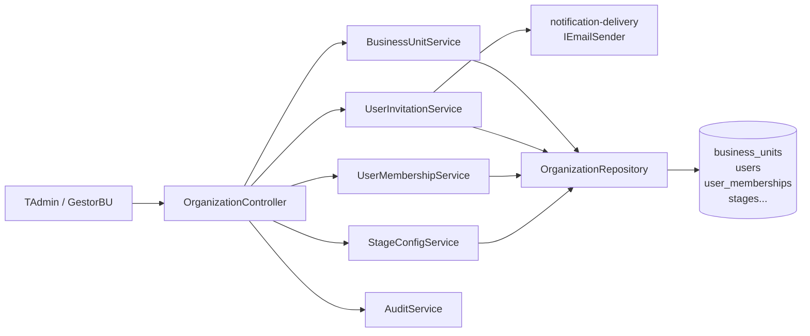
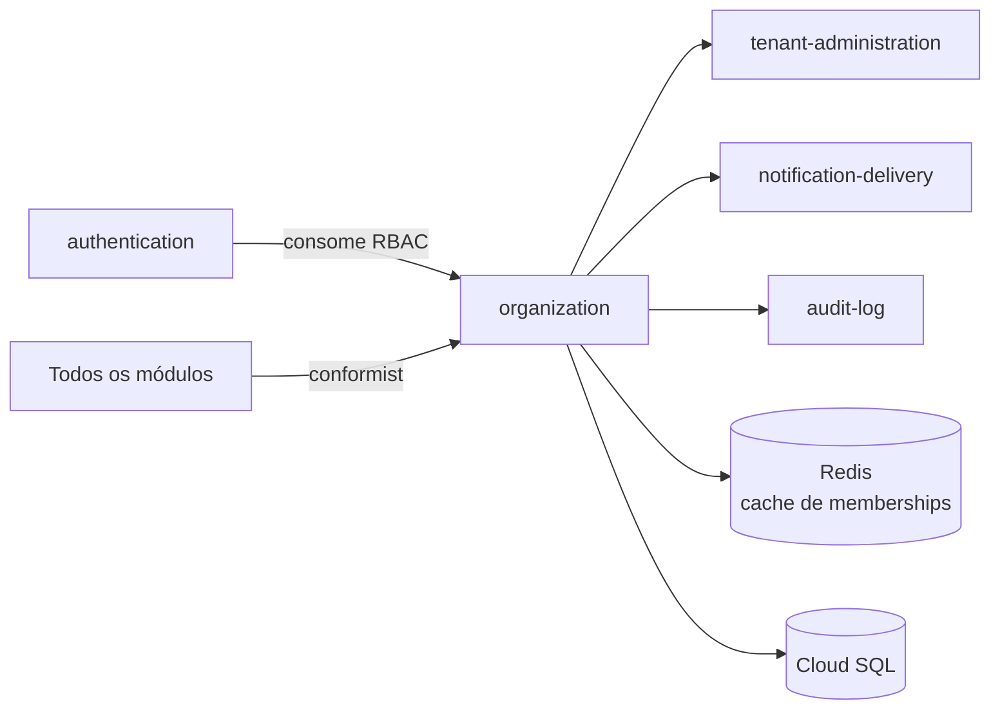

# Module — Organization

**Status:** Rascunho para revisão
**Fase:** Fase 1 MVP

---

## 1. Visão Geral

Módulo responsável pela gestão de Business Units (BUs), usuários, papéis, RBAC, convites e configurações de pipeline por BU (estágios, canais de origem, motivos de perda). É o provedor de contexto organizacional consumido por todos os outros módulos via `tenant_id`, `bu_id`, `user_id` e papéis — padrão Conformist no context map.

---

## 2. Classificação

| Item | Valor |
|---|---|
| Tipo de Módulo | Application Module |
| Deployable Candidato | azim-api |
| Bounded Context Relacionado | Organization Management (BC-08) |
| Subdomínio DDD | Supporting Subdomain |
| Tier / Criticidade | Tier 1 — todos os módulos dependem de BU, user_id e RBAC definidos aqui |
| Status | Rascunho para revisão |

---

## 3. Objetivo

Prover o modelo organizacional do Azim CRM: BUs, usuários por tenant, papéis (TAdmin, GestorBU, Vendedor, Viewer), convites por e-mail e configurações de pipeline por BU. Garantir que usuários desativados não acessem o sistema (RN-013) e que exista sempre ao menos um Tenant Admin ativo (MSG-017).

---

## 4. Responsabilidades

- CRUD de Business Units com restrição de nome único por tenant (MSG-015).
- Convite de usuário por e-mail com token temporário; ativação após aceite.
- Desativação lógica de usuário (soft-delete via `deactivated_at` — RN-013).
- Gestão de UserMemberships: vínculo usuário-BU com papel.
- Configuração de estágios por BU (nome, probabilidade, categoria).
- Configuração de canais de origem e motivos de perda por BU.
- Exportar contexto de RBAC (user_id → papéis por BU) para o módulo authentication via cache.
- Publicar AuditEvent em toda escrita via audit-log.

---

## 5. Fora de Escopo

- Autenticação (pertence ao authentication).
- Provisionamento de tenant (pertence ao tenant-administration).
- Gestão de oportunidades, atividades ou contas (pertence aos respectivos módulos de negócio).
- Permissões por recurso individual (RN-013 define desativação; RBAC granular por recurso é responsabilidade dos módulos consumidores).

---

## 6. Capacidades Atendidas

| Código | Capability | Descrição |
|---|---|---|
| CAP-10 | Gestão de Organização | BUs, usuários, papéis, RBAC, convites |

---

## 7. Bounded Context e Linguagem Ubíqua

| Termo | Definição |
|---|---|
| BusinessUnit (BU) | Unidade de negócio dentro de um tenant; cada BU tem seu próprio pipeline e configurações |
| UserMembership | Vínculo de um usuário a uma BU com papel específico |
| papel | Papel do usuário no sistema: TAdmin, GestorBU, Vendedor, Viewer |
| TAdmin | Tenant Admin — acesso a todas as BUs e configurações do tenant |
| GestorBU | Gestor de uma BU específica — acessa pipeline, metas e equipe da BU |
| Vendedor | Acessa o pipeline da BU; cria e atualiza oportunidades e atividades |
| Viewer | Leitura apenas; sem criação de registros |
| convite | Email de convite com token temporário para ativação de novo usuário |
| desativação lógica | Usuário `active = false`; sem exclusão física (RN-013) |

---

## 8. Componentes Internos Candidatos

| Componente | Tipo | Responsabilidade |
|---|---|---|
| BusinessUnitService | Domain Service | CRUD de BUs com validação de nome único (MSG-015) |
| UserInvitationService | Domain Service | Gera token de convite, envia e-mail via notification-delivery, ativa usuário no aceite |
| UserMembershipService | Domain Service | Gerencia vínculos usuário-BU-papel; valida mínimo de TAdmin (MSG-017) |
| StageConfigService | Domain Service | CRUD de estágios por BU (nome, probabilidade, posição, categoria) |
| PipelineConfigService | Domain Service | CRUD de canais de origem e motivos de perda por BU |
| OrganizationController | API Controller | Endpoints de BU, usuários, papéis, convites e configurações |
| OrganizationRepository | Repository | Escrita em business_units, users, user_memberships, user_invitations, stages, origin_channels, loss_reasons |

---

## 9. APIs Principais

| Método | Endpoint | Finalidade | Consumidores |
|---|---|---|---|
| GET | /v1/business-units | Lista BUs do tenant | azim-web, todos os módulos |
| POST | /v1/business-units | Criar BU | TAdmin |
| PUT | /v1/business-units/{id} | Atualizar BU | TAdmin, GestorBU |
| GET | /v1/users | Lista usuários do tenant | azim-web, TAdmin |
| POST | /v1/users/invite | Convidar usuário por e-mail | TAdmin, GestorBU |
| DELETE | /v1/users/{id} | Desativar usuário (soft-delete) | TAdmin |
| GET | /v1/business-units/{buId}/stages | Lista estágios da BU | opportunity-pipeline, azim-web |
| POST | /v1/business-units/{buId}/stages | Criar estágio | TAdmin, GestorBU |
| GET | /v1/business-units/{buId}/origin-channels | Lista canais de origem | opportunity-pipeline |
| GET | /v1/business-units/{buId}/loss-reasons | Lista motivos de perda | opportunity-pipeline |

---

## 10. Eventos Publicados

| Evento | Quando é publicado | Consumidores |
|---|---|---|
| BUCreated | Após criação de BU | audit-log |
| UserInvited | Após envio de convite | audit-log |
| UserDeactivated | Após desativação de usuário | authentication (invalida cache de memberships), audit-log |
| UserActivated | Após aceite de convite | authentication (carrega memberships), audit-log |

---

## 11. Eventos Consumidos

| Evento | Produtor | Finalidade |
|---|---|---|
| TenantProvisioned | tenant-administration | Criar BU inicial e usuário TAdmin após provisionamento do tenant |

---

## 12. Dados Próprios

| Entidade/Tabela | Tipo | Banco/Persistência | Observações |
|---|---|---|---|
| business_units | Configuração | Cloud SQL / Postgres | UNIQUE(tenant_id, name) — MSG-015 |
| users | Transacional | Cloud SQL / Postgres | PII: email, display_name; soft-delete via deactivated_at (RN-013) |
| user_memberships | Configuração | Cloud SQL / Postgres | Vínculo usuário-BU-papel; UNIQUE(tenant_id, user_id, bu_id) |
| user_invitations | Temporário | Cloud SQL / Postgres | Token com expiração; removível após aceite |
| stages | Configuração | Cloud SQL / Postgres | Por BU; UNIQUE(tenant_id, bu_id, name) |
| origin_channels | Configuração | Cloud SQL / Postgres | Por BU |
| loss_reasons | Configuração | Cloud SQL / Postgres | Por BU |

---

## 13. Integrações

| Sistema/Módulo | Tipo de Integração | Direção | Observações |
|---|---|---|---|
| authentication | Cache (Redis) | Saída | Invalida cache de memberships ao desativar usuário ou mudar papel |
| notification-delivery | Package (IEmailSender) | Saída | Envia e-mail de convite |
| audit-log | Package (AuditService) | Saída | Registra toda escrita em entidade de negócio |
| tenant-administration | Evento (TenantProvisioned) | Entrada | Cria BU inicial após provisionamento |

---

## 14. Dependências

### 14.1 Dependências de Domínio

- tenant-administration: tenant_id deve existir antes de criar BU.
- authentication: contexto de RBAC carregado após validação do token.

### 14.2 Dependências Técnicas

- Cloud SQL / Postgres (tabelas de organização)
- Memorystore / Redis (cache de memberships e papéis)
- notification-delivery (IEmailSender para convites)

### 14.3 Dependências Operacionais

- Configuração de BU inicial pelo PlatOp após provisionamento do tenant
- Template de e-mail de convite

---

## 15. Requisitos Não Funcionais Relevantes

| Categoria | Requisito / Observação |
|---|---|
| Segurança | RBAC: usuário só acessa BUs onde tem membership ativo; RLS por tenant_id |
| Privacidade | users.email e users.display_name são PII; mascarar em logs (LGPD) |
| Disponibilidade | Consulta de BUs e papéis é crítica para todos os módulos — cache em Redis |
| Observabilidade | Log de desativação e convite com correlation_id e tenant_id |

---

## 16. Compliance Aplicável

| Compliance / Norma / Lei | Aplicável? | Motivo | Impacto no Módulo |
|---|---|---|---|
| LGPD | Sim | users: email e display_name são PII; user_invitations contém e-mail | Mascarar email em logs; não exibir dados de usuários desativados em interfaces não autorizadas |
| PCI DSS | Não aplicável | Não processa dados de cartão | — |

---

## 17. Observabilidade

| Item | Recomendação Inicial |
|---|---|
| Logs | Log estruturado: correlation_id, tenant_id, bu_id, user_id, ação; sem email em texto claro |
| Métricas | users_invited_total, users_deactivated_total, bu_created_total |
| Alertas | Alerta se último TAdmin de um tenant for desativado (MSG-017) |
| Auditoria | Toda escrita gera entrada em audit-log |

---

## 18. Diagramas do Módulo

### 18.1 Diagrama de Componentes Internos

### 18.2 Diagrama de Dependências

---

## 19. Riscos

| Código | Risco | Impacto | Mitigação |
|---|---|---|---|
| RISK-ORG-01 | Desativação do último TAdmin (MSG-017) | Tenant sem administrador; bloqueio operacional | Validação antes da desativação; erro explícito MSG-017 |
| RISK-ORG-02 | Cache de memberships desatualizado após mudança de papel | Usuário opera com permissão incorreta | TTL curto + invalidação explícita ao alterar membership |

---

## 20. Pontos a Validar

| Código | Ponto | Impacto | Recomendação |
|---|---|---|---|
| VAL-ORG-01 | Consolidação de Tenancy & Branding com Organization Management (DDD-VAL-04) | Simplificação arquitetural | Avaliar após estabilização da Fase 1 |
| VAL-ORG-02 | Granularidade de RBAC: papel por BU vs papel global no tenant | Define controle de acesso dos módulos consumidores | Confirmar antes da implementação do pipeline |

---

## 21. Backlog Inicial Sugerido

| Tipo | Item | Descrição |
|---|---|---|
| Epic | Gestão de Organização | BUs, usuários, papéis, RBAC, convites, configurações de pipeline |
| Story Técnica | CRUD de BUs com validação de unicidade | POST/PUT/GET /v1/business-units; UNIQUE(tenant_id, name) |
| Story Técnica | Fluxo de convite e ativação de usuário | Gerar token, enviar e-mail, ativar no aceite |
| Story Técnica | Desativação lógica de usuário com validação de mínimo TAdmin | DELETE /v1/users/{id} com guard MSG-017 |
| Story Técnica | Configuração de estágios por BU | CRUD de stages; probabilidade e posição |
| Task | Endpoint GET /v1/business-units/{buId}/origin-channels | Lista canais de origem para o pipeline |
| Task | Endpoint GET /v1/business-units/{buId}/loss-reasons | Lista motivos de perda para o pipeline |

---

## 22. Referências

| Documento | Seção |
|---|---|
| DDD Segmentation | §4.1 BC-08 Organization Management |
| DDD Segmentation | §6 Data Ownership — Organization Management |
| Data Model | §3 Organization Management (BC-08) |
| Context Map | relations.md — Conformist de todos os BCs para Organization |
