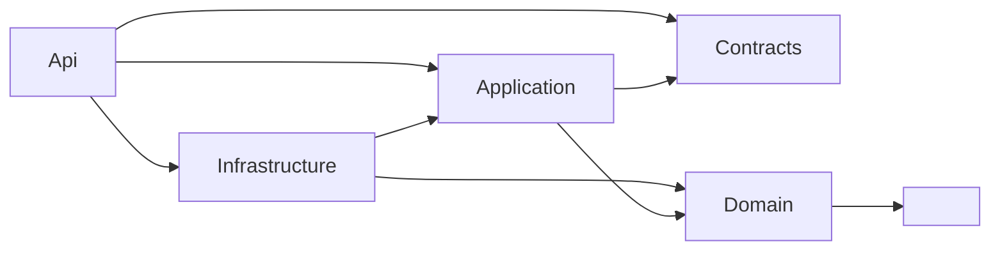
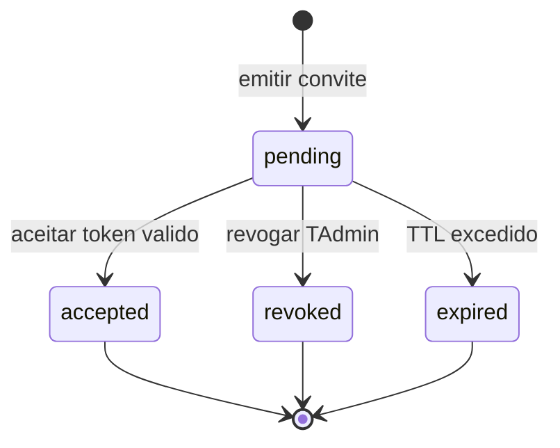
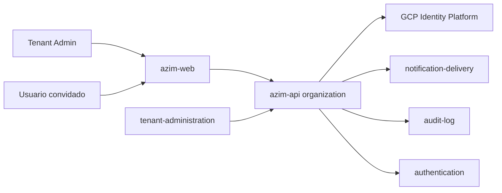
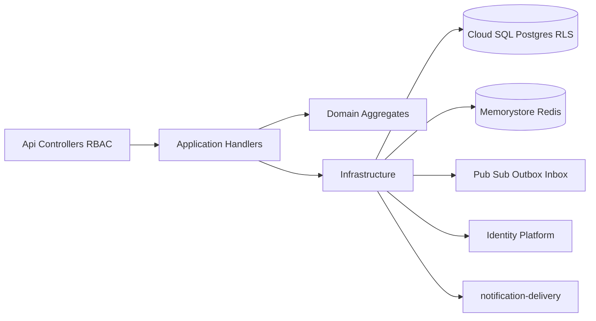
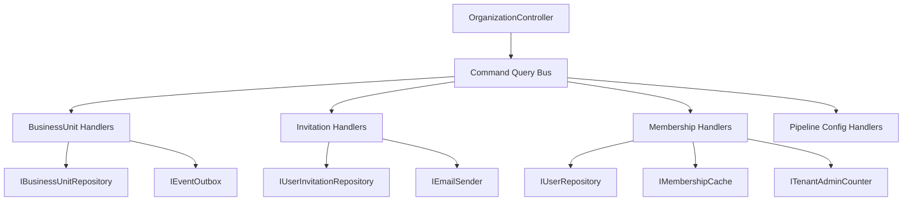
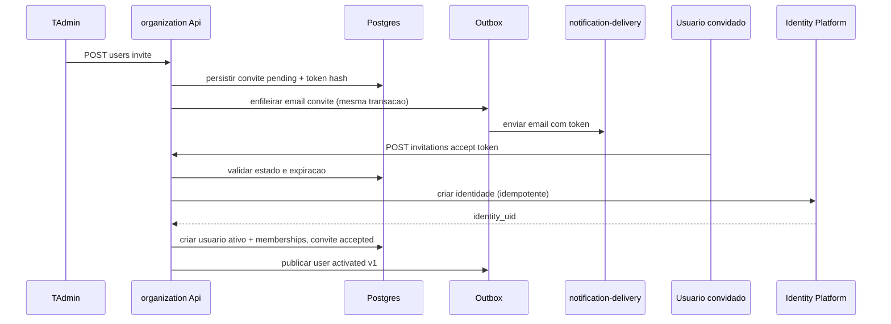
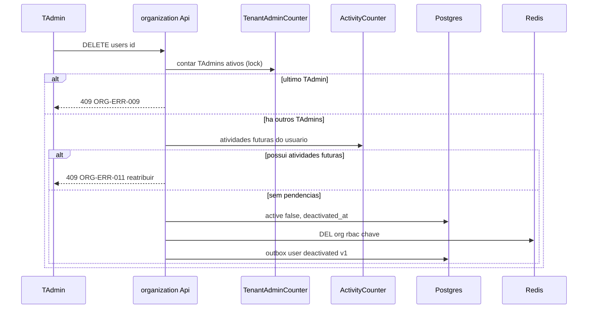

# ORG — Organization Management
**Design Técnico**

- Versão: 0.1.0
- Data: 2026-06-11
- Status: Rascunho para revisão
- Referência base: docs/product/modules/organization/requirements.md v0.1.0
- ADRs aplicáveis: ADR-0001 (Multi-tenancy pooled DB + RLS); ADR-0009 (Propagação de `correlation_id` e `tenant_id` — a ser criado, ref. design tenant-administration)
- Rules aplicáveis: `.forge/rules/architecture/clean-architecture.md`, `.forge/rules/architecture/ddd.md`, `.forge/rules/architecture/api-and-contracts.md`, `.forge/rules/architecture/observability.md`, `.forge/rules/architecture/jwt-permissions.md`, `.forge/rules/domain/audit-immutability.md`, `.forge/rules/conventions/database-naming.md`, `.forge/rules/conventions/language-policy.md`, `.forge/rules/conventions/document-versioning.md`

## Histórico de Versões

| Versão | Data | Status | Descrição da alteração |
|--------|------|--------|------------------------|
| 0.1.0 | 2026-06-11 | Rascunho para revisão | Criação inicial do design a partir do requirements.md v0.1.0, TRD, Data Model, DDD e README do módulo |

## 1. Visão Geral

Este documento especifica **como** o módulo `organization` (BC-08 — *Organization Management*, Supporting Subdomain, Tier 1) realiza os requisitos aprovados em `requirements.md` v0.1.0. O módulo é o provedor do modelo organizacional do Azim CRM: Business Units (BU), usuários do tenant, papéis (RBAC), memberships (vínculo usuário-BU-papel), convites por e-mail e as configurações de pipeline por BU (estágios, canais de origem e motivos de perda).

É um módulo **Tier 1**: todos os demais módulos consomem `tenant_id`, `bu_id`, `user_id` e papéis definidos aqui via padrão **Conformist** no context map. O módulo é a fonte de verdade do controle de acesso baseado em papel por BU (RBAC) e participa da defesa em profundidade do isolamento por tenant (Row-Level Security — RLS).

A **identidade** do usuário (autenticação, credenciais, JWKS, tokens de sessão) pertence ao módulo `authentication` e ao GCP Identity Platform; o `organization` delega a criação da identidade no aceite do convite e armazena apenas o vínculo `identity_uid`. O **provisionamento do tenant** pertence ao módulo `tenant-administration`, que publica `TenantProvisioned`, consumido aqui para criar a BU inicial e o Tenant Admin.

A stack-alvo deriva do TRD: monólito modular .NET 10 (`azim-api`), EF Core sobre Cloud SQL/PostgreSQL, RLS via `SET app.current_tenant`, GCP Identity Platform para identidade, Pub/Sub com Outbox para eventos, Memorystore/Redis para o cache de memberships, Serilog + Cloud Logging para observabilidade.

Rastreabilidade: a seção 1.1 (resumo) e a matriz da seção 13.1 (REQ/RNF/PBT → design e testes) garantem que todo requisito tem contraparte técnica.

### 1.1 Mapeamento de requisitos para a solução (resumo)

| Origem | Elemento de design principal |
|---|---|
| Req 1 Criar BU com nome único | `CreateBusinessUnitCommand` + objeto de valor `BusinessUnitName` + índice `uq_business_units_tenant_id_name` (§4, §5.1, §7) |
| Req 2 Editar/inativar BU preservando histórico | `RenameBusinessUnitCommand`/`DeactivateBusinessUnitCommand` + `ActiveOpportunitiesSpec` (§4.6, §5.1) |
| Req 3 Convidar usuário | `InviteUserCommand` + agregado `UserInvitation` + Outbox de e-mail (§4, §5.1, §6.6) |
| Req 4 Aceitar convite/ativar | `AcceptInvitationCommand` + state machine de convite + delegação ao `authentication` (§4.5, §5.1, §6.4) |
| Req 5 Gerir memberships | `AssignMembershipCommand`/`ChangeMembershipRoleCommand`/`RemoveMembershipCommand` + `MembershipUniquenessSpec` (§4, §5.1) |
| Req 6 Matriz RBAC papel × BU | `RbacAuthorizationPolicy` (deny-by-default) + `IRbacContextProvider` exportado (§4.6, §10) |
| Req 7 Desativar usuário | `DeactivateUserCommand` + soft-delete + `FutureActivitiesSpec` (§4.6, §5.1) |
| Req 8 Garantir ≥1 TAdmin ativo | `LastTenantAdminPolicy` + `ITenantAdminCounter` com lock transacional (§4.6, DD-003) |
| Req 9 Estágios por BU + seed Vellus | Entidade `Stage` no agregado `BusinessUnit` + `StageSeedFactory` + `TerminalStagesPolicy` (§4.2, §4.6, DD-002) |
| Req 10 Canais de origem por BU | Entidade `OriginChannel` + `OriginChannelSeedFactory` (§4.2) |
| Req 11 Motivos de perda por BU | Entidade `LossReason` + `BusinessUnitEnablementSpec` (§4.2, §4.6) |
| Req 12 Provisionar BU/TAdmin inicial | Consumer de `TenantProvisioned` + Inbox idempotente (§6.6, §9) |
| Req 13 Exportar RBAC via cache | `MembershipCacheProjector` (Redis) + invalidação por evento (§6.2, §10, §13) |
| RNF 1 Isolamento por tenant | EF Core global query filter + RLS Postgres (DEC-006) (§14) |
| RNF 2 RBAC em todo endpoint | `RbacAuthorizationPolicy` + testes papel × operação (§10, §13) |
| RNF 3 PII de usuários (LGPD) | Mascaramento de e-mail/`display_name`; token como hash (§10, §12) |
| RNF 4 Auditoria imutável | Eventos consumidos por `audit-log` (append-only) (§9, §11) |
| RNF 5 Cache de memberships | TTL + invalidação explícita + degradação segura (§6.2) |
| RNF 6 Observabilidade | Logs estruturados, métricas, alerta de último TAdmin (§11) |

## 2. Princípios e Decisões Macro

1. **Clean Architecture + DDD tático.** Domínio rico, sem anemia. Dependências: `Api -> Application -> Domain`, `Infrastructure -> Application/Domain`, `Contracts -> ∅`. Validado por `Organization.Architecture.Tests`.
2. **Defesa em profundidade no isolamento (DEC-006, ADR-0001, RNF 1).** Três camadas independentes: EF Core global query filter por `tenant_id`, RLS Postgres via `SET app.current_tenant`, e suíte de testes de isolamento em CI como gate de merge. Falha de uma camada não vaza dados entre tenants.
3. **RBAC deny-by-default (Req 6, RNF 2).** A ausência de papel que conceda a ação resulta em negação. A escrita de configuração do tenant (BU, estágios, canais, motivos, convites, desativação) é restrita a `TAdmin`; o `GestorBU` escreve apenas na sua BU conforme a matriz do FRD §15.
4. **Invariante de Tenant Admin sempre satisfeita (Req 8, MSG-017).** Nenhuma operação de desativação, remoção ou rebaixamento de membership pode deixar o tenant sem ao menos um `TAdmin` ativo. Verificação transacional com lock (DD-003).
5. **Desativação lógica preserva histórico (RN-013, RNF 3.4).** BU e usuário usam soft-delete (`active = false`, `deactivated_at`); nenhuma FK é quebrada e nenhum registro é fisicamente removido.
6. **Configuração de pipeline encapsulada no agregado `BusinessUnit` (DD-007).** `Stage`, `OriginChannel` e `LossReason` são entidades internas ao agregado, pois suas invariantes (exatamente um `won` e um `lost`, mínimo de um motivo de perda) pertencem à consistência da BU.
7. **Convite atômico (Req 3.3, DD-004).** Persistência do convite e enfileiramento do e-mail ocorrem na mesma transação via Outbox; falha de envio não consolida convite inválido nem expõe PII.
8. **Cache de memberships como contrato de saída (Req 13, RNF 5).** O mapa `user_id → papéis por BU` é projetado no Redis, sem PII, com invalidação explícita por evento e TTL curto; indisponibilidade degrada para leitura do banco com deny-by-default.
9. **Auditoria imutável (RNF 4).** Toda escrita publica evento consumido pelo `audit-log` (append-only). O módulo não atualiza nem deleta registros de auditoria.
10. **Tecnologia ancorada.** Toda escolha tecnológica deriva do TRD/DEC/README; divergências locais são registradas como DD-NNN (§17).

## 3. Estrutura da Solução

Projetos (.NET 10), seguindo Clean Architecture:

```text
Organization.Domain          # Agregados, entidades, objetos de valor, eventos, policies, specifications, state machine
Organization.Application     # Commands, Queries, Handlers, ports (interfaces), validadores, projeção de cache
Organization.Infrastructure  # EF Core, repositórios, RLS, Outbox/Inbox Pub/Sub, Redis, adapter de e-mail, clock
Organization.Api             # Controllers REST, autorização RBAC, mapeamento DTO
Organization.Contracts       # DTOs públicos, contratos de evento, schema do contexto RBAC exportado
```

Projetos de teste:

```text
Organization.Domain.Tests          # Invariantes, objetos de valor, state machine, PBTs de domínio
Organization.Application.Tests     # Handlers, policies, idempotência, validações de aplicação
Organization.Infrastructure.Tests  # Repositórios, RLS, Outbox/Inbox, cache (Testcontainers)
Organization.Api.Tests             # Contratos de API, autorização RBAC, isolamento por tenant
Organization.Architecture.Tests    # Regras de dependência entre camadas
```

Regras de dependência (validadas por testes de arquitetura):



O `Domain` não referencia EF Core, GCP SDK, web framework ou mensageria. Recursos externos são expressos por **ports** (interfaces) na `Application` e implementados na `Infrastructure`: `IBusinessUnitRepository`, `IUserRepository`, `IUserInvitationRepository`, `IEmailSender`, `IEventOutbox`, `IInboxStore`, `IMembershipCache`, `IIdentityProvisioner`, `ITenantAdminCounter`, `IClock`, `ITokenHasher`.

## 4. Modelo de Domínio

### 4.1 Aggregates

| Aggregate | Aggregate Root | Fronteira transacional | Invariantes protegidas |
|---|---|---|---|
| `BusinessUnit` | `BusinessUnit` | `business_units` + `stages` + `origin_channels` + `loss_reasons` + `outbox_events` | Nome único por tenant; exatamente um estágio `won` e um `lost`; ao menos um `open`; `position` distintas; nome de estágio único na BU; ao menos um motivo de perda para habilitar |
| `User` | `User` | `users` + `user_memberships` + `outbox_events` | E-mail único por tenant; no máximo um membership por BU; papel pertence à lista canônica; soft-delete preserva histórico |
| `UserInvitation` | `UserInvitation` | `user_invitations` + `outbox_events` | Transições de estado válidas (state machine); token hash; expiração; um destino de e-mail; ao menos uma BU/papel |

> A invariante **"≥1 Tenant Admin ativo"** (Req 8) cruza os agregados `User` e seus memberships e, portanto, é uma regra de consistência do tenant — não cabe dentro de um único agregado. É implementada como **domain policy** coordenada na aplicação com verificação transacional (DD-003).

### 4.2 Entidades

| Entidade | Identidade | Pertence a | Atributos principais |
|---|---|---|---|
| `BusinessUnit` (root) | `BusinessUnitId` (UUID) | — | `name` (objeto de valor), `active`, `createdAt` |
| `Stage` | `StageId` (UUID) | `BusinessUnit` | `name`, `probability` (objeto de valor), `category` (objeto de valor), `position` |
| `OriginChannel` | `OriginChannelId` (UUID) | `BusinessUnit` | `name`, `active` |
| `LossReason` | `LossReasonId` (UUID) | `BusinessUnit` | `name`, `active` |
| `User` (root) | `UserId` (UUID) | — | `email`, `displayName`, `identityUid`, `active`, `deactivatedAt`, `createdAt` |
| `UserMembership` | `UserMembershipId` (UUID) | `User` | `buId`, `role` (objeto de valor) |
| `UserInvitation` (root) | `UserInvitationId` (UUID) | — | `email`, `tokenHash`, `state`, `expiresAt`, `targetMemberships` (BU→papel), `createdAt` |

Agregados expõem comportamento, não setters públicos. Exemplos: `BusinessUnit.Rename(...)`, `BusinessUnit.Deactivate(...)`, `BusinessUnit.AddStage(...)`, `BusinessUnit.ReorderStages(...)`; `User.Activate(...)`, `User.Deactivate(...)`, `User.AssignMembership(...)`, `User.ChangeMembershipRole(...)`, `User.RemoveMembership(...)`; `UserInvitation.Accept(...)`, `UserInvitation.Revoke()`, `UserInvitation.Expire()`. Cada método valida invariantes e enfileira o domain event correspondente.

### 4.3 Objetos de valor

Imutáveis, com igualdade por valor, validados na construção (falha cedo). O termo **objeto de valor** é usado por extenso (nunca "VO").

#### `BusinessUnitName`
- Regra (Req 1.1, 1.3): não vazio; comparação de unicidade insensível a espaços nas extremidades (`Trim`) e à diferença de caixa por tenant; comprimento 1..120.

#### `Role`
- Valores canônicos (Req 5.3, seção 4 do requirements): `TAdmin`, `GestorBU`, `Vendedor`, `Viewer`. Qualquer valor fora do conjunto é rejeitado na construção. `PlatOp` **não** é um `Role` de membership (é papel de plataforma fora do tenant).

#### `StageCategory`
- Valores canônicos (Req 9.1): `open`, `won`, `lost`. Imutável; usado para impor a conservação das categorias terminais (PBT-06).

#### `Probability`
- Inteiro `0..100` (Req 9.1). Validado na construção; sem casas decimais (não é valor monetário; representa percentual). Igualdade por valor.

#### `InvitationToken`
- Representa o segredo do convite. O agregado armazena apenas `tokenHash` (hash do token via `ITokenHasher`); o valor em claro existe apenas no momento da emissão para envio por e-mail e nunca é persistido (RNF 3, DD-009).

### 4.4 Domain Events

Eventos nomeados no passado, enfileirados pelos agregados e publicados via Outbox (§6.6). Cada um gera entrada de auditoria via `audit-log` (RNF 4) e alguns disparam invalidação de cache.

| Domain Event | Origem | Carga (sem PII) | Consumidores |
|---|---|---|---|
| `BusinessUnitCreated` | `BusinessUnit` | `tenantId`, `buId`, `name`* | audit-log |
| `BusinessUnitDeactivated` | `BusinessUnit` | `tenantId`, `buId` | audit-log |
| `UserInvited` | `UserInvitation` | `tenantId`, `invitationId` | audit-log |
| `UserActivated` | `User` | `tenantId`, `userId`, `memberships` | authentication (carrega memberships), audit-log |
| `UserDeactivated` | `User` | `tenantId`, `userId` | authentication (invalida cache), audit-log |
| `MembershipRoleChanged` | `User` | `tenantId`, `userId`, `buId`, `role` | authentication (invalida cache), audit-log |
| `StageConfigured` | `BusinessUnit` | `tenantId`, `buId`, `stageId` | audit-log |

\* O `name` da BU não é PII; e-mail e `display_name` de usuário **nunca** integram a carga de evento (RNF 3.2, RNF 4.3). A correlação `invitationId`/`userId` permite ao `audit-log` registrar o ato sem expor o e-mail.

> **Reconciliação de nomes (DD-005):** o módulo `authentication` consome `user.role_changed` e `user.deactivated` (eventos de integração). O mapeamento domain event → integration event é definido na seção 9: `MembershipRoleChanged → user.role_changed.v1`, `UserDeactivated → user.deactivated.v1`, `UserActivated → user.activated.v1`, `BusinessUnitCreated → bu.created.v1`, `UserInvited → user.invited.v1`.

### 4.5 State Machines

#### Convite (`UserInvitation.state`) — PBT-04



Regras (Req 3, Req 4, PBT-04):
- Apenas transições a partir de `pending` são válidas.
- Qualquer transição a partir de estado terminal (`accepted`, `revoked`, `expired`) é rejeitada.
- O aceite (`pending → accepted`) é **idempotente** quanto ao efeito: reprocessar um convite já `accepted` com o mesmo token não cria usuários nem memberships duplicados (Req 4.4, PBT-03).
- A expiração pode ser avaliada de forma preguiçosa (no aceite, comparando `expiresAt` com `IClock.UtcNow`) e/ou por job de varredura que materializa `expired`.

#### Estado da BU e do usuário

`active` é booleano com transição monotônica no MVP: `true → false` (inativação/desativação). Reativação não está no escopo do MVP (seção 9 do requirements) e não há comando para `false → true` exceto a criação inicial.

### 4.6 Policies / Specifications

| Policy / Specification | Camada | Regra | Mapeia |
|---|---|---|---|
| `BusinessUnitNameUniquenessSpec` | Domain + índice | Par (`tenant_id`, `name` normalizado) único | Req 1.2, 1.3, PBT-07 |
| `ActiveOpportunitiesSpec` | Application (port `IOpportunityCounter`) | Bloqueia inativar BU com oportunidades ativas; retorna contagem | Req 2.3, MSG-016, PBT-05 |
| `MembershipUniquenessSpec` | Domain + índice | No máximo um membership por (`tenant_id`, `user_id`, `bu_id`) | Req 5.1 |
| `RbacAuthorizationPolicy` | Application/Api | Avalia papel × operação × BU; deny-by-default | Req 6, RNF 2 |
| `LastTenantAdminPolicy` | Application + `ITenantAdminCounter` | Impede desativação/remoção/rebaixamento do último TAdmin ativo; atômica | Req 8, MSG-017, PBT-02 |
| `FutureActivitiesSpec` | Application (port `IActivityCounter`) | Alerta e exige reatribuição ao desativar usuário com atividades futuras | Req 7.4, MSG-018 |
| `TerminalStagesPolicy` | Domain | Conserva exatamente um `won`, um `lost` e ao menos um `open` | Req 9.3, 9.6, PBT-06 |
| `StagePositionPolicy` | Domain | `position` distintas e ordem total na BU | Req 9.7, PBT-07 |
| `BusinessUnitEnablementSpec` | Domain | BU só é operável com ≥1 motivo de perda ativo | Req 11.2 |

`RbacAuthorizationPolicy` e `LastTenantAdminPolicy` são detalhadas em §10 e DD-003. As specs com `I*Counter` consultam módulos vizinhos (opportunity-pipeline, activity-management) por **port** in-process (monólito modular), nunca por acesso direto às tabelas de outro BC.

## 5. Application Layer

Padrão: um handler por caso de uso; `Command` para escrita, `Query` para leitura; validação sintática na borda (FluentValidation) e regra de negócio no domínio; MediatR (ou equivalente) para desacoplar chamadores (clean-architecture rule §10). Toda escrita roda dentro de uma transação que inclui o(s) agregado(s) e a tabela `outbox_events` (atomicidade de evento).

### 5.1 Commands

| Command | Ator (RBAC) | Efeito | Mapeia |
|---|---|---|---|
| `CreateBusinessUnitCommand` | TAdmin | Cria BU `active=true`; aplica seeds (estágios, canais, ≥1 motivo de perda); emite `BusinessUnitCreated` | Req 1, Req 9, Req 10, Req 11, Req 12 |
| `RenameBusinessUnitCommand` | TAdmin, GestorBU (própria BU) | Atualiza `name` respeitando unicidade | Req 2.1, 2.6 |
| `DeactivateBusinessUnitCommand` | TAdmin | Soft-delete da BU se não houver oportunidades ativas | Req 2.2, 2.3, MSG-016 |
| `InviteUserCommand` | TAdmin | Cria convite `pending` + token hash + Outbox de e-mail; valida e-mail não pertence a usuário ativo | Req 3 |
| `RevokeInvitationCommand` | TAdmin | `pending → revoked`; invalida token | Req 3.7 |
| `AcceptInvitationCommand` | InvitedUser (token) | Valida token/estado; cria/ativa usuário; cria memberships; `pending → accepted`; emite `UserActivated` | Req 4 |
| `AssignMembershipCommand` | TAdmin | Cria membership (papel por BU) respeitando unicidade | Req 5.1, 5.2, 5.3 |
| `ChangeMembershipRoleCommand` | TAdmin | Altera papel; guarda `LastTenantAdminPolicy` em rebaixamento de TAdmin | Req 5, Req 8.2 |
| `RemoveMembershipCommand` | TAdmin | Remove membership; guarda `LastTenantAdminPolicy` | Req 5.6, Req 8.2 |
| `DeactivateUserCommand` | TAdmin | Soft-delete do usuário; guarda `LastTenantAdminPolicy` e `FutureActivitiesSpec`; emite `UserDeactivated` | Req 7, Req 8.1, MSG-017, MSG-018 |
| `ConfigureStageCommand` | TAdmin, GestorBU (própria BU) | Adiciona/renomeia/reordena/ajusta probabilidade; aplica `TerminalStagesPolicy` e `StagePositionPolicy` | Req 9 |
| `ConfigureOriginChannelCommand` | TAdmin | Adiciona/renomeia/desativa canal de origem | Req 10 |
| `ConfigureLossReasonCommand` | TAdmin | Adiciona/renomeia/desativa motivo de perda; mantém ≥1 ativo para habilitar BU | Req 11 |
| `ProvisionInitialOrganizationCommand` | sistema (consumer) | Idempotente; cria BU inicial + TAdmin a partir de `TenantProvisioned` | Req 12 |

### 5.2 Queries

| Query | Ator | Retorno | Mapeia |
|---|---|---|---|
| `ListBusinessUnitsQuery` | qualquer papel ativo | BUs ativas do tenant | Req 6.1 |
| `ListUsersQuery` | TAdmin | usuários do tenant (PII restrita por RBAC) | Req 7, RNF 3.3 |
| `ListMembershipsQuery` | TAdmin | papéis por BU de um usuário | Req 5 |
| `ListStagesQuery` | consumidores (opportunity-pipeline) | estágios da BU ordenados por `position` | Req 9, Req 10 |
| `ListOriginChannelsQuery` | consumidores | canais ativos da BU | Req 10.4 |
| `ListLossReasonsQuery` | consumidores | motivos de perda ativos da BU | Req 11.4 |
| `GetRbacContextQuery` | authentication | mapa `user_id → papéis por BU` (sem PII) | Req 13 |

### 5.3 Handlers

Cada `Command`/`Query` tem um handler dedicado que: (a) resolve o agregado via repositório; (b) delega a regra ao domínio; (c) aplica policies de aplicação (RBAC, último TAdmin); (d) persiste em transação com Outbox; (e) projeta/invalida o cache de memberships quando aplicável. Handlers **orquestram**, não contêm regra de negócio (clean-architecture rule §9).

### 5.4 Pipeline Behaviors

| Behavior | Responsabilidade | Mapeia |
|---|---|---|
| `TenantContextBehavior` | Garante `tenant_id` do contexto autenticado e executa `SET app.current_tenant` na conexão | RNF 1, DEC-006 |
| `RbacAuthorizationBehavior` | Avalia `RbacAuthorizationPolicy` antes do handler; deny-by-default | Req 6, RNF 2 |
| `ValidationBehavior` | FluentValidation dos comandos na borda | RNF 2.2 |
| `TransactionBehavior` | Abre transação, comita agregado + Outbox atomicamente | Req 3.3, RNF 4 |
| `IdempotencyBehavior` | Para consumers e aceite de convite: checa Inbox/chave natural antes de aplicar | Req 4.4, Req 12.3, PBT-03 |
| `LoggingBehavior` | Log estruturado com `correlation_id`, `tenant_id`, sem PII | RNF 6.1 |

### 5.5 Validações de Aplicação

- **Sintáticas (borda):** campos obrigatórios, formato de e-mail, `probability ∈ [0,100]`, `category ∈ {open,won,lost}`, `role` canônico, `position` inteiro.
- **Autorização:** `RbacAuthorizationBehavior` antes de qualquer efeito; negação não altera estado (RNF 2.2).
- **Regra de negócio:** delegada ao domínio (unicidade, terminais de estágio, habilitação de BU) e às policies de aplicação que cruzam agregados (último TAdmin, oportunidades/atividades vinculadas).
- **Idempotência:** aceite de convite por `tokenHash`/estado; consumo de `TenantProvisioned` por `tenant_id` (chave natural) + Inbox.

## 6. Infrastructure Layer

### 6.1 Persistência

- **EF Core** sobre **Cloud SQL/PostgreSQL**. Mapeamento via `IEntityTypeConfiguration<T>`; nomes físicos em `snake_case` (database-naming rule). `tenant_id` nunca é parâmetro explícito de repositório de domínio — é transparente via `TenantContextBehavior` + global query filter.
- **Global query filter** por `tenant_id` em todas as entidades (camada 1 do isolamento).
- **RLS Postgres** via `SET app.current_tenant = '<tenant_id>'` no início da conexão; policies `USING (tenant_id = current_setting('app.current_tenant')::uuid)` (camada 2). Schema detalhado em §7.
- Repositórios expressam intenção de domínio: `IBusinessUnitRepository.GetByName(...)`, `IUserRepository.GetActiveTenantAdmins(...)`, `IUserInvitationRepository.GetByTokenHash(...)`.

> **DD-001 — Precedência de DEC-006/ADR-0001 sobre a rule de database-naming.** A rule `database-naming.md` §Multi-tenancy afirma "isolamento via coluna, não via RLS". Essa frase está **desatualizada** frente a DEC-006/ADR-0001 e ao design já aprovado de `tenant-administration` e `authentication`, que adotam RLS como camada independente. Este design segue DEC-006 (RLS + EF filter + testes em CI). Recomenda-se corrigir a rule; conflito registrado como risco RISK-ORG-03.

### 6.2 Cache

- **Memorystore/Redis** (TLS) para o contexto RBAC. Chave: `org:rbac:{tenant_id}:{user_id}` contendo o `MembershipSet` (`bu_id → role`), `cached_at`, sem PII (Req 13.3, RNF 3).
- **TTL configurável** (referência 5 min, alinhado ao `authentication`), limitando a janela máxima de inconsistência (RNF 5.2).
- **Invalidação explícita** (`DEL`) em `AssignMembership`, `ChangeMembershipRole`, `RemoveMembership` e `DeactivateUser` do usuário afetado (Req 13.2, RNF 5.1). A invalidação é disparada localmente após commit e reforçada pelos eventos `user.role_changed.v1`/`user.deactivated.v1` consumidos pelo `authentication`.
- **Degradação segura (RNF 5.3, Req 13.5):** indisponibilidade do Redis recompõe o contexto a partir do banco com deny-by-default; nunca concede acesso por falha de cache.
- O contexto exportado reflete apenas `users.active = true` e `business_units.active = true` (Req 13.4).

### 6.3 Mensageria

- **Pub/Sub** com padrão **Outbox** (publicação) e **Inbox** (consumo idempotente). Tópicos de integração em §9.
- Eventos publicados: `bu.created.v1`, `user.invited.v1`, `user.activated.v1`, `user.deactivated.v1`, `user.role_changed.v1`.
- Eventos consumidos: `tenant.provisioned.v1` (de `tenant-administration`).

### 6.4 Integrações Externas

| Integração | Port | Adapter | Resiliência |
|---|---|---|---|
| Criação de identidade no aceite | `IIdentityProvisioner` | `IdentityPlatformProvisioner` (GCP Identity Platform) | timeout; retry com backoff; idempotente por `email`/`identity_uid`; circuit breaker |
| Envio de e-mail de convite | `IEmailSender` | adapter `notification-delivery` (in-process package) | enfileirado via Outbox; falha não consolida convite (Req 3.3) |
| Contagem de oportunidades ativas | `IOpportunityCounter` | port in-process p/ opportunity-pipeline | timeout; falha bloqueia inativação (fail-closed) |
| Contagem de atividades futuras | `IActivityCounter` | port in-process p/ activity-management | timeout; degradação alerta o operador |

Toda chamada externa tem timeout, retry com backoff e circuit breaker quando cruza processo; chamadas in-process (monólito modular) usam port com fronteira de BC explícita.

### 6.5 Idempotência

- **Aceite de convite (Req 4.4, PBT-03):** chave natural `tokenHash` + estado `accepted`; reprocessar retorna o mesmo estado sem duplicar `users`/`user_memberships`. A criação de identidade no `authentication` é idempotente por `email`.
- **Provisionamento inicial (Req 12.3, PBT-03):** Inbox registra `message_id`/`tenant_id` de `tenant.provisioned.v1`; reprocessar não duplica BU/usuário/membership (chave natural `UNIQUE(tenant_id, name)` e `UNIQUE(tenant_id, email)` reforçam no banco).

### 6.6 Outbox / Inbox

- **Outbox:** tabela `outbox_events` (`id`, `tenant_id`, `event_type`, `payload`, `correlation_id`, `causation_id`, `occurred_at`, `published_at`). Escrita na mesma transação do agregado; worker publica para Pub/Sub e marca `published_at`. Garante atomicidade evento↔estado (Req 3.3, RNF 4).
- **Inbox:** tabela `inbox_messages` (`message_id`, `tenant_id`, `event_type`, `processed_at`) para deduplicação no consumo de `tenant.provisioned.v1` (Req 12.3).

## 7. Schema / Modelo de Persistência

Postgres, `snake_case`. Todas as tabelas carregam `tenant_id UUID NOT NULL` e RLS habilitada (DEC-006, RNF 1). Origem: data-model.md §BC-08.

```sql
-- BUs (MSG-015)
business_units (
  id            UUID PRIMARY KEY DEFAULT gen_random_uuid(),
  tenant_id     UUID NOT NULL,
  name          TEXT NOT NULL,
  active        BOOLEAN NOT NULL DEFAULT TRUE,
  created_at    TIMESTAMPTZ NOT NULL DEFAULT now(),
  updated_at    TIMESTAMPTZ,
  CONSTRAINT uq_business_units_tenant_id_name UNIQUE (tenant_id, name)
)

-- usuários (PII: email, display_name; soft-delete RN-013)
users (
  id              UUID PRIMARY KEY DEFAULT gen_random_uuid(),
  tenant_id       UUID NOT NULL,
  email           TEXT NOT NULL,
  display_name    TEXT NOT NULL,
  identity_uid    TEXT NOT NULL,                    -- UID do GCP Identity Platform
  active          BOOLEAN NOT NULL DEFAULT TRUE,
  created_at      TIMESTAMPTZ NOT NULL DEFAULT now(),
  deactivated_at  TIMESTAMPTZ,
  CONSTRAINT uq_users_tenant_id_email UNIQUE (tenant_id, email)
)

-- memberships usuário-BU-papel
user_memberships (
  id          UUID PRIMARY KEY DEFAULT gen_random_uuid(),
  tenant_id   UUID NOT NULL,
  user_id     UUID NOT NULL REFERENCES users(id),
  bu_id       UUID NOT NULL REFERENCES business_units(id),
  role        VARCHAR(30) NOT NULL,                 -- TAdmin, GestorBU, Vendedor, Viewer
  created_at  TIMESTAMPTZ NOT NULL DEFAULT now(),
  CONSTRAINT uq_user_memberships_tenant_user_bu UNIQUE (tenant_id, user_id, bu_id),
  CONSTRAINT chk_user_memberships_role CHECK (role IN ('TAdmin','GestorBU','Vendedor','Viewer'))
)

-- convites temporários (token armazenado como hash; PII: email)
user_invitations (
  id             UUID PRIMARY KEY DEFAULT gen_random_uuid(),
  tenant_id      UUID NOT NULL,
  email          TEXT NOT NULL,
  token_hash     TEXT NOT NULL,
  state          VARCHAR(10) NOT NULL DEFAULT 'pending',
  target_memberships JSONB NOT NULL,                -- [{ bu_id, role }]
  expires_at     TIMESTAMPTZ NOT NULL,
  created_at     TIMESTAMPTZ NOT NULL DEFAULT now(),
  accepted_at    TIMESTAMPTZ,
  CONSTRAINT chk_user_invitations_state CHECK (state IN ('pending','accepted','revoked','expired'))
)

-- estágios por BU (DEC-001)
stages (
  id          UUID PRIMARY KEY DEFAULT gen_random_uuid(),
  tenant_id   UUID NOT NULL,
  bu_id       UUID NOT NULL REFERENCES business_units(id),
  name        TEXT NOT NULL,
  probability SMALLINT NOT NULL DEFAULT 0 CHECK (probability BETWEEN 0 AND 100),
  category    VARCHAR(10) NOT NULL CHECK (category IN ('open','won','lost')),
  position    SMALLINT NOT NULL,
  created_at  TIMESTAMPTZ NOT NULL DEFAULT now(),
  CONSTRAINT uq_stages_tenant_bu_name UNIQUE (tenant_id, bu_id, name),
  CONSTRAINT uq_stages_tenant_bu_position UNIQUE (tenant_id, bu_id, position)
)

origin_channels (
  id          UUID PRIMARY KEY DEFAULT gen_random_uuid(),
  tenant_id   UUID NOT NULL,
  bu_id       UUID NOT NULL REFERENCES business_units(id),
  name        TEXT NOT NULL,
  active      BOOLEAN NOT NULL DEFAULT TRUE,
  created_at  TIMESTAMPTZ NOT NULL DEFAULT now(),
  CONSTRAINT uq_origin_channels_tenant_bu_name UNIQUE (tenant_id, bu_id, name)
)

loss_reasons (
  id          UUID PRIMARY KEY DEFAULT gen_random_uuid(),
  tenant_id   UUID NOT NULL,
  bu_id       UUID NOT NULL REFERENCES business_units(id),
  name        TEXT NOT NULL,
  active      BOOLEAN NOT NULL DEFAULT TRUE,
  created_at  TIMESTAMPTZ NOT NULL DEFAULT now(),
  CONSTRAINT uq_loss_reasons_tenant_bu_name UNIQUE (tenant_id, bu_id, name)
)
```

**Índices adicionais:** `idx_user_memberships_tenant_user` (`tenant_id`, `user_id`) para o RBAC context; `idx_user_invitations_tenant_token_hash` (`tenant_id`, `token_hash`); `idx_stages_tenant_bu_position` coberto pela unique. **Auditoria:** `created_at`/`updated_at`/`deactivated_at` explícitos; auditoria imutável delegada ao `audit-log` (RNF 4). **Migrations:** EF Core, `{timestamp}_{PascalCaseDescription}`, nomes físicos `snake_case`. **Retenção:** convites terminais podem ser purgados após janela configurável; usuários/BU desativados nunca são deletados (RN-013). **Conservação dos terminais (PBT-06):** garantida no domínio (banco não consegue impor "exatamente um won"); a `TerminalStagesPolicy` valida em toda escrita de estágio.

## 8. API Contracts

REST sob `/api/v1`, JSON, autenticação por JWT (módulo `authentication`), autorização RBAC deny-by-default. Erros no formato Problem Details com `code` do catálogo (§12). Filtros/paginação conforme TRD §API (camelCase nos query params).

| Método | Path | RBAC | Request (resumo) | Sucesso | Erros (catálogo) |
|---|---|---|---|---|---|
| POST | `/api/v1/business-units` | TAdmin | `{ name }` | 201 `{ id, name, active }` | ORG-ERR-001, ORG-ERR-010 |
| GET | `/api/v1/business-units` | papel ativo | — (paginado) | 200 lista | ORG-ERR-010 |
| PUT | `/api/v1/business-units/{id}` | TAdmin, GestorBU | `{ name }` | 200 | ORG-ERR-001, ORG-ERR-008, ORG-ERR-010 |
| DELETE | `/api/v1/business-units/{id}` | TAdmin | — (inativação lógica) | 204 | ORG-ERR-002, ORG-ERR-010 |
| POST | `/api/v1/users/invite` | TAdmin | `{ email, memberships:[{ buId, role }] }` | 202 `{ invitationId }` | ORG-ERR-003, ORG-ERR-007, ORG-ERR-010 |
| POST | `/api/v1/invitations/{id}/revoke` | TAdmin | — | 204 | ORG-ERR-006, ORG-ERR-010 |
| POST | `/api/v1/invitations/accept` | público (token) | `{ token, displayName }` | 200 `{ userId }` | ORG-ERR-004, ORG-ERR-005 |
| GET | `/api/v1/users` | TAdmin | — (paginado) | 200 lista | ORG-ERR-010 |
| DELETE | `/api/v1/users/{id}` | TAdmin | — (soft-delete) | 204 | ORG-ERR-009, ORG-ERR-011, ORG-ERR-010 |
| GET | `/api/v1/users/{id}/memberships` | TAdmin | — | 200 `[{ buId, role }]` | ORG-ERR-010 |
| POST | `/api/v1/users/{id}/memberships` | TAdmin | `{ buId, role }` | 201 | ORG-ERR-007, ORG-ERR-012, ORG-ERR-010 |
| PUT | `/api/v1/users/{id}/memberships/{buId}` | TAdmin | `{ role }` | 200 | ORG-ERR-009, ORG-ERR-007, ORG-ERR-010 |
| DELETE | `/api/v1/users/{id}/memberships/{buId}` | TAdmin | — | 204 | ORG-ERR-009, ORG-ERR-010 |
| GET | `/api/v1/business-units/{buId}/stages` | consumidor | — | 200 lista ordenada | ORG-ERR-010 |
| POST | `/api/v1/business-units/{buId}/stages` | TAdmin, GestorBU | `{ name, probability, category, position }` | 201 | ORG-ERR-013, ORG-ERR-014, ORG-ERR-010 |
| PUT | `/api/v1/business-units/{buId}/stages/{id}` | TAdmin, GestorBU | `{ name?, probability?, position? }` | 200 | ORG-ERR-013, ORG-ERR-014, ORG-ERR-010 |
| DELETE | `/api/v1/business-units/{buId}/stages/{id}` | TAdmin, GestorBU | — | 204 | ORG-ERR-015, ORG-ERR-010 |
| GET/POST/PUT | `/api/v1/business-units/{buId}/origin-channels` | consumidor / TAdmin | `{ name }` | 200/201 | ORG-ERR-016, ORG-ERR-010 |
| GET/POST/PUT | `/api/v1/business-units/{buId}/loss-reasons` | consumidor / TAdmin | `{ name }` | 200/201 | ORG-ERR-016, ORG-ERR-017, ORG-ERR-010 |

Notas: o aceite de convite é o único endpoint não autenticado por JWT — autenticado pelo token de convite. `POST /users/invite` e `accept` são idempotentes pelos mecanismos da §6.5. Paginação por `?page&pageSize`; ordenação de estágios sempre por `position`.

## 9. AsyncAPI / Eventos Publicados e Consumidos

Pub/Sub. Eventos de integração versionados (`*.v1`); envelope com `tenant_id`, `correlation_id`, `causation_id`, `message_id`, `occurred_at`. Diferenciação: eventos de **domínio** são internos (§4.4); eventos de **integração** abaixo são o contrato público.

### Publicados

| Evento (integração) | Domain event origem | Tópico (conceitual) | Carga (sem PII) | Consumidores |
|---|---|---|---|---|
| `bu.created.v1` | `BusinessUnitCreated` | `azim.organization.bu` | `tenantId`, `buId`, `name` | audit-log |
| `user.invited.v1` | `UserInvited` | `azim.organization.user` | `tenantId`, `invitationId` | audit-log |
| `user.activated.v1` | `UserActivated` | `azim.organization.user` | `tenantId`, `userId`, `memberships` | authentication, audit-log |
| `user.deactivated.v1` | `UserDeactivated` | `azim.organization.user` | `tenantId`, `userId` | authentication, audit-log |
| `user.role_changed.v1` | `MembershipRoleChanged` | `azim.organization.user` | `tenantId`, `userId`, `buId`, `role` | authentication, audit-log |

### Consumidos

| Evento | Produtor | Finalidade | Idempotência |
|---|---|---|---|
| `tenant.provisioned.v1` | tenant-administration | Criar BU inicial + TAdmin com seeds (Req 12) | Inbox por `message_id`/`tenant_id` + chaves naturais |

Regras: deduplicação por Inbox; o consumer valida que `tenant_id` do evento corresponde ao contexto antes de agir; compatibilidade retroativa preservada por versionamento; **sem DLQ própria no MVP** — falha de invalidação de cache no `authentication` degrada para o TTL curto (consistente com §6.2). A carga de `user.activated.v1` e `user.role_changed.v1` carrega apenas identificadores e papéis (nunca e-mail/`display_name`), respeitando RNF 3.

## 10. Segurança

| Mecanismo | Implementação | Mapeia |
|---|---|---|
| Autenticação | JWT validado pelo módulo `authentication` (JWKS local); aceite de convite autenticado por token de convite | Req 4, RNF 2 |
| Autorização (RBAC) | `RbacAuthorizationPolicy` papel × operação × BU; deny-by-default; matriz FRD §15 | Req 6, RNF 2 |
| Matriz de escrita de configuração | BU, estágios, canais, motivos, convites, desativação restritos a TAdmin; GestorBU escreve só na sua BU | Req 2.6, 6.2, 9.5 |
| Isolamento multi-tenant | EF Core global query filter + RLS `SET app.current_tenant` + testes CI (3 camadas, DEC-006) | RNF 1, PBT-01 |
| Defesa em profundidade | RBAC na aplicação confirmado por RLS no banco | RNF 2.3 |
| Proteção contra enumeração de e-mail | Resposta de convite/aceite não revela existência de conta; erros genéricos (ORG-ERR-003/004) | RNF 3.2 |
| PII e LGPD by design | `email`/`display_name` mascarados em logs; nunca em eventos; token persistido como hash | RNF 3, DD-009 |
| Token de convite | Gerado com entropia criptográfica; persistido como hash; expiração `RN-030` (ref. 72h); revogável | Req 3.2, 3.7 |
| Proteção contra replay/reuso | Aceite idempotente por `tokenHash`+estado; revogação invalida token | Req 4.4, PBT-03 |
| Criptografia em trânsito | TLS para Postgres, Redis (AUTH) e Pub/Sub | RNF 1, RNF 5 |
| Criptografia em repouso | Cloud SQL/Memorystore gerenciados pelo GCP; cache sem PII | RNF 3 |
| Secrets | Secret Manager (hash pepper do token, credenciais) | RNF 3 |
| Menor privilégio | PlatOp bloqueado de dados comerciais do tenant (papel de plataforma, não membership) | seção 3 requirements |
| Trilha de auditoria | Toda escrita gera evento append-only via `audit-log` | RNF 4 |

### 10.1 Matriz RBAC (papel × operação de configuração)

| Operação | TAdmin | GestorBU | Vendedor | Viewer |
|---|---|---|---|---|
| Criar/inativar BU | Sim | Não | Não | Não |
| Renomear BU | Sim | Própria BU | Não | Não |
| Convidar/desativar usuário | Sim | Não | Não | Não |
| Gerir memberships | Sim | Não | Não | Não |
| Configurar estágios/canais/motivos | Sim | Própria BU | Não | Não |
| Ler contexto organizacional | Sim | Própria BU | Própria BU | Escopo designado |

Deny-by-default: qualquer combinação não listada como permitida é negada sem efeito colateral (RNF 2.2). Edição de snapshot de comissão é bloqueada para todos (Req 6.5; regra reforçada no módulo consumidor).

## 11. Observabilidade

| Item | Implementação | Mapeia |
|---|---|---|
| Logs estruturados | Serilog + Cloud Logging; campos `correlation_id`, `tenant_id`, `bu_id`/`user_id` quando aplicável; **sem** e-mail/`display_name` em claro (mascarados) | RNF 6.1, RNF 3.1 |
| Métricas | `users_invited_total`, `users_deactivated_total`, `bu_created_total`, `membership_cache_hit_ratio`, `tenant_rls_violation_count` | RNF 6.2, RNF 1 |
| Traces | Cloud Trace com propagação de `correlation_id` (ADR-0009) | RNF 6.1 |
| Alertas | Alerta operacional quando o último TAdmin de um tenant é alvo de desativação; alerta imediato se `tenant_rls_violation_count > 0` | RNF 6.3, MSG-017 |
| Health checks | `GET /health/live` (independente de dependências externas); `GET /health/ready` (Postgres, Redis) | RNF 5 |
| Auditoria operacional | Eventos de negócio (`bu.created`, `user.invited`, `user.deactivated`, `user.role_changed`) via `audit-log` | RNF 4 |

## 12. Catálogo de Erros

| Código | Mensagem | HTTP | Quando ocorre | Ação recomendada |
|---|---|---|---|---|
| `ORG-ERR-001` | Já existe uma BU com este nome. Escolha um nome diferente. (MSG-015) | 409 | Nome de BU duplicado no tenant | Usar nome distinto |
| `ORG-ERR-002` | Esta BU possui {N} oportunidades ativas. Encerre ou realoque-as antes de inativar. (MSG-016) | 409 | Inativar BU com oportunidades ativas | Realocar/encerrar oportunidades |
| `ORG-ERR-003` | Não foi possível concluir o convite. | 409 | E-mail já corresponde a usuário ativo (sem revelar conta) | Verificar usuários existentes |
| `ORG-ERR-004` | Convite inválido ou expirado. | 400 | Token inválido/expirado/revogado no aceite | Solicitar novo convite |
| `ORG-ERR-005` | Convite já utilizado. | 409 | Aceite de convite já `accepted` (tratado idempotente; erro só em conflito de dados) | Acessar com a conta ativada |
| `ORG-ERR-006` | Convite não pode ser revogado neste estado. | 409 | Revogar convite não `pending` | Nenhuma |
| `ORG-ERR-007` | Papel inválido para o vínculo. | 400 | `role` fora da lista canônica | Usar TAdmin/GestorBU/Vendedor/Viewer |
| `ORG-ERR-008` | Apenas o administrador pode realizar esta ação na BU. | 403 | RBAC negado para edição/inativação | Solicitar a um TAdmin |
| `ORG-ERR-009` | O tenant precisa ter ao menos um administrador ativo. Promova outro usuário antes de remover este. (MSG-017) | 409 | Desativar/remover/rebaixar último TAdmin | Promover outro TAdmin |
| `ORG-ERR-010` | Você não tem permissão para esta ação. | 403 | Deny-by-default RBAC | Verificar papel/escopo |
| `ORG-ERR-011` | Este usuário possui {N} atividades futuras atribuídas. Reatribua-as antes de desativar. (MSG-018) | 409 | Desativar usuário com atividades futuras | Reatribuir atividades |
| `ORG-ERR-012` | Usuário já possui vínculo nesta BU. | 409 | Membership duplicado (unicidade) | Editar o vínculo existente |
| `ORG-ERR-013` | Já existe um estágio com este nome nesta BU. | 409 | Nome de estágio duplicado na BU | Usar nome distinto |
| `ORG-ERR-014` | Posição de estágio inválida ou duplicada. | 400 | `position` repetida na BU | Ajustar ordenação |
| `ORG-ERR-015` | Não é possível remover o último estágio terminal (ganho/perdido). | 409 | Remoção viola `TerminalStagesPolicy` | Manter um won e um lost |
| `ORG-ERR-016` | Item de configuração não encontrado. | 404 | Canal/motivo inexistente na BU | Verificar identificador |
| `ORG-ERR-017` | A BU precisa de ao menos um motivo de perda ativo. | 409 | Desativar o último motivo de perda | Manter ≥1 motivo ativo |

Todo endpoint da §8 referencia erros deste catálogo. Mensagens não expõem PII; erros de autorização e de convite não permitem enumeração de contas. Códigos estáveis e rastreáveis.

## 13. Testes

| Camada / Tipo | Foco | Mapeia |
|---|---|---|
| `Domain.Tests` | Invariantes de agregados; objetos de valor (`BusinessUnitName`, `Role`, `StageCategory`, `Probability`); state machine de convite; `TerminalStagesPolicy`; `StagePositionPolicy` | Req 1,5,9,11; PBT-04,06,07 |
| `Application.Tests` | Handlers; `LastTenantAdminPolicy`; idempotência de aceite/provisionamento; RBAC deny-by-default; invalidação de cache | Req 4,5,6,7,8,12,13; PBT-02,03 |
| `Infrastructure.Tests` | Repositórios; RLS e global filter (isolamento); Outbox/Inbox; cache Redis (Testcontainers) | RNF 1,4,5; PBT-01 |
| `Api.Tests` | Contratos REST; autorização papel × operação (permissão e negação); isolamento entre tenants | RNF 2; Req 6 |
| `Architecture.Tests` | Regras de dependência entre camadas | seção 2,3 |
| Testes de contrato | Eventos `*.v1` (schema) consumidos por authentication/audit-log | §9 |
| PBTs | Geradores conforme §7 do requirements (ver matriz abaixo) | PBT-01..07 |

### 13.1 Matriz de rastreabilidade REQ/RNF/PBT → design → teste

| Requisito | Elemento de design | Teste |
|---|---|---|
| Req 1 | `CreateBusinessUnitCommand`, `BusinessUnitName`, índice único | Domain + Api |
| Req 2 | `DeactivateBusinessUnitCommand`, `ActiveOpportunitiesSpec` | Application + Api |
| Req 3 | `InviteUserCommand`, Outbox e-mail, token hash | Application + Infra |
| Req 4 | `AcceptInvitationCommand`, state machine, idempotência | Domain + Application |
| Req 5 | Commands de membership, `MembershipUniquenessSpec` | Domain + Application |
| Req 6 | `RbacAuthorizationPolicy`, `IRbacContextProvider` | Api + Application |
| Req 7 | `DeactivateUserCommand`, soft-delete, `FutureActivitiesSpec` | Application + Infra |
| Req 8 | `LastTenantAdminPolicy` (lock transacional) | Application (PBT-02) |
| Req 9 | `Stage`, `StageSeedFactory`, `TerminalStagesPolicy`, `StagePositionPolicy` | Domain (PBT-06,07) |
| Req 10 | `OriginChannel`, `OriginChannelSeedFactory` | Domain + Api |
| Req 11 | `LossReason`, `BusinessUnitEnablementSpec` | Domain + Api |
| Req 12 | Consumer `tenant.provisioned.v1`, Inbox | Application + Infra (PBT-03) |
| Req 13 | `MembershipCacheProjector`, invalidação, degradação segura | Infra + Application |
| RNF 1 | global filter + RLS + testes CI | Infra (PBT-01) |
| RNF 2 | `RbacAuthorizationBehavior` | Api |
| RNF 3 | mascaramento, token hash, sem PII em evento | Application + Infra |
| RNF 4 | Outbox → audit-log append-only | Infra + contrato |
| RNF 5 | TTL + invalidação + degradação | Infra |
| RNF 6 | logs/métricas/alertas | Infra + observabilidade |

**PBTs (geradores):** PBT-01 gera N tenants × M registros e afirma que toda query no contexto de um `tenant_id` retorna só daquele tenant. PBT-02 gera sequências de desativação/remoção/rebaixamento e afirma `count(TAdmin ativo) ≥ 1`. PBT-03 reaplica o mesmo evento/token e compara estado final. PBT-04 gera sequências de transição de convite. PBT-06 gera operações de estágio e afirma exatamente um `won`, um `lost`, ≥1 `open`. PBT-07 gera estágios e afirma unicidade de (`tenant_id`,`bu_id`,`name`) e `position` como ordem total.

## 14. Multi-tenancy

| Aspecto | Decisão |
|---|---|
| Modelo de isolamento | Pooled DB + RLS (DEC-006, ADR-0001) |
| Coluna de tenant | `tenant_id UUID NOT NULL` em todas as tabelas |
| Camada 1 | EF Core global query filter por `tenant_id` |
| Camada 2 | RLS Postgres `USING (tenant_id = current_setting('app.current_tenant')::uuid)` |
| Camada 3 | Suíte de testes de isolamento em CI como gate (KPI-06; zero falhas) |
| Segregação de cache | Chave `org:rbac:{tenant_id}:{user_id}`; nenhuma entrada compartilhada |
| Segregação de eventos | Envelope com `tenant_id`; consumer valida antes de agir |
| Risco de vazamento | Severidade 1; `tenant_rls_violation_count` alerta imediato |
| Auditoria por tenant | `tenant_id` em toda entrada de `audit-log` |

## 15. Performance e Escalabilidade

| Item | Decisão |
|---|---|
| Caminho crítico | `GetRbacContextQuery` (lido por todos os módulos a cada requisição) servido por cache Redis (RNF 5) |
| Índices críticos | `idx_user_memberships_tenant_user`; uniques de BU/estágios; `idx_user_invitations_tenant_token_hash` |
| Cache | Memorystore/Redis, TTL ~5 min, invalidação explícita |
| Paginação | Listas de usuários/BUs paginadas (`page`/`pageSize`) desde o MVP |
| Limites de payload | `target_memberships` limitado ao número de BUs do tenant |
| Concorrência | `LastTenantAdminPolicy` usa lock/serialização na contagem de TAdmin para evitar corrida de desativação simultânea (DD-003) |
| Timeouts/retries | Chamadas a `IIdentityProvisioner` com timeout, retry e circuit breaker |
| Scaling | `azim-api` stateless; escala horizontal; estado em Cloud SQL/Redis |
| Backpressure | Publicação via Outbox desacopla escrita de publicação Pub/Sub |

## 16. Diagramas

### 16.1 C4 Level 1 - System Context



Contexto: o módulo `organization` (dentro de `azim-api`) atende administradores e usuários convidados via `azim-web`, delega identidade ao Identity Platform, envia convites por `notification-delivery`, registra auditoria no `audit-log`, exporta RBAC ao `authentication` e recebe provisionamento de `tenant-administration`.

### 16.2 C4 Level 2 - Container



Containers internos do módulo seguindo Clean Architecture; Infrastructure concentra os adapters de Postgres, Redis, Pub/Sub, Identity Platform e e-mail.

### 16.3 C4 Level 3 - Component



Componentes da camada de aplicação e seus ports; a invalidação de cache e a contagem de TAdmin são portas explícitas usadas pelos handlers de membership.

### 16.4 Sequence Diagrams

#### Convite e aceite (Req 3, Req 4)



#### Desativação com guarda de último TAdmin (Req 7, Req 8)



### 16.5 State Diagrams

A máquina de estados do convite está na §4.5. Não há outra state machine não trivial (BU/usuário usam transição booleana monotônica `active`).

## 17. Decisões Inline

### DD-001 - RLS como camada de isolamento apesar da rule de database-naming

**Contexto:** `database-naming.md` §Multi-tenancy diz "isolamento via coluna, não via RLS"; TRD/DEC-006/ADR-0001 e os designs aprovados de `tenant-administration` e `authentication` adotam RLS.

**Decisão:** Adotar RLS Postgres como camada independente, somada ao EF global query filter e testes em CI.

**Justificativa:** DEC-006/ADR-0001 são fonte arquitetural vigente; a frase da rule está desatualizada e diverge dos designs já aprovados.

**Alternativas:** Apenas filtro de coluna (rejeitado: remove a defesa em profundidade exigida por RNF 1/NFR-SEG-01).

**Impacto:** Recomenda-se corrigir a rule (RISK-ORG-03). Sem impacto em compatibilidade.

### DD-002 - Seed de estágios fixo derivado do processo da Vellus

**Contexto:** Req 9.2 exige seed pronto; o DDD do subdomínio lista os estágios e probabilidades da Vellus.

**Decisão:** `StageSeedFactory` cria: Lead (10, open, 1), Prospecção (25, open, 2), Diagnóstico (50, open, 3), Proposta Enviada (60, open, 4), Negociação (75, open, 5), Fechamento Provável (90, open, 6), Ganho (100, won, 7), Perdido (0, lost, 8).

**Justificativa:** Atende 9.2/9.3 (≥1 open, exatamente um won e um lost) e é editável pelo TAdmin após a criação.

**Alternativas:** Seed configurável por template (fora do escopo do MVP).

**Impacto:** Conformidade direta com PBT-06/PBT-07 no estado inicial.

### DD-003 - Invariante de último TAdmin verificada na aplicação com lock

**Contexto:** A regra "≥1 TAdmin ativo" (Req 8) cruza o agregado `User` e seus memberships; não cabe num único agregado.

**Decisão:** `LastTenantAdminPolicy` na aplicação, usando `ITenantAdminCounter` com leitura serializável/lock dentro da transação da operação.

**Justificativa:** Evita corrida entre duas desativações simultâneas que, isoladas, pareceriam seguras (PBT-02). Atomicidade: operação bloqueada não altera estado (Req 8.4).

**Alternativas:** Constraint de banco (rejeitado: não expressa "ao menos um por tenant" de forma simples e portável); verificação sem lock (rejeitado: janela de corrida).

**Impacto:** Pequeno custo de contenção em operações de TAdmin (raras); segurança da invariante garantida.

### DD-004 - Convite atômico via Outbox de e-mail

**Contexto:** Req 3.3 exige atomicidade entre persistência do convite e enfileiramento do envio.

**Decisão:** Persistir convite e registro Outbox de e-mail na mesma transação; worker entrega via `notification-delivery`.

**Justificativa:** Falha de envio não consolida convite inválido; não há dupla escrita inconsistente.

**Alternativas:** Envio síncrono inline (rejeitado: falha de SMTP abortaria o convite ou criaria estado parcial).

**Impacto:** Latência de envio assíncrona; convite existe imediatamente em `pending`.

### DD-005 - Reconciliação de nomes de evento com authentication

**Contexto:** `authentication` consome `user.role_changed` e `user.deactivated`; o README do `organization` nomeia `UserDeactivated`/`UserActivated`.

**Decisão:** Domain events em PascalCase (interno) mapeados para eventos de integração `*.v1` em dot.case (§9); publicar `user.role_changed.v1`, `user.deactivated.v1`, `user.activated.v1`, `bu.created.v1`, `user.invited.v1`.

**Justificativa:** Honra o contrato já assumido pelo `authentication` sem renomear o domínio.

**Alternativas:** Renomear consumo no authentication (rejeitado: design já aprovado).

**Impacto:** Mapeamento explícito documentado; testes de contrato cobrem o schema.

### DD-006 - Stage/OriginChannel/LossReason como entidades internas de BusinessUnit

**Contexto:** As invariantes de pipeline (terminais, habilitação) pertencem à consistência da BU.

**Decisão:** Modelar `Stage`, `OriginChannel`, `LossReason` como entidades internas do agregado `BusinessUnit`, com fronteira transacional compartilhada.

**Justificativa:** A `TerminalStagesPolicy` e o `BusinessUnitEnablementSpec` exigem visão consistente do conjunto na mesma transação.

**Alternativas:** Agregados próprios (rejeitado: invariantes inter-itens exigiriam coordenação transacional entre agregados).

**Impacto:** Escritas de estágio carregam a BU; aceitável dado o tamanho dos conjuntos.

### DD-007 - Token de convite persistido como hash

**Contexto:** O token concede ativação; é segredo e o e-mail é PII (RNF 3).

**Decisão:** Persistir apenas `token_hash` (hash com pepper do Secret Manager); valor em claro só no envio.

**Justificativa:** Vazamento do banco não expõe tokens utilizáveis; alinhado a LGPD by design.

**Alternativas:** Token em claro no banco (rejeitado: risco de segurança).

**Impacto:** Aceite compara hash; sem reversibilidade do token.

## 18. Riscos

| Código | Risco | Impacto | Mitigação |
|---|---|---|---|
| RISK-ORG-01 | Desativação do último TAdmin (MSG-017) | Tenant sem administrador | `LastTenantAdminPolicy` + alerta (DD-003, RNF 6.3) |
| RISK-ORG-02 | Cache de memberships desatualizado | Usuário opera com permissão incorreta | TTL curto + invalidação explícita + degradação segura (RNF 5) |
| RISK-ORG-03 | Conflito da rule database-naming com DEC-006 (RLS) | Ambiguidade de implementação | DD-001; recomendar correção da rule |
| RISK-ORG-04 | Corrida entre aceite de convite e revogação | Estado inconsistente do convite | State machine + transação; estado terminal rejeita transição (PBT-04) |
| RISK-ORG-05 | Falha do Identity Platform no aceite | Convite aceito sem identidade | Retry idempotente + circuit breaker; aceite não conclui sem `identity_uid` |

## 19. Definition of Done

- [ ] Cinco projetos de produção e cinco de teste criados conforme §3; `Architecture.Tests` valida dependências.
- [ ] Agregados `BusinessUnit`, `User`, `UserInvitation` com invariantes e objetos de valor implementados (§4).
- [ ] Commands/Queries/Handlers e pipeline behaviors da §5 implementados.
- [ ] Schema e migrations `snake_case` aplicados (§7); RLS habilitada e testada.
- [ ] Endpoints da §8 com RBAC deny-by-default e catálogo de erros §12.
- [ ] Eventos `*.v1` publicados via Outbox e `tenant.provisioned.v1` consumido via Inbox idempotente (§9).
- [ ] Cache de memberships com invalidação e degradação segura (§6.2).
- [ ] PBT-01..07 implementados e verdes; testes de isolamento como gate de CI.
- [ ] Logs sem PII, métricas e alertas da §11 ativos.
- [ ] Matriz de rastreabilidade §13.1 sem requisito órfão.
- [ ] README do módulo sincronizado (status/versão do design, DDs, ADRs).

## 20. Referências

| Documento | Seção |
|---|---|
| requirements.md (organization) | v0.1.0 (Req 1..13, RNF 1..6, PBT-01..07) |
| README do módulo | docs/product/modules/organization/README.md |
| TRD | §4 (DEC-001, DEC-006, DEC-007), §RBAC/RLS, §eventos, §persistência |
| Data Model | §BC-08 Organization Management |
| FRD | §15 Matriz de Permissões; MSG-015..018; FRD-org-01/02 |
| NFRD | NFR-SEG-01, NFR-SEG-03, NFR-AUD, NFR-OBS-01 |
| DDD subdomínio | docs/product/ddd/subdomains/supporting/organization-management/README.md |
| Designs irmãos | tenant-administration/design.md, authentication/design.md (contrato de cache/eventos) |
| Rules | clean-architecture, ddd, api-and-contracts, observability, jwt-permissions, audit-immutability, database-naming, document-versioning |
