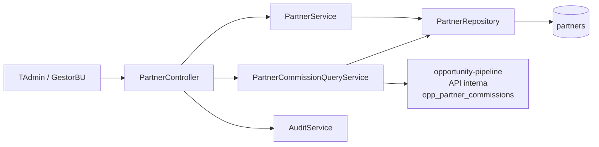
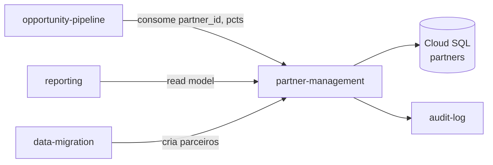

# Module — Partner Management

**Status:** Rascunho para revisão
**Fase:** Fase 1 MVP

---

## 1. Visão Geral

Módulo responsável pela gestão de parceiros comissionados. Mantém o cadastro de parceiros com percentuais de comissão default por componente (setup e recorrente). Serve como upstream do Opportunity Pipeline para vinculação de parceiro e cálculo de comissão. No MVP, parceiros não possuem login na plataforma (RN-021).

---

## 2. Classificação

| Item | Valor |
|---|---|
| Tipo de Módulo | Application Module |
| Deployable Candidato | azim-api |
| Bounded Context Relacionado | Partner Management (BC-03) |
| Subdomínio DDD | Supporting Subdomain |
| Tier / Criticidade | Tier 2 — suporte ao pipeline; parceiro é pré-requisito para comissão nativa |
| Status | Rascunho para revisão |

---

## 3. Objetivo

Prover o cadastro de parceiros com seus percentuais de comissão default por componente. Permitir que o pipeline vincule um parceiro a uma oportunidade, herde os percentuais default e calcule a comissão de forma imutável no fechamento (snapshot). Expor visão de comissão projetada e consolidada por parceiro.

---

## 4. Responsabilidades

- CRUD de parceiros com tipo, percentuais default (pct_setup, pct_recorrente) e status ativo/inativo.
- Expor dados de parceiro (partner_id, pct_setup, pct_recorrente) para o pipeline na vinculação.
- Expor relatório de comissão consolidada por parceiro (parceiro × oportunidades ganhas × comissão calculada).
- Garantir que parceiro desativado não seja vinculado a novas oportunidades.
- Publicar AuditEvent em toda escrita via audit-log.

---

## 5. Fora de Escopo

- Cálculo e snapshot de comissão por oportunidade (pertence ao opportunity-pipeline — RN-026, RN-007).
- Login de parceiro na plataforma (RN-021 — fora do MVP).
- Portal do parceiro ou autoatendimento (fora do MVP).
- Pagamento de comissão (fora do escopo do sistema).

---

## 6. Capacidades Atendidas

| Código | Capability | Descrição |
|---|---|---|
| CAP-05 | Gestão de Parceiros | CRUD de parceiros; visão de comissão projetada e consolidada |

---

## 7. Bounded Context e Linguagem Ubíqua

| Termo | Definição |
|---|---|
| Partner | Empresa ou pessoa que indica clientes e recebe comissão por vendas fechadas |
| pct_setup | Percentual de comissão sobre o valor de setup do negócio (default por parceiro) |
| pct_recorrente | Percentual de comissão sobre o valor mensal × meses comissionados (default por parceiro) |
| CommissionDefaults | Objeto de valor com pct_setup e pct_recorrente padrão do parceiro; herdado pela oportunidade na vinculação |
| comissão projetada | Soma de comissões calculadas em oportunidades abertas vinculadas ao parceiro |
| comissão consolidada | Soma de comissões em snapshots imutáveis de oportunidades ganhas |
| RN-021 | Parceiro não possui login na plataforma no MVP |

---

## 8. Componentes Internos Candidatos

| Componente | Tipo | Responsabilidade |
|---|---|---|
| PartnerService | Domain Service | CRUD de parceiros; validação de status ativo |
| PartnerCommissionQueryService | Application Service | Compõe relatório de comissão projetada e consolidada |
| PartnerRepository | Repository | Escrita e leitura em partners |
| PartnerController | API Controller | Endpoints de parceiros e relatório de comissão |

---

## 9. APIs Principais

| Método | Endpoint | Finalidade | Consumidores |
|---|---|---|---|
| GET | /v1/partners | Lista parceiros ativos do tenant | azim-web, opportunity-pipeline |
| POST | /v1/partners | Criar parceiro | TAdmin, GestorBU |
| PUT | /v1/partners/{id} | Atualizar parceiro | TAdmin, GestorBU |
| GET | /v1/partners/{id} | Detalhes do parceiro com comissão projetada/consolidada | azim-web |
| GET | /v1/partners/{id}/commissions | Relatório de comissões do parceiro | TAdmin, GestorBU |

---

## 10. Eventos Publicados

| Evento | Quando é publicado | Consumidores |
|---|---|---|
| PartnerCreated | Após criação de parceiro | audit-log |

---

## 11. Eventos Consumidos

Este módulo não consome eventos diretamente.

---

## 12. Dados Próprios

| Entidade/Tabela | Tipo | Banco/Persistência | Observações |
|---|---|---|---|
| partners | Transacional | Cloud SQL / Postgres | pct_setup, pct_recorrente em NUMERIC(5,2); soft-delete via active=false |

---

## 13. Integrações

| Sistema/Módulo | Tipo de Integração | Direção | Observações |
|---|---|---|---|
| opportunity-pipeline | API HTTP | Entrada | Pipeline consome partner_id, pct_setup e pct_recorrente ao vincular parceiro |
| reporting | Read Model (query) | Entrada | Relatório de comissões lê partners + opportunity_partner_commissions |
| data-migration | API HTTP | Entrada | Import transacional cria parceiros via API interna |
| audit-log | Package (AuditService) | Saída | Toda escrita gera AuditEvent |

---

## 14. Dependências

### 14.1 Dependências de Domínio

- organization: tenant_id para isolamento por tenant.

### 14.2 Dependências Técnicas

- Cloud SQL / Postgres (tabela partners)

### 14.3 Dependências Operacionais

- Nenhuma dependência operacional específica além do banco.

---

## 15. Requisitos Não Funcionais Relevantes

| Categoria | Requisito / Observação |
|---|---|
| Segurança | Somente TAdmin e GestorBU podem criar e alterar parceiros |
| Auditabilidade | Toda escrita em partners deve gerar AuditEvent |

---

## 16. Compliance Aplicável

| Compliance / Norma / Lei | Aplicável? | Motivo | Impacto no Módulo |
|---|---|---|---|
| LGPD | Marginal | partner.name pode ser nome de pessoa física (parceiro individual) | Avaliar: se partner.name for PII, aplicar mascaramento e política de retenção |
| PCI DSS | Não aplicável | Não processa dados de cartão | — |

---

## 17. Observabilidade

| Item | Recomendação Inicial |
|---|---|
| Logs | Log estruturado: correlation_id, tenant_id, partner_id, ação |
| Métricas | partners_created_total, partners_deactivated_total |
| Auditoria | Toda escrita gera entrada em audit-log |

---

## 18. Diagramas do Módulo

### 18.1 Diagrama de Componentes Internos

### 18.2 Diagrama de Dependências

---

## 19. Riscos

| Código | Risco | Impacto | Mitigação |
|---|---|---|---|
| RISK-PARTNER-01 | Parceiro desativado vinculado a nova oportunidade | Comissão calculada para parceiro sem contrato ativo | Validação no PartnerService: bloquear vinculação de parceiro inactive |
| RISK-PARTNER-02 | partner.name como PII sem tratamento LGPD | Risco regulatório se parceiro for pessoa física | Confirmar se PJ ou PF e aplicar tratamento adequado |

---

## 20. Pontos a Validar

| Código | Ponto | Impacto | Recomendação |
|---|---|---|---|
| VAL-PARTNER-01 | partner.name pode ser PII se parceiro for pessoa física | Define obrigações LGPD sobre este módulo | Confirmar com produto e jurídico |
| VAL-PARTNER-02 | Portal do parceiro ou acesso externo (fora do MVP — RN-021) | Define fronteira de escopo futuro | Registrar como requisito de Fase 2 |

---

## 21. Backlog Inicial Sugerido

| Tipo | Item | Descrição |
|---|---|---|
| Epic | Gestão de Parceiros e Comissão Projetada | CRUD de parceiros com percentuais e relatório de comissão |
| Story Técnica | CRUD de parceiros com validação de status | POST/PUT/GET /v1/partners; validar active antes de vincular |
| Story Técnica | Relatório de comissão projetada e consolidada | GET /v1/partners/{id}/commissions compondo pipeline data |
| Task | Endpoint GET /v1/partners (lista para pipeline) | Retornar id, name, pct_setup, pct_recorrente dos ativos |

---

## 22. Referências

| Documento | Seção |
|---|---|
| DDD Segmentation | §4.1 BC-03 Partner Management |
| DDD Segmentation | §6 Data Ownership — Partner Management |
| Data Model | §3 Partner Management (BC-03) |
| Context Map | relations.md — Opportunity Pipeline → Partner Management |
