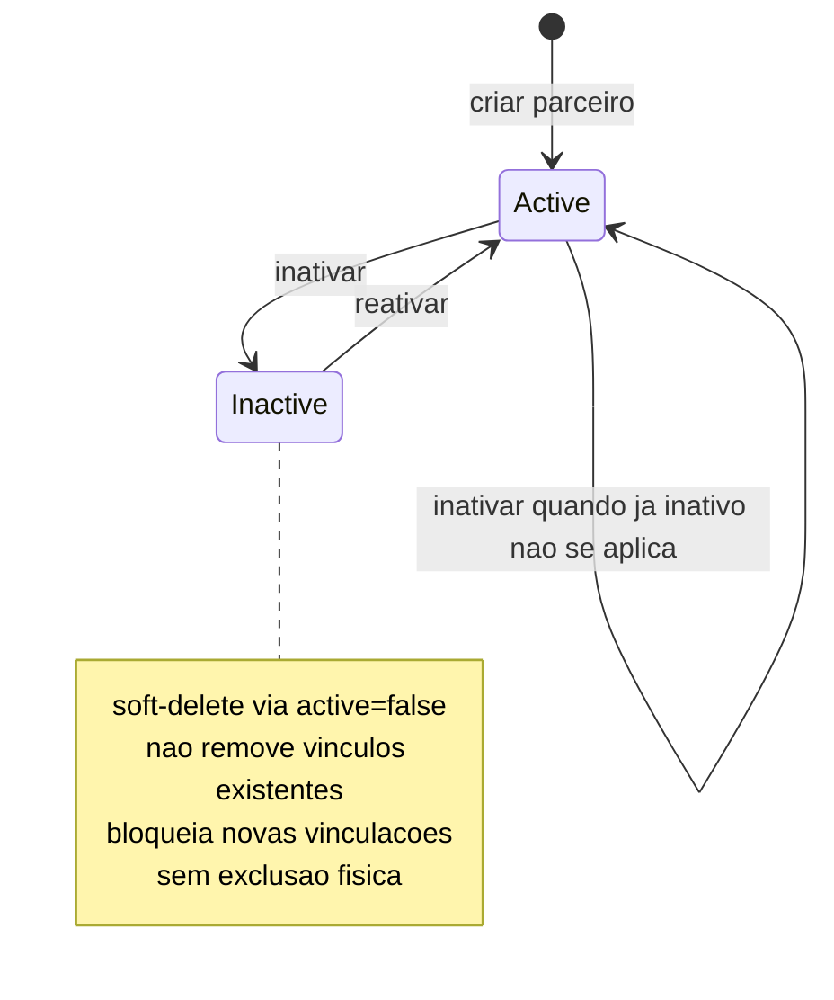
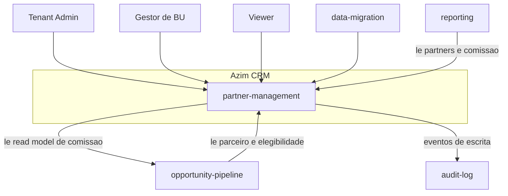
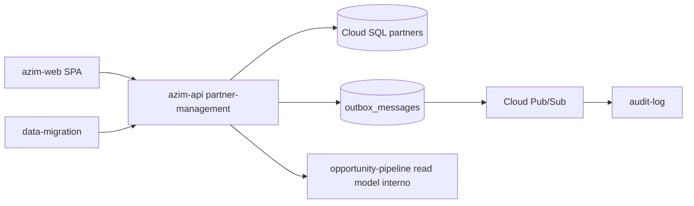
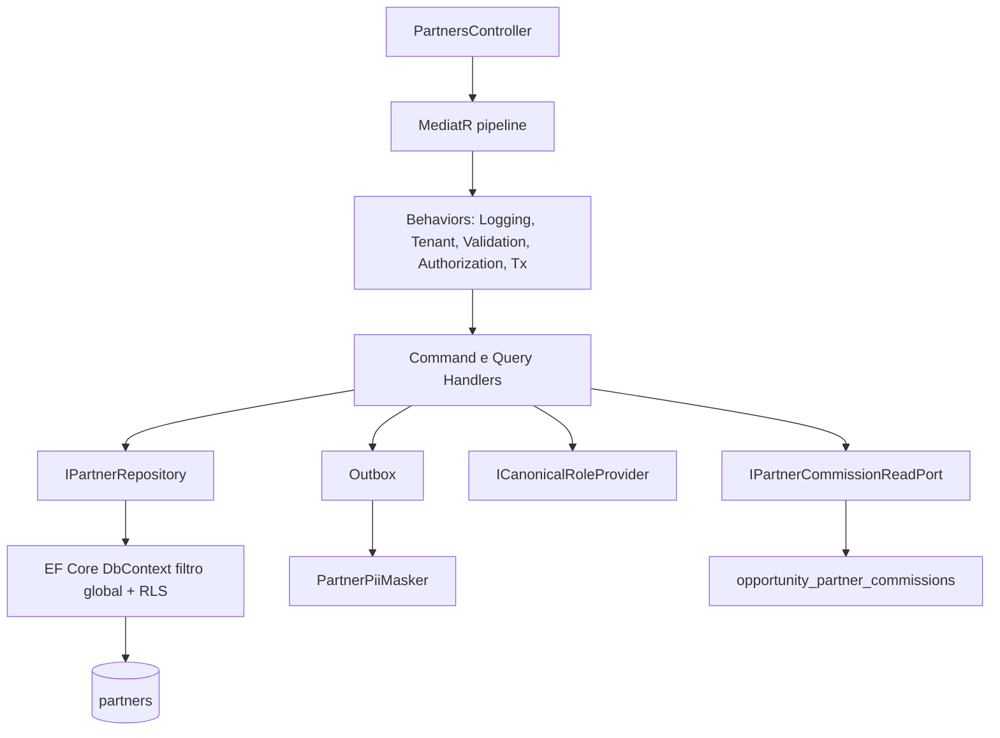
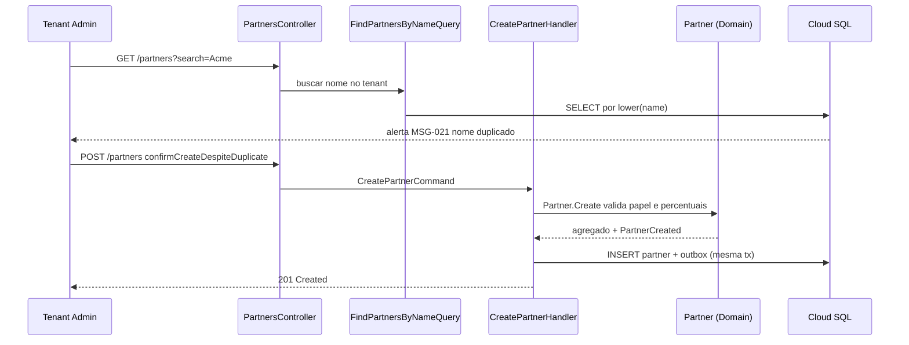
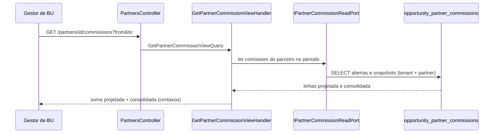
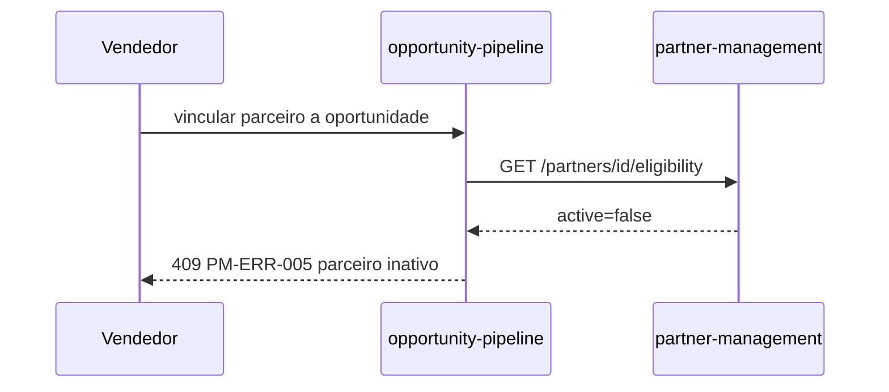

# PM — Partner Management (Gestão de Parceiros Comissionados)
**Design Técnico**

- Versão: 0.1.0
- Data: 2026-06-11
- Status: Rascunho para revisão
- Referência base: docs/product/modules/partner-management/requirements.md v1.0.0
- ADRs aplicáveis: ADR-0001 (isolamento multi-tenant em defesa em profundidade); ADR-0002 (snapshot imutável de comissão — pertence ao opportunity-pipeline, consumido aqui); ADR-0003 (retenção de logs/auditoria — sugerido, RNF 3)
- Rules aplicáveis: `.forge/rules/architecture/clean-architecture.md`, `.forge/rules/architecture/api-and-contracts.md`, `.forge/rules/architecture/observability.md`, `.forge/rules/architecture/security-and-compliance.md`, `.forge/rules/architecture/ddd.md`, `.forge/rules/conventions/database-naming.md`, `.forge/rules/domain/audit-immutability.md`, `.forge/rules/domain/money-as-cents.md`, `.forge/rules/domain/nbr-5891-rounding.md`

## Histórico de Versões

| Versão | Data | Status | Descrição da alteração |
|--------|------|--------|------------------------|
| 0.1.0 | 2026-06-11 | Rascunho para revisão | Criação inicial do design técnico derivado do requirements.md v1.0.0 |

## 1. Visão Geral

Este documento especifica o **como** do módulo **partner-management** (BC-03, Subdomínio de Suporte, deployable `azim-api`), derivado do `requirements.md` v1.0.0 aprovado para revisão.

O módulo gere os **parceiros comissionados** do tenant: cadastro com nome, papel tipado (`partner_type`) e percentuais padrão de comissão por componente do contrato (`pct_setup`, `pct_recorrente`). É o **upstream** do `opportunity-pipeline`, que consome `partner_id` e os percentuais padrão ao vincular um parceiro a uma oportunidade.

Entrega cinco capacidades técnicas centrais:

1. **CRUD de parceiros** com papel tipado canônico e percentuais padrão (Req 1, Req 2, Req 5, Req 6).
2. **Inativação/reativação lógica** (_soft-delete_ via `active`), idempotente, sem exclusão física (Req 3, PBT-02).
3. **Listagem de parceiros ativos** para seleção/vinculação consumida pelo pipeline, e exposição de status para **bloquear vínculo de parceiro inativo** (Req 4, Req 8).
4. **Visão de comissão do parceiro** (projetada × consolidada) e **relatório por período**, **consumindo o _read model_** `opportunity_partner_commissions` do pipeline via porta de leitura — **este módulo nunca recalcula nem persiste comissão** (Req 9, Req 10, PBT-01, PBT-05).
5. **Marcação de pendência de triagem** de percentuais pós-importação (Req 11).

Tudo sob isolamento multi-tenant em profundidade (RNF 1, PBT-04 — ADR-0001), auditoria append-only de toda escrita (RNF 2), e tratamento de PII conservador para `partner.name`/contato (RNF 4). No MVP, o parceiro **não possui credencial de acesso** à plataforma (Req 12, RN-021, DEC-012): é uma entidade de dados gerida pelo tenant.

O módulo é organizado em Clean Architecture (.NET, 5 projetos), com DDD tático no agregado `Partner`. Persistência em Cloud SQL/PostgreSQL (tabela `partners`); eventos de auditoria publicados via Outbox + Cloud Pub/Sub para o `audit-log`.

### 1.1 Rastreabilidade requisito → design (mapa-mestre)

| Requisito | Elementos de design |
|-----------|---------------------|
| Req 1 — Cadastrar parceiro | `CreatePartnerCommand`/Handler, objetos de valor `PartnerName`/`PartnerRole`/`CommissionDefaults`, evento `PartnerCreated`, alerta de nome duplicado (`FindPartnersByNameQuery`, MSG-021), erros PM-ERR-001/002/003 (§4, §5.1, §8, §12) |
| Req 2 — Editar parceiro | `UpdatePartnerCommand`/Handler, mesmas invariantes da criação, evento `PartnerCommissionPercentagesUpdated`, imutabilidade do snapshot consolidado (§5.1, §9-consumo, PBT-05) |
| Req 3 — Inativar/reativar | `DeactivatePartnerCommand`/`ReactivatePartnerCommand`, state machine `PartnerStatus`, idempotência (DD-006, PBT-02), erro PM-ERR-006 ausente — operação idempotente (§4.5, §5.1) |
| Req 4 — Listar para seleção | `ListPartnersQuery` (filtro `active=true` por padrão), contrato `GET /api/v1/partners`, índice `idx_partners_tenant_active` (§5.2, §7, §8) |
| Req 5 — Papel tipado canônico | Objeto de valor `PartnerRole`, validação contra lista canônica do tenant (DD-005), erro PM-ERR-002 (§4.3, §5.5) |
| Req 6 — Percentuais padrão por componente | Objeto de valor `CommissionDefaults` (`pct_setup`/`pct_recorrente` NUMERIC(5,2)), validação de intervalo [0,00;100,00], erro PM-ERR-003 (§4.3, §7, PBT-03, DD-004) |
| Req 7 — Contato do parceiro | Objeto de valor `PartnerContact` (`Email`/`Phone`), validação de e-mail, mascaramento em logs (RNF 4), erro PM-ERR-004 (§4.3, §10, §11) |
| Req 8 — Bloquear vínculo de inativo | Exposição de `active` via `ListPartnersQuery`/`GetPartnerEligibilityQuery`; _enforcement_ na fronteira do pipeline (DD-007), erro PM-ERR-005 (§5.2, §8) |
| Req 9 — Visão de comissão | `GetPartnerCommissionViewQuery`/Handler, `IPartnerCommissionReadPort` (read model do pipeline), contrato `GET /api/v1/partners/{id}/commissions` (§5.2, §6.4, §8, DD-003) |
| Req 10 — Relatório de comissões | `GetPartnerCommissionReportQuery`/Handler compondo `partners` + read model do pipeline, RBAC TAdmin/GestorBU (§5.2, §8) |
| Req 11 — Triagem pós-import | Campo derivado `triage_pending` (percentuais em 0,00), `ListPartnersQuery?triagePending=true`, integração com `data-migration` (§4.6, §6.4, §7) |
| Req 12 — Parceiro sem login | Sem entidade no Identity Platform; sem fluxo de autenticação (DD-002, §10) |
| RNF 1 — RBAC + isolamento por tenant | `TenantScopeBehavior`, filtro global EF + RLS (DD-001), `permissions` JWT, PBT-04 (§10, §14) |
| RNF 2 — Auditoria append-only | `IAuditPublisher`, Outbox, `audit_logs` append-only (trigger + REVOKE), evento `PartnerCreated` (§6.6, §9, §11) |
| RNF 3 — Retenção indefinida de auditoria | Sem TTL/purge em `audit_logs`; purge legal via `app_admin` com aprovação dupla (§7, §10, RISK-PM-04) |
| RNF 4 — PII no cadastro (LGPD) | `PartnerPiiMasker`, logs/erros sem `name`/contato, pendência VAL-PARTNER-01 (DD-008, §10, §11) |
| RNF 5 — Observabilidade | Logs estruturados com `correlation_id`/`tenant_id`/`partner_id`; métricas `partners_created_total`/`partners_deactivated_total` (§11) |
| RNF 6 — Integridade de percentuais/monetária | `CommissionDefaults` NUMERIC(5,2) round-trip; sem `float`/`double`; comissão em centavos só no pipeline (DD-004, PBT-03, §7) |
| RNF 7 — Performance | Índice `idx_partners_tenant_active`; read model do pipeline para a visão de comissão (§7, §15) |
| PBT-01 — Conservação da soma de comissão | Teste de propriedade sobre `GetPartnerCommissionViewQuery` (§13) |
| PBT-02 — Idempotência inativação/reativação | Teste de propriedade sobre `PartnerStatus` (§13) |
| PBT-03 — Round-trip dos percentuais | Teste de propriedade sobre `CommissionDefaults` + persistência (§13) |
| PBT-04 — Isolamento por tenant | Teste de propriedade anti-cross-tenant (gate CI) (§13) |
| PBT-05 — Imutabilidade da comissão consolidada | Teste de propriedade sobre edição de percentuais × read model (§13) |

## 2. Princípios e Decisões Macro

| # | Princípio | Decisão de design |
|---|-----------|-------------------|
| P1 | Clean Architecture estrita | 5 projetos .NET (`PartnerManagement.Domain/Application/Infrastructure/Api/Contracts`); regra de dependência enforçada por `Architecture.Tests` |
| P2 | Domínio rico | Invariantes de nome, papel, percentuais e ciclo de vida vivem no `Domain`; handlers apenas orquestram |
| P3 | Este módulo não calcula comissão | A visão e o relatório de comissão **consomem** o read model `opportunity_partner_commissions` do pipeline via porta de leitura; nenhuma fórmula de comissão é implementada aqui (DD-003, RN-026 fora de escopo) |
| P4 | Isolamento em profundidade | `tenant_id` em coluna + filtro global EF Core + RLS no PostgreSQL (obrigatório, DD-001 / ADR-0001) |
| P5 | Auditoria imutável | `audit_logs` append-only (trigger + REVOKE); publicação via Outbox + Pub/Sub; evento `PartnerCreated` |
| P6 | Percentual não é dinheiro | Percentuais são `NUMERIC(5,2)` (objeto de valor `CommissionDefaults`); valores monetários de comissão são centavos inteiros e pertencem ao pipeline; proibido `float`/`double` em qualquer cálculo monetário (DD-004) |
| P7 | Soft-delete idempotente | Inativação/reativação alteram `active`; repetições não produzem efeito além da auditoria (DD-006, PBT-02) |
| P8 | Parceiro sem login no MVP | Nenhuma identidade no Identity Platform; sem autenticação/autoatendimento do parceiro (DD-002, RN-021) |
| P9 | LGPD by design | `partner.name` e contato tratados como possível PII: fora de logs e mensagens de erro; pendência jurídica VAL-PARTNER-01 (DD-008) |
| P10 | API-first/contract-first | Contratos OpenAPI versionados em `/api/v1`; erros padronizados com `correlationId` |

## 3. Estrutura da Solução

```text
PartnerManagement.Domain
  Partners/
    Partner.cs                       (Aggregate Root)
    ValueObjects/
      PartnerName.cs
      PartnerRole.cs                  (papel tipado canônico)
      CommissionDefaults.cs           (pct_setup, pct_recorrente — NUMERIC(5,2))
      Percentage.cs                   (intervalo [0,00; 100,00], 2 casas)
      PartnerContact.cs
      Email.cs
      Phone.cs
      PartnerStatus.cs                (active | inactive)
    Events/
      PartnerCreated.cs
      PartnerCommissionPercentagesUpdated.cs
      PartnerDeactivated.cs
      PartnerReactivated.cs
    Repositories/
      IPartnerRepository.cs
    Specifications/
      CanonicalRoleSpecification.cs
    Exceptions/
      PartnerNameRequiredException.cs
      InvalidPartnerRoleException.cs
      PercentageOutOfRangeException.cs
      InvalidPartnerContactException.cs

PartnerManagement.Application
  Partners/Commands/                  (CreatePartner, UpdatePartner, DeactivatePartner, ReactivatePartner)
  Partners/Queries/                   (ListPartners, GetPartnerById, GetPartnerEligibility,
                                       GetPartnerCommissionView, GetPartnerCommissionReport)
  Behaviors/                          (Logging, Tenant, Validation, Authorization, Tx)
  Ports/                              (IPartnerCommissionReadPort, IAuditPublisher, IClock,
                                       ICanonicalRoleProvider)
  Validators/

PartnerManagement.Infrastructure
  Persistence/                        (DbContext, configs, PartnerRepository, migrations)
  Outbox/                             (OutboxMessage, OutboxPublisher)
  Audit/                              (PartnerPiiMasker, AuditPublisher)
  ReadPorts/                          (PartnerCommissionReadAdapter — read model do pipeline)
  Tenancy/                            (TenantContext, global query filter, RLS session interceptor)
  Roles/                              (CanonicalRoleProvider — lista canônica por tenant)

PartnerManagement.Api
  Controllers/                        (PartnersController)
  Middleware/                         (CorrelationId, TenantResolution, exception handling)
  DependencyInjection/

PartnerManagement.Contracts
  Partners/                           (DTOs request/response)
  Commissions/                        (DTOs da visão/relatório de comissão)
  Events/                             (PartnerCreated.v1, PartnerCommissionPercentagesUpdated.v1,
                                       PartnerDeactivated.v1, PartnerReactivated.v1)

Testes:
  PartnerManagement.Domain.Tests
  PartnerManagement.Application.Tests
  PartnerManagement.Infrastructure.Tests
  PartnerManagement.Api.Tests
  PartnerManagement.Architecture.Tests
```

Dependências entre projetos (validadas por `Architecture.Tests`): `Api → Application, Infrastructure, Contracts`; `Application → Domain, Contracts`; `Infrastructure → Application, Domain`; `Domain → ∅`; `Contracts → ∅`.

## 4. Modelo de Domínio

### 4.1 Aggregates

**Partner (Aggregate Root)**

- Identidade: `PartnerId` (UUID).
- Pertence a um `tenant_id`; **não** possui `bu_id` — o parceiro é compartilhado por todo o tenant.
- Atributos: `PartnerName name`, `PartnerRole role`, `CommissionDefaults commissionDefaults`, `PartnerContact? contact`, `PartnerStatus status`, `notes`, auditoria temporal.
- Invariantes protegidas pelo root:
  - I1: `name` não vazio após trim (Req 1.1) → `PartnerName` válido.
  - I2: `role` pertence à lista canônica vigente do tenant (Req 5.2/5.3) → validado contra `ICanonicalRoleProvider` (DD-005).
  - I3: `pct_setup` e `pct_recorrente` em [0,00; 100,00] com 2 casas (Req 6.3) → `CommissionDefaults`/`Percentage` válidos.
  - I4: parceiro nasce com `status = Active` (Req 1.5).
  - I5: `contact`, quando presente, tem e-mail em formato válido (Req 7.2) → `PartnerContact`/`Email` válidos.
- Factories: `Partner.Create(tenantId, name, role, commissionDefaults, contact?, notes?, roleProvider)` e `Partner.Reconstitute(...)`.
- Métodos de comportamento: `UpdateProfile(name, role, commissionDefaults, notes, roleProvider)`, `UpdateContact(contact)`, `Deactivate()`, `Reactivate()`.

O agregado é pequeno e autossuficiente: não há entidades-filhas com identidade própria. `CommissionDefaults`, `PartnerRole` e `PartnerContact` são objetos de valor embutidos. Repositório único: `IPartnerRepository`.

> **Fronteira com o opportunity-pipeline:** o agregado `Partner` **não** referencia `Opportunity` nem `OpportunityPartnerCommission`. A relação é unidirecional e por consumo: o pipeline lê o parceiro na vinculação; a visão de comissão deste módulo lê o read model do pipeline por porta (DD-003). Nenhum dado de comissão calculada é persistido no agregado `Partner`.

### 4.2 Entidades

Não há entidades adicionais com identidade própria além do Aggregate Root `Partner` nesta versão. A comissão calculada (`OpportunityPartnerCommission`) é entidade do `opportunity-pipeline`, fora deste agregado.

### 4.3 Objetos de valor

| Objeto de valor | Atributos | Regras / Invariantes | Requisitos |
|-----------------|-----------|----------------------|------------|
| `PartnerName` | `value: string` | Não vazio após trim; comprimento máximo definido; igualdade por valor; possível PII (DD-008) | Req 1.1, RNF 4 |
| `PartnerRole` | `value: string` | Pertence à lista canônica vigente do tenant (seed: Indicador, Revendedor, Distribuidor, Integrador); igualdade por valor; classificatório, não altera comissão | Req 5, seção 4.1 |
| `Percentage` | `value: decimal` | Intervalo fechado [0,00; 100,00]; exatamente 2 casas decimais; sem `float`/`double`; lança `PercentageOutOfRangeException` fora do intervalo; igualdade por valor | Req 6.3, RNF 6 |
| `CommissionDefaults` | `pctSetup: Percentage`, `pctRecorrente: Percentage` | Imutável; default `0,00`/`0,00`; herdado pela oportunidade na vinculação (no pipeline); igualdade por valor | Req 6, PBT-03 |
| `PartnerContact` | `email: Email?`, `phone: Phone?` | Opcional; e-mail/telefone validados; expõe `ToMasked()` para auditoria/log; possível PII | Req 7, RNF 4 |
| `Email` | `value: string` | Formato válido (regex RFC simplificada); minúsculas; lança `InvalidPartnerContactException` se inválido; igualdade por valor | Req 7.2 |
| `Phone` | `value: string` | Apenas dígitos significativos; opcional; igualdade por valor | Req 7.1 |
| `PartnerStatus` | enum `Active`/`Inactive` | Transições idempotentes (DD-006); `Active` habilita vinculação, `Inactive` bloqueia novas (Req 8) | Req 3, Req 8, PBT-02 |

Todos os objetos de valor são imutáveis e implementam igualdade por valor (rules `clean-architecture.md` §6, `ddd.md`). Não se usa a abreviação VO; o termo é sempre **objeto de valor**.

**Sobre precisão dos percentuais (RNF 6, PBT-03):** `Percentage` encapsula `decimal` (mapeado para `NUMERIC(5,2)` no Postgres). `decimal`/`NUMERIC` é exato para os percentuais — **não** é cálculo monetário e, portanto, não fere a regra `money-as-cents` (que veda `float`/`double` e exige centavos inteiros **para valores monetários**). O round-trip persistir→ler preserva o valor exato (PBT-03). Qualquer valor monetário de comissão é centavos inteiros (`BIGINT`) e é produzido pelo `opportunity-pipeline`, nunca aqui (Req 6.6, DD-004).

### 4.4 Domain Events

| Evento (passado) | Disparado quando | Carga (sem PII) | Consumidor | Requisito |
|------------------|------------------|-----------------|------------|-----------|
| `PartnerCreated` | Parceiro criado | `partnerId`, `tenantId`, `partnerType`, `occurredAt` | audit-log | Req 1.8, RNF 2.4 |
| `PartnerCommissionPercentagesUpdated` | Percentuais padrão alterados | `partnerId`, `tenantId`, `changedFields`, `occurredAt` | audit-log | Req 2.5, subdomínio §5 |
| `PartnerDeactivated` | Parceiro inativado (transição efetiva) | `partnerId`, `tenantId`, `occurredAt` | audit-log | Req 3.6 |
| `PartnerReactivated` | Parceiro reativado (transição efetiva) | `partnerId`, `tenantId`, `occurredAt` | audit-log | Req 3.6 |

Eventos de domínio são acumulados no agregado e despachados após commit via Outbox (§6.6). A carga **jamais** inclui `partner.name` nem contato em texto claro (RNF 4). `PartnerCreated` é o único evento listado no README §10; os demais cobrem RNF 2.1 (cada escrita gera auditoria) e são publicados como contratos de integração para o audit-log. Em transições idempotentes (inativar já inativo), **nenhum** evento de transição é emitido — apenas o registro de auditoria da tentativa (DD-006, PBT-02).

### 4.5 State Machines

**Ciclo de vida do parceiro (`PartnerStatus`)**



- Transições idempotentes (DD-006, PBT-02): `Deactivate()` sobre `Inactive` e `Reactivate()` sobre `Active` retornam o mesmo estado sem novo evento de domínio.
- Inativar **não** remove nem altera vínculos existentes em oportunidades nem comissões consolidadas (Req 3.3, Req 8.3) — esses dados pertencem ao pipeline e não são tocados.
- `Inactive` retira o parceiro da lista de seleção padrão (Req 3.2, Req 4.2) e sinaliza inelegibilidade ao pipeline (Req 8.1).

### 4.6 Policies / Specifications

| Policy / Specification | Responsabilidade | Requisito |
|------------------------|------------------|-----------|
| `CanonicalRoleSpecification` | `partner_type` informado pertence à lista canônica vigente do tenant | Req 5.2, Req 5.3 |
| `ActivePartnerSpecification` | Parceiro elegível à vinculação ⇔ `status = Active` | Req 4.2, Req 8.1 |
| `TriagePendingSpecification` | Parceiro pendente de triagem ⇔ `pct_setup = 0,00` E `pct_recorrente = 0,00` (marcação derivada, não bloqueia) | Req 11.1, Req 11.3 |
| `TenantScopeSpecification` | Toda leitura/escrita restrita ao `tenant_id` do contexto | RNF 1, PBT-04 |

> **Nota sobre triagem (Req 11, DD ausente):** `triage_pending` é **derivado** (ambos os percentuais em `0,00`), não um flag persistido independente. Isso evita estado redundante: ao preencher qualquer percentual > 0, o parceiro deixa de ser pendente automaticamente (Req 11.3/11.4). O `data-migration` usa a mesma especificação no _dry-run_ (Req 11.2).

## 5. Application Layer

Casos de uso seguem CQRS leve: Commands para escrita, Queries para leitura, um handler por caso de uso. Mediação via MediatR (rule `clean-architecture.md` §10); validação sintática de input com FluentValidation antes do handler; regra de negócio no domínio.

### 5.1 Commands

| Command | Caso de uso | Invariantes delegadas ao domínio | Evento | Erros |
|---------|-------------|----------------------------------|--------|-------|
| `CreatePartnerCommand` | Criar parceiro (Req 1) | `Partner.Create` valida nome, papel canônico, percentuais, contato | `PartnerCreated` | PM-ERR-001, PM-ERR-002, PM-ERR-003, PM-ERR-004 |
| `UpdatePartnerCommand` | Editar parceiro (Req 2) | `Partner.UpdateProfile`/`UpdateContact` reaplica as invariantes da criação | `PartnerCommissionPercentagesUpdated` (quando percentuais mudam) | PM-ERR-001, PM-ERR-002, PM-ERR-003, PM-ERR-004, PM-ERR-007 |
| `DeactivatePartnerCommand` | Inativar parceiro (Req 3) | `Partner.Deactivate` (state machine, idempotente) | `PartnerDeactivated` (só em transição efetiva) | PM-ERR-007 |
| `ReactivatePartnerCommand` | Reativar parceiro (Req 3) | `Partner.Reactivate` (state machine, idempotente) | `PartnerReactivated` (só em transição efetiva) | PM-ERR-007 |

Notas:
- `CreatePartnerCommand` roda `FindPartnersByNameQuery` na borda de UI para alertar nome duplicado (MSG-021, Req 1.7): o alerta **não bloqueia**; o cliente confirma a criação via flag `confirmCreateDespiteDuplicate`. Sem unique constraint sobre `name`.
- `CreatePartnerCommand` quando originado pelo `data-migration` aceita percentuais ausentes ⇒ `0,00`/`0,00`, ficando `triage_pending` derivado (Req 11.1).
- A fronteira transacional de cada Command cobre: mutação do agregado + gravação no Outbox + registro de auditoria, em uma única transação (§6.6).

### 5.2 Queries

| Query | Caso de uso | Saída | Requisito |
|-------|-------------|-------|-----------|
| `ListPartnersQuery(active?, triagePending?, page)` | Listar parceiros do tenant (seleção/admin); default `active=true` | Página de parceiros (`partner_id`, `name`, `partner_type`, `pct_setup`, `pct_recorrente`, `active`) | Req 4, Req 11.3, RNF 7.1 |
| `GetPartnerByIdQuery(id)` | Detalhe do parceiro | Parceiro (sem comissão) | Req 2, Req 4 |
| `GetPartnerEligibilityQuery(id)` | Status de elegibilidade para o pipeline | `{ partnerId, active }` | Req 8.1 |
| `GetPartnerCommissionViewQuery(id, period)` | Visão de comissão projetada × consolidada | Oportunidades originadas + soma projetada + soma consolidada no período | Req 9, PBT-01, PBT-05 |
| `GetPartnerCommissionReportQuery(id, period)` | Relatório por parceiro × oportunidades | Linhas por oportunidade com projetada/consolidada | Req 10 |

`GetPartnerCommissionViewQuery` e `GetPartnerCommissionReportQuery` compõem dados próprios de `partners` com `IPartnerCommissionReadPort` (read model `opportunity_partner_commissions` do pipeline, DD-003). **Não** implementam a fórmula de comissão (RN-026 está no pipeline): a comissão projetada vem das linhas de oportunidades abertas e a consolidada das linhas `is_snapshot = true` das oportunidades ganhas (Req 9.2/9.3). O filtro de período é repassado ao read model (Req 9.7).

### 5.3 Handlers

- Um handler por Command/Query. Handlers orquestram: carregam o agregado via `IPartnerRepository`, invocam comportamento de domínio, persistem, e deixam o despacho de eventos para o pipeline transacional + Outbox.
- Handlers **não** contêm regra de negócio (rule `clean-architecture.md` §9): validação de papel canônico, intervalo de percentuais e transições de status vivem no domínio.
- `GetPartnerCommissionViewHandler`/`GetPartnerCommissionReportHandler` agregam o read model do pipeline; em indisponibilidade do read port, aplicam timeout + degradação (§15), sinalizando a seção de comissão como indisponível sem derrubar os dados de cadastro.

### 5.4 Pipeline Behaviors

Ordem de execução do pipeline MediatR:

1. `CorrelationLoggingBehavior` — injeta `correlation_id`, `tenant_id`, `partner_id` e `action` no escopo de log; nunca loga `name`/contato (RNF 4, RNF 5).
2. `TenantScopeBehavior` — resolve `TenantContext` do token e garante o filtro global + `SET app.current_tenant` na conexão (DD-001, RNF 1).
3. `ValidationBehavior` — FluentValidation; requests inválidos não produzem efeito colateral.
4. `AuthorizationBehavior` — RBAC por `permissions` do JWT: escrita exclusiva a Tenant Admin/Gestor de BU; relatório de comissão a Tenant Admin/Gestor de BU; lista a Viewer+ (RNF 1).
5. `TransactionBehavior` — abre transação para Commands, coleta domain events no Outbox e faz commit atômico (escrita + outbox + auditoria na mesma transação).

### 5.5 Validações de Aplicação

| Validação | Camada | Mensagem |
|-----------|--------|----------|
| Nome de parceiro obrigatório | `CreatePartnerValidator`/`UpdatePartnerValidator` (sintática) + `PartnerName` (domínio) | PM-ERR-001 |
| `partner_type` na lista canônica do tenant | `Authorization`/Handler + `CanonicalRoleSpecification` (domínio) | PM-ERR-002 |
| Percentuais em [0,00; 100,00], 2 casas | Validator (sintática) + `Percentage` (domínio) | PM-ERR-003 |
| E-mail de contato em formato válido | Validator (sintática) + `Email` (domínio) | PM-ERR-004 |
| `partner_id` existente e do tenant | Handler + repositório com filtro global | PM-ERR-007 |
| Papel suficiente para escrita/relatório | `AuthorizationBehavior` | PM-ERR-008 |

## 6. Infrastructure Layer

### 6.1 Persistência

- **Banco:** Cloud SQL for PostgreSQL (TRD §infra). Tabela própria `partners` (data-model §BC-03).
- **ORM:** EF Core; mapeamento via `IEntityTypeConfiguration<T>`; nomes físicos em `snake_case` (rule `database-naming.md`). Os objetos de valor `CommissionDefaults`/`PartnerContact`/`PartnerRole` são mapeados como _owned types_/colunas inline (`pct_setup`, `pct_recorrente`, `partner_type`, `contact_email`, `contact_phone`).
- **Isolamento multi-tenant (DD-001 / ADR-0001):** `tenant_id UUID NOT NULL` + filtro global de query no `DbContext` (`HasQueryFilter`) + **RLS no PostgreSQL** com política `tenant_id = current_setting('app.current_tenant')::uuid`, falha-fechada. Um interceptor de conexão executa `SET app.current_tenant` antes de qualquer comando de negócio.
- **Repositório:** `IPartnerRepository` (definido no Domain) implementado no Infrastructure; carrega o agregado `Partner`. Não vaza `IQueryable`/`DbSet` para fora da infraestrutura.

### 6.2 Cache

- **Lista canônica de papéis (`ICanonicalRoleProvider`):** cache de curta duração por tenant (a lista muda raramente), invalidado por TTL. No MVP a lista de seed pode residir em configuração do tenant (Organization); o provider abstrai a origem (DD-005).
- **Resolução `slug → tenant_id`:** cache em Redis no middleware de resolução de tenant (ADR-0001).
- Sem cache de domínio para `partners` no MVP: a listagem é servida por índice (RNF 7.1).

### 6.3 Mensageria

- **Transporte:** Cloud Pub/Sub (TRD §integrações). Publica eventos de domínio para o `audit-log` de forma assíncrona e desacoplada.
- **Padrão:** Outbox transacional (§6.6) — eventos persistidos na mesma transação da escrita e relayados ao Pub/Sub por um publisher.
- Este módulo **não consome** eventos (README §11).

### 6.4 Integrações Externas

| Integração | Direção | Mecanismo | Resiliência |
|------------|---------|-----------|-------------|
| opportunity-pipeline | Saída (leitura) via `IPartnerCommissionReadPort` | API/read model interno (`opportunity_partner_commissions`); mTLS interno | timeout, retry com backoff, circuit breaker, degradação parcial |
| audit-log | Saída (eventos) | Pub/Sub via Outbox | retry do relay; DLQ no Pub/Sub |
| data-migration | Entrada (escrita) | API interna `POST /api/v1/partners` (cria parceiros no import transacional) | `Idempotency-Key` por linha importada (§6.5) |
| reporting | Entrada (leitura) | Lê `partners` + read model do pipeline (CommissionReport) | leitura read-only escopada por tenant |

`IPartnerCommissionReadPort` é interface declarada na Application; o adaptador (Infrastructure) lê o read model `opportunity_partner_commissions` filtrando por `tenant_id` e `partner_id` e período. Toda chamada propaga `correlation_id` e `tenant_id`.

### 6.5 Idempotência

- **Inativação/reativação:** naturalmente idempotente pela state machine (DD-006, PBT-02) — repetir não muda o estado de domínio.
- **Criação via data-migration:** aceita `Idempotency-Key` (header); chave + `tenant_id` deduplica reentregas no import transacional. Persistida em `idempotency_keys` com TTL operacional.
- **Publicação de eventos:** relay do Outbox é at-least-once; o consumidor (audit-log) deduplica por `event_id`.

### 6.6 Outbox / Inbox

- **Outbox:** tabela `outbox_messages` gravada na mesma transação da escrita de domínio (`TransactionBehavior`). Um relay (background worker) lê pendentes e publica no Pub/Sub, marcando como enviado. Garante atomicidade estado↔evento e entrega at-least-once.
- **Inbox:** não aplicável nesta versão (módulo não consome eventos).

## 7. Schema / Modelo de Persistência

Convenções: `snake_case`, `tenant_id` obrigatório, timestamps `created_at`/`updated_at` (rule `database-naming.md`). Percentuais em `NUMERIC(5,2)` (data-model §BC-03). Nenhum valor monetário é persistido neste módulo.

```sql
-- Parceiros (compartilhados por todo o tenant; sem bu_id)
partners (
  id              UUID PRIMARY KEY DEFAULT gen_random_uuid(),
  tenant_id       UUID NOT NULL,                          -- RLS (ADR-0001)
  name            TEXT NOT NULL,                          -- possível PII (DD-008); mascarar em logs (RNF 4)
  partner_type    TEXT NOT NULL,                          -- papel canônico do tenant (Req 5)
  pct_setup       NUMERIC(5,2) NOT NULL DEFAULT 0,        -- [0,00; 100,00] (Req 6, RNF 6)
  pct_recorrente  NUMERIC(5,2) NOT NULL DEFAULT 0,        -- [0,00; 100,00]
  contact_email   TEXT,                                   -- possível PII (Req 7); mascarar em logs
  contact_phone   TEXT,                                   -- possível PII
  notes           TEXT,
  active          BOOLEAN NOT NULL DEFAULT TRUE,          -- soft-delete (Req 3)
  created_at      TIMESTAMPTZ NOT NULL DEFAULT now(),
  updated_at      TIMESTAMPTZ NOT NULL DEFAULT now(),
  created_by      UUID NOT NULL,                          -- autor (auditoria)
  updated_by      UUID,
  CONSTRAINT chk_partners_name_not_blank CHECK (length(btrim(name)) > 0),
  CONSTRAINT chk_partners_pct_setup_range CHECK (pct_setup BETWEEN 0 AND 100),
  CONSTRAINT chk_partners_pct_recorrente_range CHECK (pct_recorrente BETWEEN 0 AND 100)
);
-- Listagem para seleção: filtra ativos por tenant (Req 4, RNF 7.1)
CREATE INDEX idx_partners_tenant_active ON partners (tenant_id, active);
-- Apoio ao alerta de nome duplicado (Req 1.7) — NÃO unique (não bloqueia)
CREATE INDEX idx_partners_tenant_name ON partners (tenant_id, lower(name));

-- Outbox transacional
outbox_messages (
  id              UUID PRIMARY KEY DEFAULT gen_random_uuid(),
  tenant_id       UUID NOT NULL,
  event_type      TEXT NOT NULL,
  payload_json    JSONB NOT NULL,                         -- sem PII em claro (RNF 4)
  occurred_at     TIMESTAMPTZ NOT NULL DEFAULT now(),
  published_at    TIMESTAMPTZ
);
CREATE INDEX idx_outbox_unpublished ON outbox_messages (published_at) WHERE published_at IS NULL;

-- Idempotência de escrita (consumo por data-migration)
idempotency_keys (
  tenant_id       UUID NOT NULL,
  idempotency_key TEXT NOT NULL,
  request_hash    TEXT NOT NULL,
  response_ref    UUID,
  created_at      TIMESTAMPTZ NOT NULL DEFAULT now(),
  PRIMARY KEY (tenant_id, idempotency_key)
);
```

Auditoria: as escritas geram registros em `audit_logs` (tabela do BC-15 audit-log, append-only — trigger + REVOKE), com `entity_type = 'Partner'`, `delta_json` mascarado (RNF 2, RNF 3). Este módulo não detém a tabela `audit_logs`; publica via Outbox/Pub/Sub e/ou `IAuditPublisher`.

Notas de schema:
- **RLS obrigatória (DD-001 / ADR-0001):** `ALTER TABLE partners ENABLE ROW LEVEL SECURITY; CREATE POLICY partners_tenant_isolation ON partners USING (tenant_id = current_setting('app.current_tenant')::uuid);` — falha-fechada quando `app.current_tenant` ausente. Mesma política aplica-se a `outbox_messages` e `idempotency_keys`.
- **Soft-delete (Req 3.1):** `active = false`; nunca `DELETE` físico. Não há `deleted_at` — o estado é `active` (alinhado ao data-model §BC-03).
- **`triage_pending` é derivado** (`pct_setup = 0 AND pct_recorrente = 0`), não coluna persistida (§4.6, Req 11).
- **Migração:** EF Core migrations versionadas; a migration que cria `partners` habilita RLS no mesmo arquivo (gate de conformidade ADR-0001).
- **Retenção (RNF 3):** sem TTL/purge sobre auditoria; remoção legal só via processo administrativo com aprovação dupla.

## 8. API Contracts

Base: `/api/v1`. Autenticação: Bearer JWT (GCP Identity Platform) com claim `permissions` (rule `jwt-permissions.md`). Erros no formato padrão `{ "error", "code", "correlationId" }` (rule `api-and-contracts.md`). Alinhado ao TRD §8.4 (partner-management).

| Método | Path | Papel mínimo | Descrição | Erros |
|--------|------|--------------|-----------|-------|
| GET | `/api/v1/partners?active={bool}&triagePending={bool}&page={n}&pageSize={n}` | Viewer | Listar parceiros do tenant (default `active=true`); consumida pelo pipeline na seleção | PM-ERR-009 |
| POST | `/api/v1/partners` | Tenant Admin / Gestor de BU | Criar parceiro; alerta de nome duplicado não-bloqueante; `Idempotency-Key` opcional (data-migration) | PM-ERR-001, PM-ERR-002, PM-ERR-003, PM-ERR-004, PM-ERR-010 |
| GET | `/api/v1/partners/{id}` | Viewer | Detalhe do parceiro | PM-ERR-007 |
| PATCH | `/api/v1/partners/{id}` | Tenant Admin / Gestor de BU | Atualizar `name`/`partner_type`/percentuais/`notes`/contato | PM-ERR-001, PM-ERR-002, PM-ERR-003, PM-ERR-004, PM-ERR-007 |
| POST | `/api/v1/partners/{id}/deactivate` | Tenant Admin | Inativar parceiro (idempotente) | PM-ERR-007 |
| POST | `/api/v1/partners/{id}/reactivate` | Tenant Admin | Reativar parceiro (idempotente) | PM-ERR-007 |
| GET | `/api/v1/partners/{id}/eligibility` | Sistema (pipeline, mTLS interno) | Status de elegibilidade `{ partnerId, active }` para bloquear vínculo de inativo | PM-ERR-007 |
| GET | `/api/v1/partners/{id}/commissions?from={date}&to={date}` | Gestor de BU / Tenant Admin | Visão/relatório de comissão projetada × consolidada por período (read model do pipeline) | PM-ERR-007, PM-ERR-008, PM-ERR-011 |

Notas de contrato:
- **Nome duplicado (Req 1.7):** `GET /partners?search=` (ou consulta dedicada) retorna candidatos; o cliente exibe MSG-021 e, ao confirmar, envia `POST /partners` com `confirmCreateDespiteDuplicate=true`. O POST nunca bloqueia por nome igual.
- **PATCH vs PUT:** adota-se `PATCH` conforme TRD §8.4 (atualização parcial); o README §9 citava `PUT` — divergência resolvida a favor do TRD (registrada em §18, RISK-PM-05).
- **Inativar/reativar** são endpoints de ação dedicados (não `PATCH active`) para tornar a intenção explícita e idempotente (Req 3.5).
- **`/eligibility`** é endpoint interno consumido pelo `opportunity-pipeline` na vinculação (Req 8.1); o _enforcement_ do bloqueio ocorre no pipeline (DD-007).
- **Comissões (Req 9/10):** a resposta traz oportunidades originadas + `comissaoProjetadaCents` (soma das abertas) + `comissaoConsolidadaCents` (soma dos snapshots), tudo em centavos inteiros, com `period`; o frontend formata em BRL (Req 9.8, Req 10.4). Este endpoint **não** recalcula comissão (DD-003).
- **Paginação:** `page`/`pageSize`; ordenação por `name`.

## 9. AsyncAPI / Eventos Publicados e Consumidos

**Publicados** (Pub/Sub, via Outbox). Envelope: `event_id`, `event_type`, `event_version`, `tenant_id`, `correlation_id`, `causation_id`, `occurred_at`. Eventos são fatos no passado; **sem PII em claro** (RNF 4).

| Evento | Versão | Channel/topic conceitual | Payload (sem PII) | Idempotência | Consumidor |
|--------|--------|--------------------------|-------------------|--------------|------------|
| `partner.created.v1` (`PartnerCreated`) | v1 | `partner-management.partner.created` | `partnerId`, `tenantId`, `partnerType` | dedupe por `event_id` | audit-log |
| `partner.commission_percentages_updated.v1` | v1 | `partner-management.partner.commission_percentages_updated` | `partnerId`, `tenantId`, `changedFields` | dedupe por `event_id` | audit-log |
| `partner.deactivated.v1` (`PartnerDeactivated`) | v1 | `partner-management.partner.deactivated` | `partnerId`, `tenantId` | dedupe por `event_id` | audit-log |
| `partner.reactivated.v1` (`PartnerReactivated`) | v1 | `partner-management.partner.reactivated` | `partnerId`, `tenantId` | dedupe por `event_id` | audit-log |

- **Eventos de domínio vs integração:** os quatro são eventos de domínio do BC-03, expostos como contratos de integração ao audit-log. `partner.created.v1` é o único declarado no README §10; os demais cobrem a auditoria de toda escrita (RNF 2.1).
- **Versionamento:** sufixo `.vN`; mudança incompatível cria `.v2` mantendo `.v1` (retrocompatibilidade).
- **Retries/DLQ:** Pub/Sub com retry e dead-letter topic; relay do Outbox reprocessa pendentes.
- **Ordering:** ordenação por `partnerId` quando habilitada; consumidores idempotentes não dependem de ordem estrita.

**Consumidos:** nenhum evento nesta versão. A visão de comissão consome o read model `opportunity_partner_commissions` do pipeline por **leitura síncrona** (porta), não por evento (DD-003).

## 10. Segurança

| Controle | Mecanismo técnico | Requisito |
|----------|-------------------|-----------|
| Autenticação | Bearer JWT (OIDC, GCP Identity Platform), validação de assinatura e audiência em todo endpoint | RNF 1 |
| Autorização RBAC | Claim `permissions` no JWT (rule `jwt-permissions.md`); `AuthorizationBehavior` exige Tenant Admin/Gestor de BU para escrita e relatório; Viewer+ para listar; demais papéis recebem 403 (PM-ERR-008) | RNF 1.1, RNF 1.2, RNF 1.3 |
| Isolamento multi-tenant | `tenant_id` em coluna + filtro global EF Core + **RLS** falha-fechada; `TenantScopeBehavior` + `SET app.current_tenant` (DD-001 / ADR-0001) | RNF 1.4, PBT-04 |
| Proteção contra enumeração | `partner_id` fora do tenant responde 404 (PM-ERR-007) sem distinguir "não existe" de "sem acesso"; RLS impede leitura cross-tenant mesmo com `id` válido de outro tenant (PBT-04) | RNF 1.4, PBT-04 |
| Parceiro sem credencial | Nenhuma identidade provisionada no Identity Platform para o parceiro; nenhum fluxo de autenticação/autoatendimento do parceiro (DD-002) | Req 12 |
| Tratamento de PII (LGPD) | `partner.name` e contato tratados como possível PII: `PartnerPiiMasker` em logs, traces, `delta_json` e payload de evento; mensagens de erro não expõem PII (DD-008) | RNF 4 |
| Criptografia em trânsito | TLS para clientes; mTLS nas chamadas internas ao read model do pipeline e ao `/eligibility` (rule `mtls-internal-services.md`) | RNF 4 |
| Criptografia em repouso | Encryption at rest nativo do Cloud SQL | RNF 4 |
| Secrets | Sem segredo em repositório; Workload Identity Federation / Service Accounts (TRD) | — |
| Trilha de auditoria | `audit_logs` append-only com trigger + REVOKE; toda escrita gera 1 registro (RNF 2) | RNF 2 |
| Menor privilégio | Role `app` sem UPDATE/DELETE em `audit_logs`; purge legal só via `app_admin` com aprovação dupla (rule `audit-immutability.md`) | RNF 3.2 |

Cada controle aponta o mecanismo concreto; nenhuma afirmação genérica de segurança.

## 11. Observabilidade

Três pilares (rule `observability.md`): métricas, logs, traces.

- **Logs estruturados (JSON):** campos `correlation_id`, `tenant_id`, `partner_id`, `action`, `service`, `level`, `timestamp`. **Nunca** contêm `name`/`contact_email`/`contact_phone` em claro (RNF 4.1, RNF 5.1); `PartnerPiiMasker` aplicado antes de qualquer registro. Mensagens de erro não expõem PII (RNF 4.2).
- **Métricas (Prometheus):** obrigatórias `partners_created_total` e `partners_deactivated_total` (RNF 5.2); além de `partners_reactivated_total`, `http_requests_total`, `http_request_duration_seconds` (p50/p95/p99), `domain_events_published_total`, `partner_commission_view_duration_seconds`.
- **Traces (OpenTelemetry):** spans para handlers de Command/Query, chamada ao `IPartnerCommissionReadPort` e operações de banco; `correlation_id` como atributo do trace root (ADR-0001).
- **Alertas:** taxa de erro de criação > 5%; falha de relay do Outbox; latência p95 da visão de comissão acima do SLO (RNF 7.2).
- **Health/readiness/liveness:** endpoints de saúde no `azim-api`; readiness verifica Cloud SQL e o read port do pipeline.
- **Auditoria operacional:** toda escrita em `partners` gera `audit_logs` com `delta_json` mascarado.
- **Verificação anti-PII:** teste automatizado de scan de logs falha se `name`/contato for detectado (RNF 4.1).

## 12. Catálogo de Erros

| Código | Mensagem | HTTP | Quando ocorre | Ação recomendada |
|--------|----------|------|---------------|------------------|
| `PM-ERR-001` | Nome do parceiro é obrigatório | 400 | `name` em branco ao criar/editar | Informar um nome não vazio |
| `PM-ERR-002` | Papel de parceiro inválido | 400 | `partner_type` fora da lista canônica do tenant (Req 5.3) | Usar um papel da lista vigente |
| `PM-ERR-003` | Percentual fora do intervalo permitido | 400 | `pct_setup`/`pct_recorrente` fora de [0,00; 100,00] ou com mais de 2 casas (RNF 6.1) | Informar percentual entre 0,00 e 100,00 |
| `PM-ERR-004` | E-mail de contato inválido | 400 | Contato com e-mail malformado (Req 7.2) | Corrigir o e-mail de contato |
| `PM-ERR-005` | Parceiro inativo não pode ser vinculado | 409 | Tentativa de vincular parceiro `active=false` a nova oportunidade (enforced no pipeline — Req 8.2) | Reativar o parceiro ou escolher outro |
| `PM-ERR-007` | Parceiro não encontrado | 404 | `partner_id` inexistente ou fora do tenant | Verificar o identificador |
| `PM-ERR-008` | Acesso negado | 403 | Papel insuficiente para escrita/relatório de comissão (RNF 1.1/1.3) | Solicitar papel Tenant Admin ou Gestor de BU |
| `PM-ERR-009` | Parâmetros de listagem inválidos | 400 | Paginação/filtro fora de faixa em `GET /partners` | Corrigir `page`/`pageSize`/filtros |
| `PM-ERR-010` | Requisição duplicada | 409 | `Idempotency-Key` reutilizada com payload divergente (data-migration) | Usar nova chave ou reenviar payload idêntico |
| `PM-ERR-011` | Período de comissão inválido | 400 | `from`/`to` ausentes, invertidos ou malformados (Req 9.7) | Informar um período válido |

Regras: todo endpoint (§8) referencia erros deste catálogo; mensagens não expõem PII (`name`/contato); erros de autorização/404 não permitem enumeração cross-tenant (RNF 1.4, PBT-04); códigos estáveis com prefixo `PM-ERR`. Inativar/reativar é idempotente e **não** possui erro de "já inativo/ativo" (Req 3.5, DD-006).

## 13. Testes

| Camada | Foco | Rastreabilidade |
|--------|------|-----------------|
| `Domain.Tests` | Invariantes de `Partner`, objetos de valor (`PartnerName`/`PartnerRole`/`Percentage`/`CommissionDefaults`/`PartnerContact`), state machine `PartnerStatus` | Req 1, Req 5, Req 6, Req 7, Req 3 |
| `Application.Tests` | Handlers, behaviors (validação, tenant, autorização), alerta de duplicado, composição da visão de comissão | Req 1, Req 2, Req 4, Req 9, Req 10 |
| `Infrastructure.Tests` | Repositório, filtro global + RLS, Outbox, read adapter do pipeline (Testcontainers + Postgres real) | RNF 1, RNF 2, Req 9 |
| `Api.Tests` | Contratos, códigos HTTP, RBAC nos endpoints, formato de erro | §8, §12 |
| `Architecture.Tests` | Regra de dependência entre projetos Clean Architecture | §3 |
| Contrato (Pact) | Provider para opportunity-pipeline (lista/eligibility) e consumer do read model de comissão; contratos de evento | Req 4, Req 8, Req 9, §9 |
| Segurança | Scan de logs anti-PII; negação por papel; isolamento cross-tenant | RNF 4, RNF 1 |
| Resiliência | Timeout/retry/circuit breaker do `IPartnerCommissionReadPort` | Req 9, §15 |

**Property-Based Testing (derivados do requirements):**

| PBT | Propriedade testada | Onde |
|-----|---------------------|------|
| PBT-01 | A soma projetada exibida = soma das comissões das oportunidades abertas; a consolidada = soma dos snapshots das ganhas, sem dupla contagem nem omissão | `Application.Tests` sobre `GetPartnerCommissionViewQuery` com read model simulado (geradores de conjuntos de oportunidades) |
| PBT-02 | `Deactivate` N≥1 vezes ⇒ `Inactive`; `Reactivate` N≥1 vezes ⇒ `Active`; repetições não alteram estado além da auditoria | `Domain.Tests` sobre `PartnerStatus` + `Application.Tests` (idempotência de evento) |
| PBT-03 | Para percentual válido em [0,00;100,00] com 2 casas, persistir→ler preserva o valor exato; fora do intervalo/negativo é rejeitado | `Domain.Tests` (`Percentage`/`CommissionDefaults`) + `Infrastructure.Tests` (round-trip Postgres `NUMERIC(5,2)`) |
| PBT-04 | Nenhuma leitura/escrita no contexto do tenant A retorna/modifica parceiro do tenant B, qualquer que seja o `partner_id` | `Infrastructure.Tests` com RLS real (gate CI obrigatório — KPI-06, RNF 1.4) |
| PBT-05 | Editar `pct_setup`/`pct_recorrente` mantém a consolidada (snapshot) inalterada, alterando no máximo a projetada das abertas | `Application.Tests` sobre `GetPartnerCommissionViewQuery` antes/depois da edição |

Cada requisito crítico (Req 1, 3, 6, 8, 9 e RNF 1, 2, 6) tem cobertura indicada acima.

## 14. Multi-tenancy

- **Modelo de isolamento:** defesa em profundidade (ADR-0001) — `tenant_id` em coluna + filtro global EF Core + **RLS obrigatória** no PostgreSQL (`tenant_id = current_setting('app.current_tenant')::uuid`, falha-fechada).
- **`tenant_id`:** obrigatório em `partners`, `outbox_messages`, `idempotency_keys` (RNF 1).
- **Escopo de operações:** CRUD, listagem, elegibilidade e visão de comissão operam exclusivamente no tenant autenticado. O parceiro é compartilhado **dentro** do tenant (sem `bu_id`), nunca entre tenants.
- **Segregação de cache:** chave de cache da lista canônica e da resolução de tenant inclui `tenant_id`.
- **Segregação de eventos:** envelope carrega `tenant_id`; consumidores preservam o isolamento.
- **Read model do pipeline:** a leitura de `opportunity_partner_commissions` é escopada por `tenant_id` (e RLS no pipeline), evitando vazamento via comissão.
- **Risco de vazamento:** incidente sev-1; teste anti-cross-tenant é gate de CI (PBT-04, KPI-06).

## 15. Performance e Escalabilidade

- **Listagem (RNF 7.1):** servida por `idx_partners_tenant_active`; sem table scan; alvo p95 ≤ 1 s. Volume de parceiros por tenant é baixo (ordem de dezenas), folgado para o índice.
- **Visão de comissão (RNF 7.2):** alvo p95 ≤ 2 s respeitando o filtro de período; depende do read model do pipeline — leitura indexada por `(tenant_id, partner_id, ...)` em `opportunity_partner_commissions`. Sem recálculo (DD-003).
- **Resiliência do read port:** timeout + retry com backoff + circuit breaker; em indisponibilidade, degrada a seção de comissão sem derrubar o cadastro (§5.3).
- **Concorrência/escala:** `azim-api` stateless (Cloud Run), escala horizontal; Cloud SQL com pool de conexões; `SET app.current_tenant` por conexão alugada.
- **Backpressure:** relay do Outbox processa em lotes; Pub/Sub absorve picos de publicação de auditoria.
- **Limites de payload:** paginação na listagem e no relatório de comissão; período obrigatório limita a janela do read model.

## 16. Diagramas

### 16.1 C4 Level 1 - System Context



O módulo cadastra parceiros, fornece lista e elegibilidade ao pipeline, consome o read model de comissão do pipeline para a visão, e publica eventos de auditoria.

### 16.2 C4 Level 2 - Container



O `azim-api` hospeda o módulo; escrita/leitura em Cloud SQL com RLS; eventos via Outbox e Pub/Sub; leitura do read model de comissão via mTLS interno.

### 16.3 C4 Level 3 - Component



Os behaviors aplicam tenant, validação e RBAC antes do handler; o handler orquestra domínio, repositório, porta de leitura de comissão e Outbox.

### 16.4 Sequence Diagrams

**Cadastrar parceiro com alerta de nome duplicado (Req 1):**



**Visão de comissão projetada × consolidada (Req 9):**



**Bloqueio de vínculo de parceiro inativo (Req 8):**



### 16.5 State Diagrams

Ver §4.5 (ciclo de vida do parceiro `Active ↔ Inactive`, idempotente).

## 17. Decisões Inline

### DD-001 - Isolamento multi-tenant em defesa em profundidade: tenant_id + filtro global EF Core + RLS (obrigatórios)

**Contexto:** os dados de parceiro são comercialmente confidenciais e devem ser isolados por tenant (RNF 1, PBT-04). A estratégia de isolamento foi decidida de forma transversal e aprovada.

**Decisão (aprovada — ADR-0001):** isolamento em **defesa em profundidade**, obrigatório para todas as tabelas multi-tenant deste módulo (`partners`, `outbox_messages`, `idempotency_keys`): (1) coluna `tenant_id` obrigatória; (2) **EF Core Global Query Filter** por `tenant_id`; (3) **RLS no PostgreSQL** ativa, política `tenant_id = current_setting('app.current_tenant')::uuid`, falha-fechada, com `SET app.current_tenant` aplicado por interceptor de conexão. RLS só pode ser dispensada por exceção formal documentada — não é o caso aqui.

**Justificativa:** soma proteção de aplicação e de banco; reduz risco de bypass; padroniza com os demais BCs; melhora postura de auditoria. Alinha-se a `organization` (DD-001) e `account-management` (DD-002).

**Alternativas:** (a) isolamento só por coluna — rejeitada (sem proteção de banco); (b) RLS opcional — rejeitada (bypass sem rede de segurança).

**Impacto:** complexidade de runtime (variável de sessão, interceptor, políticas); mitigada por infraestrutura compartilhada. PBT-04 é gate de CI (KPI-06).

### DD-002 - Parceiro como entidade de dados sem credencial de acesso no MVP

**Contexto:** Req 12, RN-021 e DEC-012 estabelecem que o parceiro não tem login, portal ou autoatendimento no MVP.

**Decisão:** o parceiro é uma **entidade de dados** gerida exclusivamente por usuários do tenant. Nenhuma identidade é provisionada no Identity Platform para o parceiro; não há fluxo de autenticação nem credencial associada. Todo acesso é mediado por usuários do tenant com papel adequado (RNF 1).

**Justificativa:** mantém a fronteira de escopo do MVP (sem portal do parceiro); evita superfície de autenticação desnecessária.

**Alternativas:** provisionar identidade do parceiro — adiada para Fase 2 (VAL-PARTNER-02), mudaria completamente o modelo de acesso.

**Impacto:** ao implementar o portal do parceiro (Fase 2), será necessária nova decisão/ADR sobre identidade e autorização do parceiro.

### DD-003 - Visão de comissão consome read model do pipeline; este módulo não calcula nem persiste comissão

**Contexto:** Req 9/10 pedem visão projetada × consolidada por parceiro; a fórmula e o snapshot de comissão (RN-026, RN-007, RN-022, DEC-002) pertencem ao `opportunity-pipeline` (ADR-0002).

**Decisão:** a visão e o relatório de comissão **consomem** o read model `opportunity_partner_commissions` do pipeline via `IPartnerCommissionReadPort` (porta de leitura, adaptador HTTP/SQL interno mTLS). Este módulo **não** implementa a fórmula de comissão, **não** persiste valores de comissão e **não** mantém snapshot. A projetada vem das oportunidades abertas (percentuais atuais); a consolidada das linhas `is_snapshot = true` das ganhas.

**Justificativa:** respeita a fronteira de BC e a propriedade do dado (data-model §2); evita duplicação da fórmula e divergência de valores; garante PBT-05 (imutabilidade da consolidada) por construção, já que o snapshot é mantido pelo pipeline.

**Alternativas:** (a) recalcular comissão aqui — rejeitada (duplica RN-026, risco de divergência, viola ownership); (b) materializar read model próprio via eventos — rejeitada (complexidade/consistência eventual desnecessária no MVP).

**Impacto:** acoplamento de runtime com o pipeline na leitura; mitigado por timeout/retry/circuit breaker e degradação parcial (§15). A indisponibilidade do pipeline degrada apenas a seção de comissão.

### DD-004 - Percentuais como objeto de valor decimal NUMERIC(5,2); comissão monetária em centavos só no pipeline

**Contexto:** Req 6 e RNF 6 exigem percentuais com 2 casas em [0,00;100,00] sem perda de precisão (PBT-03); a regra `money-as-cents` proíbe `float`/`double` em valor monetário e exige centavos inteiros.

**Decisão:** `pct_setup`/`pct_recorrente` são objetos de valor `Percentage` (encapsulando `decimal`) compostos em `CommissionDefaults`, mapeados para `NUMERIC(5,2)`. **Percentual não é valor monetário**: `decimal`/`NUMERIC` é exato e adequado. Qualquer valor monetário de comissão é centavos inteiros (`BIGINT`) e é calculado pelo `opportunity-pipeline`, nunca aqui.

**Justificativa:** `NUMERIC(5,2)` garante round-trip exato (PBT-03) e respeita o data-model §BC-03; a proibição de `float`/`double` aplica-se a dinheiro, que não existe neste módulo. Separa claramente "percentual de configuração" de "valor monetário calculado".

**Alternativas:** (a) representar percentual em "basis points" inteiros — rejeitada (desnecessário; `NUMERIC(5,2)` é exato e legível); (b) `double` para percentual — rejeitada (perda de precisão, fere RNF 6.2).

**Impacto:** `CHECK` de intervalo no banco e validação no objeto de valor; arredondamento monetário (ToEven NBR 5891) é responsabilidade do pipeline, fora deste módulo.

### DD-005 - Papel tipado validado contra lista canônica configurável por tenant

**Contexto:** Req 5 define `partner_type` tipado com seed canônico (Indicador, Revendedor, Distribuidor, Integrador), porém configurável pelo tenant (glossário BC-03).

**Decisão:** `partner_type` é persistido como `TEXT` e validado, na escrita, contra a lista canônica vigente do tenant via `ICanonicalRoleProvider` (objeto de valor `PartnerRole` + `CanonicalRoleSpecification`). A lista de seed é provisionada por tenant; a origem (configuração de Organization ou seed local) é abstraída pelo provider e cacheada (§6.2).

**Justificativa:** permite extensão pelo tenant sem enum rígido em código; mantém a validação no domínio (rejeita valor fora da lista — Req 5.3); evita acoplar este módulo ao mecanismo de configuração.

**Alternativas:** (a) enum fixo em código — rejeitada (não permite configuração por tenant); (b) tabela `partner_roles` própria com FK — possível evolução, registrada como melhoria; no MVP o provider basta.

**Impacto:** a fonte autoritativa da lista por tenant precisa ser definida na implementação; até lá, o seed canônico é o default. Sem FK rígida no MVP (validação na aplicação/domínio).

### DD-006 - Inativação/reativação por soft-delete idempotente, sem erro de estado repetido

**Contexto:** Req 3.5 e PBT-02 exigem idempotência de inativar/reativar; nunca há exclusão física (Req 3.1).

**Decisão:** `Deactivate()`/`Reactivate()` alteram `active` na state machine `PartnerStatus`. Aplicar a operação sobre o estado-alvo já vigente é **no-op de domínio**: retorna sucesso, **não** emite evento de transição e registra apenas a auditoria da tentativa. Não há erro tipo "já inativo/ativo".

**Justificativa:** atende PBT-02 (estado final estável sob N aplicações) e simplifica o consumo por clientes; preserva histórico (sem `DELETE`).

**Alternativas:** (a) retornar 409 em repetição — rejeitada (fere idempotência); (b) `PATCH active` genérico — rejeitada (intenção menos explícita; endpoints de ação são mais claros).

**Impacto:** clientes podem reenviar com segurança; a contagem de eventos de transição reflete apenas transições efetivas (métrica `partners_deactivated_total` conta transições, não tentativas).

### DD-007 - Bloqueio de vínculo de parceiro inativo enforced na fronteira do pipeline

**Contexto:** Req 8 exige impedir vínculo de parceiro inativo a nova oportunidade; a vinculação ocorre no `opportunity-pipeline`, não aqui.

**Decisão:** este módulo **expõe** o status do parceiro (`active`) via `ListPartnersQuery` (default só ativos) e `GET /partners/{id}/eligibility`; o **enforcement** do bloqueio (rejeitar a vinculação) ocorre na fronteira do pipeline, que consulta a elegibilidade antes de criar o vínculo (PM-ERR-005 retornado pelo pipeline). A inativação não invalida vínculos existentes (Req 8.3) — esses dados são do pipeline.

**Justificativa:** respeita o ownership: a regra de vinculação pertence ao agregado `Opportunity`; partner-management é a fonte de verdade do status, não o ponto de enforcement do vínculo.

**Alternativas:** (a) partner-management bloquear diretamente — rejeitada (não detém a operação de vínculo); (b) propagar evento de inativação para o pipeline revisar vínculos — desnecessário no MVP (Req 8.3 preserva existentes).

**Impacto:** contrato claro: o pipeline deve consultar `/eligibility` (ou usar a lista filtrada) na vinculação. PM-ERR-005 é catalogado aqui por rastreabilidade, mas emitido pelo pipeline.

### DD-008 - partner.name e contato tratados como possível PII até resolução de VAL-PARTNER-01 (pendência)

**Contexto:** RNF 4 e VAL-PARTNER-01 levantam que `partner.name` e o contato podem ser dado pessoal quando o parceiro é pessoa física; a confirmação jurídica está pendente (RISK-PARTNER-02).

**Decisão (conservadora):** tratar `partner.name`, `contact_email` e `contact_phone` como **possível PII** já no MVP: nunca aparecem em logs, traces, mensagens de erro nem payloads de evento; `PartnerPiiMasker` aplica máscara em `delta_json` de auditoria e em qualquer enriquecimento de log. A pendência VAL-PARTNER-01 permanece aberta para definir mascaramento adicional, base legal e retenção específicos.

**Justificativa:** falha segura — proteger por padrão evita exposição enquanto a classificação não é confirmada; custo baixo e reversível.

**Alternativas:** (a) tratar como não-PII até confirmação — rejeitada (risco regulatório se for PF); (b) bloquear o cadastro até decisão jurídica — rejeitada (inviabiliza o MVP).

**Impacto:** a fronteira LGPD definitiva do módulo depende de VAL-PARTNER-01 (registrada em §18). Se confirmada como PII sensível, podem ser exigidos criptografia de campo e política de retenção próprios — avaliar em nova versão.

## 18. Riscos

| Código | Risco | Impacto | Probabilidade | Mitigação |
|--------|-------|---------|---------------|-----------|
| RISK-PM-01 | Parceiro inativo vinculado a nova oportunidade | Comissão para parceiro sem contrato ativo | Média | Exposição de `active`/`/eligibility` + enforcement no pipeline (DD-007, Req 8) |
| RISK-PM-02 | `partner.name`/contato vazado em logs/erros/eventos | Violação LGPD se PF (RN-025) | Média | `PartnerPiiMasker` (DD-008); teste de scan anti-PII como gate (RNF 4.1) |
| RISK-PM-03 | Classificação LGPD de `partner.name` não confirmada | Não conformidade / retrabalho | Alta | Pendência VAL-PARTNER-01 resolvida com produto/jurídico antes do go-live; tratamento conservador no MVP (DD-008) |
| RISK-PM-04 | Expectativa de purge de auditoria conflita com retenção indefinida | Perda de trilha ou não conformidade | Baixa | Sem TTL/purge automático; remoção só por processo legal com aprovação dupla (RNF 3) |
| RISK-PM-05 | Divergência de verbo HTTP entre README (PUT) e TRD (PATCH) | Contrato inconsistente | Baixa | Adotado `PATCH` conforme TRD §8.4; README a alinhar (§8) |
| RISK-PM-06 | Indisponibilidade do read model do pipeline degrada a visão de comissão | Visão parcial | Média | Timeout/retry/circuit breaker + degradação parcial (DD-003, §15) |
| RISK-PM-07 | Edição de percentuais altera indevidamente a consolidada | Comissão financeira incorreta | Baixa | Consolidada lida de snapshot imutável do pipeline; PBT-05 como teste (DD-003) |
| RISK-PM-08 | Vazamento cross-tenant por falha de filtro global | Incidente sev-1 (LGPD) | Baixa | Defesa em profundidade com RLS (DD-001); PBT-04 como gate CI |

## 19. Definition of Done

- [ ] 5 projetos Clean Architecture criados; `Architecture.Tests` validando a regra de dependência (§3).
- [ ] Agregado `Partner` com objetos de valor (`PartnerName`, `PartnerRole`, `Percentage`, `CommissionDefaults`, `PartnerContact`, `PartnerStatus`) e invariantes implementados (§4).
- [ ] Commands/Queries/Handlers e behaviors (logging, tenant, validação, autorização, tx) implementados (§5).
- [ ] Schema migrado: `partners` (com CHECKs de percentual e nome), `outbox_messages`, `idempotency_keys`; índices `idx_partners_tenant_active` e `idx_partners_tenant_name`; **RLS habilitada** nas tabelas (§7, DD-001).
- [ ] Endpoints `/api/v1/partners` (CRUD, deactivate/reactivate, eligibility, commissions) implementados e documentados em OpenAPI; erros do catálogo padronizados (§8, §12).
- [ ] Eventos `partner.created.v1`, `partner.commission_percentages_updated.v1`, `partner.deactivated.v1`, `partner.reactivated.v1` publicados via Outbox + Pub/Sub, sem PII (§9).
- [ ] `IPartnerCommissionReadPort` integrado ao read model do pipeline com timeout/retry/circuit breaker; visão e relatório de comissão sem recálculo (§5.2, §6.4, DD-003).
- [ ] `PartnerPiiMasker` aplicado em logs, traces, `delta_json` e eventos; teste anti-PII verde (RNF 4.1, DD-008).
- [ ] RBAC: escrita e relatório restritos a Tenant Admin/Gestor de BU; listagem a Viewer+ (§10, RNF 1).
- [ ] Observabilidade: métricas `partners_created_total`/`partners_deactivated_total`, logs com `correlation_id`/`tenant_id`/`partner_id` sem PII, traces (§11).
- [ ] Isolamento multi-tenant com filtro global + RLS; PBT-04 como gate de CI verde (§14).
- [ ] PBT-01..05 implementados e verdes (§13).
- [ ] Idempotência de inativação/reativação validada (Req 3.5, DD-006, PBT-02).
- [ ] Pendência VAL-PARTNER-01 (PII de `partner.name`) e divergência RISK-PM-05 registradas no `approvals.yaml`/README antes do go-live.

## 20. Referências

| Referência | Origem |
|------------|--------|
| Requisitos do módulo | docs/product/modules/partner-management/requirements.md v1.0.0 |
| README do módulo | docs/product/modules/partner-management/README.md |
| Subdomínio de suporte | docs/product/ddd/subdomains/supporting/partner-management/README.md |
| Modelo de dados (partners, opportunity_partner_commissions, CommissionReport) | docs/product/data-model/data-model.md §BC-03, §BC-01, §6 |
| Endpoints e fluxo de comissão | docs/product/trd/trd.md §8.4 (partner-management), FLOW-08 |
| Isolamento multi-tenant (RLS) | docs/product/adr/0001-isolamento-multi-tenant-defesa-em-profundidade.md |
| Design espelho (multi-tenancy, Outbox, PII) | docs/product/modules/account-management/design.md |
| Clean Architecture | `.forge/rules/architecture/clean-architecture.md` |
| DDD tático | `.forge/rules/architecture/ddd.md` |
| APIs e contratos | `.forge/rules/architecture/api-and-contracts.md` |
| Observabilidade | `.forge/rules/architecture/observability.md` |
| Segurança e conformidade (LGPD) | `.forge/rules/architecture/security-and-compliance.md` |
| Imutabilidade de auditoria | `.forge/rules/domain/audit-immutability.md` |
| Valor monetário em centavos | `.forge/rules/domain/money-as-cents.md` |
| Arredondamento NBR 5891 ToEven | `.forge/rules/domain/nbr-5891-rounding.md` |
| Nomenclatura de banco / multi-tenancy | `.forge/rules/conventions/database-naming.md` |
| Permissões JWT (RBAC) | `.forge/rules/architecture/jwt-permissions.md` |
| mTLS interno | `.forge/rules/architecture/mtls-internal-services.md` |
| Pendências | VAL-PARTNER-01 (PII de partner.name), VAL-PARTNER-02 (portal do parceiro — Fase 2) |
