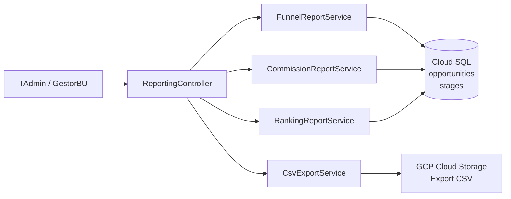
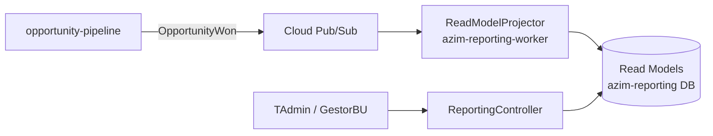

# Module — Reporting

**Status:** Rascunho para revisão
**Fase:** Fase 1/2

---

## 1. Visão Geral

Módulo responsável pela geração de relatórios analíticos e rankings derivados de read models do Opportunity Pipeline, Partner Management e Goal & Forecast. Na Fase 1 opera de forma síncrona dentro do azim-api; na Fase 2 migra para o azim-reporting-worker com read models assíncronos para não impactar a latência da API transacional.

---

## 2. Classificação

| Item | Valor |
|---|---|
| Tipo de Módulo | Worker (Fase 2) / Application Module síncrono (Fase 1) |
| Deployable Candidato | azim-reporting-worker (Fase 2); azim-api (Fase 1) |
| Bounded Context Relacionado | Reporting (BC-07) |
| Subdomínio DDD | Supporting Subdomain |
| Tier / Criticidade | Tier 2 — relatórios são importantes mas sem SLA crítico de latência |
| Status | Rascunho para revisão |

---

## 3. Objetivo

Prover relatórios acionáveis para gestores e Tenant Admins: funil de vendas, forecast por BU, ranking de vendedores, relatório de comissões por parceiro e export de dados em CSV. Na Fase 1, queries síncronas. Na Fase 2, read models assíncronos projetados pelo worker.

---

## 4. Responsabilidades

- Gerar FunnelReport: oportunidades por estágio, BU e período.
- Gerar ForecastReport: forecast_ponderado por BU e período.
- Gerar RankingReport: ranking de vendedores por valor ganho no período.
- Gerar CommissionReport: comissões consolidadas por parceiro.
- Exportar relatório em CSV (CAP-09).
- Filtrar resultados por RBAC: somente dados acessíveis ao usuário autenticado.
- Não possui escrita própria em entidades de negócio — somente leitura de read models.

---

## 5. Fora de Escopo

- Escrita em qualquer entidade de negócio (pertence aos módulos upstream).
- Relatórios de auditoria (pertence ao audit-log — consulta de audit_logs).
- Dashboard em tempo real (queries síncronas na Fase 1; read models assíncronos na Fase 2).
- Relatórios de IA ou scoring (pertence ao ai-intelligence — Fase 3).

---

## 6. Capacidades Atendidas

| Código | Capability | Descrição |
|---|---|---|
| CAP-09 | Relatórios | Funil, forecast, ranking, canais, comissões, export CSV |

---

## 7. Bounded Context e Linguagem Ubíqua

| Termo | Definição |
|---|---|
| FunnelReport | Relatório de oportunidades por estágio, BU e período |
| ForecastReport | Relatório de forecast_ponderado por BU e período |
| RankingReport | Ranking de vendedores por valor ganho no período |
| CommissionReport | Comissões consolidadas por parceiro derivadas de opportunity_partner_commissions |
| read model | Projeção de dados otimizada para leitura; sem escrita; derivada de múltiplos contextos |
| export CSV | Export dos dados do relatório em formato CSV para download |

---

## 8. Componentes Internos Candidatos

| Componente | Tipo | Responsabilidade |
|---|---|---|
| FunnelReportService | Application Service | Query de oportunidades por estágio/BU/período |
| ForecastReportService | Application Service | Agregação de forecast_ponderado por BU/período |
| RankingReportService | Application Service | Ranking de vendedores por valor ganho |
| CommissionReportService | Application Service | Comissões por parceiro a partir de opportunity_partner_commissions |
| CsvExportService | Application Service | Serialização de relatório para CSV |
| ReportingController | API Controller | Endpoints de relatórios com filtros e RBAC |
| ReadModelProjector | Worker (Fase 2) | Projeta read models assíncronos a partir de eventos do pipeline |

---

## 9. APIs Principais

| Método | Endpoint | Finalidade | Consumidores |
|---|---|---|---|
| GET | /v1/reports/funnel | Relatório de funil por BU e período | azim-web, TAdmin, GestorBU |
| GET | /v1/reports/forecast | Relatório de forecast por BU e período | azim-web, TAdmin, GestorBU |
| GET | /v1/reports/ranking | Ranking de vendedores no período | azim-web, TAdmin, GestorBU |
| GET | /v1/reports/commissions | Relatório de comissões por parceiro | azim-web, TAdmin, GestorBU |
| GET | /v1/reports/funnel/export | Export CSV do funil | azim-web, TAdmin |
| GET | /v1/reports/commissions/export | Export CSV de comissões | azim-web, TAdmin |

---

## 10. Eventos Publicados

| Evento | Quando é publicado | Consumidores |
|---|---|---|
| ReportGenerated | Após geração de relatório (opcional — para auditoria) | audit-log |

---

## 11. Eventos Consumidos

| Evento | Produtor | Finalidade |
|---|---|---|
| OpportunityWon | opportunity-pipeline (Fase 2) | Atualizar read model de forecast e ranking |
| CommissionSnapshotCreated | opportunity-pipeline (Fase 2) | Atualizar read model de comissões |

---

## 12. Dados Próprios

Este módulo não possui dados próprios de escrita. Na Fase 1, consulta diretamente as tabelas de outros contextos via queries otimizadas no mesmo banco. Na Fase 2, mantém read models projetados em tabelas separadas (a definir).

---

## 13. Integrações

| Sistema/Módulo | Tipo de Integração | Direção | Observações |
|---|---|---|---|
| opportunity-pipeline | Read Model (query / Fase 1) | Entrada | Consulta opportunities, stages, opportunity_stage_transitions |
| partner-management | Read Model (query) | Entrada | Consulta partners para CommissionReport |
| goal-forecast | Read Model (query) | Entrada | Consulta goals para ForecastReport |
| organization | Conformist | Entrada | Filtros por RBAC: tenant_id, bu_id |
| GCP Cloud Storage | API HTTP | Saída | Export CSV armazenado temporariamente para download |
| audit-log | Package (AuditService) | Saída | ReportGenerated para auditoria |

---

## 14. Dependências

### 14.1 Dependências de Domínio

- opportunity-pipeline: fonte primária de dados dos relatórios.
- partner-management: comissões.
- goal-forecast: metas para ForecastReport.
- organization: RBAC.

### 14.2 Dependências Técnicas

- Cloud SQL / Postgres (queries de read models — sem escrita)
- GCP Cloud Storage (export CSV temporário — URL com validade)
- azim-reporting-worker (Fase 2 — Cloud Run separado)

### 14.3 Dependências Operacionais

- Índices de performance nas tabelas do pipeline para queries de relatório
- Política de expiração de URLs de CSV no GCS

---

## 15. Requisitos Não Funcionais Relevantes

| Categoria | Requisito / Observação |
|---|---|
| Performance | Queries de relatório não devem impactar latência da API transacional — separar em worker assíncrono na Fase 2 |
| Observabilidade | Log de cada geração de relatório com tempo de execução |
| Compliance | Relatórios com PII (ex: ranking por vendedor com nome) devem respeitar RBAC |

---

## 16. Compliance Aplicável

| Compliance / Norma / Lei | Aplicável? | Motivo | Impacto no Módulo |
|---|---|---|---|
| LGPD | Sim (marginal) | Relatórios de ranking expõem nome de vendedor (display_name = PII) | Filtrar por RBAC; não expor dados de usuários fora do escopo do tenant |
| PCI DSS | Não aplicável | Não processa dados de cartão | — |

---

## 17. Observabilidade

| Item | Recomendação Inicial |
|---|---|
| Logs | Log por geração: correlation_id, tenant_id, tipo de relatório, filtros, duração |
| Métricas | reports_generated_total, report_generation_duration_seconds por tipo |
| Alertas | Alerta se report_generation_duration_seconds > threshold (SLA a definir) |

---

## 18. Diagramas do Módulo

### 18.1 Diagrama de Componentes — Fase 1 (Síncrono)

### 18.2 Diagrama de Componentes — Fase 2 (Assíncrono)

---

## 19. Riscos

| Código | Risco | Impacto | Mitigação |
|---|---|---|---|
| RISK-REPORT-01 | Queries de relatório impactam latência da API transacional (Fase 1) | Performance degradada para usuários do pipeline | Criar índices dedicados; migrar para azim-reporting-worker na Fase 2 |
| RISK-REPORT-02 | Read models desatualizados na Fase 2 | Relatório exibe dados defasados | Definir SLA de atualização do read model; exibir timestamp de última atualização |

---

## 20. Pontos a Validar

| Código | Ponto | Impacto | Recomendação |
|---|---|---|---|
| VAL-REPORT-01 | Reporting como BC separado vs módulo técnico do azim-api (DDD-VAL-02) | Complexidade desnecessária se mantido como módulo | Manter síncrono no azim-api na Fase 1; avaliar worker assíncrono na Fase 2 |
| VAL-REPORT-02 | SLA de latência de relatório aceitável para Fase 1 | Define se queries síncronas são viáveis | Confirmar com produto: < 5s para FunnelReport? |

---

## 21. Backlog Inicial Sugerido

| Tipo | Item | Descrição |
|---|---|---|
| Epic | Relatórios e Rankings (Fase 1) | FunnelReport, ForecastReport, RankingReport, CommissionReport com export CSV |
| Story Técnica | FunnelReport com filtros por BU e período | GET /v1/reports/funnel com paginação |
| Story Técnica | CommissionReport por parceiro | GET /v1/reports/commissions a partir de opportunity_partner_commissions |
| Story Técnica | Export CSV de relatório | GET /v1/reports/funnel/export via GCP Cloud Storage |
| Story Técnica | RankingReport de vendedores | GET /v1/reports/ranking por valor ganho no período |
| Epic | Read Models Assíncronos (Fase 2) | Migrar para azim-reporting-worker com projeção via Pub/Sub |

---

## 22. Referências

| Documento | Seção |
|---|---|
| DDD Segmentation | §4.1 BC-07 Reporting |
| DDD Segmentation | §7 Deployables — azim-reporting-worker |
| DDD Segmentation | §11 Pontos a Validar — DDD-VAL-02 |
| Data Model | §6 Read Models e Views |
| Context Map | relations.md — Reporting → Pipeline, Partner, Goal |
