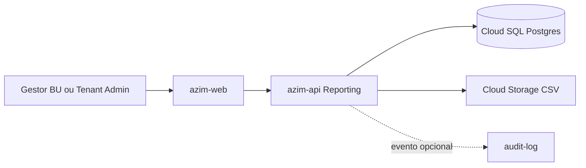
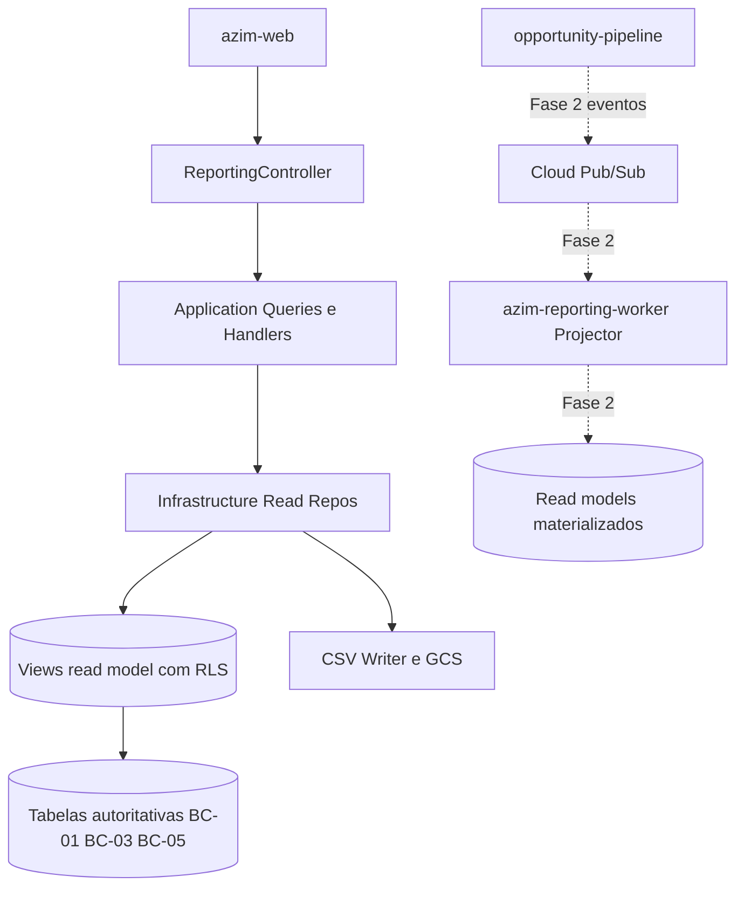
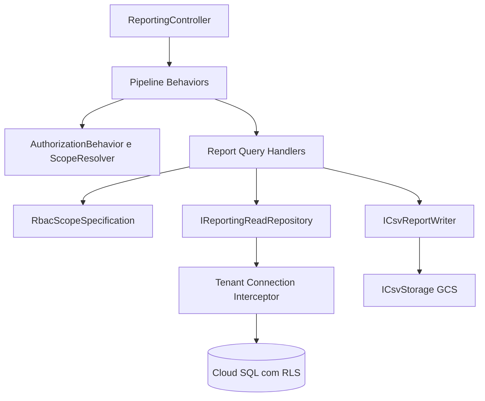
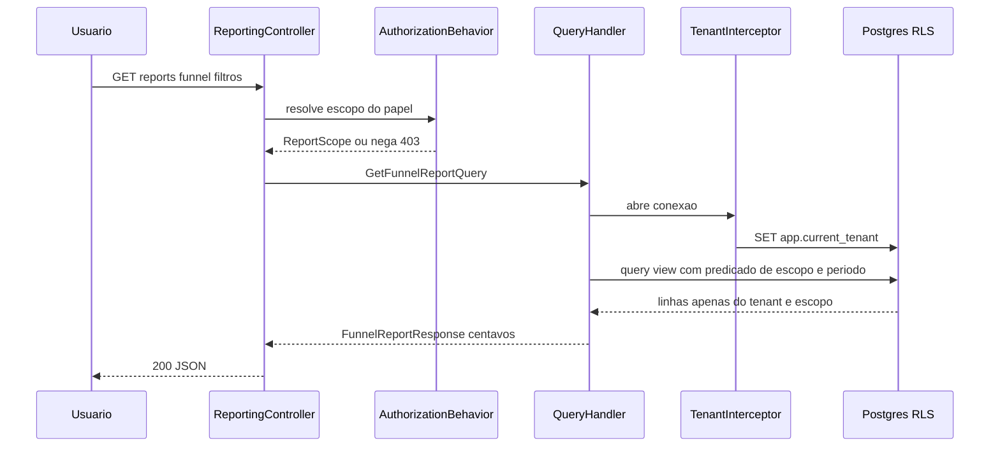
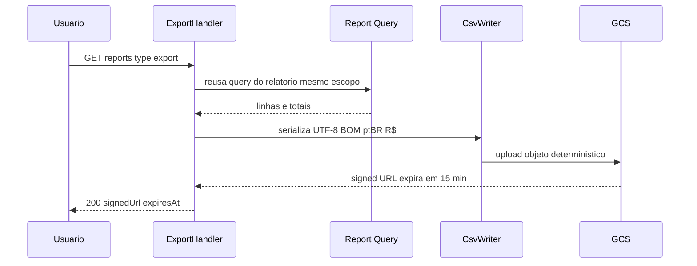
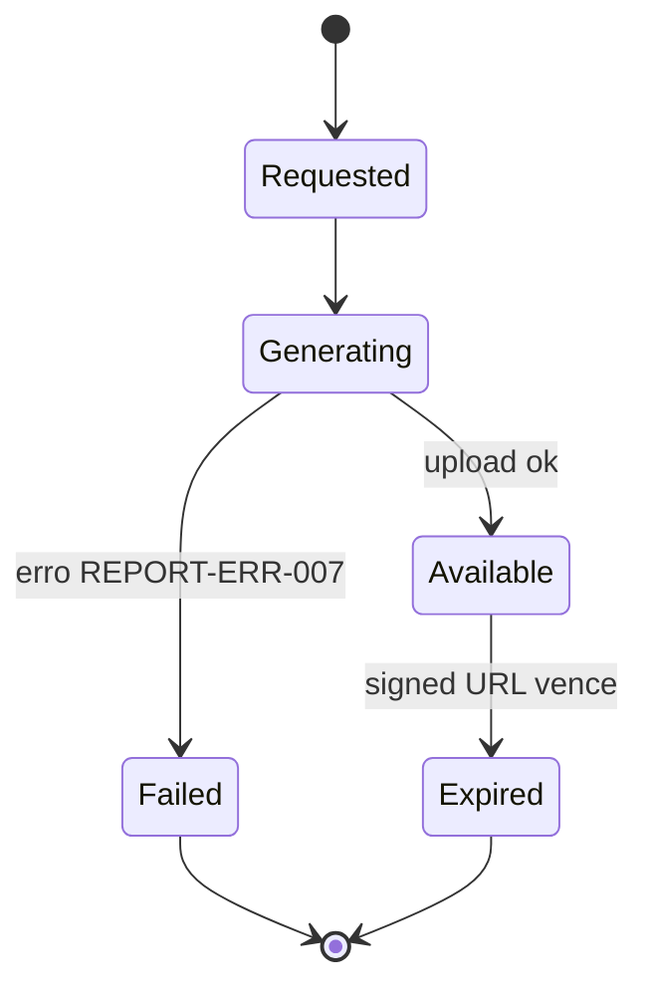

# REPORT — Reporting (Relatórios)
**Design Técnico**

- Versão: 0.1.0
- Data: 2026-06-11
- Status: Rascunho para revisão
- Referência base: docs/product/modules/reporting/requirements.md v0.1.0
- ADRs aplicáveis: ADR-0001 (isolamento multi-tenant em defesa em profundidade — `tenant_id` + EF Core Global Query Filter + RLS obrigatória)
- Rules aplicáveis: `.forge/rules/conventions/database-naming.md`, `.forge/rules/architecture/*`, `.forge/rules/domain/money-cents.md`, `.forge/rules/testing/*`

## Histórico de Versões

| Versão | Data | Status | Descrição da alteração |
|--------|------|--------|------------------------|
| 0.1.0 | 2026-06-11 | Rascunho para revisão | Criação inicial do design técnico do módulo reporting (read side / CQRS de leitura): read models, queries, export CSV, RBAC por escopo, RLS nas views, catálogo de erros, observabilidade e decisões inline DD-001..DD-010 |

## 1. Visão Geral

O módulo **reporting** (BC-07, *Supporting Subdomain* SD-07) é o **read side** (lado de leitura) do Azim CRM. Ele expõe cinco relatórios analíticos enxutos — funil por estágio, forecast por BU/mês, ranking por responsável, oportunidades por canal e comissões por parceiro (projetado × consolidado) — além de export CSV de qualquer relatório.

Características arquiteturais que governam todo o design:

- **Sem escrita de negócio.** O módulo não possui aggregates transacionais próprios. Ele lê *read models* (projeções/views otimizadas para leitura) derivadas dos bounded contexts autoritativos: Opportunity Pipeline (BC-01), Partner Management (BC-03) e Goal & Forecast (BC-05).
- **Não recalcula regra de negócio.** Os valores autoritativos (`valor_total`, `forecast_ponderado`, `comissao_calculada`) são **colunas geradas / snapshots imutáveis** nas tabelas de origem. O reporting apenas **agrega, filtra e ordena** — nunca redefine fórmulas. Isso elimina a classe de bug "duas verdades".
- **Consistência eventual aceitável.** Na Fase 1 a leitura é síncrona sobre o mesmo banco (consistência forte na prática). Na Fase 2 migra para read models projetados por evento no `azim-reporting-worker` (consistência eventual observável). Ver DD-001 e DD-002.
- **Isolamento multi-tenant não negociável (ADR-0001).** Defesa em profundidade obrigatória: `tenant_id` + EF Core Global Query Filter + **RLS no PostgreSQL aplicada também às views de read model**, com comportamento *falha-fechada*. Ver seção 7 e DD-005.
- **RBAC por escopo.** Sobre o isolamento de tenant aplica-se o escopo do papel (Vendedor → próprias oportunidades; Gestor de BU → BUs de membership; Tenant Admin → tenant inteiro; Platform Operator → bloqueado). Ver seção 10 e DD-006.

Este design cobre explicitamente os requisitos Req 1..Req 8, RNF 1..RNF 7 e PBT-01..PBT-05 do `requirements.md` v0.1.0 (rastreabilidade na seção 13.6 e ao longo do documento).

## 2. Princípios e Decisões Macro

| # | Princípio | Consequência de design |
|---|-----------|------------------------|
| P1 | Read side puro (CQRS de leitura) | Sem `Domain` rico; lógica concentrada em `Application` (queries) e `Infrastructure` (views/SQL). Ver DD-003. |
| P2 | Reflexo, não recálculo | Reporting nunca reimplementa fórmulas; lê colunas geradas e snapshots. Garante RNF-2.4 e PBT-01. |
| P3 | Defesa em profundidade multi-tenant | RLS obrigatória inclusive em views de read model; Global Query Filter na aplicação; teste de isolamento como gate. Ver ADR-0001, DD-005. |
| P4 | Escopo RBAC no servidor | Predicado de escopo (owner/BU/tenant) aplicado no servidor, jamais confiando no cliente. Ver Req 7, DD-006. |
| P5 | Dinheiro em centavos inteiros | Todo valor monetário transita como `BIGINT` (centavos). Formatação R$ só na borda de apresentação (CSV). Sem `float`/`double`; sem `decimal` em cálculo de domínio. Ver DD-007. |
| P6 | Minimização de PII | Apenas `display_name` do responsável, apenas no ranking, apenas no escopo RBAC; PII nunca em logs. Ver RNF 4, DD-008. |
| P7 | Fase 1 síncrona, Fase 2 worker | Mesma fronteira lógica de módulo; deployable evolui sem reescrever contratos. Ver DD-001. |
| P8 | Degradação graciosa | Ausência de meta (forecast) não gera erro; relatório indisponível não bloqueia o transacional (Tier 2). Ver Req 6.3, RNF 7. |

Decisões transversais herdadas (não redecididas aqui): plataforma GCP, monólito modular .NET 10, Cloud SQL/Postgres, Cloud Pub/Sub, Cloud Storage para CSV, `snake_case` físico no banco — todas originadas no TRD e no ADR-0001. Qualquer conflito é registrado como risco (seção 18), não sobrescrito.

## 3. Estrutura da Solução

Clean Architecture, com o módulo `reporting` como módulo interno do `azim-api` na Fase 1 e candidato a `azim-reporting-worker` na Fase 2 (DD-001). Como é um read side de subdomínio de suporte, o projeto `Reporting.Domain` é mínimo (objetos de valor de leitura e enums de escopo), sem aggregates transacionais (DD-003).

```text
Reporting.Application      -> queries, handlers, validators, ports de leitura, scope resolver, CSV writer (lógica)
Reporting.Infrastructure  -> repositórios de leitura (Dapper/EF read-only), views/SQL, RLS interceptor, GCS client
Reporting.Api             -> ReportingController (endpoints REST), auth, mapeamento de filtros
Reporting.Contracts       -> DTOs de request/response, enums de tipo de relatório, contrato do CSV
Reporting.Domain          -> objetos de valor de leitura (Money, Period, ReportScope, ChannelShare), enums
```

Projetos de teste:

```text
Reporting.Application.Tests     -> queries, scope resolver, montagem de CSV, PBT-01,02,04,05
Reporting.Infrastructure.Tests  -> views/SQL, RLS, índices, GCS
Reporting.Api.Tests             -> contratos, RBAC por endpoint, catálogo de erros
Reporting.Architecture.Tests    -> regras de dependência Clean Architecture
Reporting.Domain.Tests          -> objetos de valor (Money, Period, ChannelShare) e PBTs aritméticos
```

Regras de dependência validadas por `Reporting.Architecture.Tests`:

```text
Api -> Application, Infrastructure, Contracts
Application -> Domain, Contracts
Infrastructure -> Application, Domain
Domain -> ∅
Contracts -> ∅
```

Como o reporting lê tabelas de outros bounded contexts, o acoplamento é **deliberadamente restrito a read models/views projetadas** (não a entidades EF dos outros módulos), evitando joins ad-hoc entre contextos — conforme Data Model §1 e TRD §9. Ver DD-002.

## 4. Modelo de Domínio

> Subdomínio de suporte e read side: **não há aggregate transacional próprio** (DD-003). O "domínio" do reporting é o conjunto de objetos de valor de leitura imutáveis que garantem corretude aritmética (centavos) e tipagem do escopo. Os aggregates de negócio (`Opportunity`, `Partner`, `Goal`) pertencem aos módulos *upstream* e não são redefinidos aqui.

### 4.1 Aggregates

Não aplicável nesta versão. O reporting não possui aggregate root próprio. Os dados autoritativos vivem nos aggregates `Opportunity` (BC-01), `Partner` (BC-03) e `Goal` (BC-05).

### 4.2 Entidades

Não aplicável nesta versão. Não há entidade transacional com identidade e ciclo de vida próprios. As linhas de relatório são projeções calculadas, não entidades persistidas (Fase 1). Na Fase 2, registros de read model são projeções materializadas, ainda sem regra de negócio própria.

### 4.3 Objetos de valor

Imutáveis, igualdade por valor, em `Reporting.Domain`:

| Objeto de valor | Campos | Invariantes |
|-----------------|--------|-------------|
| `Money` | `cents: long`, `currency = BRL` | `cents` inteiro; sem `float`/`double`; soma e agregação fechadas em inteiros (sem perda/arredondamento — PBT-02). Formatação R$ é responsabilidade externa. |
| `Period` | `from: DateOnly`, `to: DateOnly`, `granularity` (month/quarter/custom) | `from <= to`; janela máxima 12 meses para o caminho de SLO (RNF 1). |
| `ReportScope` | `tenantId`, `role`, `allowedBuIds: set`, `ownerRestrictedTo: userId?` | Resolvido no servidor a partir do token + memberships; nunca vem do cliente (Req 7). |
| `ChannelShare` | `count: int`, `totalCents: long`, `percentBasisPoints: int` | Percentual em *basis points* (inteiro, base 10.000) para conservar soma = 100% sem `float` (PBT-04). |
| `StageBucket` | `stageId`, `stageName`, `category` (open/won/lost) | Categoria refletida da origem; não reclassifica. |
| `ReportType` (enum) | `funnel,forecast,ranking,channel,commissions` | Lista canônica fechada (requirements §4). |

### 4.4 Domain Events

Não aplicável como produtor de eventos de domínio (o subdomínio é exclusivamente leitura — SD-07 §5). O módulo **consome** eventos na Fase 2 (seção 9). Há um evento operacional opcional `ReportGenerated` (integração com audit-log), tratado como evento de integração/observabilidade, não de domínio (seção 9.1).

### 4.5 State Machines

Não aplicável nesta versão. Relatórios não possuem máquina de estados. O único fluxo com estados é o ciclo de vida do artefato de export CSV (`requested → generating → available → expired`), modelado na seção 16.5 como state do export, não do domínio de negócio.

### 4.6 Policies / Specifications

- `TenantIsolationPolicy` (infra/RLS): toda leitura restrita a `app.current_tenant` (DD-005).
- `RbacScopeSpecification` (application): traduz `ReportScope` em predicado SQL adicional — Vendedor (`owner_id = :me`), Gestor de BU (`bu_id IN :allowed_bus`), Tenant Admin (sem filtro adicional além do tenant), Platform Operator (negação). Ver DD-006.
- `PiiMinimizationPolicy` (application): só inclui `display_name` no relatório `ranking`; remove/omite PII nos demais e em todos os logs (RNF 4).

## 5. Application Layer

Como é um read side, **só há queries** — nenhum command de escrita de negócio. O export CSV é uma query seguida de serialização (não muda estado de negócio; apenas materializa um artefato). Mecanismo: handlers por caso de uso, padrão mediator (MediatR, já adotado na stack do `azim-api`); se a stack preferir, equivalente via despacho explícito — o contrato lógico é o mesmo.

### 5.1 Commands

Não aplicável nesta versão (read side puro). O único "efeito colateral" é a geração de artefato CSV no Cloud Storage, modelado como `ExportReportCsvQuery` (produz uma URL assinada) — não há mutação de entidade de negócio. Ver DD-004.

### 5.2 Queries

Uma query por relatório (Req 1..Req 6) + uma query de export (Req 5). Todas recebem `ReportScope` resolvido no servidor.

| Query | Atende | Filtros | Retorno (Contracts) |
|-------|--------|---------|---------------------|
| `GetFunnelReportQuery` | Req 1 | `Period`, `buIds?` | `FunnelReportResponse` (linhas por estágio: `count`, `totalCents`, `weightedForecastCents`) |
| `GetForecastReportQuery` | Req 6 | `Period`, `buIds?` | `ForecastReportResponse` (por BU/mês: `weightedForecastCents`, `realizedCents`, `goalCents?`) |
| `GetRankingReportQuery` | Req 2 | `Period`, `buIds?`, `orderBy=wonValue desc` | `RankingReportResponse` (por owner: `displayName`, `wonCount`, `wonValueCents`, `pipelineForecastCents`) |
| `GetChannelReportQuery` | Req 3 | `Period`, `buIds?` | `ChannelReportResponse` (por canal: `count`, `totalCents`, `percentBasisPoints`) |
| `GetCommissionReportQuery` | Req 4 | `Period`, `buIds?` | `CommissionReportResponse` (por parceiro: `projectedCents`, `consolidatedCents`, `opportunityCount`) |
| `ExportReportCsvQuery` | Req 5 | `reportType`, mesmos filtros do relatório | `CsvExportResponse` (`signedUrl`, `expiresAt`, `filename`) |

Princípios:

- A query de export **reusa exatamente** a query do relatório correspondente (mesmas linhas, mesmo escopo) antes de serializar — garante PBT-05 e Req 5.5 estruturalmente (uma só fonte de verdade de linhas).
- Todas as queries são *read-only* (transação `ReadCommitted` somente leitura; conexão com `app.current_tenant` setado pelo interceptor).
- Sem paginação de negócio nos cinco relatórios do MVP (volume de referência ≤ 2.000 oportunidades/tenant agregadas em poucas dezenas de linhas); export retorna o conjunto completo (RNF 3). Paginação pode ser adicionada na Fase 2 sem quebra (DD-009).

### 5.3 Handlers

Um handler por query. Responsabilidades do handler (ordem):

1. Validar request (validador sintático — seção 5.5).
2. Resolver `ReportScope` (server-side) a partir do `tenantId` do token + memberships (porta `IScopeResolver`). Platform Operator → negação imediata (RNF 5).
3. Montar a especificação de escopo (`RbacScopeSpecification`).
4. Chamar a porta de leitura (`IReportingReadRepository`) que executa a view/SQL com o predicado de escopo, sobre conexão com RLS de tenant ativa.
5. Mapear linhas para o DTO de Contracts (centavos preservados; `Money` → `long cents`).
6. (Export) serializar via `ICsvReportWriter` e fazer upload via `ICsvStorage` (GCS), retornando signed URL.
7. Emitir métricas/log de observabilidade (seção 11) e, opcionalmente, `ReportGenerated` (seção 9.1).

### 5.4 Pipeline Behaviors

Comportamentos transversais aplicados na ordem:

| Behavior | Função | Origem |
|----------|--------|--------|
| `CorrelationBehavior` | Propaga `correlation_id` e `tenant_id` no escopo de log/trace | ADR-0001, RNF 6 |
| `TenantContextBehavior` | Garante `tenant_id` presente e válido antes de tocar o banco; falha-fechada | ADR-0001, Req 8 |
| `ValidationBehavior` | Validação sintática de filtros (período, BU ids) | RNF, Req 1.3 |
| `AuthorizationBehavior` | Bloqueia Platform Operator e papéis sem escopo; resolve `ReportScope` | Req 7, RNF 5 |
| `LoggingMetricsBehavior` | `reports_generated_total`, `report_generation_duration_seconds`, log sem PII | RNF 6 |
| `QueryTimeoutBehavior` | Timeout de banco/relatório (statement_timeout) para proteger o transacional na Fase 1 | RNF 1.3, RISK-REPORT-01 |

### 5.5 Validações de Aplicação

Validações sintáticas na borda (não regra de negócio):

- `Period`: `from <= to`; janela ≤ 12 meses no caminho de SLO (janelas maiores são aceitas mas marcadas como fora-de-SLO no log; ou rejeitadas com `REPORT-ERR-002` conforme política — ver catálogo).
- `buIds`: UUIDs válidos; todos devem estar no `allowedBuIds` do escopo (caso contrário `REPORT-ERR-004`, sem revelar existência de BU de outro escopo — anti-enumeração).
- `reportType` (export): deve pertencer ao enum `ReportType` (`REPORT-ERR-003`).
- Regras de negócio (forecast_ponderado, comissão) **não** são validadas aqui — são refletidas da origem (P2).

## 6. Infrastructure Layer

### 6.1 Persistência

- **Fase 1:** leitura *read-only* sobre o mesmo Cloud SQL/Postgres do `azim-api`, via **views de read model** (`vw_funnel_report`, `vw_forecast_report`, `vw_ranking_report`, `vw_channel_report`, `vw_commission_report`) que encapsulam as agregações. As views são consultadas com Dapper (SQL parametrizado, projeção direta para record) ou EF Core *keyless entity* read-only. Sem `DbContext` com tracking; sem `SaveChanges`.
- **RLS obrigatória (ADR-0001, DD-005):** as views são criadas com `security_invoker = true`, de modo que a RLS das tabelas base (`opportunities`, `opportunity_partner_commissions`, `partners`, `goals`, `stages`) é avaliada **com o `app.current_tenant` da sessão do chamador** — a view não escapa do isolamento. Onde a Fase 2 materializar tabelas de read model próprias, elas terão `tenant_id NOT NULL` + sua própria policy RLS.
- **Interceptor de conexão:** o mesmo interceptor do ADR-0001 executa `SET app.current_tenant = @tenant_id` ao alugar a conexão; sem tenant válido a RLS falha-fechada (zero linhas). Reporting reusa esse interceptor — não cria caminho alternativo.

### 6.2 Cache

Não aplicável no MVP da Fase 1 (consistência forte preferida; volume baixo). Ponto de extensão Fase 2: cache de resultado por (`tenant_id`, `report_type`, hash dos filtros, `read_model_version`) com TTL curto e invalidação por evento. Registrado como oportunidade, não compromisso (DD-009).

### 6.3 Mensageria

- **Fase 1:** nenhuma. Leitura síncrona.
- **Fase 2 (DD-002):** consumo de eventos do Pub/Sub para projetar read models (seção 9.2). Tópicos e contratos já catalogados no TRD §8.4. Consumo idempotente (seção 6.5) com DLQ por tópico (TRD §9).

### 6.4 Integrações Externas

| Integração | Direção | Mecanismo de resiliência |
|------------|---------|--------------------------|
| Cloud SQL/Postgres | Leitura | `statement_timeout` (ex. 4 s), connection pool, retry só em falha transitória de conexão (não em timeout de query) |
| Cloud Storage (CSV) | Escrita/leitura | Timeout de upload, retry com backoff exponencial idempotente (nome de objeto determinístico), circuit breaker; signed URL com expiração curta |
| audit-log (ReportGenerated) | Saída assíncrona | Best-effort; falha não bloqueia o relatório (Tier 2) |
| organization (memberships/RBAC) | Leitura | Cache de memberships de curta duração; falha → falha-fechada (nega acesso) |

### 6.5 Idempotência

- Leitura de relatório é naturalmente idempotente (sem efeito colateral de negócio).
- **Export CSV:** nome do objeto no GCS é determinístico — `reports/{tenant_id}/{report_type}/{period_hash}/{scope_hash}.csv`. Reexecutar com mesmos filtros/escopo sobrescreve o mesmo objeto (idempotente), evitando proliferação e garantindo PBT-05 reproduzível.
- **Fase 2:** consumo de eventos idempotente por `event_id` (tabela inbox), de modo que reprocessamento não duplica projeção (PBT-02 preservada).

### 6.6 Outbox / Inbox

- **Fase 1:** não aplicável (sem publicação/consumo de eventos pelo reporting; `ReportGenerated` é best-effort opcional).
- **Fase 2:** **Inbox** para deduplicação de eventos consumidos (`reporting_inbox(event_id PK, processed_at)`); a projeção e o registro de inbox ocorrem na mesma transação. Sem Outbox próprio (o reporting não publica eventos de domínio).

## 7. Schema / Modelo de Persistência

O reporting **não cria tabelas transacionais** na Fase 1. Ele define **views de read model** sobre as tabelas autoritativas (todas já com `tenant_id` e RLS — Data Model). Convenção física `snake_case` (rule `database-naming.md`), valores monetários em `BIGINT` centavos.

### 7.1 Fonte autoritativa (somente leitura)

| Tabela base | Colunas relevantes (já existentes) | Dono |
|-------------|-------------------------------------|------|
| `opportunities` | `tenant_id`, `bu_id`, `owner_id`, `stage_id`, `origin_channel_id`, `partner_id`, `valor_total` (gerada), `forecast_ponderado` (gerada), `stage_category`, `closed_at`, `created_at` | BC-01 |
| `stages` | `tenant_id`, `bu_id`, `name`, `probability`, `category`, `position` | BC-01 |
| `opportunity_partner_commissions` | `tenant_id`, `opportunity_id`, `partner_id`, `comissao_calculada`, `is_snapshot`, `snapshot_at` | BC-01 |
| `partners` | `tenant_id`, `name` | BC-03 |
| `goals` | `tenant_id`, `bu_id`, mês/ano, valor de meta (centavos) | BC-05 |
| `origin_channels` | `tenant_id`, `bu_id`, `name` | BC-01/Org |
| `users`, `user_memberships` | `display_name` (PII), papel, `bu_id` | BC-08 |

### 7.2 Views de read model (Fase 1) com RLS herdada

Princípio (DD-005): toda view é `security_invoker = true`. A RLS das tabelas base é avaliada com o `app.current_tenant` do chamador → **a view nunca vê dados de outro tenant**. RBAC de escopo (owner/BU) é aplicado como predicado adicional na query do handler, não na view (a view permanece reutilizável por todos os papéis).

```sql
-- Funil por estágio (Req 1)
CREATE VIEW vw_funnel_report
WITH (security_invoker = true) AS
SELECT
  o.tenant_id,
  o.bu_id,
  o.owner_id,
  s.id            AS stage_id,
  s.name          AS stage_name,
  s.category      AS stage_category,
  o.created_at,
  o.valor_total          AS total_cents,
  o.forecast_ponderado   AS weighted_forecast_cents
FROM opportunities o
JOIN stages s ON s.id = o.stage_id;
-- Agregação (count, sum) é feita na query do handler com GROUP BY stage_id
-- + predicado de período e de escopo RBAC.

-- Comissões por parceiro (Req 4) — projetado x consolidado
CREATE VIEW vw_commission_report
WITH (security_invoker = true) AS
SELECT
  c.tenant_id,
  c.partner_id,
  p.name AS partner_name,
  o.bu_id,
  o.owner_id,
  o.created_at,
  o.stage_category,
  c.comissao_calculada AS commission_cents,
  c.is_snapshot
FROM opportunity_partner_commissions c
JOIN opportunities o ON o.id = c.opportunity_id
JOIN partners p ON p.id = c.partner_id;
-- projected = SUM(commission_cents) WHERE is_snapshot = false AND stage_category = 'open'
-- consolidated = SUM(commission_cents) WHERE is_snapshot = true  (oportunidades Ganhas)
```

As demais views (`vw_forecast_report`, `vw_ranking_report`, `vw_channel_report`) seguem o mesmo padrão: expõem `tenant_id`, `bu_id`, `owner_id`, dimensões e medidas em centavos; a agregação e o recorte de escopo/período ficam na query do handler.

### 7.3 Read models materializados (Fase 2 — DD-002)

Quando promovido ao `azim-reporting-worker`, cada projeção vira tabela própria, exemplo:

```sql
CREATE TABLE rm_commission_report (
  tenant_id        UUID    NOT NULL,
  partner_id       UUID    NOT NULL,
  period_month     DATE    NOT NULL,         -- truncado ao mês
  bu_id            UUID    NOT NULL,
  projected_cents  BIGINT  NOT NULL DEFAULT 0,
  consolidated_cents BIGINT NOT NULL DEFAULT 0,
  opportunity_count INT    NOT NULL DEFAULT 0,
  updated_at       TIMESTAMPTZ NOT NULL DEFAULT now(),  -- exposto ao consumidor (RNF-2.2)
  PRIMARY KEY (tenant_id, partner_id, period_month, bu_id)
);
ALTER TABLE rm_commission_report ENABLE ROW LEVEL SECURITY;
ALTER TABLE rm_commission_report FORCE ROW LEVEL SECURITY;
CREATE POLICY rls_rm_commission ON rm_commission_report
  USING (tenant_id = current_setting('app.current_tenant')::uuid);
```

Regras de schema: `tenant_id` obrigatório em todo read model materializado; RLS `ENABLE` + `FORCE` (falha-fechada); auditoria via `updated_at`; sem `float`/`double`; sem `decimal` para valor monetário (apenas `BIGINT` centavos). `comissao_consolidada` derivada **exclusivamente** de `is_snapshot = true` (RN-007, PBT-01).

### 7.4 Índices críticos (Fase 1, mitigam RISK-REPORT-01)

```sql
CREATE INDEX ix_opp_tenant_bu_created   ON opportunities (tenant_id, bu_id, created_at);
CREATE INDEX ix_opp_tenant_owner_cat    ON opportunities (tenant_id, owner_id, stage_category);
CREATE INDEX ix_opp_tenant_channel      ON opportunities (tenant_id, origin_channel_id);
CREATE INDEX ix_opp_tenant_closed       ON opportunities (tenant_id, closed_at) WHERE stage_category = 'won';
CREATE INDEX ix_opc_tenant_partner_snap ON opportunity_partner_commissions (tenant_id, partner_id, is_snapshot);
```

Retenção/particionamento: não aplicável no MVP (sem dados próprios). Migrations das views e índices versionadas no repositório do `azim-api` (mesma esteira do schema), com `migration` idempotente (`CREATE OR REPLACE VIEW`).

## 8. API Contracts

Base path `/api/v1/reports` (TRD §8.4). Autenticação obrigatória (Bearer JWT do tenant); autorização por escopo (seção 10). Papel mínimo: **Gestor de BU** (TRD), com escopo refinado por papel. Todos os endpoints são `GET`, idempotentes e seguros.

### 8.1 Convenções comuns

- **Auth:** `Authorization: Bearer <jwt>`; claims de `tenant_id`, `sub` (userId), papel.
- **Filtros (query string):** `from=YYYY-MM-DD`, `to=YYYY-MM-DD` (ou `period=2026-Q2` / `period=2026-06`), `buId` (repetível). Default: mês corrente.
- **Headers:** `X-Correlation-Id` (gerado se ausente — RNF 6).
- **Valores monetários:** sempre em centavos inteiros (`*_cents`) no JSON. Formatação R$ só no CSV (Req 5.2).
- **Erros:** envelope padrão `{ code, message, correlationId }`, sempre referenciando o catálogo (seção 12); nunca expõem PII nem dados de outro tenant (RNF 4.3).

### 8.2 Endpoints

| Método | Path | Atende | Papel mínimo | Erros possíveis |
|--------|------|--------|--------------|-----------------|
| GET | `/api/v1/reports/funnel` | Req 1 | GestorBU (escopo) | 400 `REPORT-ERR-001/002`, 403 `REPORT-ERR-005`, 404 `REPORT-ERR-004` |
| GET | `/api/v1/reports/forecast` | Req 6 | GestorBU | 400, 403, 404 |
| GET | `/api/v1/reports/ranking` | Req 2 | GestorBU/Vendedor (própria linha) | 400, 403 |
| GET | `/api/v1/reports/channels` | Req 3 | GestorBU | 400, 403 |
| GET | `/api/v1/reports/commissions` | Req 4 | GestorBU | 400, 403 |
| GET | `/api/v1/reports/{type}/export` | Req 5 | GestorBU (export autorizado) | 400 `REPORT-ERR-003`, 403 `REPORT-ERR-006`, 500 `REPORT-ERR-007` |

### 8.3 Exemplos

Request:

```http
GET /api/v1/reports/funnel?from=2026-01-01&to=2026-06-30&buId=11111111-1111-1111-1111-111111111111
Authorization: Bearer <jwt>
```

Response 200:

```json
{
  "period": { "from": "2026-01-01", "to": "2026-06-30" },
  "buId": "11111111-1111-1111-1111-111111111111",
  "stages": [
    { "stageId": "...", "stageName": "Proposta Enviada", "category": "open",
      "count": 12, "totalCents": 4500000, "weightedForecastCents": 1800000 },
    { "stageId": "...", "stageName": "Ganha", "category": "won",
      "count": 5, "totalCents": 9000000, "weightedForecastCents": 9000000 }
  ]
}
```

Export 200 (URL assinada, DD-004):

```json
{
  "reportType": "commissions",
  "filename": "comissoes_2026-01_2026-06.csv",
  "signedUrl": "https://storage.googleapis.com/azim-reports-prod/...&X-Goog-Expires=900",
  "expiresAt": "2026-06-11T18:15:00Z"
}
```

Paginação/ordenação: ranking aceita `orderBy=wonValue` (default `desc`, Req 2.2); demais relatórios retornam conjunto agregado completo (poucas linhas). Rate limit por tenant aplicado na borda (RNF 7, anti-abuso) — política herdada do gateway.

## 9. AsyncAPI / Eventos Publicados e Consumidos

### 9.1 Eventos publicados

| Evento | Tipo | Quando | Consumidor | Payload (sem PII) |
|--------|------|--------|-----------|-------------------|
| `ReportGenerated` | Integração (operacional/auditoria) — opcional | Após gerar relatório/export | audit-log | `tenant_id`, `report_type`, `filters_hash`, `duration_ms`, `correlation_id`, `actor_user_id` |

`ReportGenerated` é **best-effort** (Tier 2): falha de publicação não invalida o relatório. Não é evento de domínio (SD-07 §5). Versionado `report.generated.v1`.

### 9.2 Eventos consumidos (Fase 2 — DD-002)

Para projetar read models materializados (consistência eventual observável, RNF 2):

| Evento | Produtor | Efeito na projeção |
|--------|----------|--------------------|
| `opportunity.created.v1` | opportunity-pipeline | Atualiza funil/forecast/ranking/channel |
| `opportunity.stage_changed.v1` | opportunity-pipeline | Recalcula estágio/forecast |
| `opportunity.won.v1` | opportunity-pipeline | Move para realizado/ranking ganho |
| `opportunity.lost.v1` / `.reopened.v1` | opportunity-pipeline | Ajusta categoria |
| `commission.calculated.v1` | opportunity-pipeline | Atualiza `comissao_projetada` |
| `commission.snapshot_created.v1` | opportunity-pipeline | Acumula `comissao_consolidada` (snapshot imutável) |
| `goal.updated.v1` | goal-forecast | Atualiza comparativo de meta no forecast |

Padrões de consumo: `correlation_id` e `causation_id` propagados (ADR-0001); idempotência por `event_id` via Inbox (6.6); retries + DLQ por tópico (TRD §9); ordering por chave de partição (`tenant_id`/`opportunity_id`); compatibilidade retroativa via versionamento `vN` do contrato. Eventos de domínio (origem) e o evento de integração `ReportGenerated` são distintos e nunca confundidos.

## 10. Segurança

| Vetor | Mecanismo técnico |
|-------|-------------------|
| Autenticação | JWT Bearer validado na borda; claims `tenant_id`, `sub`, papel. Sem token → 401. |
| Autorização (RBAC por escopo) | `AuthorizationBehavior` + `RbacScopeSpecification`: Vendedor → `owner_id = :sub`; Gestor de BU → `bu_id IN allowedBuIds` (memberships de gestor); Tenant Admin → todo o tenant; Viewer → leitura no escopo da BU, export negado quando não autorizado; Platform Operator → **negação dura** (RNF 5, `REPORT-ERR-005/006`). Verificação **sempre no servidor** (Req 7.4). |
| Isolamento multi-tenant | Defesa em profundidade (ADR-0001): (1) Global Query Filter por `tenant_id` na aplicação; (2) RLS `security_invoker` nas views + RLS `FORCE` nos read models materializados; (3) interceptor `SET app.current_tenant`; falha-fechada se ausente. Ver seção 14 e DD-005. |
| Anti-enumeração | `buId` fora do escopo → `REPORT-ERR-004` genérico (não revela se a BU existe em outro escopo). Erros nunca diferenciam "não existe" de "sem permissão" para recursos de outro escopo. |
| Validação de entrada | Validadores sintáticos (período, UUID, enum) antes de tocar o banco; SQL sempre parametrizado (sem concatenação) — anti-SQLi. |
| Minimização/PII | `display_name` só no ranking e só no escopo RBAC (RNF 4.1/4.4); demais relatórios sem PII; logs sem PII (RNF 4.2). Ver DD-008. |
| Criptografia | Em trânsito: TLS (gateway → API → Cloud SQL). Em repouso: criptografia gerenciada do Cloud SQL e do Cloud Storage. |
| Secrets | Conexão de banco e credenciais GCS via Secret Manager / env var Terraform (TRD §13); nunca em código/log. |
| Export CSV | Signed URL de curta validade (ex. 15 min); objeto no bucket por tenant; nenhum dado fora do escopo materializado (Req 5.4). |
| Auditoria | `ReportGenerated` opcional + logs estruturados com `actor_user_id`, `tenant_id`, `report_type` (sem PII) para trilha operacional. |
| LGPD by design | Minimização de PII, escopo de acesso, criptografia, ausência de PII em logs — coerente com NFR-PRIV-01/02/05. |

## 11. Observabilidade

- **Logs estruturados** (JSON) por geração: `correlation_id`, `tenant_id`, `report_type`, `filters_hash`, `actor_user_id`, `duration_ms`, `result_rows`, `outcome`. **Nunca** PII (RNF-4.2, RNF-6.1). `filters_hash` em vez dos valores brutos quando houver risco.
- **Métricas** (RNF-6.2): `reports_generated_total{report_type,outcome}`, `report_generation_duration_seconds{report_type}` (histograma), `report_export_duration_seconds`, `report_rls_denied_total` (vazamentos bloqueados / falha-fechada), `report_scope_denied_total`.
- **Traces:** span por query e por upload GCS, com `tenant_id`/`correlation_id` como atributos (ADR-0001).
- **Alertas** (RNF-6.3): `report_generation_duration_seconds` p95 acima do limite (SLA a confirmar — PTV-01); taxa de erro 5xx; (Fase 2) defasagem do read model acima do SLA (RNF-2.3).
- **Health checks** (TRD §11): `/health/live`; `/health/ready` cobrindo Cloud SQL e Cloud Storage.
- **Eventos de negócio observáveis:** contagem de exports por tenant/tipo para detecção de abuso/exfiltração.
- **SLO técnico:** disponibilidade Tier 2 (RNF 7) e latência p95 ≤ 3 s (RNF 1) monitorados em dashboard dedicado.

## 12. Catálogo de Erros

Prefixo `REPORT-ERR-NNN`. Mensagens estáveis, sem PII e sem dados de outro tenant. Todo endpoint (seção 8.2) referencia este catálogo.

| Código | Mensagem | HTTP | Quando ocorre | Ação recomendada |
|--------|----------|------|---------------|------------------|
| `REPORT-ERR-001` | Período inválido | 400 | `from > to` ou datas malformadas | Corrigir `from`/`to` |
| `REPORT-ERR-002` | Período acima do limite suportado | 400 | Janela > 12 meses no caminho de SLO | Reduzir o intervalo para até 12 meses |
| `REPORT-ERR-003` | Tipo de relatório inválido | 400 | `{type}` fora do enum `ReportType` no export | Usar funnel, forecast, ranking, channel ou commissions |
| `REPORT-ERR-004` | Recurso não encontrado no seu escopo | 404 | `buId` fora do escopo/tenant (anti-enumeração) | Verificar BU autorizada |
| `REPORT-ERR-005` | Acesso negado ao relatório | 403 | Papel sem escopo (inclui Platform Operator) | Solicitar acesso ao Tenant Admin |
| `REPORT-ERR-006` | Export não autorizado | 403 | Papel sem permissão de export (ex. Viewer) | Solicitar permissão de export |
| `REPORT-ERR-007` | Falha ao gerar export | 500 | Erro de serialização/upload no Cloud Storage | Repetir; se persistir, contatar suporte |
| `REPORT-ERR-008` | Relatório temporariamente indisponível | 503 | Timeout/sobrecarga (proteção do transacional) | Repetir mais tarde (Tier 2) |
| `REPORT-ERR-409` | Tenant não resolvido | 403 | `app.current_tenant` ausente (falha-fechada) | Reautenticar |

Regras: erros de autorização (`005/006`) não revelam existência de recurso; `404` (`004`) é deliberadamente genérico; nenhuma mensagem inclui `display_name`, e-mail, telefone ou valores de outro tenant.

## 13. Testes

### 13.1 Testes de domínio (`Reporting.Domain.Tests`)
- `Money`: soma/agregação fechada em inteiros, sem overflow no volume de referência; igualdade por valor.
- `ChannelShare`: soma de `percentBasisPoints` = 10.000 (100%) — base de PBT-04.
- `Period`: invariantes `from <= to`, granularidade.

### 13.2 Testes de aplicação (`Reporting.Application.Tests`)
- Cada handler com escopo Vendedor/Gestor/Tenant Admin retornando o subconjunto correto (Req 2.4, 7.1–7.3).
- `RbacScopeSpecification` traduz cada papel no predicado certo.
- Platform Operator → negação (RNF 5).
- Export reusa a query do relatório (base de PBT-05).

### 13.3 Testes de infraestrutura (`Reporting.Infrastructure.Tests`)
- **RLS:** com `app.current_tenant` de A, query nas views retorna **zero** linhas de B; sem `app.current_tenant` → zero linhas (falha-fechada). Gate de CI (ADR-0001, Req 8.3).
- Índices usados (plano de execução) nas queries de relatório.
- Upload GCS idempotente; signed URL expira.

### 13.4 Testes de API (`Reporting.Api.Tests`)
- Cada endpoint: 200 no escopo, 403 fora do escopo, 400 em filtro inválido, 404 anti-enumeração.
- Catálogo de erros estável; ausência de PII no corpo de erro (RNF 4.3).
- Equivalência relatório × export para os mesmos filtros (Req 5.5).

### 13.5 Testes de arquitetura, segurança, resiliência, performance
- `Reporting.Architecture.Tests`: regras de dependência da seção 3.
- Segurança: PII ausente em logs (RNF 4.2); Platform Operator bloqueado (RNF 5.2).
- Resiliência: timeout de query não derruba o transacional (RNF 1.3); circuit breaker GCS.
- Performance: carga pré-release com 2.000 oportunidades/tenant, p95 ≤ 3 s (RNF 1.2) e export ≤ 10 s (RNF 3.1).

### 13.6 PBTs e rastreabilidade

| PBT | Propriedade | Onde testar | Geradores |
|-----|-------------|-------------|-----------|
| PBT-01 | `comissao_consolidada` imutável a mudança de percentual | Application + Infra (snapshot) | Conjuntos de oportunidades Ganhas + mutações de pct posteriores |
| PBT-02 | Conservação da soma de comissão (centavos, sem perda) | Domain + Application | Conjuntos aleatórios de comissões projetadas/consolidadas |
| PBT-03 | Isolamento por tenant (anti-vazamento) | Infrastructure (RLS) | Dados de múltiplos tenants + filtros arbitrários |
| PBT-04 | Conservação da distribuição por canal (soma 100%) | Domain + Application | Oportunidades por canal variadas |
| PBT-05 | Equivalência relatório × export CSV | Application + Api | Filtros e escopos arbitrários |

### 13.7 Rastreabilidade requisito → design → teste

| Requisito | Elemento de design | Teste |
|-----------|--------------------|-------|
| Req 1 (funil) | `GetFunnelReportQuery`, `vw_funnel_report`, índice `ix_opp_tenant_bu_created` | 13.2, 13.4 |
| Req 2 (ranking) | `GetRankingReportQuery`, `PiiMinimizationPolicy`, ordenação | 13.2, 13.4 |
| Req 3 (canal) | `GetChannelReportQuery`, `ChannelShare` (basis points) | PBT-04 |
| Req 4 (comissões) | `GetCommissionReportQuery`, `vw_commission_report`, snapshot | PBT-01, PBT-02 |
| Req 5 (export) | `ExportReportCsvQuery`, `ICsvReportWriter`, GCS | PBT-05, 13.4 |
| Req 6 (forecast) | `GetForecastReportQuery`, goal opcional (degradação) | 13.2, 13.4 |
| Req 7 (RBAC) | `RbacScopeSpecification`, `AuthorizationBehavior` | 13.2, 13.4 |
| Req 8 (tenant) | RLS `security_invoker`, interceptor, Global Query Filter | PBT-03, 13.3 |
| RNF 1 (latência) | índices, timeout, views enxutas | 13.5 perf |
| RNF 2 (consistência) | DD-001/DD-002, `updated_at` Fase 2 | Fase 2 |
| RNF 3 (export ≤ 10 s) | streaming/serialização eficiente | 13.5 perf |
| RNF 4 (PII) | minimização, logs sem PII | 13.5 segurança |
| RNF 5 (Platform Operator) | negação dura | 13.5 segurança |
| RNF 6 (observabilidade) | métricas/log/trace | 13.4 |
| RNF 7 (Tier 2) | isolamento de falha, health checks | resiliência |

## 14. Multi-tenancy

Aplicável e central. Modelo **pooled** (ADR-0001): isolamento em defesa em profundidade.

- **`tenant_id`:** presente em todas as tabelas base e nos read models materializados (Fase 2).
- **Camada 1 — aplicação:** EF Core Global Query Filter por `tenant_id` (caminho EF) e predicado `tenant_id` explícito nas queries Dapper.
- **Camada 2 — banco (RLS):** views com `security_invoker = true` herdam a RLS das tabelas base; read models materializados com `ENABLE` + `FORCE ROW LEVEL SECURITY` e policy `USING (tenant_id = current_setting('app.current_tenant')::uuid)`.
- **Runtime:** interceptor de conexão executa `SET app.current_tenant = @tenant_id`; sem valor válido a RLS retorna zero linhas (falha-fechada) → `REPORT-ERR-409`.
- **Segregação de cache (Fase 2):** chave de cache inclui `tenant_id`; nunca compartilhada entre tenants.
- **Segregação de eventos (Fase 2):** partição/atributo `tenant_id` no Pub/Sub; Inbox por tenant.
- **Auditoria por tenant:** logs e `ReportGenerated` carimbam `tenant_id`.
- **Risco de vazamento:** mitigado por teste de isolamento automatizado como gate (Req 8.3, PBT-03) — não se confia apenas no filtro de aplicação.

## 15. Performance e Escalabilidade

- **SLO:** p95 ≤ 3 s para relatórios com período ≤ 12 meses (RNF 1.1, alvo PTV-01); export ≤ 10 s (RNF 3.1); disponibilidade Tier 2 99,0% (RNF 7.1).
- **Volume de referência:** até 2.000 oportunidades/tenant; saída agregada de poucas dezenas de linhas.
- **Gargalos esperados:** agregações `GROUP BY` sobre `opportunities` e join com `opportunity_partner_commissions`. Mitigação: índices da seção 7.4; views enxutas; agregação empurrada para o banco (não em memória da aplicação).
- **Proteção do transacional (RISK-REPORT-01, RNF 1.3):** `statement_timeout` nas conexões de relatório; pool separado de leitura (read replica candidata na Fase 2); `QueryTimeoutBehavior`. Na Fase 2, o `azim-reporting-worker` isola completamente a carga (DD-001).
- **Backpressure / limites:** rate limit por tenant na borda; limite de payload do CSV pelo volume de referência; export idempotente evita reprocessamento redundante.
- **Escalabilidade horizontal:** Cloud Run escala o `azim-api` (Fase 1) e o `azim-reporting-worker` (Fase 2) independentemente; nada com estado local.
- **Retries/circuit breaker:** apenas para GCS e falhas transitórias de conexão — nunca retry de query com timeout (evita amplificar carga).

## 16. Diagramas

### 16.1 C4 Level 1 - System Context

O reporting é consumido pelo `azim-web` e lê dados produzidos pelos contextos transacionais.



### 16.2 C4 Level 2 - Container

Fase 1 (síncrono) e Fase 2 (worker assíncrono) — DD-001.



### 16.3 C4 Level 3 - Component



### 16.4 Sequence Diagrams

Fluxo crítico: geração de relatório com isolamento e RBAC.



Fluxo de export CSV:



### 16.5 State Diagrams

Ciclo de vida do artefato de export (não é estado de domínio de negócio).



## 17. Decisões Inline

### DD-001 - Reporting síncrono no azim-api na Fase 1, worker assíncrono na Fase 2 (resolve VAL-MOD-03)

**Contexto:** VAL-MOD-03 / VAL-TRD-02 / DDD-VAL-02 deixam em aberto se o reporting já nasce como `azim-reporting-worker` assíncrono ou como módulo síncrono do `azim-api`.

**Decisão:** Na Fase 1, o reporting é um **módulo síncrono do `azim-api`**, lendo views de read model sobre o banco transacional. Na Fase 2, é **promovido ao `azim-reporting-worker`** com read models materializados projetados por evento. O feature flag `reporting.async_worker` (TRD §11) alterna o caminho sem mudar contratos de API.

**Justificativa:** O volume de referência (≤ 2.000 oportunidades/tenant) é atendível de forma síncrona dentro do SLO (RNF 1) com índices dedicados; introduzir worker e projeção por evento agora adicionaria complexidade (consistência eventual, inbox, DLQ) sem ganho proporcional no estágio atual. A fronteira lógica do módulo é preservada para a migração ser incremental.

**Alternativas:** (a) Worker assíncrono desde a Fase 1 — rejeitada: complexidade prematura (DDD-VAL-02). (b) Sempre síncrono — rejeitada: não escala para dashboards/volumes futuros e arrisca o SLO do transacional.

**Impacto:** Fase 1 compartilha o banco transacional (RISK-REPORT-01, mitigado por índices + timeout + pool de leitura). Migração Fase 2 exige projeção e SLA de defasagem (RNF 2.3).

### DD-002 - População do read model: views diretas (Fase 1) × projeção por evento (Fase 2)

**Contexto:** Os relatórios podem ser populados por query/view direta sobre as tabelas autoritativas (mesmo banco) ou por projeção assíncrona a partir de eventos de domínio dos outros módulos.

**Decisão:** **Fase 1 — views `security_invoker` diretas** sobre as tabelas autoritativas, sem join ad-hoc cruzando contextos fora das views projetadas. **Fase 2 — projeção assíncrona** via eventos do Pub/Sub para tabelas `rm_*` materializadas, com Inbox idempotente.

**Justificativa:** Em Fase 1, ler colunas geradas e snapshots garante reflexo exato dos valores autoritativos (P2, RNF-2.4) com consistência forte e custo baixo. Em Fase 2, a projeção desacopla a carga do transacional e habilita consistência eventual observável (`updated_at`, RNF-2.2/2.3).

**Alternativas:** (a) Joins ad-hoc entre tabelas de contextos no código — rejeitada: viola fronteira de contexto (TRD §9). (b) Materializar read models já na Fase 1 — rejeitada: complexidade sem necessidade de SLO.

**Impacto:** Define dois caminhos de infraestrutura; contratos de API e DTOs idênticos nas duas fases. Consistência eventual só na Fase 2, declarada ao consumidor (RNF-2.1).

### DD-003 - Read side sem domínio rico (Supporting Subdomain)

**Contexto:** SD-07 é subdomínio de suporte sem regra de negócio própria; o tático DDD prevê aggregates, mas aqui não há escrita.

**Decisão:** Não modelar aggregates/entidades transacionais. `Reporting.Domain` contém apenas objetos de valor de leitura (`Money`, `Period`, `ChannelShare`, `ReportScope`) e enums. A lógica vive em `Application` (queries) e `Infrastructure` (views/SQL).

**Justificativa:** Anemia é o padrão correto quando não há invariante de negócio própria; criar aggregates "fantasma" seria over-engineering e duplicaria regras dos contextos autoritativos.

**Alternativas:** Modelar aggregates de relatório — rejeitada: sem invariante a proteger, recalcularia regra de outro contexto (anti-P2).

**Impacto:** Testes concentram-se em queries, escopo e aritmética de centavos; `Domain.Tests` cobre objetos de valor.

### DD-004 - Export CSV via signed URL no Cloud Storage

**Contexto:** O export pode ser devolvido inline no response ou disponibilizado como arquivo em storage com URL assinada.

**Decisão:** Gerar o CSV (UTF-8 com BOM, cabeçalhos pt-BR, valores em R$ formatados na borda), fazer upload com nome de objeto **determinístico** por (tenant, tipo, filtros, escopo) no Cloud Storage e retornar **signed URL** de curta validade (~15 min).

**Justificativa:** Desacopla a geração do download, suporta arquivos maiores na Fase 2, é idempotente (6.5) e mantém o response da API leve. Alinha com TRD §8.4 (export retorna URL assinada do GCS).

**Alternativas:** (a) CSV inline no corpo — rejeitada: não escala e prende a conexão. (b) Persistir registro de export no banco — rejeitada: estado desnecessário para Tier 2.

**Impacto:** Requer política de expiração de objetos no bucket e signed URL; PBT-05 validada sobre o conteúdo do objeto.

### DD-005 - RLS obrigatória também nas views de read model

**Contexto:** ADR-0001 exige RLS como defesa em profundidade. Views poderiam, por padrão, executar com privilégios do dono e burlar a RLS das tabelas base.

**Decisão:** Todas as views de read model são criadas com `WITH (security_invoker = true)`; read models materializados (Fase 2) têm RLS `ENABLE` + `FORCE` com policy por `app.current_tenant`. Falha-fechada sem tenant.

**Justificativa:** Sem `security_invoker`, a view rodaria como o owner e ignoraria a RLS — vazamento entre tenants. ADR-0001 trata RLS como obrigatória, não opcional, inclusive nas projeções de leitura.

**Alternativas:** Confiar só no Global Query Filter da aplicação — rejeitada: ponto único de falha (ADR-0001 Opção A).

**Impacto:** Requer Postgres com suporte a `security_invoker` (PG 15+); teste de isolamento (PBT-03) é gate de CI.

### DD-006 - Escopo RBAC como predicado de aplicação, separado da RLS de tenant

**Contexto:** Isolamento de tenant (RLS) e escopo de papel (owner/BU) são preocupações distintas.

**Decisão:** A RLS cobre o **tenant**; o escopo de **papel** é um predicado adicional montado por `RbacScopeSpecification` na query do handler (Vendedor → owner; Gestor de BU → BUs de membership; Tenant Admin → tenant inteiro). As views permanecem reutilizáveis por todos os papéis.

**Justificativa:** Misturar RBAC de papel na RLS exigiria sessão com contexto de usuário e tornaria as views específicas por papel, prejudicando reuso e auditabilidade. Manter o escopo na aplicação (verificado no servidor) atende Req 7.4 sem acoplar a política de papel ao banco.

**Alternativas:** RLS por usuário/papel — rejeitada: complexidade e perda de reuso; escopo no cliente — rejeitada: inseguro.

**Impacto:** Dois níveis de teste — RLS (tenant) e specification (papel). Defesa em profundidade preservada.

### DD-007 - Money em centavos inteiros fim a fim

**Contexto:** Valores monetários precisam de exatidão; `requirements` e rules exigem centavos inteiros.

**Decisão:** Todo valor transita como `BIGINT`/`long` centavos no banco, queries, DTOs e PBTs. Formatação em R$ ocorre **apenas** na serialização CSV (apresentação). Proibido `float`/`double`; `decimal` não é usado em cálculo monetário de domínio.

**Justificativa:** Inteiros eliminam erro de arredondamento e garantem conservação de soma (PBT-02). Coerente com DEC-011 e a rule de dinheiro em centavos.

**Alternativas:** `decimal`/`numeric` — rejeitada para cálculo de domínio (regra do projeto); `float` — proibido.

**Impacto:** Conversão para R$ centralizada no `ICsvReportWriter` e na camada de apresentação web.

### DD-008 - Minimização de PII: display_name só no ranking e fora dos logs

**Contexto:** `display_name` é PII e só faz sentido no ranking por responsável.

**Decisão:** PII (`display_name`) é incluída exclusivamente no relatório/expor `ranking` e somente dentro do escopo RBAC. Nenhum outro relatório carrega PII; logs nunca registram PII (apenas `actor_user_id`/`owner_id`).

**Justificativa:** Minimização de dados (LGPD, NFR-PRIV-01/02) e RNF 4. Reduz superfície de exfiltração via export e logs.

**Alternativas:** Incluir nomes em todos os relatórios — rejeitada: viola minimização.

**Impacto:** `PiiMinimizationPolicy` central; teste de "zero PII em log" (RNF 4.2) como gate.

### DD-009 - Sem cache e sem paginação de negócio no MVP

**Contexto:** Volume baixo e saída agregada de poucas linhas no MVP.

**Decisão:** Não implementar cache nem paginação de negócio na Fase 1; retornar conjunto agregado completo. Pontos de extensão documentados para a Fase 2.

**Justificativa:** Simplicidade; o SLO é atingível sem cache no volume de referência. Evita complexidade de invalidação prematura.

**Alternativas:** Cache desde já — rejeitada: invalidação complexa sem ganho. Paginação obrigatória — rejeitada: saída pequena.

**Impacto:** Cache/paginação podem ser adicionados na Fase 2 sem quebrar contratos (campos opcionais).

### DD-010 - Percentual por canal em basis points inteiros

**Contexto:** Req 3.2/PBT-04 exigem que a soma dos percentuais por canal seja 100% sem erro de `float`.

**Decisão:** O percentual é calculado e transportado em **basis points** (inteiro, base 10.000) no objeto de valor `ChannelShare`; a exibição com casas decimais é responsabilidade da apresentação.

**Justificativa:** Inteiros conservam a soma exata (PBT-04) e evitam acúmulo de erro de ponto flutuante.

**Alternativas:** Percentual em `double` — rejeitada: erro de arredondamento quebra PBT-04.

**Impacto:** Conversão para `%` ocorre na borda; teste de conservação no domínio.

## 18. Riscos

| Código | Risco | Impacto | Mitigação | Status |
|--------|-------|---------|-----------|--------|
| RISK-REPORT-01 | Queries de relatório impactam latência do transacional (Fase 1) | Degradação do pipeline | Índices dedicados (7.4), `statement_timeout`, pool de leitura, promoção a worker na Fase 2 (DD-001) | Mitigado Fase 1 |
| RISK-REPORT-02 | Read model defasado (Fase 2) | Relatório com dados antigos | SLA de defasagem monitorado + `updated_at` exposto (RNF 2.2/2.3) | Fase 2 |
| RISK-REPORT-03 | View sem `security_invoker` vaza entre tenants | Incidente sev-1 (LGPD) | `security_invoker` obrigatório (DD-005) + teste de isolamento como gate (PBT-03) | Mitigado |
| RISK-REPORT-04 | PII vazada em log ou export | Violação LGPD | `PiiMinimizationPolicy` (DD-008), teste "zero PII em log" | Mitigado |
| RISK-REPORT-05 | Alvo p95 (PTV-01) não confirmado com produto | SLO indefinido | Validar em teste de carga pré-release (RNF 1.2) | Aberto (PTV-01) |
| RISK-REPORT-06 | Versão do Postgres sem `security_invoker` (< 15) | RLS de view inviável | Confirmar PG 15+ no Cloud SQL; alternativa: `WHERE tenant_id = current_setting(...)` explícito nas views | Aberto (validar) |

## 19. Definition of Done

- [ ] Cinco relatórios (funil, forecast, ranking, canal, comissões) implementados com filtros de período e BU (Req 1–6).
- [ ] Export CSV UTF-8 com BOM, cabeçalhos pt-BR, R$ na apresentação, sem PII desnecessária, via signed URL GCS (Req 5).
- [ ] RBAC por escopo verificado no servidor em todo endpoint e export; Platform Operator bloqueado (Req 7, RNF 5).
- [ ] RLS `security_invoker` ativa em todas as views; teste de isolamento por tenant passando como gate de CI (Req 8, PBT-03).
- [ ] Valores monetários em centavos inteiros fim a fim; nenhum `float`/`double`/`decimal` monetário (DD-007).
- [ ] PBT-01..PBT-05 implementados e verdes.
- [ ] Índices da seção 7.4 criados; carga pré-release confirma p95 ≤ 3 s e export ≤ 10 s (RNF 1, RNF 3).
- [ ] Logs/métricas/traces sem PII com `correlation_id` e `tenant_id` (RNF 6); health checks `live`/`ready`.
- [ ] Catálogo de erros aplicado a todos os endpoints; mensagens sem PII nem dados de outro tenant.
- [ ] `Reporting.Architecture.Tests` validando as regras de dependência.
- [ ] PTV-01 (alvo de latência) e versão do Postgres (`security_invoker`) confirmados (RISK-REPORT-05/06).

## 20. Referências

- docs/product/modules/reporting/requirements.md v0.1.0 (Req 1–8, RNF 1–7, PBT-01–05)
- docs/product/modules/reporting/README.md
- docs/product/adr/0001-isolamento-multi-tenant-defesa-em-profundidade.md (ADR-0001)
- docs/product/trd/trd.md §6, §7.4, §8.4, §9, §10.4, §11 (deployable, read models, eventos, RLS, VAL-TRD-02)
- docs/product/data-model/data-model.md §3, §6 (schema autoritativo, read models e views)
- docs/product/ddd/subdomains/supporting/reporting/README.md (SD-07)
- docs/product/frd-nfrd/frd.md (RF-11, FRD-report-01..06), nfrd.md (NFR-PERF/SEG/PRIV/DISP)
- Rules: `.forge/rules/conventions/database-naming.md`, `.forge/rules/domain/*`, `.forge/rules/architecture/*`, `.forge/rules/testing/*`
