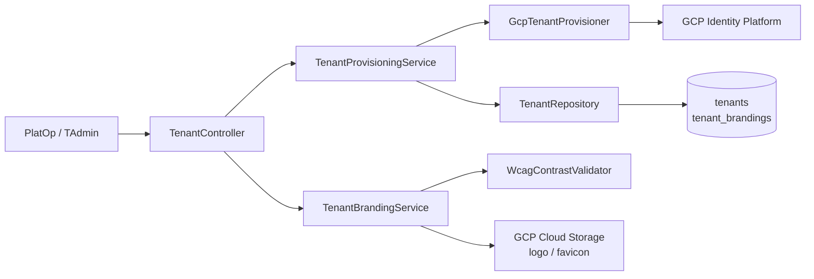
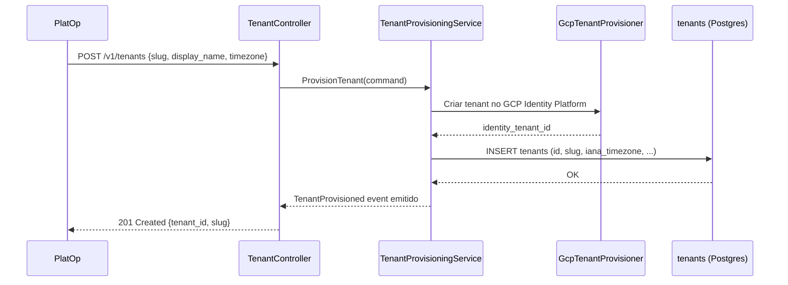

# Module — Tenant Administration

**Status:** Rascunho para revisão
**Fase:** Fase 1 MVP

---

## 1. Visão Geral

Módulo responsável pelo provisionamento e configuração de tenants na plataforma Azim CRM. Gerencia o ciclo de vida do tenant (slug imutável, fuso horário IANA, horário do digest), o white-label (logo, favicon, cores com validação WCAG AA) e a criação do tenant de identidade no GCP Identity Platform. É o ponto de entrada da plataforma para novos clientes SaaS.

---

## 2. Classificação

| Item | Valor |
|---|---|
| Tipo de Módulo | Application Module |
| Deployable Candidato | azim-api |
| Bounded Context Relacionado | Tenancy & Branding (BC-13) |
| Subdomínio DDD | Generic Subdomain |
| Tier / Criticidade | Tier 1 — o tenant_id é cross-cutting e base do RLS de toda a plataforma |
| Status | Rascunho para revisão |

---

## 3. Objetivo

Prover o ciclo de vida completo de um tenant: provisionamento inicial (PlatOp), configuração de slug imutável, fuso horário, horário do digest e branding white-label. Garantir o isolamento multi-tenant via `tenant_id` como chave de RLS em todos os módulos.

---

## 4. Responsabilidades

- Provisionar novo tenant com slug único e imutável após definição (RN-019).
- Configurar fuso horário IANA e horário do digest (padrão 07:00).
- Gerenciar branding white-label: logo (PNG/SVG ≤ 1 MB), favicon, cor primária, cor secundária com validação de contraste WCAG AA (RN-020).
- Criar tenant correspondente no GCP Identity Platform.
- Downstream para o módulo organization: fornecer tenant_id após provisionamento.
- Publicar evento `TenantProvisioned` e `BrandingChanged`.

---

## 5. Fora de Escopo

- Autenticação de usuários (pertence ao authentication).
- Criação de BUs e convite de usuários (pertence ao organization).
- Gestão de planos e cobrança SaaS (fora do MVP — Ponto a Validar).
- Self-service de provisionamento pelo cliente (MVP: PlatOp provisiona manualmente).

---

## 6. Capacidades Atendidas

| Código | Capability | Descrição |
|---|---|---|
| CAP-15 | Tenancy e Branding | Provisionamento de tenant, slug, white-label, fuso horário |

---

## 7. Bounded Context e Linguagem Ubíqua

| Termo | Definição |
|---|---|
| tenant_id | UUID único e imutável que identifica o tenant em todo o sistema; base do RLS |
| slug | Identificador textual único e imutável do tenant após definição (RN-019); usado em URLs e identity tenant |
| iana_timezone | Fuso horário IANA do tenant (ex: America/Sao_Paulo); usado para cálculo do horário do digest |
| digest_time | Horário local (no fuso do tenant) em que o digest deve ser entregue (padrão 07:00) |
| white-label | Customização visual por tenant: logo, favicon, cores — exibida no azim-web via CSS variables |
| PlatOp | Operador da plataforma responsável pelo provisionamento de novos tenants no MVP |
| wcag_contrast_ok | Flag que indica se as cores primária e secundária atendem ao contraste mínimo WCAG AA |

---

## 8. Componentes Internos Candidatos

| Componente | Tipo | Responsabilidade |
|---|---|---|
| TenantProvisioningService | Domain Service | Orquestra provisionamento: cria tenant, slug, chama GCP, notifica organization |
| TenantBrandingService | Domain Service | Valida WCAG AA, armazena logo/favicon, publica BrandingChanged |
| TenantRepository | Repository | Escrita em tenants e tenant_brandings |
| TenantController | API Controller | Endpoints de provisionamento e branding (restrito a PlatOp/TAdmin) |
| WcagContrastValidator | Domain Service | Calcula e valida contraste de cor para WCAG AA |
| GcpTenantProvisioner | Adapter | Cria o tenant de identidade no GCP Identity Platform |

---

## 9. APIs Principais

| Método | Endpoint | Finalidade | Consumidores |
|---|---|---|---|
| POST | /v1/tenants | Provisionar novo tenant (PlatOp) | PlatOp (operação interna) |
| GET | /v1/tenants/{tenantId} | Detalhes do tenant corrente | azim-web, TAdmin |
| PUT | /v1/tenants/{tenantId}/branding | Atualizar branding white-label | TAdmin |
| GET | /v1/tenants/{tenantId}/branding | Obter configurações de branding | azim-web (CSS variables) |
| PUT | /v1/tenants/{tenantId}/digest-config | Configurar fuso horário e horário do digest | TAdmin |

---

## 10. Eventos Publicados

| Evento | Quando é publicado | Consumidores |
|---|---|---|
| TenantProvisioned | Após provisionamento bem-sucedido do tenant | organization (criação de BU inicial), audit-log |
| BrandingChanged | Após atualização de branding | azim-web (recarrega CSS variables), audit-log |

---

## 11. Eventos Consumidos

Este módulo não consome eventos diretamente.

---

## 12. Dados Próprios

| Entidade/Tabela | Tipo | Banco/Persistência | Observações |
|---|---|---|---|
| tenants | Configuração | Cloud SQL / Postgres | slug imutável após definição (RN-019); iana_timezone e digest_time configuráveis |
| tenant_brandings | Configuração | Cloud SQL / Postgres | logo_url, favicon_url, cores; wcag_contrast_ok calculado |

---

## 13. Integrações

| Sistema/Módulo | Tipo de Integração | Direção | Observações |
|---|---|---|---|
| GCP Identity Platform | API HTTP | Saída | Cria tenant de identidade correspondente ao slug |
| GCP Cloud Storage | API HTTP | Saída | Upload de logo e favicon; URL armazenada em tenant_brandings |
| organization | Evento (TenantProvisioned) | Saída | Organization cria BU inicial após receber o evento |
| authentication | Cross-cutting (tenant_id) | Saída | tenant_id base do RLS e do contexto de sessão |

---

## 14. Dependências

### 14.1 Dependências de Domínio

- Nenhum BC de negócio — é Generic; todos os outros módulos dependem de tenant_id.

### 14.2 Dependências Técnicas

- GCP Identity Platform SDK (criação de tenant de identidade)
- GCP Cloud Storage (armazenamento de logo e favicon)
- Cloud SQL / Postgres (tabelas tenants e tenant_brandings)

### 14.3 Dependências Operacionais

- Service Account GCP com permissão de criar tenant no Identity Platform
- Bucket GCS para assets de branding (logo, favicon) com URL pública configurável
- Política de CORS no bucket GCS

---

## 15. Requisitos Não Funcionais Relevantes

| Categoria | Requisito / Observação |
|---|---|
| Segurança | slug imutável após definição (RN-019); provisionar tenant somente via PlatOp no MVP |
| Usabilidade | Contraste WCAG AA obrigatório (RN-020); validação antes de salvar branding |
| Performance | Provisionamento é operação de baixa frequência; sem requisito de latência crítica |
| Observabilidade | Log de provisionamento com tenant_id, slug e resultado para auditoria de plataforma |

---

## 16. Compliance Aplicável

| Compliance / Norma / Lei | Aplicável? | Motivo | Impacto no Módulo |
|---|---|---|---|
| LGPD | Marginal | tenant.slug e tenant.display_name podem identificar empresa (não pessoa física) — avaliar | Baixo impacto direto; LGPD incide principalmente em dados de contacts e users |
| PCI DSS | Não aplicável | Não processa dados de cartão | — |

---

## 17. Observabilidade

| Item | Recomendação Inicial |
|---|---|
| Logs | Log de provisionamento: correlation_id, slug, tenant_id, resultado |
| Métricas | tenant_provisioned_total; branding_update_total |
| Alertas | Falha no provisionamento de tenant (evento crítico de plataforma) |
| Auditoria | TenantProvisioned e BrandingChanged devem gerar entrada em audit-log |

---

## 18. Diagramas do Módulo

### 18.1 Diagrama de Componentes Internos

### 18.2 Diagrama de Fluxo Principal — Provisionamento

---

## 19. Riscos

| Código | Risco | Impacto | Mitigação |
|---|---|---|---|
| RISK-TENANT-01 | Slug definido incorretamente e imutável | Slug errado permanece para sempre (RN-019) | Confirmação explícita antes de provisionar; sem endpoint de alteração de slug |
| RISK-TENANT-02 | Falha no provisionamento no GCP com tenant já criado no banco | Estado inconsistente | Transação com compensação: rollback do INSERT se criação no GCP falhar |

---

## 20. Pontos a Validar

| Código | Ponto | Impacto | Recomendação |
|---|---|---|---|
| VAL-TENANT-01 | Self-service de provisionamento (cliente cria seu próprio tenant) vs operação manual (PlatOp) | Define UX e fluxo de onboarding | Manter PlatOp manual no MVP; avaliar self-service na Fase 2 |
| VAL-TENANT-02 | Consolidação de Tenancy & Branding com Organization Management (DDD-VAL-04) | Pode simplificar em um único módulo | Avaliar após estabilização da Fase 1 |

---

## 21. Backlog Inicial Sugerido

| Tipo | Item | Descrição |
|---|---|---|
| Epic | Provisionamento de Tenant | Provisionar tenant com slug, fuso e integração GCP Identity Platform |
| Story Técnica | TenantProvisioningService com rollback | Criação atômica: banco + GCP IdP com compensação em caso de falha |
| Story Técnica | Branding white-label com validação WCAG AA | Upload de logo/favicon, validação de contraste, CSS variables |
| Task | Endpoint POST /v1/tenants (restrito a PlatOp) | Provisionar novo tenant |
| Task | Endpoint PUT /v1/tenants/{id}/branding | Atualizar branding; retornar wcag_contrast_ok |

---

## 22. Referências

| Documento | Seção |
|---|---|
| DDD Segmentation | §4.1 BC-13 Tenancy & Branding |
| DDD Segmentation | §6 Data Ownership — Tenancy & Branding |
| Data Model | §3 Tenancy & Branding (BC-13) |
| Context Map | relations.md — Tenancy & Branding → Identity & Access |
