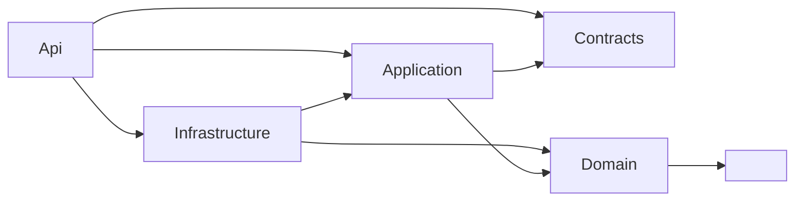
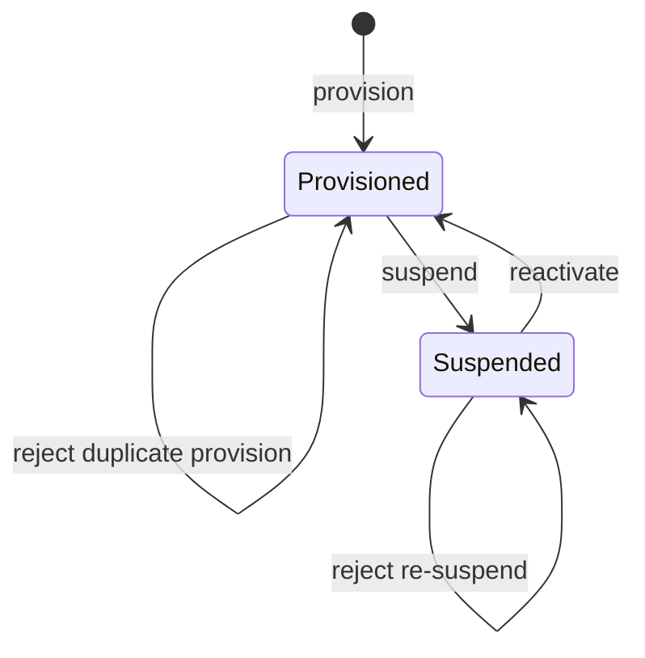
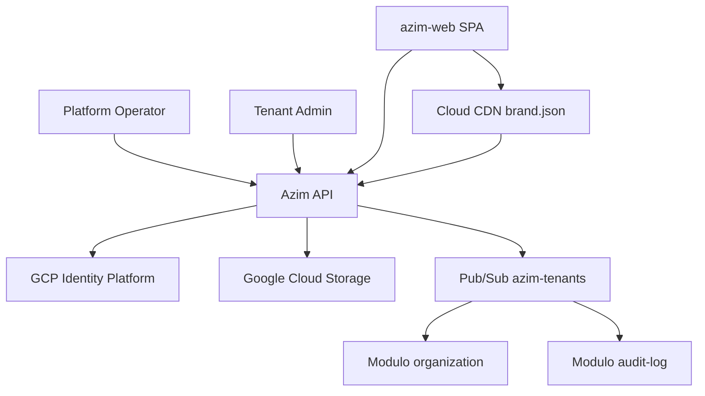
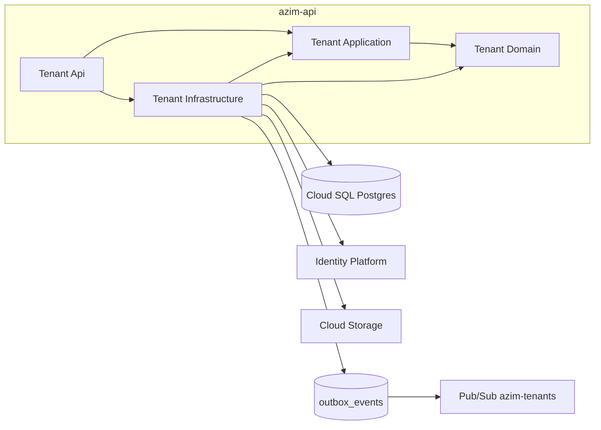
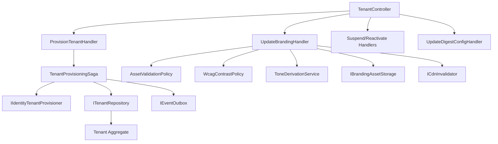

# TA — Tenant Administration
**Design Técnico**

- Versão: 0.1.0
- Data: 2026-06-11
- Status: Rascunho para revisão
- Referência base: docs/product/modules/tenant-administration/requirements.md v0.1.0
- ADRs aplicáveis: ADR-0001 (Multi-tenancy pooled DB + RLS), ADR-0008 (Scheduling do digest por fuso IANA); ADR-0009 (Propagação de `correlation_id` e `tenant_id` — a ser criado)
- Rules aplicáveis: `.forge/rules/domain/audit-immutability.md`, `.forge/rules/architecture/observability.md`, `.forge/rules/conventions/*`

## Histórico de Versões

| Versão | Data | Status | Descrição da alteração |
|--------|------|--------|------------------------|
| 0.1.0 | 2026-06-11 | Rascunho para revisão | Criação inicial do design a partir do requirements.md v0.1.0, TRD, Data Model e README do módulo |

## 1. Visão Geral

Este documento especifica **como** o módulo `tenant-administration` (BC-13 — *Tenancy & Branding*, Generic Subdomain, Tier 1) realiza os requisitos aprovados em `requirements.md` v0.1.0. O módulo é responsável pelo ciclo de vida do tenant (provisionamento, suspensão, reativação), pela identidade textual imutável (`slug`), pela configuração de fuso horário IANA e horário do digest, e pelo branding *white-label* estrito (logo, favicon, cor primária, cor secundária) com validação de contraste WCAG 2.1 AA.

O módulo materializa o `tenant_id` — chave de isolamento *cross-cutting* de toda a plataforma via Row-Level Security (RLS) — e publica os eventos de domínio `TenantProvisioned` e `BrandingChanged`. O provisionamento é atômico em relação à criação do tenant de identidade no GCP Identity Platform (saga com compensação).

A stack-alvo deriva do TRD: monólito modular .NET 10 (`azim-api`), EF Core sobre Cloud SQL/PostgreSQL, GCP Identity Platform para identidade, Google Cloud Storage (GCS) + Cloud CDN para assets de branding, Pub/Sub com Outbox para eventos, Serilog + Cloud Logging para observabilidade.

Rastreabilidade: a seção 17.1 (matriz REQ/PBT → design) e o mapeamento inline em cada seção garantem que todo requisito funcional, RNF e PBT tem contraparte técnica.

### 1.1 Mapeamento de requisitos para a solução (resumo)

| Origem | Elemento de design principal |
|---|---|
| Req 1 Provisionar tenant | `ProvisionTenantCommand` + saga (§5.1, §6.4) |
| Req 2 Slug único/imutável | Objeto de valor `Slug` + índice único global + ausência de setter (§4.3, §7) |
| Req 3 Fuso/horário digest | `UpdateDigestConfigCommand`, objetos de valor `TimezoneIana`/`DigestTime` (§4.3, §5.1) |
| Req 4 Estado do tenant | State machine `TenantStatus` (§4.5) + `SuspendTenantCommand`/`ReactivateTenantCommand` |
| Req 5 Branding estrito | `UpdateBrandingCommand` + objeto de valor `BrandingTheme` (§4.3, §5.1) |
| Req 6 Contraste WCAG | `WcagContrastPolicy` (§4.6) + `ColorPair` |
| Req 7 Logo/favicon | `AssetValidationPolicy` + `BrandingAssetStorage` (§4.6, §6.4) |
| Req 8 Tons derivados | `ToneDerivationService` determinístico (§4.6) |
| Req 9 Branding cacheável | Endpoint público `brand.json` + Cloud CDN (§8.3, §6.2) |
| Req 10 Isolamento | EF Core global query filter + RLS Postgres (§14) |
| Req 11 Eventos | Outbox + Pub/Sub (§6.6, §9) |
| Req 12 Atomicidade | Saga de provisionamento com compensação (§6.4) |

## 2. Princípios e Decisões Macro

1. **Clean Architecture + DDD tático.** Domínio rico (agregado `Tenant`), sem anemia. Dependências: `Api -> Application -> Domain`, `Infrastructure -> Application/Domain`, `Contracts -> ∅`. Validado por `TenantAdministration.Architecture.Tests`.
2. **Defesa em profundidade no isolamento (DEC-006, RNF 1).** Duas camadas independentes: EF Core global query filter por `tenant_id` e RLS Postgres via `SET app.current_tenant`. Falha de uma camada não vaza dados.
3. **Slug imutável por construção (RN-019).** O `slug` não possui setter no agregado e não há comando, endpoint ou caminho de aplicação que o altere. Unicidade global garantida por índice único e por verificação na aplicação.
4. **Provisionamento atômico (Req 12).** Coordenação entre Identity Platform e banco via saga de aplicação com passo de compensação; nunca estado parcial.
5. **White-label estrito (DEC-004).** Exatamente quatro elementos configuráveis. Qualquer campo fora do conjunto é rejeitado na borda e no domínio. Tons derivados determinísticos, nunca informados manualmente.
6. **Branding cacheável na borda (RNF 4).** Leitura pública via `brand.json` servido por Cloud CDN; `BrandingChanged` dispara invalidação para refletir em < 30 s.
7. **Platform Operator sem dados comerciais (RNF 7).** Autorização separa o plano de plataforma (`/api/v1/platform/*`) do plano de tenant; PlatOp não recebe contexto de RLS de dados de negócio.
8. **Auditoria imutável (RNF 5).** Provisionamento e branding geram entrada *append-only* em `audit_logs` via consumo de evento pelo módulo `audit-log`.
9. **Tecnologia ancorada.** Toda escolha tecnológica deriva do TRD/DEC/README; divergências locais são registradas como DD-NNN (§18 Decisões Inline).

## 3. Estrutura da Solução

Projetos (.NET 10), seguindo Clean Architecture:

```text
TenantAdministration.Domain          # Agregado Tenant, objetos de valor, eventos, policies, state machine
TenantAdministration.Application     # Commands, Queries, Handlers, ports (interfaces), saga
TenantAdministration.Infrastructure  # EF Core, repositórios, GCP IdP adapter, GCS, Pub/Sub outbox, CDN
TenantAdministration.Api             # Controllers REST, autorização, mapeamento DTO
TenantAdministration.Contracts       # DTOs públicos, contratos de evento (envelopes), brand.json schema
```

Projetos de teste:

```text
TenantAdministration.Domain.Tests          # Invariantes, objetos de valor, PBTs de domínio
TenantAdministration.Application.Tests     # Handlers, saga, validações de aplicação
TenantAdministration.Infrastructure.Tests  # Repositórios, RLS, adapters (Testcontainers)
TenantAdministration.Api.Tests             # Contratos de API, autorização, isolamento
TenantAdministration.Architecture.Tests    # Regras de dependência entre camadas
```

Regras de dependência (validadas por testes de arquitetura):



O `Domain` não referencia EF Core, GCP SDK, web framework ou mensageria. O acesso a recursos externos é expresso por **ports** (interfaces) na `Application` e implementado na `Infrastructure`: `IIdentityTenantProvisioner`, `IBrandingAssetStorage`, `ITenantRepository`, `IEventOutbox`, `ICdnInvalidator`, `IClock`.

## 4. Modelo de Domínio

### 4.1 Aggregates

| Aggregate | Aggregate Root | Fronteira transacional | Invariantes protegidas |
|---|---|---|---|
| `Tenant` | `Tenant` | Inclui `TenantBranding` (entidade interna) | Slug imutável e único; transições de estado válidas; branding conforme white-label estrito; cores válidas; fuso IANA válido |

O agregado `Tenant` é a única raiz do módulo. `TenantBranding` é uma **entidade interna** ao agregado (relação 1:1), pois suas regras (white-label estrito, contraste, tons) são invariantes do tenant e não devem ser modificadas fora dele. A fronteira transacional cobre `tenants` + `tenant_brandings` + `outbox_events` na mesma transação (atomicidade de evento — Req 11.4).

> Nota DD-005: a 1:1 entre `Tenant` e `TenantBranding` permitiria *flatten* em uma única tabela, mas a separação física já está definida no Data Model (`tenants`/`tenant_brandings`). Mantida a separação física com encapsulamento no agregado.

### 4.2 Entidades

| Entidade | Identidade | Pertence a | Atributos |
|---|---|---|---|
| `Tenant` (root) | `TenantId` (UUID) | — | `slug`, `displayName`, `timezone`, `digestTime`, `status`, `identityTenantId`, `provisionedAt`, `createdAt` |
| `TenantBranding` | `TenantId` (compartilhada, 1:1) | `Tenant` | `theme` (objeto de valor `BrandingTheme`), `wcagContrastOk`, `updatedAt` |

`Tenant` expõe comportamento, não setters públicos: `Provision(...)`, `Suspend()`, `Reactivate()`, `UpdateDigestConfig(...)`, `UpdateBranding(...)`. Cada método valida invariantes e enfileira o domain event correspondente.

### 4.3 Objetos de valor

Imutáveis, com igualdade por valor, validados na construção (falha cedo). O termo **objeto de valor** é usado por extenso.

#### `Slug`
- Regra (RN-019, Req 2): apenas `[a-z]` e `-`; não inicia nem termina com `-`; sem `--` consecutivos; comprimento 3..40.
- Normalização na fábrica `Slug.Create(raw)`: `trim`, lowercase. Se o resultado normalizado divergir do informado, a entrada é **rejeitada** (não há "auto-correção" silenciosa de caracteres inválidos — apenas espaços externos e caixa são tolerados). PBT-02.
- Sem reconstrução mutável; o agregado não expõe `set`. PBT-01.

#### `TimezoneIana`
- Regra (Req 3.1): deve ser um identificador IANA reconhecido (`TimeZoneInfo.TryFindSystemTimeZoneById` / base IANA do runtime). Padrão `America/Sao_Paulo` (Req 3.2).
- Rejeita valores não reconhecidos com `TA-ERR-006`.

#### `DigestTime`
- Regra (Req 3.3): horário local (`HH:mm`) no fuso do tenant; padrão `07:00`. Sem componente de data nem de fuso (o fuso é o `TimezoneIana`).
- Consumido *downstream* pelo digest-worker (DEC-009, ADR-0008).

#### `ColorPair`
- Par de cores hexadecimais `#RRGGBB` (`primary`, `secondary`) (Req 5.3). Validação de formato estrita (`^#[0-9A-Fa-f]{6}$`), normalizado para maiúsculas.
- Calcula a luminância relativa e a razão de contraste (consumido por `WcagContrastPolicy`, §4.6).

#### `BrandingTheme`
- Agrega exatamente os quatro elementos do white-label estrito: `logoUrl`, `faviconUrl`, `ColorPair colors` (Req 5.1, DEC-004). PBT-03: o conjunto de campos persistidos é subconjunto de {logo, favicon, cor primária, cor secundária}; qualquer campo fora é rejeitado pelo tipo (não existe propriedade para CSS/fonte/layout).
- Expõe `DerivedTones derived` calculado deterministicamente a partir de `colors` (§4.6, Req 8). Os tons **não** fazem parte do estado persistido base; são derivados sob demanda/em projeção.

#### `DerivedTones` (objeto de valor derivado)
- Conjunto determinístico de variações (ex.: `primaryHover`, `primaryActive`, `primaryMuted`, `secondaryHover`, ...) calculado por função pura. PBT-05.

### 4.4 Domain Events

Eventos nomeados no passado, enfileirados pelo agregado e materializados no Outbox na mesma transação.

| Domain Event | Disparado por | Payload mínimo | Mapeia para evento de integração |
|---|---|---|---|
| `TenantProvisioned` | `Tenant.Provision(...)` | `tenantId`, `slug`, `displayName`, `timezone`, `provisionedAt` | `tenant.provisioned.v1` |
| `TenantSuspended` | `Tenant.Suspend()` | `tenantId`, `slug`, `occurredAt` | `tenant.suspended.v1` |
| `TenantReactivated` | `Tenant.Reactivate()` | `tenantId`, `slug`, `occurredAt` | `tenant.reactivated.v1` |
| `BrandingChanged` | `Tenant.UpdateBranding(...)` | `tenantId`, `slug`, `wcagContrastOk`, `changedAt` | `tenant.branding_changed.v1` |
| `DigestConfigChanged` | `Tenant.UpdateDigestConfig(...)` | `tenantId`, `timezone`, `digestTime` | (interno; sem publicação externa no MVP) |

Diferenciação: `TenantProvisioned` e `BrandingChanged` são **eventos de integração** publicados no Pub/Sub (Req 11). `DigestConfigChanged` é evento de domínio interno (consumido apenas para auditoria local) — não publicado externamente no MVP.

### 4.5 State Machines

Estado `TenantStatus` com transições da lista canônica (requirements §4, Req 4, PBT-08):



Representação interna: `status` em {`provisioned`, `suspended`}. O estado "reativado" é o próprio `provisioned` (não há estado distinto). Métodos:

- `Provision`: só a partir de inexistente (criação). Re-provisionar mesmo `slug` é rejeitado por unicidade (`TA-ERR-002`).
- `Suspend()`: exige `status == provisioned`; senão `TA-ERR-007` (transição inválida).
- `Reactivate()`: exige `status == suspended`; senão `TA-ERR-007`.

A coluna física `active BOOLEAN` (Data Model) é a projeção do `status` (`active = status == provisioned`). DD-002 detalha.

### 4.6 Policies / Specifications

| Policy | Responsabilidade | Determinística | Mapeia |
|---|---|---|---|
| `WcagContrastPolicy` | Calcula razão de contraste de `ColorPair` e aprova sse R ≥ 4,5:1 (texto normal); 3:1 para texto grande informado separadamente | Sim | Req 6, RNF 2, PBT-04 |
| `ToneDerivationService` | Função pura `ColorPair -> DerivedTones`; mesmo input → mesmo output | Sim | Req 8, PBT-05 |
| `AssetValidationPolicy` | Valida formato (PNG/SVG logo; favicon ICO/PNG/SVG) e tamanho (≤ 1 MB) antes do armazenamento | Sim | Req 7 |

**WcagContrastPolicy (detalhe).** Razão de contraste `(L1 + 0.05) / (L2 + 0.05)`, com `L` = luminância relativa WCAG (sRGB linearizado). Aprovação para texto normal: `R >= 4.5`. Comparação determinística com tolerância exata em ponto: 4,4:1 reprovado; 4,5:1 aprovado; 4,6:1 aprovado (Req 6.4, RNF 2.2). Para evitar erro de ponto flutuante em limítrofes, a comparação usa razão arredondada a 2 casas com regra explícita `round(R, 2) >= 4.50` (DD-003). O resultado popula `wcag_contrast_ok` (Req 6.3) e é exibido ao usuário com o valor calculado (Req 6.2).

> Invariante de conformidade (Req 6.5): `Tenant.UpdateBranding` só marca `wcagContrastOk = true` quando a policy aprova; cores reprovadas não marcam o tenant como conforme, mas o branding pode ser salvo com `wcagContrastOk = false` e sinalização ao usuário (decisão DD-004: salvar com aviso vs bloquear).

**ToneDerivationService (detalhe).** Deriva variações por manipulação determinística no espaço HSL/HSV (ex.: ajuste fixo de lightness para hover/active/muted). Sem aleatoriedade, sem clock, sem I/O. PBT-05 valida idempotência: `derive(c) == derive(c)` para qualquer `c`.

## 5. Application Layer

Padrão CQRS leve com um handler por caso de uso, via MediatR (consistente com a stack .NET do TRD). Commands para escrita, Queries para leitura.

### 5.1 Commands

| Command | Ator/Plano | Caso de uso | Mapeia |
|---|---|---|---|
| `ProvisionTenantCommand` | Platform Operator (`/platform`) | Provisiona tenant + saga IdP | Req 1, Req 12 |
| `SuspendTenantCommand` | Platform Operator (`/platform`) | Suspende tenant | Req 4 |
| `ReactivateTenantCommand` | Platform Operator (`/platform`) | Reativa tenant | Req 4 |
| `UpdateBrandingCommand` | Tenant Admin (tenant) | Atualiza branding + valida WCAG/asset | Req 5, Req 6, Req 7, Req 8 |
| `UpdateDigestConfigCommand` | Tenant Admin (tenant) | Atualiza fuso e horário do digest | Req 3 |

`ProvisionTenantCommand` campos: `slug`, `displayName`, `timezone` (default `America/Sao_Paulo`), `digestTime` (default `07:00`), `slugConfirmation` (Req 1.3 — confirmação explícita do slug imutável), `adminEmail` (semente do tenant de identidade). `idempotencyKey` no header para evitar dupla execução (§6.5).

### 5.2 Queries

| Query | Ator/Plano | Retorno | Mapeia |
|---|---|---|---|
| `GetCurrentTenantQuery` | Viewer (tenant) | Dados do tenant corrente (sem segredos) | README §9 |
| `GetTenantBrandingQuery` | Viewer (tenant) | Branding com tons derivados | Req 9 |
| `GetPublicBrandJsonQuery` | Anônimo/público por slug | `brand.json` cacheável (§8.3) | Req 9 |

### 5.3 Handlers

- `ProvisionTenantHandler`: orquestra a `TenantProvisioningSaga` (§6.4). Um handler por caso de uso.
- `SuspendTenantHandler` / `ReactivateTenantHandler`: carregam o agregado, invocam transição, persistem + Outbox.
- `UpdateBrandingHandler`: invoca `AssetValidationPolicy` (Req 7), faz upload via `IBrandingAssetStorage`, invoca `WcagContrastPolicy` (Req 6), aplica `Tenant.UpdateBranding`, persiste + Outbox `BrandingChanged`, dispara `ICdnInvalidator` (Req 9).
- `UpdateDigestConfigHandler`: valida `TimezoneIana`/`DigestTime`, aplica, persiste.
- `GetPublicBrandJsonHandler`: resolve tenant por `slug`, monta `brand.json` (sem dados sensíveis — Req 9.2).

### 5.4 Pipeline Behaviors

Behaviors MediatR aplicados na ordem:

1. `CorrelationBehavior` — propaga `correlation_id` e `tenant_id` (ADR-0009, RNF 6).
2. `LoggingBehavior` — log estruturado de entrada/saída com `tenant_id`, `slug`, resultado (RNF 6).
3. `ValidationBehavior` — validação sintática (FluentValidation) na borda.
4. `AuthorizationBehavior` — verifica papel/plano (PlatOp vs Tenant Admin) (Req 1.1, 4.1, RNF 7).
5. `IdempotencyBehavior` — chave de idempotência para `ProvisionTenantCommand` (§6.5).
6. `TransactionBehavior` — abre transação, garante Outbox na mesma transação (Req 11.4), aplica `SET app.current_tenant` quando há contexto de tenant.

### 5.5 Validações de Aplicação

| Validação | Tipo | Camada | Mapeia |
|---|---|---|---|
| Formato do `slug` | sintática (borda) + invariante (domínio) | Validation + Domain | Req 2.2, PBT-02 |
| Confirmação de slug | regra de aplicação | Handler | Req 1.3 |
| Formato de cor `#RRGGBB` | sintática | Validation + `ColorPair` | Req 5.3 |
| Formato/tamanho de asset | regra | `AssetValidationPolicy` | Req 7 |
| Fuso IANA válido | invariante | `TimezoneIana` | Req 3.1 |
| Transição de estado válida | invariante | Domain (state machine) | Req 4.4, PBT-08 |
| Plano/papel do ator | autorização | `AuthorizationBehavior` | Req 1.1, 4.1, RNF 7 |

Validações sintáticas ficam na borda; regras de negócio (unicidade de slug, transições, contraste, white-label estrito) ficam no domínio/policies — sem anemia.

## 6. Infrastructure Layer

### 6.1 Persistência

- EF Core (Npgsql) sobre Cloud SQL/PostgreSQL. Mapeamento do agregado `Tenant` + entidade `TenantBranding`.
- **Global query filter** por `tenant_id` para `tenant_brandings` e demais tabelas com `tenant_id` (RNF 1, camada 1). A tabela `tenants` é cross-cutting: leitura por `slug`/`id` no plano de plataforma e por contexto no plano de tenant (DD-001).
- Migrations versionadas (EF Core migrations); índices e constraints conforme §7.
- `IClock` injetado (nunca `DateTime.Now` no domínio) para determinismo e testabilidade.

### 6.2 Cache

- `brand.json` servido por **Cloud CDN** na borda com `Cache-Control` e `ETag` (§8.3). TTL moderado (ex.: 300 s) + invalidação ativa por `BrandingChanged` (Req 9.3, RNF 4).
- Cache de resolução `slug -> tenant_id` em memória/Memorystore (Redis) com TTL curto para acelerar o middleware de resolução de tenant; invalidado em provisionamento. DD-006.

### 6.3 Mensageria

- Google Pub/Sub, tópico `azim-tenants` (TRD §9.3). Publicação via **Outbox** (§6.6), at-least-once, envelope padrão do TRD (§9). Eventos: `tenant.provisioned.v1`, `tenant.suspended.v1`, `tenant.reactivated.v1`, `tenant.branding_changed.v1`.

### 6.4 Integrações Externas e Saga de Provisionamento

Integração de saída: **GCP Identity Platform** (`IIdentityTenantProvisioner`) e **GCS** (`IBrandingAssetStorage`).

`TenantProvisioningSaga` garante atomicidade (Req 12, PBT-07) via saga com compensação:

```mermaid
sequenceDiagram
    participant H as ProvisionTenantHandler
    participant IdP as Identity Platform
    participant DB as Postgres (tenants)
    participant OB as Outbox

    H->>H: validar slug, confirmacao, unicidade
    H->>IdP: createIdentityTenant(slug)
    alt falha IdP
        IdP-->>H: erro
        H-->>H: abortar sem persistir (TA-ERR-009)
    else sucesso
        IdP-->>H: identityTenantId
        H->>DB: BEGIN; INSERT tenant; INSERT outbox(TenantProvisioned)
        alt falha persistencia
            DB-->>H: erro
            H->>IdP: deleteIdentityTenant(identityTenantId)  %% compensacao
            H-->>H: TA-ERR-010
        else sucesso
            DB-->>H: COMMIT
            OB-->>H: evento pronto p/ publicacao
        end
    end
```

Regras: criação no IdP **antes** do commit do banco; se o commit falhar, compensa deletando o tenant de identidade (Req 12.2, 12.3). Resultado final: ambos existem ou nenhum (Req 12.4). A criação no IdP usa a mesma `idempotencyKey` para tolerar retry sem duplicar (§6.5). Timeout, retry (backoff) e circuit breaker no adapter (§15).

### 6.5 Idempotência

- `ProvisionTenantCommand` aceita `Idempotency-Key`. Tabela `tenant_provisioning_requests` registra a chave + resultado; repetição retorna o mesmo resultado sem reexecutar a saga (evita tenant duplicado e dupla criação no IdP).
- Consumers de evento usam `event_id` (idempotência de consumer do TRD §9.4).

### 6.6 Outbox / Inbox

- **Outbox** (`outbox_events`, TRD §9.5) escrito na mesma transação do estado do agregado (Req 11.4). Publicador background lê `pending`, publica no Pub/Sub e marca `published`. Retry com `retry_count`; após N tentativas → `failed` + alerta.
- **Inbox**: não aplicável no MVP — o módulo não consome eventos externos (README §11). Marcado `Não aplicável nesta versão`.

## 7. Schema / Modelo de Persistência

Base no Data Model (BC-13). Nomes físicos em `snake_case`. PostgreSQL.

### 7.1 Tabela `tenants`

| Coluna | Tipo | Constraint | Observação |
|---|---|---|---|
| `id` | UUID | PK, `DEFAULT gen_random_uuid()` | `tenant_id` cross-cutting |
| `slug` | TEXT | NOT NULL, **UNIQUE** | Único global, imutável (RN-019, Req 2.1) |
| `display_name` | TEXT | NOT NULL | Req 1.1 |
| `iana_timezone` | TEXT | NOT NULL, DEFAULT `America/Sao_Paulo` | Req 3.1, 3.2 |
| `digest_time` | TIME | NOT NULL, DEFAULT `07:00` | Req 3.3 |
| `status` | VARCHAR(20) | NOT NULL, DEFAULT `provisioned`, CHECK in (`provisioned`,`suspended`) | State machine (§4.5) |
| `active` | BOOLEAN | NOT NULL, DEFAULT TRUE | Projeção de `status` (DD-002) |
| `identity_tenant_id` | TEXT | NULL | Id do tenant no Identity Platform (Req 12) |
| `provisioned_at` | TIMESTAMPTZ | NOT NULL, DEFAULT `now()` | Auditoria |
| `created_at` | TIMESTAMPTZ | NOT NULL, DEFAULT `now()` | Auditoria |
| `updated_at` | TIMESTAMPTZ | NOT NULL, DEFAULT `now()` | Auditoria |

Índices: `uq_tenants_slug UNIQUE (slug)`; índice implícito da PK. Sem `tenant_id` próprio (a própria `id` é o tenant). Imutabilidade do `slug` reforçada por: ausência de caminho de UPDATE na aplicação + trigger Postgres opcional `prevent_slug_update` (DD-002).

### 7.2 Tabela `tenant_brandings`

| Coluna | Tipo | Constraint | Observação |
|---|---|---|---|
| `id` | UUID | PK, `DEFAULT gen_random_uuid()` | |
| `tenant_id` | UUID | NOT NULL, **UNIQUE**, FK → `tenants(id)` | 1:1; RLS (Req 10) |
| `logo_url` | TEXT | NULL | GCS/CDN URL (Req 7) |
| `favicon_url` | TEXT | NULL | GCS/CDN URL |
| `primary_color` | CHAR(7) | NULL, CHECK `^#[0-9A-F]{6}$` | `#RRGGBB` (Req 5.3) |
| `secondary_color` | CHAR(7) | NULL, CHECK `^#[0-9A-F]{6}$` | `#RRGGBB` |
| `wcag_contrast_ok` | BOOLEAN | NOT NULL, DEFAULT FALSE | Req 6.3 |
| `last_contrast_ratio` | NUMERIC(4,2) | NULL | Valor calculado exibível (Req 6.2) |
| `updated_at` | TIMESTAMPTZ | NOT NULL, DEFAULT `now()` | Auditoria |

Índice: `uq_tenant_brandings_tenant UNIQUE (tenant_id)`.

### 7.3 Tabela `tenant_provisioning_requests` (idempotência)

| Coluna | Tipo | Constraint |
|---|---|---|
| `idempotency_key` | TEXT | PK |
| `slug` | TEXT | NOT NULL |
| `result_tenant_id` | UUID | NULL |
| `status` | VARCHAR(20) | NOT NULL (`in_progress`,`succeeded`,`failed`) |
| `created_at` | TIMESTAMPTZ | NOT NULL DEFAULT `now()` |

### 7.4 RLS

- `tenant_brandings`: RLS habilitado, policy `USING (tenant_id = current_setting('app.current_tenant')::uuid)` (DEC-006, Req 10). Conexão de tenant aplica `SET app.current_tenant`.
- `tenants`: acesso por dois planos. No **plano de tenant**, RLS policy `USING (id = current_setting('app.current_tenant')::uuid)` restringe à própria linha (Req 10.2). No **plano de plataforma** (PlatOp), a role usa contexto sem `app.current_tenant` e tem acesso de gestão apenas a colunas de configuração — nunca a tabelas de dados comerciais (RNF 7). DD-001.

### 7.5 Migrations e retenção

- Estratégia: EF Core migrations, *forward-only*, revisão obrigatória de migrations que tocam RLS/middleware (RNF 1.3).
- Retenção: sem exclusão física de tenant no MVP (requirements §4). `outbox_events` retidos conforme política do TRD; eventos no tópico `azim-tenants` 7 dias.

## 8. API Contracts

REST sobre `azim-api`. Autenticação JWT (GCP Identity Platform). Dois planos: `/api/v1/platform/*` (PlatOp) e `/api/v1/tenant*` (tenant). Erros via catálogo (§12), formato `application/problem+json`.

### 8.1 Plano de plataforma (Platform Operator)

**POST `/api/v1/platform/tenants`** — Provisionar tenant (Req 1, Req 12).
- AuthZ: papel `PlatformOperator` (RNF 7).
- Headers: `Idempotency-Key` (recomendado).
- Request:
```json
{
  "slug": "vellus",
  "slugConfirmation": "vellus",
  "displayName": "Vellus",
  "timezone": "America/Sao_Paulo",
  "digestTime": "07:00",
  "adminEmail": "admin@vellus.com.br"
}
```
- Responses: `201 Created` `{ "tenantId", "slug", "status": "provisioned" }`; `400` (`TA-ERR-001/004/005/006`); `409` slug já existe (`TA-ERR-002`); `422` confirmação divergente (`TA-ERR-003`); `502` falha IdP (`TA-ERR-009`); `500` compensação (`TA-ERR-010`).

**POST `/api/v1/platform/tenants/{tenantId}/suspend`** — Suspender (Req 4).
- AuthZ: `PlatformOperator`. Responses: `200`; `409` transição inválida (`TA-ERR-007`); `404` (`TA-ERR-008`).

**POST `/api/v1/platform/tenants/{tenantId}/reactivate`** — Reativar (Req 4).
- AuthZ: `PlatformOperator`. Responses: `200`; `409` (`TA-ERR-007`); `404` (`TA-ERR-008`).

### 8.2 Plano de tenant (Tenant Admin / Viewer)

**GET `/api/v1/tenant`** — Tenant corrente. AuthZ: `Viewer+`. Retorna `slug`, `displayName`, `timezone`, `digestTime`, `status`. Isolado por RLS (Req 10).

**PATCH `/api/v1/tenant`** — Atualizar `displayName`, `timezone`, `digestTime` (Req 3). AuthZ: `TenantAdmin`. **Nunca** aceita `slug` (Req 2.3); campo `slug` no corpo é rejeitado com `TA-ERR-011`. Responses: `200`; `400` (`TA-ERR-006`).

**GET `/api/v1/tenant/branding`** — Branding do tenant corrente com tons derivados (Req 9). AuthZ: `Viewer+`.

**PUT `/api/v1/tenant/branding`** — Atualizar branding (Req 5, 6, 7, 8). AuthZ: `TenantAdmin`. `multipart/form-data`: `logo` (PNG/SVG ≤ 1 MB), `favicon`, `primaryColor` `#RRGGBB`, `secondaryColor` `#RRGGBB`.
- Responses: `200` `{ "wcagContrastOk", "contrastRatio", "logoUrl", "faviconUrl", "derivedTones": {...} }`; `400` cor inválida (`TA-ERR-004`); `413`/`415` asset inválido (`TA-ERR-012/013`); `422` contraste insuficiente conforme política de bloqueio (`TA-ERR-014`, ver DD-004). Rejeições não alteram branding prévio (Req 7.5).

### 8.3 Endpoint público cacheável `brand.json` (Req 9)

**GET `/brand/{slug}/brand.json`** (servido por Cloud CDN; origem `azim-api`).
- AuthZ: **público** (sem dados sensíveis — Req 9.2).
- Cache: `Cache-Control: public, max-age=300`, `ETag`. Invalidado por `BrandingChanged` (Req 9.3, RNF 4).
- Response `200`:
```json
{
  "slug": "vellus",
  "logoUrl": "https://cdn.azim.com.br/tenants/vellus/logo.svg",
  "faviconUrl": "https://cdn.azim.com.br/tenants/vellus/favicon.png",
  "colors": { "primary": "#1A73E8", "secondary": "#34A853" },
  "derivedTones": {
    "primaryHover": "#1765C7", "primaryActive": "#13509E", "primaryMuted": "#D6E4FB",
    "secondaryHover": "#2E9149", "secondaryActive": "#26773C", "secondaryMuted": "#D7F0DF"
  },
  "wcagContrastOk": true,
  "version": "2026-06-11T12:00:00Z"
}
```
- Erros: `404` slug inexistente (`TA-ERR-008`) — sem distinção entre inexistente e suspenso para evitar enumeração de tenants (RNF 1, anti-enumeração).

### 8.4 Convenções

Paginação/filtros/ordenação não se aplicam (recursos singulares). Rate limit na borda (Cloud Armor) + por tenant (Fase 2). Todos os endpoints referenciam o catálogo de erros (§12).

## 9. AsyncAPI / Eventos Publicados e Consumidos

Envelope padrão do TRD §9.2 (`event_id`, `event_type`, `event_version`, `occurred_at`, `correlation_id`, `tenant_id`, `aggregate_type`, `aggregate_id`, `producer`, `payload`). Tópico `azim-tenants`, retenção 7 dias, at-least-once via Outbox.

### 9.1 Eventos publicados

| Evento | Tipo | Tópico | Payload | Consumidores | Mapeia |
|---|---|---|---|---|---|
| `tenant.provisioned.v1` | Integração | `azim-tenants` | `{ tenantId, slug, displayName, timezone, digestTime }` | organization (BU inicial), audit-log | Req 11.1, Req 1.4 |
| `tenant.branding_changed.v1` | Integração | `azim-tenants` | `{ tenantId, slug, wcagContrastOk }` | azim-web (CDN invalidation), audit-log | Req 11.2, Req 9.3 |
| `tenant.suspended.v1` | Integração | `azim-tenants` | `{ tenantId, slug }` | audit-log, authentication (bloqueio) | Req 4 |
| `tenant.reactivated.v1` | Integração | `azim-tenants` | `{ tenantId, slug }` | audit-log, authentication | Req 4 |

### 9.2 Eventos consumidos

`Não aplicável nesta versão` — o módulo não consome eventos externos no MVP (README §11).

### 9.3 Versionamento, correlação e entrega

- `event_version` no `event_type` (`.v1`); evolução por novo sufixo, mantendo compatibilidade retroativa.
- `correlation_id` e `causation_id`: `correlation_id` propagado do request; `causation_id` = `event_id` do evento causador (quando aplicável). ADR-0009.
- Idempotência de consumer por `event_id`; deduplicação no consumer; ordering não exigido (baixa criticidade — TRD §9.3). Retry/backoff e DLQ `azim-tenants-dlq` conforme TRD §9.4. Falha de publicação não deixa o agregado inconsistente (Outbox — Req 11.4).

## 10. Segurança

| Aspecto | Mecanismo |
|---|---|
| Autenticação | JWT validado por ACL `authentication` (GCP Identity Platform, OIDC). |
| Autorização (planos) | `AuthorizationBehavior`: `PlatformOperator` para `/api/v1/platform/*`; `TenantAdmin`/`Viewer` para `/api/v1/tenant*`. RBAC por papel (Req 1.1, 4.1). |
| Isolamento multi-tenant | Defesa em profundidade: EF Core global query filter + RLS Postgres (DEC-006, RNF 1). Detalhe §14. |
| PlatOp sem dados comerciais (RNF 7) | Role de banco do plano de plataforma não tem grant nas tabelas de negócio; contexto sem `app.current_tenant`; tentativa de acesso a dados comerciais retorna `403`/vazio e gera auditoria (RNF 7.1, 7.2). |
| Anti-enumeração | `brand.json` e provisionamento não distinguem "inexistente" de "suspenso"/"existe"; mensagens de erro de slug não revelam tenants de terceiros (RNF 1). |
| Validação de entrada | FluentValidation na borda + invariantes no domínio; uploads validados (formato/tamanho) antes do armazenamento (Req 7). |
| Assets de branding | GCS bucket **não público**; entrega via Cloud CDN com URLs de leitura; upload com Service Account (WIF). TLS em trânsito; encryption at rest GCP (TRD §12). Validação de content-type real (não só extensão) e sanitização de SVG (remoção de scripts) — DD-007. |
| Secrets | Service Account/credenciais via Secret Manager; nunca em código ou banco (DEC-005). |
| Criptografia | TLS em trânsito; at-rest gerenciado pelo GCP (Cloud SQL, GCS). |
| Auditoria | `tenant.provisioned`/`branding_changed`/`suspended`/`reactivated` → `audit_logs` append-only (RNF 5; `.forge/rules/domain/audit-immutability.md`). |
| Proteção contra replay | Idempotency-Key no provisionamento; `event_id` em consumers. |
| LGPD by design | `slug`/`display_name` identificam empresa (não pessoa); `adminEmail` é PII — mascarado em logs de plataforma (TRD §13). |

## 11. Observabilidade

| Sinal | Detalhe | Mapeia |
|---|---|---|
| Logs estruturados | Serilog + Cloud Logging; todo log de operação contém `correlation_id`, `tenant_id`, `slug`, `actor`, `result` (RNF 6.1). PII (`adminEmail`) mascarada. | RNF 6 |
| Métricas | `tenant_provisioned_total`, `tenant_provisioning_failed_total`, `tenant_branding_update_total`, `tenant_wcag_reject_total`, `tenant_provisioning_duration_seconds`, `cdn_invalidation_total`. | RNF 6.3 |
| Traces | Span por saga (passos IdP, DB, Outbox) com `correlation_id`/`tenant_id` como atributos (ADR-0009). | RNF 6 |
| Alertas | Falha de provisionamento → alerta operacional (evento crítico de plataforma); Outbox `failed` > 0; DLQ `azim-tenants-dlq` > 0; `tenant_rls_violation_count > 0` (sev-1). | RNF 6.2 |
| Health/readiness | `/health/live` e `/health/ready` checam conectividade Cloud SQL, Pub/Sub e Identity Platform. | — |
| Auditoria operacional | Acesso de suporte do PlatOp registrado (RNF 7.2). | RNF 7 |

Logs nunca expõem PII sem mascaramento (TRD §13).

## 12. Catálogo de Erros

Prefixo `TA-ERR`. Mensagens não expõem dados de terceiros nem permitem enumeração.

| Código | Mensagem | HTTP | Quando ocorre | Ação recomendada |
|---|---|---|---|---|
| `TA-ERR-001` | Campos obrigatórios ausentes no provisionamento | 400 | `slug`/`displayName`/`timezone` ausente | Informar os campos obrigatórios |
| `TA-ERR-002` | Slug já está em uso | 409 | Slug já existe (unicidade global) | Escolher outro slug (Req 1.6) |
| `TA-ERR-003` | Confirmação de slug não corresponde | 422 | `slugConfirmation != slug` | Reconfirmar o slug (Req 1.3) |
| `TA-ERR-004` | Cor inválida; use formato #RRGGBB | 400 | Cor fora de `#RRGGBB` | Corrigir a cor (Req 5.3) |
| `TA-ERR-005` | Slug em formato inválido; use apenas minúsculas e hífens | 400 | Slug fora do padrão | Corrigir o slug (Req 2.2) |
| `TA-ERR-006` | Fuso horário IANA inválido | 400 | Timezone não reconhecido | Usar identificador IANA válido (Req 3.1) |
| `TA-ERR-007` | Transição de estado inválida | 409 | Suspender suspenso / reativar ativo | Verificar estado atual (Req 4.4) |
| `TA-ERR-008` | Tenant não encontrado | 404 | Tenant/slug inexistente | Verificar identificador |
| `TA-ERR-009` | Falha ao criar tenant de identidade | 502 | Erro no Identity Platform | Repetir; nenhum tenant foi criado (Req 12.2) |
| `TA-ERR-010` | Provisionamento revertido por falha de persistência | 500 | Falha após criar identidade; compensado | Repetir; estado consistente garantido (Req 12.3) |
| `TA-ERR-011` | Slug não pode ser alterado | 422 | Tentativa de alterar slug | Slug é imutável (Req 2.3) |
| `TA-ERR-012` | Arquivo excede 1 MB | 413 | Logo/favicon acima do limite | Reduzir o arquivo (Req 7.2) |
| `TA-ERR-013` | Formato de arquivo não suportado | 415 | Logo fora de PNG/SVG | Enviar PNG ou SVG (Req 7.1, 7.3) |
| `TA-ERR-014` | Contraste insuficiente para WCAG AA | 422 | Razão < 4,5:1 sob política de bloqueio | Ajustar cores; contraste calculado retornado (Req 6.2, DD-004) |

Todo endpoint da §8 referencia exclusivamente códigos deste catálogo.

## 13. Testes

Cobertura rastreável a requisitos e PBTs.

| Camada | Foco | Cobre |
|---|---|---|
| Domain.Tests | Objetos de valor (`Slug`, `TimezoneIana`, `ColorPair`, `BrandingTheme`); state machine; policies | Req 2, 3, 5, 6, 8; PBT-01..05, PBT-08 |
| Application.Tests | Handlers, saga, behaviors, validações | Req 1, 4, 12; PBT-07 |
| Infrastructure.Tests | Repositórios, RLS, global query filter, Outbox, adapters IdP/GCS (Testcontainers Postgres) | Req 10, 11; PBT-06 |
| Api.Tests | Contratos REST, autorização por plano, brand.json, isolamento via API | Req 9, 10; RNF 7 |
| Architecture.Tests | Regras de dependência entre camadas | §2, §3 |
| Contract tests | Schema dos eventos `tenant.*` (envelope TRD) | Req 11 |

PBTs (FsCheck/CsCheck), rastreáveis:

- **PBT-01** (`Slug` imutável + único): geram sequências de operações; assert slug invariável e par distinto ⇒ slugs distintos. (Domain + Infrastructure unicidade.)
- **PBT-02** (formato slug): geradores de strings; aceito ⟺ apenas `[a-z-]` normalizável; rejeição de inválidos.
- **PBT-03** (white-label estrito): geram payloads com campos extras; persistido ⊆ {logo, favicon, primary, secondary}.
- **PBT-04** (monotonicidade contraste): geram pares de cor com razão R; aprovação ⟺ `round(R,2) ≥ 4.50`; testar limítrofes 4,4/4,5/4,6.
- **PBT-05** (determinismo tons): `derive(c) == derive(c)` em múltiplas execuções.
- **PBT-06** (anti-cross-tenant): contexto A nunca retorna dados de B (API + SQL). **Gate obrigatório de CI** (RNF 1.1, KPI-06).
- **PBT-07** (atomicidade): simulação de falha no IdP e no DB; assert ambos-ou-nenhum.
- **PBT-08** (transições de estado): sequências de suspend/reactivate; apenas transições canônicas; inválidas não alteram estado.

Testes de segurança: isolamento de tenant (gate de CI); bloqueio de PlatOp a dados comerciais (RNF 7); sanitização de SVG. Testes de resiliência: timeout/retry/circuit breaker do adapter IdP (compensação).

## 14. Multi-tenancy

| Aspecto | Definição |
|---|---|
| Modelo de isolamento | Pooled DB + RLS (DEC-006, ADR-0001). Defesa em profundidade. |
| Chave | `tenant_id` (UUID); para `tenants`, a própria `id`. |
| Camada 1 (aplicação) | EF Core global query filter `WHERE tenant_id = @currentTenant` automático. |
| Camada 2 (banco) | RLS Postgres `SET app.current_tenant` + policy `USING (tenant_id = current_setting('app.current_tenant')::uuid)`. |
| Segregação de cache | `slug -> tenant_id` e `brand.json` chaveados por slug/tenant; sem chave compartilhada entre tenants. |
| Segregação de eventos | `tenant_id` obrigatório no envelope; consumers filtram por tenant (TRD §9.4). |
| Plano de plataforma | PlatOp opera `tenants` (config) sem `app.current_tenant`, sem grant em tabelas de negócio (RNF 7). |
| Risco de vazamento | Vazamento entre tenants é incidente sev-1; coberto por PBT-06 (gate de CI) e alerta `tenant_rls_violation_count`. |
| Auditoria por tenant | `audit_logs.tenant_id` em toda entrada (RNF 5). |

Mudanças no middleware de resolução de tenant exigem revisão de código obrigatória (RNF 1.3).

## 15. Performance e Escalabilidade

| Aspecto | Definição |
|---|---|
| Provisionamento | Baixa frequência; sem SLO de latência crítica; onboarding ≤ 30 min por automação (RNF 3.1). |
| Capacidade | Suporta ≥ 50 tenants ativos sem retrabalho estrutural (RNF 3.3); pooled DB. |
| `brand.json` | Servido por Cloud CDN; latência de borda; origem `azim-api` apenas em cache miss/invalidação. |
| Propagação branding | < 30 s após salvar (RNF 4.1) via invalidação ativa de CDN + TTL curto. |
| Índices críticos | `uq_tenants_slug` (resolução por slug); `uq_tenant_brandings_tenant`. |
| Resolução de slug | Cache `slug -> tenant_id` (Memorystore) com TTL curto; reduz carga no middleware. |
| Timeouts/retry/circuit breaker | Adapter Identity Platform: timeout ~10 s, retry com backoff (1s/5s/30s), circuit breaker; compensação em falha definitiva (§6.4). |
| Backpressure | Publicador de Outbox processa em lote com limite; DLQ para mensagens não publicáveis. |
| Limites de payload | Logo/favicon ≤ 1 MB (Req 7.2); rejeição antecipada (`413`). |

## 16. Diagramas

### 16.1 C4 Level 1 - System Context



Contexto: PlatOp e Tenant Admin operam via Azim API; azim-web lê branding pela CDN e dados pela API; a API integra IdP, GCS e Pub/Sub; eventos chegam a organization e audit-log.

### 16.2 C4 Level 2 - Container



### 16.3 C4 Level 3 - Component



### 16.4 Sequence Diagrams

Provisionamento atômico: ver §6.4. Fluxo de branding com validação WCAG:

```mermaid
sequenceDiagram
    participant TA as Tenant Admin
    participant C as TenantController
    participant H as UpdateBrandingHandler
    participant GCS as Cloud Storage
    participant DB as Postgres
    participant CDN as Cloud CDN

    TA->>C: PUT /api/v1/tenant/branding (logo, cores)
    C->>H: UpdateBrandingCommand
    H->>H: AssetValidationPolicy (formato/tamanho)
    H->>GCS: upload logo/favicon
    H->>H: WcagContrastPolicy (ratio)
    H->>DB: BEGIN; UPDATE tenant_brandings; INSERT outbox(BrandingChanged); COMMIT
    H->>CDN: invalidar brand.json
    C-->>TA: 200 {wcagContrastOk, contrastRatio, derivedTones}
```

### 16.5 State Diagrams

Máquina de estados do tenant: ver §4.5.

## 17. Rastreabilidade

### 17.1 Matriz REQ/PBT/RNF → Design

| Item | Elementos de design | Testes |
|---|---|---|
| Req 1 | §5.1, §6.4, §8.1 POST tenants | PBT-07, Application.Tests |
| Req 2 | §4.3 `Slug`, §7.1 unique, §8.2 PATCH bloqueio slug | PBT-01, PBT-02 |
| Req 3 | §4.3 `TimezoneIana`/`DigestTime`, §5.1, §8.2 PATCH | Domain.Tests |
| Req 4 | §4.5 state machine, §8.1 suspend/reactivate | PBT-08 |
| Req 5 | §4.3 `BrandingTheme`, §8.2 PUT branding | PBT-03 |
| Req 6 | §4.6 `WcagContrastPolicy`, §12 `TA-ERR-014` | PBT-04 |
| Req 7 | §4.6 `AssetValidationPolicy`, §6.4 GCS | Api.Tests |
| Req 8 | §4.6 `ToneDerivationService` | PBT-05 |
| Req 9 | §8.3 brand.json, §6.2 CDN | Api.Tests |
| Req 10 | §7.4 RLS, §14 | PBT-06 (gate CI) |
| Req 11 | §6.6 Outbox, §9 eventos | Contract tests |
| Req 12 | §6.4 saga compensação | PBT-07 |
| RNF 1 | §14, §7.4 | PBT-06 (gate) |
| RNF 2 | §4.6 WcagContrastPolicy | PBT-04 |
| RNF 3 | §15 | — |
| RNF 4 | §6.2 CDN, §8.3 | Api.Tests |
| RNF 5 | §10 auditoria, §9 | Contract tests |
| RNF 6 | §11 observabilidade | — |
| RNF 7 | §7.4, §10, §14 | Api.Tests segurança |

## 18. Decisões Inline

### DD-001 - Acesso à tabela `tenants` em dois planos

**Contexto:** `tenants` é cross-cutting; PlatOp precisa gerir tenants sem contexto de RLS, enquanto o plano de tenant deve ver apenas a própria linha.

**Decisão:** Duas roles de banco. Plano de tenant aplica `app.current_tenant` e RLS `USING (id = current_setting(...))`. Plano de plataforma usa role sem `app.current_tenant`, com grant apenas na config de `tenants`/`tenant_brandings`, sem acesso a tabelas de negócio.

**Justificativa:** Atende Req 10.2 (isolamento) e RNF 7 (PlatOp sem dados comerciais) simultaneamente.

**Alternativas:** RLS único para ambos (não suporta o plano de gestão); superusuário para PlatOp (viola RNF 7).

**Impacto:** Duas connection strings/roles; revisão obrigatória de grants.

### DD-002 - `status` enum + projeção `active`

**Contexto:** Data Model tem `active BOOLEAN`; a state machine precisa distinguir transições.

**Decisão:** Coluna `status` (`provisioned`/`suspended`) como fonte de verdade; `active` mantido como projeção derivada (`active = status == 'provisioned'`) para compatibilidade com leituras existentes.

**Justificativa:** Preserva o Data Model e habilita transições explícitas (Req 4, PBT-08).

**Alternativas:** Apenas `active` (perde semântica de transição e auditoria de estado).

**Impacto:** Trigger/checagem para manter `active` coerente; migration adiciona `status`.

### DD-003 - Comparação de contraste com arredondamento a 2 casas

**Contexto:** Ponto flutuante torna limítrofes (4,5:1) instáveis (Req 6.4).

**Decisão:** Comparar `round(R, 2) >= 4.50` (texto normal) e `>= 3.00` (texto grande).

**Justificativa:** Determinismo exigido por RNF 2.2 e PBT-04 (4,4 reprova; 4,5 aprova; 4,6 aprova).

**Alternativas:** Comparação direta em double (instável); decimal puro (mais custoso sem ganho perceptível).

**Impacto:** `last_contrast_ratio` `NUMERIC(4,2)`; teste de limítrofes obrigatório.

### DD-004 - Salvar branding com cores reprovadas (com aviso) vs bloquear

**Contexto:** Req 6.5 exige que o tenant não seja marcado conforme com cores fora do limite; não obriga bloquear o salvamento.

**Decisão:** Bloquear o salvamento de cores reprovadas por padrão (`TA-ERR-014`), retornando o contraste calculado; `wcag_contrast_ok` nunca fica `true` indevidamente. Flag de configuração futura para permitir salvar com aviso.

**Justificativa:** Acessibilidade é requisito de conformidade (NFR-COMP-02); falha segura.

**Alternativas:** Salvar com `wcag_contrast_ok=false` e aviso (maior flexibilidade, risco de UI inacessível em produção).

**Impacto:** UX de erro com valor de contraste; revisitar na Fase 2 se necessário.

### DD-005 - Separação física `tenants`/`tenant_brandings`

**Contexto:** Relação 1:1 permitiria tabela única.

**Decisão:** Manter separação física conforme Data Model, com encapsulamento no agregado `Tenant`.

**Justificativa:** Aderência ao Data Model aprovado; branding tem ciclo de atualização próprio (`updated_at`, CDN).

**Alternativas:** Flatten em `tenants` (diverge do Data Model).

**Impacto:** Join 1:1 em leituras de branding; transação cobre ambas as tabelas.

### DD-006 - Cache de resolução `slug -> tenant_id`

**Contexto:** Middleware resolve tenant por slug em todo request (TRD §6).

**Decisão:** Cache em Memorystore (Redis) com TTL curto; invalidado em provisionamento; sem chave compartilhada entre tenants.

**Justificativa:** Reduz carga no caminho quente sem comprometer isolamento.

**Alternativas:** Sempre consultar Postgres (mais latência); cache local por instância (inconsistência entre réplicas).

**Impacto:** Dependência de Memorystore; invalidação no provisionamento.

### DD-007 - Sanitização de SVG e validação de content-type real

**Contexto:** SVG pode conter scripts (XSS) ao ser servido inline.

**Decisão:** Validar o content-type real (magic bytes) e sanitizar SVG (remover `<script>`, handlers `on*`, `xlink:href` externos) antes do armazenamento.

**Justificativa:** Req 7 e segurança de assets servidos via CDN.

**Alternativas:** Servir SVG como `Content-Disposition: attachment` (degrada uso como logo).

**Impacto:** Biblioteca de sanitização na Infrastructure; rejeição de SVG malicioso (`TA-ERR-013`).

## 19. Riscos

| Código | Risco | Impacto | Probab. | Mitigação |
|---|---|---|---|---|
| RISK-TENANT-01 | Slug definido incorretamente e imutável | Alto | Média | Confirmação explícita (Req 1.3); sem endpoint de alteração; `TA-ERR-011` |
| RISK-TENANT-02 | Falha no IdP com tenant já criado no banco | Alto | Baixa | Saga com compensação (§6.4); PBT-07 |
| RISK-TA-03 | Vazamento entre tenants por falha de RLS/filter | Crítico (sev-1) | Baixa | Defesa em profundidade; PBT-06 gate CI; alerta `tenant_rls_violation_count` |
| RISK-TA-04 | PlatOp acessa dados comerciais | Alto (privacidade) | Baixa | Roles segregadas (DD-001); auditoria (RNF 7) |
| RISK-TA-05 | Branding não propaga em < 30 s | Médio | Média | Invalidação ativa de CDN + TTL curto; métrica `cdn_invalidation_total` |
| RISK-TA-06 | SVG malicioso servido via CDN | Alto (XSS) | Baixa | Sanitização e content-type real (DD-007) |
| RISK-TA-07 | Conflito de tecnologia com ADR | Médio | Baixa | Stack ancorada no TRD; ADR-0009 a criar para correlação |

## 20. Definition of Done

- [ ] Agregado `Tenant` e objetos de valor implementados com invariantes e sem setters de `slug`.
- [ ] State machine `provisioned`/`suspended` com transições canônicas e rejeição das inválidas.
- [ ] Saga de provisionamento com compensação validada por PBT-07.
- [ ] `WcagContrastPolicy` e `ToneDerivationService` determinísticos (PBT-04, PBT-05).
- [ ] White-label estrito garantido por tipo (`BrandingTheme`) — PBT-03.
- [ ] Slug único global e imutável — PBT-01, PBT-02 + índice único.
- [ ] RLS + global query filter ativos; PBT-06 como gate de CI (100%).
- [ ] PlatOp sem grant em dados comerciais (DD-001) verificado por teste.
- [ ] Endpoints da §8 implementados, todos mapeados ao catálogo de erros (§12).
- [ ] `brand.json` servido por CDN com invalidação por `BrandingChanged` (< 30 s).
- [ ] Eventos `tenant.*` publicados via Outbox com envelope do TRD; contract tests verdes.
- [ ] Auditoria append-only de provisionamento e branding.
- [ ] Logs/métricas/traces com `correlation_id` e `tenant_id`; alerta de falha de provisionamento.
- [ ] Architecture.Tests validando regras de dependência.
- [ ] Migrations revisadas (RLS/middleware com revisão obrigatória).
- [ ] README do módulo sincronizado com status/versão do design.

## 21. Referências

| Documento | Relação |
|---|---|
| docs/product/modules/tenant-administration/requirements.md v0.1.0 | Base de requisitos (Req 1..12, RNF 1..7, PBT-01..08) |
| docs/product/modules/tenant-administration/README.md | Responsabilidades, componentes, riscos, APIs |
| docs/product/trd/trd.md | Stack, endpoints, eventos, RLS, Outbox, segurança |
| docs/product/data-model/data-model.md | Tabelas `tenants`, `tenant_brandings` |
| docs/product/ddd/subdomains/generic/tenancy-branding/README.md | Subdomínio SD-13, RN-019/020, DEC-004 |
| docs/product/frd-nfrd/frd.md § RF-02 | RF de branding, slug, fuso |
| docs/product/frd-nfrd/nfrd.md | NFR-SEG-01, USA-02, COMP-02, AUD-01, OBS-01, PRIV-05 |
| `.forge/rules/domain/audit-immutability.md` | Auditoria append-only |
| `.forge/rules/architecture/observability.md` | `correlation_id`/`tenant_id` em logs |
| ADR-0001 | Multi-tenancy pooled DB + RLS |
| ADR-0008 | Scheduling do digest por fuso IANA |
| ADR-0009 (a criar) | Propagação de `correlation_id` e `tenant_id` |
