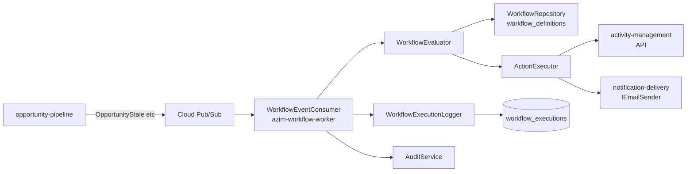

# Module — Workflow Automation

**Status:** Rascunho para revisão
**Fase:** Fase 2

---

## 1. Visão Geral

Módulo de Fase 2 responsável pelo editor visual de automações por BU e pela execução assíncrona de workflows disparados por eventos do Opportunity Pipeline. Permite criar regras visuais do tipo "quando X acontecer, fazer Y" sem código. Deployado como worker separado (azim-workflow-worker) via Cloud Pub/Sub.

---

## 2. Classificação

| Item | Valor |
|---|---|
| Tipo de Módulo | Worker |
| Deployable Candidato | azim-workflow-worker (Cloud Run, .NET 10) |
| Bounded Context Relacionado | Workflow Automation (BC-10) |
| Subdomínio DDD | Supporting Subdomain |
| Tier / Criticidade | Tier 3 (Fase 2) — não crítico no MVP; dependente de validação da Fase 1 |
| Status | Rascunho para revisão |

---

## 3. Objetivo

Permitir que gestores de BU configurem automações visuais (React Flow) disparadas por eventos de domínio do Pipeline. Executar ações como: criar atividade, enviar e-mail, notificar usuário in-app. Garantir execução assíncrona via Pub/Sub sem bloquear a API transacional.

---

## 4. Responsabilidades

- Prover editor visual de workflows por BU (React Flow no azim-web).
- Persistir definições de workflow (trigger, conditions, action nodes).
- Consumir eventos do Opportunity Pipeline via Pub/Sub (opportunity.* events).
- Avaliar condições e executar ações: criar atividade, enviar e-mail, notificar.
- Registrar log de execução por workflow.
- Executar de forma assíncrona sem impactar o azim-api.

---

## 5. Fora de Escopo

- Execução síncrona de automações (obrigatoriamente assíncrona).
- Automações disparadas por eventos fora do Opportunity Pipeline no MVP da Fase 2.
- Integração com sistemas externos via webhook (avaliar na Fase 3).
- IA para sugestão de automações (pertence ao ai-intelligence — Fase 3).

---

## 6. Capacidades Atendidas

| Código | Capability | Descrição |
|---|---|---|
| CAP-11 | Automações Visuais | Editor React Flow; execução assíncrona por BU (Fase 2) |

---

## 7. Bounded Context e Linguagem Ubíqua

| Termo | Definição |
|---|---|
| Workflow | Definição de automação: trigger + conditions + action nodes |
| Trigger | Evento que dispara o workflow (ex: OpportunityStale, OpportunityStageChanged) |
| Condition | Regra de filtragem aplicada ao evento (ex: BU = Vellus, estágio = Proposta) |
| Action Node | Ação a executar: criar atividade, enviar e-mail, notificar |
| WorkflowExecution | Registro de uma execução de workflow para auditoria e debug |

---

## 8. Componentes Internos Candidatos

| Componente | Tipo | Responsabilidade |
|---|---|---|
| WorkflowDefinitionService | Domain Service | CRUD de definições de workflow |
| WorkflowEventConsumer | Consumer | Consome eventos do Pipeline via Pub/Sub |
| WorkflowEvaluator | Domain Service | Avalia condições do workflow contra o evento recebido |
| ActionExecutor | Application Service | Executa ações: criar atividade, enviar e-mail |
| WorkflowExecutionLogger | Domain Service | Registra log de execução |
| WorkflowController | API Controller | Endpoints de CRUD de workflows (no azim-api) |
| WorkflowRepository | Repository | Escrita em workflow_definitions e workflow_executions |

---

## 9. APIs Principais

| Método | Endpoint | Finalidade | Consumidores |
|---|---|---|---|
| GET | /v1/workflows | Lista workflows da BU | azim-web, GestorBU |
| POST | /v1/workflows | Criar workflow | GestorBU, TAdmin |
| PUT | /v1/workflows/{id} | Atualizar workflow | GestorBU, TAdmin |
| DELETE | /v1/workflows/{id} | Remover workflow | GestorBU, TAdmin |
| GET | /v1/workflows/{id}/executions | Histórico de execuções do workflow | GestorBU, TAdmin |

---

## 10. Eventos Publicados

| Evento | Quando é publicado | Consumidores |
|---|---|---|
| WorkflowExecuted | Após execução bem-sucedida ou com falha | audit-log |

---

## 11. Eventos Consumidos

| Evento | Produtor | Finalidade |
|---|---|---|
| opportunity.* (OpportunityCreated, StageChanged, Won, Lost, Stale) | opportunity-pipeline via Pub/Sub | Disparar avaliação de workflows configurados |

---

## 12. Dados Próprios

| Entidade/Tabela | Tipo | Banco/Persistência | Observações |
|---|---|---|---|
| workflow_definitions | Configuração | Cloud SQL / Postgres (Fase 2) | Definição do workflow: trigger, conditions, action nodes |
| workflow_executions | Log | Cloud SQL / Postgres (Fase 2) | Log de cada execução com status e resultado |

---

## 13. Integrações

| Sistema/Módulo | Tipo de Integração | Direção | Observações |
|---|---|---|---|
| opportunity-pipeline | Pub/Sub (evento) | Entrada | Consome opportunity.* events para disparar workflows |
| activity-management | API HTTP | Saída | Cria atividades como ação de workflow |
| notification-delivery | Package (IEmailSender) | Saída | Envia e-mail como ação de workflow |
| audit-log | Package (AuditService) | Saída | WorkflowExecuted gera AuditEvent |
| Cloud Pub/Sub | Mensageria | Bidirecional | Subscrição de eventos do pipeline |

---

## 14. Dependências

### 14.1 Dependências de Domínio

- opportunity-pipeline: publicação de opportunity.* events via Pub/Sub (DDD-VAL-05 — confirmar antes de iniciar Fase 2).
- activity-management: API de criação de atividades como ação.
- notification-delivery: IEmailSender para ações de e-mail.

### 14.2 Dependências Técnicas

- Cloud Pub/Sub: tópico opportunity-events com subscrição para o workflow-worker
- Cloud SQL / Postgres (tabelas workflow_definitions, workflow_executions)
- Cloud Run para o azim-workflow-worker

### 14.3 Dependências Operacionais

- Configuração do tópico Pub/Sub e subscrição no IAM
- Definição do contrato de evento opportunity.* antes da Fase 2 (DDD-VAL-05)

---

## 15. Requisitos Não Funcionais Relevantes

| Categoria | Requisito / Observação |
|---|---|
| Resiliência | Execução assíncrona obrigatória; falha no workflow não deve afetar o pipeline |
| Observabilidade | Log de cada execução com status, duração e ação executada |
| Escalabilidade | Worker deve escalar horizontalmente via Cloud Run |

---

## 16. Compliance Aplicável

| Compliance / Norma / Lei | Aplicável? | Motivo | Impacto no Módulo |
|---|---|---|---|
| LGPD | Marginal | Ações de e-mail podem incluir dados pessoais | Não logar PII nos logs de execução de workflow |
| PCI DSS | Não aplicável | Não processa dados de cartão | — |

---

## 17. Observabilidade

| Item | Recomendação Inicial |
|---|---|
| Logs | Log por execução: workflow_id, trigger_event, status (executado/erro/condição não atendida), duração |
| Métricas | workflow_executions_total, workflow_execution_failures_total |
| Alertas | Alerta se workflow_execution_failures_total cresce acima do baseline |

---

## 18. Diagramas do Módulo

### 18.1 Diagrama de Componentes

---

## 19. Riscos

| Código | Risco | Impacto | Mitigação |
|---|---|---|---|
| RISK-WF-01 | Pipeline não publica eventos via Pub/Sub (DDD-VAL-05) | Workflows nunca disparam | Confirmar contrato de evento antes de iniciar Fase 2 |
| RISK-WF-02 | Loop de automação: workflow cria atividade → pipeline detecta atividade → dispara workflow | Loop infinito | Detectar e bloquear loops na avaliação de condições |

---

## 20. Pontos a Validar

| Código | Ponto | Impacto | Recomendação |
|---|---|---|---|
| VAL-WF-01 | Contrato de evento opportunity.* via Pub/Sub (DDD-VAL-05) | Define o contrato entre Pipeline e Workflow | Confirmar antes de iniciar Fase 2 |
| VAL-WF-02 | Consolidar MOD-10 (Notificações In-App) e MOD-12 (Automações Visuais) em um único módulo (VAL-MOD-01) | Define escopo do azim-workflow-worker | Confirmar com produto |

---

## 21. Backlog Inicial Sugerido (Fase 2)

| Tipo | Item | Descrição |
|---|---|---|
| Epic | Automações Visuais por BU | Editor React Flow + worker de execução assíncrona |
| Story Técnica | CRUD de workflow_definitions | POST/PUT/GET /v1/workflows com trigger, conditions e action nodes |
| Story Técnica | WorkflowEventConsumer via Pub/Sub | Consumir opportunity.* events e disparar avaliação |
| Story Técnica | WorkflowEvaluator com condições por campo | Avaliar condições (bu_id, stage_id, owner_id) contra o evento |
| Story Técnica | ActionExecutor: criar atividade e enviar e-mail | Executar ações configuradas no workflow |
| Task | Configurar tópico Pub/Sub e subscrição do worker | IAM + configuração do Cloud Run |

---

## 22. Referências

| Documento | Seção |
|---|---|
| DDD Segmentation | §4.1 BC-10 Workflow Automation |
| DDD Segmentation | §7 Deployables — azim-workflow-worker |
| DDD Segmentation | §9 Módulos — MOD-10, MOD-12 |
| DDD Segmentation | §11 Pontos a Validar — DDD-VAL-05 |
| Context Map | relations.md — Workflow Automation → Pipeline, Activity, Notification |
